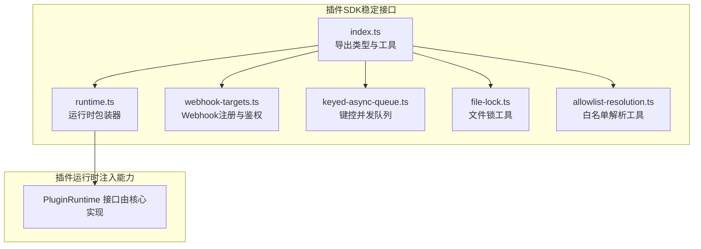
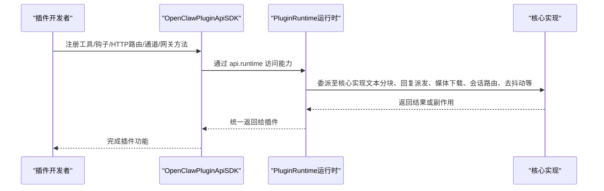
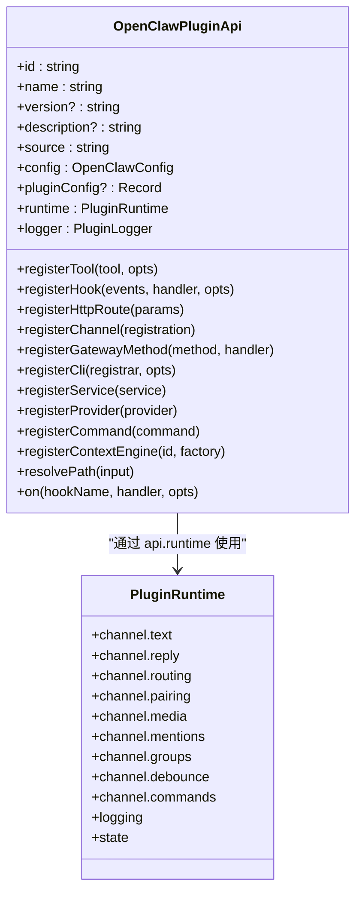
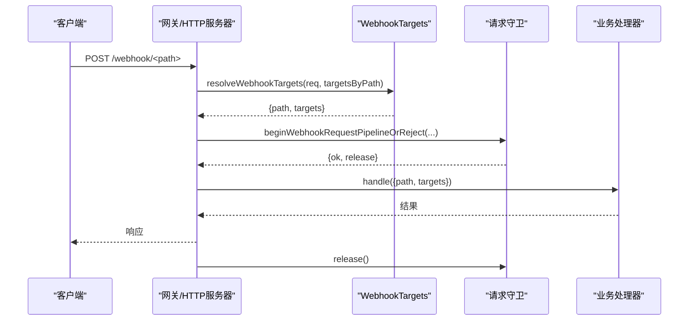
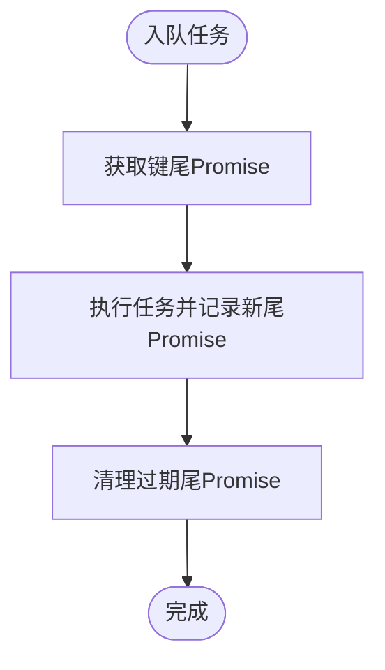
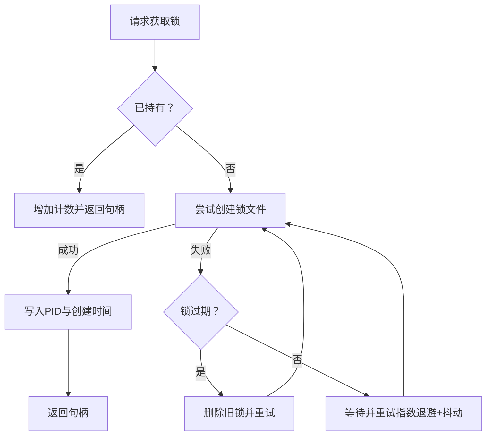
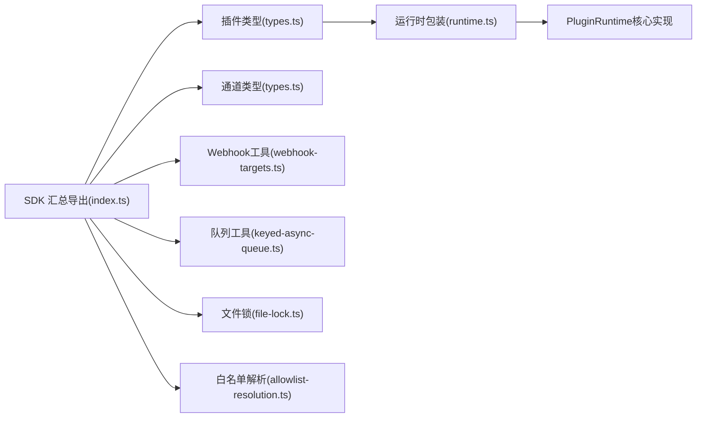

# 插件开发SDK

<cite>
**本文引用的文件**
- [index.ts](file://src/plugin-sdk/index.ts)
- [runtime.ts](file://src/plugin-sdk/runtime.ts)
- [plugin-sdk.md](file://docs/refactor/plugin-sdk.md)
- [types.ts](file://src/plugins/types.ts)
- [types.ts（通道插件）](file://src/channels/plugins/types.ts)
- [manifest.md](file://docs/plugins/manifest.md)
- [webhook-targets.ts](file://src/plugin-sdk/webhook-targets.ts)
- [keyed-async-queue.ts](file://src/plugin-sdk/keyed-async-queue.ts)
- [file-lock.ts](file://src/plugin-sdk/file-lock.ts)
- [allowlist-resolution.ts](file://src/plugin-sdk/allowlist-resolution.ts)
</cite>

## 目录

1. [简介](#简介)
2. [项目结构](#项目结构)
3. [核心组件](#核心组件)
4. [架构总览](#架构总览)
5. [详细组件分析](#详细组件分析)
6. [依赖关系分析](#依赖关系分析)
7. [性能考量](#性能考量)
8. [故障排查指南](#故障排查指南)
9. [结论](#结论)
10. [附录](#附录)

## 简介

本指南面向希望基于 OpenClaw 构建“插件”的开发者，系统性介绍插件开发SDK的API、接口规范、工具与最佳实践。内容覆盖：

- SDK 暴露的类型与工具函数
- 插件生命周期与注册机制
- 配置清单与元数据定义
- Webhook 注册与鉴权流程
- 并发控制与资源锁
- 版本兼容与迁移策略
- 调试、测试与开发环境配置

## 项目结构

OpenClaw 将“插件SDK”与“运行时”分层设计：SDK 提供稳定编译期接口与工具；运行时注入到插件中，统一访问核心能力。

图表来源

- [index.ts:1-826](file://src/plugin-sdk/index.ts#L1-L826)
- [runtime.ts:1-45](file://src/plugin-sdk/runtime.ts#L1-L45)
- [webhook-targets.ts:1-282](file://src/plugin-sdk/webhook-targets.ts#L1-L282)
- [keyed-async-queue.ts:1-49](file://src/plugin-sdk/keyed-async-queue.ts#L1-L49)
- [file-lock.ts:1-162](file://src/plugin-sdk/file-lock.ts#L1-L162)
- [allowlist-resolution.ts:1-31](file://src/plugin-sdk/allowlist-resolution.ts#L1-L31)

章节来源

- [index.ts:1-826](file://src/plugin-sdk/index.ts#L1-L826)
- [plugin-sdk.md:1-215](file://docs/refactor/plugin-sdk.md#L1-L215)

## 核心组件

- 插件API与类型
  - OpenClawPluginApi：插件注册入口，包括工具、钩子、HTTP路由、通道、网关方法、CLI、服务、提供商等注册能力。
  - OpenClawPluginDefinition/OpenClawPluginModule：插件声明与模块化形式。
  - OpenClawPluginConfigSchema：插件配置Schema与UI提示。
- 运行时环境
  - RuntimeEnv：日志、错误、退出抽象，支持从外部logger注入。
  - createLoggerBackedRuntime/resolveRuntimeEnv：构建与解析运行时环境。
- 通道插件类型
  - ChannelPlugin 及适配器类型：认证、命令、配置、目录、心跳、登出、消息动作、消息传递、安全、设置、状态、流式传输、线程、工具发送等。
- 工具与辅助
  - Webhook 注册与鉴权、速率限制、并发控制、文件锁、白名单解析、SSRF策略、JSON读写、临时路径、Windows可执行解析等。

章节来源

- [types.ts:263-306](file://src/plugins/types.ts#L263-L306)
- [types.ts:44-56](file://src/plugins/types.ts#L44-L56)
- [types.ts（通道插件）:1-66](file://src/channels/plugins/types.ts#L1-L66)
- [runtime.ts:9-32](file://src/plugin-sdk/runtime.ts#L9-L32)
- [index.ts:1-826](file://src/plugin-sdk/index.ts#L1-L826)

## 架构总览

SDK 与运行时的职责分离，确保插件仅通过 SDK 类型与运行时接口访问核心行为，避免直接导入 src/\*\* 导致升级脆弱。

图表来源

- [plugin-sdk.md:40-144](file://docs/refactor/plugin-sdk.md#L40-L144)
- [types.ts:263-306](file://src/plugins/types.ts#L263-L306)

章节来源

- [plugin-sdk.md:1-215](file://docs/refactor/plugin-sdk.md#L1-L215)

## 详细组件分析

### 组件A：插件API与生命周期

- 注册能力
  - registerTool/registerHook/registerHttpRoute/registerChannel/registerGatewayMethod/registerCli/registerService/registerProvider/registerCommand/registerContextEngine/on 等。
- 上下文与配置
  - OpenClawPluginToolContext/OpenClawPluginServiceContext/OpenClawPluginCliContext 等上下文对象。
  - OpenClawPluginConfigSchema 支持 safeParse/parse/validate/uiHints/jsonSchema。
- 生命周期钩子
  - 包含 before_model_resolve/before_prompt_build/before_agent_start/llm_input/llm_output/agent_end 等。
  - 消息、工具调用、会话、子代理、网关等事件钩子。
- 命令与HTTP路由
  - OpenClawPluginCommandDefinition：名称、描述、是否需要鉴权、参数、处理器。
  - OpenClawPluginHttpRouteParams：路径、处理器、鉴权方式、匹配策略。

图表来源

- [types.ts:263-306](file://src/plugins/types.ts#L263-L306)
- [plugin-sdk.md:48-144](file://docs/refactor/plugin-sdk.md#L48-L144)

章节来源

- [types.ts:1-893](file://src/plugins/types.ts#L1-L893)

### 组件B：Webhook 注册与鉴权流程

- 注册
  - registerWebhookTargetWithPluginRoute：为路径首次绑定时自动注册HTTP路由。
  - registerWebhookTarget：向目标映射表注册，支持首次/最后回调。
- 解析与执行
  - resolveWebhookTargets：按请求路径解析目标集合。
  - withResolvedWebhookRequestPipeline：统一请求管线（方法校验、速率限制、并发限制、JSON读取、鉴权、处理）。
- 单目标匹配
  - resolveSingleWebhookTarget/resolveSingleWebhookTargetAsync：单目标匹配，支持歧义与未授权处理。
  - resolveWebhookTargetWithAuthOrReject/resolveWebhookTargetWithAuthOrRejectSync：鉴权后返回目标或拒绝。

图表来源

- [webhook-targets.ts:102-162](file://src/plugin-sdk/webhook-targets.ts#L102-L162)

章节来源

- [webhook-targets.ts:1-282](file://src/plugin-sdk/webhook-targets.ts#L1-L282)

### 组件C：键控异步队列（并发控制）

- 功能
  - enqueueKeyedTask：按键串行化任务，保证同一键的任务顺序执行。
  - KeyedAsyncQueue：封装键尾Promise映射，提供enqueue方法。
- 应用场景
  - 同一会话/账户的并发操作串行化，避免竞态。

图表来源

- [keyed-async-queue.ts:6-31](file://src/plugin-sdk/keyed-async-queue.ts#L6-L31)

章节来源

- [keyed-async-queue.ts:1-49](file://src/plugin-sdk/keyed-async-queue.ts#L1-L49)

### 组件D：文件锁（跨进程互斥）

- 能力
  - acquireFileLock：带重试与过期检测的文件锁获取。
  - withFileLock：在锁保护下执行回调。
  - 释放与去重计数：多处持有共享句柄，按需关闭与删除锁文件。
- 参数
  - retries（次数、因子、最小/最大超时、随机抖动）、stale（过期阈值）。
- 典型用途
  - 保证同一文件在同一时刻仅被一个进程持有，避免竞态。

图表来源

- [file-lock.ts:103-148](file://src/plugin-sdk/file-lock.ts#L103-L148)

章节来源

- [file-lock.ts:1-162](file://src/plugin-sdk/file-lock.ts#L1-L162)

### 组件E：白名单解析工具

- mapBasicAllowlistResolutionEntries：标准化条目输出。
- mapAllowlistResolutionInputs：批量输入映射，保持顺序与同步。

章节来源

- [allowlist-resolution.ts:1-31](file://src/plugin-sdk/allowlist-resolution.ts#L1-L31)

## 依赖关系分析

- SDK 对运行时的依赖
  - 插件通过 OpenClawPluginApi.runtime 访问核心能力，避免直接导入 src/\*\*。
- SDK 内部模块耦合
  - index.ts 汇总导出类型与工具，形成稳定的SDK面。
- 运行时契约
  - plugin-sdk.md 中定义了 PluginRuntime 的最小完备表面，确保各通道适配器与SDK解耦。

图表来源

- [index.ts:1-826](file://src/plugin-sdk/index.ts#L1-L826)
- [types.ts:1-893](file://src/plugins/types.ts#L1-L893)
- [types.ts（通道插件）:1-66](file://src/channels/plugins/types.ts#L1-L66)
- [webhook-targets.ts:1-282](file://src/plugin-sdk/webhook-targets.ts#L1-L282)
- [keyed-async-queue.ts:1-49](file://src/plugin-sdk/keyed-async-queue.ts#L1-L49)
- [file-lock.ts:1-162](file://src/plugin-sdk/file-lock.ts#L1-L162)
- [allowlist-resolution.ts:1-31](file://src/plugin-sdk/allowlist-resolution.ts#L1-L31)
- [runtime.ts:1-45](file://src/plugin-sdk/runtime.ts#L1-L45)
- [plugin-sdk.md:40-144](file://docs/refactor/plugin-sdk.md#L40-L144)

章节来源

- [plugin-sdk.md:1-215](file://docs/refactor/plugin-sdk.md#L1-L215)

## 性能考量

- 请求管线与限流
  - 使用速率限制与并发限制器，避免过载。
  - 采用幂等路径规范化与一次性注册，减少重复开销。
- 并发串行化
  - 键控队列确保同键任务串行，降低竞争与抖动。
- 文件锁与重试
  - 指数退避+抖动，降低锁竞争冲突概率。
- 文本与媒体
  - 文本分块、媒体下载与保存采用缓冲与字节上限控制，避免内存峰值。

## 故障排查指南

- 配置验证失败
  - 检查 openclaw.plugin.json 是否存在且符合要求；确认 JSON Schema 是否严格。
- Webhook 未命中
  - 确认路径规范化与注册时机；检查是否为最后一个目标导致路由被卸载。
- 鉴权失败
  - 检查 resolveWebhookTargetWithAuthOrReject 的匹配逻辑与状态码。
- 并发问题
  - 使用键控队列对关键路径进行串行化。
- 文件锁超时
  - 调整 retries/stale 参数，确认锁文件所在卷支持原子创建。

章节来源

- [manifest.md:1-76](file://docs/plugins/manifest.md#L1-L76)
- [webhook-targets.ts:222-271](file://src/plugin-sdk/webhook-targets.ts#L222-L271)
- [file-lock.ts:103-148](file://src/plugin-sdk/file-lock.ts#L103-L148)

## 结论

OpenClaw 插件SDK以“稳定SDK + 注入运行时”的双层架构，提供了统一、可演进的插件开发体验。通过严格的配置清单、完善的工具集与清晰的生命周期钩子，开发者可以快速构建高质量插件，并在不侵入核心的前提下扩展能力。

## 附录

### 插件清单与元数据

- 必填字段
  - id：插件标识
  - configSchema：插件配置的 JSON Schema
- 可选字段
  - kind、channels、providers、skills、name、description、uiHints、version
- 行为约束
  - 缺失或无效清单将阻断配置验证；未知 channels/providers 或插件ID将报错；禁用插件保留配置并告警。

章节来源

- [manifest.md:1-76](file://docs/plugins/manifest.md#L1-L76)

### 开发示例与模板（步骤指引）

- 创建 openclaw.plugin.json（参考清单规范）
- 在插件根目录导出模块（OpenClawPluginDefinition 或工厂函数）
- 在 register/activate 中使用 api.register\* 完成注册
- 如需HTTP端点，使用 registerHttpRoute 或 registerWebhookTargetWithPluginRoute
- 如需通道适配，实现 ChannelPlugin 并通过 registerChannel 注册
- 如需命令，使用 registerCommand 定义无AI推理的简单命令
- 如需服务，使用 registerService 实现启动/停止
- 如需提供商，使用 registerProvider 注册凭据与模型

章节来源

- [types.ts:248-261](file://src/plugins/types.ts#L248-L261)
- [types.ts:273-293](file://src/plugins/types.ts#L273-L293)
- [types.ts（通道插件）:1-66](file://src/channels/plugins/types.ts#L1-L66)
- [webhook-targets.ts:27-42](file://src/plugin-sdk/webhook-targets.ts#L27-L42)

### 最佳实践

- 仅通过 api.runtime 访问核心能力，避免直接导入 src/\*\*
- 使用键控队列串行化关键路径
- 为Webhook设置速率限制与并发限制
- 严格编写 JSON Schema 并提供 uiHints
- 使用文件锁保护共享资源
- 利用钩子进行非侵入式扩展

章节来源

- [plugin-sdk.md:11-19](file://docs/refactor/plugin-sdk.md#L11-L19)
- [webhook-targets.ts:115-162](file://src/plugin-sdk/webhook-targets.ts#L115-L162)
- [keyed-async-queue.ts:40-47](file://src/plugin-sdk/keyed-async-queue.ts#L40-L47)
- [file-lock.ts:103-148](file://src/plugin-sdk/file-lock.ts#L103-L148)
- [manifest.md:47-69](file://docs/plugins/manifest.md#L47-L69)
