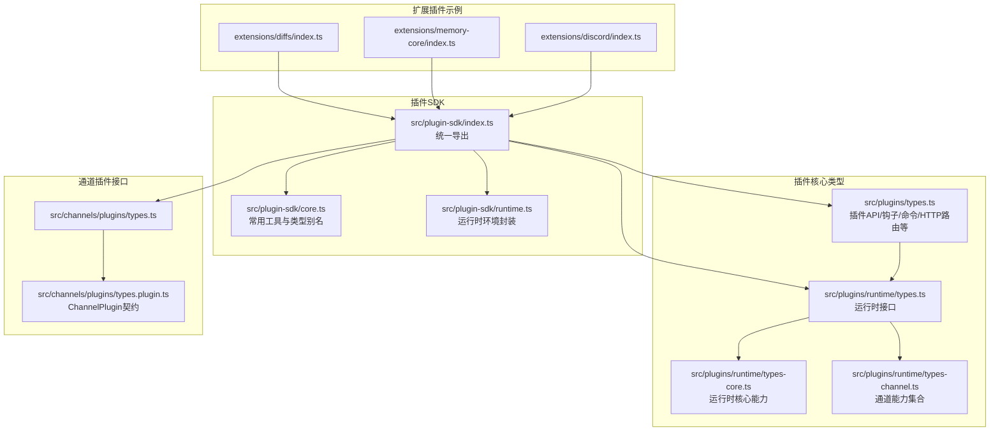
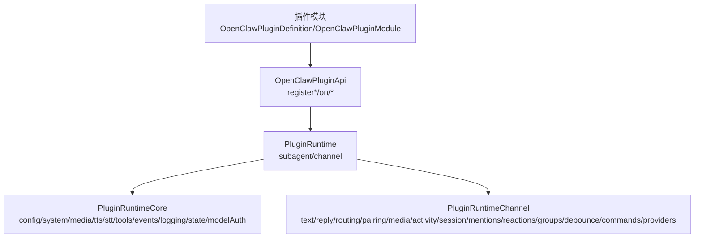
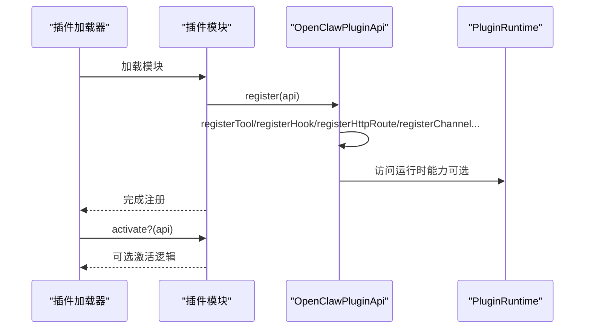
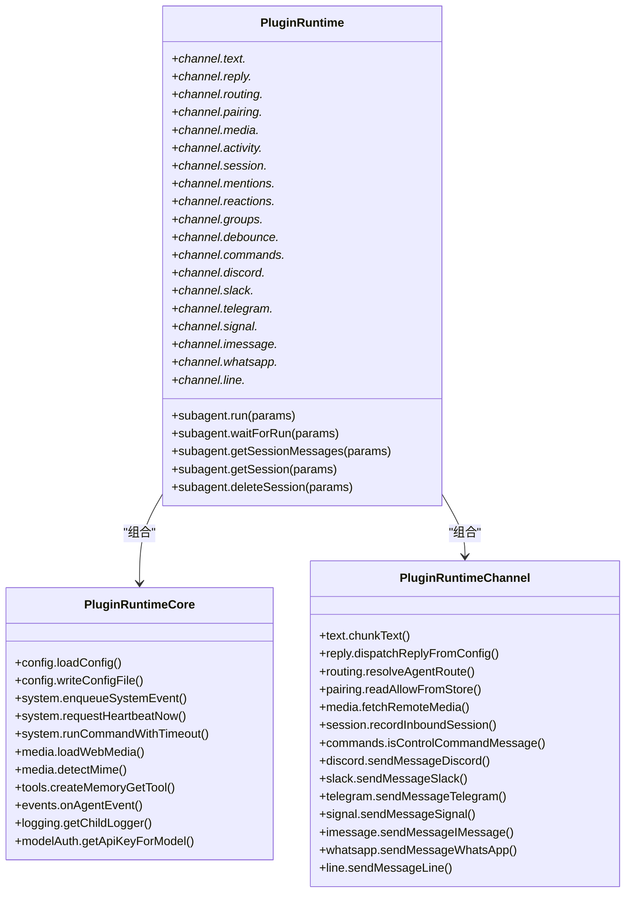
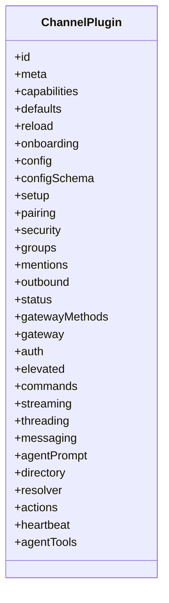
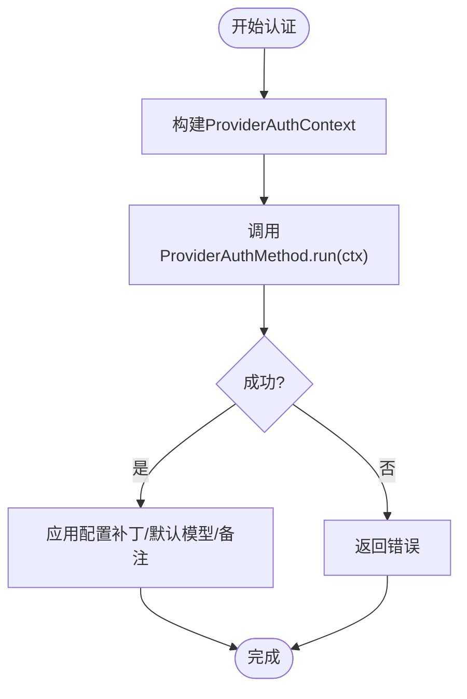
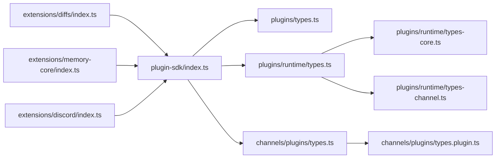

# 核心API接口

<cite>
**本文档引用的文件**
- [index.ts](file://src/plugin-sdk/index.ts)
- [types.ts](file://src/plugins/types.ts)
- [runtime/types.ts](file://src/plugins/runtime/types.ts)
- [runtime/types-core.ts](file://src/plugins/runtime/types-core.ts)
- [runtime/types-channel.ts](file://src/plugins/runtime/types-channel.ts)
- [types.ts](file://src/channels/plugins/types.ts)
- [types.plugin.ts](file://src/channels/plugins/types.plugin.ts)
- [core.ts](file://src/plugin-sdk/core.ts)
- [runtime.ts](file://src/plugin-sdk/runtime.ts)
- [index.ts](file://extensions/diffs/index.ts)
- [index.ts](file://extensions/memory-core/index.ts)
- [index.ts](file://extensions/discord/index.ts)
</cite>

## 目录

1. [简介](#简介)
2. [项目结构](#项目结构)
3. [核心组件](#核心组件)
4. [架构总览](#架构总览)
5. [详细组件分析](#详细组件分析)
6. [依赖关系分析](#依赖关系分析)
7. [性能考量](#性能考量)
8. [故障排查指南](#故障排查指南)
9. [结论](#结论)
10. [附录：API参考手册](#附录api参考手册)

## 简介

本文件系统性梳理 OpenClaw 插件SDK的核心API接口，覆盖插件生命周期管理、事件钩子体系、消息路由与通道适配、运行时能力（子代理、媒体、TTS/STT、工具）、HTTP/Webhook 路由注册、认证与配置校验等关键能力。文档面向不同技术背景读者，既提供高层架构视图，也给出代码级参考与调用流程图，帮助开发者快速实现插件接口、正确处理事件并管理资源。

## 项目结构

插件SDK位于 src/plugin-sdk 与 src/plugins 下，核心导出通过 index.ts 汇总；通道插件接口在 src/channels/plugins 下定义；扩展插件示例位于 extensions/\*。

**图表来源**

- [index.ts:1-826](file://src/plugin-sdk/index.ts#L1-L826)
- [types.ts:1-893](file://src/plugins/types.ts#L1-L893)
- [runtime/types.ts:1-64](file://src/plugins/runtime/types.ts#L1-L64)
- [runtime/types-core.ts:1-68](file://src/plugins/runtime/types-core.ts#L1-L68)
- [runtime/types-channel.ts:1-166](file://src/plugins/runtime/types-channel.ts#L1-L166)
- [types.ts:1-66](file://src/channels/plugins/types.ts#L1-L66)
- [types.plugin.ts:1-86](file://src/channels/plugins/types.plugin.ts#L1-L86)
- [core.ts:1-44](file://src/plugin-sdk/core.ts#L1-L44)
- [runtime.ts:1-45](file://src/plugin-sdk/runtime.ts#L1-L45)
- [index.ts:1-45](file://extensions/diffs/index.ts#L1-L45)
- [index.ts:1-39](file://extensions/memory-core/index.ts#L1-L39)
- [index.ts:1-20](file://extensions/discord/index.ts#L1-L20)

**章节来源**

- [index.ts:1-826](file://src/plugin-sdk/index.ts#L1-L826)
- [types.ts:1-893](file://src/plugins/types.ts#L1-L893)
- [runtime/types.ts:1-64](file://src/plugins/runtime/types.ts#L1-L64)
- [runtime/types-core.ts:1-68](file://src/plugins/runtime/types-core.ts#L1-L68)
- [runtime/types-channel.ts:1-166](file://src/plugins/runtime/types-channel.ts#L1-L166)
- [types.ts:1-66](file://src/channels/plugins/types.ts#L1-L66)
- [types.plugin.ts:1-86](file://src/channels/plugins/types.plugin.ts#L1-L86)
- [core.ts:1-44](file://src/plugin-sdk/core.ts#L1-L44)
- [runtime.ts:1-45](file://src/plugin-sdk/runtime.ts#L1-L45)
- [index.ts:1-45](file://extensions/diffs/index.ts#L1-L45)
- [index.ts:1-39](file://extensions/memory-core/index.ts#L1-L39)
- [index.ts:1-20](file://extensions/discord/index.ts#L1-L20)

## 核心组件

- 插件API与生命周期
  - OpenClawPluginApi：插件注册入口，提供 registerTool、registerHook、registerHttpRoute、registerChannel、registerGatewayMethod、registerCli、registerService、registerProvider、registerCommand、registerContextEngine、resolvePath、on 等方法。
  - OpenClawPluginDefinition/OpenClawPluginModule：插件定义与模块化注册。
  - 生命周期钩子：before*model_resolve、before_prompt_build、before_agent_start、llm_input、llm_output、agent_end、compaction、reset、message*_、tool\__、session*\*、subagent*_、gateway\__ 等。
- 运行时能力
  - PluginRuntime：聚合 PluginRuntimeCore 与 PluginRuntimeChannel，提供子代理运行、会话查询、通道能力等。
  - PluginRuntimeCore：配置读写、系统事件、命令执行、媒体/语音/音频、工具、事件订阅、日志、状态目录、模型鉴权等。
  - PluginRuntimeChannel：文本分块、回复派发、路由、配对、媒体拉取存储、活动记录、会话元数据、提及/反应/群组策略、防抖、命令授权、各通道特有能力（Discord/Slack/Telegram/Signal/iMessage/WhatsApp/LINE）。
- 通道插件接口
  - ChannelPlugin：定义通道能力契约（配置、安全、群组、提及、出站、状态、网关、认证、提升权限、命令、流式、线程、消息、代理提示、目录、解析器、动作、心跳、代理工具等）。
  - Channel\*Adapter 类型族：适配器抽象，承载通道特定实现。
- 认证与配置
  - ProviderAuthMethod/ProviderAuthContext/ProviderAuthResult：提供方认证流程与结果。
  - OpenClawPluginConfigSchema：插件配置校验与UI提示。
- HTTP/Webhook
  - OpenClawPluginHttpRouteParams：HTTP路由注册（路径、处理器、鉴权模式、匹配策略、替换行为）。
  - Webhook 相关工具：目标注册、鉴权解析、请求守卫、内存限流与异常追踪。

**章节来源**

- [types.ts:263-306](file://src/plugins/types.ts#L263-L306)
- [types.ts:321-372](file://src/plugins/types.ts#L321-L372)
- [runtime/types.ts:51-63](file://src/plugins/runtime/types.ts#L51-L63)
- [runtime/types-core.ts:10-67](file://src/plugins/runtime/types-core.ts#L10-L67)
- [runtime/types-channel.ts:16-165](file://src/plugins/runtime/types-channel.ts#L16-L165)
- [types.ts:7-65](file://src/channels/plugins/types.ts#L7-L65)
- [types.plugin.ts:49-85](file://src/channels/plugins/types.plugin.ts#L49-L85)
- [types.ts:44-56](file://src/plugins/types.ts#L44-L56)
- [types.ts:114-132](file://src/plugins/types.ts#L114-L132)
- [types.ts:208-219](file://src/plugins/types.ts#L208-L219)

## 架构总览

下图展示插件SDK从“插件模块”到“通道适配器”的整体交互，以及运行时能力的分层组织。

**图表来源**

- [types.ts:248-261](file://src/plugins/types.ts#L248-L261)
- [types.ts:263-306](file://src/plugins/types.ts#L263-L306)
- [runtime/types.ts:51-63](file://src/plugins/runtime/types.ts#L51-L63)
- [runtime/types-core.ts:10-67](file://src/plugins/runtime/types-core.ts#L10-L67)
- [runtime/types-channel.ts:16-165](file://src/plugins/runtime/types-channel.ts#L16-L165)

## 详细组件分析

### 组件A：插件API与生命周期

- 关键职责
  - 注册工具：支持工厂函数或直接工具数组，可指定名称或别名。
  - 注册钩子：按事件名注册处理器，支持优先级。
  - 注册HTTP路由：支持精确匹配或前缀匹配，鉴权模式为“网关侧”或“插件侧”。
  - 注册通道：将 ChannelPlugin 注册到运行时。
  - 注册网关方法：注册服务端方法处理器。
  - 注册CLI：向命令行程序注册子命令。
  - 注册服务：启动/停止生命周期服务。
  - 注册提供方：注册认证方法与模型配置。
  - 注册自定义命令：绕过LLM的简单命令处理。
  - 注册上下文引擎：独占槽位，仅允许一个生效。
  - 路径解析与生命周期事件：resolvePath、on。
- 典型调用顺序
  - 插件加载后，先执行 register，再执行 activate（如定义）。
  - 在 register 中完成工具、钩子、HTTP路由、通道、网关方法、CLI、服务、提供方、命令、上下文引擎的注册。
- 错误处理
  - 钩子处理器应捕获异常并返回安全结果，避免中断主流程。
  - HTTP路由处理器需明确返回布尔值指示是否已处理，以便框架继续后续匹配。

**图表来源**

- [types.ts:248-261](file://src/plugins/types.ts#L248-L261)
- [types.ts:263-306](file://src/plugins/types.ts#L263-L306)

**章节来源**

- [types.ts:263-306](file://src/plugins/types.ts#L263-L306)
- [types.ts:321-372](file://src/plugins/types.ts#L321-L372)

### 组件B：运行时能力（子代理与通道）

- 子代理运行
  - run：提交会话消息，返回 runId。
  - waitForRun：等待运行结束，返回状态与错误信息。
  - getSessionMessages：获取会话消息列表。
  - getSession：已废弃，使用 getSessionMessages 替代。
  - deleteSession：删除会话（可选删除转录）。
- 通道能力
  - 文本：分块、控制命令检测、Markdown表格处理。
  - 回复：带打字反馈的派发器、从配置派发、入站上下文收尾、信封格式化。
  - 路由：构建会话键、解析路由。
  - 配对：构建配对回复、读取/更新允许来源。
  - 媒体：远程媒体抓取、保存缓冲区。
  - 活动：记录/获取通道活动。
  - 会话：会话存储路径、更新时间、入站会话记录、最后路由更新。
  - 提及/反应/群组：正则构建、提及匹配、反应策略、群组策略与要求提及。
  - 防抖：入站防抖器与延迟解析。
  - 命令：授权解析、控制命令识别、是否处理文本命令。
  - 各通道特有能力：Discord/Slack/Telegram/Signal/iMessage/WhatsApp/LINE 的探测、发送、监控、目录、权限审计等。

**图表来源**

- [runtime/types.ts:51-63](file://src/plugins/runtime/types.ts#L51-L63)
- [runtime/types-core.ts:10-67](file://src/plugins/runtime/types-core.ts#L10-L67)
- [runtime/types-channel.ts:16-165](file://src/plugins/runtime/types-channel.ts#L16-L165)

**章节来源**

- [runtime/types.ts:8-63](file://src/plugins/runtime/types.ts#L8-L63)
- [runtime/types-core.ts:10-67](file://src/plugins/runtime/types-core.ts#L10-L67)
- [runtime/types-channel.ts:16-165](file://src/plugins/runtime/types-channel.ts#L16-L165)

### 组件C：通道插件接口

- ChannelPlugin 契约
  - 必填：id、meta、capabilities。
  - 可选：defaults、reload、onboarding、config/configSchema、setup、pairing、security、groups、mentions、outbound、status、gatewayMethods、gateway、auth、elevated、commands、streaming、threading、messaging、agentPrompt、directory、resolver、actions、heartbeat、agentTools。
- 适配器族
  - Channel\*Adapter：认证、命令、配置、目录、解析、提升权限、网关、群组、心跳、登出、登录、安全、设置、状态、流式、线程、消息、工具等。

**图表来源**

- [types.plugin.ts:49-85](file://src/channels/plugins/types.plugin.ts#L49-L85)

**章节来源**

- [types.ts:7-65](file://src/channels/plugins/types.ts#L7-L65)
- [types.plugin.ts:49-85](file://src/channels/plugins/types.plugin.ts#L49-L85)

### 组件D：认证与配置

- ProviderAuthMethod
  - id/label/kind/run：定义认证方式与执行流程。
  - ProviderAuthContext：包含配置、工作空间、提示器、运行时、远程标记、打开URL回调、OAuth处理器。
  - ProviderAuthResult：返回认证档案、配置补丁、默认模型、备注。
- 配置校验
  - OpenClawPluginConfigSchema：支持 safeParse/parse/validate/uiHints/jsonSchema。

**图表来源**

- [types.ts:114-132](file://src/plugins/types.ts#L114-L132)
- [types.ts:44-56](file://src/plugins/types.ts#L44-L56)

**章节来源**

- [types.ts:44-56](file://src/plugins/types.ts#L44-L56)
- [types.ts:114-132](file://src/plugins/types.ts#L114-L132)

### 组件E：HTTP/Webhook 路由

- OpenClawPluginHttpRouteParams
  - path/handler/auth(match/replaceExisting)：精确匹配或前缀匹配，支持替换已有路由。
- Webhook 工具
  - 目标注册与鉴权解析、请求守卫（内容类型、请求体大小限制、并发限制）、异常追踪与计数器。

**章节来源**

- [types.ts:208-219](file://src/plugins/types.ts#L208-L219)
- [index.ts:149-175](file://src/plugin-sdk/index.ts#L149-L175)

### 组件F：运行时环境封装

- createLoggerBackedRuntime/resolveRuntimeEnv/resolveRuntimeEnvWithUnavailableExit
  - 将外部 Logger 包装为 RuntimeEnv，提供 log/error/exit 接口，并支持不可用退出场景。

**章节来源**

- [runtime.ts:9-44](file://src/plugin-sdk/runtime.ts#L9-L44)

## 依赖关系分析

- 插件SDK导出汇总于 index.ts，统一暴露类型与工具，便于扩展插件按需导入。
- 插件API依赖运行时类型，运行时类型进一步依赖核心与通道能力。
- 通道插件接口独立于具体通道实现，通过 Adapter 抽象解耦。
- 扩展插件示例展示了 register/on/registerChannel/registerTool/registerHttpRoute 的典型用法。

**图表来源**

- [index.ts:1-826](file://src/plugin-sdk/index.ts#L1-L826)
- [types.ts:1-893](file://src/plugins/types.ts#L1-L893)
- [runtime/types.ts:1-64](file://src/plugins/runtime/types.ts#L1-L64)
- [runtime/types-core.ts:1-68](file://src/plugins/runtime/types-core.ts#L1-L68)
- [runtime/types-channel.ts:1-166](file://src/plugins/runtime/types-channel.ts#L1-L166)
- [types.ts:1-66](file://src/channels/plugins/types.ts#L1-L66)
- [types.plugin.ts:1-86](file://src/channels/plugins/types.plugin.ts#L1-L86)
- [index.ts:1-45](file://extensions/diffs/index.ts#L1-L45)
- [index.ts:1-39](file://extensions/memory-core/index.ts#L1-L39)
- [index.ts:1-20](file://extensions/discord/index.ts#L1-L20)

**章节来源**

- [index.ts:1-826](file://src/plugin-sdk/index.ts#L1-L826)
- [types.ts:1-893](file://src/plugins/types.ts#L1-L893)
- [runtime/types.ts:1-64](file://src/plugins/runtime/types.ts#L1-L64)
- [runtime/types-core.ts:1-68](file://src/plugins/runtime/types-core.ts#L1-L68)
- [runtime/types-channel.ts:1-166](file://src/plugins/runtime/types-channel.ts#L1-L166)
- [types.ts:1-66](file://src/channels/plugins/types.ts#L1-L66)
- [types.plugin.ts:1-86](file://src/channels/plugins/types.plugin.ts#L1-L86)
- [index.ts:1-45](file://extensions/diffs/index.ts#L1-L45)
- [index.ts:1-39](file://extensions/memory-core/index.ts#L1-L39)
- [index.ts:1-20](file://extensions/discord/index.ts#L1-L20)

## 性能考量

- 子代理运行
  - 使用 idempotencyKey 避免重复执行。
  - 合理设置 lane，隔离高负载任务。
- 媒体与I/O
  - 复用媒体下载与存储，避免重复抓取。
  - 分块策略与并发限制结合，平衡吞吐与资源占用。
- 钩子链路
  - 钩子处理器应尽量轻量，复杂逻辑异步化，避免阻塞主流程。
- Webhook
  - 合理设置请求体大小限制与并发窗口，启用异常追踪与限流。

[本节为通用指导，无需列出章节来源]

## 故障排查指南

- 配置校验失败
  - 使用 OpenClawPluginConfigSchema.validate，检查返回的错误列表。
- HTTP路由未生效
  - 确认路径与匹配策略（exact/prefix），检查 replaceExisting 设置。
  - 鉴权模式需与目标一致（gateway/plugin）。
- 运行时退出不可用
  - 使用 resolveRuntimeEnvWithUnavailableExit 提供不可用退出消息。
- Webhook 异常
  - 检查请求体大小限制、内容类型、并发限流与异常计数器。
- 通道能力缺失
  - 确认 ChannelPlugin 的 capabilities 与对应 Adapter 是否完整实现。

**章节来源**

- [types.ts:44-56](file://src/plugins/types.ts#L44-L56)
- [types.ts:208-219](file://src/plugins/types.ts#L208-L219)
- [runtime.ts:34-44](file://src/plugin-sdk/runtime.ts#L34-L44)
- [index.ts:149-175](file://src/plugin-sdk/index.ts#L149-L175)

## 结论

OpenClaw 插件SDK通过清晰的类型体系与分层架构，提供了从插件注册、生命周期管理、事件钩子、运行时能力到通道适配的全栈支持。开发者可基于示例插件快速上手，遵循本文档的接口规范与最佳实践，实现稳定高效的插件功能。

[本节为总结性内容，无需列出章节来源]

## 附录：API参考手册

### 插件API（OpenClawPluginApi）

- 方法
  - registerTool(tool | factory, opts?)：注册工具或工具工厂。
  - registerHook(events, handler, opts?)：注册生命周期钩子。
  - registerHttpRoute(params)：注册HTTP路由。
  - registerChannel(registration | plugin)：注册通道插件。
  - registerGatewayMethod(method, handler)：注册网关方法。
  - registerCli(registrar, opts?)：注册CLI命令。
  - registerService(service)：注册服务（含 start/stop）。
  - registerProvider(provider)：注册提供方认证与模型配置。
  - registerCommand(command)：注册自定义命令。
  - registerContextEngine(id, factory)：注册上下文引擎（独占槽位）。
  - resolvePath(input)：解析绝对路径。
  - on(hookName, handler, opts?)：注册生命周期事件处理器。
- 返回值
  - 以上均为副作用操作，无返回值或返回 Promise<void>。

**章节来源**

- [types.ts:263-306](file://src/plugins/types.ts#L263-L306)

### 生命周期钩子（PluginHookName）

- 钩子列表
  - before_model_resolve、before_prompt_build、before_agent_start、llm_input、llm_output、agent_end、before_compaction、after_compaction、before_reset、message_received、message_sending、message_sent、before_tool_call、after_tool_call、tool_result_persist、before_message_write、session_start、session_end、subagent_spawning、subagent_delivery_target、subagent_spawned、subagent_ended、gateway_start、gateway_stop。
- 事件对象与结果
  - 各钩子对应事件对象与可选结果类型详见 types.ts 中的事件/结果定义。

**章节来源**

- [types.ts:321-372](file://src/plugins/types.ts#L321-L372)
- [types.ts:410-526](file://src/plugins/types.ts#L410-L526)
- [types.ts:606-633](file://src/plugins/types.ts#L606-L633)
- [types.ts:635-669](file://src/plugins/types.ts#L635-L669)
- [types.ts:678-691](file://src/plugins/types.ts#L678-L691)
- [types.ts:716-770](file://src/plugins/types.ts#L716-L770)
- [types.ts:776-784](file://src/plugins/types.ts#L776-L784)

### 运行时接口（PluginRuntime）

- 子代理
  - run(params)：提交消息，返回 runId。
  - waitForRun(params)：等待运行结束，返回状态与错误。
  - getSessionMessages(params)：获取会话消息。
  - getSession(params)：已废弃。
  - deleteSession(params)：删除会话。
- 通道能力
  - text/reply/routing/pairing/media/activity/session/mentions/reactions/groups/debounce/commands/discord/slack/telegram/signal/imessage/whatsapp/line 等。

**章节来源**

- [runtime/types.ts:8-63](file://src/plugins/runtime/types.ts#L8-L63)
- [runtime/types-channel.ts:16-165](file://src/plugins/runtime/types-channel.ts#L16-L165)

### 通道插件（ChannelPlugin）

- 字段
  - id、meta、capabilities、defaults、reload、onboarding、config/configSchema、setup、pairing、security、groups、mentions、outbound、status、gatewayMethods、gateway、auth、elevated、commands、streaming、threading、messaging、agentPrompt、directory、resolver、actions、heartbeat、agentTools。
- 适配器族
  - Channel\*Adapter：认证/命令/配置/目录/解析/提升权限/网关/群组/心跳/登出/登录/安全/设置/状态/流式/线程/消息/工具等。

**章节来源**

- [types.plugin.ts:49-85](file://src/channels/plugins/types.plugin.ts#L49-L85)
- [types.ts:7-65](file://src/channels/plugins/types.ts#L7-L65)

### 认证与配置

- ProviderAuthMethod/ProviderAuthContext/ProviderAuthResult
- OpenClawPluginConfigSchema

**章节来源**

- [types.ts:114-132](file://src/plugins/types.ts#L114-L132)
- [types.ts:44-56](file://src/plugins/types.ts#L44-L56)

### HTTP/Webhook

- OpenClawPluginHttpRouteParams
- Webhook 目标注册、鉴权解析、请求守卫、异常追踪与限流

**章节来源**

- [types.ts:208-219](file://src/plugins/types.ts#L208-L219)
- [index.ts:149-175](file://src/plugin-sdk/index.ts#L149-L175)

### 示例：实现要点

- 工具注册
  - 使用 registerTool(factory, { names }) 注册工具，确保工厂在运行时传入的上下文中可用。
- 生命周期事件
  - 使用 api.on('before_prompt_build', ...) 注册事件处理器，返回系统提示/上下文注入。
- 通道注册
  - 使用 api.registerChannel({ plugin }) 注册通道插件。
- HTTP路由
  - 使用 api.registerHttpRoute({ path, auth, match, handler }) 注册路由。

**章节来源**

- [index.ts:19-41](file://extensions/diffs/index.ts#L19-L41)
- [index.ts:10-35](file://extensions/memory-core/index.ts#L10-L35)
- [index.ts:12-16](file://extensions/discord/index.ts#L12-L16)
