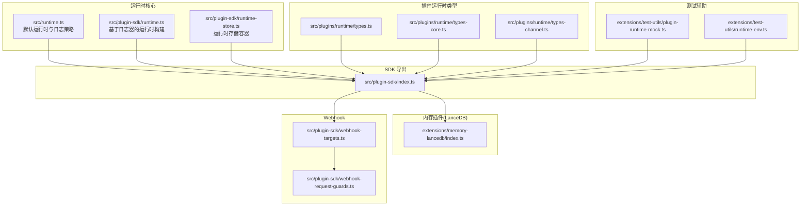
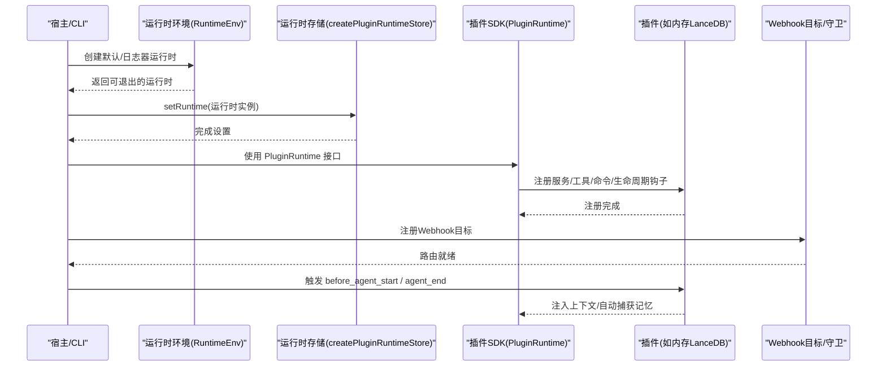
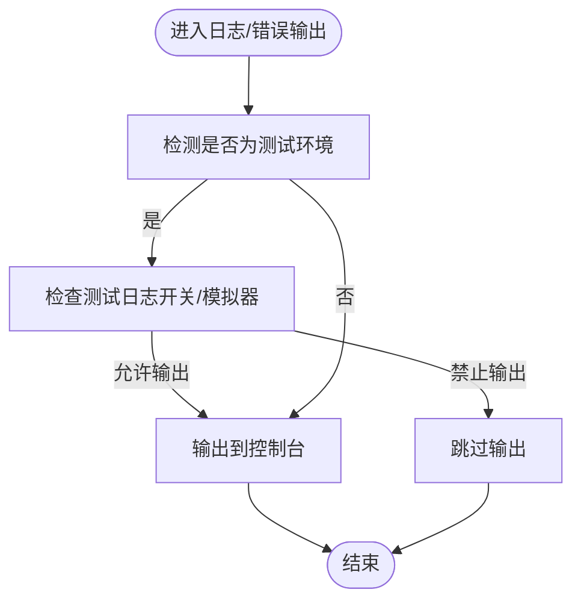
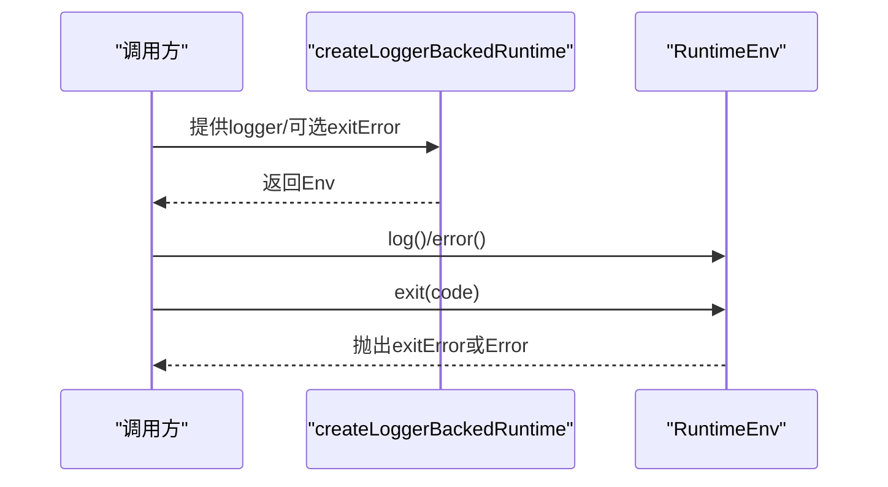
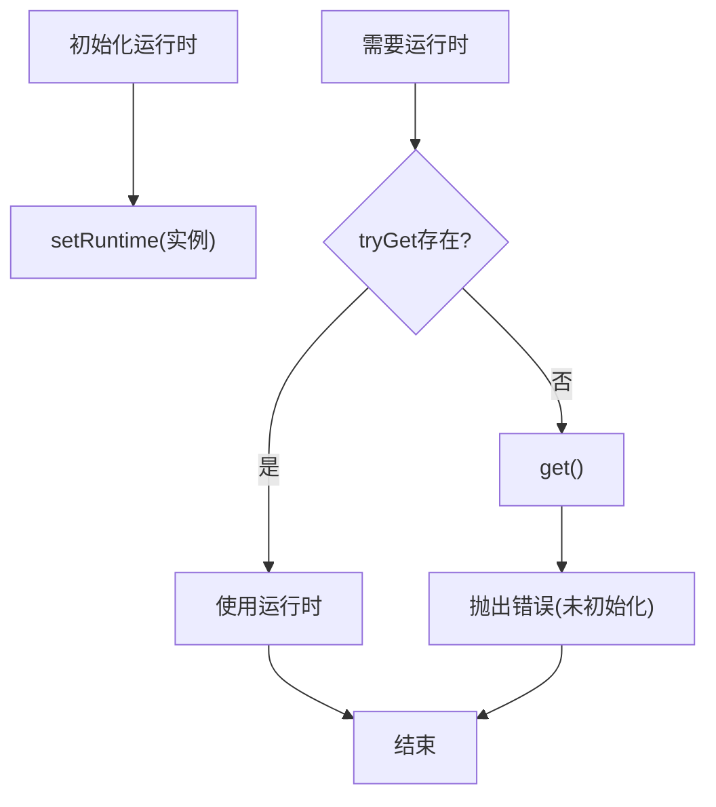
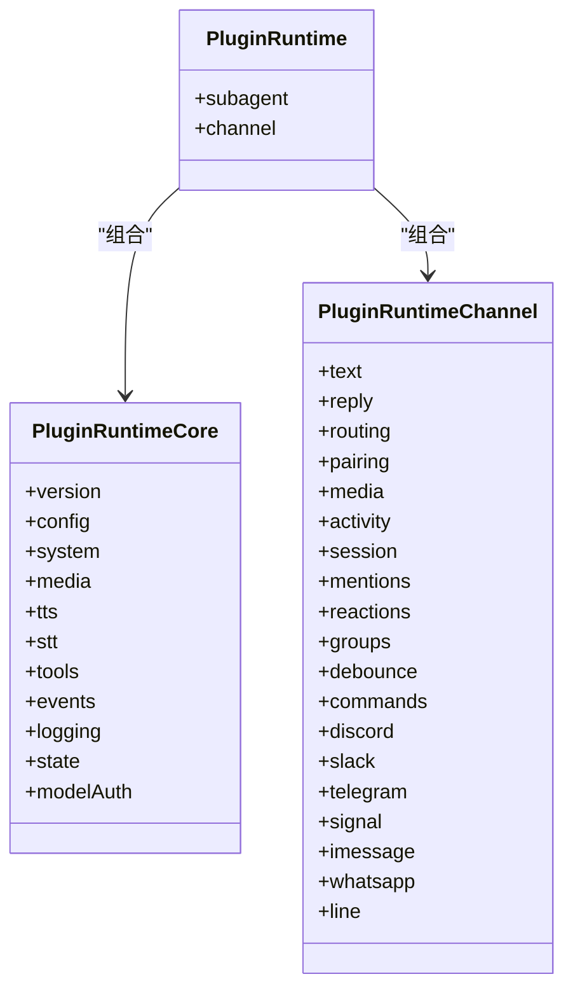
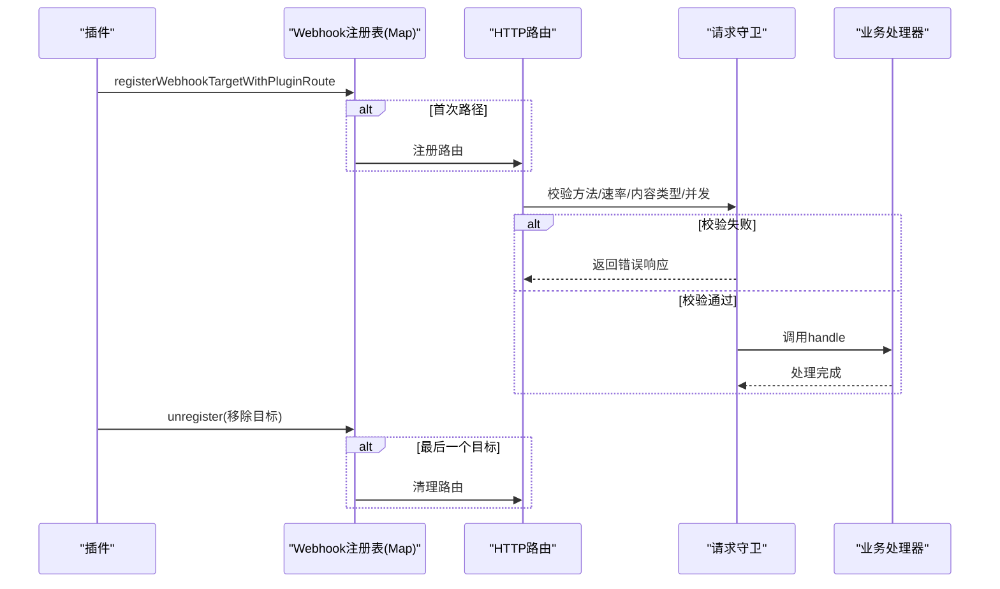
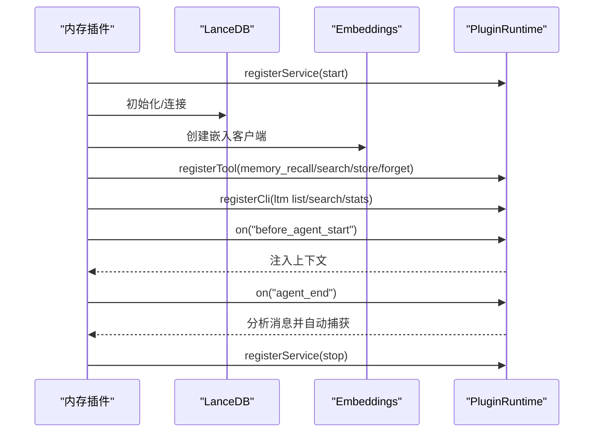
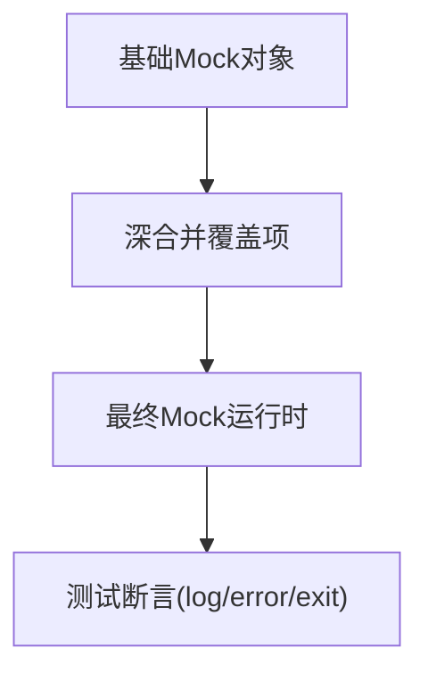
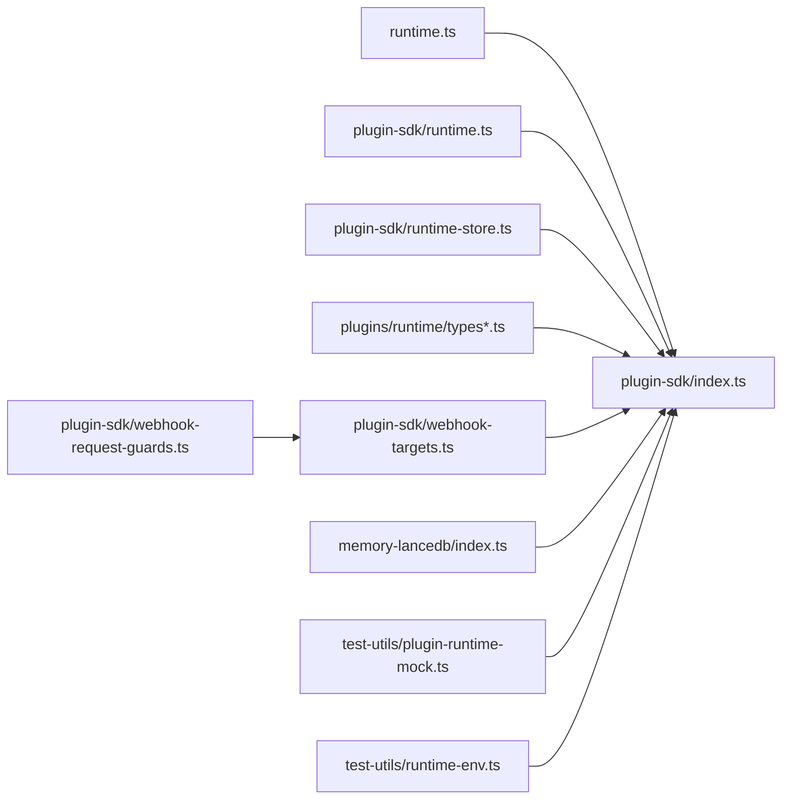

# 运行时环境

<cite>
**本文引用的文件**
- [src/runtime.ts](file://src/runtime.ts)
- [src/plugin-sdk/runtime.ts](file://src/plugin-sdk/runtime.ts)
- [src/plugin-sdk/runtime-store.ts](file://src/plugin-sdk/runtime-store.ts)
- [src/plugin-sdk/index.ts](file://src/plugin-sdk/index.ts)
- [src/plugins/runtime/types.ts](file://src/plugins/runtime/types.ts)
- [src/plugins/runtime/types-core.ts](file://src/plugins/runtime/types-core.ts)
- [src/plugins/runtime/types-channel.ts](file://src/plugins/runtime/types-channel.ts)
- [extensions/test-utils/plugin-runtime-mock.ts](file://extensions/test-utils/plugin-runtime-mock.ts)
- [extensions/test-utils/runtime-env.ts](file://extensions/test-utils/runtime-env.ts)
- [extensions/memory-lancedb/index.ts](file://extensions/memory-lancedb/index.ts)
- [src/plugin-sdk/webhook-targets.ts](file://src/plugin-sdk/webhook-targets.ts)
- [src/plugin-sdk/webhook-request-guards.ts](file://src/plugin-sdk/webhook-request-guards.ts)
</cite>

## 目录

1. [简介](#简介)
2. [项目结构](#项目结构)
3. [核心组件](#核心组件)
4. [架构总览](#架构总览)
5. [详细组件分析](#详细组件分析)
6. [依赖关系分析](#依赖关系分析)
7. [性能考量](#性能考量)
8. [故障排查指南](#故障排查指南)
9. [结论](#结论)
10. [附录](#附录)

## 简介

本文件系统性阐述 OpenClaw 插件运行时环境的设计与实现，覆盖运行时初始化流程、环境配置与日志输出、运行时存储与状态管理、生命周期控制、调试与测试辅助、性能监控与内存管理、并发控制、安全隔离与权限控制、资源限制、错误处理与异常恢复等主题。文档以代码为依据，结合图示帮助读者快速理解运行时在不同平台与场景下的行为。

## 项目结构

围绕“运行时”相关的关键目录与文件如下：

- 核心运行时接口与默认实现：src/runtime.ts
- 插件 SDK 运行时适配与解析：src/plugin-sdk/runtime.ts
- 运行时存储（单例容器）：src/plugin-sdk/runtime-store.ts
- 插件运行时类型定义：src/plugins/runtime/types\*.ts
- 插件 SDK 导出入口：src/plugin-sdk/index.ts
- 测试辅助（运行时 Mock 与环境）：extensions/test-utils/\*
- 内存插件（LanceDB）演示运行时服务注册与生命周期钩子：extensions/memory-lancedb/index.ts
- Webhook 注册与请求防护：src/plugin-sdk/webhook-targets.ts、src/plugin-sdk/webhook-request-guards.ts

**图表来源**

- [src/runtime.ts:1-54](file://src/runtime.ts#L1-L54)
- [src/plugin-sdk/runtime.ts:1-45](file://src/plugin-sdk/runtime.ts#L1-L45)
- [src/plugin-sdk/runtime-store.ts:1-27](file://src/plugin-sdk/runtime-store.ts#L1-L27)
- [src/plugins/runtime/types.ts:1-64](file://src/plugins/runtime/types.ts#L1-L64)
- [src/plugins/runtime/types-core.ts:1-68](file://src/plugins/runtime/types-core.ts#L1-L68)
- [src/plugins/runtime/types-channel.ts:1-166](file://src/plugins/runtime/types-channel.ts#L1-L166)
- [src/plugin-sdk/index.ts:1-826](file://src/plugin-sdk/index.ts#L1-L826)
- [extensions/test-utils/plugin-runtime-mock.ts:1-272](file://extensions/test-utils/plugin-runtime-mock.ts#L1-L272)
- [extensions/test-utils/runtime-env.ts:1-13](file://extensions/test-utils/runtime-env.ts#L1-L13)
- [extensions/memory-lancedb/index.ts:1-679](file://extensions/memory-lancedb/index.ts#L1-L679)
- [src/plugin-sdk/webhook-targets.ts:1-200](file://src/plugin-sdk/webhook-targets.ts#L1-L200)
- [src/plugin-sdk/webhook-request-guards.ts:1-200](file://src/plugin-sdk/webhook-request-guards.ts#L1-L200)

**章节来源**

- [src/runtime.ts:1-54](file://src/runtime.ts#L1-L54)
- [src/plugin-sdk/index.ts:1-826](file://src/plugin-sdk/index.ts#L1-L826)

## 核心组件

- 运行时环境 RuntimeEnv
  - 提供统一的日志、错误输出与退出接口，支持在测试与非测试环境下差异化日志输出策略。
  - 默认运行时在退出时会恢复终端状态，避免破坏测试或交互式终端。
- 基于日志器的运行时 createLoggerBackedRuntime
  - 将任意 LoggerLike 适配为 RuntimeEnv，便于在不同日志框架下复用运行时。
- 运行时存储 createPluginRuntimeStore
  - 提供 set/clear/tryGet/get 的单例容器，未设置时 get 会抛错，确保运行时上下文的显式初始化。
- 插件运行时类型 PluginRuntime
  - 聚合核心能力（配置、系统、媒体、TTS/STT、工具、事件、日志、状态、模型鉴权）与通道能力（文本分块、回复派发、路由、配对、会话、提及、反应、群组策略、防抖、命令、各渠道能力）。
  - 子代理运行接口：run/waitForRun/getSessionMessages/deleteSession。
- SDK 导出入口
  - 汇总导出运行时、Webhook、通道生命周期、状态快照、OAuth 工具、Windows Spawn、JSON 存储、SSRF 防护、速率限制、去重缓存等能力。

**章节来源**

- [src/runtime.ts:4-54](file://src/runtime.ts#L4-L54)
- [src/plugin-sdk/runtime.ts:9-45](file://src/plugin-sdk/runtime.ts#L9-L45)
- [src/plugin-sdk/runtime-store.ts:1-27](file://src/plugin-sdk/runtime-store.ts#L1-L27)
- [src/plugins/runtime/types.ts:51-64](file://src/plugins/runtime/types.ts#L51-L64)
- [src/plugins/runtime/types-core.ts:10-68](file://src/plugins/runtime/types-core.ts#L10-L68)
- [src/plugins/runtime/types-channel.ts:16-166](file://src/plugins/runtime/types-channel.ts#L16-L166)
- [src/plugin-sdk/index.ts:284-356](file://src/plugin-sdk/index.ts#L284-L356)

## 架构总览

运行时环境由“运行时接口层 + 类型定义层 + SDK 扩展层 + 插件实现层 + Webhook/防护层 + 测试辅助层”构成。核心流程包括：

- 初始化阶段：创建 RuntimeEnv（默认或基于日志器），通过 createPluginRuntimeStore 设置运行时实例。
- 生命周期阶段：注册服务、订阅事件、注入/捕获记忆（如内存插件）、派发回复、记录会话。
- 请求处理阶段：Webhook 路由注册、请求守卫（方法/速率/内容类型/并发）、读取请求体、执行业务处理。
- 结束阶段：释放资源、清理并发计数、记录诊断事件。

**图表来源**

- [src/runtime.ts:37-54](file://src/runtime.ts#L37-L54)
- [src/plugin-sdk/runtime-store.ts:9-25](file://src/plugin-sdk/runtime-store.ts#L9-L25)
- [src/plugin-sdk/index.ts:202-203](file://src/plugin-sdk/index.ts#L202-L203)
- [extensions/memory-lancedb/index.ts:292-310](file://extensions/memory-lancedb/index.ts#L292-L310)
- [src/plugin-sdk/webhook-targets.ts:27-42](file://src/plugin-sdk/webhook-targets.ts#L27-L42)

## 详细组件分析

### 组件A：运行时环境与日志策略

- 关键点
  - 日志输出在测试环境与非测试环境有差异；可通过环境变量控制是否输出。
  - 退出时恢复终端状态，避免影响后续测试或交互。
  - 支持“不可退出运行时”模式，用于测试断言退出行为。
- 典型使用
  - 在 CLI 或宿主进程中创建默认运行时，作为插件 SDK 的日志与退出入口。
  - 在测试中使用不可退出运行时，通过抛错断言退出路径。

**图表来源**

- [src/runtime.ts:10-35](file://src/runtime.ts#L10-L35)

**章节来源**

- [src/runtime.ts:10-44](file://src/runtime.ts#L10-L44)

### 组件B：基于日志器的运行时构建

- 关键点
  - 将任意 LoggerLike 适配为 RuntimeEnv，统一日志格式化与退出行为。
  - 支持自定义退出错误对象，便于上层捕获。
- 典型使用
  - 在服务端或 CLI 中传入应用日志器，获得一致的运行时日志与退出体验。

**图表来源**

- [src/plugin-sdk/runtime.ts:9-24](file://src/plugin-sdk/runtime.ts#L9-L24)

**章节来源**

- [src/plugin-sdk/runtime.ts:9-45](file://src/plugin-sdk/runtime.ts#L9-L45)

### 组件C：运行时存储与状态管理

- 关键点
  - 单例容器，提供 tryGet/get 保证显式初始化；未设置时 get 抛错。
  - 适合在插件注册阶段设置运行时，在后续模块中安全获取。
- 典型使用
  - 插件注册完成后 setRuntime，其他模块通过 tryGet/get 获取上下文。

**图表来源**

- [src/plugin-sdk/runtime-store.ts:1-27](file://src/plugin-sdk/runtime-store.ts#L1-L27)

**章节来源**

- [src/plugin-sdk/runtime-store.ts:1-27](file://src/plugin-sdk/runtime-store.ts#L1-L27)

### 组件D：插件运行时类型与能力边界

- 关键点
  - PluginRuntimeCore：配置、系统、媒体、TTS/STT、工具、事件、日志、状态、模型鉴权。
  - PluginRuntimeChannel：文本分块、回复派发、路由、配对、会话、提及、反应、群组策略、防抖、命令、各渠道能力。
  - Subagent 接口：run/waitForRun/getSessionMessages/deleteSession。
- 典型使用
  - 插件通过 PluginRuntime 访问通道能力与系统事件，实现消息派发、会话记录、配对流程等。

**图表来源**

- [src/plugins/runtime/types-core.ts:10-68](file://src/plugins/runtime/types-core.ts#L10-L68)
- [src/plugins/runtime/types-channel.ts:16-166](file://src/plugins/runtime/types-channel.ts#L16-L166)
- [src/plugins/runtime/types.ts:51-64](file://src/plugins/runtime/types.ts#L51-L64)

**章节来源**

- [src/plugins/runtime/types-core.ts:10-68](file://src/plugins/runtime/types-core.ts#L10-L68)
- [src/plugins/runtime/types-channel.ts:16-166](file://src/plugins/runtime/types-channel.ts#L16-L166)
- [src/plugins/runtime/types.ts:51-64](file://src/plugins/runtime/types.ts#L51-L64)

### 组件E：Webhook 注册与请求防护

- 关键点
  - 注册 Webhook 目标：按路径聚合多个目标，首次出现时注册 HTTP 路由，最后移除时清理。
  - 请求防护：方法白名单、速率限制、JSON 内容类型校验、并发上限（in-flight limiter）、请求体读取限制与超时。
- 典型使用
  - 插件通过 registerWebhookTargetWithPluginRoute 注册路由，配合 withResolvedWebhookRequestPipeline 执行请求处理。

**图表来源**

- [src/plugin-sdk/webhook-targets.ts:27-100](file://src/plugin-sdk/webhook-targets.ts#L27-L100)
- [src/plugin-sdk/webhook-request-guards.ts:139-200](file://src/plugin-sdk/webhook-request-guards.ts#L139-L200)

**章节来源**

- [src/plugin-sdk/webhook-targets.ts:27-162](file://src/plugin-sdk/webhook-targets.ts#L27-L162)
- [src/plugin-sdk/webhook-request-guards.ts:139-200](file://src/plugin-sdk/webhook-request-guards.ts#L139-L200)

### 组件F：内存插件（LanceDB）的运行时集成

- 关键点
  - 插件注册时解析配置、连接数据库、初始化表；提供记忆检索/存储/删除工具。
  - 生命周期钩子：before_agent_start 自动注入相关记忆上下文；agent_end 自动捕获用户输入中的重要信息。
  - CLI 命令：list/search/stats 等。
- 典型使用
  - 插件通过 api.registerService/start/stop 管理生命周期；通过 api.on 订阅事件；通过 api.registerTool/registerCli 提供能力。

**图表来源**

- [extensions/memory-lancedb/index.ts:292-310](file://extensions/memory-lancedb/index.ts#L292-L310)
- [extensions/memory-lancedb/index.ts:314-494](file://extensions/memory-lancedb/index.ts#L314-L494)
- [extensions/memory-lancedb/index.ts:546-658](file://extensions/memory-lancedb/index.ts#L546-L658)

**章节来源**

- [extensions/memory-lancedb/index.ts:292-679](file://extensions/memory-lancedb/index.ts#L292-L679)

### 组件G：测试辅助与开发环境配置

- 关键点
  - 插件运行时 Mock：深度合并基础对象与覆盖项，提供完整的 PluginRuntime 行为模拟（含通道、会话、媒体、工具、事件、日志、状态、模型鉴权、子代理）。
  - 运行时环境 Mock：提供 log/error/exit 的函数桩，exit 抛错以便测试断言。
- 典型使用
  - 在单元测试中创建 Mock 运行时，断言插件行为；在集成测试中使用 Mock 环境验证日志与退出路径。

**图表来源**

- [extensions/test-utils/plugin-runtime-mock.ts:35-272](file://extensions/test-utils/plugin-runtime-mock.ts#L35-L272)
- [extensions/test-utils/runtime-env.ts:4-12](file://extensions/test-utils/runtime-env.ts#L4-L12)

**章节来源**

- [extensions/test-utils/plugin-runtime-mock.ts:35-272](file://extensions/test-utils/plugin-runtime-mock.ts#L35-L272)
- [extensions/test-utils/runtime-env.ts:4-12](file://extensions/test-utils/runtime-env.ts#L4-L12)

## 依赖关系分析

- 运行时接口层依赖日志与进程退出；SDK 层依赖运行时接口与类型定义；插件实现层依赖 SDK；Webhook 层依赖 SDK 与守卫；测试辅助独立但与 SDK 导出保持一致接口。
- 关键耦合点
  - 运行时存储与 SDK 导出：通过 createPluginRuntimeStore 与 SDK 的运行时类型保持一致。
  - Webhook 注册与路由：通过 registerPluginHttpRoute 与 registerWebhookTarget 结合。
  - 插件生命周期：通过 api.on 与 SDK 事件接口对接。

**图表来源**

- [src/runtime.ts:1-54](file://src/runtime.ts#L1-L54)
- [src/plugin-sdk/index.ts:1-826](file://src/plugin-sdk/index.ts#L1-L826)
- [src/plugin-sdk/runtime-store.ts:1-27](file://src/plugin-sdk/runtime-store.ts#L1-L27)
- [src/plugin-sdk/runtime.ts:1-45](file://src/plugin-sdk/runtime.ts#L1-L45)
- [src/plugins/runtime/types.ts:1-64](file://src/plugins/runtime/types.ts#L1-L64)
- [src/plugin-sdk/webhook-targets.ts:1-200](file://src/plugin-sdk/webhook-targets.ts#L1-L200)
- [src/plugin-sdk/webhook-request-guards.ts:1-200](file://src/plugin-sdk/webhook-request-guards.ts#L1-L200)
- [extensions/memory-lancedb/index.ts:1-679](file://extensions/memory-lancedb/index.ts#L1-L679)
- [extensions/test-utils/plugin-runtime-mock.ts:1-272](file://extensions/test-utils/plugin-runtime-mock.ts#L1-L272)
- [extensions/test-utils/runtime-env.ts:1-13](file://extensions/test-utils/runtime-env.ts#L1-L13)

**章节来源**

- [src/plugin-sdk/index.ts:1-826](file://src/plugin-sdk/index.ts#L1-L826)

## 性能考量

- 并发控制
  - Webhook in-flight limiter：按键限流并发，防止热点路径拥塞；支持最大跟踪键数裁剪，避免内存膨胀。
  - 固定窗口限流器：可按 key 限速，结合请求守卫统一生效。
- 请求体读取
  - 预认证与后认证读取配置不同大小与超时，避免慢请求占用资源。
- 存储与序列化
  - 内存插件对向量数据进行序列化前的裁剪，避免无法克隆的 typed array 导致传输问题。
- 日志与终端
  - 运行时在日志输出前清理进度行，避免日志与终端状态冲突；测试环境可选择性抑制日志输出，减少噪声。

**章节来源**

- [src/plugin-sdk/webhook-request-guards.ts:84-128](file://src/plugin-sdk/webhook-request-guards.ts#L84-L128)
- [src/plugin-sdk/webhook-request-guards.ts:139-200](file://src/plugin-sdk/webhook-request-guards.ts#L139-L200)
- [extensions/memory-lancedb/index.ts:344-351](file://extensions/memory-lancedb/index.ts#L344-L351)
- [src/runtime.ts:21-35](file://src/runtime.ts#L21-L35)

## 故障排查指南

- 退出行为
  - 默认运行时 exit 会恢复终端状态并退出；测试中建议使用不可退出运行时，通过抛错断言退出码。
- 日志输出
  - 测试环境可通过环境变量与模拟器判断是否输出日志；若无输出，检查测试日志开关与模拟器状态。
- Webhook 请求
  - 若返回 405/413/408/415/429，请核对方法白名单、请求体大小/超时、内容类型、速率限制与并发上限。
- 内存插件
  - 初始化失败多见于 LanceDB 本地绑定缺失；请确认平台兼容性与安装状态；捕获异常后查看警告日志。

**章节来源**

- [src/runtime.ts:37-54](file://src/runtime.ts#L37-L54)
- [src/plugin-sdk/webhook-request-guards.ts:139-177](file://src/plugin-sdk/webhook-request-guards.ts#L139-L177)
- [extensions/memory-lancedb/index.ts:27-37](file://extensions/memory-lancedb/index.ts#L27-L37)

## 结论

OpenClaw 的插件运行时环境以“统一的运行时接口 + 明确的类型边界 + 可扩展的 SDK + 安全的 Webhook 防护 + 丰富的测试辅助”为核心，既满足生产环境的稳定性与可观测性，又兼顾开发与测试效率。通过运行时存储与生命周期钩子，插件能够可靠地接入系统能力并实现自动化功能（如记忆的自动召回与捕获）。建议在生产部署中启用严格的请求防护与并发限制，并在开发阶段充分利用 Mock 与日志策略提升调试效率。

## 附录

- 开发与测试建议
  - 使用 createNonExitingRuntime 在测试中断言退出行为。
  - 使用 createPluginRuntimeMock 快速搭建插件运行时测试场景。
  - 在 CI 中开启测试日志开关，确保关键路径日志可见。
- 安全与合规
  - Webhook 内容类型与速率限制应与业务风险匹配；对敏感路径启用更严格守卫。
  - 记忆插件需注意提示词注入检测与输出转义，避免历史数据污染上下文。
