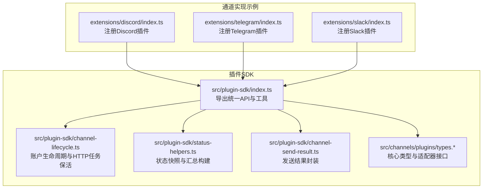
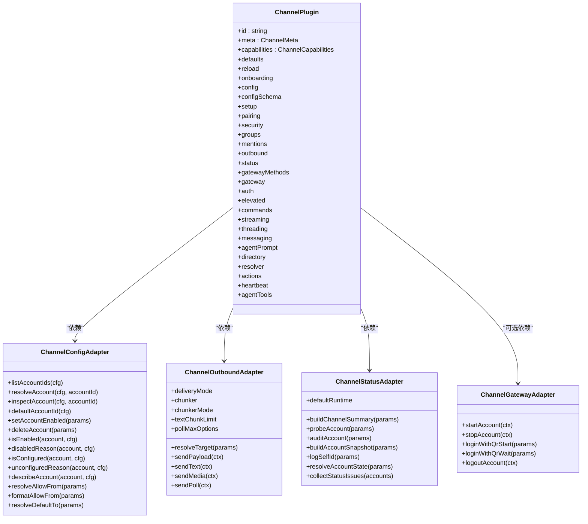
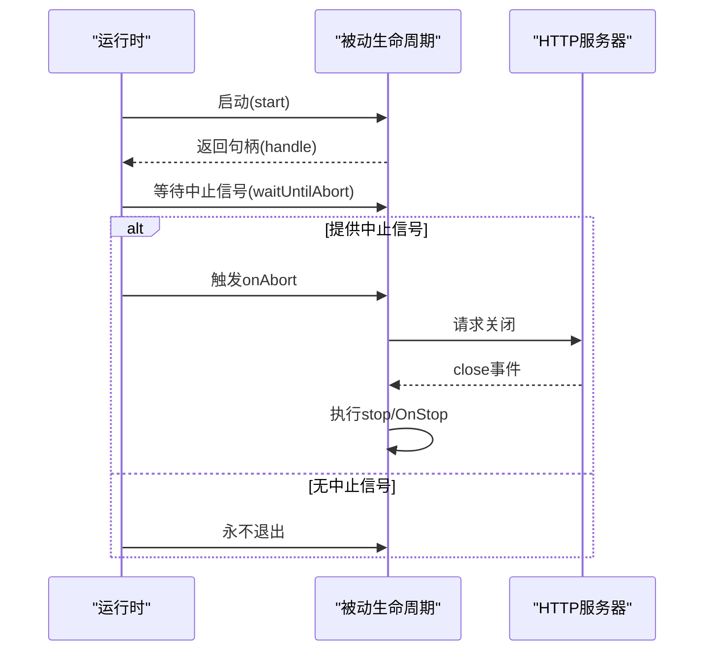
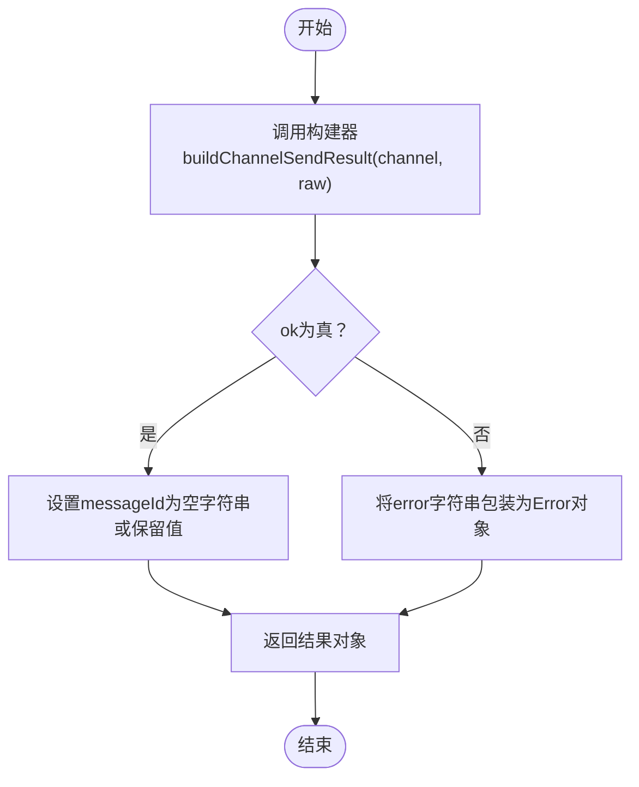
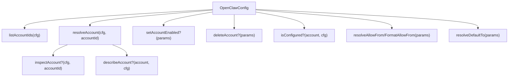
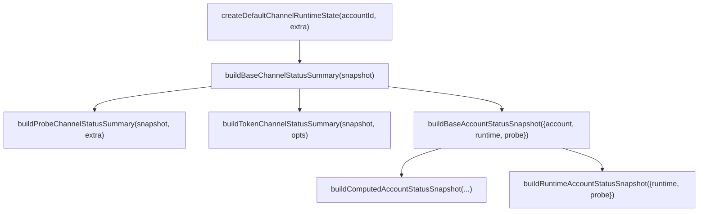
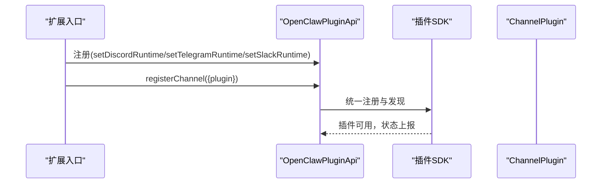
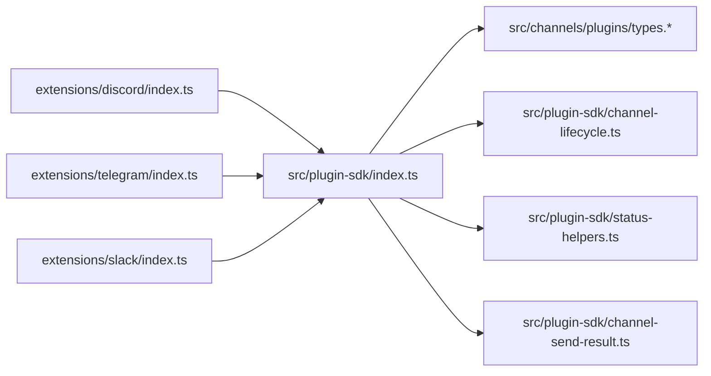

# 通道插件通用功能

<cite>
**本文档引用的文件**
- [index.ts](file://src/plugin-sdk/index.ts)
- [types.ts](file://src/channels/plugins/types.ts)
- [types.plugin.ts](file://src/channels/plugins/types.plugin.ts)
- [types.adapters.ts](file://src/channels/plugins/types.adapters.ts)
- [types.core.ts](file://src/channels/plugins/types.core.ts)
- [channel-lifecycle.ts](file://src/plugin-sdk/channel-lifecycle.ts)
- [status-helpers.ts](file://src/plugin-sdk/status-helpers.ts)
- [channel-send-result.ts](file://src/plugin-sdk/channel-send-result.ts)
- [discord/index.ts](file://extensions/discord/index.ts)
- [telegram/index.ts](file://extensions/telegram/index.ts)
- [slack/index.ts](file://extensions/slack/index.ts)
</cite>

## 目录

1. [简介](#简介)
2. [项目结构](#项目结构)
3. [核心组件](#核心组件)
4. [架构总览](#架构总览)
5. [详细组件分析](#详细组件分析)
6. [依赖关系分析](#依赖关系分析)
7. [性能考量](#性能考量)
8. [故障排查指南](#故障排查指南)
9. [结论](#结论)
10. [附录](#附录)

## 简介

本文件系统性阐述 OpenClaw 通道插件的通用功能与架构设计，覆盖基础接口、共享能力、生命周期管理、消息发送结果处理以及配置管理等主题。文档同时提供标准化开发模式、最佳实践、常见问题解决方案，并通过序列图与类图直观展示通道间数据传输、状态同步与错误传播机制。

## 项目结构

OpenClaw 将“插件 SDK”与“具体通道实现”解耦：插件 SDK 提供统一的类型、工具函数与运行时辅助；各通道（如 Discord、Telegram、Slack）以独立扩展形式实现适配器与运行时，注册到平台并参与统一的状态管理与消息分发。

**图表来源**

- [index.ts:1-826](file://src/plugin-sdk/index.ts#L1-L826)
- [types.ts:1-66](file://src/channels/plugins/types.ts#L1-L66)
- [types.adapters.ts:1-384](file://src/channels/plugins/types.adapters.ts#L1-L384)
- [types.core.ts:1-403](file://src/channels/plugins/types.core.ts#L1-L403)
- [channel-lifecycle.ts:1-108](file://src/plugin-sdk/channel-lifecycle.ts#L1-L108)
- [status-helpers.ts:1-173](file://src/plugin-sdk/status-helpers.ts#L1-L173)
- [channel-send-result.ts:1-15](file://src/plugin-sdk/channel-send-result.ts#L1-L15)
- [discord/index.ts:1-20](file://extensions/discord/index.ts#L1-L20)
- [telegram/index.ts:1-18](file://extensions/telegram/index.ts#L1-L18)
- [slack/index.ts:1-18](file://extensions/slack/index.ts#L1-L18)

**章节来源**

- [index.ts:1-826](file://src/plugin-sdk/index.ts#L1-L826)
- [discord/index.ts:1-20](file://extensions/discord/index.ts#L1-L20)
- [telegram/index.ts:1-18](file://extensions/telegram/index.ts#L1-L18)
- [slack/index.ts:1-18](file://extensions/slack/index.ts#L1-L18)

## 核心组件

- 通道插件契约与类型体系：定义通道能力、适配器接口、账户快照、消息动作等核心类型，确保不同通道实现遵循统一规范。
- 生命周期管理工具：提供被动账户生命周期、HTTP服务器保活、中止信号等待等通用能力。
- 状态管理与汇总：提供默认运行时状态、账户快照、运行时摘要、探测摘要、令牌摘要等构建器，便于统一上报与诊断。
- 发送结果封装：标准化发送结果结构，支持错误包装与消息ID提取。
- 通道实现注册：通过扩展入口注册插件，注入运行时并登记通道。

**章节来源**

- [types.plugin.ts:48-86](file://src/channels/plugins/types.plugin.ts#L48-L86)
- [types.adapters.ts:24-384](file://src/channels/plugins/types.adapters.ts#L24-L384)
- [types.core.ts:97-159](file://src/channels/plugins/types.core.ts#L97-L159)
- [channel-lifecycle.ts:51-108](file://src/plugin-sdk/channel-lifecycle.ts#L51-L108)
- [status-helpers.ts:12-173](file://src/plugin-sdk/status-helpers.ts#L12-L173)
- [channel-send-result.ts:7-15](file://src/plugin-sdk/channel-send-result.ts#L7-L15)
- [discord/index.ts:7-17](file://extensions/discord/index.ts#L7-L17)

## 架构总览

通道插件采用“适配器+运行时”的分层架构：上层为统一的通道契约与工具，下层为各通道的具体实现。通道通过注册流程接入平台，使用 SDK 提供的生命周期、状态与发送封装能力，实现一致的行为与可观测性。

**图表来源**

- [types.plugin.ts:48-86](file://src/channels/plugins/types.plugin.ts#L48-L86)
- [types.adapters.ts:52-166](file://src/channels/plugins/types.adapters.ts#L52-L166)
- [types.adapters.ts:275-289](file://src/channels/plugins/types.adapters.ts#L275-L289)

## 详细组件分析

### 通道生命周期管理

通道账户通常需要在后台长期运行，SDK 提供被动生命周期管理与 HTTP 服务器保活能力：

- 被动账户生命周期：启动后等待中止信号，再执行清理回调。
- HTTP 服务器保活：监听服务器关闭事件，结合可选的中止触发器，保证优雅退出。
- 中止等待：提供可中断的等待函数，便于在多任务场景中协调退出。

**图表来源**

- [channel-lifecycle.ts:51-108](file://src/plugin-sdk/channel-lifecycle.ts#L51-L108)

**章节来源**

- [channel-lifecycle.ts:14-108](file://src/plugin-sdk/channel-lifecycle.ts#L14-L108)

### 消息发送结果处理

发送结果采用统一的原始结构，SDK 提供构建器将其转换为带错误对象的结果，便于上层统一处理与日志记录。

**图表来源**

- [channel-send-result.ts:7-15](file://src/plugin-sdk/channel-send-result.ts#L7-L15)

**章节来源**

- [channel-send-result.ts:1-15](file://src/plugin-sdk/channel-send-result.ts#L1-L15)

### 通道配置管理

通道配置管理围绕“账户解析、启用/禁用、允许列表、默认目标”等核心能力展开，类型适配器定义了统一接口，通道实现按需提供具体逻辑。

**图表来源**

- [types.adapters.ts:52-81](file://src/channels/plugins/types.adapters.ts#L52-L81)

**章节来源**

- [types.adapters.ts:52-81](file://src/channels/plugins/types.adapters.ts#L52-L81)

### 通道状态与汇总

SDK 提供多种状态摘要与快照构建器，帮助通道实现统一的状态上报与诊断：

- 默认运行时状态：初始化账户运行时字段。
- 基础/探测/令牌状态摘要：构建包含配置、运行、错误、探测时间等字段的摘要。
- 账户快照：合并账户信息与运行时摘要，补充最近入站/出站时间等。

**图表来源**

- [status-helpers.ts:12-173](file://src/plugin-sdk/status-helpers.ts#L12-L173)

**章节来源**

- [status-helpers.ts:12-173](file://src/plugin-sdk/status-helpers.ts#L12-L173)

### 通道注册与运行时集成

通道扩展通过入口文件注册插件，注入运行时并登记通道，形成统一的插件生态。

**图表来源**

- [discord/index.ts:12-16](file://extensions/discord/index.ts#L12-L16)
- [telegram/index.ts:11-14](file://extensions/telegram/index.ts#L11-L14)
- [slack/index.ts:11-14](file://extensions/slack/index.ts#L11-L14)

**章节来源**

- [discord/index.ts:1-20](file://extensions/discord/index.ts#L1-L20)
- [telegram/index.ts:1-18](file://extensions/telegram/index.ts#L1-L18)
- [slack/index.ts:1-18](file://extensions/slack/index.ts#L1-L18)

## 依赖关系分析

通道插件的依赖主要体现在类型契约与工具函数层面：SDK 作为统一出口，集中导出类型、适配器、生命周期、状态与发送封装等能力；通道实现仅依赖 SDK 的公开接口，降低耦合度并提升可维护性。

**图表来源**

- [index.ts:1-826](file://src/plugin-sdk/index.ts#L1-L826)
- [discord/index.ts:1-20](file://extensions/discord/index.ts#L1-L20)
- [telegram/index.ts:1-18](file://extensions/telegram/index.ts#L1-L18)
- [slack/index.ts:1-18](file://extensions/slack/index.ts#L1-L18)

**章节来源**

- [index.ts:1-826](file://src/plugin-sdk/index.ts#L1-L826)

## 性能考量

- 文本分块与媒体处理：通过适配器提供的分块器与文本限制，避免单次发送超限，提升吞吐与稳定性。
- 运行时状态聚合：使用状态摘要构建器减少重复计算，统一上报结构便于监控与告警。
- 生命周期保活：在长连接通道中，合理使用被动生命周期与HTTP服务器保活，避免资源泄漏与异常退出。
- 错误传播与诊断：通过发送结果封装与状态问题收集，快速定位错误来源并生成修复建议。

[本节为通用指导，无需列出章节来源]

## 故障排查指南

- 发送失败定位：使用发送结果构建器将底层错误包装为标准错误对象，便于统一捕获与日志记录。
- 状态问题收集：利用状态问题收集器从账户最后错误中生成运行时问题，辅助诊断与修复。
- 生命周期异常：检查中止信号是否正确传递、清理回调是否执行，确认被动生命周期与HTTP保活逻辑。

**章节来源**

- [channel-send-result.ts:7-15](file://src/plugin-sdk/channel-send-result.ts#L7-L15)
- [status-helpers.ts:154-173](file://src/plugin-sdk/status-helpers.ts#L154-L173)
- [channel-lifecycle.ts:51-108](file://src/plugin-sdk/channel-lifecycle.ts#L51-L108)

## 结论

OpenClaw 的通道插件通用功能以“统一类型契约 + 工具函数 + 生命周期与状态管理”为核心，既保证了通道实现的一致性与可观测性，又为扩展提供了清晰的开发边界。通过标准化的注册流程与适配器接口，开发者可以快速实现新通道并融入平台生态。

[本节为总结性内容，无需列出章节来源]

## 附录

### 标准化开发模式与最佳实践

- 明确适配器职责：仅实现必要的适配器方法，避免过度耦合。
- 使用生命周期工具：在后台任务中使用被动生命周期与HTTP保活，确保优雅退出。
- 统一状态上报：使用状态摘要构建器输出一致的运行时信息，便于监控与诊断。
- 发送结果封装：统一使用发送结果构建器，确保错误与消息ID的标准化处理。
- 配置与安全：合理使用允许列表与DM策略，确保最小权限与可审计性。

[本节为通用指导，无需列出章节来源]
