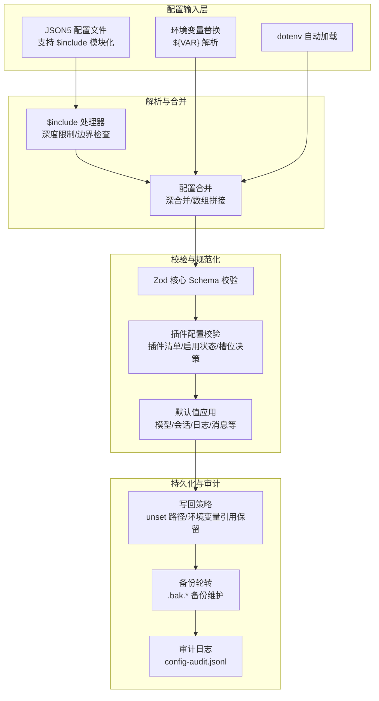
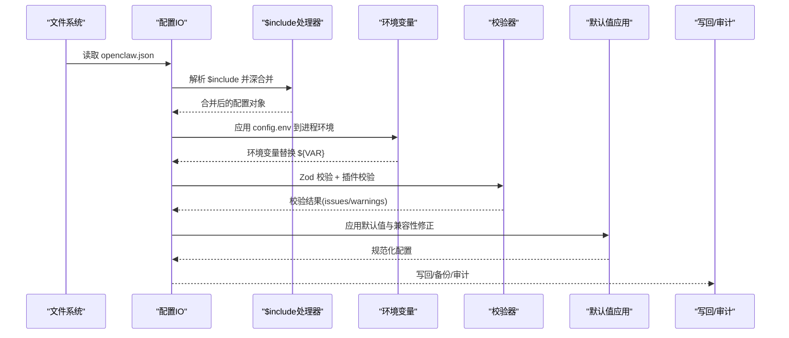
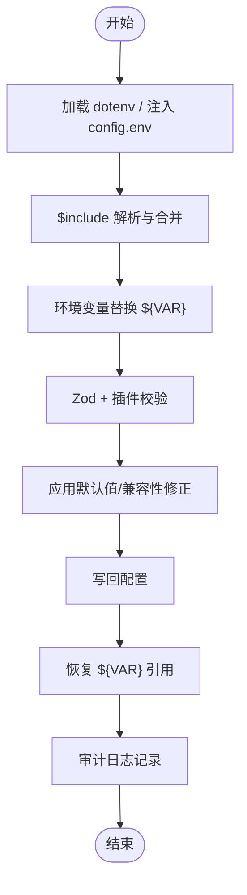
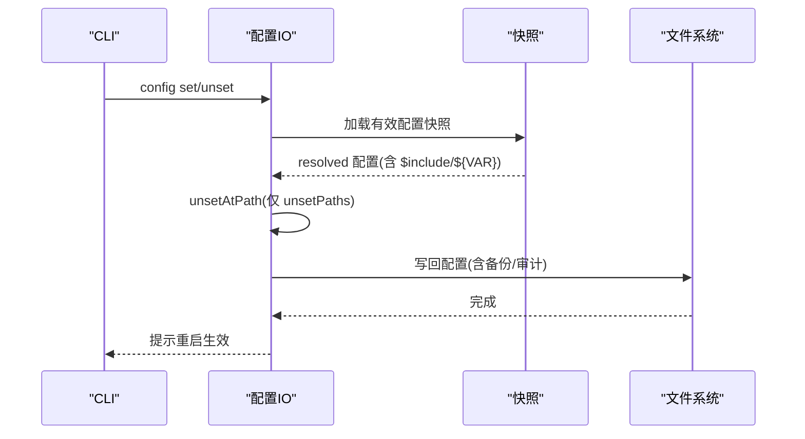
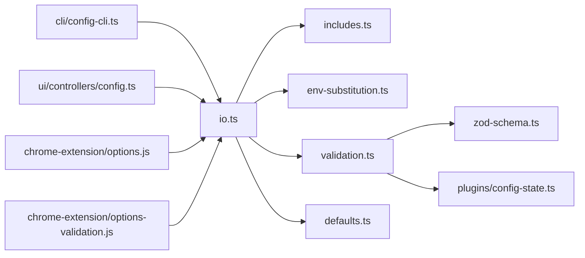

# 配置管理

<cite>
**本文引用的文件**
- [src/config/config.ts](file://src/config/config.ts)
- [src/config/io.ts](file://src/config/io.ts)
- [src/config/validation.ts](file://src/config/validation.ts)
- [src/config/env-substitution.ts](file://src/config/env-substitution.ts)
- [src/config/env-preserve.ts](file://src/config/env-preserve.ts)
- [src/config/env-vars.ts](file://src/config/env-vars.ts)
- [src/config/paths.ts](file://src/config/paths.ts)
- [src/config/defaults.ts](file://src/config/defaults.ts)
- [src/config/includes.ts](file://src/config/includes.ts)
- [src/config/schema.ts](file://src/config/schema.ts)
- [src/config/zod-schema.ts](file://src/config/zod-schema.ts)
- [src/config/types.plugins.ts](file://src/config/types.plugins.ts)
- [src/plugins/config-state.ts](file://src/plugins/config-state.ts)
- [src/cli/config-cli.ts](file://src/cli/config-cli.ts)
- [src/gateway/credentials.test.ts](file://src/gateway/credentials.test.ts)
- [src/commands/daemon-install-helpers.test.ts](file://src/commands/daemon-install-helpers.test.ts)
- [ui/src/ui/controllers/config.ts](file://ui/src/ui/controllers/config.ts)
- [assets/chrome-extension/options.js](file://assets/chrome-extension/options.js)
- [assets/chrome-extension/options-validation.js](file://assets/chrome-extension/options-validation.js)
</cite>

## 目录

1. [简介](#简介)
2. [项目结构](#项目结构)
3. [核心组件](#核心组件)
4. [架构总览](#架构总览)
5. [详细组件分析](#详细组件分析)
6. [依赖关系分析](#依赖关系分析)
7. [性能考量](#性能考量)
8. [故障排查指南](#故障排查指南)
9. [结论](#结论)
10. [附录](#附录)

## 简介

本文件系统性阐述 OpenClaw 插件配置管理子系统的设计与实现，覆盖配置文件结构、字段定义、校验机制、路径管理、密钥输入模式与认证结果处理，以及配置的创建、读取、更新与删除流程。同时提供配置验证工具、默认值设置、环境变量替换与保留、安全存储与访问控制、配置迁移与版本兼容性、以及故障恢复策略的使用指南。

## 项目结构

配置管理相关代码主要集中在 src/config 目录，围绕“解析—合并—校验—应用默认值—写回”的闭环展开，并通过 CLI、UI 与扩展前端提供交互入口。

图表来源

- [src/config/includes.ts:1-347](file://src/config/includes.ts#L1-L347)
- [src/config/env-substitution.ts:1-204](file://src/config/env-substitution.ts#L1-L204)
- [src/config/zod-schema.ts:1-911](file://src/config/zod-schema.ts#L1-L911)
- [src/config/validation.ts:1-605](file://src/config/validation.ts#L1-L605)
- [src/config/defaults.ts:1-537](file://src/config/defaults.ts#L1-L537)
- [src/config/io.ts:1-1528](file://src/config/io.ts#L1-L1528)

章节来源

- [src/config/paths.ts:1-285](file://src/config/paths.ts#L1-L285)
- [src/config/io.ts:1-1528](file://src/config/io.ts#L1-L1528)

## 核心组件

- 配置 IO 与快照：负责配置文件的读取、解析、校验、默认值应用、写回与审计。
- 环境变量替换与保留：在读取时解析 ${VAR}，在写回时智能保留原始占位符。
- 配置校验：基于 Zod 的强类型校验与插件专用校验（启用状态、槽位、schema）。
- 默认值与规范化：按模块应用默认值与兼容性修正。
- 路径与候选：多态解析配置路径、状态目录与候选文件，支持历史兼容。
- 插件配置状态：标准化插件配置、启用/禁用、槽位选择与内存插件决策。
- CLI 与 UI：提供配置查询、设置、删除、查看 schema 的命令行与前端接口。

章节来源

- [src/config/config.ts:1-29](file://src/config/config.ts#L1-L29)
- [src/config/io.ts:1-1528](file://src/config/io.ts#L1-L1528)
- [src/config/validation.ts:1-605](file://src/config/validation.ts#L1-L605)
- [src/config/env-substitution.ts:1-204](file://src/config/env-substitution.ts#L1-L204)
- [src/config/env-preserve.ts:1-38](file://src/config/env-preserve.ts#L1-L38)
- [src/config/env-vars.ts:54-97](file://src/config/env-vars.ts#L54-L97)
- [src/config/defaults.ts:1-537](file://src/config/defaults.ts#L1-L537)
- [src/config/paths.ts:1-285](file://src/config/paths.ts#L1-L285)
- [src/plugins/config-state.ts:1-287](file://src/plugins/config-state.ts#L1-L287)
- [src/cli/config-cli.ts:310-342](file://src/cli/config-cli.ts#L310-L342)
- [ui/src/ui/controllers/config.ts:39-77](file://ui/src/ui/controllers/config.ts#L39-L77)

## 架构总览

下图展示从配置文件到运行时配置的关键流转与关键节点。

图表来源

- [src/config/io.ts:708-800](file://src/config/io.ts#L708-L800)
- [src/config/includes.ts:340-347](file://src/config/includes.ts#L340-L347)
- [src/config/env-substitution.ts:197-204](file://src/config/env-substitution.ts#L197-L204)
- [src/config/validation.ts:229-286](file://src/config/validation.ts#L229-L286)
- [src/config/defaults.ts:1-537](file://src/config/defaults.ts#L1-L537)

## 详细组件分析

### 配置文件结构与字段定义

- 根级字段概览：meta、env、wizard、diagnostics、logging、cli、update、browser、ui、secrets、auth、acp、models、nodeHost、agents、tools、bindings、broadcast、audio、media、messages、commands、approvals、session、cron、hooks、web、channels、discovery、canvasHost、talk、gateway 等。
- 插件配置（plugins）：包含 enabled、allow、deny、load、slots、entries、installs 等。
- 插件条目（entries.<id>）：enabled、hooks.allowPromptInjection、config。
- 插件槽位（slots）：memory、contextEngine；memory 支持 "none" 关闭内存插件。
- 环境变量注入（env.vars）：键值对形式注入到进程环境，用于后续 ${VAR} 替换。

章节来源

- [src/config/zod-schema.ts:206-911](file://src/config/zod-schema.ts#L206-L911)
- [src/config/types.plugins.ts:1-37](file://src/config/types.plugins.ts#L1-L37)
- [src/config/env-vars.ts:54-97](file://src/config/env-vars.ts#L54-L97)

### 配置路径管理

- 状态目录优先：默认 ~/.openclaw，可通过 OPENCLAW_STATE_DIR 或历史目录兼容。
- 配置文件候选：支持 OPENCLAW_CONFIG_PATH 显式指定；否则在状态目录内优先查找 openclaw.json 及历史兼容名。
- 临时锁目录：网关锁目录位于系统临时目录，带 UID 后缀以避免冲突。
- OAuth 凭据目录：可由 OPENCLAW_OAUTH_DIR 指定，否则位于状态目录 credentials 子目录。

章节来源

- [src/config/paths.ts:60-285](file://src/config/paths.ts#L60-L285)

### 环境变量替换与保留

- 替换规则：仅识别大写/下划线命名的环境变量；支持转义 $${VAR} 输出字面量；缺失时抛出错误或回调警告。
- 写回保留：在写回时检测哪些值原本是 ${VAR} 形式，若当前环境解析后与新值一致则恢复原样，避免明文泄露。
- 进程注入：先将 config.env 注入进程环境，再进行 ${VAR} 替换，确保引用可用。

图表来源

- [src/config/env-substitution.ts:1-204](file://src/config/env-substitution.ts#L1-L204)
- [src/config/env-preserve.ts:1-38](file://src/config/env-preserve.ts#L1-L38)
- [src/config/env-vars.ts:54-97](file://src/config/env-vars.ts#L54-L97)
- [src/config/io.ts:628-796](file://src/config/io.ts#L628-L796)

章节来源

- [src/config/env-substitution.ts:1-204](file://src/config/env-substitution.ts#L1-L204)
- [src/config/env-preserve.ts:1-38](file://src/config/env-preserve.ts#L1-L38)
- [src/config/env-vars.ts:54-97](file://src/config/env-vars.ts#L54-L97)
- [src/config/io.ts:628-796](file://src/config/io.ts#L628-L796)

### 配置校验机制

- Zod 核心校验：对所有根字段进行类型与约束校验，包含 URL 协议、数值范围、枚举集合等。
- 插件校验：加载插件清单，校验 allow/deny/memory 槽位、未知插件 ID、插件 schema 缺失、禁用但仍有配置等。
- 兼容性与安全：对历史字段给出提示；对未知通道/心跳目标进行校验；对敏感字段标记为敏感。
- 诊断输出：issues/warnings 分离，issues 导致失败，warnings 提示潜在问题。

章节来源

- [src/config/validation.ts:229-605](file://src/config/validation.ts#L229-L605)
- [src/config/zod-schema.ts:1-911](file://src/config/zod-schema.ts#L1-L911)

### 插件配置启用与槽位决策

- 标准化：将 plugins 配置归一化为统一结构，便于决策。
- 启用状态：考虑全局开关、deny/allow 列表、显式 enabled、bundled 默认启用集、槽位匹配等。
- 内存槽位：memory 支持 "none" 关闭；同一时刻仅允许一个 memory 插件被选中；未显式配置时按默认槽位策略决定。
- 通道联动：当某 Bundled 插件作为频道启用时，可例外地启用该插件。

章节来源

- [src/plugins/config-state.ts:1-287](file://src/plugins/config-state.ts#L1-L287)
- [src/config/validation.ts:457-597](file://src/config/validation.ts#L457-L597)

### 配置创建、读取、更新与删除

- 创建/读取：自动定位配置文件，解析 $include，应用 env 注入与 ${VAR} 替换，执行校验与默认值应用。
- 更新：CLI 支持 set/unset 操作，内部通过解析快照、unset 指定路径、写回配置；写回前进行审计与备份轮转。
- 删除：unset 操作移除指定路径，写回后提示重启生效。

图表来源

- [src/cli/config-cli.ts:310-342](file://src/cli/config-cli.ts#L310-L342)
- [src/config/io.ts:1044-1058](file://src/config/io.ts#L1044-L1058)

章节来源

- [src/cli/config-cli.ts:310-342](file://src/cli/config-cli.ts#L310-L342)
- [src/config/io.ts:1044-1058](file://src/config/io.ts#L1044-L1058)

### 配置验证工具与默认值设置

- 验证工具：validateConfigObject/validateConfigObjectWithPlugins，返回 issues/warnings；支持 raw 模式不应用默认值。
- 默认值：按模块应用默认值（模型、代理、会话、日志、消息、TTS 等），并进行兼容性修正（如 talk 规范化、上下文修剪策略等）。
- UI Schema：根据插件 schema 生成 UI 字段标签、帮助、敏感标记等元数据，供前端渲染。

章节来源

- [src/config/validation.ts:229-286](file://src/config/validation.ts#L229-L286)
- [src/config/defaults.ts:1-537](file://src/config/defaults.ts#L1-L537)
- [src/config/schema.ts:177-208](file://src/config/schema.ts#L177-L208)

### 环境变量替换与认证结果处理

- 认证凭据：config 中的 token/password 在写回时会尝试恢复 ${VAR} 引用，避免明文泄露；若环境未提供则保持占位符。
- 安全策略：服务安装计划中会过滤危险环境变量（如 NODE_OPTIONS），空值与空白值会被丢弃。
- 缺失处理：环境变量缺失时，替换阶段可发出警告而非直接失败，保证非关键功能可用。

章节来源

- [src/gateway/credentials.test.ts:609-630](file://src/gateway/credentials.test.ts#L609-L630)
- [src/commands/daemon-install-helpers.test.ts:143-204](file://src/commands/daemon-install-helpers.test.ts#L143-L204)
- [src/config/env-substitution.ts:29-37](file://src/config/env-substitution.ts#L29-L37)

### 配置安全存储、加密传输与访问控制

- 文件权限：读取失败时提示 chown 修复权限；建议配置文件仅限运行用户读取。
- 审计日志：写回时记录审计事件（变更摘要、hash、大小变化、可疑原因等），文件位于状态目录 logs 下。
- 访问控制：网关认证模式支持 none/token/password/trusted-proxy；TLS、安全头、速率限制等可配置。
- 敏感字段：Zod 对敏感字段注册敏感标记，日志脱敏策略可按工具级别启用。

章节来源

- [src/config/io.ts:1011-1042](file://src/config/io.ts#L1011-L1042)
- [src/config/io.ts:541-555](file://src/config/io.ts#L541-L555)
- [src/config/zod-schema.ts:1-911](file://src/config/zod-schema.ts#L1-L911)

### 配置迁移、版本兼容性与故障恢复

- 版本标记：每次写回时更新 meta.lastTouchedVersion 与 lastTouchedAt；启动时若发现未来版本写入会告警。
- 历史兼容：支持历史状态目录与配置文件名迁移；$include 深度限制与边界检查防止越界与滥用。
- 故障恢复：写回失败时保留 .bak.\* 备份；读取失败时记录详细错误并返回空配置快照；unset 操作可撤销误写。

章节来源

- [src/config/paths.ts:1-285](file://src/config/paths.ts#L1-L285)
- [src/config/includes.ts:1-347](file://src/config/includes.ts#L1-L347)
- [src/config/backup-rotation.ts:1-36](file://src/config/backup-rotation.ts#L1-L36)
- [src/config/io.ts:1011-1042](file://src/config/io.ts#L1011-L1042)

## 依赖关系分析

图表来源

- [src/config/io.ts:1-1528](file://src/config/io.ts#L1-L1528)
- [src/config/includes.ts:1-347](file://src/config/includes.ts#L1-L347)
- [src/config/env-substitution.ts:1-204](file://src/config/env-substitution.ts#L1-L204)
- [src/config/validation.ts:1-605](file://src/config/validation.ts#L1-L605)
- [src/config/defaults.ts:1-537](file://src/config/defaults.ts#L1-L537)
- [src/config/zod-schema.ts:1-911](file://src/config/zod-schema.ts#L1-L911)
- [src/plugins/config-state.ts:1-287](file://src/plugins/config-state.ts#L1-L287)
- [src/cli/config-cli.ts:310-342](file://src/cli/config-cli.ts#L310-L342)
- [ui/src/ui/controllers/config.ts:39-77](file://ui/src/ui/controllers/config.ts#L39-L77)
- [assets/chrome-extension/options.js](file://assets/chrome-extension/options.js)
- [assets/chrome-extension/options-validation.js](file://assets/chrome-extension/options-validation.js)

章节来源

- [src/config/config.ts:1-29](file://src/config/config.ts#L1-L29)

## 性能考量

- 解析与合并：$include 深度限制与文件大小限制，避免过大配置导致内存与 CPU 压力。
- 校验开销：Zod 校验与插件 schema 校验在启动时执行，建议将大型插件配置拆分为模块化 include。
- 写回优化：写回前计算变更路径与哈希，仅在必要时进行重命名/复制；审计日志异步追加。
- 默认值应用：分模块应用，避免重复遍历；对只读场景可使用 validateConfigObjectRaw 跳过默认值。

## 故障排查指南

- 读取失败：检查配置文件权限与所有权；容器/一键部署需 chown 指定用户后再重启。
- 环境变量缺失：关注 MissingEnvVarError 与 warnings；使用 onMissing 回调收集缺失项而不中断。
- 插件校验失败：核对 allow/deny/memroy 槽位与插件 ID 是否存在；schema 缺失时需提供插件配置 schema。
- 写回异常：查看审计日志中的 suspicious 字段与变更摘要；确认 .bak.\* 备份是否存在。
- 认证问题：确认 token/password 是否仍为 ${VAR} 占位符；服务安装时危险环境变量已被过滤。

章节来源

- [src/config/io.ts:1011-1042](file://src/config/io.ts#L1011-L1042)
- [src/config/env-substitution.ts:29-37](file://src/config/env-substitution.ts#L29-L37)
- [src/config/validation.ts:457-597](file://src/config/validation.ts#L457-L597)
- [src/gateway/credentials.test.ts:609-630](file://src/gateway/credentials.test.ts#L609-L630)

## 结论

OpenClaw 的配置管理以“安全、可审计、可扩展”为核心设计原则：通过模块化的 $include、严格的 Zod 校验与插件专用校验、智能的环境变量替换与保留、完善的备份与审计机制，确保配置在多平台、多运行时下的稳定性与安全性。结合 CLI 与 UI，用户可以高效完成配置的创建、读取、更新与删除，并获得清晰的诊断与恢复能力。

## 附录

- 使用建议
  - 将敏感信息放入环境变量并通过 ${VAR} 引用，写回时自动保留占位符。
  - 使用 $include 将配置拆分为基础与环境差异，降低耦合。
  - 定期检查审计日志与备份，确保变更可追溯。
  - 在生产环境开启 TLS、速率限制与最小权限访问控制。
