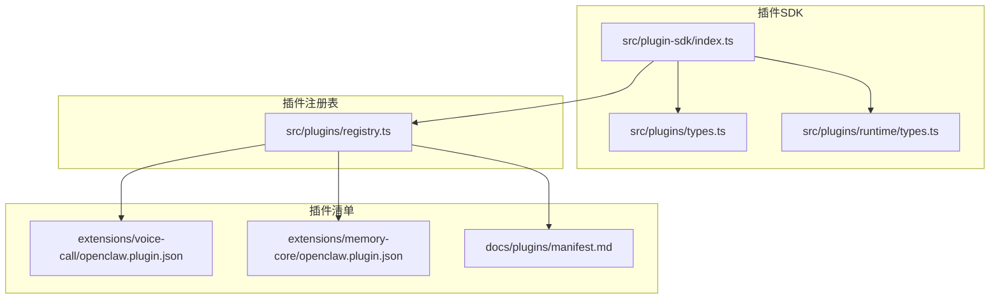
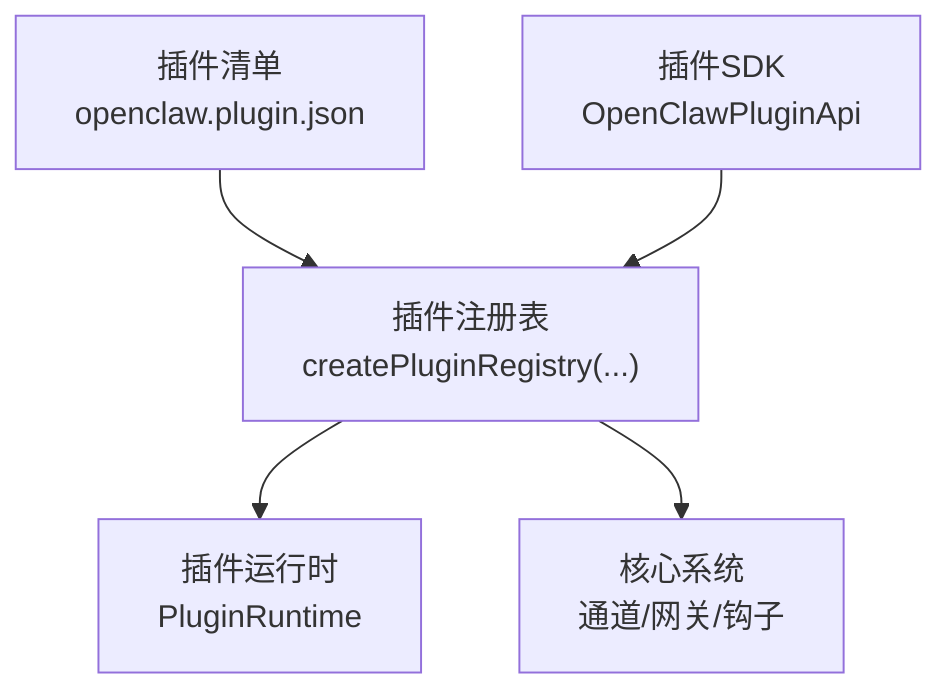
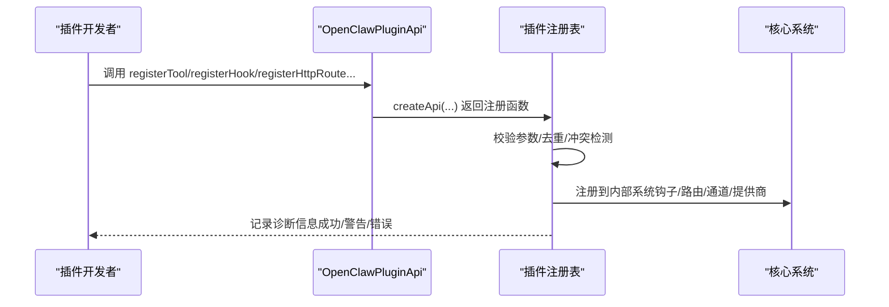
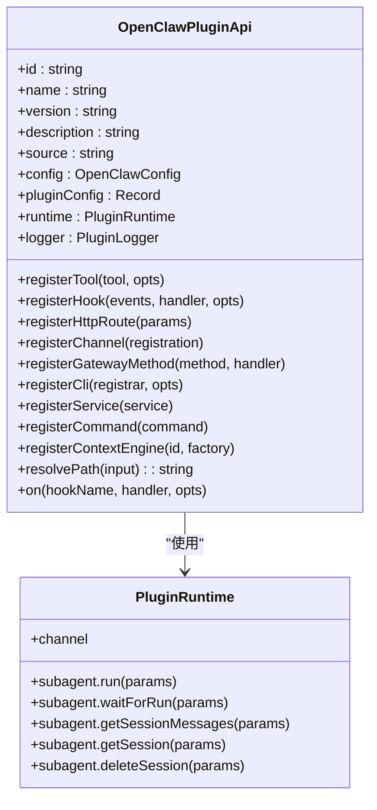
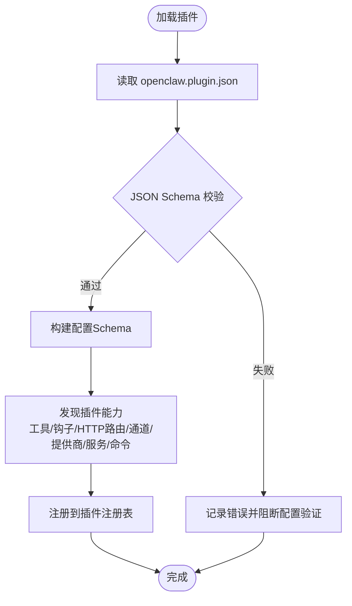
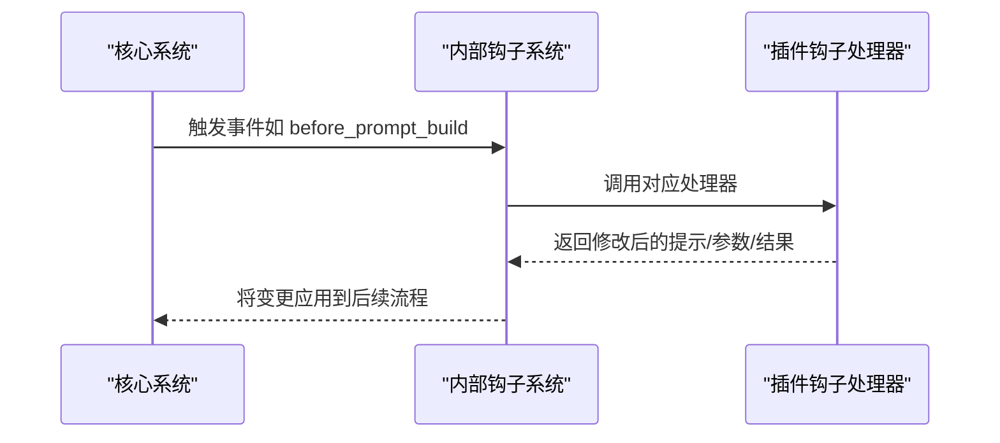
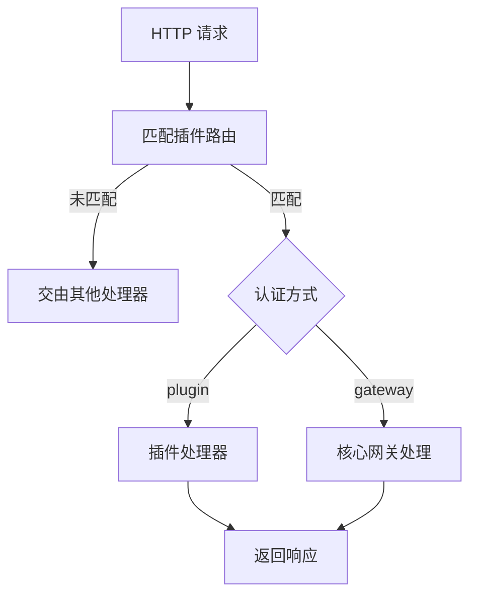
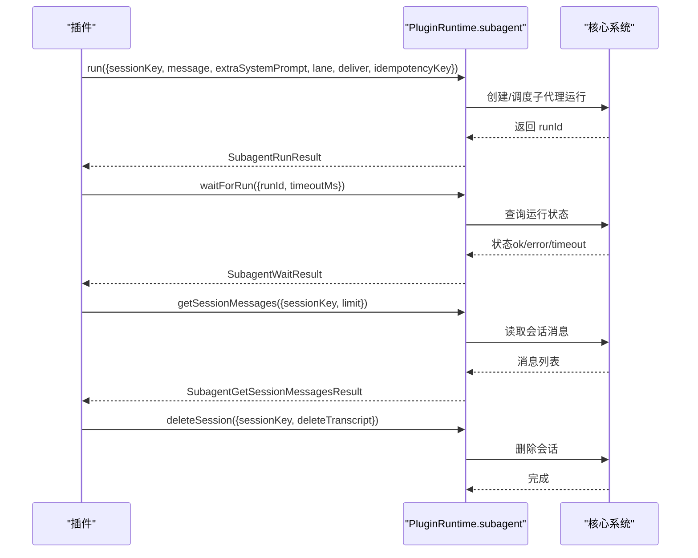
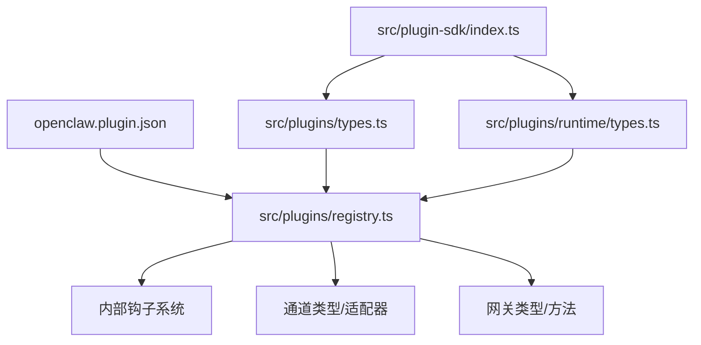

# 插件架构设计

<cite>
**本文档引用的文件**
- [src/plugin-sdk/index.ts](file://src/plugin-sdk/index.ts)
- [src/plugins/types.ts](file://src/plugins/types.ts)
- [src/plugins/runtime/types.ts](file://src/plugins/runtime/types.ts)
- [src/plugins/registry.ts](file://src/plugins/registry.ts)
- [docs/plugins/manifest.md](file://docs/plugins/manifest.md)
- [extensions/voice-call/openclaw.plugin.json](file://extensions/voice-call/openclaw.plugin.json)
- [extensions/memory-core/openclaw.plugin.json](file://extensions/memory-core/openclaw.plugin.json)
</cite>

## 目录

1. [简介](#简介)
2. [项目结构](#项目结构)
3. [核心组件](#核心组件)
4. [架构总览](#架构总览)
5. [详细组件分析](#详细组件分析)
6. [依赖分析](#依赖分析)
7. [性能考虑](#性能考虑)
8. [故障排除指南](#故障排除指南)
9. [结论](#结论)

## 简介

本文件系统性阐述 OpenClaw 插件架构的设计理念、分层结构、模块组织与组件关系，覆盖插件注册机制、生命周期管理、事件系统、通信协议、沙箱安全模型、权限控制与资源隔离等关键主题。通过架构图与组件交互流程图，帮助开发者快速理解插件系统的内部工作原理，并为扩展开发提供清晰的参考路径。

## 项目结构

OpenClaw 的插件系统围绕“插件 SDK + 运行时 + 注册表 + 配置清单”四大部分构建：

- 插件 SDK：统一导出插件 API、类型定义、工具函数与通道适配器，作为插件开发的入口与契约。
- 插件运行时：提供子代理（subagent）运行、会话查询与删除等能力，支撑插件在运行期与系统交互。
- 插件注册表：集中管理插件的工具、钩子、HTTP 路由、通道、服务、命令、网关方法等注册项，负责冲突检测与诊断输出。
- 插件清单（openclaw.plugin.json）：每个插件必须提供的 JSON 清单，用于严格配置校验与发现。

**图表来源**

- [src/plugin-sdk/index.ts:1-826](file://src/plugin-sdk/index.ts#L1-L826)
- [src/plugins/types.ts:1-893](file://src/plugins/types.ts#L1-L893)
- [src/plugins/runtime/types.ts:1-64](file://src/plugins/runtime/types.ts#L1-L64)
- [src/plugins/registry.ts:1-625](file://src/plugins/registry.ts#L1-L625)
- [docs/plugins/manifest.md:1-76](file://docs/plugins/manifest.md#L1-L76)
- [extensions/voice-call/openclaw.plugin.json:1-601](file://extensions/voice-call/openclaw.plugin.json#L1-L601)
- [extensions/memory-core/openclaw.plugin.json:1-10](file://extensions/memory-core/openclaw.plugin.json#L1-L10)

**章节来源**

- [src/plugin-sdk/index.ts:1-826](file://src/plugin-sdk/index.ts#L1-L826)
- [src/plugins/types.ts:1-893](file://src/plugins/types.ts#L1-L893)
- [src/plugins/runtime/types.ts:1-64](file://src/plugins/runtime/types.ts#L1-L64)
- [src/plugins/registry.ts:1-625](file://src/plugins/registry.ts#L1-L625)
- [docs/plugins/manifest.md:1-76](file://docs/plugins/manifest.md#L1-L76)
- [extensions/voice-call/openclaw.plugin.json:1-601](file://extensions/voice-call/openclaw.plugin.json#L1-L601)
- [extensions/memory-core/openclaw.plugin.json:1-10](file://extensions/memory-core/openclaw.plugin.json#L1-L10)

## 核心组件

- 插件 API 类型与契约：定义插件可使用的注册接口（工具、钩子、HTTP 路由、通道、网关方法、CLI、服务、命令、上下文引擎）、钩子事件集合、命令上下文与结果类型等。
- 插件运行时类型：定义子代理运行、等待、会话消息查询、会话删除等运行期能力。
- 插件注册表：维护插件清单、工具、钩子、HTTP 路由、通道、提供商、服务、命令、网关方法等注册项，执行冲突检测与诊断记录。
- 插件清单规范：强制要求每个插件提供 openclaw.plugin.json，包含 id、configSchema 及可选字段；支持 UI 提示、技能目录、通道/提供商声明等。

**章节来源**

- [src/plugins/types.ts:248-306](file://src/plugins/types.ts#L248-L306)
- [src/plugins/runtime/types.ts:51-64](file://src/plugins/runtime/types.ts#L51-L64)
- [src/plugins/registry.ts:129-142](file://src/plugins/registry.ts#L129-L142)
- [docs/plugins/manifest.md:9-76](file://docs/plugins/manifest.md#L9-L76)

## 架构总览

OpenClaw 插件系统采用“声明式清单 + 强类型 API + 中央注册表”的架构模式：

- 声明式清单：插件通过 openclaw.plugin.json 提供配置 JSON Schema 与元数据，确保在不执行代码的前提下完成配置验证与发现。
- 强类型 API：插件通过 OpenClawPluginApi 注册工具、钩子、HTTP 路由、通道、网关方法、CLI、服务、命令与上下文引擎，API 设计强调最小暴露面与明确职责。
- 中央注册表：统一收集并校验所有注册项，避免重复与冲突，记录诊断信息，保障系统稳定性。

**图表来源**

- [src/plugins/registry.ts:185-624](file://src/plugins/registry.ts#L185-L624)
- [src/plugins/types.ts:263-306](file://src/plugins/types.ts#L263-L306)
- [src/plugins/runtime/types.ts:51-64](file://src/plugins/runtime/types.ts#L51-L64)
- [docs/plugins/manifest.md:9-76](file://docs/plugins/manifest.md#L9-L76)

## 详细组件分析

### 组件A：插件注册表与注册流程

插件注册表负责：

- 工具注册：收集插件工具名称与工厂，支持单个工具或工厂返回多个工具。
- 钩子注册：将插件钩子映射到内部钩子系统，支持事件列表与描述，同时处理策略（如禁用提示注入）。
- HTTP 路由注册：规范化路径、匹配策略与认证方式，检测重叠与替换冲突。
- 通道注册：登记通道插件与停靠点，确保通道 ID 合法。
- 提供商注册：登记提供商，避免重复 ID。
- CLI 注册：登记 CLI 命令注册器与命令名。
- 服务注册：登记服务（启动/停止），支持多实例。
- 命令注册：登记自定义命令（绕过 LLM），进行名称校验与重复检查。
- 网关方法注册：登记网关请求处理器，避免与核心方法冲突。
- 诊断记录：对无效或冲突的注册项输出警告/错误。

**图表来源**

- [src/plugins/registry.ts:185-624](file://src/plugins/registry.ts#L185-L624)

**章节来源**

- [src/plugins/registry.ts:168-624](file://src/plugins/registry.ts#L168-L624)

### 组件B：插件 API 与生命周期钩子

插件 API 定义了插件与核心系统的交互契约，涵盖：

- 工具注册：支持单个工具或工厂，可指定名称、别名与可选标记。
- 钩子注册：支持事件数组与描述，可选择是否注册到内部钩子系统。
- HTTP 路由注册：支持精确匹配与前缀匹配、认证方式与替换策略。
- 通道注册：登记 ChannelPlugin 与可选 Dock。
- 网关方法注册：登记自定义网关方法，避免与核心方法冲突。
- CLI 注册：登记命令注册器与命令名。
- 服务注册：登记服务（启动/停止）。
- 命令注册：登记自定义命令（绕过 LLM）。
- 上下文引擎注册：登记上下文引擎实现（独占槽位）。
- 路径解析与生命周期钩子：提供 resolvePath 与 on(hookName, handler, opts)。

生命周期钩子覆盖从模型解析、提示构建、代理开始、LLM 输入/输出、工具调用前后、消息发送/写入、会话开始/结束、子代理生成与交付、网关启停等关键阶段。

**图表来源**

- [src/plugins/types.ts:263-306](file://src/plugins/types.ts#L263-L306)
- [src/plugins/runtime/types.ts:51-64](file://src/plugins/runtime/types.ts#L51-L64)

**章节来源**

- [src/plugins/types.ts:248-306](file://src/plugins/types.ts#L248-L306)
- [src/plugins/runtime/types.ts:1-64](file://src/plugins/runtime/types.ts#L1-L64)

### 组件C：插件清单与配置校验

每个插件必须提供 openclaw.plugin.json，包含：

- 必填字段：id、configSchema。
- 可选字段：kind、channels、providers、skills、name、description、uiHints、version。
- JSON Schema 要求：必须提供 JSON Schema，即使为空对象；Schema 在配置读写时而非运行时验证。
- 行为约束：未知 channels._ 键为错误；plugins.entries.<id>、plugins.allow、plugins.deny、plugins.slots._ 必须引用可发现的插件 id；插件禁用但存在配置将产生警告；清单缺失或损坏导致 Doctor 报错。

**图表来源**

- [docs/plugins/manifest.md:9-76](file://docs/plugins/manifest.md#L9-L76)
- [extensions/voice-call/openclaw.plugin.json:1-601](file://extensions/voice-call/openclaw.plugin.json#L1-L601)
- [extensions/memory-core/openclaw.plugin.json:1-10](file://extensions/memory-core/openclaw.plugin.json#L1-L10)

**章节来源**

- [docs/plugins/manifest.md:9-76](file://docs/plugins/manifest.md#L9-L76)
- [extensions/voice-call/openclaw.plugin.json:1-601](file://extensions/voice-call/openclaw.plugin.json#L1-L601)
- [extensions/memory-core/openclaw.plugin.json:1-10](file://extensions/memory-core/openclaw.plugin.json#L1-L10)

### 组件D：事件系统与钩子

插件事件系统覆盖以下阶段：

- 模型解析前、提示构建前、代理开始前、LLM 输入/输出、代理结束、压缩前/后、重置前、消息接收/发送/已发送、工具调用前/后、工具结果持久化、消息写入前、会话开始/结束、子代理生成/投递目标/已生成/结束、网关启动/停止等。

钩子分为两类：

- 内部钩子：通过 registerHook 注册到内部钩子系统，支持事件数组与描述。
- 类型化钩子：通过 on(hookName, handler, opts) 注册，支持优先级与策略（如禁止提示注入）。

**图表来源**

- [src/plugins/types.ts:321-394](file://src/plugins/types.ts#L321-L394)
- [src/plugins/registry.ts:220-288](file://src/plugins/registry.ts#L220-L288)

**章节来源**

- [src/plugins/types.ts:321-394](file://src/plugins/types.ts#L321-L394)
- [src/plugins/registry.ts:220-288](file://src/plugins/registry.ts#L220-L288)

### 组件E：HTTP 路由与网关方法

插件可通过 registerHttpRoute 注册 HTTP 路由，支持：

- 路径规范化与匹配策略（精确/前缀）。
- 认证方式（gateway/plugin）。
- 重叠与替换冲突检测。
- 替换现有路由的能力（需同属插件且允许替换）。

网关方法通过 registerGatewayMethod 注册，避免与核心方法冲突。

**图表来源**

- [src/plugins/registry.ts:318-400](file://src/plugins/registry.ts#L318-L400)
- [src/plugins/types.ts:205-219](file://src/plugins/types.ts#L205-L219)

**章节来源**

- [src/plugins/registry.ts:318-400](file://src/plugins/registry.ts#L318-L400)
- [src/plugins/types.ts:205-219](file://src/plugins/types.ts#L205-L219)

### 组件F：子代理运行时与会话管理

插件运行时提供子代理运行能力：

- run：启动子代理运行，支持系统提示附加、车道隔离、交付开关与幂等键。
- waitForRun：等待运行完成，支持超时。
- getSessionMessages：查询会话消息，支持限制数量。
- getSession：兼容旧接口。
- deleteSession：删除会话，可选择是否删除转录。

**图表来源**

- [src/plugins/runtime/types.ts:8-61](file://src/plugins/runtime/types.ts#L8-L61)

**章节来源**

- [src/plugins/runtime/types.ts:1-64](file://src/plugins/runtime/types.ts#L1-L64)

### 组件G：沙箱安全模型、权限控制与资源隔离

- 权限控制：插件命令支持 requireAuth 标记，默认仅授权发送者可用；通道侧的入站/出站授权与允许列表由通道配置与策略决定。
- 资源隔离：插件通过运行时 API 访问受限资源（如会话消息、子代理运行），避免直接访问核心内部状态；HTTP 路由注册受冲突检测保护。
- 配置校验：openclaw.plugin.json 的 JSON Schema 在配置读写阶段执行，确保插件配置在加载前即被严格校验。
- 诊断与告警：注册表对冲突、重复与无效注册项输出诊断信息，便于定位问题。

**章节来源**

- [src/plugins/types.ts:186-203](file://src/plugins/types.ts#L186-L203)
- [src/plugins/registry.ts:318-400](file://src/plugins/registry.ts#L318-L400)
- [docs/plugins/manifest.md:53-62](file://docs/plugins/manifest.md#L53-L62)

## 依赖分析

插件系统各组件之间的依赖关系如下：

- 插件 SDK 导出类型与工具函数，供插件注册表与插件清单共同使用。
- 插件注册表依赖钩子系统、通道类型、网关类型、命令系统等核心模块，以完成注册与冲突检测。
- 插件清单与插件注册表之间形成“声明式发现 + 运行时注册”的闭环。

**图表来源**

- [src/plugin-sdk/index.ts:1-826](file://src/plugin-sdk/index.ts#L1-L826)
- [src/plugins/types.ts:1-893](file://src/plugins/types.ts#L1-L893)
- [src/plugins/runtime/types.ts:1-64](file://src/plugins/runtime/types.ts#L1-L64)
- [src/plugins/registry.ts:1-625](file://src/plugins/registry.ts#L1-L625)

**章节来源**

- [src/plugin-sdk/index.ts:1-826](file://src/plugin-sdk/index.ts#L1-L826)
- [src/plugins/types.ts:1-893](file://src/plugins/types.ts#L1-L893)
- [src/plugins/runtime/types.ts:1-64](file://src/plugins/runtime/types.ts#L1-L64)
- [src/plugins/registry.ts:1-625](file://src/plugins/registry.ts#L1-L625)

## 性能考虑

- 钩子处理链：建议插件在钩子中尽量做轻量计算，避免阻塞主流程；对于耗时操作可异步处理并延迟写入。
- 子代理运行：合理设置 lane 与 idempotencyKey，减少重复运行与资源竞争。
- HTTP 路由：避免过度使用前缀匹配导致匹配开销增加；在高并发场景下注意认证与限流策略。
- 配置校验：在插件清单中提供简洁而准确的 JSON Schema，减少运行时校验成本。

## 故障排除指南

常见问题与排查要点：

- 插件清单缺失或格式错误：检查 openclaw.plugin.json 是否存在于插件根目录，JSON Schema 是否有效；根据 Doctor 输出修正。
- HTTP 路由冲突：若出现“路由已注册/重叠/替换被拒绝”，检查路径、匹配策略与认证方式，确保唯一性与替换权限。
- 钩子注册缺失名称：注册钩子时需提供合法名称，否则会记录警告；检查 opts.name 或 HookEntry.hook.name。
- 提供商重复注册：同一提供商 ID 不可重复注册；检查 providers 数组与提供商 id。
- 命令重复注册：命令名称需唯一；检查 registerCommand 的 name 字段。
- 网关方法冲突：自定义网关方法不可与核心方法同名；检查 registerGatewayMethod 的 method 参数。

**章节来源**

- [src/plugins/registry.ts:232-380](file://src/plugins/registry.ts#L232-L380)
- [docs/plugins/manifest.md:53-62](file://docs/plugins/manifest.md#L53-L62)

## 结论

OpenClaw 插件系统通过“声明式清单 + 强类型 API + 中央注册表”的设计，在保证安全性与稳定性的同时，提供了灵活的扩展能力。开发者可基于插件 API 实现工具、钩子、HTTP 路由、通道、提供商、服务与命令等能力，并通过严格的配置校验与冲突检测机制确保系统健康运行。建议在开发过程中遵循清单规范、最小暴露面原则与性能优化实践，以获得最佳的扩展体验。
