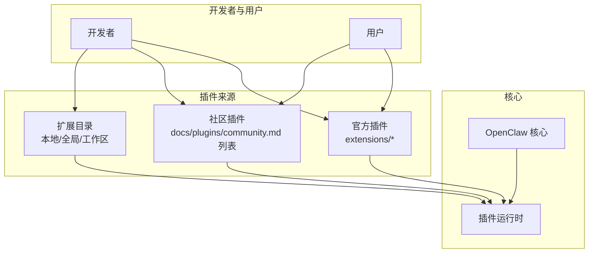
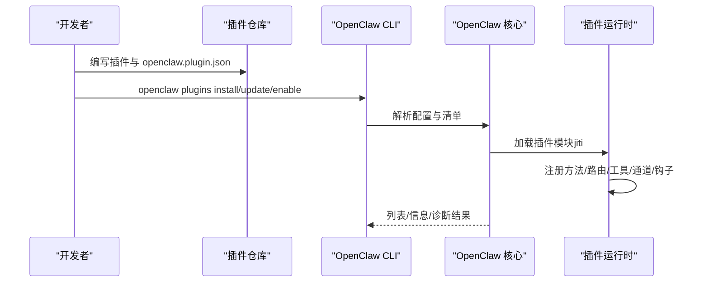
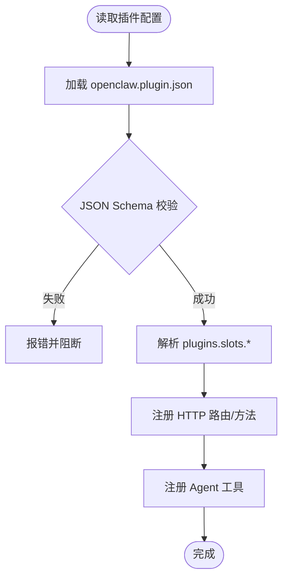
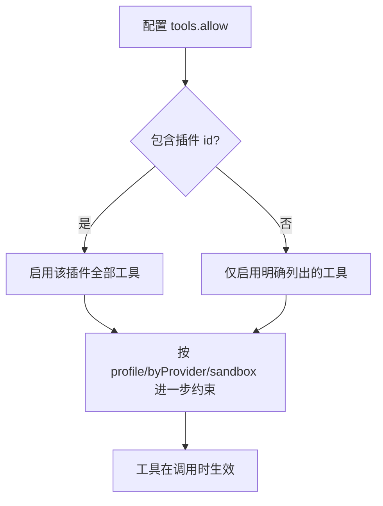
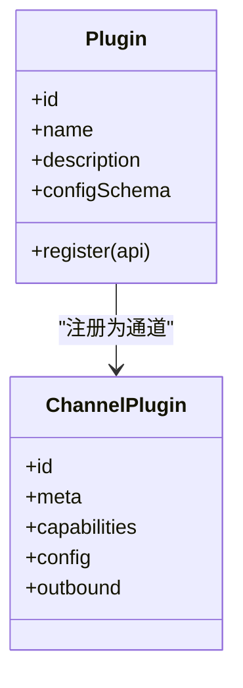
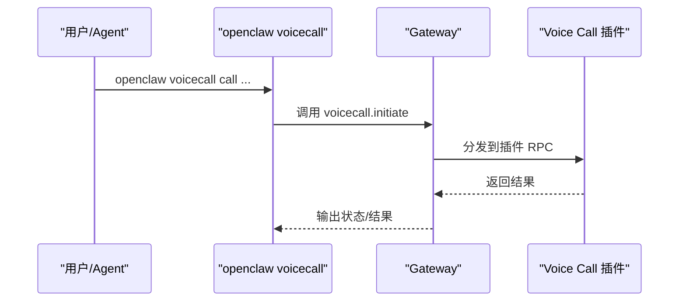
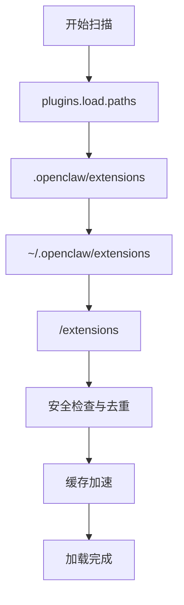
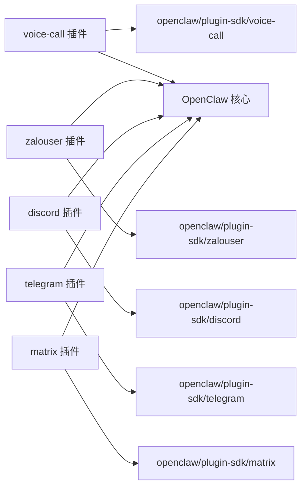

# 插件生态与社区

<cite>
**本文引用的文件**
- [CONTRIBUTING.md](file://CONTRIBUTING.md)
- [docs/plugins/community.md](file://docs/plugins/community.md)
- [docs/plugins/manifest.md](file://docs/plugins/manifest.md)
- [docs/plugins/agent-tools.md](file://docs/plugins/agent-tools.md)
- [docs/plugins/voice-call.md](file://docs/plugins/voice-call.md)
- [docs/plugins/zalouser.md](file://docs/plugins/zalouser.md)
- [docs/tools/plugin.md](file://docs/tools/plugin.md)
- [extensions/voice-call/openclaw.plugin.json](file://extensions/voice-call/openclaw.plugin.json)
- [extensions/zalouser/openclaw.plugin.json](file://extensions/zalouser/openclaw.plugin.json)
- [extensions/voice-call/index.ts](file://extensions/voice-call/index.ts)
- [extensions/zalouser/index.ts](file://extensions/zalouser/index.ts)
- [extensions/discord/index.ts](file://extensions/discord/index.ts)
- [extensions/telegram/index.ts](file://extensions/telegram/index.ts)
- [extensions/matrix/index.ts](file://extensions/matrix/index.ts)
</cite>

## 目录

1. [引言](#引言)
2. [项目结构](#项目结构)
3. [核心组件](#核心组件)
4. [架构总览](#架构总览)
5. [详细组件分析](#详细组件分析)
6. [依赖关系分析](#依赖关系分析)
7. [性能考量](#性能考量)
8. [故障排查指南](#故障排查指南)
9. [结论](#结论)
10. [附录](#附录)

## 引言

本文件系统化梳理 OpenClaw 的插件生态系统与社区协作机制，覆盖插件的组成、参与者、协作流程、质量标准、审核与维护责任、社区支持与反馈渠道，以及文档规范、测试与发布标准。目标是帮助开发者快速理解如何在 OpenClaw 中构建、验证、发布与维护高质量插件，并有效参与社区治理。

## 项目结构

OpenClaw 插件生态由“官方插件”“社区插件”“扩展目录”“文档与规范”四部分构成：

- 官方插件：内置或随包分发的插件（如语音通话、Zalo 个人版、Matrix 等），通过清单与 SDK 注册能力。
- 社区插件：第三方维护并在社区列表中展示的插件，需满足安装、文档与维护信号等要求。
- 扩展目录：本地/全局/工作区扩展路径，支持发现与加载。
- 文档与规范：插件清单格式、工具注册、安装与配置、CLI 操作、安全与缓存策略等。

图示来源

- [docs/tools/plugin.md:228-304](file://docs/tools/plugin.md#L228-L304)
- [docs/plugins/community.md:15-35](file://docs/plugins/community.md#L15-L35)

章节来源

- [docs/tools/plugin.md:228-304](file://docs/tools/plugin.md#L228-L304)
- [docs/plugins/community.md:15-35](file://docs/plugins/community.md#L15-L35)

## 核心组件

- 插件清单（openclaw.plugin.json）
  - 必填字段：id、configSchema；可选字段：kind、channels、providers、skills、name、description、uiHints、version。
  - 清单用于严格配置校验，不执行插件代码。
- 插件 API 与 SDK
  - 支持注册网关方法、HTTP 路由、CLI 命令、Agent 工具、通道插件、上下文引擎、钩子等。
  - 提供按功能域的 SDK 子路径（如 openclaw/plugin-sdk/discord、openclaw/plugin-sdk/telegram 等）。
- 插件发现与加载
  - 发现顺序：配置路径 → 工作区扩展 → 全局扩展 → 内置扩展。
  - 安全检查：路径合法性、权限与所有权、禁止世界可写等。
- 配置与槽位
  - plugins.entries.<id>.config 为插件配置入口；plugins.slots 选择排他类插件（如 memory、contextEngine）。
- 控制 UI 与标签
  - 通过 configSchema + uiHints 生成更友好的表单与敏感字段标记。

章节来源

- [docs/plugins/manifest.md:18-76](file://docs/plugins/manifest.md#L18-L76)
- [docs/tools/plugin.md:484-521](file://docs/tools/plugin.md#L484-L521)
- [docs/tools/plugin.md:228-304](file://docs/tools/plugin.md#L228-L304)
- [docs/tools/plugin.md:357-407](file://docs/tools/plugin.md#L357-L407)
- [docs/tools/plugin.md:427-459](file://docs/tools/plugin.md#L427-L459)

## 架构总览

下图展示了插件从发现到运行的关键交互：

图示来源

- [docs/tools/plugin.md:460-483](file://docs/tools/plugin.md#L460-L483)
- [docs/plugins/manifest.md:11-14](file://docs/plugins/manifest.md#L11-L14)

章节来源

- [docs/tools/plugin.md:460-483](file://docs/tools/plugin.md#L460-L483)
- [docs/plugins/manifest.md:11-14](file://docs/plugins/manifest.md#L11-L14)

## 详细组件分析

### 插件清单与配置校验

- 清单职责
  - 作为“无执行”的配置校验入口，缺失或非法清单即视为错误。
  - 支持 channels、providers、skills 等声明，便于路由与工具可用性控制。
- JSON Schema 要求
  - 即使零配置也必须提供 Schema；读取/写入时校验，非运行时。
  - 排他类插件通过 plugins.slots.\* 选择。
- 验证行为
  - 未知 channels.\* 或插件 id 视为错误。
  - 禁用插件保留配置并告警。

图示来源

- [docs/plugins/manifest.md:47-76](file://docs/plugins/manifest.md#L47-L76)
- [docs/tools/plugin.md:384-392](file://docs/tools/plugin.md#L384-L392)

章节来源

- [docs/plugins/manifest.md:47-76](file://docs/plugins/manifest.md#L47-L76)
- [docs/tools/plugin.md:384-392](file://docs/tools/plugin.md#L384-L392)

### Agent 工具注册与允许列表

- 工具类型
  - 必需工具：默认可用；可选工具：需显式允许。
- 允许列表策略
  - 支持按工具名、插件 id、组（如 plugins）启用；可叠加 profile/byProvider/sandbox 策略。
- 最佳实践
  - 对有副作用或额外凭据/二进制的工具建议设为可选。

图示来源

- [docs/plugins/agent-tools.md:65-93](file://docs/plugins/agent-tools.md#L65-L93)

章节来源

- [docs/plugins/agent-tools.md:65-93](file://docs/plugins/agent-tools.md#L65-L93)

### 通道插件与消息通道

- 通道插件注册
  - 将插件注册为消息通道，配置位于 channels.<id>，并实现必需适配器（如 resolveAccount、sendText 等）。
- 元数据与向导
  - meta.label/selectionLabel/docsPath/blurb/aliases 等影响 UI 与向导体验。
  - 可定义 onboarding 钩子以接管配置流程。
- 示例：Discord、Telegram、Matrix 插件均采用相同模式，分别使用对应 SDK 子路径。

图示来源

- [docs/tools/plugin.md:655-698](file://docs/tools/plugin.md#L655-L698)
- [extensions/discord/index.ts:7-16](file://extensions/discord/index.ts#L7-L16)
- [extensions/telegram/index.ts:6-14](file://extensions/telegram/index.ts#L6-L14)
- [extensions/matrix/index.ts:7-19](file://extensions/matrix/index.ts#L7-L19)

章节来源

- [docs/tools/plugin.md:655-698](file://docs/tools/plugin.md#L655-L698)
- [extensions/discord/index.ts:7-16](file://extensions/discord/index.ts#L7-L16)
- [extensions/telegram/index.ts:6-14](file://extensions/telegram/index.ts#L6-L14)
- [extensions/matrix/index.ts:7-19](file://extensions/matrix/index.ts#L7-L19)

### 网关方法与 CLI 命令

- 网关方法
  - 通过 api.registerGatewayMethod 注册 RPC 方法，供外部调用。
- CLI 命令
  - 通过 api.registerCli 注册子命令（如 voicecall）。
- 示例：Voice Call 插件同时注册了 RPC 方法、Agent 工具与 CLI 子命令。

图示来源

- [docs/plugins/voice-call.md:305-338](file://docs/plugins/voice-call.md#L305-L338)
- [extensions/voice-call/index.ts:230-375](file://extensions/voice-call/index.ts#L230-L375)

章节来源

- [docs/plugins/voice-call.md:305-338](file://docs/plugins/voice-call.md#L305-L338)
- [extensions/voice-call/index.ts:230-375](file://extensions/voice-call/index.ts#L230-L375)

### 插件发现、优先级与安全

- 发现顺序
  - 配置路径 → 工作区扩展 → 全局扩展 → 内置扩展。
- 安全与缓存
  - 路径安全检查（禁止越权、世界可写、可疑所有权）。
  - 发现与清单元数据短时缓存，可通过环境变量禁用或调整窗口。
- 包打包
  - 支持 package.json 中 openclaw.extensions 列表，每个条目成为独立插件。

图示来源

- [docs/tools/plugin.md:228-277](file://docs/tools/plugin.md#L228-L277)
- [docs/tools/plugin.md:219-227](file://docs/tools/plugin.md#L219-L227)
- [docs/tools/plugin.md:278-304](file://docs/tools/plugin.md#L278-L304)

章节来源

- [docs/tools/plugin.md:228-277](file://docs/tools/plugin.md#L228-L277)
- [docs/tools/plugin.md:219-227](file://docs/tools/plugin.md#L219-L227)
- [docs/tools/plugin.md:278-304](file://docs/tools/plugin.md#L278-L304)

### 社区插件与贡献指南

- 列表要求
  - npm 发布、源码公开、文档与问题跟踪、清晰维护信号。
- 提交方式
  - 通过 PR 添加条目，遵循候选格式。
- 质量门槛
  - 优先实用、文档完善、安全可靠；低质量包装或无人维护可能被拒绝。

章节来源

- [docs/plugins/community.md:15-45](file://docs/plugins/community.md#L15-L45)

### 开发者社区与协作流程

- 维护者团队
  - 多领域维护者负责不同子系统与平台。
- 贡献流程
  - 小问题直接开 PR；新特性先讨论；提问在社区频道。
  - PR 前本地测试、CI 通过、保持聚焦、描述清楚、附截图。
- AI/气味代码 PR
  - 欢迎 AI 辅助 PR，但需透明标注、自测充分、处理机器人评论。

章节来源

- [CONTRIBUTING.md:12-106](file://CONTRIBUTING.md#L12-L106)
- [CONTRIBUTING.md:138-167](file://CONTRIBUTING.md#L138-L167)

### 质量标准、审核与维护责任

- 质量标准
  - 实用、文档、安全；避免低效包装与无人维护。
- 审核流程
  - 本地测试 + CI；审查对话作者自清；AI 评论需逐条处理。
- 维护责任
  - 明确维护者与更新节奏；社区问题跟踪与响应。

章节来源

- [docs/plugins/community.md:32-35](file://docs/plugins/community.md#L32-L35)
- [CONTRIBUTING.md:85-106](file://CONTRIBUTING.md#L85-L106)

### 社区支持、问题反馈与功能请求

- 讨论与帮助
  - 使用 GitHub Discussions 或社区频道进行新特性/架构讨论与求助。
- 安全报告
  - 按组件分类提交至相应仓库或安全邮箱，需包含标题、严重度、影响、复现步骤、影响演示、环境、修复建议。

章节来源

- [CONTRIBUTING.md:81-83](file://CONTRIBUTING.md#L81-L83)
- [CONTRIBUTING.md:169-194](file://CONTRIBUTING.md#L169-L194)

### 插件文档规范、测试要求与发布标准

- 文档规范
  - 插件应提供安装、配置、CLI、工具/RPC、安全注意事项等文档。
- 测试要求
  - 本地实例上测试；遵循统一测试命令与覆盖率要求。
- 发布标准
  - npm 发布、源码公开、文档与问题跟踪齐全；社区插件通过 PR 上架。

章节来源

- [docs/plugins/voice-call.md:34-52](file://docs/plugins/voice-call.md#L34-L52)
- [docs/plugins/zalouser.md:27-45](file://docs/plugins/zalouser.md#L27-L45)
- [docs/plugins/community.md:17-19](file://docs/plugins/community.md#L17-L19)

## 依赖关系分析

- 插件与 SDK
  - 插件通过 openclaw/plugin-sdk/\* 子路径导入特定平台/功能域的类型与辅助函数。
- 插件与核心
  - 插件在运行时通过 api 访问核心能力（如 tts/stt、日志、配置）。
- 插件间耦合
  - 通过工具/通道/钩子等接口解耦；排他槽位避免冲突。

图示来源

- [extensions/voice-call/index.ts:1-5](file://extensions/voice-call/index.ts#L1-L5)
- [extensions/zalouser/index.ts:1-5](file://extensions/zalouser/index.ts#L1-L5)
- [extensions/discord/index.ts:1-5](file://extensions/discord/index.ts#L1-L5)
- [extensions/telegram/index.ts:1-1](file://extensions/telegram/index.ts#L1-L1)
- [extensions/matrix/index.ts:1-4](file://extensions/matrix/index.ts#L1-L4)

章节来源

- [extensions/voice-call/index.ts:1-5](file://extensions/voice-call/index.ts#L1-L5)
- [extensions/zalouser/index.ts:1-5](file://extensions/zalouser/index.ts#L1-L5)
- [extensions/discord/index.ts:1-5](file://extensions/discord/index.ts#L1-L5)
- [extensions/telegram/index.ts:1-1](file://extensions/telegram/index.ts#L1-L1)
- [extensions/matrix/index.ts:1-4](file://extensions/matrix/index.ts#L1-L4)

## 性能考量

- 缓存策略
  - 插件发现与清单元数据使用短期缓存，可通过环境变量禁用或调整窗口。
- 资源限制
  - 通道/工具/钩子的执行需考虑并发与超时，避免阻塞核心循环。
- 配置变更
  - 插件配置变更需要重启网关以确保一致性。

章节来源

- [docs/tools/plugin.md:219-227](file://docs/tools/plugin.md#L219-L227)
- [docs/tools/plugin.md:382-383](file://docs/tools/plugin.md#L382-L383)

## 故障排查指南

- 清单与配置
  - 缺失或非法 openclaw.plugin.json 会阻断配置校验；检查 channels.\* 与插件 id 是否声明/存在。
- 安全警告
  - 若未通过安装/加载路径溯源，会发出信任警告；可通过 plugins.allow 或 plugins.installs 明确信任。
- 运行时错误
  - 插件内部异常通过统一错误回调返回；关注插件日志与网关日志定位。

章节来源

- [docs/plugins/manifest.md:53-63](file://docs/plugins/manifest.md#L53-L63)
- [docs/tools/plugin.md:262-270](file://docs/tools/plugin.md#L262-L270)
- [extensions/voice-call/index.ts:199-201](file://extensions/voice-call/index.ts#L199-L201)

## 结论

OpenClaw 的插件生态以严格的清单与配置校验为基础，结合丰富的 SDK 与运行时 API，为开发者提供了构建工具、通道、RPC、HTTP 路由与钩子的完整能力。社区通过清晰的质量标准与审核流程保障生态健康，配合完善的文档与测试要求，形成可持续演进的协作闭环。

## 附录

- 示例插件清单
  - 语音通话：包含大量配置项与 uiHints，体现复杂配置的 Schema 设计与 UI 帮助。
  - Zalo 个人版：最小化配置 Schema，强调通道插件的简洁注册模式。
- 示例插件实现
  - 语音通话：注册 RPC、工具与 CLI，展示多场景调用路径。
  - Zalo 个人版：注册通道与工具，体现消息通道与工具执行的组合。

章节来源

- [extensions/voice-call/openclaw.plugin.json:1-601](file://extensions/voice-call/openclaw.plugin.json#L1-L601)
- [extensions/zalouser/openclaw.plugin.json:1-10](file://extensions/zalouser/openclaw.plugin.json#L1-L10)
- [extensions/voice-call/index.ts:146-543](file://extensions/voice-call/index.ts#L146-L543)
- [extensions/zalouser/index.ts:7-30](file://extensions/zalouser/index.ts#L7-L30)
