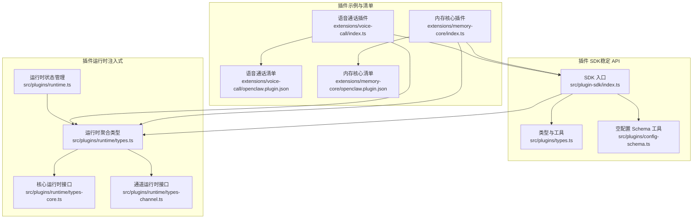
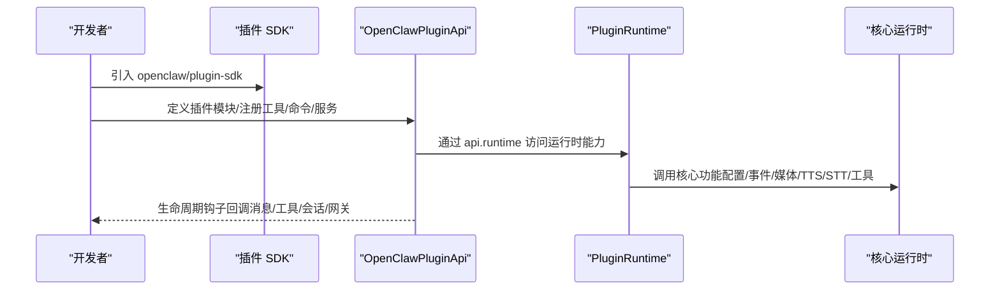
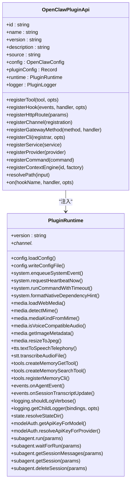
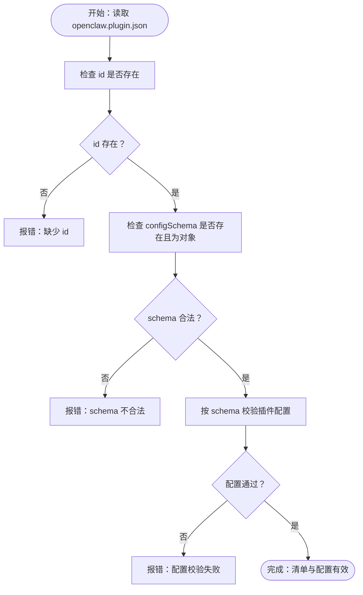
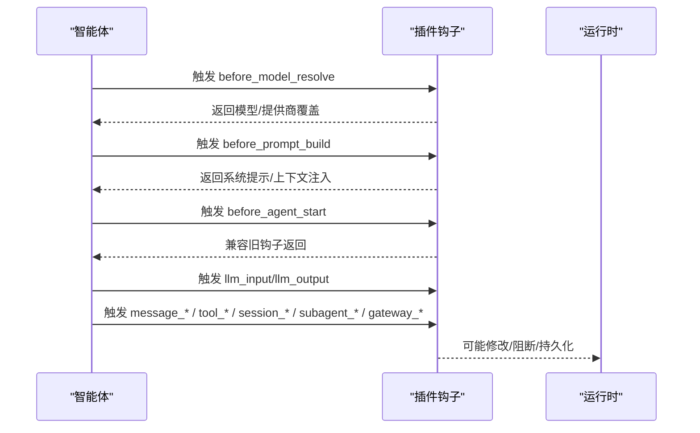
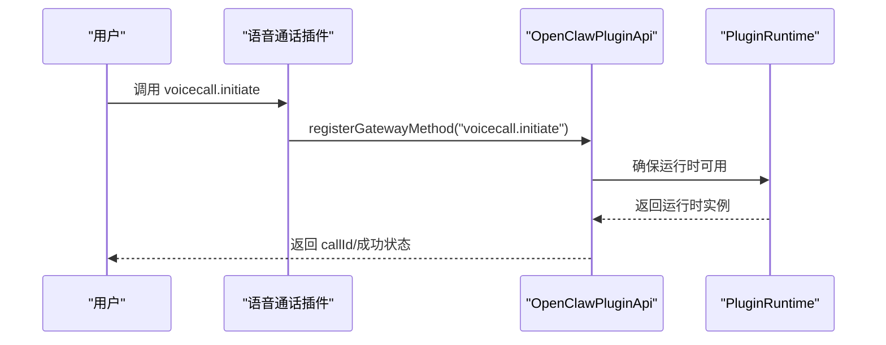
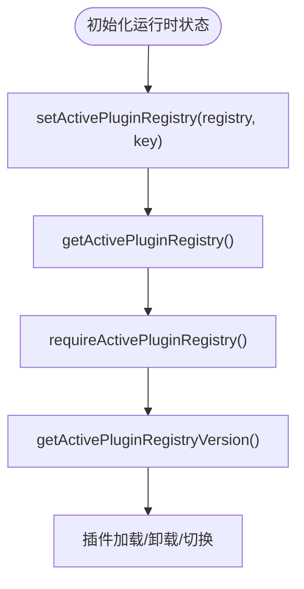
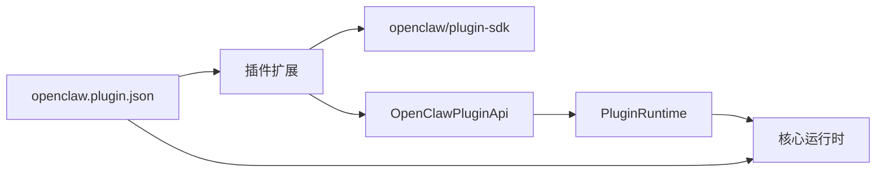

# 插件系统

<cite>
**本文引用的文件**
- [index.ts](file://src/plugin-sdk/index.ts)
- [plugin-sdk.md](file://docs/refactor/plugin-sdk.md)
- [manifest.md](file://docs/plugins/manifest.md)
- [types.ts](file://src/plugins/types.ts)
- [runtime/types.ts](file://src/plugins/runtime/types.ts)
- [runtime/types-channel.ts](file://src/plugins/runtime/types-channel.ts)
- [runtime/types-core.ts](file://src/plugins/runtime/types-core.ts)
- [config-schema.ts](file://src/plugins/config-schema.ts)
- [runtime.ts](file://src/plugins/runtime.ts)
- [openclaw.plugin.json](file://extensions/voice-call/openclaw.plugin.json)
- [index.ts](file://extensions/voice-call/index.ts)
- [openclaw.plugin.json](file://extensions/memory-core/openclaw.plugin.json)
- [index.ts](file://extensions/memory-core/index.ts)
- [SECURITY.md](file://SECURITY.md)
</cite>

## 目录

1. [简介](#简介)
2. [项目结构](#项目结构)
3. [核心组件](#核心组件)
4. [架构总览](#架构总览)
5. [详细组件分析](#详细组件分析)
6. [依赖关系分析](#依赖关系分析)
7. [性能考量](#性能考量)
8. [故障排查指南](#故障排查指南)
9. [结论](#结论)
10. [附录](#附录)

## 简介

本文件系统性阐述 OpenClaw 插件体系的设计与实现，覆盖插件架构、注册机制、运行时与安全边界、开发 SDK、API 接口、生命周期管理、配置与依赖、版本兼容策略、测试与发布流程，以及插件市场、安装与更新策略。目标是帮助开发者快速理解并高效构建可维护、可扩展、可升级的插件生态。

## 项目结构

OpenClaw 的插件系统由“插件 SDK + 运行时”两层组成：

- 插件 SDK（编译期、稳定、可发布）：提供类型、工具函数、配置校验与适配器等，不包含运行时状态与副作用。
- 插件运行时（执行面、被注入）：封装对核心运行时行为的访问，通过 OpenClawPluginApi.runtime 暴露能力，插件不得直接导入 src/\*\*。

插件清单（openclaw.plugin.json）用于声明插件元数据、JSON Schema 配置、频道/提供商/技能等注册信息，并在配置读写阶段进行严格校验。

图表来源

- [index.ts:1-826](file://src/plugin-sdk/index.ts#L1-L826)
- [types.ts:1-893](file://src/plugins/types.ts#L1-L893)
- [runtime/types.ts:1-64](file://src/plugins/runtime/types.ts#L1-L64)
- [runtime/types-core.ts:1-68](file://src/plugins/runtime/types-core.ts#L1-L68)
- [runtime/types-channel.ts:1-166](file://src/plugins/runtime/types-channel.ts#L1-L166)
- [runtime.ts:1-49](file://src/plugins/runtime.ts#L1-L49)
- [index.ts:1-543](file://extensions/voice-call/index.ts#L1-L543)
- [openclaw.plugin.json:1-601](file://extensions/voice-call/openclaw.plugin.json#L1-L601)
- [index.ts:1-39](file://extensions/memory-core/index.ts#L1-L39)
- [openclaw.plugin.json:1-10](file://extensions/memory-core/openclaw.plugin.json#L1-L10)

章节来源

- [index.ts:1-826](file://src/plugin-sdk/index.ts#L1-L826)
- [plugin-sdk.md:1-215](file://docs/refactor/plugin-sdk.md#L1-L215)

## 核心组件

- 插件 SDK 入口导出：统一暴露类型、工具函数、通道适配器、运行时路由注册、Webhook 路由注册、SSRF/请求守卫、分组策略、命令授权、回复派发、媒体处理、Windows Spawn 策略、持久化去重、时间格式化、HTTP 体限制、Webhook 内存守卫、SSRF 策略、认证与抓取、WSL/Env 辅助、自动回复历史、提及门禁、位置解析、通道目录与允许列表匹配、通道配置与设置辅助、通道引导助手、日志传输、诊断事件、媒体 MIME/扩展名、技能命令等。
- 插件运行时接口：包括版本、配置读写、系统事件、心跳触发、命令超时执行、媒体加载/检测/图像处理、TTS/STT、内存工具注册、会话转录事件、日志级别、状态目录解析、模型/提供商密钥解析等。
- 通道运行时接口：文本分块、Markdown 表格、控制命令检测、回复派发、会话记录、提及正则、反应确认、分组策略、入站防抖、各通道（Discord/Slack/Telegram/Signal/iMessage/WhatsApp/Line）能力等。
- 插件定义与 API：OpenClawPluginDefinition、OpenClawPluginApi、OpenClawPluginModule、OpenClawPluginService、OpenClawPluginCommandDefinition、OpenClawPluginHttpRouteParams、ProviderPlugin、PluginRuntime 等。
- 插件清单与配置：openclaw.plugin.json 必须包含 id 与 configSchema；支持 kind、channels、providers、skills、uiHints、version 等；严格在配置读写阶段校验。

章节来源

- [index.ts:1-826](file://src/plugin-sdk/index.ts#L1-L826)
- [runtime/types-core.ts:1-68](file://src/plugins/runtime/types-core.ts#L1-L68)
- [runtime/types-channel.ts:1-166](file://src/plugins/runtime/types-channel.ts#L1-L166)
- [types.ts:1-893](file://src/plugins/types.ts#L1-L893)
- [manifest.md:1-76](file://docs/plugins/manifest.md#L1-L76)

## 架构总览

插件系统采用“SDK + 运行时”的双层架构，确保：

- SDK 层稳定、可发布、无副作用；
- 运行时仅通过 api.runtime 注入，屏蔽内部实现细节；
- 清单驱动的发现与校验，保障配置阶段的安全与一致性；
- 插件生命周期钩子贯穿消息收发、工具调用、会话与子代理、网关启停等关键节点。

图表来源

- [index.ts:1-826](file://src/plugin-sdk/index.ts#L1-L826)
- [types.ts:263-306](file://src/plugins/types.ts#L263-L306)
- [runtime/types.ts:51-63](file://src/plugins/runtime/types.ts#L51-L63)

## 详细组件分析

### 组件 A：插件 SDK 与运行时 API

- SDK 入口导出大量类型与工具，形成稳定的对外契约，便于外部插件开发与维护。
- 运行时 API 将核心能力以受控方式暴露，避免插件直接依赖内部实现。
- 插件可通过 api.runtime 访问：
  - 版本号、配置读写、系统事件、心跳、命令执行、媒体加载/检测/图像处理、TTS/STT、内存工具、会话转录事件、日志、状态目录、模型/提供商密钥解析等。
  - 通道侧能力：文本分块、Markdown 表格、控制命令、回复派发、会话记录、提及、反应、分组策略、入站防抖、各通道具体能力等。

图表来源

- [types.ts:263-306](file://src/plugins/types.ts#L263-L306)
- [runtime/types.ts:51-63](file://src/plugins/runtime/types.ts#L51-L63)
- [runtime/types-core.ts:10-67](file://src/plugins/runtime/types-core.ts#L10-L67)
- [runtime/types-channel.ts:16-166](file://src/plugins/runtime/types-channel.ts#L16-L166)

章节来源

- [index.ts:1-826](file://src/plugin-sdk/index.ts#L1-L826)
- [types.ts:1-893](file://src/plugins/types.ts#L1-L893)
- [runtime/types.ts:1-64](file://src/plugins/runtime/types.ts#L1-L64)
- [runtime/types-core.ts:1-68](file://src/plugins/runtime/types-core.ts#L1-L68)
- [runtime/types-channel.ts:1-166](file://src/plugins/runtime/types-channel.ts#L1-L166)

### 组件 B：插件清单与配置校验

- 清单必须包含 id 与 configSchema；可选字段包括 kind、channels、providers、skills、uiHints、version。
- JSON Schema 在配置读写阶段进行严格校验，未知键、未声明的频道/提供商/技能、缺失/损坏清单均视为错误。
- 提供空配置 Schema 工具，便于零配置插件。

图表来源

- [manifest.md:11-76](file://docs/plugins/manifest.md#L11-L76)
- [config-schema.ts:1-34](file://src/plugins/config-schema.ts#L1-L34)

章节来源

- [manifest.md:1-76](file://docs/plugins/manifest.md#L1-L76)
- [config-schema.ts:1-34](file://src/plugins/config-schema.ts#L1-L34)

### 组件 C：插件生命周期与钩子

- 生命周期钩子覆盖消息收发、工具调用、会话与子代理、网关启停等阶段，支持结果修改与阻断。
- 常用钩子：before_model_resolve、before_prompt_build、before_agent_start、llm_input、llm_output、agent_end、before_compaction、after_compaction、before_reset、message_received、message_sending、message_sent、before_tool_call、after_tool_call、tool_result_persist、before_message_write、session_start、session_end、subagent_spawning、subagent_delivery_target、subagent_spawned、subagent_ended、gateway_start、gateway_stop。
- 钩子事件与结果类型定义清晰，便于插件在不同阶段注入逻辑。

图表来源

- [types.ts:321-784](file://src/plugins/types.ts#L321-L784)

章节来源

- [types.ts:321-784](file://src/plugins/types.ts#L321-L784)

### 组件 D：插件示例（语音通话与内存核心）

- 语音通话插件：通过 registerGatewayMethod 暴露 voicecall.initiate/continue/speak/end/status/start 等方法；通过 registerTool 提供工具调用；通过 registerCli 注册 CLI；通过 registerService 实现启动/停止；使用 api.runtime.tts 与日志记录。
- 内存核心插件：声明 kind: "memory"，使用空配置 Schema；通过 api.runtime.tools 创建搜索/获取工具并注册 CLI。

图表来源

- [index.ts:230-261](file://extensions/voice-call/index.ts#L230-L261)
- [openclaw.plugin.json:1-601](file://extensions/voice-call/openclaw.plugin.json#L1-L601)

章节来源

- [index.ts:1-543](file://extensions/voice-call/index.ts#L1-L543)
- [openclaw.plugin.json:1-601](file://extensions/voice-call/openclaw.plugin.json#L1-L601)
- [index.ts:1-39](file://extensions/memory-core/index.ts#L1-L39)
- [openclaw.plugin.json:1-10](file://extensions/memory-core/openclaw.plugin.json#L1-L10)

### 组件 E：运行时状态与注册表

- 运行时通过全局状态持有活动插件注册表，支持设置/获取/要求获取注册表与版本号，确保插件系统在进程内一致可用。
- 插件运行时存储器工具：提供 set/clear/tryGet/get 方法，用于在运行时保存/读取状态，缺失时抛出错误。

图表来源

- [runtime.ts:25-49](file://src/plugins/runtime.ts#L25-L49)

章节来源

- [runtime.ts:1-49](file://src/plugins/runtime.ts#L1-L49)

## 依赖关系分析

- 插件不得直接导入 src/\*\*，必须通过 SDK 或运行时访问核心能力，确保边界清晰、升级稳定。
- SDK 与运行时之间通过 OpenClawPluginApi.runtime 解耦，插件只依赖稳定 API。
- 清单 openclaw.plugin.json 作为发现与校验入口，约束插件元数据与配置结构。

图表来源

- [plugin-sdk.md:11-18](file://docs/refactor/plugin-sdk.md#L11-L18)
- [index.ts:1-826](file://src/plugin-sdk/index.ts#L1-L826)
- [types.ts:263-306](file://src/plugins/types.ts#L263-L306)
- [runtime/types.ts:51-63](file://src/plugins/runtime/types.ts#L51-L63)

章节来源

- [plugin-sdk.md:1-215](file://docs/refactor/plugin-sdk.md#L1-L215)
- [index.ts:1-826](file://src/plugin-sdk/index.ts#L1-L826)
- [types.ts:1-893](file://src/plugins/types.ts#L1-L893)

## 性能考量

- 运行时方法映射到现有核心实现，避免重复逻辑与开销。
- 文本分块、媒体处理、TTS/STT、入站防抖等能力在运行时中复用，减少插件自实现成本。
- 通过钩子在合适阶段注入逻辑，避免不必要的计算与 I/O。

## 故障排查指南

- 清单与配置错误：检查 openclaw.plugin.json 的 id 与 configSchema 是否存在且合法；未知键或未声明的频道/提供商/技能会导致校验失败。
- 运行时访问异常：若 api.runtime 未正确注入或运行时未初始化，需确认插件是否遵循 SDK/运行时契约。
- 安全边界：插件被视为可信组件，安装/启用即授予与本地代码相同的信任级别，应关注边界绕过问题（如未认证加载、白名单/策略绕过、沙箱/路径安全绕过）。

章节来源

- [manifest.md:53-63](file://docs/plugins/manifest.md#L53-L63)
- [SECURITY.md:104-110](file://SECURITY.md#L104-L110)

## 结论

OpenClaw 插件系统通过“SDK + 运行时”的双层架构实现了稳定、可扩展与可升级的插件生态。清单驱动的发现与校验确保了配置阶段的安全与一致性；运行时 API 将核心能力以受控方式暴露，屏蔽内部实现细节；生命周期钩子贯穿关键阶段，使插件可在不侵入核心的前提下灵活扩展。配合严格的版本兼容策略与测试发布流程，可支撑插件市场的繁荣与长期演进。

## 附录

### 开发者指南（摘要）

- 使用 openclaw/plugin-sdk 导出的类型与工具，避免直接导入 src/\*\*。
- 编写 openclaw.plugin.json，提供 id 与 configSchema；必要时补充 kind、channels、providers、skills、uiHints、version。
- 在插件模块中通过 OpenClawPluginApi.register\* 系列方法注册工具、命令、服务、CLI、HTTP 路由、网关方法、通道适配器与提供商。
- 通过 api.runtime 访问运行时能力，避免直接依赖内部实现。
- 遵循生命周期钩子规范，在合适阶段注入逻辑并处理结果。

### 测试与发布

- 适配器级单元测试：验证运行时函数在真实核心实现下的行为。
- 插件黄金测试：每个插件进行端到端验证，确保路由、配对、允许列表、提及门禁等不漂移。
- CI 示例：在 CI 中安装、运行并冒烟测试一个插件样本。

章节来源

- [plugin-sdk.md:194-212](file://docs/refactor/plugin-sdk.md#L194-L212)
