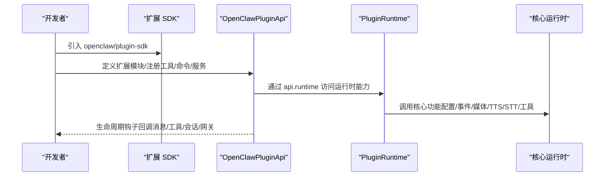
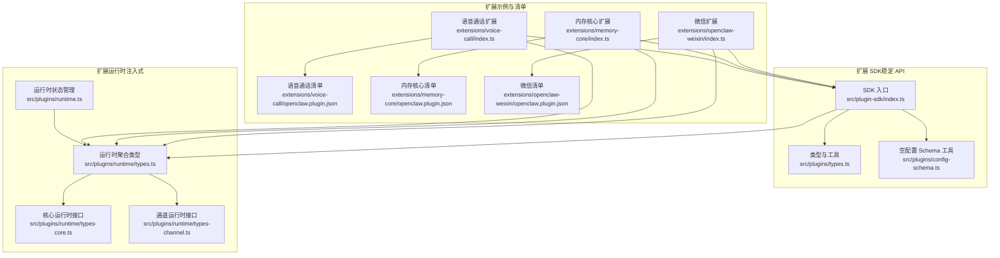
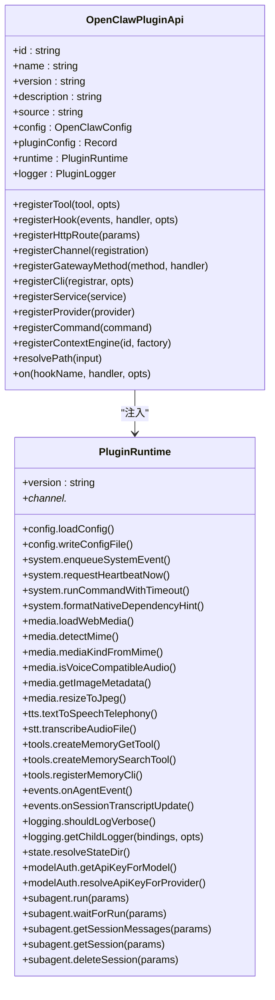
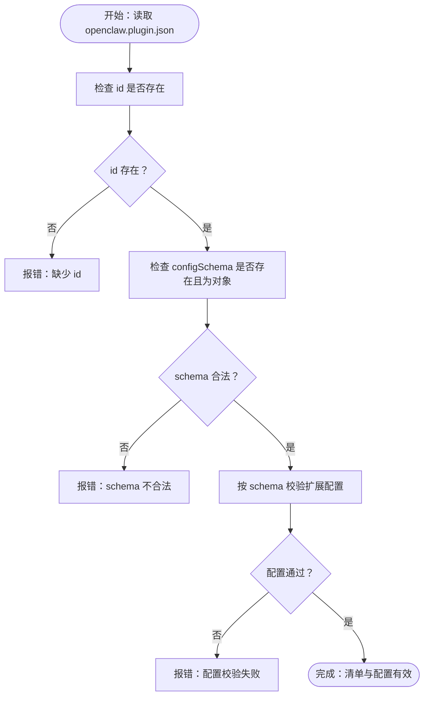
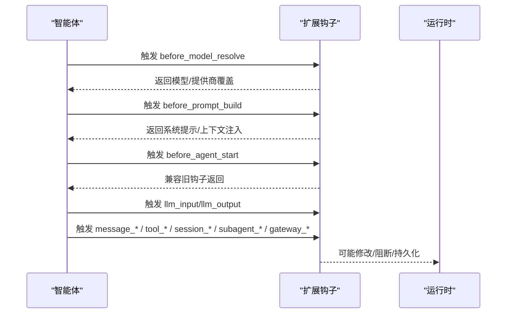
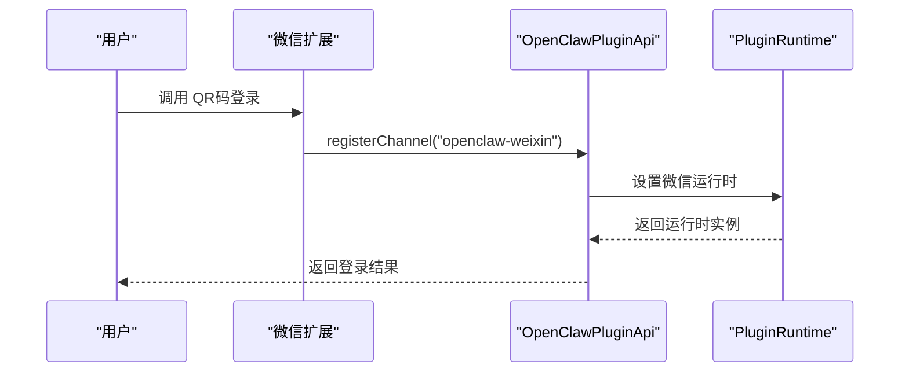
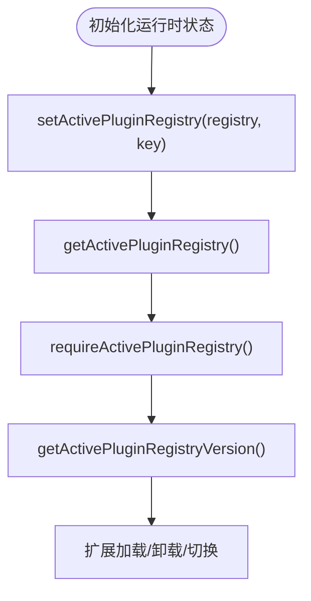
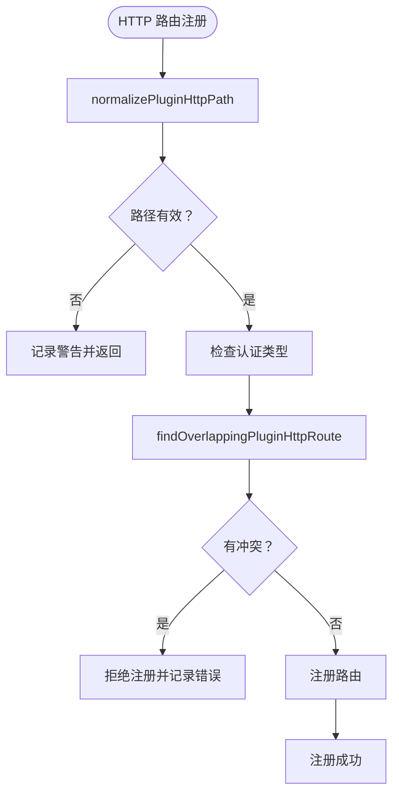
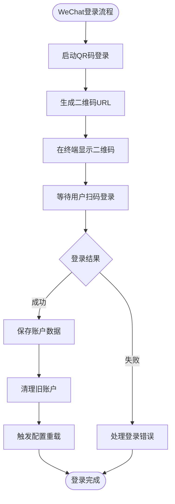
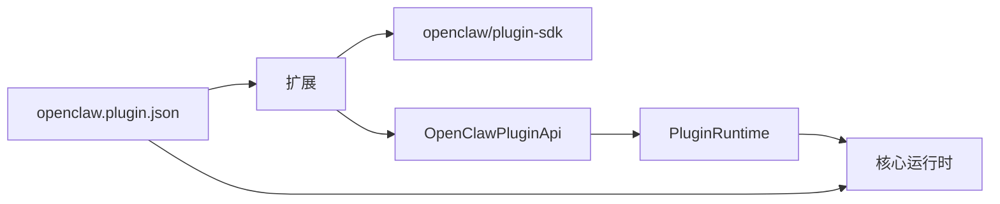

# 插件系统

<cite>
**本文引用的文件**
- [index.ts](file://src/plugin-sdk/index.ts)
- [plugin-sdk.md](file://docs/refactor/plugin-sdk.md)
- [manifest.md](file://docs/plugins/manifest.md)
- [types.ts](file://src/plugins/types.ts)
- [runtime/types.ts](file://src/plugins/runtime/types.ts)
- [runtime/types-channel.ts](file://src/plugins/runtime/types-channel.ts)
- [runtime/types-core.ts](file://src/plugins/runtime/types-core.ts)
- [config-schema.ts](file://src/plugins/config-schema.ts)
- [runtime.ts](file://src/plugins/runtime.ts)
- [registry.ts](file://src/plugins/registry.ts)
- [http-registry.ts](file://src/plugins/http-registry.ts)
- [http-path.ts](file://src/plugins/http-path.ts)
- [http-route-overlap.ts](file://src/plugins/http-route-overlap.ts)
- [target-normalization.ts](file://src/infra/outbound/target-normalization.ts)
- [discord.ts](file://src/channels/plugins/normalize/discord.ts)
- [imessage.ts](file://src/channels/plugins/normalize/imessage.ts)
- [openclaw.plugin.json](file://extensions/voice-call/openclaw.plugin.json)
- [index.ts](file://extensions/voice-call/index.ts)
- [openclaw.plugin.json](file://extensions/memory-core/openclaw.plugin.json)
- [index.ts](file://extensions/memory-core/index.ts)
- [openclaw.plugin.json](file://extensions/openclaw-weixin/openclaw.plugin.json)
- [index.ts](file://extensions/openclaw-weixin/index.ts)
- [package.json](file://extensions/openclaw-weixin/package.json)
- [README.md](file://extensions/openclaw-weixin/README.md)
- [channel.ts](file://extensions/openclaw-weixin/src/channel.ts)
- [config-schema.ts](file://extensions/openclaw-weixin/src/config/config-schema.ts)
- [compat.ts](file://extensions/openclaw-weixin/src/compat.ts)
- [runtime.ts](file://extensions/openclaw-weixin/src/runtime.ts)
- [weixin-cli.ts](file://extensions/openclaw-weixin/src/weixin-cli.ts)
- [accounts.ts](file://extensions/openclaw-weixin/src/auth/accounts.ts)
- [inbound.ts](file://extensions/openclaw-weixin/src/messaging/inbound.ts)
- [SECURITY.md](file://SECURITY.md)
- [index.md](file://docs/extensions/index.md)
- [authoring.md](file://docs/extensions/authoring.md)
- [hooks.md](file://docs/extensions/hooks.md)
- [sdk-api.md](file://docs/extensions/sdk-api.md)
- [loading.md](file://docs/extensions/loading.md)
- [catalog.md](file://docs/extensions/catalog.md)
- [limitations.md](file://docs/extensions/limitations.md)
- [plugins.d.ts](file://dist/plugin-sdk/gateway/protocol/schema/plugins.d.ts)
- [plugins.ts](file://src/gateway/protocol/schema/plugins.ts)
- [plugins-http.ts](file://src/gateway/server/plugins-http.ts)
- [plugins.ts](file://src/gateway/server-methods/plugins.ts)
- [status.ts](file://src/plugins/status.ts)
- [install.ts](file://src/plugins/install.ts)
- [config.ts](file://ui/src/ui/controllers/config.ts)
- [app-view-state.ts](file://ui/src/ui/app-view-state.ts)
- [navigation.ts](file://ui/src/ui/navigation.ts)
</cite>

## 更新摘要
**变更内容**
- 新增WeChat扩展(openclaw-weixin)的完整插件系统集成
- 包括插件清单、配置模式、运行时支持、QR码登录、多账户管理等功能
- 更新扩展目录，新增WeChat通道扩展
- 增强插件协议与服务器端处理能力
- 完善UI状态管理与界面集成

## 目录
1. [简介](#简介)
2. [扩展系统概述](#扩展系统概述)
3. [扩展系统文档结构](#扩展系统文档结构)
4. [扩展系统架构](#扩展系统架构)
5. [扩展生命周期钩子](#扩展生命周期钩子)
6. [扩展SDK API参考](#扩展sdk-api参考)
7. [扩展加载机制](#扩展加载机制)
8. [扩展目录](#扩展目录)
9. [扩展已知限制](#扩展已知限制)
10. [插件协议与服务器端处理](#插件协议与服务器端处理)
11. [UI状态管理与界面集成](#ui状态管理与界面集成)
12. [插件安装与管理](#插件安装与管理)
13. [项目结构](#项目结构)
14. [核心组件](#核心组件)
15. [架构总览](#架构总览)
16. [详细组件分析](#详细组件分析)
17. [依赖关系分析](#依赖关系分析)
18. [性能考量](#性能考量)
19. [故障排查指南](#故障排查指南)
20. [结论](#结论)
21. [附录](#附录)

## 简介
本文件系统性阐述 OpenClaw 扩展体系的设计与实现，覆盖扩展架构、注册机制、运行时与安全边界、开发 SDK、API 接口、生命周期管理、配置与依赖、版本兼容策略、测试与发布流程，以及扩展市场、安装与更新策略。OpenClaw 使用扩展系统（也称为插件系统）来添加通道、AI 提供商、代理工具、CLI 命令、后台服务和生命周期钩子，而无需修改核心网关。

**更新** 新增WeChat扩展(openclaw-weixin)的完整集成，支持QR码登录、多账户管理、CDN上传下载等高级功能。

## 扩展系统概述
OpenClaw 使用扩展系统（也称为插件系统）来添加通道、AI 提供商、代理工具、CLI 命令、后台服务和生命周期钩子，而无需修改核心网关。所有内置通道（Telegram、Discord、WhatsApp、**WeChat** 等）和身份验证提供商（MiniMax、Qwen、Gemini 等）都是扩展本身。第三方扩展遵循完全相同的合约。

### 核心概念
- **两个清单文件**：每个扩展目录包含两个文件
  - `package.json`：npm 包描述符；`openclaw.extensions` 字段列出入口点
  - `openclaw.plugin.json`：运行时清单；声明 `id`、`configSchema`、可选的 `kind`、`channels`、`providers`
- **扩展来源优先级**：从四个位置发现扩展，当同一 `id` 出现在多个位置时，最高优先级的源获胜
- **扩展种类**：大多数扩展没有 `kind` 并可以自由共存，有两个种类是独占槽位
- **注册模型**：扩展在加载时同步注册，每个扩展接收 `OpenClawPluginApi` 实例并调用 `api.registerXxx()` 方法

**章节来源**
- [index.md:10-127](file://docs/extensions/index.md#L10-L127)

## 扩展系统文档结构
扩展系统文档结构现已完善，包含以下7个核心文档：

### 扩展概览
- [扩展概览](./index.md) - 扩展系统的核心概念、架构和快速链接
- [扩展目录](./catalog.md) - 42个内置扩展的完整列表，按类别分组
- [编写扩展](./authoring.md) - 从零开始构建新扩展的分步指南
- [生命周期钩子](./hooks.md) - 26个可用的生命周期钩子事件
- [SDK API](./sdk-api.md) - 所有 `api.registerXxx()` 方法的完整参考
- [加载机制](./loading.md) - 发现→清单→jiti→注册的九阶段流水线
- [已知限制](./limitations.md) - jiti加载的注意事项和设计约束

**章节来源**
- [index.md:16-24](file://docs/extensions/index.md#L16-L24)

## 扩展系统架构
扩展系统采用"SDK + 运行时"的双层架构，确保：
- SDK 层稳定、可发布、无副作用
- 运行时仅通过 api.runtime 注入，屏蔽内部实现细节
- 清单驱动的发现与校验，保障配置阶段的安全与一致性
- 扩展生命周期钩子贯穿消息收发、工具调用、会话与子代理、网关启停等关键节点


```mermaid
sequenceDiagram
participant Dev as "开发者"
participant SDK as "扩展 SDK"
participant API as "OpenClawPluginApi"
participant RT as "PluginRuntime"
participant Core as "核心运行时"
Dev->>SDK : 引入 openclaw/plugin-sdk
Dev->>API : 定义扩展模块/注册工具/命令/服务
API->>RT : 通过 api.runtime 访问运行时能力
RT->>Core : 调用核心功能配置/事件/媒体/TTS/STT/工具
API-->>Dev : 生命周期钩子回调消息/工具/会话/网关
```

**图表来源**
- [index.ts:1-826](file://src/plugin-sdk/index.ts#L1-L826)
- [types.ts:263-306](file://src/plugins/types.ts#L263-L306)
- [runtime/types.ts:51-63](file://src/plugins/runtime/types.ts#L51-L63)

**章节来源**
- [index.ts:1-826](file://src/plugin-sdk/index.ts#L1-L826)
- [types.ts:1-893](file://src/plugins/types.ts#L1-L893)
- [runtime/types.ts:1-64](file://src/plugins/runtime/types.ts#L1-L64)
- [runtime/types-core.ts:1-68](file://src/plugins/runtime/types-core.ts#L1-L68)
- [runtime/types-channel.ts:1-166](file://src/plugins/runtime/types-channel.ts#L1-L166)

## 扩展生命周期钩子
扩展通过 `api.on(hookName, handler)` 注册类型化的生命周期钩子。钩子在代理、消息、工具、会话、子代理和网关生命周期的定义点触发。

### 安全策略
有两个钩子可以向系统提示注入内容，并受 `plugins.entries.<id>.hooks.allowPromptInjection` 控制：
- `before_prompt_build` - 当 `allowPromptInjection: false` 时完全阻止
- `before_agent_start` - 提示修改字段（`systemPrompt`、`prependContext` 等）被剥离；模型覆盖字段被保留

### 代理生命周期钩子
- `before_model_resolve` - 模型选择前，用于覆盖特定运行的模型或提供商
- `before_prompt_build` - 系统提示组装前，用于注入静态或动态上下文
- `before_agent_start` - 代理运行开始时（新代码推荐使用分离的两个钩子）
- `llm_input` - LLM 请求发送前（仅观察）
- `llm_output` - 收到LLM响应后（仅观察）
- `agent_end` - 代理运行完成时（成功或失败）

### 会话生命周期钩子
- `session_start` - 会话开始时
- `session_end` - 会话结束时

### 工具调用钩子
- `before_tool_call` - 工具调用前，返回 `params` 覆盖参数，或 `block: true` 阻止调用
- `after_tool_call` - 工具调用完成后（仅观察）
- `tool_result_persist` - 工具结果消息写入会话JSONL之前，返回修改后的 `message`
- `before_message_write` - **任何**消息写入JSONL之前，返回 `{ block: true }` 阻止持久化

### 消息生命周期钩子
- `message_received` - 来自任何通道的入站消息到达时
- `message_sending` - 出站消息发送前，返回 `{ cancel: true }` 抑制投递，或 `{ content: "..." }` 替换消息正文
- `message_sent` - 出站消息投递后（或失败）（仅观察）

### 子代理生命周期钩子
- `subagent_spawning` - 子代理即将创建时，返回 `{ status: "error", error: "..." }` 取消创建
- `subagent_delivery_target` - 允许扩展重定向子代理输出的交付目标
- `subagent_spawned` - 子代理进程启动后（仅观察）
- `subagent_ended` - 子代理完成、超时或被杀死时

### 网关生命周期钩子
- `gateway_start` - 网关HTTP服务器准备好接受连接时
- `gateway_stop` - 网关关闭时

**章节来源**
- [hooks.md:9-311](file://docs/extensions/hooks.md#L9-L311)

## 扩展SDK API参考
每个扩展接收 `OpenClawPluginApi` 实例作为其 `register()` 函数的参数。API按扩展范围作用域化——所有注册都标记扩展的id以便诊断和所有权跟踪。

### 导入模式
每个扩展从其自己的SDK子路径导入，以保持依赖关系窄化：
```ts
import type { OpenClawPluginApi } from "openclaw/plugin-sdk/<extension-id>";
```

### api.registerTool()
注册一个代理工具（JSON Schema函数），LLM可以在代理运行期间调用。

### api.registerChannel()
注册一个消息通道（Telegram、Discord、WhatsApp、**WeChat** 等）。

### api.registerProvider()
注册一个具有一个或多个身份验证方法的AI提供商。

### api.registerService()
注册一个与网关生命周期绑定的后台服务（`start` / `stop`）。

### api.registerCommand()
注册一个斜杠命令（例如 `/phone arm`），在LLM代理之前处理且不消耗AI令牌。

### api.registerHook() / api.on()
两种注册生命周期钩子的方式：
```ts
// 推荐—类型安全，带编译时安全
api.on("before_model_resolve", (event, ctx) => {
  return { modelOverride: "claude-opus-4-5" };
});

// 传统—未类型的字符串事件
api.registerHook("before_model_resolve", handler, { name: "my-hook" });
```

### api.registerHttpRoute()
注册由网关内置HTTP服务器提供的HTTP路由。

### api.registerGatewayMethod()
在网关上注册自定义JSON-RPC方法。

### api.registerCli()
将子命令注入OpenClaw CLI。

### api.registerContextEngine()
注册一个上下文引擎实现。一次只能激活一个上下文引擎（独占槽位）。

### api.resolvePath()
解析用户提供的路径字符串（支持 `~` 扩展和相对路径）。

### 元数据字段
API对象还公开关于扩展的只读元数据：
- `api.id` - 扩展id
- `api.name` - 显示名称
- `api.version` - 来自清单的版本
- `api.description` - 来自清单的描述
- `api.source` - 入口文件的绝对路径
- `api.config` - 完整的网关配置
- `api.pluginConfig` - 扩展特定配置（`plugins.entries.<id>.config`）
- `api.runtime` - 运行时服务（工具、通道、状态、配置IO）
- `api.logger` - 作用域化日志记录器（`info`、`warn`、`error`、`debug`）

**章节来源**
- [sdk-api.md:9-212](file://docs/extensions/sdk-api.md#L9-L212)

## 扩展加载机制
扩展在网关启动时由 `loadOpenClawPlugins()` 同步加载，流水线有九个阶段。

### 阶段概览
```
loadOpenClawPlugins()
        │
        ▼
[1] 发现扫描 4个源位置，收集候选[]
        │
        ▼
[2] 清单注册 为每个候选读取 openclaw.plugin.json
        │
        ▼
[3] 启用/禁用 应用允许/拒绝列表，内存槽策略
        │
        ▼
[4] Jiti初始化 懒创建jiti加载器与SDK别名映射
        │
        ▼
[5] 模块加载 jiti(source) — 直接运行.ts，无需构建步骤
        │
        ▼
[6] 导出解析 支持对象、函数和activate()导出
        │
        ▼
[7] 配置验证 使用JSON Schema验证plugins.entries[id].config
        │
        ▼
[8] API创建 createApi(record) — 每扩展隔离API
        │
        ▼
[9] register(api) 扩展初始化，调用api.registerXxx()
```

### 阶段1 — 发现
`discoverOpenClawPlugins()` 按优先级顺序扫描四个位置：
- `config` - `plugins.load.paths` 中的每个路径
- `workspace` - `<workspaceDir>/.openclaw/extensions/`
- `bundled` - 内部扩展目录（由 `OPENCLAW_BUNDLED_PLUGINS_DIR` 设置）
- `global` - `~/.openclaw/extensions/`

对于每个目录，扫描器读取 `package.json` 并查找 `openclaw.extensions` 以找到入口文件。如果该字段不存在，则回退到 `index.ts / index.js / index.mjs / index.cjs`。

**安全检查应用于每个候选：**
- 源文件路径不得逃逸插件根目录（符号链接遍历检查）
- 插件根和源路径不得是世界可写的（模式 & 0o002）
- 文件所有者UID必须匹配当前进程UID或root（非捆绑插件）
- 硬链接被拒绝（非捆绑插件）

### 阶段2 — 清单注册
`loadPluginManifestRegistry()` 为每个发现的候选读取 `openclaw.plugin.json` 并验证：
- `id` 字段存在且非空
- `configSchema` 字段是JSON对象

### 阶段3 — 启用/禁用决策
对于每个具有有效清单的候选，`resolveEffectiveEnableState()` 确定扩展是否应该加载：
1. **显式禁用**：`plugins.entries.<id>.enabled = false` → 禁用
2. **允许列表**：如果 `plugins.allow` 非空且扩展id不在其中 → 禁用（当 `channels.<id>.enabled = true` 时捆绑通道扩展自动启用）
3. **拒绝列表**：`plugins.deny` 包含该id → 禁用
4. **内存槽**：如果 `kind = "memory"` 且 `plugins.slots.memory` 命名了不同的扩展 → 禁用（快速路径，避免导入重型依赖）

### 阘段4 — Jiti加载器初始化
jiti加载器是**懒创建**的——如果所有扩展都被禁用（单元测试中的常见情况），则永远不会初始化。

当首次需要时，调用 `createJiti()` 与：
- `interopDefault: true` — 支持 `export default` 和 `module.exports`
- `extensions` — 接受所有TypeScript和JavaScript变体：`.ts`、`.tsx`、`.mts`、`.cts`、`.js`、`.mjs`、`.cjs`、`.json`
- `alias` — 将 `openclaw/plugin-sdk` 和每个子路径（例如 `openclaw/plugin-sdk/memory-core`）映射到磁盘上的实际文件

**SDK别名解析**沿加载器文件向上遍历目录树（最多6级），寻找：
- Loader运行于 `dist/` 或 `NODE_ENV=production` | `dist/plugin-sdk/<name>.js`
- Loader运行于 `src/` 开发环境 | `src/plugin-sdk/<name>.ts`

### 阶段5 — 模块加载
```ts
mod = getJiti()(safeSource);
```

jiti直接执行扩展的TypeScript源码——**扩展不需要构建步骤**。如果模块在导入时抛出异常，扩展被标记为 `error`，加载继续下一个扩展。

### 阶段6 — 导出解析
支持三种导出形状：
```ts
// 形状A — 标准对象与register()
export default {
  id: "my-ext",
  register(api) { ... },
};

// 形状B — 裸函数
export default function(api) { ... };

// 形状C — 传统别名
export default {
  activate(api) { ... },
};
```

### 阶段7 — 配置验证
扩展的 `configSchema`（来自 `openclaw.plugin.json`）用于验证来自用户配置文件的 `plugins.entries.<id>.config`。验证失败将扩展标记为 `error` 并记录模式错误。

### 阶段8 — API创建
`createApi(record, { config, pluginConfig })` 生成绑定到扩展记录的 `OpenClawPluginApi`。此API上的所有 `registerXxx()` 调用都写入共享的 `PluginRegistry`，标记为扩展的id，因此诊断和所有权始终可追踪。

网关 `runtime` 通过 `Proxy` 注入，因此只有当扩展实际访问运行时才物化运行时对象，保持简单扩展的启动速度。

### 阶段9 — register(api)
`register(api)` 同步调用。如果它返回 Promise，Promise将被**忽略**并发出 `warn` 诊断——不支持异步注册。

如果 `register` 抛出异常，扩展被标记为 `error`，记录错误，并继续加载下一个扩展。

### 缓存
加载的 `PluginRegistry` 以内存缓存，按键 `(workspaceDir, pluginsConfig)`。后续使用相同键的调用立即返回缓存的注册表并重新初始化全局钩子运行器。传递 `cache: false` 强制全新加载（测试和配置重载流程使用）。

**章节来源**
- [loading.md:10-175](file://docs/extensions/loading.md#L10-L175)

## 扩展目录
OpenClaw包含42个内置扩展，按类别分组：

### 通道扩展
通道扩展调用 `api.registerChannel()` 添加消息界面：
- `bluebubbles` - BlueBubbles服务器（macOS iMessage替代）
- `discord` - Discord机器人
- `feishu` - 飞书（Lark）
- `googlechat` - Google Chat
- `imessage` - iMessage（iOS/macOS，通过AppleScript或BlueBubbles）
- `irc` - IRC
- `line` - LINE Messenger
- `matrix` - Matrix协议
- `mattermost` - Mattermost
- `msteams` - Microsoft Teams
- `nextcloud-talk` - Nextcloud Talk
- `nostr` - Nostr去中心化协议
- `signal` - Signal
- `slack` - Slack
- `synology-chat` - Synology Chat
- `talk-voice` - 语音对话通道
- `telegram` - Telegram机器人
- `tlon` - Tlon/Urbit
- `twitch` - Twitch聊天
- `voice-call` - 语音通话通道
- `whatsapp` - WhatsApp（web协议）
- `zalo` - Zalo官方机器人API
- `zalouser` - Zalo用户端（个人账户）
- **openclaw-weixin** - **微信通道（支持QR码登录、多账户管理、CDN上传下载）**

### 身份验证/提供商扩展
提供商扩展调用 `api.registerProvider()` 添加具有OAuth或API密钥身份验证流程的AI提供商：
- `copilot-proxy` - GitHub Copilot - 代理/令牌
- `google-antigravity-auth` - Google（Anti-gravity） - OAuth设备代码
- `google-gemini-cli-auth` - Google Gemini CLI - OAuth设备代码
- `minimax-portal-auth` - MiniMax门户 - OAuth设备代码
- `qwen-portal-auth` - 阿里巴巴Qwen门户 - OAuth设备代码

### 内存扩展
内存扩展设置 `kind: "memory"` 并注册代理工具进行内存搜索/检索。一次只能激活一个内存扩展（由 `plugins.slots.memory` 选择）：
- `memory-core` - 基于文件的搜索 - 默认（memory-core）
- `memory-lancedb` - LanceDB向量数据库 -非默认

### 服务和命令扩展
这些扩展注册后台服务（`api.registerService()`）和/或斜杠命令（`api.registerCommand()`），它们绕过LLM：
- `phone-control` - 到期计时器（每15秒检查锁定状态） - `/phone arm|disarm|status`

### 工具和CLI扩展
- `diffs` - 工具 - 文件差异比较
- `llm-task` - 工具 - LLM子任务调度
- `open-prose` - 工具 - 文本处理
- `memory-core` - 工具 + CLI - 内存搜索 + `openclaw memory` CLI

### 核心/基础设施扩展
- `acpx` - ACP扩展协议支持
- `device-pair` - 设备配对管理
- `diagnostics-otel` - OpenTelemetry分布式跟踪
- `lobster` - CLI终端颜色调色板
- `thread-ownership` - 会话所有权跟踪

### 测试和开发扩展
- `shared` - 共享测试助手（不运行时加载）
- `test-utils` - 测试实用程序集合

**更新** 新增WeChat扩展(openclaw-weixin)，支持QR码登录、多账户管理、CDN上传下载等高级功能。

**章节来源**
- [catalog.md:9-97](file://docs/extensions/catalog.md#L9-L97)

## 扩展已知限制
本文档记录了扩展系统的已知陷阱和设计约束。理解这些可以避免难以调试的静默失败。

### 不支持异步 `register()`
**最常见的静默失败来源。**

`register(api)` 同步调用。如果它返回 `Promise`，Promise将被**丢弃**并发出 `warn` 级诊断，然后继续执行。`api.registerXxx()` 调用在启动过程中与网关竞争——实际上总是失败：注册永远不会生效。

```ts
// 错误—register返回Promise；工具从未注册
export default {
  id: "my-ext",
  async register(api) {
    const data = await fetch("https://api.example.com/config").then((r) => r.json());
    api.registerTool(buildTool(data));  // 启动时永远无法到达
  },
};
```

```ts
// 正确—register是同步的；异步工作移动到服务
export default {
  id: "my-ext",
  register(api) {
    // 同步注册工具与静态定义。
    api.registerTool(myTool);

    // 将异步初始化推迟到服务。
    api.registerService({
      id: "my-ext-init",
      start: async (_ctx) => {
        const data = await fetch("https://api.example.com/config").then((r) => r.json());
        // 在工具调用时存储结果供工具读取。
      },
      stop: async (_ctx) => {},
    });
  },
};
```

如果在 `openclaw plugins status --deep` 中看到类似 `"my-ext: register() returned a Promise; async registration is not supported"` 的 `warn` 诊断，这就是原因。

### Jiti直接执行TypeScript—无需构建步骤，但有折衷
加载器使用 [jiti](https://github.com/unjs/jiti) 直接运行 `.ts` 源码，无需预构建步骤。这对开发很便利，但有影响：

#### 动态导入混合
不要在同一扩展文件中混合使用 `await import("x")` 和 `import ... from "x"`。当jiti转换文件时，两种导入风格可能解析到不同的模块实例，导致类型不匹配、双重初始化或运行时错误。

如果需要延迟加载，将它隔离在专用的 `*.runtime.ts` 边界文件中并动态导入该边界：
```ts
// my-ext/heavy.runtime.ts
export { heavyLib } from "heavy-lib";   // 仅在此处使用静态导入

// my-ext/index.ts
export default {
  id: "my-ext",
  register(api) {
    api.registerService({
      id: "my-ext-heavy",
      start: async (_ctx) => {
        const { heavyLib } = await import("./heavy.runtime.js");
        heavyLib.init();
      },
      stop: async (_ctx) => {},
    });
  },
};
```

重构任何触及延迟加载边界的代码后，运行 `pnpm build` 并检查 `[INEFFECTIVE_DYNAMIC_IMPORT]` 警告。

#### jiti不支持的TypeScript特性
jiti使用esbuild剥离类型并支持大多数TypeScript语法。以下特性**不支持**或行为不同：
- `const enum` — 使用常规 `enum` 或纯对象字面量
- 在 `tsconfig.json` `paths` 中定义的路径别名 — 仅加载器注入 `openclaw/plugin-sdk/*` 别名。其他路径别名（例如 `@/foo`）不会解析
- `emitDecoratorMetadata` — 不支持
- 某些仅 `.d.ts` 类型导入与 `import type ... assert { type: "json" }` 语法

#### 堆栈跟踪中的源映射
当扩展抛出错误时，jiti的源映射用于指向原始 `.ts` 文件。堆栈跟踪通常准确，但在具有复杂宏或条件编译的文件中行号可能偏移。

### 安全检查拒绝某些文件布局
发现阶段对每个候选应用安全检查。失败的扩展会被静默跳过（发出 `warn` 诊断）并且永远不会到达 `register()`。

| 检查 | 原因 | 修复 |
|---|---|---|
| 世界可写路径 | 扩展目录或源文件具有 `o+w` 权限（模式 & 0o002） | `chmod o-w <dir>` |
| UID不匹配 | 文件所有者UID不匹配当前进程UID（非捆绑仅） | 确保文件由运行网关的用户拥有 |
| 硬链接被拒绝 | 源文件是硬链接（非捆绑仅） | 使用普通文件或符号链接 |
| 路径遍历 | 源路径通过符号链接逃逸插件根 | 解析符号链接使其保持在插件目录内 |
| 备份目录 | 目录名称匹配 `*.bak`、`*.backup-*` 或 `*.disabled` | 重命名目录 |

运行 `openclaw plugins status --deep` 查看哪个检查失败。

### 缺少 `openclaw.plugin.json` 或无效
`openclaw.plugin.json` 是必需的且必须有效。缺少、无法解析或结构无效的清单会在清单阶段阻止扩展加载——模块文件从未被导入。验证器检查：
- `id` 字段：存在且非空字符串
- `configSchema` 字段：存在且为JSON对象

其他字段（`name`、`description`、`kind`、`uiHints`）是可选的。

### 独占槽位：内存和上下文引擎
一次只能激活**一个** `"kind": "memory"` 和一个 `"kind": "context-engine"` 的扩展。活跃扩展由以下配置选择：
```json5
{
  plugins: {
    slots: {
      memory: "memory-lancedb",       // 默认："memory-core"
      contextEngine: "my-context-engine",
    },
  },
}
```

所有其他具有相同 `kind` 的扩展在第3阶段（模块加载之前）被禁用，状态为 `disabled`，原因是 `"memory slot taken by <id>"`。这是有意为之，不是错误。

### 配置验证在加载时拒绝
如果 `plugins.entries.<id>.config` 不满足 `openclaw.plugin.json` 中声明的 `configSchema`，扩展被标记为 `error` 且不调用 `register()`。仔细检查模式——特别是 `additionalProperties: false`，它会拒绝未知键。

### 注册表缓存按配置快照键控
加载的 `PluginRegistry` 以内存缓存，按键 `(workspaceDir, pluginsConfig)`。如果在磁盘上更改配置文件，必须重启网关才能使新配置生效。传递 `cache: false` 给内部加载器API会绕过缓存（测试和配置重载流程使用）。

### `api.registerHttpHandler()` 已删除
旧的 `api.registerHttpHandler(...)` API已被删除。如果扩展调用它，加载器捕获 `TypeError` 并记录诊断：
```
deprecated api.registerHttpHandler(...) was removed; use api.registerHttpRoute(...) for
plugin-owned routes or registerPluginHttpRoute(...) for dynamic lifecycle routes
```

将所有使用替换为 `api.registerHttpRoute()`。

### 禁止原型变异
根据项目编码风格，扩展**不得**通过原型变异共享行为（`Class.prototype.method = ...`、`Object.defineProperty` 到 `.prototype`）。依赖原型修补的扩展将失败类型检查和代码审查。

### 扩展不能在 `dependencies` 中使用 `workspace:*`
当OpenClaw安装第三方插件时，它在插件目录内运行 `npm install --omit=dev`。pnpm `workspace:*` 规范不受普通npm理解，导致安装失败。将 `openclaw` 放在 `devDependencies` 或 `peerDependencies` 中。

### `register()` 抛出对其他扩展是非致命的
如果 `register()` 抛出，扩展被标记为 `error`，加载继续下一个扩展。单个坏扩展不会阻止其余扩展加载。检查 `openclaw plugins status` 确认所有预期扩展的状态为 `loaded`。

### 增强的错误处理和验证功能
**更新** 系统现在提供了更强大的错误处理和验证功能：

#### HTTP 路由注册增强
- 更严格的路径规范化：自动处理前缀斜杠和空白字符
- 冲突检测：防止路由重叠和权限冲突
- 替换控制：支持受控的路由替换操作
- 诊断信息：提供详细的冲突报告和解决建议

#### CLI 注册增强
- 命令验证：检查命令名称的有效性和唯一性
- 重复检测：防止重复注册相同命令
- 参数验证：确保命令参数符合规范

#### 通道注册增强
- 目标规范化：改进通道目标ID的标准化处理
- 冲突处理：更好地处理通道间的目标冲突
- 缓存机制：优化通道规范化函数的缓存策略

**章节来源**
- [limitations.md:10-202](file://docs/extensions/limitations.md#L10-L202)

## 插件协议与服务器端处理

### 插件协议Schema定义
系统新增了完整的插件协议Schema定义，提供类型安全的插件通信接口：

#### 插件UI提示Schema
```typescript
const PluginConfigUiHintSchema = Type.Object({
  label: Type.Optional(Type.String()),
  help: Type.Optional(Type.String()),
  tags: Type.Optional(Type.Array(Type.String())),
  advanced: Type.Optional(Type.Boolean()),
  sensitive: Type.Optional(Type.Boolean()),
  placeholder: Type.Optional(Type.String()),
});
```

#### 插件记录Schema
```typescript
const PluginRecordSchema = Type.Object({
  id: Type.String(),
  name: Type.String(),
  version: Type.Optional(Type.String()),
  description: Type.Optional(Type.String()),
  kind: Type.Optional(Type.String()),
  source: Type.String(),
  origin: Type.String(),
  workspaceDir: Type.Optional(Type.String()),
  enabled: Type.Boolean(),
  status: Type.Union([
    Type.Literal('loaded'),
    Type.Literal('disabled'),
    Type.Literal('error')
  ]),
  error: Type.Optional(Type.String()),
  toolNames: Type.Array(Type.String()),
  hookNames: Type.Array(Type.String()),
  channelIds: Type.Array(Type.String()),
  providerIds: Type.Array(Type.String()),
  gatewayMethods: Type.Array(Type.String()),
  cliCommands: Type.Array(Type.String()),
  services: Type.Array(Type.String()),
  commands: Type.Array(Type.String()),
  httpRoutes: Type.Number(),
  hookCount: Type.Number(),
  configSchema: Type.Boolean(),
  configUiHints: Type.Optional(Type.Record(Type.String(), PluginConfigUiHintSchema)),
  configJsonSchema: Type.Optional(Type.Record(Type.String(), Type.Unknown())),
});
```

#### 插件状态查询Schema
```typescript
const PluginsStatusParamsSchema = Type.Object({});
const PluginsStatusResultSchema = Type.Object({
  plugins: Type.Array(PluginRecordSchema),
  workspaceDir: Type.Optional(Type.String()),
  diagnostics: Type.Optional(Type.Array(Type.Object({
    level: Type.Union([Type.Literal('warn'), Type.Literal('error')]),
    message: Type.String(),
    pluginId: Type.Optional(Type.String()),
    source: Type.Optional(Type.String()),
  }))),
});
```

#### 插件启用控制Schema
```typescript
const PluginsEnableParamsSchema = Type.Object({
  pluginId: Type.String(),
  enabled: Type.Boolean(),
});
const PluginsEnableResultSchema = Type.Object({
  pluginId: Type.String(),
  enabled: Type.Boolean(),
  reason: Type.Optional(Type.String()),
});
```

#### 插件安装Schema
```typescript
const PluginsInstallParamsSchema = Type.Object({
  spec: Type.String(), // npm规范或路径
});
const PluginsInstallResultSchema = Type.Object({
  ok: Type.Boolean(),
  pluginId: Type.Optional(Type.String()),
  version: Type.Optional(Type.String()),
  error: Type.Optional(Type.String()),
  code: Type.Optional(Type.String()),
});
```

**章节来源**
- [plugins.d.ts:1-105](file://dist/plugin-sdk/gateway/protocol/schema/plugins.d.ts#L1-L105)
- [plugins.ts:1-107](file://src/gateway/protocol/schema/plugins.ts#L1-L107)

### 服务器端插件HTTP路由处理
系统实现了完整的插件HTTP路由处理机制：

#### HTTP路由注册与匹配
```typescript
export function createGatewayPluginRequestHandler(params: {
  registry: PluginRegistry;
  log: SubsystemLogger;
}): PluginHttpRequestHandler {
  const { registry, log } = params;
  return async (req, res, providedPathContext, dispatchContext) => {
    const routes = registry.httpRoutes ?? [];
    if (routes.length === 0) {
      return false;
    }

    const pathContext = providedPathContext ?? 
      resolvePluginRoutePathContext(new URL(req.url ?? "/", "http://localhost").pathname);
    const matchedRoutes = findMatchingPluginHttpRoutes(registry, pathContext);
    
    // 检查认证要求
    if (matchedRoutesRequireGatewayAuth(matchedRoutes) && 
        dispatchContext?.gatewayAuthSatisfied === false) {
      log.warn(`plugin http route blocked without gateway auth (${pathContext.canonicalPath})`);
      return false;
    }

    // 处理匹配的路由
    for (const route of matchedRoutes) {
      try {
        const handled = await route.handler(req, res);
        if (handled !== false) {
          return true;
        }
      } catch (err) {
        log.warn(`plugin http route failed (${route.pluginId ?? "unknown"}): ${String(err)}`);
        if (!res.headersSent) {
          res.statusCode = 500;
          res.setHeader("Content-Type", "text/plain; charset=utf-8");
          res.end("Internal Server Error");
        }
        return true;
      }
    }
    return false;
  };
};
```

#### 路由路径上下文解析
系统支持插件路由的路径解析和上下文管理，包括：
- 路径规范化处理
- 路由匹配算法
- 认证状态检查
- 错误处理和日志记录

**章节来源**
- [plugins-http.ts:1-79](file://src/gateway/server/plugins-http.ts#L1-L79)

### 插件服务器端方法处理
系统提供了完整的插件管理JSON-RPC方法：

#### 插件状态查询
```typescript
"plugins.status": ({ params, respond }) => {
  if (!validatePluginsStatusParams(params)) {
    respond(false, undefined, errorShape(
      ErrorCodes.INVALID_REQUEST,
      `invalid plugins.status params: ${formatValidationErrors(validatePluginsStatusParams.errors)}`
    ));
    return;
  }
  try {
    const report = buildPluginStatusReport();
    respond(true, {
      plugins: report.plugins,
      workspaceDir: report.workspaceDir,
      diagnostics: report.diagnostics,
    });
  } catch (err) {
    respond(false, undefined, errorShape(ErrorCodes.UNAVAILABLE, String(err)));
  }
},
```

#### 插件启用/禁用控制
```typescript
"plugins.enable": async ({ params, respond }) => {
  if (!validatePluginsEnableParams(params)) {
    respond(false, undefined, errorShape(
      ErrorCodes.INVALID_REQUEST,
      `invalid plugins.enable params: ${formatValidationErrors(validatePluginsEnableParams.errors)}`
    ));
    return;
  }
  const { pluginId, enabled } = params as { pluginId: string; enabled: boolean };
  try {
    const cfg = loadConfig();
    let nextCfg: OpenClawConfig;
    let actualEnabled: boolean;
    let reason: string | undefined;
    
    if (enabled) {
      const result = enablePluginInConfig(cfg, pluginId);
      nextCfg = result.config;
      actualEnabled = result.enabled;
      reason = result.reason;
    } else {
      nextCfg = setPluginEnabledInConfig(cfg, pluginId, false);
      actualEnabled = false;
    }
    await writeConfigFile(nextCfg);
    respond(true, { pluginId, enabled: actualEnabled, reason });
  } catch (err) {
    respond(false, undefined, errorShape(ErrorCodes.UNAVAILABLE, String(err)));
  }
},
```

#### 插件安装管理
```typescript
"plugins.install": async ({ params, respond }) => {
  if (!validatePluginsInstallParams(params)) {
    respond(false, undefined, errorShape(
      ErrorCodes.INVALID_REQUEST,
      `invalid plugins.install params: ${formatValidationErrors(validatePluginsInstallParams.errors)}`
    ));
    return;
  }
  const { spec } = params as { spec: string };
  try {
    const isPath = spec.startsWith(".") || spec.startsWith("/") || spec.startsWith("~");
    const result = isPath
      ? await installPluginFromPath({ path: spec })
      : await installPluginFromNpmSpec({ spec });
    
    if (result.ok) {
      respond(true, { ok: true, pluginId: result.pluginId, version: result.version });
    } else {
      respond(true, { ok: false, error: result.error, code: result.code });
    }
  } catch (err) {
    respond(false, undefined, errorShape(ErrorCodes.UNAVAILABLE, String(err)));
  }
},
```

**章节来源**
- [plugins.ts:16-106](file://src/gateway/server-methods/plugins.ts#L16-L106)

## UI状态管理与界面集成

### 插件配置状态管理
UI系统集成了完整的插件配置状态管理，支持插件配置的加载、验证和应用：

#### 配置加载与验证
```typescript
export async function loadConfig(state: ConfigState) {
  if (!state.client || !state.connected) {
    return;
  }
  state.configLoading = true;
  state.lastError = null;
  try {
    const res = await state.client.request<ConfigSnapshot>("config.get", {});
    applyConfigSnapshot(state, res);
  } catch (err) {
    state.lastError = String(err);
  } finally {
    state.configLoading = false;
  }
}

export async function loadConfigSchema(state: ConfigState) {
  if (!state.client || !state.connected) {
    return;
  }
  if (state.configSchemaLoading) {
    return;
  }
  state.configSchemaLoading = true;
  try {
    const res = await state.client.request<ConfigSchemaResponse>("config.schema", {});
    applyConfigSchema(state, res);
  } catch (err) {
    state.lastError = String(err);
  } finally {
    state.configSchemaLoading = false;
  }
}
```

#### 配置应用与更新
```typescript
export function applyConfigSchema(state: ConfigState, res: ConfigSchemaResponse) {
  state.configSchema = res.schema ?? null;
  state.configUiHints = res.uiHints ?? {};
  state.configSchemaVersion = res.version ?? null;
}
```

### 应用视图状态集成
UI应用状态包含了完整的插件管理状态字段：

#### 插件相关状态字段
```typescript
export type AppViewState = {
  // ... 其他状态字段
  
  // 插件配置状态
  configLoading: boolean;
  configRaw: string;
  configRawOriginal: string;
  configValid: boolean | null;
  configIssues: unknown[];
  configSaving: boolean;
  configApplying: boolean;
  
  // 配置模式和编辑状态
  configSnapshot: ConfigSnapshot | null;
  configSchema: unknown;
  configSchemaVersion: string | null;
  configSchemaLoading: boolean;
  configUiHints: ConfigUiHints;
  configForm: Record<string, unknown> | null;
  configFormOriginal: Record<string, unknown> | null;
  configFormMode: "form" | "raw";
  configSearchQuery: string;
  configActiveSection: string | null;
  configActiveSubsection: string | null;
  
  // ... 其他状态字段
};
```

#### 插件管理操作方法
UI状态管理提供了完整的插件管理操作方法：
- `handleConfigLoad`: 加载配置
- `handleConfigSave`: 保存配置
- `handleConfigApply`: 应用配置
- `handleConfigFormUpdate`: 更新配置表单
- `handleConfigFormModeChange`: 切换配置模式
- `handleConfigRawChange`: 修改原始配置

**章节来源**
- [config.ts:39-77](file://ui/src/ui/controllers/config.ts#L39-L77)
- [app-view-state.ts:37-378](file://ui/src/ui/app-view-state.ts#L37-L378)

### 导航集成
UI导航系统集成了插件相关的导航项，支持插件管理界面的访问：

#### 导航标签定义
```typescript
export const TAB_GROUPS = [
  { label: "chat", tabs: ["chat"] },
  {
    label: "control",
    tabs: ["overview", "channels", "instances", "sessions", "usage", "cron"],
  },
  { label: "agent", tabs: ["agents", "skills", "nodes"] },
  { label: "settings", tabs: ["config", "debug", "logs"] },
  { label: "me", tabs: ["profile"] },
] as const;

export type Tab =
  | "agents"
  | "overview"
  | "channels"
  | "instances"
  | "sessions"
  | "usage"
  | "cron"
  | "skills"
  | "nodes"
  | "chat"
  | "config"
  | "debug"
  | "logs"
  | "profile"
  | "profile-templates"
  | "profile-edit";
```

**章节来源**
- [navigation.ts:4-31](file://ui/src/ui/navigation.ts#L4-L31)

## 插件安装与管理

### 插件安装流程
系统提供了完整的插件安装管理功能，支持多种安装方式：

#### 安装类型支持
```typescript
export async function installPluginFromPath(
  params: {
    path: string;
  } & PackageInstallCommonParams,
): Promise<InstallPluginResult> {
  const pathResult = await resolveExistingInstallPath(params.path);
  if (!pathResult.ok) {
    return pathResult;
  }
  const { resolvedPath: resolved, stat } = pathResult;
  const packageInstallOptions = pickPackageInstallCommonParams(params);

  if (stat.isDirectory()) {
    return await installPluginFromDir({
      dirPath: resolved,
      ...packageInstallOptions,
    });
  }

  const archiveKind = resolveArchiveKind(resolved);
  if (archiveKind) {
    return await installPluginFromArchive({
      archivePath: resolved,
      ...packageInstallOptions,
    });
  }

  return await installPluginFromFile({
    filePath: resolved,
    ...pickFileInstallCommonParams(params),
  });
}
```

#### 安装验证与安全检查
系统实施了多层次的安全检查和验证：
- 插件ID验证（防止路径遍历）
- package.json验证（确保包含openclaw.extensions）
- 依赖完整性检查
- 代码安全性扫描
- 路径安全检查

#### 错误码定义
```typescript
export const PLUGIN_INSTALL_ERROR_CODE = {
  INVALID_NPM_SPEC: "invalid_npm_spec",
  MISSING_OPENCLAW_EXTENSIONS: "missing_openclaw_extensions",
  EMPTY_OPENCLAW_EXTENSIONS: "empty_openclaw_extensions",
  NPM_PACKAGE_NOT_FOUND: "npm_package_not_found",
  PLUGIN_ID_MISMATCH: "plugin_id_mismatch",
} as const;
```

**章节来源**
- [install.ts:51-573](file://src/plugins/install.ts#L51-L573)

### 插件状态报告
系统提供了完整的插件状态报告功能：

#### 状态报告构建
```typescript
export function buildPluginStatusReport(params?: {
  config?: ReturnType<typeof loadConfig>;
  workspaceDir?: string;
}): PluginStatusReport {
  const config = params?.config ?? loadConfig();
  const workspaceDir = params?.workspaceDir
    ? params.workspaceDir
    : (resolveAgentWorkspaceDir(config, resolveDefaultAgentId(config)) ??
      resolveDefaultAgentWorkspaceDir());

  const registry = loadOpenClawPlugins({
    config,
    workspaceDir,
    logger: createPluginLoaderLogger(log),
  });

  return {
    workspaceDir,
    ...registry,
  };
}
```

#### 状态字段定义
插件状态报告包含以下关键字段：
- `plugins`: 插件列表数组
- `workspaceDir`: 工作空间目录
- `diagnostics`: 诊断信息数组
- 插件基本信息：id、name、version、description、kind
- 插件状态：enabled、status、error
- 注册的资源：tools、hooks、channels、providers、gatewayMethods、cliCommands、services、commands
- HTTP路由数量和钩子数量统计

**章节来源**
- [status.ts:15-36](file://src/plugins/status.ts#L15-L36)

## 项目结构
OpenClaw 的扩展系统由"扩展 SDK + 运行时"两层组成：
- 扩展 SDK（编译期、稳定、可发布）：提供类型、工具函数、配置校验与适配器等，不包含运行时状态与副作用。
- 扩展运行时（执行面、被注入）：封装对核心运行时行为的访问，通过 OpenClawPluginApi.runtime 暴露能力，扩展不得直接导入 src/**。

扩展清单（openclaw.plugin.json）用于声明扩展元数据、JSON Schema 配置、频道/提供商/技能等注册信息，并在配置读写阶段进行严格校验。


```mermaid
graph TB
subgraph "扩展 SDK稳定 API"
SDK_Index["SDK 入口<br/>src/plugin-sdk/index.ts"]
SDK_Types["类型与工具<br/>src/plugins/types.ts"]
SDK_Config["空配置 Schema 工具<br/>src/plugins/config-schema.ts"]
end
subgraph "扩展运行时注入式"
RT_Core["核心运行时接口<br/>src/plugins/runtime/types-core.ts"]
RT_Channel["通道运行时接口<br/>src/plugins/runtime/types-channel.ts"]
RT_API["运行时聚合类型<br/>src/plugins/runtime/types.ts"]
RT_State["运行时状态管理<br/>src/plugins/runtime.ts"]
end
subgraph "扩展示例与清单"
VC_Plugin["语音通话扩展<br/>extensions/voice-call/index.ts"]
VC_Manifest["语音通话清单<br/>extensions/voice-call/openclaw.plugin.json"]
MC_Plugin["内存核心扩展<br/>extensions/memory-core/index.ts"]
MC_Manifest["内存核心清单<br/>extensions/memory-core/openclaw.plugin.json"]
WX_Plugin["微信扩展<br/>extensions/openclaw-weixin/index.ts"]
WX_Manifest["微信清单<br/>extensions/openclaw-weixin/openclaw.plugin.json"]
end
SDK_Index --> SDK_Types
SDK_Index --> SDK_Config
SDK_Index --> RT_API
RT_API --> RT_Core
RT_API --> RT_Channel
RT_State --> RT_API
VC_Plugin --> SDK_Index
VC_Plugin --> RT_API
VC_Plugin --> VC_Manifest
MC_Plugin --> SDK_Index
MC_Plugin --> RT_API
MC_Plugin --> MC_Manifest
WX_Plugin --> SDK_Index
WX_Plugin --> RT_API
WX_Plugin --> WX_Manifest
```

**图表来源**
- [index.ts:1-826](file://src/plugin-sdk/index.ts#L1-L826)
- [types.ts:1-893](file://src/plugins/types.ts#L1-L893)
- [runtime/types.ts:1-64](file://src/plugins/runtime/types.ts#L1-L64)
- [runtime/types-core.ts:1-68](file://src/plugins/runtime/types-core.ts#L1-L68)
- [runtime/types-channel.ts:1-166](file://src/plugins/runtime/types-channel.ts#L1-L166)
- [runtime.ts:1-49](file://src/plugins/runtime.ts#L1-L49)
- [index.ts:1-543](file://extensions/voice-call/index.ts#L1-L543)
- [openclaw.plugin.json:1-601](file://extensions/voice-call/openclaw.plugin.json#L1-L601)
- [index.ts:1-39](file://extensions/memory-core/index.ts#L1-L39)
- [openclaw.plugin.json:1-10](file://extensions/memory-core/openclaw.plugin.json#L1-L10)
- [index.ts:1-34](file://extensions/openclaw-weixin/index.ts#L1-L34)
- [openclaw.plugin.json:1-11](file://extensions/openclaw-weixin/openclaw.plugin.json#L1-L11)

**章节来源**
- [index.ts:1-826](file://src/plugin-sdk/index.ts#L1-L826)
- [plugin-sdk.md:1-215](file://docs/refactor/plugin-sdk.md#L1-L215)

## 核心组件
- 扩展 SDK 入口导出：统一暴露类型、工具函数、通道适配器、运行时路由注册、Webhook 路由注册、SSRF/请求守卫、分组策略、命令授权、回复派发、媒体处理、Windows Spawn 策略、持久化去重、时间格式化、HTTP 体限制、Webhook 内存守卫、SSRF 策略、认证与抓取、WSL/Env 辅助、自动回复历史、提及门禁、位置解析、通道目录与允许列表匹配、通道配置与设置辅助、通道引导助手、日志传输、诊断事件、媒体 MIME/扩展名、技能命令等。
- 扩展运行时接口：包括版本、配置读写、系统事件、心跳触发、命令超时执行、媒体加载/检测/图像处理、TTS/STT、内存工具注册、会话转录事件、日志级别、状态目录解析、模型/提供商密钥解析等。
- 通道运行时接口：文本分块、Markdown 表格、控制命令检测、回复派发、会话记录、提及正则、反应确认、分组策略、入站防抖、各通道（Discord/Slack/Telegram/Signal/iMessage/WhatsApp/Line/Weixin）能力等。
- 扩展定义与 API：OpenClawPluginDefinition、OpenClawPluginApi、OpenClawPluginModule、OpenClawPluginService、OpenClawPluginCommandDefinition、OpenClawPluginHttpRouteParams、ProviderPlugin、PluginRuntime 等。
- 扩展清单与配置：openclaw.plugin.json 必须包含 id 与 configSchema；支持 kind、channels、providers、skills、uiHints、version 等；严格在配置读写阶段校验。

**更新** 新增WeChat扩展的核心组件，包括QR码登录、多账户管理、CDN上传下载等功能。

**章节来源**
- [index.ts:1-826](file://src/plugin-sdk/index.ts#L1-L826)
- [runtime/types-core.ts:1-68](file://src/plugins/runtime/types-core.ts#L1-L68)
- [runtime/types-channel.ts:1-166](file://src/plugins/runtime/types-channel.ts#L1-L166)
- [types.ts:1-893](file://src/plugins/types.ts#L1-L893)
- [manifest.md:1-76](file://docs/plugins/manifest.md#L1-L76)

## 架构总览
扩展系统采用"SDK + 运行时"的双层架构，确保：
- SDK 层稳定、可发布、无副作用；
- 运行时仅通过 api.runtime 注入，屏蔽内部实现细节；
- 清单驱动的发现与校验，保障配置阶段的安全与一致性；
- 扩展生命周期钩子贯穿消息收发、工具调用、会话与子代理、网关启停等关键节点。


```mermaid
sequenceDiagram
participant Dev as "开发者"
participant SDK as "扩展 SDK"
participant API as "OpenClawPluginApi"
participant RT as "PluginRuntime"
participant Core as "核心运行时"
Dev->>SDK : 引入 openclaw/plugin-sdk
Dev->>API : 定义扩展模块/注册工具/命令/服务
API->>RT : 通过 api.runtime 访问运行时能力
RT->>Core : 调用核心功能配置/事件/媒体/TTS/STT/工具
API-->>Dev : 生命周期钩子回调消息/工具/会话/网关
```

**图表来源**
- [index.ts:1-826](file://src/plugin-sdk/index.ts#L1-L826)
- [types.ts:263-306](file://src/plugins/types.ts#L263-L306)
- [runtime/types.ts:51-63](file://src/plugins/runtime/types.ts#L51-L63)

## 详细组件分析

### 组件 A：扩展 SDK 与运行时 API
- SDK 入口导出大量类型与工具，形成稳定的对外契约，便于外部扩展开发与维护。
- 运行时 API 将核心能力以受控方式暴露，避免扩展直接依赖内部实现。
- 扩展可通过 api.runtime 访问：
  - 版本号、配置读写、系统事件、心跳、命令执行、媒体加载/检测/图像处理、TTS/STT、内存工具、会话转录事件、日志、状态目录、模型/提供商密钥解析等。
  - 通道侧能力：文本分块、Markdown 表格、控制命令、回复派发、会话记录、提及、反应、分组策略、入站防抖、各通道具体能力等。


```mermaid
classDiagram
class OpenClawPluginApi {
+id : string
+name : string
+version : string
+description : string
+source : string
+config : OpenClawConfig
+pluginConfig : Record<string, unknown>
+runtime : PluginRuntime
+logger : PluginLogger
+registerTool(tool, opts)
+registerHook(events, handler, opts)
+registerHttpRoute(params)
+registerChannel(registration)
+registerGatewayMethod(method, handler)
+registerCli(registrar, opts)
+registerService(service)
+registerProvider(provider)
+registerCommand(command)
+registerContextEngine(id, factory)
+resolvePath(input)
+on(hookName, handler, opts)
}
class PluginRuntime {
+version : string
+config.loadConfig()
+config.writeConfigFile()
+system.enqueueSystemEvent()
+system.requestHeartbeatNow()
+system.runCommandWithTimeout()
+system.formatNativeDependencyHint()
+media.loadWebMedia()
+media.detectMime()
+media.mediaKindFromMime()
+media.isVoiceCompatibleAudio()
+media.getImageMetadata()
+media.resizeToJpeg()
+tts.textToSpeechTelephony()
+stt.transcribeAudioFile()
+tools.createMemoryGetTool()
+tools.createMemorySearchTool()
+tools.registerMemoryCli()
+events.onAgentEvent()
+events.onSessionTranscriptUpdate()
+logging.shouldLogVerbose()
+logging.getChildLogger(bindings, opts)
+state.resolveStateDir()
+modelAuth.getApiKeyForModel()
+modelAuth.resolveApiKeyForProvider()
+subagent.run(params)
+subagent.waitForRun(params)
+subagent.getSessionMessages(params)
+subagent.getSession(params)
+subagent.deleteSession(params)
+channel.*
}
OpenClawPluginApi --> PluginRuntime : "注入"
```

**图表来源**
- [types.ts:263-306](file://src/plugins/types.ts#L263-L306)
- [runtime/types.ts:51-63](file://src/plugins/runtime/types.ts#L51-L63)
- [runtime/types-core.ts:10-67](file://src/plugins/runtime/types-core.ts#L10-L67)
- [runtime/types-channel.ts:16-166](file://src/plugins/runtime/types-channel.ts#L16-L166)

**章节来源**
- [index.ts:1-826](file://src/plugin-sdk/index.ts#L1-L826)
- [types.ts:1-893](file://src/plugins/types.ts#L1-L893)
- [runtime/types.ts:1-64](file://src/plugins/runtime/types.ts#L1-L64)
- [runtime/types-core.ts:1-68](file://src/plugins/runtime/types-core.ts#L1-L68)
- [runtime/types-channel.ts:1-166](file://src/plugins/runtime/types-channel.ts#L1-L166)

### 组件 B：扩展清单与配置校验
- 清单必须包含 id 与 configSchema；可选字段包括 kind、channels、providers、skills、uiHints、version。
- JSON Schema 在配置读写阶段进行严格校验，未知键、未声明的频道/提供商/技能、缺失/损坏清单均视为错误。
- 提供空配置 Schema 工具，便于零配置扩展。


```mermaid
flowchart TD
Start(["开始：读取 openclaw.plugin.json"]) --> CheckId["检查 id 是否存在"]
CheckId --> IdOk{"id 存在？"}
IdOk --> |否| Fail["报错：缺少 id"]
IdOk --> |是| CheckSchema["检查 configSchema 是否存在且为对象"]
CheckSchema --> SchemaOk{"schema 合法？"}
SchemaOk --> |否| FailSchema["报错：schema 不合法"]
SchemaOk --> |是| ValidateCfg["按 schema 校验扩展配置"]
ValidateCfg --> CfgOk{"配置通过？"}
CfgOk --> |否| FailCfg["报错：配置校验失败"]
CfgOk --> |是| Done(["完成：清单与配置有效"])
```

**图表来源**
- [manifest.md:11-76](file://docs/plugins/manifest.md#L11-L76)
- [config-schema.ts:1-34](file://src/plugins/config-schema.ts#L1-L34)

**章节来源**
- [manifest.md:1-76](file://docs/plugins/manifest.md#L1-L76)
- [config-schema.ts:1-34](file://src/plugins/config-schema.ts#L1-L34)

### 组件 C：扩展生命周期与钩子
- 生命周期钩子覆盖消息收发、工具调用、会话与子代理、网关启停等阶段，支持结果修改与阻断。
- 常用钩子：before_model_resolve、before_prompt_build、before_agent_start、llm_input、llm_output、agent_end、before_compaction、after_compaction、before_reset、message_received、message_sending、message_sent、before_tool_call、after_tool_call、tool_result_persist、before_message_write、session_start、session_end、subagent_spawning、subagent_delivery_target、subagent_spawned、subagent_ended、gateway_start、gateway_stop。
- 钩子事件与结果类型定义清晰，便于扩展在不同阶段注入逻辑。


```mermaid
sequenceDiagram
participant Agent as "智能体"
participant Hooks as "扩展钩子"
participant Runtime as "运行时"
Agent->>Hooks : 触发 before_model_resolve
Hooks-->>Agent : 返回模型/提供商覆盖
Agent->>Hooks : 触发 before_prompt_build
Hooks-->>Agent : 返回系统提示/上下文注入
Agent->>Hooks : 触发 before_agent_start
Hooks-->>Agent : 兼容旧钩子返回
Agent->>Hooks : 触发 llm_input/llm_output
Agent->>Hooks : 触发 message_* / tool_* / session_* / subagent_* / gateway_*
Hooks-->>Runtime : 可能修改/阻断/持久化
```

**图表来源**
- [types.ts:321-784](file://src/plugins/types.ts#L321-L784)

**章节来源**
- [types.ts:321-784](file://src/plugins/types.ts#L321-L784)

### 组件 D：扩展示例（语音通话、内存核心与WeChat）
- 语音通话扩展：通过 registerGatewayMethod 暴露 voicecall.initiate/continue/speak/end/status/start 等方法；通过 registerTool 提供工具调用；通过 registerCli 注册 CLI；通过 registerService 实现启动/停止；使用 api.runtime.tts 与日志记录。
- 内存核心扩展：声明 kind: "memory"，使用空配置 Schema；通过 api.runtime.tools 创建搜索/获取工具并注册 CLI。
- **WeChat扩展**：通过 registerChannel 暴露微信通道；支持QR码登录、多账户管理、CDN上传下载；通过 api.runtime.config 访问配置；使用 api.runtime.channel 访问通道运行时。


```mermaid
sequenceDiagram
participant User as "用户"
participant Plugin as "微信扩展"
participant API as "OpenClawPluginApi"
participant RT as "PluginRuntime"
User->>Plugin : 调用 QR码登录
Plugin->>API : registerChannel("openclaw-weixin")
API->>RT : 设置微信运行时
RT-->>API : 返回运行时实例
API-->>User : 返回登录结果
```

**图表来源**
- [index.ts:230-261](file://extensions/voice-call/index.ts#L230-L261)
- [openclaw.plugin.json:1-601](file://extensions/voice-call/openclaw.plugin.json#L1-L601)
- [index.ts:1-34](file://extensions/openclaw-weixin/index.ts#L1-L34)
- [openclaw.plugin.json:1-11](file://extensions/openclaw-weixin/openclaw.plugin.json#L1-L11)

**章节来源**
- [index.ts:1-543](file://extensions/voice-call/index.ts#L1-L543)
- [openclaw.plugin.json:1-601](file://extensions/voice-call/openclaw.plugin.json#L1-L601)
- [index.ts:1-39](file://extensions/memory-core/index.ts#L1-L39)
- [openclaw.plugin.json:1-10](file://extensions/memory-core/openclaw.plugin.json#L1-L10)
- [index.ts:1-34](file://extensions/openclaw-weixin/index.ts#L1-L34)
- [openclaw.plugin.json:1-11](file://extensions/openclaw-weixin/openclaw.plugin.json#L1-L11)

### 组件 E：运行时状态与注册表
- 运行时通过全局状态持有活动扩展注册表，支持设置/获取/要求获取注册表与版本号，确保扩展系统在进程内一致可用。
- 扩展运行时存储器工具：提供 set/clear/tryGet/get 方法，用于在运行时保存/读取状态，缺失时抛出错误。


```mermaid
flowchart TD
Init(["初始化运行时状态"]) --> SetReg["setActivePluginRegistry(registry, key)"]
SetReg --> GetReg["getActivePluginRegistry()"]
GetReg --> RequireReg["requireActivePluginRegistry()"]
RequireReg --> Version["getActivePluginRegistryVersion()"]
Version --> Use["扩展加载/卸载/切换"]
```

**图表来源**
- [runtime.ts:25-49](file://src/plugins/runtime.ts#L25-L49)

**章节来源**
- [runtime.ts:1-49](file://src/plugins/runtime.ts#L1-L49)

### 组件 F：增强的注册系统组件
**更新** 新增了多个增强的注册系统组件，提供更强大的错误处理和验证功能：

#### HTTP 路由注册增强
- `normalizePluginHttpPath`：提供HTTP路径规范化功能，自动处理前缀斜杠和空白字符
- `findOverlappingPluginHttpRoute`：检测HTTP路由冲突，防止重复注册
- `registerPluginHttpRoute`：支持动态HTTP路由注册，包含替换控制和诊断信息

#### CLI 注册增强
- 命令验证：检查命令名称的有效性和唯一性
- 重复检测：防止重复注册相同命令
- 参数验证：确保命令参数符合规范

#### 通道注册增强
- 目标规范化：改进通道目标ID的标准化处理
- 冲突处理：更好地处理通道间的目标冲突
- 缓存机制：优化通道规范化函数的缓存策略


```mermaid
flowchart TD
Start(["HTTP 路由注册"]) --> Normalize["normalizePluginHttpPath"]
Normalize --> CheckPath{"路径有效？"}
CheckPath --> |否| LogWarn["记录警告并返回"]
CheckPath --> |是| CheckAuth["检查认证类型"]
CheckAuth --> CheckOverlap["findOverlappingPluginHttpRoute"]
CheckOverlap --> Overlap{"有冲突？"}
Overlap --> |是| Reject["拒绝注册并记录错误"]
Overlap --> |否| Register["注册路由"]
Register --> Success["注册成功"]
```

**图表来源**
- [http-registry.ts:12-34](file://src/plugins/http-registry.ts#L12-L34)
- [http-path.ts:1-15](file://src/plugins/http-path.ts#L1-15)
- [http-route-overlap.ts:15-44](file://src/plugins/http-route-overlap.ts#L15-L44)

**章节来源**
- [http-registry.ts:1-34](file://src/plugins/http-registry.ts#L1-L34)
- [http-path.ts:1-15](file://src/plugins/http-path.ts#L1-L15)
- [http-route-overlap.ts:1-45](file://src/plugins/http-route-overlap.ts#L1-L45)
- [target-normalization.ts:1-30](file://src/infra/outbound/target-normalization.ts#L1-L30)

### 组件 G：插件协议与服务器端处理
**更新** 新增了完整的插件协议处理系统：

#### 协议Schema定义
系统提供了完整的插件协议Schema定义，包括：
- 插件UI提示Schema：支持标签、帮助文本、高级选项、敏感信息标记等
- 插件记录Schema：定义插件状态、资源注册、配置信息等
- 插件状态查询Schema：支持状态查询和诊断信息
- 插件启用控制Schema：支持启用/禁用操作
- 插件安装Schema：支持npm规范和路径安装

#### 服务器端处理
- JSON-RPC方法：plugins.status、plugins.enable、plugins.install
- HTTP路由处理：插件HTTP路由的注册、匹配和认证
- 错误处理：完整的错误码定义和错误处理机制

**章节来源**
- [plugins.d.ts:1-105](file://dist/plugin-sdk/gateway/protocol/schema/plugins.d.ts#L1-L105)
- [plugins.ts:16-106](file://src/gateway/server-methods/plugins.ts#L16-L106)
- [plugins-http.ts:1-79](file://src/gateway/server/plugins-http.ts#L1-L79)

### 组件 H：UI状态管理与界面集成
**更新** 新增了完整的UI状态管理系统：

#### 状态管理
- 配置加载：支持配置的加载、验证和应用
- 配置模式：支持表单模式和原始模式切换
- 插件状态：集成插件配置和状态显示
- 用户交互：提供完整的插件管理操作方法

#### 导航集成
- 导航标签：支持插件相关的导航项
- 路径管理：支持基础路径和路径规范化
- 图标和标题：支持插件界面的图标和标题显示

**章节来源**
- [config.ts:39-77](file://ui/src/ui/controllers/config.ts#L39-L77)
- [app-view-state.ts:37-378](file://ui/src/ui/app-view-state.ts#L37-L378)
- [navigation.ts:4-31](file://ui/src/ui/navigation.ts#L4-L31)

### 组件 I：WeChat扩展详细分析
**更新** 新增WeChat扩展的详细组件分析：

#### WeChat通道插件
WeChat扩展提供了完整的微信通道实现，包括：

##### 通道配置与能力
- 支持长轮询(long-poll)上游和下游消息发送
- Token认证方式
- 直接聊天类型(direct)
- 媒体支持和流式传输阻断
- 块流合并默认设置

##### QR码登录流程
- 启动QR码登录：`startWeixinLoginWithQr`
- 等待登录结果：`waitForWeixinLogin`
- 二维码生成与显示
- 登录超时处理(480秒)
- 账户数据保存与清理

##### 多账户管理
- 账户ID标准化：`normalizeAccountId`
- 账户索引管理：`listIndexedWeixinAccountIds`
- 账户数据持久化：`saveWeixinAccount`
- 账户清理：`clearWeixinAccount`
- 同一微信用户多账户清理：`clearStaleAccountsForUserId`

##### CDN上传下载
- AES-128-ECB加密上传
- CDN URL获取：`getUploadUrl`
- 媒体文件下载：`downloadRemoteImageToTemp`
- 媒体类型识别与处理

##### 消息处理
- 上下文令牌管理：`getContextToken`
- 消息ID生成：`generateMessageSid`
- 媒体消息处理：优先级(image > video > file > voice)
- 引用消息处理：`bodyFromItemList`


```mermaid
flowchart TD
Start(["WeChat登录流程"]) --> StartQR["启动QR码登录"]
StartQR --> GenerateQR["生成二维码URL"]
GenerateQR --> ShowQR["在终端显示二维码"]
ShowQR --> WaitLogin["等待用户扫码登录"]
WaitLogin --> CheckResult{"登录结果"}
CheckResult --> |成功| SaveAccount["保存账户数据"]
CheckResult --> |失败| HandleError["处理登录错误"]
SaveAccount --> ClearOld["清理旧账户"]
ClearOld --> TriggerReload["触发配置重载"]
TriggerReload --> Complete(["登录完成"])
HandleError --> Complete
```

**图表来源**
- [channel.ts:268-350](file://extensions/openclaw-weixin/src/channel.ts#L268-L350)
- [accounts.ts:183-240](file://extensions/openclaw-weixin/src/auth/accounts.ts#L183-L240)

**章节来源**
- [channel.ts:1-472](file://extensions/openclaw-weixin/src/channel.ts#L1-L472)
- [config-schema.ts:1-21](file://extensions/openclaw-weixin/src/config/config-schema.ts#L1-L21)
- [compat.ts:1-80](file://extensions/openclaw-weixin/src/compat.ts#L1-L80)
- [runtime.ts:1-71](file://extensions/openclaw-weixin/src/runtime.ts#L1-L71)
- [weixin-cli.ts:1-40](file://extensions/openclaw-weixin/src/weixin-cli.ts#L1-L40)
- [accounts.ts:1-382](file://extensions/openclaw-weixin/src/auth/accounts.ts#L1-L382)
- [inbound.ts:1-263](file://extensions/openclaw-weixin/src/messaging/inbound.ts#L1-L263)

## 依赖关系分析
- 扩展不得直接导入 src/**，必须通过 SDK 或运行时访问核心能力，确保边界清晰、升级稳定。
- SDK 与运行时之间通过 OpenClawPluginApi.runtime 解耦，扩展只依赖稳定 API。
- 清单 openclaw.plugin.json 作为发现与校验入口，约束扩展元数据与配置结构。


```mermaid
graph LR
Ext["扩展"] --> SDK["openclaw/plugin-sdk"]
Ext --> API["OpenClawPluginApi"]
API --> RT["PluginRuntime"]
RT --> Core["核心运行时"]
Manifest["openclaw.plugin.json"] --> Ext
Manifest --> Core
```

**图表来源**
- [plugin-sdk.md:11-18](file://docs/refactor/plugin-sdk.md#L11-L18)
- [index.ts:1-826](file://src/plugin-sdk/index.ts#L1-L826)
- [types.ts:263-306](file://src/plugins/types.ts#L263-L306)
- [runtime/types.ts:51-63](file://src/plugins/runtime/types.ts#L51-L63)

**章节来源**
- [plugin-sdk.md:1-215](file://docs/refactor/plugin-sdk.md#L1-L215)
- [index.ts:1-826](file://src/plugin-sdk/index.ts#L1-L826)
- [types.ts:1-893](file://src/plugins/types.ts#L1-L893)

## 性能考量
- 运行时方法映射到现有核心实现，避免重复逻辑与开销。
- 文本分块、媒体处理、TTS/STT、入站防抖等能力在运行时中复用，减少扩展自实现成本。
- 通过钩子在合适阶段注入逻辑，避免不必要的计算与 I/O。

## 故障排查指南
- 清单与配置错误：检查 openclaw.plugin.json 的 id 与 configSchema 是否存在且合法；未知键或未声明的频道/提供商/技能会导致校验失败。
- 运行时访问异常：若 api.runtime 未正确注入或运行时未初始化，需确认扩展是否遵循 SDK/运行时契约。
- 安全边界：扩展被视为可信组件，安装/启用即授予与本地代码相同的信任级别，应关注边界绕过问题（如未认证加载、白名单/策略绕过、沙箱/路径安全绕过）。

**章节来源**
- [manifest.md:53-63](file://docs/plugins/manifest.md#L53-L63)
- [SECURITY.md:104-110](file://SECURITY.md#L104-L110)

## 结论
OpenClaw 扩展系统通过"SDK + 运行时"的双层架构实现了稳定、可扩展与可升级的扩展生态。清单驱动的发现与校验确保了配置阶段的安全与一致性；运行时 API 将核心能力以受控方式暴露，屏蔽内部实现细节；生命周期钩子贯穿关键阶段，使扩展可在不侵入核心的前提下灵活扩展。配合严格的版本兼容策略与测试发布流程，可支撑扩展市场的繁荣与长期演进。

**更新** 最新的增强功能进一步提升了系统的可靠性：
- 更严格的错误处理和验证机制
- 改进的路径和名称规范化
- 增强的HTTP路由冲突检测
- 改进的CLI和通道注册验证
- 更完善的诊断和错误报告
- 完整的插件协议Schema定义
- 服务器端插件HTTP路由处理
- UI状态管理与界面集成
- 插件安装与管理功能
- **新增WeChat扩展的完整集成，支持QR码登录、多账户管理、CDN上传下载等高级功能**

这些改进确保了扩展系统的稳定性和可维护性，为开发者提供了更好的开发体验和更可靠的运行时行为。

## 附录

### 开发者指南（摘要）
- 使用 openclaw/plugin-sdk 导出的类型与工具，避免直接导入 src/**。
- 编写 openclaw.plugin.json，提供 id 与 configSchema；必要时补充 kind、channels、providers、skills、uiHints、version。
- 在扩展模块中通过 OpenClawPluginApi.register* 系列方法注册工具、命令、服务、CLI、HTTP 路由、网关方法、通道适配器与提供商。
- 通过 api.runtime 访问运行时能力，避免直接依赖内部实现。
- 遵循生命周期钩子规范，在合适阶段注入逻辑并处理结果。

### 测试与发布
- 适配器级单元测试：验证运行时函数在真实核心实现下的行为。
- 扩展黄金测试：每个扩展进行端到端验证，确保路由、配对、允许列表、提及门禁等不漂移。
- CI 示例：在 CI 中安装、运行并冒烟测试一个扩展样本。

### WeChat扩展开发指南
**更新** 新增WeChat扩展的开发指南：

#### 安装与配置
```bash
# 快速安装
npx -y @tencent-weixin/openclaw-weixin-cli install

# 手动安装
openclaw plugins install "@tencent-weixin/openclaw-weixin"
openclaw config set plugins.entries.openclaw-weixin.enabled true

# QR码登录
openclaw channels login --channel openclaw-weixin

# 重启网关
openclaw gateway restart
```

#### 多账户支持
```bash
# 添加更多微信账户
openclaw channels login --channel openclaw-weixin

# 隔离多账户上下文
openclaw config set agents.mode per-channel-per-peer
```

#### 配置选项
WeChat扩展支持以下配置选项：
- `name`：账户显示名称
- `enabled`：是否启用账户
- `baseUrl`：微信API基础URL，默认为 `https://ilinkai.weixin.qq.com`
- `cdnBaseUrl`：CDN基础URL，默认为 `https://novac2c.cdn.weixin.qq.com/c2c`
- `routeTag`：SK路由标签

**章节来源**
- [plugin-sdk.md:194-212](file://docs/refactor/plugin-sdk.md#L194-L212)
- [README.md:23-315](file://extensions/openclaw-weixin/README.md#L23-L315)
- [config-schema.ts:9-21](file://extensions/openclaw-weixin/src/config/config-schema.ts#L9-L21)
- [compat.ts:11-80](file://extensions/openclaw-weixin/src/compat.ts#L11-L80)