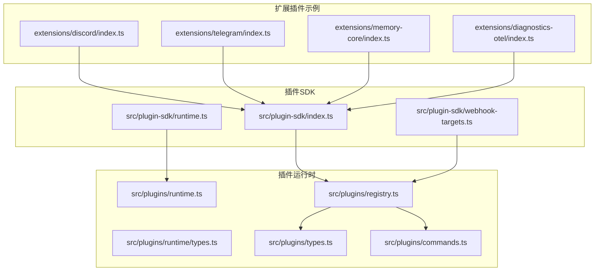
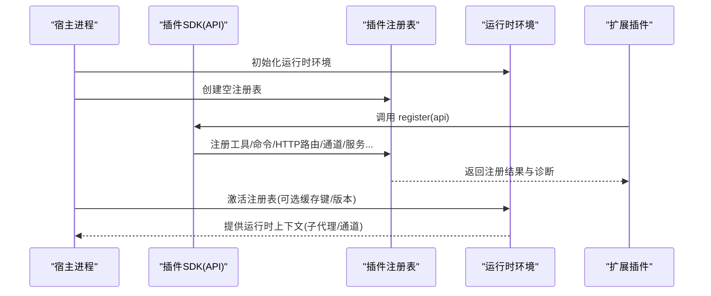
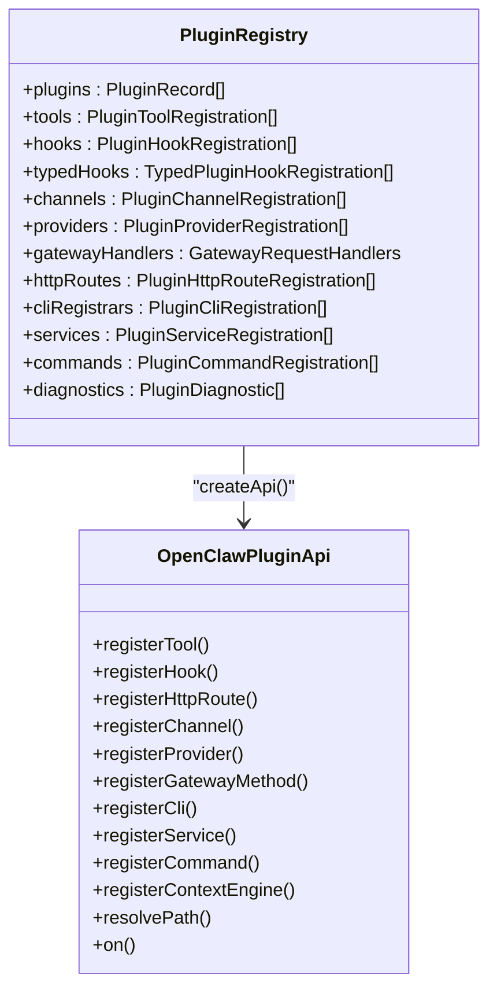
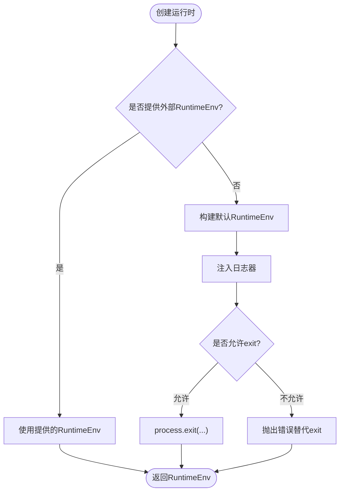
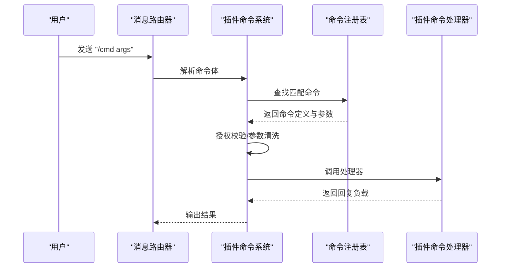
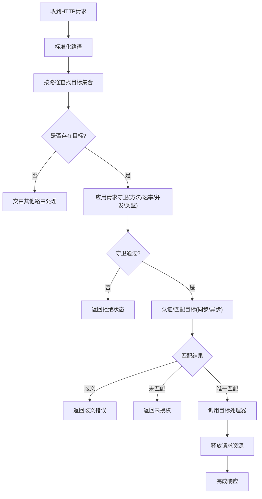
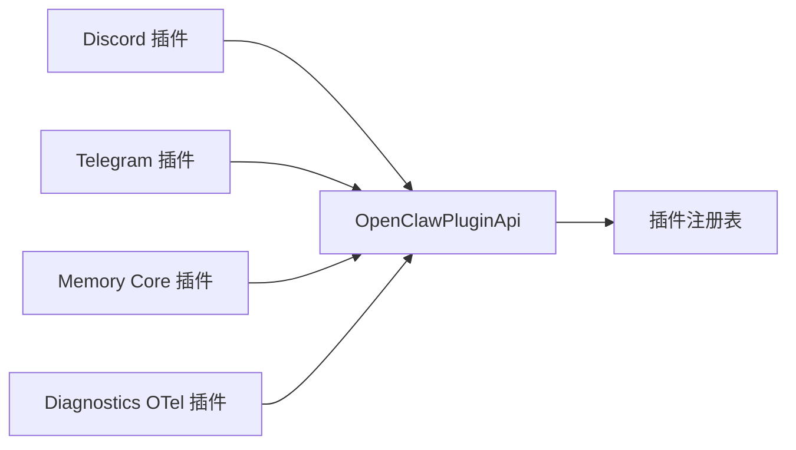
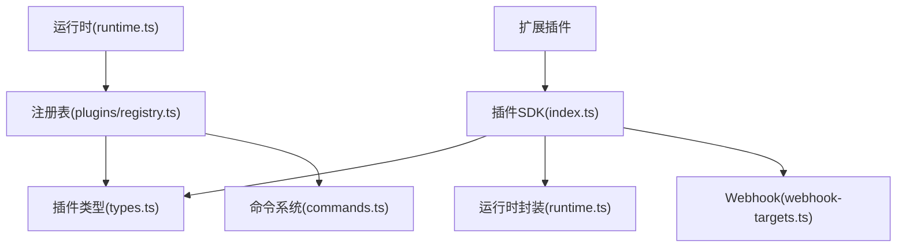

# 插件运行时管理

<cite>
**本文引用的文件**
- [index.ts](file://src/plugin-sdk/index.ts)
- [runtime.ts](file://src/plugin-sdk/runtime.ts)
- [runtime.ts](file://src/plugins/runtime.ts)
- [types.ts](file://src/plugins/types.ts)
- [registry.ts](file://src/plugins/registry.ts)
- [types.ts](file://src/plugins/runtime/types.ts)
- [commands.ts](file://src/plugins/commands.ts)
- [webhook-targets.ts](file://src/plugin-sdk/webhook-targets.ts)
- [index.ts](file://extensions/discord/index.ts)
- [index.ts](file://extensions/telegram/index.ts)
- [index.ts](file://extensions/memory-core/index.ts)
- [index.ts](file://extensions/diagnostics-otel/index.ts)
- [runtime.ts](file://src/runtime.ts)
</cite>

## 目录

1. [引言](#引言)
2. [项目结构](#项目结构)
3. [核心组件](#核心组件)
4. [架构总览](#架构总览)
5. [详细组件分析](#详细组件分析)
6. [依赖关系分析](#依赖关系分析)
7. [性能考量](#性能考量)
8. [故障排查指南](#故障排查指南)
9. [结论](#结论)
10. [附录](#附录)

## 引言

本文件系统化阐述 OpenClaw 的插件运行时管理机制，覆盖插件的加载、初始化、执行与卸载全生命周期；解释运行时环境、内存与资源控制；梳理插件状态与生命周期钩子、事件处理；说明插件间通信与共享资源访问、冲突解决策略；并提供运行时监控、性能分析与故障诊断方法，以及热更新、动态加载与版本兼容性处理建议。

## 项目结构

OpenClaw 将“插件 SDK”与“插件运行时”解耦：

- 插件 SDK：对外暴露统一 API（注册工具、命令、HTTP 路由、通道、服务等），并提供运行时日志封装与环境解析能力。
- 插件运行时：维护全局活跃插件注册表，提供运行时上下文（如子代理运行、通道操作）。

图表来源

- [index.ts:1-826](file://src/plugin-sdk/index.ts#L1-L826)
- [runtime.ts:1-45](file://src/plugin-sdk/runtime.ts#L1-L45)
- [runtime.ts:1-50](file://src/plugins/runtime.ts#L1-L50)
- [types.ts:1-64](file://src/plugins/runtime/types.ts#L1-L64)
- [registry.ts:1-625](file://src/plugins/registry.ts#L1-L625)
- [types.ts:1-893](file://src/plugins/types.ts#L1-L893)
- [commands.ts:1-349](file://src/plugins/commands.ts#L1-L349)
- [webhook-targets.ts:1-282](file://src/plugin-sdk/webhook-targets.ts#L1-L282)
- [index.ts:1-20](file://extensions/discord/index.ts#L1-L20)
- [index.ts:1-18](file://extensions/telegram/index.ts#L1-L18)
- [index.ts:1-39](file://extensions/memory-core/index.ts#L1-L39)
- [index.ts:1-16](file://extensions/diagnostics-otel/index.ts#L1-L16)

章节来源

- [index.ts:1-826](file://src/plugin-sdk/index.ts#L1-L826)
- [runtime.ts:1-50](file://src/plugins/runtime.ts#L1-L50)

## 核心组件

- 插件 API 定义与类型：定义插件可调用的能力边界（工具、命令、HTTP 路由、通道、服务、提供者、钩子等），并声明生命周期钩子名称集合与事件结构。
- 插件注册表：集中管理已加载插件及其注册项（工具、钩子、通道、提供者、网关方法、HTTP 路由、CLI、服务、命令、诊断信息）。
- 运行时环境：抽象日志输出与进程退出行为，支持从外部日志器注入或在不可退出场景下抛错替代 exit。
- 插件命令系统：为插件提供无需进入 LLM 流程的自定义命令，具备重名检测、保留字保护、参数清洗与授权校验。
- Webhook 管线：基于路径映射与请求守卫（速率限制、并发限制、内容类型等）的统一入站处理框架。
- 扩展插件示例：以 Discord、Telegram、Memory Core、Diagnostics OTel 等为例展示如何通过 API 注册通道、服务与运行时能力。

章节来源

- [types.ts:1-893](file://src/plugins/types.ts#L1-L893)
- [registry.ts:1-625](file://src/plugins/registry.ts#L1-L625)
- [runtime.ts:1-45](file://src/plugin-sdk/runtime.ts#L1-L45)
- [commands.ts:1-349](file://src/plugins/commands.ts#L1-L349)
- [webhook-targets.ts:1-282](file://src/plugin-sdk/webhook-targets.ts#L1-L282)
- [index.ts:1-20](file://extensions/discord/index.ts#L1-L20)
- [index.ts:1-18](file://extensions/telegram/index.ts#L1-L18)
- [index.ts:1-39](file://extensions/memory-core/index.ts#L1-L39)
- [index.ts:1-16](file://extensions/diagnostics-otel/index.ts#L1-L16)

## 架构总览

插件运行时采用“全局注册表 + 类型化 API”的设计：

- 全局注册表持有当前活跃插件清单与所有注册项，支持并发安全的注册与查询。
- 插件通过 OpenClawPluginApi 注册自身能力，SDK 层负责规范化与冲突检测（如 HTTP 路由重叠、命令重名、提供者重复注册等）。
- 运行时环境可由外部日志器注入，便于在不同宿主（CLI、网关、测试）中复用一致的日志与退出语义。
- 命令系统与 Webhook 管线分别服务于“快速响应”和“外部触发”两类场景，均内置安全与限流策略。

图表来源

- [registry.ts:185-624](file://src/plugins/registry.ts#L185-L624)
- [runtime.ts:25-49](file://src/plugins/runtime.ts#L25-L49)
- [runtime.ts:9-32](file://src/plugin-sdk/runtime.ts#L9-L32)
- [index.ts:12-16](file://extensions/discord/index.ts#L12-L16)

## 详细组件分析

### 组件A：插件注册表与生命周期

- 职责：维护插件清单与各类注册项，提供注册 API、冲突检测与诊断收集。
- 关键点：
  - 工具注册：支持单个工具或工厂函数，自动提取名称列表并去重。
  - 钩子注册：支持字符串或数组事件名，统一记录到内部钩子系统，并按配置决定是否实际注册到全局钩子系统。
  - HTTP 路由注册：路径标准化、重叠检测（同路径不同认证模式或归属冲突）、替换策略。
  - 通道/提供者/网关方法/CLI/服务/命令注册：统一校验与去重，记录来源与诊断。
  - 诊断收集：对无效/冲突/错误注册进行告警或错误记录，便于问题定位。

图表来源

- [registry.ts:129-142](file://src/plugins/registry.ts#L129-L142)
- [registry.ts:575-608](file://src/plugins/registry.ts#L575-L608)

章节来源

- [registry.ts:168-624](file://src/plugins/registry.ts#L168-L624)

### 组件B：运行时环境与日志

- 职责：抽象日志输出与进程退出，支持从外部日志器注入，或在不可退出场景下抛出异常替代 exit。
- 关键点：
  - createLoggerBackedRuntime：将任意 LoggerLike 包装为 RuntimeEnv。
  - resolveRuntimeEnv/resolveRuntimeEnvWithUnavailableExit：根据传入 runtime 或默认策略解析运行时环境。
  - defaultRuntime：面向 CLI/守护进程的标准实现，包含终端状态恢复与可控日志开关。

图表来源

- [runtime.ts:26-44](file://src/plugin-sdk/runtime.ts#L26-L44)
- [runtime.ts:37-53](file://src/runtime.ts#L37-L53)

章节来源

- [runtime.ts:1-45](file://src/plugin-sdk/runtime.ts#L1-L45)
- [runtime.ts:1-54](file://src/runtime.ts#L1-L54)

### 组件C：插件命令系统

- 职责：为插件提供无需进入 LLM 的自定义命令，优先于内置命令与代理执行。
- 关键点：
  - 命令注册：名称校验（字母开头、仅含字母数字与下划线/连字符）、保留字检查、重复检测。
  - 命令匹配：前缀斜杠识别、参数分离、是否接受参数的二次过滤。
  - 执行流程：授权校验、参数清洗、上下文构造、执行期间锁防止并发修改、异常捕获与安全回退。
  - 规范化：支持按渠道覆盖原生命令名，便于多平台一致性体验。

图表来源

- [commands.ts:183-301](file://src/plugins/commands.ts#L183-L301)

章节来源

- [commands.ts:1-349](file://src/plugins/commands.ts#L1-L349)

### 组件D：Webhook 处理管线

- 职责：基于路径映射与请求守卫的统一入站处理框架，支持速率限制、并发限制、内容类型校验与认证选择。
- 关键点：
  - 路径注册：首次目标到达时自动注册 HTTP 路由，最后目标移除时自动注销。
  - 请求守卫：方法白名单、JSON 内容类型、速率限制、并发限制、飞行请求数控制。
  - 认证与匹配：支持同步/异步匹配器，处理歧义与未授权情况，返回明确状态码与消息。
  - 生命周期：请求开始/结束自动释放资源，避免泄漏。

图表来源

- [webhook-targets.ts:115-162](file://src/plugin-sdk/webhook-targets.ts#L115-L162)
- [webhook-targets.ts:222-271](file://src/plugin-sdk/webhook-targets.ts#L222-L271)

章节来源

- [webhook-targets.ts:1-282](file://src/plugin-sdk/webhook-targets.ts#L1-L282)

### 组件E：扩展插件示例（Discord、Telegram、Memory Core、Diagnostics OTel）

- Discord 插件：设置运行时、注册通道、注册子代理相关钩子。
- Telegram 插件：设置运行时、注册通道。
- Memory Core 插件：注册内存搜索/获取工具与 CLI 子命令。
- Diagnostics OTel 插件：注册诊断导出服务。

图表来源

- [index.ts:12-16](file://extensions/discord/index.ts#L12-L16)
- [index.ts:11-14](file://extensions/telegram/index.ts#L11-L14)
- [index.ts:10-35](file://extensions/memory-core/index.ts#L10-L35)
- [index.ts:10-12](file://extensions/diagnostics-otel/index.ts#L10-L12)

章节来源

- [index.ts:1-20](file://extensions/discord/index.ts#L1-L20)
- [index.ts:1-18](file://extensions/telegram/index.ts#L1-L18)
- [index.ts:1-39](file://extensions/memory-core/index.ts#L1-L39)
- [index.ts:1-16](file://extensions/diagnostics-otel/index.ts#L1-L16)

## 依赖关系分析

- 插件 SDK 与运行时解耦：SDK 仅定义 API 与类型，运行时负责全局状态与注册表。
- 注册表对钩子系统与网关方法的依赖：注册钩子时可选择是否接入全局钩子系统；注册网关方法时进行冲突检测。
- 命令系统与 Webhook 管线独立但共享“路径/守卫/认证”基础设施：二者均依赖标准化路径与统一的请求守卫策略。
- 扩展插件通过 SDK API 与运行时交互，不直接依赖底层实现细节，保证生态一致性。

图表来源

- [index.ts:1-826](file://src/plugin-sdk/index.ts#L1-L826)
- [types.ts:1-893](file://src/plugins/types.ts#L1-L893)
- [runtime.ts:1-45](file://src/plugin-sdk/runtime.ts#L1-L45)
- [runtime.ts:1-50](file://src/plugins/runtime.ts#L1-L50)
- [registry.ts:1-625](file://src/plugins/registry.ts#L1-L625)
- [commands.ts:1-349](file://src/plugins/commands.ts#L1-L349)
- [webhook-targets.ts:1-282](file://src/plugin-sdk/webhook-targets.ts#L1-L282)

章节来源

- [index.ts:1-826](file://src/plugin-sdk/index.ts#L1-L826)
- [registry.ts:1-625](file://src/plugins/registry.ts#L1-L625)

## 性能考量

- 注册阶段的冲突检测与诊断收集：在注册表层统一进行，避免运行期开销。
- 命令与 Webhook 的守卫策略：通过速率限制与并发限制降低突发流量对系统的影响。
- 日志输出的条件开关：在测试或静默环境下减少 I/O 开销。
- 子代理运行与会话消息读取：提供异步接口，避免阻塞主线程。

## 故障排查指南

- 命令执行失败：检查授权状态、参数长度与非法字符、处理器异常捕获与安全回退。
- HTTP 路由冲突：查看注册表中的诊断信息，确认路径、匹配方式与认证模式是否冲突。
- 钩子未生效：确认配置是否启用内部钩子系统，以及钩子名称是否在受支持集合内。
- Webhook 认证失败：检查匹配器逻辑、路径映射、速率/并发限制阈值与状态码提示。

章节来源

- [commands.ts:256-301](file://src/plugins/commands.ts#L256-L301)
- [registry.ts:318-400](file://src/plugins/registry.ts#L318-L400)
- [webhook-targets.ts:222-271](file://src/plugin-sdk/webhook-targets.ts#L222-L271)

## 结论

OpenClaw 的插件运行时以“全局注册表 + 类型化 API + 可注入运行时环境”为核心，提供了高内聚、低耦合的插件生态。通过严格的注册冲突检测、安全的命令与 Webhook 管线、完善的生命周期钩子与诊断体系，实现了稳定、可观测且易于扩展的插件运行时管理。

## 附录

- 插件状态与生命周期钩子：参见插件类型定义中的钩子名称集合与事件结构，支持在模型解析、提示构建、代理运行、消息收发、工具调用、会话与子代理生命周期等关键节点进行扩展。
- 运行时监控与诊断：结合扩展插件中的诊断导出服务，可将运行时事件上报至外部系统进行分析与可视化。
- 热更新与动态加载：建议在扩展插件层面实现“卸载旧版本、注册新版本”的双轨流程，并在注册表层利用版本号与缓存键进行切换，确保平滑过渡与回滚能力。
