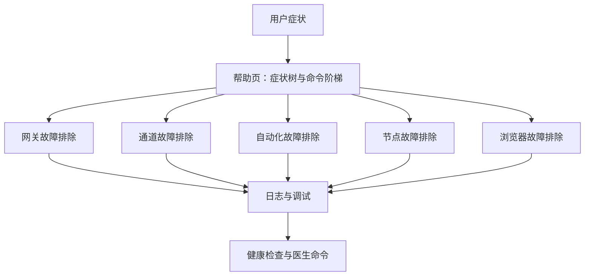
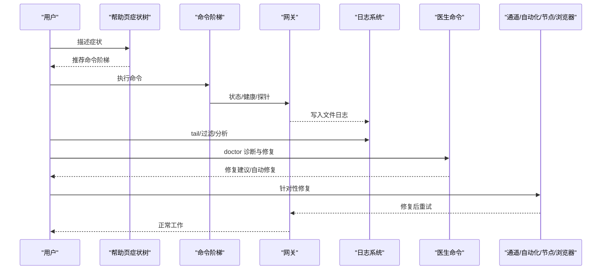
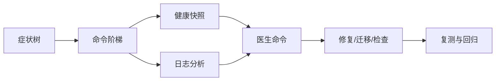

# 故障排除

<cite>
**本文引用的文件**
- [故障排除（帮助）](file://docs/help/troubleshooting.md)
- [网关故障排除](file://docs/gateway/troubleshooting.md)
- [通道故障排除](file://docs/channels/troubleshooting.md)
- [节点故障排除](file://docs/nodes/troubleshooting.md)
- [自动化故障排除](file://docs/automation/troubleshooting.md)
- [浏览器故障排除（Linux）](file://docs/tools/browser-linux-troubleshooting.md)
- [WSL2 + Windows 远程 Chrome CDP 故障排除](file://docs/tools/browser-wsl2-windows-remote-cdp-troubleshooting.md)
- [日志（CLI 参考）](file://docs/cli/logs.md)
- [网关日志](file://docs/gateway/logging.md)
- [调试](file://docs/help/debugging.md)
- [网关健康检查](file://docs/gateway/health.md)
- [医生命令（诊断与修复）](file://docs/gateway/doctor.md)
</cite>

## 目录

1. 引言
2. 项目结构
3. 核心组件
4. 架构总览
5. 详细组件分析
6. 依赖关系分析
7. 性能注意事项
8. 故障排除指南
9. 结论
10. 附录

## 引言

本实用指南面向 OpenClaw 的使用者与运维人员，聚焦“症状优先”的快速排障流程，覆盖常见问题的诊断步骤、解决方案与预防措施。内容包括：日志分析、错误码解读、调试工具使用、性能问题、网络连接与配置错误排查、社区支持与问题上报、监控告警与自动恢复/降级策略等。

## 项目结构

OpenClaw 将“排障”拆分为多层文档与工具：

- 快速三分钟入口：帮助页提供症状树与命令阶梯
- 深入运行手册：网关、通道、自动化、节点、浏览器的深度排障页
- 日志与调试：日志格式、尾随查看、原始流输出、Watch 模式
- 健康与诊断：健康快照、医生命令、端口/权限/服务状态检查

图示来源

- [故障排除（帮助）:68-88](file://docs/help/troubleshooting.md#L68-L88)
- [网关故障排除:1-31](file://docs/gateway/troubleshooting.md#L1-L31)
- [通道故障排除:1-30](file://docs/channels/troubleshooting.md#L1-L30)
- [自动化故障排除:14-31](file://docs/automation/troubleshooting.md#L14-L31)
- [节点故障排除:13-31](file://docs/nodes/troubleshooting.md#L13-L31)
- [浏览器故障排除（Linux）:1-20](file://docs/tools/browser-linux-troubleshooting.md#L1-L20)
- [网关日志:13-42](file://docs/gateway/logging.md#L13-L42)
- [网关健康检查:12-20](file://docs/gateway/health.md#L12-L20)
- [医生命令（诊断与修复）:14-58](file://docs/gateway/doctor.md#L14-L58)

章节来源

- [故障排除（帮助）:1-299](file://docs/help/troubleshooting.md#L1-L299)
- [网关故障排除:1-380](file://docs/gateway/troubleshooting.md#L1-L380)
- [通道故障排除:1-118](file://docs/channels/troubleshooting.md#L1-L118)
- [自动化故障排除:1-123](file://docs/automation/troubleshooting.md#L1-L123)
- [节点故障排除:1-115](file://docs/nodes/troubleshooting.md#L1-L115)
- [浏览器故障排除（Linux）:1-140](file://docs/tools/browser-linux-troubleshooting.md#L1-L140)
- [WSL2 + Windows 远程 Chrome CDP 故障排除:1-243](file://docs/tools/browser-wsl2-windows-remote-cdp-troubleshooting.md#L1-L243)
- [日志（CLI 参考）:1-29](file://docs/cli/logs.md#L1-L29)
- [网关日志:1-114](file://docs/gateway/logging.md#L1-L114)
- [调试:1-163](file://docs/help/debugging.md#L1-L163)
- [网关健康检查:1-36](file://docs/gateway/health.md#L1-L36)
- [医生命令（诊断与修复）:1-331](file://docs/gateway/doctor.md#L1-L331)

## 核心组件

- 症状树与命令阶梯：帮助页提供“先看后做”的三分钟快速通道，按症状分叉到对应章节，并给出最小命令集。
- 网关健康与日志：通过健康快照、日志尾随、控制台样式与级别、文件日志级别分离等能力，支撑端到端定位。
- 医生命令：自动修复配置/迁移、服务/权限/端口/安全风险检查、模型认证健康检查、沙箱镜像修复等。
- 通道/自动化/节点/浏览器专项：针对不同子系统提供常见失败模式、签名与修复建议。
- 调试工具：Watch 模式、原始流/块流记录、开发态隔离环境、安全提示。

章节来源

- [故障排除（帮助）:68-88](file://docs/help/troubleshooting.md#L68-L88)
- [网关日志:13-42](file://docs/gateway/logging.md#L13-L42)
- [医生命令（诊断与修复）:59-85](file://docs/gateway/doctor.md#L59-L85)
- [调试:15-48](file://docs/help/debugging.md#L15-L48)

## 架构总览

下图展示从症状到诊断与修复的关键路径，以及日志与健康检查在其中的作用。

图示来源

- [故障排除（帮助）:13-36](file://docs/help/troubleshooting.md#L13-L36)
- [网关日志:18-42](file://docs/gateway/logging.md#L18-L42)
- [医生命令（诊断与修复）:14-58](file://docs/gateway/doctor.md#L14-L58)
- [网关健康检查:12-20](file://docs/gateway/health.md#L12-L20)

## 详细组件分析

### 症状树与命令阶梯

- 三分钟快速通道：按症状分支，先执行健康/状态/探针命令，再看日志，最后 doctor 修复。
- 常见症状与命令组合：无回复、控制 UI 不连、网关不启动、通道连上但消息不流动、定时任务未触发、节点工具失败、浏览器工具失败。
- 日志签名：各章节列出常见日志片段与含义，便于快速定位。

章节来源

- [故障排除（帮助）:68-88](file://docs/help/troubleshooting.md#L68-L88)
- [故障排除（帮助）:91-118](file://docs/help/troubleshooting.md#L91-L118)
- [故障排除（帮助）:121-149](file://docs/help/troubleshooting.md#L121-L149)
- [故障排除（帮助）:151-178](file://docs/help/troubleshooting.md#L151-L178)
- [故障排除（帮助）:180-206](file://docs/help/troubleshooting.md#L180-L206)
- [故障排除（帮助）:208-237](file://docs/help/troubleshooting.md#L208-L237)
- [故障排除（帮助）:239-267](file://docs/help/troubleshooting.md#L239-L267)
- [故障排除（帮助）:269-297](file://docs/help/troubleshooting.md#L269-L297)

### 网关故障排除

- 命令阶梯：status/gateway status/logs/doctor/channels status。
- 关键信号：Runtime: running、RPC probe: ok；通道 ready/connected；doctor 无阻断性错误。
- 特定问题：Anthropic 429（长上下文需额外用量）、网关未启动/绑定冲突、鉴权模式不匹配、升级后行为变化等。
- 错误码速查：AUTH_TOKEN_MISSING、AUTH_TOKEN_MISMATCH、AUTH_DEVICE_TOKEN_MISMATCH、PAIRING_REQUIRED 等。

章节来源

- [网关故障排除:14-31](file://docs/gateway/troubleshooting.md#L14-L31)
- [网关故障排除:32-60](file://docs/gateway/troubleshooting.md#L32-L60)
- [网关故障排除:152-181](file://docs/gateway/troubleshooting.md#L152-L181)
- [网关故障排除:182-212](file://docs/gateway/troubleshooting.md#L182-L212)
- [网关故障排除:213-244](file://docs/gateway/troubleshooting.md#L213-L244)
- [网关故障排除:245-275](file://docs/gateway/troubleshooting.md#L245-L275)
- [网关故障排除:276-306](file://docs/gateway/troubleshooting.md#L276-L306)
- [网关故障排除:307-380](file://docs/gateway/troubleshooting.md#L307-L380)

### 通道故障排除（WhatsApp/Telegram/Discord/Slack/iMessage/Signal/Matrix）

- 命令阶梯：status/gateway status/logs/doctor/channels status。
- 常见失败与修复：配对待审批、提及要求、允许列表不匹配、权限缺失、网络错误、隐私模式等。
- 快速签名表：按症状列出最快检查点与修复动作。

章节来源

- [通道故障排除:13-30](file://docs/channels/troubleshooting.md#L13-L30)
- [通道故障排除:31-54](file://docs/channels/troubleshooting.md#L31-L54)
- [通道故障排除:55-78](file://docs/channels/troubleshooting.md#L55-L78)
- [通道故障排除:79-118](file://docs/channels/troubleshooting.md#L79-L118)

### 自动化故障排除（Cron/心跳）

- 命令阶梯：status/gateway status/logs/doctor/channels status 后，进入 cron/heartbeat 检查。
- 关注点：调度器启用且有下次唤醒、最近运行记录为 ok、投递目标有效、通道授权正常。
- 时间与时区：activeHours、userTimezone、主机时区差异导致的错峰。

章节来源

- [自动化故障排除:14-31](file://docs/automation/troubleshooting.md#L14-L31)
- [自动化故障排除:32-53](file://docs/automation/troubleshooting.md#L32-L53)
- [自动化故障排除:53-73](file://docs/automation/troubleshooting.md#L53-L73)
- [自动化故障排除:74-94](file://docs/automation/troubleshooting.md#L74-L94)
- [自动化故障排除:95-116](file://docs/automation/troubleshooting.md#L95-L116)

### 节点故障排除（前台限制、权限、批准）

- 命令阶梯：status/gateway status/logs/doctor/channels status 后，进入节点检查。
- 关键点：前台可用性（canvas/camera/screen）、系统权限（相机/屏幕/位置/执行）、执行批准与白名单。
- 常见错误码：NODE_BACKGROUND_UNAVAILABLE、\*\_PERMISSION_REQUIRED、LOCATION_PERMISSION_REQUIRED、SYSTEM_RUN_DENIED 等。

章节来源

- [节点故障排除:13-31](file://docs/nodes/troubleshooting.md#L13-L31)
- [节点故障排除:37-49](file://docs/nodes/troubleshooting.md#L37-L49)
- [节点故障排除:51-91](file://docs/nodes/troubleshooting.md#L51-L91)
- [节点故障排除:92-107](file://docs/nodes/troubleshooting.md#L92-L107)

### 浏览器工具故障排除（Linux/WSL2+Windows）

- Linux：Snap 包干扰导致 CDP 启动失败；推荐安装官方 Chrome 或使用 attach-only 模式。
- WSL2+Windows：分层验证（Windows CDP 可达性、WSL2 可达性、配置正确性、扩展中继跨命名空间绑定）。
- 常见错误：CDP 不可达、扩展中继无标签、非安全上下文、URL/凭据不匹配。

章节来源

- [浏览器故障排除（Linux）:9-29](file://docs/tools/browser-linux-troubleshooting.md#L9-L29)
- [浏览器故障排除（Linux）:30-52](file://docs/tools/browser-linux-troubleshooting.md#L30-L52)
- [浏览器故障排除（Linux）:53-97](file://docs/tools/browser-linux-troubleshooting.md#L53-L97)
- [浏览器故障排除（Linux）:124-140](file://docs/tools/browser-linux-troubleshooting.md#L124-L140)
- [WSL2 + Windows 远程 Chrome CDP 故障排除:20-45](file://docs/tools/browser-wsl2-windows-remote-cdp-troubleshooting.md#L20-L45)
- [WSL2 + Windows 远程 Chrome CDP 故障排除:79-121](file://docs/tools/browser-wsl2-windows-remote-cdp-troubleshooting.md#L79-L121)
- [WSL2 + Windows 远程 Chrome CDP 故障排除:122-171](file://docs/tools/browser-wsl2-windows-remote-cdp-troubleshooting.md#L122-L171)
- [WSL2 + Windows 远程 Chrome CDP 故障排除:209-233](file://docs/tools/browser-wsl2-windows-remote-cdp-troubleshooting.md#L209-L233)

### 日志与调试

- 日志表面：控制台输出与文件日志（JSON Lines），可独立调节控制台与文件日志级别。
- 文件日志：默认滚动文件位于 /tmp/openclaw/，按本地时区日期切分。
- 控制台样式：支持 pretty/compact/json，Subsystem 前缀与颜色，WS 日志在 --verbose 下可全量打印。
- 原始流记录：支持记录原始助手流与 OpenAI 兼容块流，便于分析推理泄漏。
- Watch 模式：文件监视重启网关，便于迭代调试。

章节来源

- [网关日志:13-42](file://docs/gateway/logging.md#L13-L42)
- [网关日志:64-114](file://docs/gateway/logging.md#L64-L114)
- [日志（CLI 参考）:9-29](file://docs/cli/logs.md#L9-L29)
- [调试:15-48](file://docs/help/debugging.md#L15-L48)
- [调试:107-135](file://docs/help/debugging.md#L107-L135)
- [调试:136-157](file://docs/help/debugging.md#L136-L157)

### 健康检查与医生命令

- 健康快照：通过 openclaw health --json 获取运行中网关的健康快照，含通道探针摘要、会话存储摘要等。
- 医生命令：自动修复配置/迁移、服务/权限/端口/安全风险检查、模型认证健康检查、沙箱镜像修复、技能状态汇总、端口冲突诊断、最佳实践检查等。

章节来源

- [网关健康检查:12-36](file://docs/gateway/health.md#L12-L36)
- [医生命令（诊断与修复）:14-58](file://docs/gateway/doctor.md#L14-L58)
- [医生命令（诊断与修复）:86-331](file://docs/gateway/doctor.md#L86-L331)

## 依赖关系分析

- 命令阶梯依赖健康检查与日志系统，确保“先看后修”。
- 专项章节依赖通用命令阶梯，形成“症状树 → 通用命令 → 专项修复”的闭环。
- 医生命令作为“自动修复+迁移+检查”的统一入口，贯穿各子系统。

图示来源

- [故障排除（帮助）:13-36](file://docs/help/troubleshooting.md#L13-L36)
- [网关健康检查:12-20](file://docs/gateway/health.md#L12-L20)
- [医生命令（诊断与修复）:59-85](file://docs/gateway/doctor.md#L59-L85)

章节来源

- [故障排除（帮助）:13-36](file://docs/help/troubleshooting.md#L13-L36)
- [网关健康检查:12-20](file://docs/gateway/health.md#L12-L20)
- [医生命令（诊断与修复）:59-85](file://docs/gateway/doctor.md#L59-L85)

## 性能注意事项

- 日志级别与输出：文件日志级别与控制台级别解耦，避免在生产开启过细粒度控制台日志。
- 原始流记录：仅在调试阶段启用，注意数据敏感性与磁盘占用。
- Watch 模式：适合开发迭代，避免在生产环境长期开启。
- 端口与绑定：严格绑定与鉴权策略减少无效连接与资源消耗。

章节来源

- [网关日志:35-42](file://docs/gateway/logging.md#L35-L42)
- [调试:107-135](file://docs/help/debugging.md#L107-L135)
- [调试:158-163](file://docs/help/debugging.md#L158-L163)

## 故障排除指南

### 一、通用排障流程（三分钟快速通道）

- 执行命令阶梯：status、status --all、gateway probe、gateway status、doctor、channels status --probe、logs --follow。
- 观察健康信号：网关运行中、RPC 探针成功、通道已连接/就绪、日志稳定无重复致命错误。
- 若仍异常，进入症状树分叉，按章节进行专项排查。

章节来源

- [故障排除（帮助）:13-36](file://docs/help/troubleshooting.md#L13-L36)
- [故障排除（帮助）:27-36](file://docs/help/troubleshooting.md#L27-L36)

### 二、日志分析与错误码

- 使用 openclaw logs --follow 实时跟踪；必要时使用 --json、--local-time。
- 文件日志为 JSON Lines，默认滚动至 /tmp/openclaw/，按本地时区日期切分。
- 常见错误码与含义（节选）：
  - AUTH_TOKEN_MISSING：客户端未发送必需共享令牌。
  - AUTH_TOKEN_MISMATCH：共享令牌与网关不匹配，可尝试受信设备重试。
  - AUTH_DEVICE_TOKEN_MISMATCH：缓存的设备令牌陈旧或撤销，需轮换/重新批准。
  - PAIRING_REQUIRED：设备身份已知但未批准该角色，需批准请求。

章节来源

- [日志（CLI 参考）:9-29](file://docs/cli/logs.md#L9-L29)
- [网关日志:18-42](file://docs/gateway/logging.md#L18-L42)
- [网关日志:64-114](file://docs/gateway/logging.md#L64-L114)
- [网关故障排除:120-130](file://docs/gateway/troubleshooting.md#L120-L130)

### 三、性能问题排查

- 检查日志中慢调用与错误统计，关注 WS 日志风格与阈值。
- 使用 --verbose 与不同 WS 日志风格定位瓶颈。
- 评估磁盘与 I/O：状态目录是否位于云同步/SD 卡等低效介质上。

章节来源

- [网关日志:64-114](file://docs/gateway/logging.md#L64-L114)
- [医生命令（诊断与修复）:196-212](file://docs/gateway/doctor.md#L196-L212)

### 四、网络连接与配置错误

- 网关绑定与鉴权：非回环绑定需配置鉴权；避免端口被占用。
- 通道网络：检查 API 可达性、DNS/IPv6/代理；针对特定通道的权限与隐私设置。
- 浏览器 CDP：Linux 使用官方浏览器或 attach-only；WSL2/Windows 跨命名空间需正确配置 relayBindHost 与 CDP 地址。

章节来源

- [网关故障排除:170-175](file://docs/gateway/troubleshooting.md#L170-L175)
- [通道故障排除:41-54](file://docs/channels/troubleshooting.md#L41-L54)
- [通道故障排除:55-78](file://docs/channels/troubleshooting.md#L55-L78)
- [浏览器故障排除（Linux）:17-29](file://docs/tools/browser-linux-troubleshooting.md#L17-L29)
- [WSL2 + Windows 远程 Chrome CDP 故障排除:148-171](file://docs/tools/browser-wsl2-windows-remote-cdp-troubleshooting.md#L148-L171)

### 五、社区支持、问题报告与紧急处理

- 社区与文档：优先参考帮助页与各专项排障页；使用健康快照与 doctor 输出作为问题描述材料。
- 问题报告：提供 openclaw status --all、gateway status --json、logs --follow 输出，以及症状树选择与已尝试命令。
- 紧急处理：若网关不可达，先尝试本地启动；若通道频繁登出，执行 relink 流程。

章节来源

- [网关健康检查:12-20](file://docs/gateway/health.md#L12-L20)
- [网关健康检查:27-32](file://docs/gateway/health.md#L27-L32)
- [医生命令（诊断与修复）:14-58](file://docs/gateway/doctor.md#L14-L58)

### 六、监控告警、自动恢复与降级策略

- 健康快照：定期调用 openclaw health --json，结合日志与 doctor 输出建立基线。
- 自动恢复：doctor 可自动修复配置/迁移、端口冲突、服务元数据；必要时重启网关。
- 降级策略：当通道/模型鉴权异常或额度不足时，启用降级通道/模型或临时关闭高成本功能。

章节来源

- [网关健康检查:12-20](file://docs/gateway/health.md#L12-L20)
- [医生命令（诊断与修复）:59-85](file://docs/gateway/doctor.md#L59-L85)
- [网关故障排除:49-54](file://docs/gateway/troubleshooting.md#L49-L54)

## 结论

通过“症状树 + 命令阶梯 + 日志 + 健康快照 + 医生命令”的组合拳，OpenClaw 提供了从一线到深度的完整排障体系。建议在日常运维中：

- 将 doctor 与健康快照纳入例行巡检；
- 使用日志级别与 WS 日志风格区分常规与调试场景；
- 针对通道/自动化/节点/浏览器建立快速修复清单；
- 在升级前后执行 doctor 与 relink 流程，降低配置漂移风险。

## 附录

### A. 常用命令速查

- openclaw status / --all / --deep
- openclaw gateway status / --json / --deep
- openclaw health --json
- openclaw doctor [--yes/--repair/--force/--non-interactive]
- openclaw logs [--follow/--json/--limit/--local-time]
- openclaw channels status --probe
- openclaw cron status / list / runs --id <jobId> --limit 20
- openclaw system heartbeat last
- openclaw nodes status / describe --node / approvals get --node
- openclaw browser status / start --browser-profile / profiles

章节来源

- [故障排除（帮助）:17-25](file://docs/help/troubleshooting.md#L17-L25)
- [网关健康检查:12-20](file://docs/gateway/health.md#L12-L20)
- [医生命令（诊断与修复）:14-58](file://docs/gateway/doctor.md#L14-L58)
- [日志（CLI 参考）:9-29](file://docs/cli/logs.md#L9-L29)
- [自动化故障排除:14-31](file://docs/automation/troubleshooting.md#L14-L31)
- [节点故障排除:13-31](file://docs/nodes/troubleshooting.md#L13-L31)
- [浏览器故障排除（Linux）:113-123](file://docs/tools/browser-linux-troubleshooting.md#L113-L123)
