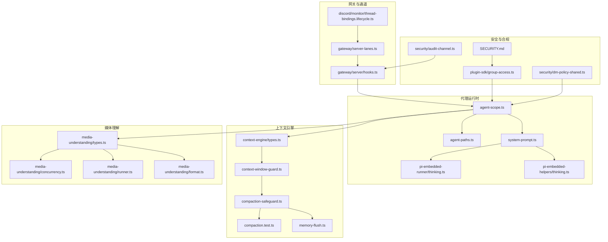
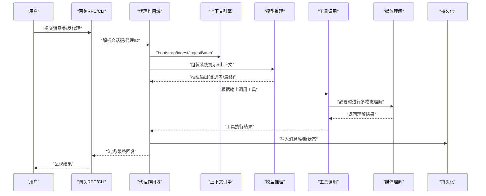
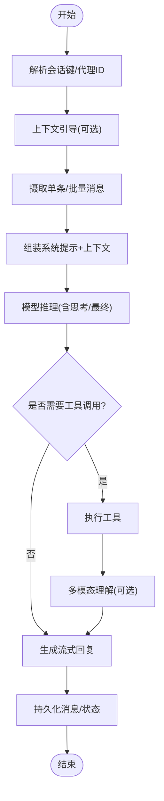
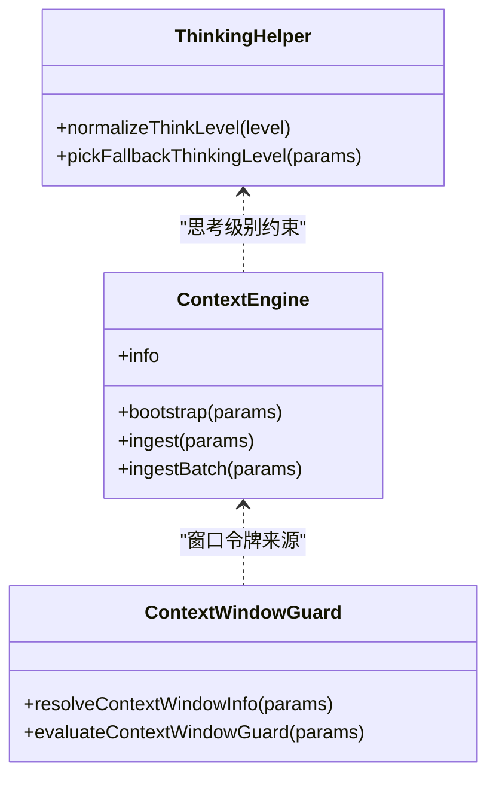
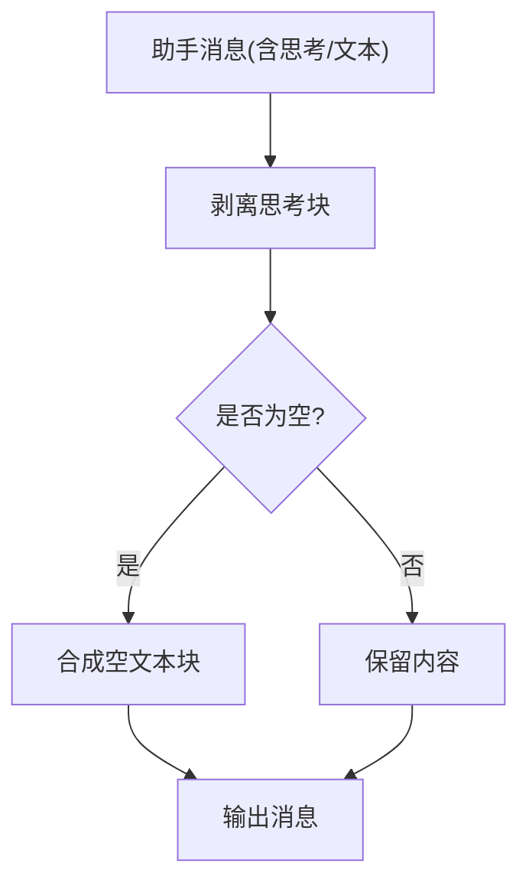
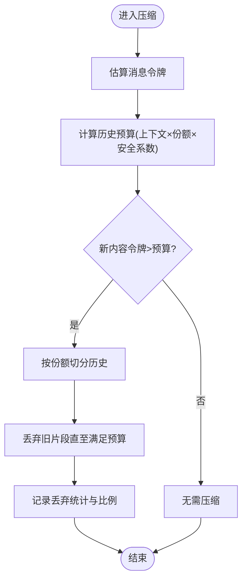
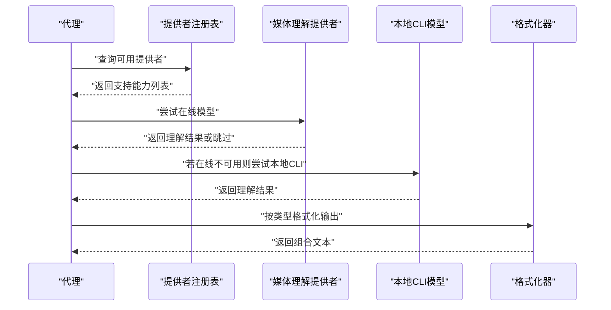
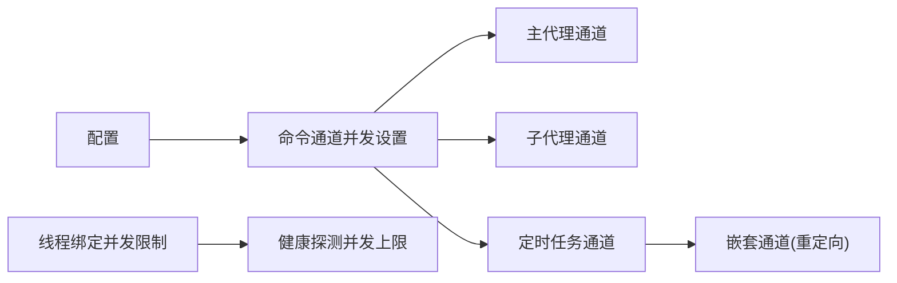
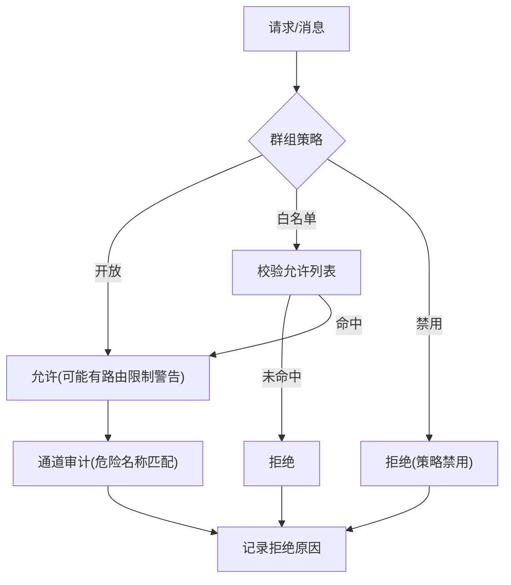
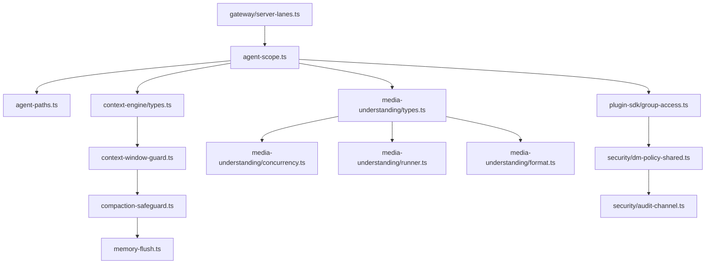

# AI代理引擎

<cite>
**本文引用的文件**
- [agent-loop.md](file://docs/concepts/agent-loop.md)
- [thinking.ts（嵌入式思考块处理）](file://src/agents/pi-embedded-runner/thinking.ts)
- [thinking.ts（思考级别回退逻辑）](file://src/agents/pi-embedded-helpers/thinking.ts)
- [agent-scope.ts](file://src/agents/agent-scope.ts)
- [agent-paths.ts](file://src/agents/agent-paths.ts)
- [context-engine/types.ts](file://src/context-engine/types.ts)
- [context-window-guard.ts](file://src/agents/context-window-guard.ts)
- [compaction.test.ts](file://src/agents/compaction.test.ts)
- [memory-flush.ts](file://src/auto-reply/reply/memory-flush.ts)
- [compaction-safeguard.ts](file://src/agents/pi-embedded-runner/compaction-safeguard.ts)
- [types.ts（媒体理解类型定义）](file://src/media-understanding/types.ts)
- [concurrency.ts（媒体理解并发执行）](file://src/media-understanding/concurrency.ts)
- [runner.ts（本地模型解析与CLI集成）](file://src/media-understanding/runner.ts)
- [format.ts（媒体理解结果格式化）](file://src/media-understanding/format.ts)
- [server-lanes.ts（网关命令通道并发）](file://src/gateway/server-lanes.ts)
- [lanes.ts（代理通道解析）](file://src/agents/lanes.ts)
- [system-prompt.ts（系统提示与推理约束）](file://src/agents/system-prompt.ts)
- [hooks.ts（网关代理钩子分发）](file://src/gateway/server/hooks.ts)
- [group-access.ts（插件组访问策略）](file://src/plugin-sdk/group-access.ts)
- [dm-policy-shared.ts（消息路由安全策略）](file://src/security/dm-policy-shared.ts)
- [audit-channel.ts（通道审计与危险名称匹配）](file://src/security/audit-channel.ts)
- [thread-bindings.lifecycle.ts（线程绑定生命周期与并发）](file://src/discord/monitor/thread-bindings.lifecycle.ts)
- [SECURITY.md（安全声明与常见误报模式）](file://SECURITY.md)
</cite>

## 目录

1. [引言](#引言)
2. [项目结构](#项目结构)
3. [核心组件](#核心组件)
4. [架构总览](#架构总览)
5. [详细组件分析](#详细组件分析)
6. [依赖关系分析](#依赖关系分析)
7. [性能考量](#性能考量)
8. [故障排查指南](#故障排查指南)
9. [结论](#结论)
10. [附录](#附录)

## 引言

本技术文档面向OpenClaw的AI代理引擎，系统性阐述代理工作循环、上下文管理、决策与思考过程、工具调用机制、结果处理流程，以及内存管理、历史记录维护与上下文窗口优化策略。文档同时覆盖多模态处理能力（图像理解、语音转文字、视频描述）、并发与资源限制、性能监控、安全控制与合规检查，并提供可追溯到源码的参考路径，便于读者定位具体实现。

## 项目结构

OpenClaw采用模块化与分层设计：代理运行时位于src/agents，上下文引擎在src/context-engine，媒体理解在src/media-understanding，网关与通道在src/gateway与src/channels，安全策略在src/security，系统提示与思考级别在src/agents下。文档概念与使用说明位于docs目录。

**图表来源**

- [agent-scope.ts:1-339](file://src/agents/agent-scope.ts#L1-L339)
- [agent-paths.ts:1-26](file://src/agents/agent-paths.ts#L1-L26)
- [system-prompt.ts:341-369](file://src/agents/system-prompt.ts#L341-L369)
- [pi-embedded-runner/thinking.ts:1-54](file://src/agents/pi-embedded-runner/thinking.ts#L1-L54)
- [pi-embedded-helpers/thinking.ts:1-54](file://src/agents/pi-embedded-helpers/thinking.ts#L1-L54)
- [context-engine/types.ts:54-95](file://src/context-engine/types.ts#L54-L95)
- [context-window-guard.ts:21-74](file://src/agents/context-window-guard.ts#L21-L74)
- [compaction-safeguard.ts:766-790](file://src/agents/pi-embedded-runner/compaction-safeguard.ts#L766-L790)
- [compaction.test.ts:50-88](file://src/agents/compaction.test.ts#L50-L88)
- [memory-flush.ts:144-193](file://src/auto-reply/reply/memory-flush.ts#L144-L193)
- [media-understanding/types.ts:1-49](file://src/media-understanding/types.ts#L1-L49)
- [media-understanding/concurrency.ts:1-18](file://src/media-understanding/concurrency.ts#L1-L18)
- [media-understanding/runner.ts:248-304](file://src/media-understanding/runner.ts#L248-L304)
- [media-understanding/format.ts:47-98](file://src/media-understanding/format.ts#L47-L98)
- [gateway/server-lanes.ts:1-10](file://src/gateway/server-lanes.ts#L1-L10)
- [gateway/server/hooks.ts:36-66](file://src/gateway/server/hooks.ts#L36-L66)
- [discord/monitor/thread-bindings.lifecycle.ts:45-81](file://src/discord/monitor/thread-bindings.lifecycle.ts#L45-L81)
- [plugin-sdk/group-access.ts:114-143](file://src/plugin-sdk/group-access.ts#L114-L143)
- [security/dm-policy-shared.ts:125-161](file://src/security/dm-policy-shared.ts#L125-L161)
- [security/audit-channel.ts:290-304](file://src/security/audit-channel.ts#L290-L304)
- [SECURITY.md:48-67](file://SECURITY.md#L48-L67)

**章节来源**

- [agent-loop.md:1-21](file://docs/concepts/agent-loop.md#L1-L21)

## 核心组件

- 代理作用域与路径解析：负责代理ID解析、默认代理选择、工作空间与代理目录解析，确保运行环境隔离与一致性。
- 上下文引擎与窗口守卫：定义上下文管理契约、消息摄取、批量摄取；提供上下文窗口令牌计算与保护阈值评估，防止越界与阻断。
- 历史压缩与内存刷新：通过分片切分与令牌预算裁剪，保障历史记录在预算内保留；在特定阈值触发内存压缩与刷新，维持长期记忆的可用性。
- 多模态理解：统一的媒体理解类型定义、并发执行、本地CLI模型解析与结果格式化，支持图像描述、音频转写与视频描述。
- 系统提示与思考级别：系统提示中内置“思考/最终回复”的格式约束与推理级别控制，保证输出结构化与可控。
- 并发与通道：网关命令通道并发配置与代理通道解析，避免竞态与拥塞；线程绑定生命周期并发控制，降低启动阶段的健康探测压力。
- 安全与合规：插件组访问策略、消息路由安全策略、通道审计与危险名称匹配检测，结合安全声明中的常见误报模式，指导合规与风险评估。

**章节来源**

- [agent-scope.ts:118-145](file://src/agents/agent-scope.ts#L118-L145)
- [agent-paths.ts:6-25](file://src/agents/agent-paths.ts#L6-L25)
- [context-engine/types.ts:68-95](file://src/context-engine/types.ts#L68-L95)
- [context-window-guard.ts:21-74](file://src/agents/context-window-guard.ts#L21-L74)
- [compaction-safeguard.ts:766-790](file://src/agents/pi-embedded-runner/compaction-safeguard.ts#L766-L790)
- [compaction.test.ts:50-88](file://src/agents/compaction.test.ts#L50-L88)
- [memory-flush.ts:144-193](file://src/auto-reply/reply/memory-flush.ts#L144-L193)
- [media-understanding/types.ts:1-49](file://src/media-understanding/types.ts#L1-L49)
- [media-understanding/concurrency.ts:1-18](file://src/media-understanding/concurrency.ts#L1-L18)
- [media-understanding/runner.ts:248-304](file://src/media-understanding/runner.ts#L248-L304)
- [media-understanding/format.ts:47-98](file://src/media-understanding/format.ts#L47-L98)
- [system-prompt.ts:341-369](file://src/agents/system-prompt.ts#L341-L369)
- [gateway/server-lanes.ts:1-10](file://src/gateway/server-lanes.ts#L1-L10)
- [lanes.ts:1-14](file://src/agents/lanes.ts#L1-L14)
- [discord/monitor/thread-bindings.lifecycle.ts:45-81](file://src/discord/monitor/thread-bindings.lifecycle.ts#L45-L81)
- [plugin-sdk/group-access.ts:114-143](file://src/plugin-sdk/group-access.ts#L114-L143)
- [security/dm-policy-shared.ts:125-161](file://src/security/dm-policy-shared.ts#L125-L161)
- [security/audit-channel.ts:290-304](file://src/security/audit-channel.ts#L290-L304)
- [SECURITY.md:48-67](file://SECURITY.md#L48-L67)

## 架构总览

OpenClaw代理引擎以“会话为中心”的工作循环为核心：接收输入 → 组装上下文 → 模型推理 → 工具调用 → 流式回复 → 持久化。该循环在网关RPC或CLI入口触发，贯穿代理作用域、上下文引擎、媒体理解、系统提示与安全策略等模块。

**图表来源**

- [agent-loop.md:10-16](file://docs/concepts/agent-loop.md#L10-L16)
- [context-engine/types.ts:75-95](file://src/context-engine/types.ts#L75-L95)
- [system-prompt.ts:341-369](file://src/agents/system-prompt.ts#L341-L369)
- [media-understanding/types.ts:1-49](file://src/media-understanding/types.ts#L1-L49)
- [gateway/server/hooks.ts:36-66](file://src/gateway/server/hooks.ts#L36-L66)

## 详细组件分析

### 代理工作循环与入口

- 入口包括网关RPC与CLI命令，循环包含“摄入→上下文装配→模型推理→工具执行→流式回复→持久化”，并发出生命周期与流事件。
- 代理通道解析将cron等特殊来源重定向至嵌套通道，避免与主通道冲突。

**图表来源**

- [agent-loop.md:10-16](file://docs/concepts/agent-loop.md#L10-L16)
- [lanes.ts:6-14](file://src/agents/lanes.ts#L6-L14)

**章节来源**

- [agent-loop.md:1-21](file://docs/concepts/agent-loop.md#L1-L21)
- [lanes.ts:1-14](file://src/agents/lanes.ts#L1-L14)

### 上下文管理与决策

- 上下文引擎接口定义了引导、单条与批量消息摄取，支持心跳场景标记。
- 上下文窗口信息由模型配置、模型声明与默认值综合决定，并受代理全局令牌上限约束。
- 决策过程包含思考级别规范化与回退策略，确保在不支持的模型上自动降级。

**图表来源**

- [context-engine/types.ts:68-95](file://src/context-engine/types.ts#L68-L95)
- [context-window-guard.ts:21-74](file://src/agents/context-window-guard.ts#L21-L74)
- [pi-embedded-helpers/thinking.ts:22-53](file://src/agents/pi-embedded-helpers/thinking.ts#L22-L53)

**章节来源**

- [context-engine/types.ts:54-95](file://src/context-engine/types.ts#L54-L95)
- [context-window-guard.ts:21-74](file://src/agents/context-window-guard.ts#L21-L74)
- [pi-embedded-helpers/thinking.ts:1-54](file://src/agents/pi-embedded-helpers/thinking.ts#L1-L54)

### 思考过程、工具调用与结果处理

- 思考块剥离：从助手消息中移除“思考”内容块，保持对话轮次结构稳定。
- 工具调用：系统提示中强制“思考/最终”格式，确保仅最终回复对用户可见。
- 结果处理：多模态理解输出按类型分段格式化，支持音频转写、图像描述与视频描述组合呈现。

**图表来源**

- [pi-embedded-runner/thinking.ts:25-53](file://src/agents/pi-embedded-runner/thinking.ts#L25-L53)
- [system-prompt.ts:352-362](file://src/agents/system-prompt.ts#L352-L362)
- [media-understanding/format.ts:47-98](file://src/media-understanding/format.ts#L47-L98)

**章节来源**

- [pi-embedded-runner/thinking.ts:1-54](file://src/agents/pi-embedded-runner/thinking.ts#L1-L54)
- [system-prompt.ts:341-369](file://src/agents/system-prompt.ts#L341-L369)
- [media-understanding/format.ts:47-98](file://src/media-understanding/format.ts#L47-L98)

### 内存管理、历史记录维护与上下文窗口优化

- 历史压缩：基于令牌预算与历史份额，将消息切分为多个片段，丢弃旧片段直至满足预算。
- 内存刷新：当令牌计数超过软阈值且存在压缩计数差异时触发，确保长期会话的上下文新鲜度。
- 窗口保护：比较模型声明与配置上限，取较小者作为最终窗口；低于警告阈值给出告警，低于硬下限则阻断。

**图表来源**

- [compaction-safeguard.ts:766-790](file://src/agents/pi-embedded-runner/compaction-safeguard.ts#L766-L790)
- [compaction.test.ts:50-88](file://src/agents/compaction.test.ts#L50-L88)
- [memory-flush.ts:170-193](file://src/auto-reply/reply/memory-flush.ts#L170-L193)
- [context-window-guard.ts:57-74](file://src/agents/context-window-guard.ts#L57-L74)

**章节来源**

- [compaction-safeguard.ts:766-790](file://src/agents/pi-embedded-runner/compaction-safeguard.ts#L766-L790)
- [compaction.test.ts:50-88](file://src/agents/compaction.test.ts#L50-L88)
- [memory-flush.ts:144-193](file://src/auto-reply/reply/memory-flush.ts#L144-L193)
- [context-window-guard.ts:21-74](file://src/agents/context-window-guard.ts#L21-L74)

### 多模态处理：图像理解、语音转文字与视频描述

- 类型与能力：统一定义媒体理解种类、附件与决策结果，支持图像/音频/视频能力。
- 并发执行：通过并发控制器限制任务数量，失败时记录日志但不影响整体流程。
- 本地模型解析：优先检测whisper与sherpa-onnx离线模型，缺失则回退或跳过。
- 结果格式化：按类型分节输出，支持多附件编号后缀与用户文本上下文。

**图表来源**

- [media-understanding/types.ts:1-49](file://src/media-understanding/types.ts#L1-L49)
- [media-understanding/concurrency.ts:1-18](file://src/media-understanding/concurrency.ts#L1-L18)
- [media-understanding/runner.ts:248-304](file://src/media-understanding/runner.ts#L248-L304)
- [media-understanding/format.ts:47-98](file://src/media-understanding/format.ts#L47-L98)

**章节来源**

- [media-understanding/types.ts:1-49](file://src/media-understanding/types.ts#L1-L49)
- [media-understanding/concurrency.ts:1-18](file://src/media-understanding/concurrency.ts#L1-L18)
- [media-understanding/runner.ts:248-304](file://src/media-understanding/runner.ts#L248-L304)
- [media-understanding/format.ts:47-98](file://src/media-understanding/format.ts#L47-L98)

### 并发处理、资源限制与性能监控

- 命令通道并发：网关根据配置设置不同命令通道的最大并发（主代理、子代理、定时任务），避免资源争用。
- 代理通道解析：cron来源统一调度到嵌套通道，减少对主通道的干扰。
- 线程绑定生命周期：限制启动阶段健康探测的并发，避免大规模绑定导致探针风暴。
- 性能监控：通过日志与阈值告警（如窗口令牌不足）实现基础监控。

**图表来源**

- [gateway/server-lanes.ts:1-10](file://src/gateway/server-lanes.ts#L1-L10)
- [lanes.ts:6-14](file://src/agents/lanes.ts#L6-L14)
- [discord/monitor/thread-bindings.lifecycle.ts:45-81](file://src/discord/monitor/thread-bindings.lifecycle.ts#L45-L81)

**章节来源**

- [gateway/server-lanes.ts:1-10](file://src/gateway/server-lanes.ts#L1-L10)
- [lanes.ts:1-14](file://src/agents/lanes.ts#L1-L14)
- [discord/monitor/thread-bindings.lifecycle.ts:45-81](file://src/discord/monitor/thread-bindings.lifecycle.ts#L45-L81)

### 安全控制、输出过滤与合规检查

- 插件组访问策略：支持开放、白名单与禁用三种策略，严格校验允许列表与匹配条件。
- 消息路由安全策略：针对群组策略进行允许/拒绝决策，明确原因码与修复建议。
- 通道审计：检测危险名称匹配启用状态，提供风险提示与修复建议。
- 安全声明：列举常见误报模式，帮助识别非漏洞场景，指导安全评估与响应。

**图表来源**

- [plugin-sdk/group-access.ts:114-143](file://src/plugin-sdk/group-access.ts#L114-L143)
- [security/dm-policy-shared.ts:125-161](file://src/security/dm-policy-shared.ts#L125-L161)
- [security/audit-channel.ts:290-304](file://src/security/audit-channel.ts#L290-L304)
- [SECURITY.md:48-67](file://SECURITY.md#L48-L67)

**章节来源**

- [plugin-sdk/group-access.ts:114-143](file://src/plugin-sdk/group-access.ts#L114-L143)
- [security/dm-policy-shared.ts:125-161](file://src/security/dm-policy-shared.ts#L125-L161)
- [security/audit-channel.ts:290-304](file://src/security/audit-channel.ts#L290-L304)
- [SECURITY.md:48-67](file://SECURITY.md#L48-L67)

## 依赖关系分析

- 代理作用域依赖配置解析与路径解析，确保工作空间与代理目录正确。
- 上下文引擎契约被窗口守卫与压缩策略广泛使用，形成稳定的上下文管理链路。
- 媒体理解模块独立于模型提供者，通过注册表与本地CLI适配多类能力。
- 网关与通道模块为代理提供并发与调度保障，避免资源瓶颈。
- 安全策略模块贯穿插件与通道，提供访问控制与审计能力。

**图表来源**

- [agent-scope.ts:118-145](file://src/agents/agent-scope.ts#L118-L145)
- [agent-paths.ts:6-25](file://src/agents/agent-paths.ts#L6-L25)
- [context-engine/types.ts:68-95](file://src/context-engine/types.ts#L68-L95)
- [context-window-guard.ts:21-74](file://src/agents/context-window-guard.ts#L21-L74)
- [compaction-safeguard.ts:766-790](file://src/agents/pi-embedded-runner/compaction-safeguard.ts#L766-L790)
- [memory-flush.ts:144-193](file://src/auto-reply/reply/memory-flush.ts#L144-L193)
- [media-understanding/types.ts:1-49](file://src/media-understanding/types.ts#L1-L49)
- [media-understanding/concurrency.ts:1-18](file://src/media-understanding/concurrency.ts#L1-L18)
- [media-understanding/runner.ts:248-304](file://src/media-understanding/runner.ts#L248-L304)
- [media-understanding/format.ts:47-98](file://src/media-understanding/format.ts#L47-L98)
- [gateway/server-lanes.ts:1-10](file://src/gateway/server-lanes.ts#L1-L10)
- [plugin-sdk/group-access.ts:114-143](file://src/plugin-sdk/group-access.ts#L114-L143)
- [security/dm-policy-shared.ts:125-161](file://src/security/dm-policy-shared.ts#L125-L161)
- [security/audit-channel.ts:290-304](file://src/security/audit-channel.ts#L290-L304)

**章节来源**

- [agent-scope.ts:118-145](file://src/agents/agent-scope.ts#L118-L145)
- [context-engine/types.ts:68-95](file://src/context-engine/types.ts#L68-L95)
- [media-understanding/types.ts:1-49](file://src/media-understanding/types.ts#L1-L49)
- [gateway/server-lanes.ts:1-10](file://src/gateway/server-lanes.ts#L1-L10)
- [plugin-sdk/group-access.ts:114-143](file://src/plugin-sdk/group-access.ts#L114-L143)

## 性能考量

- 上下文窗口优化：通过模型配置与全局上限的最小值策略，避免超大上下文导致延迟与成本上升；低令牌时告警，接近硬下限时阻断，防止无效运行。
- 历史压缩与内存刷新：在高令牌占用时主动裁剪历史，结合软阈值与压缩计数差异触发刷新，平衡长期记忆与实时性。
- 并发控制：命令通道并发与线程绑定并发限制，降低资源争用与启动风暴，提升稳定性。
- 多模态本地化：优先本地CLI模型，减少网络往返与外部依赖，提高端到端吞吐。

[本节为通用性能讨论，不直接分析具体文件]

## 故障排查指南

- 上下文窗口告警/阻断：检查模型配置与全局上下文令牌上限，确认是否低于告警或硬下限阈值。
- 历史压缩异常：关注压缩策略日志，确认历史份额与安全系数设置是否合理，避免过度裁剪。
- 多模态理解失败：检查提供者注册与能力匹配，确认本地CLI二进制是否存在及参数完整。
- 并发问题：核对网关命令通道并发配置与代理通道解析，避免cron来源抢占主通道。
- 安全策略误判：核查群组策略、允许列表与通道审计报告，按原因码采取修复措施。

**章节来源**

- [context-window-guard.ts:57-74](file://src/agents/context-window-guard.ts#L57-L74)
- [compaction-safeguard.ts:766-790](file://src/agents/pi-embedded-runner/compaction-safeguard.ts#L766-L790)
- [media-understanding/concurrency.ts:1-18](file://src/media-understanding/concurrency.ts#L1-L18)
- [gateway/server-lanes.ts:1-10](file://src/gateway/server-lanes.ts#L1-L10)
- [plugin-sdk/group-access.ts:114-143](file://src/plugin-sdk/group-access.ts#L114-L143)
- [security/audit-channel.ts:290-304](file://src/security/audit-channel.ts#L290-L304)

## 结论

OpenClaw的AI代理引擎围绕“会话驱动”的工作循环构建，通过上下文引擎、窗口守卫、历史压缩与内存刷新机制，确保长上下文下的稳定性与成本可控；借助系统提示与思考级别控制，规范推理与输出结构；多模态理解模块提供图像、音频与视频的统一处理路径；并发与安全策略共同保障性能与合规。上述组件协同，形成可扩展、可观测、可治理的代理运行体系。

[本节为总结性内容，不直接分析具体文件]

## 附录

- 配置与路径：代理工作空间与代理目录解析遵循优先级与默认回退策略，确保跨平台一致性。
- 钩子与入口：网关钩子将外部触发转化为代理回合，支持定时与即时两种唤醒模式。
- 思考级别：系统提示中强制“思考/最终”格式，辅助工具调用与流式输出的结构化呈现。

**章节来源**

- [agent-paths.ts:6-25](file://src/agents/agent-paths.ts#L6-L25)
- [gateway/server/hooks.ts:36-66](file://src/gateway/server/hooks.ts#L36-L66)
- [system-prompt.ts:352-362](file://src/agents/system-prompt.ts#L352-L362)
