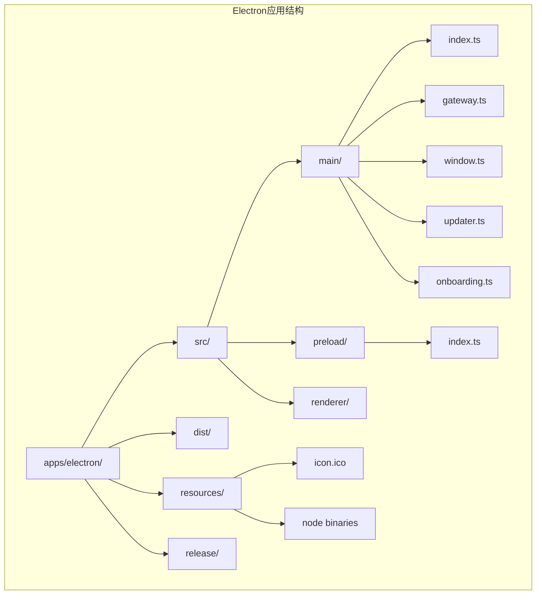
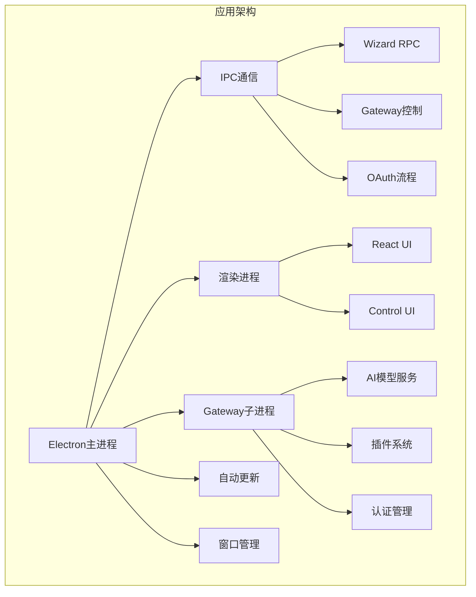
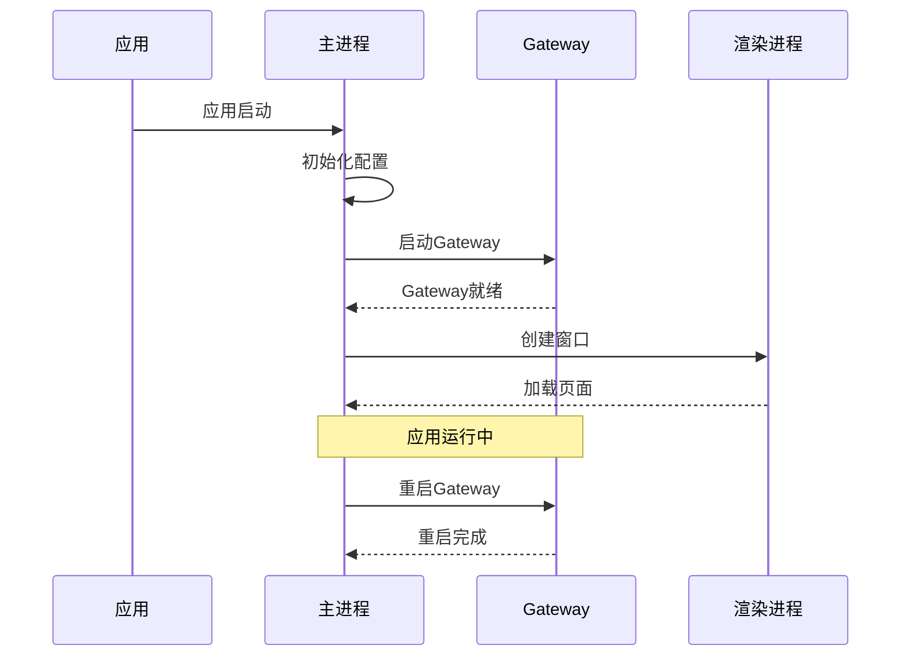
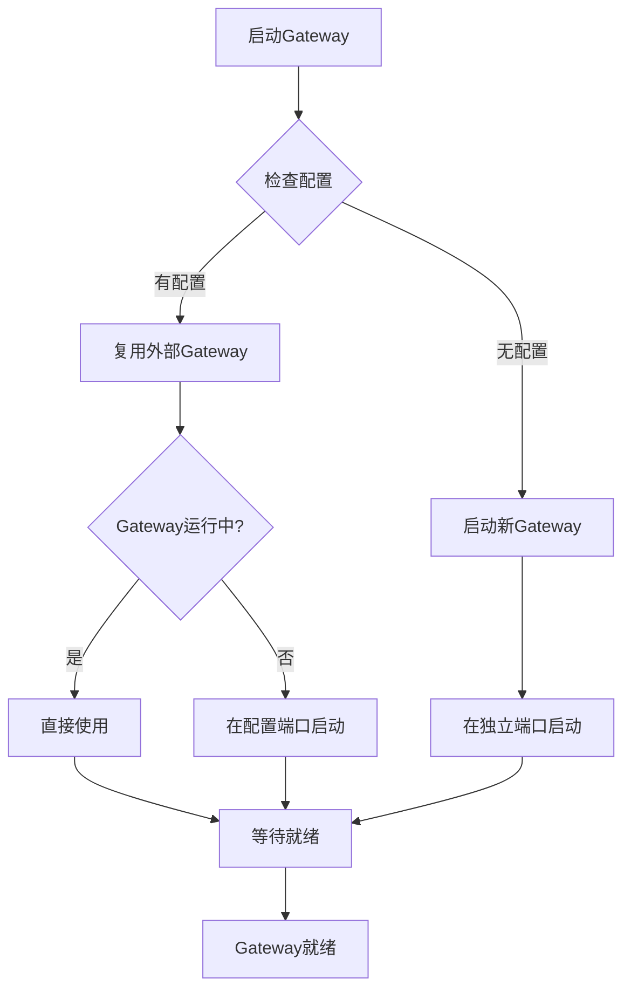
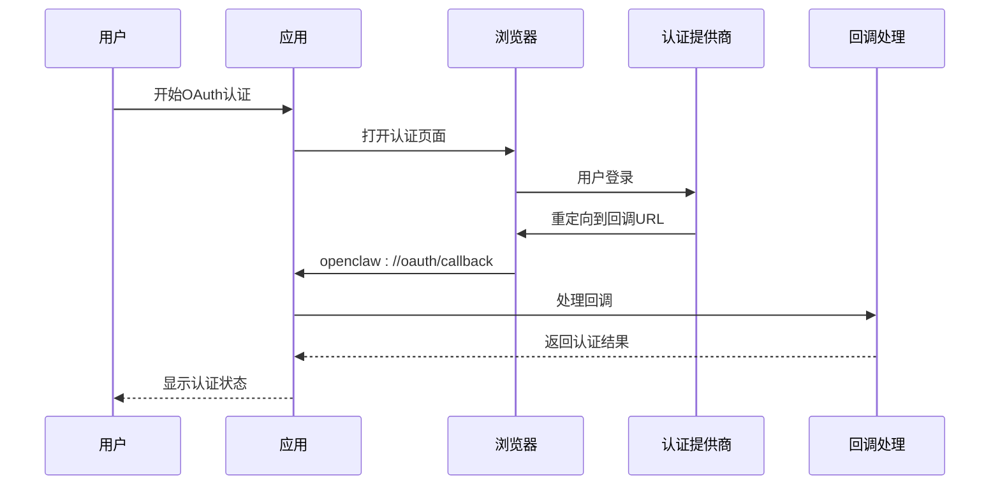
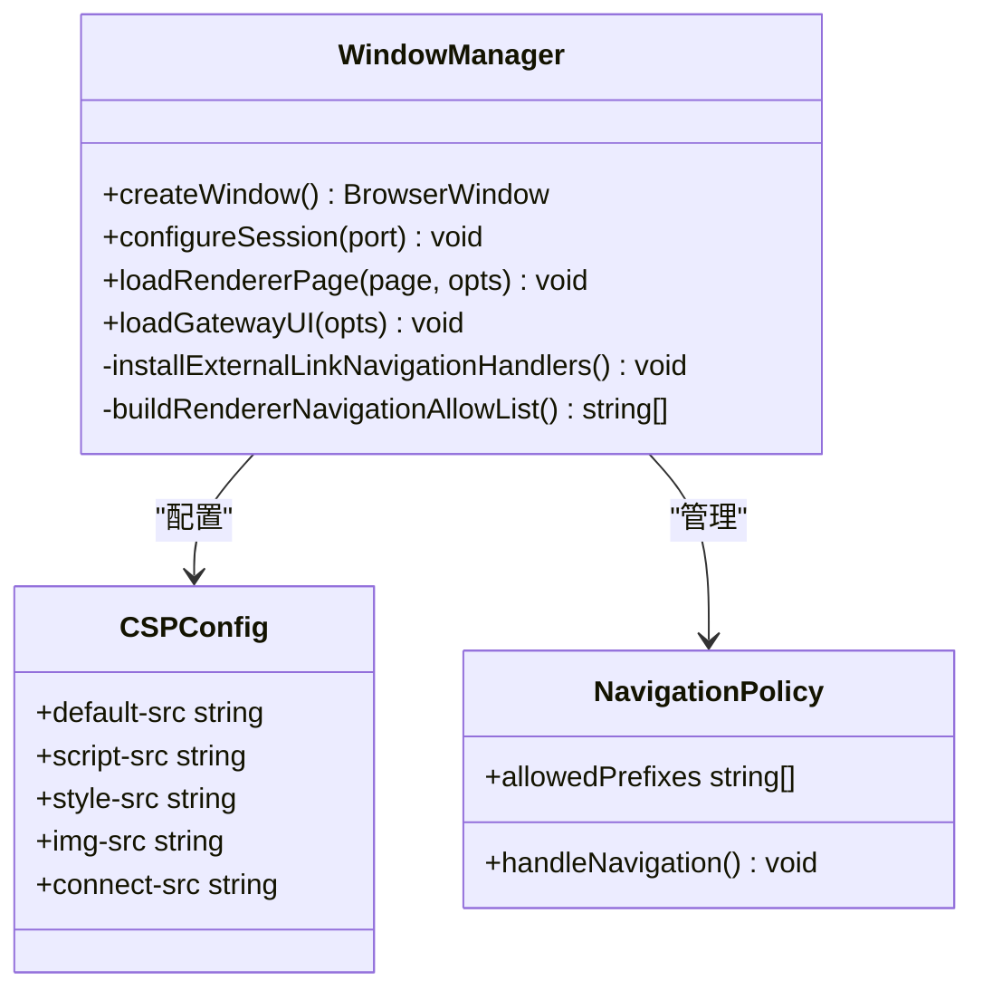
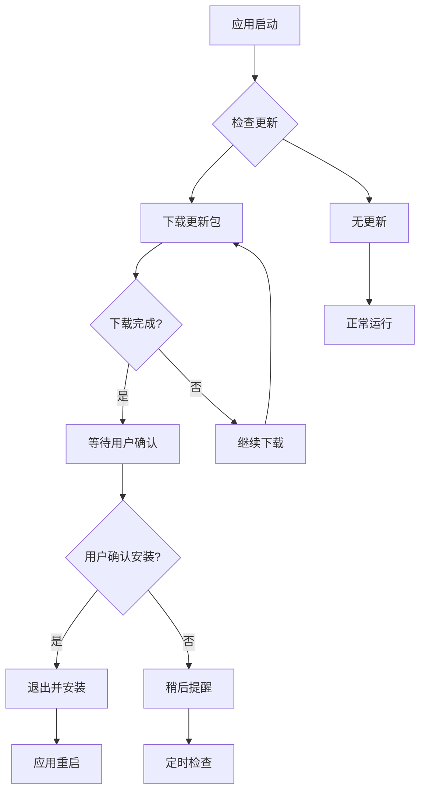
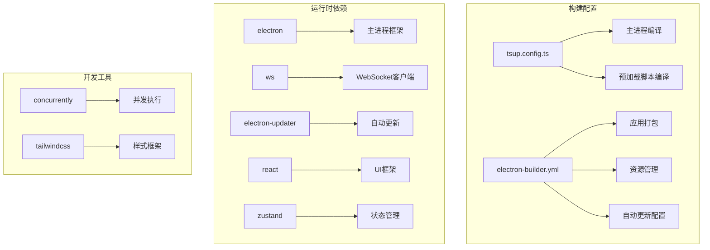

# Electron应用增强

<cite>
**本文档引用的文件**
- [apps/electron/package.json](file://apps/electron/package.json)
- [apps/electron/tsup.config.ts](file://apps/electron/tsup.config.ts)
- [apps/electron/electron-builder.yml](file://apps/electron/electron-builder.yml)
- [apps/electron/src/main/index.ts](file://apps/electron/src/main/index.ts)
- [apps/electron/src/preload/index.ts](file://apps/electron/src/preload/index.ts)
- [apps/electron/src/main/window.ts](file://apps/electron/src/main/window.ts)
- [apps/electron/src/main/updater.ts](file://apps/electron/src/main/updater.ts)
- [apps/electron/src/main/onboarding.ts](file://apps/electron/src/main/onboarding.ts)
- [apps/electron/src/main/gateway.ts](file://apps/electron/src/main/gateway.ts)
- [apps/electron/src/main/ipc-wizard.ts](file://apps/electron/src/main/ipc-wizard.ts)
- [apps/electron/src/main/oauth-utils.ts](file://apps/electron/src/main/oauth-utils.ts)
- [apps/electron/src/main/onboarding-oauth.ts](file://apps/electron/src/main/onboarding-oauth.ts)
- [apps/electron/src/main/token.ts](file://apps/electron/src/main/token.ts)
</cite>

## 目录
1. [项目概述](#项目概述)
2. [项目结构](#项目结构)
3. [核心组件](#核心组件)
4. [架构概览](#架构概览)
5. [详细组件分析](#详细组件分析)
6. [依赖关系分析](#依赖关系分析)
7. [性能考虑](#性能考虑)
8. [故障排除指南](#故障排除指南)
9. [结论](#结论)

## 项目概述

这是一个基于 Electron 的桌面应用程序，名为 Bossim，旨在为 OpenClaw AI 助手提供增强的桌面体验。该应用通过集成 Gateway 子进程管理和原生 OAuth 流程，为用户提供完整的 AI 助手配置和管理功能。

主要特性包括：
- 自动更新机制
- 原生 OAuth 认证流程
- 内置 Gateway 管理
- 静态文件服务器
- 插件系统支持

## 项目结构

**图表来源**
- [apps/electron/package.json:1-44](file://apps/electron/package.json#L1-L44)
- [apps/electron/src/main/index.ts:1-516](file://apps/electron/src/main/index.ts#L1-L516)

**章节来源**
- [apps/electron/package.json:1-44](file://apps/electron/package.json#L1-L44)
- [apps/electron/tsup.config.ts:1-29](file://apps/electron/tsup.config.ts#L1-L29)

## 核心组件

### 应用入口点
主进程入口文件负责整个应用的生命周期管理，包括应用初始化、窗口创建、IPC 通信和 Gateway 管理。

### 预加载脚本
通过 contextBridge 安全地暴露有限的 Electron API 给渲染进程，确保安全隔离。

### 窗口管理系统
负责创建和管理主窗口，配置 CSP 策略，处理导航和外部链接。

### 自动更新系统
集成 electron-updater 实现应用的自动更新功能。

**章节来源**
- [apps/electron/src/main/index.ts:1-516](file://apps/electron/src/main/index.ts#L1-L516)
- [apps/electron/src/preload/index.ts:1-208](file://apps/electron/src/preload/index.ts#L1-L208)

## 架构概览

**图表来源**
- [apps/electron/src/main/index.ts:410-510](file://apps/electron/src/main/index.ts#L410-L510)
- [apps/electron/src/main/gateway.ts:454-512](file://apps/electron/src/main/gateway.ts#L454-L512)

## 详细组件分析

### 主进程管理器

主进程负责协调所有系统组件，包括应用生命周期、IPC 通信和资源管理。

**图表来源**
- [apps/electron/src/main/index.ts:410-510](file://apps/electron/src/main/index.ts#L410-L510)
- [apps/electron/src/main/gateway.ts:454-512](file://apps/electron/src/main/gateway.ts#L454-L512)

**章节来源**
- [apps/electron/src/main/index.ts:1-516](file://apps/electron/src/main/index.ts#L1-L516)

### Gateway集成

Gateway 系统是应用的核心，负责与 AI 模型服务的交互。

**图表来源**
- [apps/electron/src/main/gateway.ts:454-512](file://apps/electron/src/main/gateway.ts#L454-L512)

**章节来源**
- [apps/electron/src/main/gateway.ts:1-713](file://apps/electron/src/main/gateway.ts#L1-L713)

### OAuth认证流程

应用支持多种 OAuth 认证方式，包括设备代码流和简单 URL 打开流程。

**图表来源**
- [apps/electron/src/main/onboarding-oauth.ts:141-183](file://apps/electron/src/main/onboarding-oauth.ts#L141-L183)
- [apps/electron/src/main/onboarding-oauth.ts:85-137](file://apps/electron/src/main/onboarding-oauth.ts#L85-L137)

**章节来源**
- [apps/electron/src/main/onboarding-oauth.ts:1-234](file://apps/electron/src/main/onboarding-oauth.ts#L1-L234)
- [apps/electron/src/main/oauth-utils.ts:1-34](file://apps/electron/src/main/oauth-utils.ts#L1-L34)

### 窗口管理系统

窗口系统负责创建和管理应用窗口，配置安全策略和导航规则。

**图表来源**
- [apps/electron/src/main/window.ts:199-235](file://apps/electron/src/main/window.ts#L199-L235)
- [apps/electron/src/main/window.ts:166-192](file://apps/electron/src/main/window.ts#L166-L192)

**章节来源**
- [apps/electron/src/main/window.ts:1-385](file://apps/electron/src/main/window.ts#L1-L385)

### 自动更新机制

应用集成了自动更新功能，通过 electron-updater 实现无缝更新体验。

**图表来源**
- [apps/electron/src/main/updater.ts:24-79](file://apps/electron/src/main/updater.ts#L24-L79)

**章节来源**
- [apps/electron/src/main/updater.ts:1-100](file://apps/electron/src/main/updater.ts#L1-L100)

## 依赖关系分析

**图表来源**
- [apps/electron/tsup.config.ts:1-29](file://apps/electron/tsup.config.ts#L1-L29)
- [apps/electron/electron-builder.yml:1-321](file://apps/electron/electron-builder.yml#L1-L321)
- [apps/electron/package.json:19-42](file://apps/electron/package.json#L19-L42)

**章节来源**
- [apps/electron/package.json:1-44](file://apps/electron/package.json#L1-L44)
- [apps/electron/electron-builder.yml:1-321](file://apps/electron/electron-builder.yml#L1-L321)

## 性能考虑

### 启动优化
- 预热登录 Shell 环境变量缓存
- 并行启动静态服务器和 Gateway
- 延迟检查更新以避免影响启动性能

### 内存管理
- 使用 contextBridge 限制渲染进程访问权限
- 合理的垃圾回收策略
- 资源清理和连接池管理

### 网络性能
- 静态文件服务器减少 CORS 问题
- WebSocket 连接复用
- CDN 资源优化

## 故障排除指南

### 常见问题

**Gateway 启动失败**
- 检查端口占用情况
- 验证 Node.js 环境
- 查看日志文件定位问题

**OAuth 认证问题**
- 确认回调 URL 配置
- 检查网络连接
- 验证 CSRF 令牌

**自动更新失败**
- 检查网络连接
- 验证更新服务器可达性
- 清理更新缓存

**章节来源**
- [apps/electron/src/main/gateway.ts:157-713](file://apps/electron/src/main/gateway.ts#L157-L713)
- [apps/electron/src/main/onboarding-oauth.ts:1-234](file://apps/electron/src/main/onboarding-oauth.ts#L1-L234)
- [apps/electron/src/main/updater.ts:1-100](file://apps/electron/src/main/updater.ts#L1-L100)

## 结论

这个 Electron 应用展现了现代桌面应用开发的最佳实践，通过精心设计的架构实现了：

1. **安全性**：严格的上下文隔离和权限控制
2. **可靠性**：完善的错误处理和故障恢复机制
3. **用户体验**：流畅的界面和无缝的更新体验
4. **可维护性**：清晰的代码结构和模块化设计

应用的核心优势在于其深度集成的 Gateway 管理能力和灵活的 OAuth 支持，为用户提供了完整的 AI 助手桌面解决方案。通过持续的优化和改进，这个应用能够为用户提供稳定、高效的服务体验。