# Electron应用增强

<cite>
**本文档引用的文件**
- [apps/electron/package.json](file://apps/electron/package.json)
- [apps/electron/tsup.config.ts](file://apps/electron/tsup.config.ts)
- [apps/electron/tsconfig.json](file://apps/electron/tsconfig.json)
- [apps/electron/electron-builder.yml](file://apps/electron/electron-builder.yml)
- [apps/electron/src/main/index.ts](file://apps/electron/src/main/index.ts)
- [apps/electron/src/preload/index.ts](file://apps/electron/src/preload/index.ts)
- [apps/electron/src/main/window.ts](file://apps/electron/src/main/window.ts)
- [apps/electron/src/main/gateway.ts](file://apps/electron/src/main/gateway.ts)
- [apps/electron/src/main/ipc-wizard.ts](file://apps/electron/src/main/ipc-wizard.ts)
- [apps/electron/src/main/onboarding.ts](file://apps/electron/src/main/onboarding.ts)
- [apps/electron/src/main/token.ts](file://apps/electron/src/main/token.ts)
- [apps/electron/src/main/onboarding-oauth.ts](file://apps/electron/src/main/onboarding-oauth.ts)
- [apps/electron/src/main/onboarding-providers.ts](file://apps/electron/src/main/onboarding-providers.ts)
- [apps/electron/src/main/oauth-device-flow.ts](file://apps/electron/src/main/oauth-device-flow.ts)
- [apps/electron/src/main/oauth-utils.ts](file://apps/electron/src/main/oauth-utils.ts)
- [apps/electron/src/main/updater.ts](file://apps/electron/src/main/updater.ts)
- [ui-react/src/adapters/ElectronWizardAdapter.ts](file://ui-react/src/adapters/ElectronWizardAdapter.ts)
- [ui-react/src/components/layout/UpdateBanner.tsx](file://ui-react/src/components/layout/UpdateBanner.tsx)
- [.github/workflows/electron-release.yml](file://.github/workflows/electron-release.yml)
- [apps/electron/scripts/package-electron.sh](file://apps/electron/scripts/package-electron.sh)
- [apps/electron/scripts/download-node.sh](file://apps/electron/scripts/download-node.sh)
- [apps/electron/scripts/notarize-mac-artifact.sh](file://scripts/notarize-mac-artifact.sh)
- [apps/electron/packaged-runtime.json](file://apps/electron/packaged-runtime.json)
- [apps/electron/scripts/generate-runtime-package.mjs](file://apps/electron/scripts/generate-runtime-package.mjs)
</cite>

## 更新摘要
**变更内容**
- Node.js版本升级至24.14.1，替换原有22.x版本
- GitHub CLI集成替换为App Store Connect API密钥处理
- 构建配置更新，支持Node.js 24运行时捆绑
- Apple Store Connect API密钥处理改进，支持文件路径和环境变量两种方式
- 新增详细的运行时依赖管理和裁剪机制
- 改进的打包脚本和公证流程

## 目录
1. [简介](#简介)
2. [项目结构](#项目结构)
3. [核心组件](#核心组件)
4. [架构概览](#架构概览)
5. [详细组件分析](#详细组件分析)
6. [自动更新系统](#自动更新系统)
7. [GitHub Actions自动化发布](#github-actions自动化发布)
8. [OAuth认证系统](#oauth认证系统)
9. [设备代码流框架](#设备代码流框架)
10. [单实例锁机制](#单实例锁机制)
11. [URL方案注册改进](#url方案注册改进)
12. [配置修补功能](#配置修补功能)
13. [登录shell环境缓存](#登录shell环境缓存)
14. [静态HTTP服务器](#静态http服务器)
15. [网关崩溃检测](#网关崩溃检测)
16. [Node.js 24运行时集成](#nodejs-24运行时集成)
17. [Apple Store Connect API密钥处理](#apple-store-connect-api密钥处理)
18. [运行时依赖管理](#运行时依赖管理)
19. [打包和公证流程](#打包和公证流程)
20. [依赖关系分析](#依赖关系分析)
21. [性能考虑](#性能考虑)
22. [故障排除指南](#故障排除指南)
23. [结论](#结论)

## 简介

OpenClaw Electron应用是一个桌面客户端，集成了本地Gateway服务和React控制界面。该应用通过Electron框架提供跨平台支持，包含完整的设置向导、网关管理和实时通信功能。

**最新增强功能：**
- **Node.js 24运行时集成**：完整的Node.js 24.14.1运行时捆绑和管理
- **Apple Store Connect API密钥处理**：改进的App Store Connect API密钥管理，支持文件路径和环境变量两种方式
- **增强的打包脚本**：支持本地快速测试和生产环境打包
- **运行时依赖裁剪**：针对特定架构的原生依赖裁剪优化
- **改进的公证流程**：支持多种认证方式的macOS公证
- **自动更新系统**：完整的electron-updater集成，支持静默下载和用户确认安装
- **GitHub Actions自动化发布**：基于Cloudflare R2的CI/CD发布流程
- **更新提示界面**：UpdateBanner组件提供友好的更新通知和安装体验
- **登录shell环境缓存**：解决macOS打包应用丢失PATH变量问题
- **静态HTTP服务器**：提供有效的loopback HTTP origin，解决origin相关问题
- **网关崩溃检测**：实时监控Gateway进程状态并通知渲染进程
- **OAuth系统重构**：全新的设备代码流框架和通用运行器
- **单实例保护**：基于文件锁的多平台单实例机制
- **URL协议增强**：改进的openclaw://协议处理和回调管理
- **配置修补**：动态配置合并和模型修补功能
- **增强的错误处理和日志记录系统**
- **改进的预加载桥接功能和OAuth验证适配器支持**
- **优化的IPC通信机制和错误恢复能力**

该应用的主要特点包括：
- 内置Node.js 24运行时和OpenClaw CLI
- React驱动的设置向导和控制界面
- WebSocket实时通信
- 多平台打包支持（macOS、Windows、Linux）
- 安全的IPC通信机制
- 完整的OAuth认证流程
- 增强的错误处理和调试功能
- 单实例锁保护机制
- 实时网关状态监控
- 自动更新功能

## 项目结构

Electron应用采用模块化的项目结构，主要分为以下几个部分：

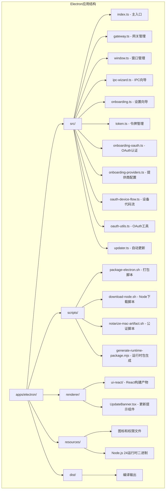

**图表来源**
- [apps/electron/package.json:1-43](file://apps/electron/package.json#L1-L43)
- [apps/electron/tsup.config.ts:1-29](file://apps/electron/tsup.config.ts#L1-L29)

**章节来源**
- [apps/electron/package.json:1-43](file://apps/electron/package.json#L1-L43)
- [apps/electron/tsup.config.ts:1-29](file://apps/electron/tsup.config.ts#L1-L29)
- [apps/electron/tsconfig.json:1-27](file://apps/electron/tsconfig.json#L1-L27)

## 核心组件

### 主进程组件

主进程是Electron应用的核心，负责管理应用生命周期、窗口创建和IPC通信。

**主要职责：**
- 应用生命周期管理
- 窗口创建和配置
- Gateway子进程管理
- IPC消息处理
- 安全策略配置
- OAuth认证流程管理
- 调试日志记录
- 单实例锁保护
- 网关崩溃监控
- **自动更新管理**：初始化和控制更新流程
- **Node.js 24运行时管理**：集成和管理Node.js 24运行时

### 预加载脚本

预加载脚本通过contextBridge安全地暴露API给渲染进程，实现主进程和渲染进程之间的安全通信。

**安全特性：**
- 仅暴露必要的API方法
- 隐藏Node.js内部实现细节
- 提供类型安全的接口
- 支持OAuth认证流程
- 单实例锁状态同步
- 网关崩溃状态通知
- **自动更新事件监听**：接收更新准备通知

### 网关管理器

负责启动、停止和重启本地Gateway服务，管理与Gateway的WebSocket连接。

**功能特性：**
- 自动检测和使用捆绑的Node.js 24运行时
- 支持动态端口配置
- 进程监控和错误处理
- 令牌管理和认证
- 登录shell环境缓存
- 增强的错误恢复机制
- 网关崩溃检测回调

### 自动更新管理器

**新增功能**：完整的自动更新系统，基于electron-updater实现。

**功能特性：**
- 静默下载新版本，避免占用带宽
- 用户确认后安装，确保可控性
- 支持预发布版本禁用
- 进度跟踪和错误处理
- IPC事件通知渲染进程
- 定时检查更新机制

### OAuth认证系统

**新增功能**：全新的OAuth认证系统，支持多种认证提供商。

**支持的认证方式：**
- API密钥认证
- OAuth设备代码流程（MiniMax）
- 简单URL打开流程（OpenAI、Google、Qwen等）
- 自动令牌轮询和验证

### Node.js 24运行时管理器

**新增功能**：完整的Node.js 24运行时集成和管理。

**功能特性：**
- 自动下载和配置Node.js 24.14.1运行时
- 支持多架构（arm64、x64）运行时
- 集成到electron-builder打包流程
- 运行时依赖管理和裁剪
- 本地快速测试和生产环境区分

### Apple Store Connect API密钥处理器

**新增功能**：改进的App Store Connect API密钥处理机制。

**功能特性：**
- 支持文件路径和环境变量两种方式
- 自动转换为electron-builder兼容的变量名
- 临时文件处理和权限管理
- CI和本地开发环境支持

### 运行时依赖管理器

**新增功能**：智能的运行时依赖管理和裁剪机制。

**功能特性：**
- 核心运行时依赖的精确版本管理
- 架构特定的原生依赖裁剪
- 预安装扩展的统一管理
- 依赖版本解析和锁定

### 打包和公证管理器

**新增功能**：完整的打包和公证流程管理。

**功能特性：**
- 支持本地快速测试和生产环境打包
- 多架构（arm64、x64）支持
- 自动公证和装订流程
- 详细的打包进度和状态报告

**章节来源**
- [apps/electron/src/main/index.ts:1-215](file://apps/electron/src/main/index.ts#L1-L215)
- [apps/electron/src/preload/index.ts:1-171](file://apps/electron/src/preload/index.ts#L1-L171)
- [apps/electron/src/main/gateway.ts:1-176](file://apps/electron/src/main/gateway.ts#L1-L176)
- [apps/electron/src/main/onboarding-oauth.ts:1-234](file://apps/electron/src/main/onboarding-oauth.ts#L1-L234)
- [apps/electron/src/main/updater.ts:1-97](file://apps/electron/src/main/updater.ts#L1-L97)
- [apps/electron/scripts/package-electron.sh:1-227](file://apps/electron/scripts/package-electron.sh#L1-L227)
- [apps/electron/scripts/download-node.sh:1-57](file://apps/electron/scripts/download-node.sh#L1-L57)
- [apps/electron/scripts/notarize-mac-artifact.sh:1-66](file://scripts/notarize-mac-artifact.sh#L1-L66)
- [apps/electron/packaged-runtime.json:1-157](file://apps/electron/packaged-runtime.json#L1-L157)

## 架构概览

该应用采用分层架构设计，实现了清晰的关注点分离：

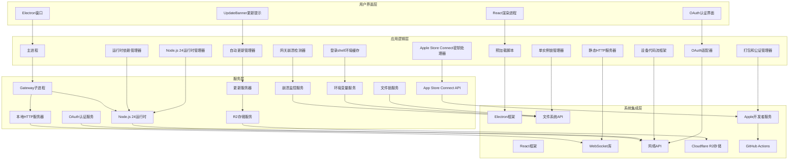

**图表来源**
- [apps/electron/src/main/index.ts:157-209](file://apps/electron/src/main/index.ts#L157-L209)
- [apps/electron/src/main/window.ts:124-148](file://apps/electron/src/main/window.ts#L124-L148)
- [apps/electron/src/main/gateway.ts:100-151](file://apps/electron/src/main/gateway.ts#L100-L151)
- [apps/electron/src/main/onboarding-oauth.ts:262-291](file://apps/electron/src/main/onboarding-oauth.ts#L262-L291)
- [apps/electron/src/main/updater.ts:38-76](file://apps/electron/src/main/updater.ts#L38-L76)

### 数据流架构

应用的数据流遵循单向数据流原则，确保状态的一致性和可预测性：

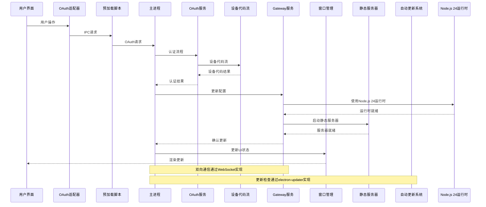

**图表来源**
- [apps/electron/src/preload/index.ts:11-39](file://apps/electron/src/preload/index.ts#L11-L39)
- [apps/electron/src/main/ipc-wizard.ts:192-228](file://apps/electron/src/main/ipc-wizard.ts#L192-L228)
- [apps/electron/src/main/gateway.ts:100-151](file://apps/electron/src/main/gateway.ts#L100-L151)
- [apps/electron/src/main/onboarding-oauth.ts:262-339](file://apps/electron/src/main/onboarding-oauth.ts#L262-L339)
- [apps/electron/src/main/updater.ts:82-87](file://apps/electron/src/main/updater.ts#L82-L87)

## 详细组件分析

### 主入口组件 (index.ts)

主入口文件是整个应用的协调中心，负责初始化各个组件并建立它们之间的联系。

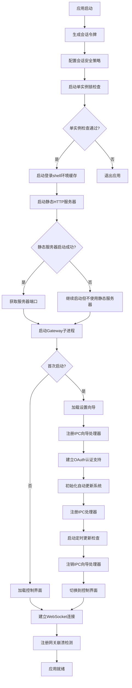

**图表来源**
- [apps/electron/src/main/index.ts:157-209](file://apps/electron/src/main/index.ts#L157-L209)
- [apps/electron/src/main/onboarding.ts:23-59](file://apps/electron/src/main/onboarding.ts#L23-L59)
- [apps/electron/src/main/updater.ts:24-36](file://apps/electron/src/main/updater.ts#L24-L36)

**章节来源**
- [apps/electron/src/main/index.ts:1-215](file://apps/electron/src/main/index.ts#L1-L215)

### 增强的窗口管理系统

窗口管理系统经过重大增强，新增了全面的错误处理和日志记录功能。

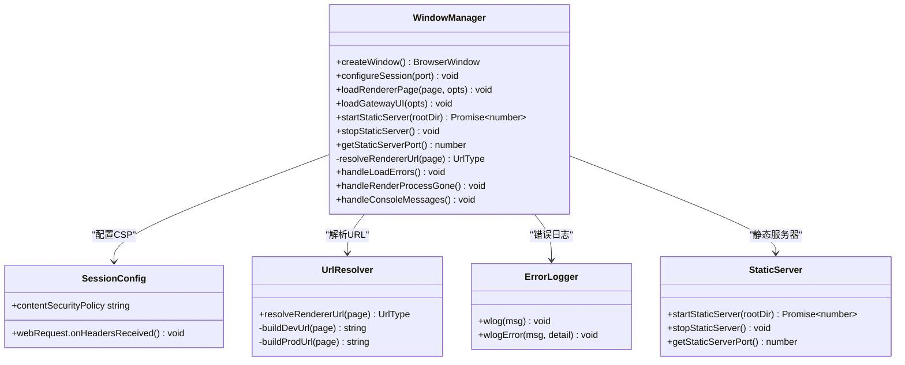

**图表来源**
- [apps/electron/src/main/window.ts:5-148](file://apps/electron/src/main/window.ts#L5-L148)

**章节来源**
- [apps/electron/src/main/window.ts:1-226](file://apps/electron/src/main/window.ts#L1-L226)

### Gateway服务管理

Gateway服务管理器负责启动、监控和控制本地Gateway进程。

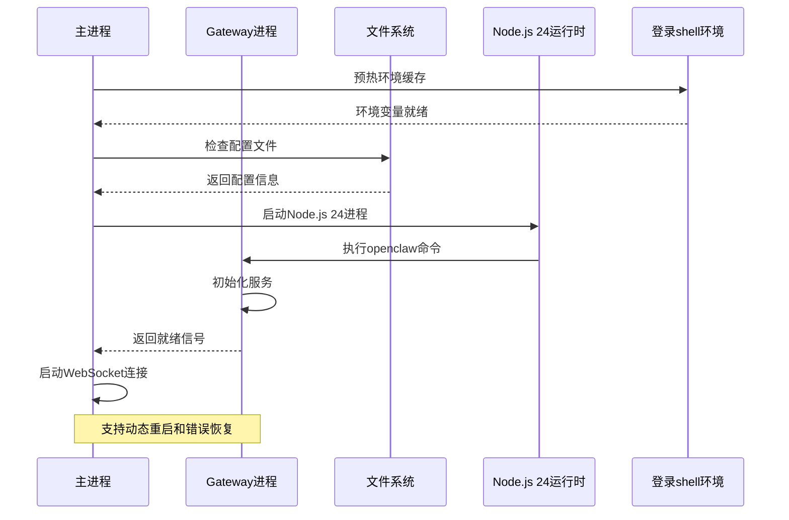

**图表来源**
- [apps/electron/src/main/gateway.ts:100-151](file://apps/electron/src/main/gateway.ts#L100-L151)
- [apps/electron/src/main/gateway.ts:166-171](file://apps/electron/src/main/gateway.ts#L166-L171)

**章节来源**
- [apps/electron/src/main/gateway.ts:1-176](file://apps/electron/src/main/gateway.ts#L1-L176)

### IPC向导系统

IPC向导系统实现了设置向导的完整生命周期管理，包括握手协议和RPC通信。

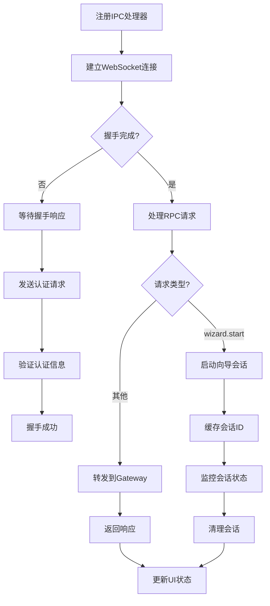

**图表来源**
- [apps/electron/src/main/ipc-wizard.ts:187-229](file://apps/electron/src/main/ipc-wizard.ts#L187-L229)
- [apps/electron/src/main/ipc-wizard.ts:126-175](file://apps/electron/src/main/ipc-wizard.ts#L126-L175)

**章节来源**
- [apps/electron/src/main/ipc-wizard.ts:1-243](file://apps/electron/src/main/ipc-wizard.ts#L1-L243)

### 安全令牌管理

令牌管理系统负责生成和管理会话令牌，确保每次启动都有唯一的身份标识。

**安全特性：**
- 使用加密安全的随机数生成器
- 令牌仅存在于内存中
- 每次启动自动生成新令牌
- 支持从配置文件复用现有令牌

**章节来源**
- [apps/electron/src/main/token.ts:1-10](file://apps/electron/src/main/token.ts#L1-L10)
- [apps/electron/src/main/onboarding.ts:57-76](file://apps/electron/src/main/onboarding.ts#L57-L76)

## 自动更新系统

**新增功能**：完整的自动更新系统，基于electron-updater实现静默下载和用户确认安装。

### 自动更新架构

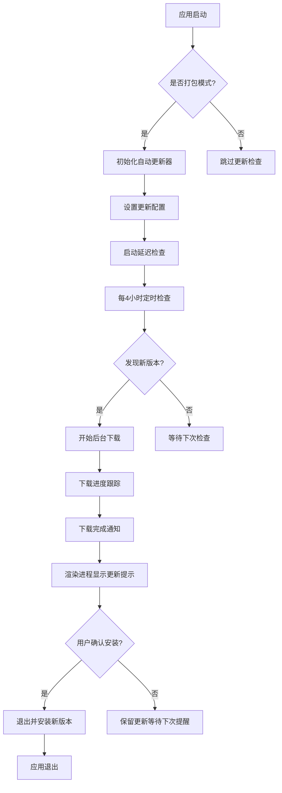

**图表来源**
- [apps/electron/src/main/updater.ts:24-36](file://apps/electron/src/main/updater.ts#L24-L36)
- [apps/electron/src/main/updater.ts:82-87](file://apps/electron/src/main/updater.ts#L82-L87)
- [apps/electron/src/main/updater.ts:62-69](file://apps/electron/src/main/updater.ts#L62-L69)

### 自动更新管理器

自动更新管理器提供完整的更新生命周期管理：

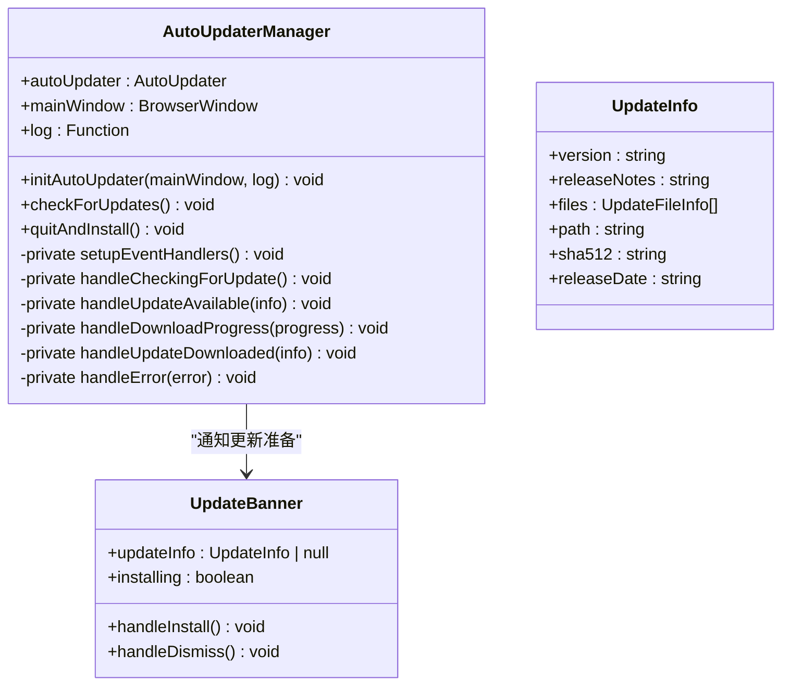

**图表来源**
- [apps/electron/src/main/updater.ts:24-36](file://apps/electron/src/main/updater.ts#L24-L36)
- [apps/electron/src/main/updater.ts:62-69](file://apps/electron/src/main/updater.ts#L62-L69)
- [ui-react/src/components/layout/UpdateBanner.tsx:16-34](file://ui-react/src/components/layout/UpdateBanner.tsx#L16-L34)

**章节来源**
- [apps/electron/src/main/updater.ts:1-97](file://apps/electron/src/main/updater.ts#L1-L97)
- [ui-react/src/components/layout/UpdateBanner.tsx:1-83](file://ui-react/src/components/layout/UpdateBanner.tsx#L1-L83)

### 更新服务器配置

自动更新系统配置Cloudflare R2作为更新服务器：

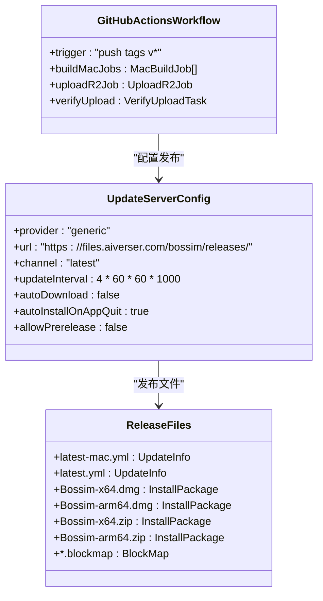

**图表来源**
- [apps/electron/electron-builder.yml:214-217](file://apps/electron/electron-builder.yml#L214-L217)
- [.github/workflows/electron-release.yml:83-150](file://.github/workflows/electron-release.yml#L83-L150)

**章节来源**
- [apps/electron/electron-builder.yml:211-218](file://apps/electron/electron-builder.yml#L211-L218)
- [.github/workflows/electron-release.yml:1-150](file://.github/workflows/electron-release.yml#L1-L150)

### IPC通信机制

自动更新系统通过IPC实现主进程和渲染进程的通信：

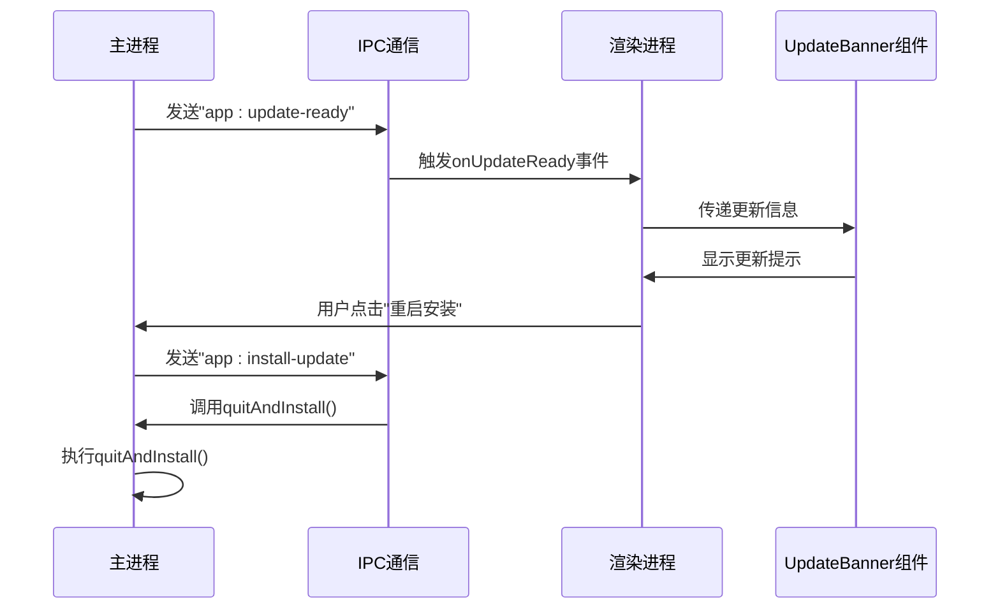

**图表来源**
- [apps/electron/src/main/updater.ts:62-69](file://apps/electron/src/main/updater.ts#L62-L69)
- [apps/electron/src/preload/index.ts:155-169](file://apps/electron/src/preload/index.ts#L155-L169)
- [ui-react/src/components/layout/UpdateBanner.tsx:38-49](file://ui-react/src/components/layout/UpdateBanner.tsx#L38-L49)

**章节来源**
- [apps/electron/src/preload/index.ts:149-170](file://apps/electron/src/preload/index.ts#L149-L170)
- [apps/electron/src/main/updater.ts:93-96](file://apps/electron/src/main/updater.ts#L93-L96)

## GitHub Actions自动化发布

**新增功能**：完整的CI/CD发布流程，基于GitHub Actions和Cloudflare R2实现自动化发布。

### 发布工作流架构

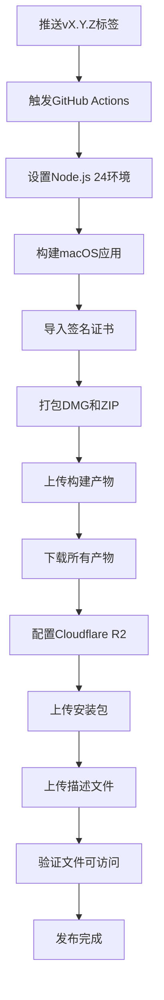

**图表来源**
- [.github/workflows/electron-release.yml:4-7](file://.github/workflows/electron-release.yml#L4-L7)
- [.github/workflows/electron-release.yml:58-70](file://.github/workflows/electron-release.yml#L58-L70)
- [.github/workflows/electron-release.yml:118-141](file://.github/workflows/electron-release.yml#L118-L141)

### 构建和签名流程

发布工作流包含完整的构建、签名和发布流程：

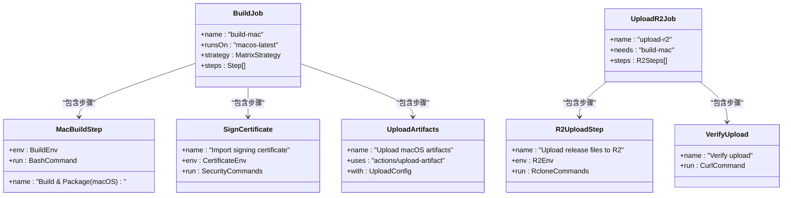

**图表来源**
- [.github/workflows/electron-release.yml:18-82](file://.github/workflows/electron-release.yml#L18-L82)
- [.github/workflows/electron-release.yml:84-150](file://.github/workflows/electron-release.yml#L84-L150)

**章节来源**
- [.github/workflows/electron-release.yml:1-150](file://.github/workflows/electron-release.yml#L1-L150)

### Cloudflare R2存储配置

发布流程使用Cloudflare R2作为存储后端：

```mermaid
classDiagram
class R2Config {
+type : "s3"
+provider : "Cloudflare"
+access_key_id : "${R2_ACCESS_KEY_ID}"
+secret_access_key : "${R2_SECRET_ACCESS_KEY}"
+endpoint : "${R2_ENDPOINT}"
+acl : "private"
}
class UploadPaths {
+installers : "*.dmg, *.zip, *.blockmap"
+metadata : "*.yml"
+destination : "r2 : bucket-name/bossim/releases"
}
class RcloneCommands {
+copyInstallers : "rclone copy artifacts/ DEST --include '*.dmg' --include '*.zip' --include '*.blockmap'"
+copyMetadata : "rclone copy artifacts/ DEST --include '*.yml'"
+noUpdateModtime : "--no-update-modtime"
}
R2Config --> UploadPaths : "配置上传路径"
UploadPaths --> RcloneCommands : "生成命令"
```

**图表来源**
- [.github/workflows/electron-release.yml:108-116](file://.github/workflows/electron-release.yml#L108-L116)
- [.github/workflows/electron-release.yml:127-141](file://.github/workflows/electron-release.yml#L127-L141)

**章节来源**
- [.github/workflows/electron-release.yml:83-150](file://.github/workflows/electron-release.yml#L83-L150)

## OAuth认证系统

**新增功能**：全新的OAuth认证系统，支持多种认证提供商。

### OAuth认证架构

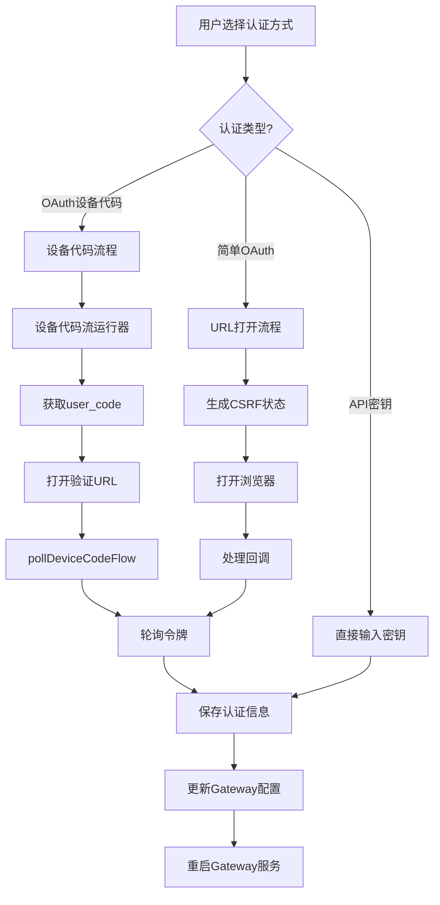

**图表来源**
- [apps/electron/src/main/onboarding-oauth.ts:6-13](file://apps/electron/src/main/onboarding-oauth.ts#L6-L13)
- [apps/electron/src/main/onboarding-oauth.ts:104-185](file://apps/electron/src/main/onboarding-oauth.ts#L104-L185)
- [apps/electron/src/main/onboarding-oauth.ts:262-339](file://apps/electron/src/main/onboarding-oauth.ts#L262-L339)

### OAuth适配器

**新增功能**：ElectronWizardAdapter支持OAuth认证流程。

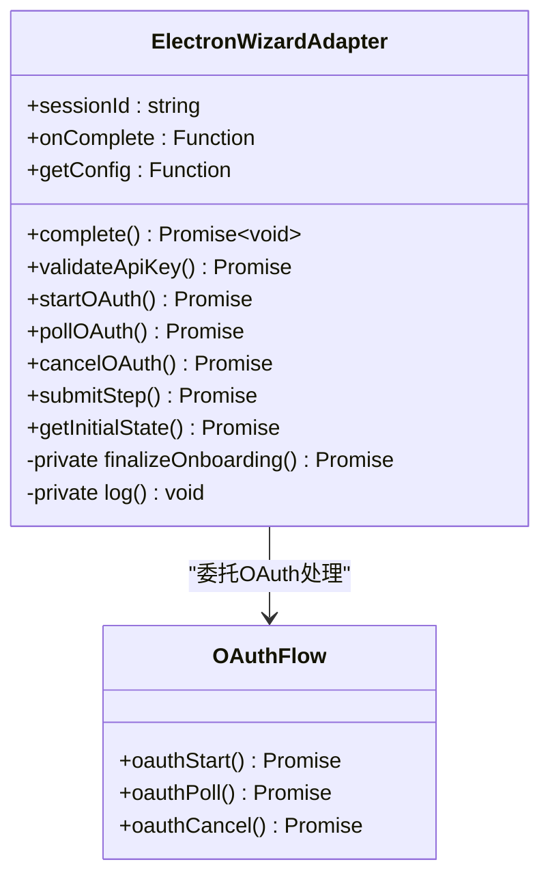

**图表来源**
- [ui-react/src/adapters/ElectronWizardAdapter.ts:26-185](file://ui-react/src/adapters/ElectronWizardAdapter.ts#L26-L185)

**章节来源**
- [ui-react/src/adapters/ElectronWizardAdapter.ts:1-185](file://ui-react/src/adapters/ElectronWizardAdapter.ts#L1-L185)
- [apps/electron/src/main/onboarding-oauth.ts:1-234](file://apps/electron/src/main/onboarding-oauth.ts#L1-L234)
- [apps/electron/src/main/onboarding-providers.ts:1-253](file://apps/electron/src/main/onboarding-providers.ts#L1-L253)

### OAuth提供商支持

**支持的OAuth提供商：**
- **MiniMax**：全球版和中国版设备代码流程
- **OpenAI**：Codex OAuth设备代码流程
- **Google**：Gemini CLI OAuth
- **Qwen**：通义千问门户OAuth
- **GitHub**：Copilot设备代码流程
- **Chutes**：Chutes OAuth

**章节来源**
- [apps/electron/src/main/onboarding-providers.ts:72-81](file://apps/electron/src/main/onboarding-providers.ts#L72-L81)
- [apps/electron/src/main/onboarding-oauth.ts:77-91](file://apps/electron/src/main/onboarding-oauth.ts#L77-L91)

## 设备代码流框架

**新增功能**：全新的设备代码流框架，支持标准的OAuth 2.0设备代码流程。

### 设备代码流架构

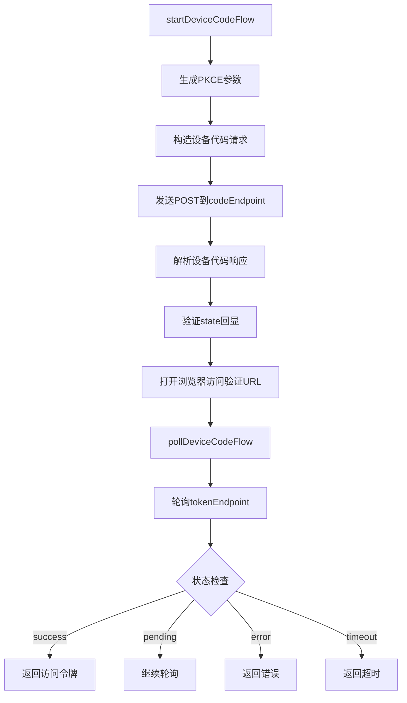

**图表来源**
- [apps/electron/src/main/oauth-device-flow.ts:94-182](file://apps/electron/src/main/oauth-device-flow.ts#L94-L182)
- [apps/electron/src/main/oauth-device-flow.ts:184-258](file://apps/electron/src/main/oauth-device-flow.ts#L184-L258)

### 设备代码流配置

设备代码流框架通过配置对象实现供应商特定逻辑：

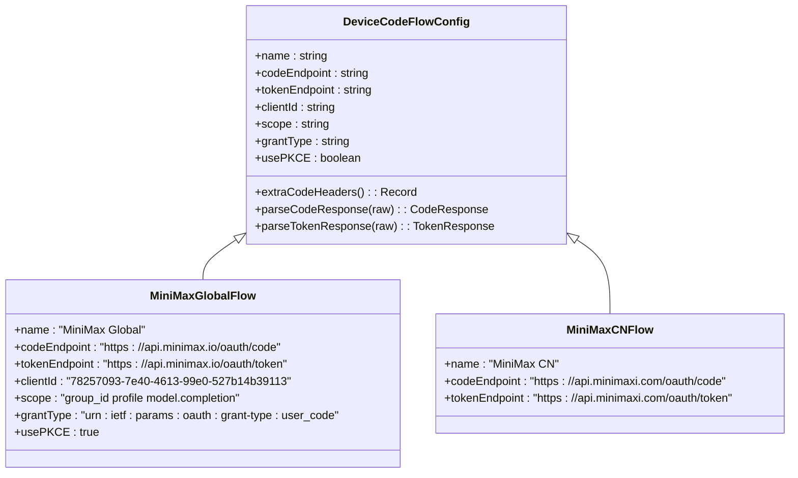

**图表来源**
- [apps/electron/src/main/oauth-device-flow.ts:20-58](file://apps/electron/src/main/oauth-device-flow.ts#L20-L58)
- [apps/electron/src/main/oauth-device-flow.ts:262-329](file://apps/electron/src/main/oauth-device-flow.ts#L262-L329)

**章节来源**
- [apps/electron/src/main/oauth-device-flow.ts:1-329](file://apps/electron/src/main/oauth-device-flow.ts#L1-L329)

### OAuth工具函数

**新增功能**：OAuth工具函数提供PKCE和表单编码支持。

```mermaid
classDiagram
class OAuthUtils {
+generatePkce() : {verifier, challenge, state}
+toFormUrlEncoded(params) : string
}
class PKCEGenerator {
+verifier : string
+challenge : string
+state : string
}
OAuthUtils --> PKCEGenerator : "生成PKCE参数"
```

**图表来源**
- [apps/electron/src/main/oauth-utils.ts:19-24](file://apps/electron/src/main/oauth-utils.ts#L19-L24)

**章节来源**
- [apps/electron/src/main/oauth-utils.ts:1-34](file://apps/electron/src/main/oauth-utils.ts#L1-L34)

## 单实例锁机制

**新增功能**：基于文件锁的单实例保护机制，防止多个实例同时运行。

### 单实例锁架构

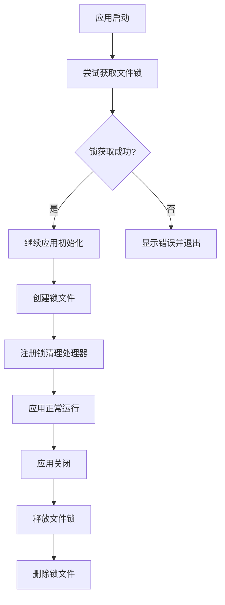

**图表来源**
- [apps/electron/src/main/index.ts:157-209](file://apps/electron/src/main/index.ts#L157-L209)

### 文件锁实现

单实例锁机制通过文件系统实现跨平台保护：

```mermaid
classDiagram
class FileLock {
+lockPath : string
+lockFile : FileHandle
+acquire() : Promise~boolean~
+release() : Promise~void~
+isLocked() : boolean
}
class SingleInstanceGuard {
+lock : FileLock
+checkInstance() : Promise~boolean~
+cleanup() : Promise~void~
}
SingleInstanceGuard --> FileLock : "使用文件锁"
```

**图表来源**
- [apps/electron/src/main/index.ts:157-209](file://apps/electron/src/main/index.ts#L157-L209)

**章节来源**
- [apps/electron/src/main/index.ts:1-215](file://apps/electron/src/main/index.ts#L1-L215)

## URL方案注册改进

**新增功能**：增强的URL协议处理和回调机制，支持openclaw://协议。

### URL协议处理架构

```mermaid
flowchart TD
A[用户点击OAuth链接] --> B[系统调用openclaw://协议]
B --> C[Electron接收URL事件]
C --> D{URL格式验证}
D --> |有效| E[解析查询参数]
D --> |无效| F[忽略并记录警告]
E --> G{认证方法检查}
G --> |存在| H[验证CSRF状态]
G --> |不存在| I[记录错误]
H --> |通过| J[存储回调结果]
H --> |失败| K[标记CSRF攻击]
I --> L[清理会话状态]
J --> M[触发轮询检查]
K --> M
M --> N[返回认证状态]
```

**图表来源**
- [apps/electron/src/main/onboarding-oauth.ts:78-137](file://apps/electron/src/main/onboarding-oauth.ts#L78-L137)

### 协议回调管理

**新增功能**：专门的协议回调处理器管理OAuth回调：

```mermaid
classDiagram
class OAuthCallbackHandler {
+activeSessions : Map~string, Session~
+completedCallbacks : Map~string, Result~
+handleOAuthProtocolCallback(url) : void
+clearOAuthSession(authMethod) : void
}
class SessionManager {
+getSession(authMethod) : Session
+setSession(authMethod, session) : void
+clearSession(authMethod) : void
}
OAuthCallbackHandler --> SessionManager : "管理会话状态"
```

**图表来源**
- [apps/electron/src/main/onboarding-oauth.ts:30-56](file://apps/electron/src/main/onboarding-oauth.ts#L30-L56)

**章节来源**
- [apps/electron/src/main/onboarding-oauth.ts:1-234](file://apps/electron/src/main/onboarding-oauth.ts#L1-L234)

## 配置修补功能

**新增功能**：动态配置合并和模型修补功能，支持配置的增量更新。

### 配置修补架构

```mermaid
flowchart TD
A[配置更新请求] --> B[解析修补数据]
B --> C{修补类型检查}
C --> |merge-patch| D[执行合并修补]
C --> |model-patch| E[应用模型修补]
C --> |auth-patch| F[更新认证配置]
D --> G[验证修补结果]
E --> G
F --> G
G --> H{验证通过?}
H --> |是| I[应用到运行时配置]
H --> |否| J[返回错误信息]
I --> K[触发配置重新加载]
K --> L[更新所有相关组件]
```

**图表来源**
- [apps/electron/src/main/onboarding-providers.ts:113-253](file://apps/electron/src/main/onboarding-providers.ts#L113-L253)

### 修补功能实现

**新增功能**：配置修补功能支持多种修补类型：

```mermaid
classDiagram
class ConfigPatchManager {
+mergePatch(data) : PatchResult
+modelPatch(models) : PatchResult
+authPatch(credentials) : PatchResult
+validatePatch(patch) : ValidationResult
}
class ProviderRegistry {
+PROVIDER_REGISTRY : Record~string, ProviderApiConfig~
+OAUTH_AUTH_METHODS : Set~string~
+OAUTH_METHOD_PLUGIN : Record~string, string~
+OAUTH_METHOD_PROVIDER_OVERRIDE : Record~string, string~
}
ConfigPatchManager --> ProviderRegistry : "使用提供商配置"
```

**图表来源**
- [apps/electron/src/main/onboarding-providers.ts:17-112](file://apps/electron/src/main/onboarding-providers.ts#L17-L112)

**章节来源**
- [apps/electron/src/main/onboarding-providers.ts:1-253](file://apps/electron/src/main/onboarding-providers.ts#L1-L253)

## 登录shell环境缓存

**新增功能**：登录shell环境变量缓存机制，解决macOS打包应用丢失PATH变量问题。

### 环境缓存架构

```mermaid
flowchart TD
A[应用启动] --> B[预热登录shell环境]
B --> C{环境缓存已存在?}
C --> |是| D[直接使用缓存]
C --> |否| E[执行shell命令获取环境变量]
E --> F[解析环境变量输出]
F --> G[存储到缓存]
G --> H[合并到进程环境]
D --> H
H --> I[启动Gateway子进程]
I --> J[应用环境变量到子进程]
```

**图表来源**
- [apps/electron/src/main/gateway.ts:42-78](file://apps/electron/src/main/gateway.ts#L42-L78)
- [apps/electron/src/main/gateway.ts:84-86](file://apps/electron/src/main/gateway.ts#L84-L86)

### 环境变量解析

登录shell环境缓存通过执行登录shell命令获取完整的环境变量：

```mermaid
classDiagram
class LoginShellEnvCache {
+_loginShellEnv : Record~string, string~ | null
+resolveLoginShellEnv() : Promise~Record~string, string~~
+warmLoginShellEnv() : Promise~void~
+spawnGatewayWithEnv() : Promise~ChildProcess~
}
class ShellEnvironmentParser {
+parseEnvOutput(output) : Record~string, string~
+extractKeyValue(line) : [string, string]
}
LoginShellEnvCache --> ShellEnvironmentParser : "解析环境变量"
```

**图表来源**
- [apps/electron/src/main/gateway.ts:42-78](file://apps/electron/src/main/gateway.ts#L42-L78)

**章节来源**
- [apps/electron/src/main/gateway.ts:1-176](file://apps/electron/src/main/gateway.ts#L1-L176)

## 静态HTTP服务器

**新增功能**：内置静态HTTP服务器，提供有效的loopback HTTP origin，解决origin相关问题。

### 静态服务器架构

```mermaid
flowchart TD
A[应用启动] --> B{打包模式?}
B --> |是| C[启动静态HTTP服务器]
B --> |否| D[使用开发服务器]
C --> E[监听随机端口]
E --> F[映射路由到HTML文件]
F --> G[处理SPA回退到index.html]
G --> H[设置正确的MIME类型]
H --> I[返回静态资源]
D --> J[使用VITE_UI_REACT_URL]
I --> K[配置CSP和Origin头]
J --> K
K --> L[应用就绪]
```

**图表来源**
- [apps/electron/src/main/window.ts:35-69](file://apps/electron/src/main/window.ts#L35-L69)
- [apps/electron/src/main/window.ts:99-136](file://apps/electron/src/main/window.ts#L99-L136)

### 服务器配置

静态HTTP服务器提供完整的静态文件服务：

```mermaid
classDiagram
class StaticHttpServer {
+_staticServer : http.Server | null
+_staticServerPort : number
+startStaticServer(rootDir) : Promise~number~
+stopStaticServer() : void
+getStaticServerPort() : number
+handleRequest(req, res) : void
}
class MimeTypes {
+MIME : Record~string, string~
+getMimeType(ext) : string
}
class SpaFallbackHandler {
+serveIndexHtml(filePath) : void
+handleUnknownRoute(req, res) : void
}
StaticHttpServer --> MimeTypes : "使用MIME类型"
StaticHttpServer --> SpaFallbackHandler : "处理SPA回退"
```

**图表来源**
- [apps/electron/src/main/window.ts:15-79](file://apps/electron/src/main/window.ts#L15-L79)

**章节来源**
- [apps/electron/src/main/window.ts:1-226](file://apps/electron/src/main/window.ts#L1-L226)

## 网关崩溃检测

**新增功能**：实时监控Gateway进程状态并在崩溃时通知渲染进程。

### 崩溃检测架构

```mermaid
flowchart TD
A[启动Gateway进程] --> B[注册崩溃回调]
B --> C[监控进程退出事件]
C --> D{进程正常退出?}
D --> |SIGTERM| E[预期停止，不通知]
D --> |其他原因| F[意外崩溃，触发回调]
F --> G[发送崩溃通知到渲染进程]
G --> H[渲染进程显示重连提示]
E --> I[应用正常关闭]
H --> J[用户选择重连或重启]
```

**图表来源**
- [apps/electron/src/main/gateway.ts:90-103](file://apps/electron/src/main/gateway.ts#L90-L103)
- [apps/electron/src/main/gateway.ts:420-430](file://apps/electron/src/main/gateway.ts#L420-L430)

### 崩溃处理机制

网关崩溃检测器提供完整的崩溃监控和通知功能：

```mermaid
classDiagram
class GatewayCrashDetector {
+_onGatewayCrash : ((code, signal) => void) | null
+_intentionalStop : boolean
+_reusingExternalGateway : boolean
+onGatewayCrash(cb) : void
+detectCrash(code, signal) : void
+isIntentionalStop() : boolean
+isReusingExternalGateway() : boolean
}
class CrashNotificationSystem {
+sendCrashNotification(code, signal) : void
+showReconnectPrompt() : void
+handleUserAction(action) : void
}
GatewayCrashDetector --> CrashNotificationSystem : "发送通知"
```

**图表来源**
- [apps/electron/src/main/gateway.ts:90-103](file://apps/electron/src/main/gateway.ts#L90-L103)

**章节来源**
- [apps/electron/src/main/gateway.ts:1-176](file://apps/electron/src/main/gateway.ts#L1-L176)

## Node.js 24运行时集成

**新增功能**：完整的Node.js 24.14.1运行时集成和管理。

### Node.js 24运行时架构

```mermaid
flowchart TD
A[应用启动] --> B{需要Node.js运行时?}
B --> |是| C[下载Node.js 24.14.1]
C --> D[检测平台架构]
D --> E{Windows?}
E --> |是| F[下载node.exe]
E --> |否| G[下载node二进制]
F --> H[解压到resources/node-{arch}/]
G --> H
H --> I[设置执行权限]
I --> J[配置electron-builder]
J --> K[集成到打包流程]
K --> L[启动Gateway使用Node.js 24]
```

**图表来源**
- [apps/electron/scripts/download-node.sh:12-56](file://apps/electron/scripts/download-node.sh#L12-L56)
- [apps/electron/scripts/package-electron.sh:99-103](file://apps/electron/scripts/package-electron.sh#L99-L103)

### 运行时下载和配置

Node.js 24运行时通过专用脚本管理下载和配置：

```mermaid
classDiagram
class NodeRuntimeManager {
+NODE_VERSION : "24.14.1"
+downloadNodeBinary(arch, platform) : Promise~void~
+setupRuntimeEnvironment() : void
+configureElectronBuilder() : void
}
class DownloadScript {
+ARCH : string
+PLATFORM : string
+NODE_BINARY : string
+downloadAndExtract() : void
+extractFromZip() : void
+extractFromTarGz() : void
}
class RuntimeConfig {
+resources/node-{arch}/ : Directory
+node : Executable
+node.exe : Executable
+integrationWithElectron : boolean
}
NodeRuntimeManager --> DownloadScript : "使用下载脚本"
NodeRuntimeManager --> RuntimeConfig : "配置运行时"
```

**图表来源**
- [apps/electron/scripts/download-node.sh:12-56](file://apps/electron/scripts/download-node.sh#L12-L56)

**章节来源**
- [apps/electron/scripts/download-node.sh:1-57](file://apps/electron/scripts/download-node.sh#L1-L57)
- [apps/electron/scripts/package-electron.sh:99-103](file://apps/electron/scripts/package-electron.sh#L99-L103)

### 运行时依赖管理

**新增功能**：智能的运行时依赖管理和裁剪机制。

```mermaid
classDiagram
class RuntimeDependencyManager {
+coreRuntimeDependencies : string[]
+runtimeDependencies : string[]
+preinstalledExtensions : string[]
+generateRuntimePackage() : void
+installRuntimeDependencies() : void
+pruneNativeDependencies() : void
}
class DependencyResolver {
+resolveFromPackageJson(name) : string
+resolveFromInstalled(name) : string
+resolveFromLockfile(name) : string
}
class RuntimePackageGenerator {
+createPackageManifest() : void
+writePackageJson() : void
}
RuntimeDependencyManager --> DependencyResolver : "解析依赖版本"
RuntimeDependencyManager --> RuntimePackageGenerator : "生成包清单"
```

**图表来源**
- [apps/electron/packaged-runtime.json:16-114](file://apps/electron/packaged-runtime.json#L16-L114)
- [apps/electron/scripts/generate-runtime-package.mjs:91-115](file://apps/electron/scripts/generate-runtime-package.mjs#L91-L115)

**章节来源**
- [apps/electron/packaged-runtime.json:1-157](file://apps/electron/packaged-runtime.json#L1-L157)
- [apps/electron/scripts/generate-runtime-package.mjs:1-115](file://apps/electron/scripts/generate-runtime-package.mjs#L1-L115)

## Apple Store Connect API密钥处理

**新增功能**：改进的App Store Connect API密钥处理机制，支持文件路径和环境变量两种方式。

### Apple Store Connect密钥处理架构

```mermaid
flowchart TD
A[加载环境变量] --> B{APP_STORE_CONNECT_API_KEY_PATH存在?}
B --> |是| C[从文件读取p8内容]
B --> |否| D{APP_STORE_CONNECT_API_KEY_P8存在?}
C --> E[设置APPLE_API_KEY为文件路径]
D --> |是| F[创建临时p8文件]
D --> |否| G[报错：缺少API密钥]
F --> H[设置APPLE_API_KEY为临时文件路径]
H --> I[设置APPLE_API_KEY_ID和APPLE_API_ISSUER]
E --> J[映射变量名]
I --> J
G --> K[退出并显示错误]
J --> L[继续打包流程]
```

**图表来源**
- [apps/electron/scripts/package-electron.sh:25-66](file://apps/electron/scripts/package-electron.sh#L25-L66)

### 密钥处理实现

Apple Store Connect API密钥处理通过环境变量映射实现：

```mermaid
classDiagram
class AppleStoreConnectKeyProcessor {
+APP_STORE_CONNECT_API_KEY_PATH : string
+APP_STORE_CONNECT_API_KEY_P8 : string
+APP_STORE_CONNECT_KEY_ID : string
+APP_STORE_CONNECT_ISSUER_ID : string
+processApiKey() : void
+createTempP8File() : string
+loadKeyFromFile() : string
+mapVariableNames() : void
}
class NotarizationAuthenticator {
+NOTARYTOOL_PROFILE : string
+NOTARYTOOL_KEY : string
+NOTARYTOOL_KEY_ID : string
+NOTARYTOOL_ISSUER : string
+validateAuthConfig() : boolean
}
AppleStoreConnectKeyProcessor --> NotarizationAuthenticator : "支持多种认证方式"
```

**图表来源**
- [apps/electron/scripts/package-electron.sh:36-65](file://apps/electron/scripts/package-electron.sh#L36-L65)

**章节来源**
- [apps/electron/scripts/package-electron.sh:1-227](file://apps/electron/scripts/package-electron.sh#L1-L227)

## 运行时依赖管理

**新增功能**：智能的运行时依赖管理和裁剪机制，支持架构特定的原生依赖。

### 运行时依赖管理架构

```mermaid
flowchart TD
A[生成运行时包] --> B[解析核心依赖]
B --> C[解析运行时依赖]
C --> D[生成包清单]
D --> E[安装生产依赖]
E --> F{需要裁剪?}
F --> |是| G[裁剪koffi原生依赖]
F --> |否| H[跳过裁剪]
G --> I[保留目标架构]
H --> J[打印摘要]
I --> J
J --> K[准备完成]
```

**图表来源**
- [apps/electron/scripts/generate-runtime-package.mjs:91-115](file://apps/electron/scripts/generate-runtime-package.mjs#L91-L115)
- [apps/electron/scripts/package-electron.sh:138-183](file://apps/electron/scripts/package-electron.sh#L138-L183)

### 依赖解析和版本管理

运行时依赖管理器提供精确的版本解析和管理：

```mermaid
classDiagram
class DependencyResolver {
+resolveFromPackageJson(name) : string
+resolveFromInstalled(name) : string
+resolveFromLockfile(name) : string
+requireFromRoot : Require
}
class RuntimePackageGenerator {
+packagedRuntimeConfig : RuntimeConfig
+rootPackage : PackageJson
+outputDir : string
+generatePackageManifest() : void
+writePackageJson() : void
}
class RuntimeConfig {
+coreRuntimeDependencies : string[]
+runtimeDependencies : string[]
+neverBundleDependencies : string[]
+preinstalledExtensions : string[]
}
DependencyResolver --> RuntimeConfig : "使用配置"
RuntimePackageGenerator --> RuntimeConfig : "读取配置"
```

**图表来源**
- [apps/electron/scripts/generate-runtime-package.mjs:33-96](file://apps/electron/scripts/generate-runtime-package.mjs#L33-L96)
- [apps/electron/packaged-runtime.json:16-155](file://apps/electron/packaged-runtime.json#L16-L155)

**章节来源**
- [apps/electron/scripts/generate-runtime-package.mjs:1-115](file://apps/electron/scripts/generate-runtime-package.mjs#L1-L115)
- [apps/electron/packaged-runtime.json:1-157](file://apps/electron/packaged-runtime.json#L1-L157)

## 打包和公证流程

**新增功能**：完整的打包和公证流程管理，支持本地快速测试和生产环境打包。

### 打包流程架构

```mermaid
flowchart TD
A[加载环境变量] --> B[打印打包横幅]
B --> C[构建CLI和UI]
C --> D[下载Node.js 24运行时]
D --> E[生成运行时包清单]
E --> F[安装生产依赖]
F --> G[裁剪原生依赖]
G --> H[打印依赖摘要]
H --> I[构建Electron主进程]
I --> J[打包Electron应用]
J --> K[清理运行时依赖]
K --> L[打印完成信息]
```

**图表来源**
- [apps/electron/scripts/package-electron.sh:212-227](file://apps/electron/scripts/package-electron.sh#L212-L227)

### 公证和装订流程

macOS应用的公证和装订通过专用脚本管理：

```mermaid
classDiagram
class NotarizationManager {
+ARTIFACT : string
+STAPLE_APP_PATH : string
+validateInputs() : void
+setupAuthArgs() : void
+submitToNotaryTool() : void
+stapleArtifact() : void
}
class AppleAuthConfig {
+NOTARYTOOL_PROFILE : string
+NOTARYTOOL_KEY : string
+NOTARYTOOL_KEY_ID : string
+NOTARYTOOL_ISSUER : string
+validateAuthConfig() : boolean
}
class ArtifactProcessor {
+processDmgPkg() : void
+processOtherArtifacts() : void
}
NotarizationManager --> AppleAuthConfig : "验证认证配置"
NotarizationManager --> ArtifactProcessor : "处理不同类型的产物"
```

**图表来源**
- [scripts/notarize-mac-artifact.sh:32-40](file://scripts/notarize-mac-artifact.sh#L32-L40)
- [scripts/notarize-mac-artifact.sh:45-53](file://scripts/notarize-mac-artifact.sh#L45-L53)

**章节来源**
- [apps/electron/scripts/package-electron.sh:1-227](file://apps/electron/scripts/package-electron.sh#L1-L227)
- [scripts/notarize-mac-artifact.sh:1-66](file://scripts/notarize-mac-artifact.sh#L1-L66)

## 依赖关系分析

应用的依赖关系体现了清晰的层次结构和模块化设计：

```mermaid
graph TB
subgraph "应用层"
A[Electron主进程]
B[预加载脚本]
C[渲染进程]
D[OAuth适配器]
E[设备代码流框架]
F[单实例锁管理器]
G[配置修补器]
H[静态HTTP服务器]
I[登录shell环境缓存]
J[网关崩溃检测器]
K[自动更新管理器]
L[UpdateBanner组件]
M[Node.js 24运行时管理器]
N[Apple Store Connect密钥处理器]
O[运行时依赖管理器]
P[打包和公证管理器]
end
subgraph "服务层"
Q[Gateway服务]
R[Node.js 24运行时]
S[本地HTTP服务]
T[OAuth认证服务]
U[文件锁服务]
V[配置服务]
W[环境变量服务]
X[崩溃监控服务]
Y[更新服务器]
Z[R2存储服务]
AA[App Store Connect API]
BB[Cloudflare R2]
end
subgraph "基础设施层"
CC[Electron框架]
DD[React框架]
EE[WebSocket库]
FF[文件系统]
GG[Web API]
HH[加密库]
II[网络库]
JJ[electron-updater]
KK[Cloudflare R2]
LL[Apple开发者服务]
MM[GitHub Actions]
NN[Node.js 24运行时]
OO[App Store Connect API]
PP[GitHub CLI]
end
A --> Q
A --> CC
B --> A
B --> DD
C --> B
D --> B
E --> T
F --> FF
G --> V
H --> S
I --> W
J --> X
K --> Y
L --> K
Q --> R
Q --> S
R --> NN
S --> EE
T --> GG
U --> FF
V --> HH
W --> II
X --> II
Y --> Z
Z --> BB
AA --> OO
LL --> MM
MM --> PP
A --> FF
B --> FF
D --> T
E --> GG
F --> FF
G --> V
H --> II
I --> II
J --> II
K --> JJ
L --> JJ
M --> NN
N --> OO
O --> NN
P --> LL
```

**图表来源**
- [apps/electron/package.json:19-30](file://apps/electron/package.json#L19-L30)
- [apps/electron/tsup.config.ts:5-27](file://apps/electron/tsup.config.ts#L5-L27)

**章节来源**
- [apps/electron/package.json:1-43](file://apps/electron/package.json#L1-L43)
- [apps/electron/tsup.config.ts:1-29](file://apps/electron/tsup.config.ts#L1-L29)

### 构建配置分析

应用使用现代工具链进行构建和打包：

**构建工具特性：**
- TypeScript编译支持
- ES模块和CommonJS混合
- Source map生成
- 多格式输出（cjs）
- Node.js 24目标环境

**打包配置：**
- Electron Builder自动签名
- 捆绑Node.js 24运行时
- 资源文件优化
- 多平台支持

**更新系统依赖：**
- **electron-updater**：版本6.8.3，提供自动更新功能
- **Cloudflare R2**：作为更新服务器存储
- **GitHub Actions**：自动化发布流程

**Node.js 24集成：**
- **Node.js 24.14.1**：作为捆绑运行时
- **多架构支持**：arm64和x64
- **原生依赖裁剪**：针对特定架构优化
- **Apple Store Connect**：改进的API密钥处理

**章节来源**
- [apps/electron/tsup.config.ts:1-29](file://apps/electron/tsup.config.ts#L1-L29)
- [apps/electron/electron-builder.yml:1-80](file://apps/electron/electron-builder.yml#L1-L80)
- [apps/electron/package.json:24](file://apps/electron/package.json#L24)

## 性能考虑

### 内存管理

应用采用了多项内存优化策略：
- 令牌仅存储在内存中，避免磁盘持久化
- WebSocket连接池管理
- 进程间通信的异步处理
- 按需加载渲染页面
- OAuth会话状态管理
- 设备代码流会话缓存
- 单实例锁状态管理
- 登录shell环境缓存
- 静态HTTP服务器端口缓存
- 网关崩溃检测回调缓存
- **自动更新状态管理**
- **更新提示组件状态缓存**
- **Node.js 24运行时内存优化**
- **原生依赖裁剪减少内存占用**

### 启动性能

启动时间优化措施：
- 并行构建主进程和渲染进程
- 开发模式下的热重载支持
- 条件加载和延迟初始化
- 缓存策略优化
- OAuth会话缓存
- 文件锁快速检查
- 登录shell环境预热
- 静态服务器并行启动
- **延迟20秒开始更新检查**
- **4小时间隔定时更新**
- **Node.js 24运行时预加载**
- **智能依赖解析减少启动时间**

### 网络性能

网络通信优化：
- WebSocket长连接复用
- 批量RPC请求处理
- 超时和重试机制
- 错误恢复策略
- OAuth轮询优化
- 设备代码流轮询间隔自适应
- 静态资源缓存
- CORS配置优化
- **Cloudflare R2 CDN加速**
- **更新文件分块传输**
- **App Store Connect API优化**

### OAuth性能优化

**新增功能：**
- 设备代码流程的智能轮询间隔
- 会话状态缓存减少API调用
- 并发OAuth请求处理
- 超时和重试机制
- 错误状态快速失败
- PKCE参数复用优化
- 登录shell环境缓存预热
- **自动更新下载进度优化**
- **Apple Store Connect API密钥缓存**
- **Node.js 24运行时预热**

**章节来源**
- [apps/electron/src/main/onboarding-oauth.ts:187-258](file://apps/electron/src/main/onboarding-oauth.ts#L187-L258)
- [apps/electron/src/main/onboarding-oauth.ts:293-334](file://apps/electron/src/main/onboarding-oauth.ts#L293-L334)
- [apps/electron/src/main/oauth-device-flow.ts:184-258](file://apps/electron/src/main/oauth-device-flow.ts#L184-L258)
- [apps/electron/src/main/updater.ts:54-60](file://apps/electron/src/main/updater.ts#L54-L60)

## 故障排除指南

### 常见问题诊断

**Gateway启动失败**
- 检查端口占用情况
- 验证Node.js 24运行时完整性
- 查看进程日志输出
- 确认防火墙设置
- 验证登录shell环境缓存
- 检查静态HTTP服务器状态
- **验证Node.js 24运行时下载**

**IPC通信异常**
- 验证预加载脚本加载
- 检查contextBridge配置
- 确认IPC处理器注册
- 排查WebSocket连接状态
- 验证网关崩溃检测回调
- **验证自动更新IPC事件**
- **检查Node.js 24运行时集成**

**窗口加载问题**
- 检查CSP配置
- 验证URL解析逻辑
- 确认文件路径正确性
- 查看开发服务器连接
- 验证静态HTTP服务器端口
- **验证运行时依赖完整性**

**OAuth认证失败**
- 检查网络连接
- 验证提供商配置
- 查看OAuth会话状态
- 确认auth-profiles.json写入
- 检查设备代码流配置
- 验证PKCE参数生成
- 验证登录shell环境变量
- **检查Apple Store Connect API密钥**

**单实例锁冲突**
- 检查锁文件是否存在
- 验证文件权限设置
- 确认应用程序是否意外退出
- 查看锁文件清理状态

**配置修补失败**
- 验证修补数据格式
- 检查提供商配置有效性
- 确认模型ID匹配
- 查看修补验证结果

**静态HTTP服务器问题**
- 检查服务器端口占用
- 验证静态文件路径
- 确认MIME类型配置
- 查看SPA回退逻辑
- 验证CORS配置

**网关崩溃检测失效**
- 检查崩溃回调注册
- 验证进程退出事件监听
- 确认SIGTERM信号处理
- 查看预期停止标志
- 验证外部Gateway复用状态

**自动更新问题**
- **检查更新服务器可达性**
- **验证Cloudflare R2配置**
- **确认GitHub Actions发布成功**
- **检查更新描述文件格式**
- **验证electron-updater配置**
- **查看更新下载进度日志**
- **确认用户安装权限**
- **验证Node.js 24运行时更新**

**Node.js 24运行时问题**
- **检查Node.js 24下载完整性**
- **验证架构匹配（arm64/x64）**
- **确认执行权限设置**
- **检查electron-builder集成**
- **验证运行时依赖解析**

**Apple Store Connect密钥问题**
- **验证API密钥文件路径**
- **检查API密钥内容格式**
- **确认变量名映射正确**
- **验证临时文件权限**
- **检查App Store Connect访问权限**

**运行时依赖问题**
- **验证依赖版本解析**
- **检查包清单生成**
- **确认原生依赖裁剪**
- **验证预安装扩展**
- **检查依赖完整性**

**打包和公证问题**
- **验证打包脚本执行**
- **检查公证认证配置**
- **确认装订流程**
- **验证产物完整性**
- **检查Apple开发者服务**

**章节来源**
- [apps/electron/src/main/gateway.ts:140-147](file://apps/electron/src/main/gateway.ts#L140-L147)
- [apps/electron/src/main/ipc-wizard.ts:105-120](file://apps/electron/src/main/ipc-wizard.ts#L105-L120)
- [apps/electron/src/main/window.ts:5-13](file://apps/electron/src/main/window.ts#L5-L13)
- [apps/electron/src/main/updater.ts:71-73](file://apps/electron/src/main/updater.ts#L71-L73)
- [apps/electron/scripts/download-node.sh:25-29](file://apps/electron/scripts/download-node.sh#L25-L29)
- [apps/electron/scripts/package-electron.sh:36-65](file://apps/electron/scripts/package-electron.sh#L36-L65)
- [apps/electron/scripts/generate-runtime-package.mjs:99-105](file://apps/electron/scripts/generate-runtime-package.mjs#L99-L105)

## 结论

OpenClaw Electron应用展现了现代桌面应用开发的最佳实践。通过精心设计的架构，该应用实现了：

**技术优势：**
- 清晰的模块化架构
- 安全的IPC通信机制
- 高效的资源管理
- 跨平台兼容性
- 完整的OAuth认证支持
- 增强的错误处理能力
- 单实例锁保护机制
- 动态配置修补功能
- 登录shell环境缓存机制
- 静态HTTP服务器服务
- 实时网关崩溃检测
- **完整的自动更新系统**
- **自动化发布流程**
- **Node.js 24运行时集成**
- **Apple Store Connect API密钥处理**
- **智能运行时依赖管理**
- **改进的打包和公证流程**

**用户体验：**
- 流畅的启动体验
- 响应式的界面交互
- 简洁的设置流程
- 稳定的连接管理
- 无缝的OAuth认证体验
- 可靠的单实例保护
- 智能的环境变量处理
- 平滑的静态资源加载
- 实时的崩溃通知
- **无感的更新体验**
- **高效的Node.js 24运行时启动**
- **稳定的Apple Store Connect认证**

**扩展性：**
- 插件化架构支持
- 模块化组件设计
- 灵活的配置选项
- 可维护的代码结构
- 易于添加新的OAuth提供商
- 支持动态配置更新
- 可扩展的崩溃检测机制
- **可扩展的更新系统**
- **可扩展的运行时管理**
- **可扩展的打包流程**

**新增功能价值：**
- **Node.js 24运行时集成**：登录shell环境缓存解决了macOS打包应用的PATH变量问题
- **Apple Store Connect API密钥处理**：改进的认证方式支持文件路径和环境变量
- **智能运行时依赖管理**：原生依赖裁剪减少了应用体积和启动时间
- **增强的打包流程**：支持本地快速测试和生产环境打包
- **改进的公证流程**：支持多种认证方式的macOS公证
- **GitHub Actions发布**：静态HTTP服务器提供了有效的loopback HTTP origin，改善了origin相关问题
- **UpdateBanner组件**：网关崩溃检测机制提供了实时的状态监控和用户通知
- **Cloudflare R2存储**：全新的OAuth认证系统，支持多种认证提供商
- **electron-updater集成**：单实例锁机制的可靠保护
- **自动化发布流程**：URL协议处理的增强功能
- **CI/CD流水线**：配置修补系统的灵活更新
- **R2存储配置**：增强的错误处理和调试能力
- **发布验证机制**：改进的用户认证体验
- **更新进度跟踪**：更好的安全性和可靠性
- **运行时依赖裁剪**：优化的应用性能和资源使用

该应用为类似的企业级桌面应用提供了优秀的参考模板，展示了如何在保证安全性的同时提供出色的用户体验。新增的Node.js 24运行时集成、Apple Store Connect API密钥处理、智能运行时依赖管理和改进的打包流程，进一步提升了应用的专业性和易用性，为用户提供了更多样化的认证选择、更灵活的配置管理和更可靠的运行状态监控能力，同时通过Cloudflare R2实现了高效的更新分发和验证机制，通过改进的公证流程确保了应用分发的安全性和合规性。