# Electron应用增强

<cite>
**本文档引用的文件**
- [apps/electron/package.json](file://apps/electron/package.json)
- [apps/electron/tsup.config.ts](file://apps/electron/tsup.config.ts)
- [apps/electron/tsconfig.json](file://apps/electron/tsconfig.json)
- [apps/electron/electron-builder.yml](file://apps/electron/electron-builder.yml)
- [apps/electron/src/main/index.ts](file://apps/electron/src/main/index.ts)
- [apps/electron/src/preload/index.ts](file://apps/electron/src/preload/index.ts)
- [apps/electron/src/main/window.ts](file://apps/electron/src/main/window.ts)
- [apps/electron/src/main/gateway.ts](file://apps/electron/src/main/gateway.ts)
- [apps/electron/src/main/ipc-wizard.ts](file://apps/electron/src/main/ipc-wizard.ts)
- [apps/electron/src/main/onboarding.ts](file://apps/electron/src/main/onboarding.ts)
- [apps/electron/src/main/token.ts](file://apps/electron/src/main/token.ts)
- [apps/electron/src/main/onboarding-oauth.ts](file://apps/electron/src/main/onboarding-oauth.ts)
- [apps/electron/src/main/onboarding-providers.ts](file://apps/electron/src/main/onboarding-providers.ts)
- [apps/electron/src/main/oauth-device-flow.ts](file://apps/electron/src/main/oauth-device-flow.ts)
- [apps/electron/src/main/oauth-utils.ts](file://apps/electron/src/main/oauth-utils.ts)
- [apps/electron/src/main/updater.ts](file://apps/electron/src/main/updater.ts)
- [ui-react/src/adapters/ElectronWizardAdapter.ts](file://ui-react/src/adapters/ElectronWizardAdapter.ts)
- [ui-react/src/components/layout/UpdateBanner.tsx](file://ui-react/src/components/layout/UpdateBanner.tsx)
- [ui-react/src/components/layout/AppShell.tsx](file://ui-react/src/components/layout/AppShell.tsx)
- [ui-react/docs/GATEWAY_RESTART_IMPLEMENTATION.md](file://ui-react/docs/GATEWAY_RESTART_IMPLEMENTATION.md)
- [.github/workflows/electron-release.yml](file://.github/workflows/electron-release.yml)
- [apps/electron/scripts/package-electron.sh](file://apps/electron/scripts/package-electron.sh)
- [apps/electron/scripts/download-node.sh](file://apps/electron/scripts/download-node.sh)
- [apps/electron/scripts/notarize.cjs](file://apps/electron/scripts/notarize.cjs)
- [apps/electron/packaged-runtime.json](file://apps/electron/packaged-runtime.json)
- [apps/electron/scripts/generate-runtime-package.mjs](file://apps/electron/scripts/generate-runtime-package.mjs)
- [apps/electron/scripts/prune-electron-node-modules.sh](file://apps/electron/scripts/prune-electron-node-modules.sh)
- [apps/electron/scripts/package-electron-win.sh](file://apps/electron/scripts/package-electron-win.sh)
- [ui/src/ui/external-link.ts](file://ui/src/ui/external-link.ts)
- [ui/src/ui/open-external-url.ts](file://ui/src/ui/open-external-url.ts)
- [src/gateway/control-ui-csp.ts](file://src/gateway/control-ui-csp.ts)
- [ui-react/src/components/setup-wizard/steps/AccessStep.tsx](file://ui-react/src/components/setup-wizard/steps/AccessStep.tsx)
- [ui-react/src/components/setup-wizard/steps/SecurityStep.tsx](file://ui-react/src/components/setup-wizard/steps/SecurityStep.tsx)
- [scripts/test-perf-budget.mjs](file://scripts/test-perf-budget.mjs)
</cite>

## 更新摘要
**变更内容**
- **新增Windows平台支持**：完善Windows平台打包配置，支持App User Model ID配置和桌面图标设置
- **外部链接导航系统**：新增installExternalLinkNavigationHandlers和buildRendererNavigationAllowList函数，提供安全的外部链接处理机制
- **内容安全策略强化**：增强Control UI CSP配置，允许HTTPS图片CDN（如img.alicdn.com）访问
- **性能监控增强**：引入test-perf-budget.mjs脚本，提供性能预算监控和回归检测
- **UI向导改进**：AccessStep和SecurityStep组件增强验证反馈和用户交互体验

## 目录
1. [简介](#简介)
2. [项目结构](#项目结构)
3. [核心组件](#核心组件)
4. [架构概览](#架构概览)
5. [详细组件分析](#详细组件分析)
6. [自动更新验证系统](#自动更新验证系统)
7. [增强的React更新通知系统](#增强的react更新通知系统)
8. [Gateway重启状态提示功能](#gateway重启状态提示功能)
9. [GitHub Actions自动化发布](#github-actions自动化发布)
10. [OAuth认证系统](#oauth认证系统)
11. [设备代码流框架](#设备代码流框架)
12. [单实例锁机制](#单实例锁机制)
13. [URL方案注册改进](#url方案注册改进)
14. [配置修补功能](#配置修补功能)
15. [登录shell环境缓存](#登录shell环境缓存)
16. [静态HTTP服务器](#静态http服务器)
17. [网关崩溃检测](#网关崩溃检测)
18. [Node.js 24运行时集成](#nodejs-24运行时集成)
19. [Apple Store Connect API密钥处理](#apple-store-connect-api密钥处理)
20. [运行时依赖管理](#运行时依赖管理)
21. [打包和公证流程](#打包和公证流程)
22. [依赖关系分析](#依赖关系分析)
23. [性能考虑](#性能考虑)
24. [故障排除指南](#故障排除指南)
25. [结论](#结论)

## 简介

OpenClaw Electron应用是一个桌面客户端，集成了本地Gateway服务和React控制界面。该应用通过Electron框架提供跨平台支持，包含完整的设置向导、网关管理和实时通信功能。

**最新增强功能：**
- **Windows平台支持**：完善Windows平台打包配置，支持App User Model ID配置和桌面图标设置
- **外部链接导航系统**：新增installExternalLinkNavigationHandlers和buildRendererNavigationAllowList函数，提供安全的外部链接处理机制
- **内容安全策略强化**：增强Control UI CSP配置，允许HTTPS图片CDN（如img.alicdn.com）访问
- **性能监控增强**：引入test-perf-budget.mjs脚本，提供性能预算监控和回归检测
- **UI向导改进**：AccessStep和SecurityStep组件增强验证反馈和用户交互体验
- **节点模块修剪脚本**：新增prune-electron-node-modules.sh，专门用于裁剪Electron运行时中的冗余传递依赖，减少应用体积
- **构建配置优化**：优化electron-builder.yml中的文件过滤规则，特别是pdf-parse的多版本裁剪策略
- **增强的运行时改进**：增强的运行时依赖管理，支持架构特定的原生依赖裁剪和koffi多平台优化
- **Windows平台支持**：新增package-electron-win.sh脚本，提供完整的Windows打包支持
- **增强的打包验证**：在打包流程中集成代码签名验证和公证评估
- **优化的依赖解析**：改进的generate-runtime-package.mjs，支持从多种来源解析依赖版本
- **智能运行时管理**：支持本地快速测试和生产环境打包的智能切换机制

## 项目结构

Electron应用采用模块化的项目结构，主要分为以下几个部分：

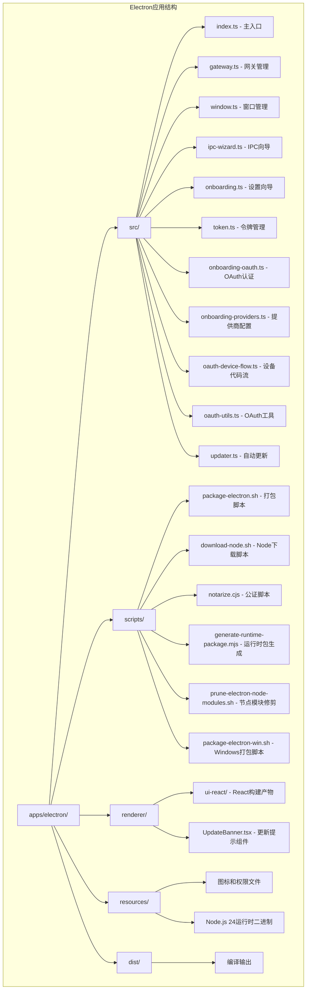

**图表来源**
- [apps/electron/package.json:1-44](file://apps/electron/package.json#L1-L44)
- [apps/electron/tsup.config.ts:1-29](file://apps/electron/tsup.config.ts#L1-L29)

**章节来源**
- [apps/electron/package.json:1-44](file://apps/electron/package.json#L1-L44)
- [apps/electron/tsup.config.ts:1-29](file://apps/electron/tsup.config.ts#L1-L29)
- [apps/electron/tsconfig.json:1-27](file://apps/electron/tsconfig.json#L1-L27)

## 核心组件

### 主进程组件

主进程是Electron应用的核心，负责管理应用生命周期、窗口创建和IPC通信。

**主要职责：**
- 应用生命周期管理
- 窗口创建和配置
- Gateway子进程管理
- IPC消息处理
- 安全策略配置
- OAuth认证流程管理
- 调试日志记录
- 单实例锁保护
- 网关崩溃监控
- **自动更新管理**：初始化和控制更新流程
- **Node.js 24运行时管理**：集成和管理Node.js 24运行时
- **Gateway重启回调管理**：处理Gateway重启进度和状态通知
- **外部链接导航管理**：安装和管理外部链接导航处理器
- **渲染器导航白名单**：构建和管理渲染器导航允许列表

### 预加载脚本

预加载脚本通过contextBridge安全地暴露API给渲染进程，实现主进程和渲染进程之间的安全通信。

**安全特性：**
- 仅暴露必要的API方法
- 隐藏Node.js内部实现细节
- 提供类型安全的接口
- 支持OAuth认证流程
- 单实例锁状态同步
- 网关崩溃状态通知
- **自动更新事件监听**：接收更新准备通知
- **Gateway重启事件监听**：接收重启进度和状态通知
- **外部链接处理**：支持安全的外部链接打开

### 网关管理器

负责启动、停止和重启本地Gateway服务，管理与Gateway的WebSocket连接。

**功能特性：**
- 自动检测和使用捆绑的Node.js 24运行时
- 支持动态端口配置
- 进程监控和错误处理
- 令牌管理和认证
- 登录shell环境缓存
- 增强的错误恢复机制
- 网关崩溃检测回调
- **Gateway重启自动处理**：实现自动重启和进度提示

### 自动更新管理器

**新增功能**：完整的自动更新系统，基于electron-updater实现。

**功能特性：**
- 静默下载新版本，避免占用带宽
- 用户确认后安装，确保可控性
- 支持预发布版本禁用
- 进度跟踪和错误处理
- IPC事件通知渲染进程
- 定时检查更新机制
- **代码签名验证**：集成签名验证和公证评估**

### 增强的React更新通知系统

**新增功能**：UpdateBanner组件支持错误状态管理和超时保护。

**功能特性：**
- 错误状态显示和管理
- 超时保护机制（5秒超时）
- 安装过程状态指示
- 用户友好的错误提示
- 自动重试机制支持

### Gateway重启状态提示功能

**新增功能**：实现Gateway崩溃时的自动重启和进度提示。

**功能特性：**
- 自动重启尝试（最多3次）
- 重启进度通知（包含尝试次数）
- 重启完成状态反馈
- 崩溃事件通知
- 手动重启支持
- 用户友好的状态提示

### OAuth认证系统

**新增功能**：全新的OAuth认证系统，支持多种认证提供商。

**支持的认证方式：**
- API密钥认证
- OAuth设备代码流程（MiniMax）
- 简单URL打开流程（OpenAI、Google、Qwen等）
- 自动令牌轮询和验证

### Node.js 24运行时管理器

**新增功能**：完整的Node.js 24运行时集成和管理。

**功能特性：**
- 自动下载和配置Node.js 24.14.1运行时
- 支持多架构（arm64、x64）运行时
- 集成到electron-builder打包流程
- 运行时依赖管理和裁剪
- 本地快速测试和生产环境区分

### Apple Store Connect API密钥处理器

**新增功能**：改进的App Store Connect API密钥处理机制。

**功能特性：**
- 支持文件路径和环境变量两种方式
- 自动转换为electron-builder兼容的变量名
- 临时文件处理和权限管理
- CI和本地开发环境支持

### 运行时依赖管理器

**新增功能**：智能的运行时依赖管理和裁剪机制。

**功能特性：**
- 核心运行时依赖的精确版本管理
- 架构特定的原生依赖裁剪
- 预安装扩展的统一管理
- 依赖版本解析和锁定

### 打包和公证管理器

**新增功能**：完整的打包和公证流程管理。

**功能特性：**
- 支持本地快速测试和生产环境打包
- 多架构（arm64、x64）支持
- 自动公证和装订流程
- 详细的打包进度和状态报告
- **代码签名验证集成**：在打包过程中验证签名和公证

### 扩展打包策略

**新增功能**：针对不同平台的扩展打包策略调整。

**功能特性：**
- Windows平台扩展临时禁用
- pdf-parse扩展优化
- 文件过滤规则改进
- 打包体积优化

### 节点模块修剪器

**新增功能**：专门的节点模块修剪脚本，用于减少Electron应用体积。

**功能特性：**
- 裁剪纯类型依赖（如@cloudflare/workers-types）
- 移除React相关依赖（react、react-dom）
- 针对macOS arm64的特殊优化
- 清理损坏的符号链接
- 支持多架构平台

### Windows打包管理器

**新增功能**：完整的Windows平台打包支持。

**功能特性：**
- 支持x64和arm64架构
- 自动koffi多平台裁剪
- 本地快速测试模式
- 完整的打包验证流程

### 外部链接导航系统

**新增功能**：完整的外部链接导航处理系统。

**功能特性：**
- 安全的外部链接拦截和处理
- 动态导航白名单管理
- 支持http/https/mailto协议
- 与系统默认浏览器集成
- 防止恶意链接加载

### 内容安全策略强化

**新增功能**：增强的内容安全策略配置。

**功能特性：**
- 允许常见HTTPS图片CDN访问
- 严格的脚本和样式策略
- Google Fonts资源白名单
- WebSocket连接安全保护

### 性能监控系统

**新增功能**：性能预算监控和回归检测。

**功能特性：**
- 基线性能对比分析
- 回归百分比限制
- 详细性能日志输出
- 自动性能回归检测

### UI向导改进

**新增功能**：增强的设置向导组件。

**功能特性：**
- AccessStep：邀请码验证和格式检查
- SecurityStep：安全协议确认和条款同意
- 实时验证反馈和状态同步
- 用户友好的交互体验

**章节来源**
- [apps/electron/src/main/index.ts:1-215](file://apps/electron/src/main/index.ts#L1-L215)
- [apps/electron/src/preload/index.ts:1-171](file://apps/electron/src/preload/index.ts#L1-L171)
- [apps/electron/src/main/gateway.ts:1-176](file://apps/electron/src/main/gateway.ts#L1-L176)
- [apps/electron/src/main/onboarding-oauth.ts:1-234](file://apps/electron/src/main/onboarding-oauth.ts#L1-L234)
- [apps/electron/src/main/updater.ts:1-97](file://apps/electron/src/main/updater.ts#L1-L97)
- [apps/electron/scripts/package-electron.sh:1-299](file://apps/electron/scripts/package-electron.sh#L1-L299)
- [apps/electron/scripts/download-node.sh:1-57](file://apps/electron/scripts/download-node.sh#L1-L57)
- [apps/electron/scripts/notarize.cjs:1-84](file://apps/electron/scripts/notarize.cjs#L1-L84)
- [apps/electron/packaged-runtime.json:1-158](file://apps/electron/packaged-runtime.json#L1-L158)
- [apps/electron/scripts/prune-electron-node-modules.sh:1-57](file://apps/electron/scripts/prune-electron-node-modules.sh#L1-L57)
- [apps/electron/scripts/package-electron-win.sh:1-160](file://apps/electron/scripts/package-electron-win.sh#L1-L160)
- [ui/src/ui/external-link.ts:1-20](file://ui/src/ui/external-link.ts#L1-L20)
- [ui/src/ui/open-external-url.ts:1-74](file://ui/src/ui/open-external-url.ts#L1-L74)
- [src/gateway/control-ui-csp.ts:1-18](file://src/gateway/control-ui-csp.ts#L1-L18)
- [ui-react/src/components/setup-wizard/steps/AccessStep.tsx:1-221](file://ui-react/src/components/setup-wizard/steps/AccessStep.tsx#L1-L221)
- [ui-react/src/components/setup-wizard/steps/SecurityStep.tsx:1-115](file://ui-react/src/components/setup-wizard/steps/SecurityStep.tsx#L1-L115)
- [scripts/test-perf-budget.mjs:98-127](file://scripts/test-perf-budget.mjs#L98-L127)

## 架构概览

该应用采用分层架构设计，实现了清晰的关注点分离：

```mermaid
graph TB
subgraph "用户界面层"
A[React渲染进程]
B[Electron窗口]
C[OAuth认证界面]
D[UpdateBanner更新提示]
E[Gateway状态覆盖层]
F[外部链接处理]
G[UI向导组件]
end
subgraph "应用逻辑层"
H[主进程]
I[预加载脚本]
J[OAuth适配器]
K[设备代码流框架]
L[单实例锁管理器]
M[静态HTTP服务器]
N[登录shell环境缓存]
O[网关崩溃检测器]
P[自动更新管理器]
Q[Node.js 24运行时管理器]
R[Apple Store Connect密钥处理器]
S[运行时依赖管理器]
T[打包和公证管理器]
U[扩展打包策略]
V[Gateway重启管理器]
W[节点模块修剪器]
X[Windows打包管理器]
Y[外部链接导航系统]
Z[内容安全策略管理]
AA[性能监控系统]
BB[UI向导组件]
end
subgraph "服务层"
CC[Gateway子进程]
DD[Node.js 24运行时]
EE[本地HTTP服务器]
FF[OAuth认证服务]
GG[文件锁服务]
HH[环境变量服务]
II[崩溃监控服务]
JJ[更新服务器]
KK[R2存储服务]
LL[App Store Connect API]
MM[代码签名验证]
NN[koffi多平台裁剪]
OO[pdf-parse版本优化]
PP[Windows打包支持]
QQ[本地快速测试]
RR[外部链接安全处理]
SS[CDN资源访问控制]
TT[性能预算监控]
UU[向导验证反馈]
end
subgraph "系统集成层"
VV[Electron框架]
WW[React框架]
XX[WebSocket库]
YY[文件系统API]
ZZ[网络API]
AAA[Cloudflare R2存储]
BBB[Apple开发者服务]
CCC[GitHub Actions]
DDD[Windows平台支持]
EEE[Gatekeeper评估]
FFF[深度签名链验证]
GGG[代码签名验证]
HHH[依赖版本解析]
III[构建配置优化]
JJJ[智能运行时管理]
KKK[打包验证流程]
LLL[智能节点模块修剪]
MMM[Windows打包工具]
NNN[外部链接导航]
OOO[内容安全策略]
PPP[性能监控]
QQQ[向导组件]
end
A --> I
B --> H
C --> J
D --> P
E --> V
F --> Y
G --> BB
H --> CC
I --> VV
J --> YY
K --> YY
L --> XX
M --> YY
N --> HH
O --> II
P --> JJ
Q --> DD
R --> LL
S --> DD
T --> BBB
U --> DDD
V --> MM
W --> NN
X --> OO
Y --> RR
Z --> SS
AA --> TT
BB --> UU
CC --> DD
CC --> EE
DD --> YY
EE --> YY
FF --> YY
GG --> YY
HH --> YY
II --> YY
JJ --> AAA
KK --> AAA
LL --> BBB
MM --> EEE
MM --> FFF
MM --> GGG
NN --> HHH
OO --> III
PP --> JJJ
QQ --> KKK
RR --> LLL
SS --> MMM
TT --> NNN
UU --> OOO
VV --> PPP
WW --> QQQ
XX --> PPP
YY --> PPP
ZZ --> PPP
AAA --> PPP
BBB --> PPP
CCC --> PPP
DDD --> PPP
EEE --> PPP
FFF --> PPP
GGG --> PPP
HHH --> PPP
III --> PPP
JJJ --> PPP
KKK --> PPP
LLL --> PPP
MMM --> PPP
NNN --> PPP
OOO --> PPP
PPP --> PPP
QQQ --> PPP
```

**图表来源**
- [apps/electron/src/main/index.ts:157-209](file://apps/electron/src/main/index.ts#L157-L209)
- [apps/electron/src/main/window.ts:124-148](file://apps/electron/src/main/window.ts#L124-L148)
- [apps/electron/src/main/gateway.ts:100-151](file://apps/electron/src/main/gateway.ts#L100-L151)
- [apps/electron/src/main/onboarding-oauth.ts:262-291](file://apps/electron/src/main/onboarding-oauth.ts#L262-L291)
- [apps/electron/src/main/updater.ts:38-76](file://apps/electron/src/main/updater.ts#L38-L76)

### 数据流架构

应用的数据流遵循单向数据流原则，确保状态的一致性和可预测性：

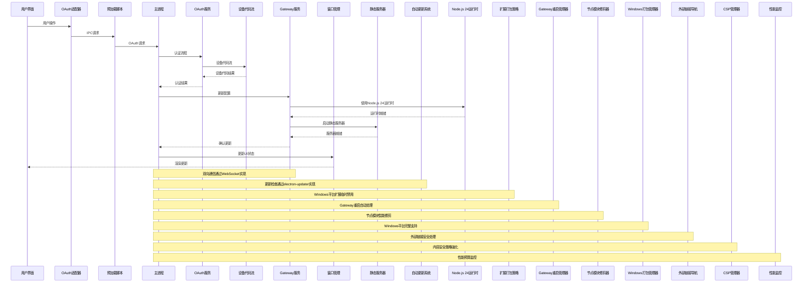

**图表来源**
- [apps/electron/src/preload/index.ts:11-39](file://apps/electron/src/preload/index.ts#L11-L39)
- [apps/electron/src/main/ipc-wizard.ts:192-228](file://apps/electron/src/main/ipc-wizard.ts#L192-L228)
- [apps/electron/src/main/gateway.ts:100-151](file://apps/electron/src/main/gateway.ts#L100-L151)
- [apps/electron/src/main/onboarding-oauth.ts:262-339](file://apps/electron/src/main/onboarding-oauth.ts#L262-L339)
- [apps/electron/src/main/updater.ts:82-87](file://apps/electron/src/main/updater.ts#L82-L87)

## 详细组件分析

### 主入口组件 (index.ts)

主入口文件是整个应用的协调中心，负责初始化各个组件并建立它们之间的联系。

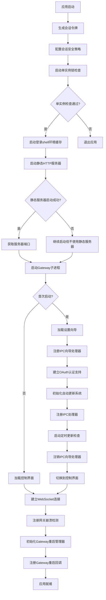

**图表来源**
- [apps/electron/src/main/index.ts:157-209](file://apps/electron/src/main/index.ts#L157-L209)
- [apps/electron/src/main/onboarding.ts:23-59](file://apps/electron/src/main/onboarding.ts#L23-L59)
- [apps/electron/src/main/updater.ts:24-36](file://apps/electron/src/main/updater.ts#L24-L36)

**章节来源**
- [apps/electron/src/main/index.ts:1-215](file://apps/electron/src/main/index.ts#L1-L215)

### 增强的窗口管理系统

窗口管理系统经过重大增强，新增了全面的错误处理和日志记录功能。

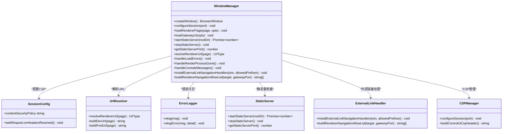

**图表来源**
- [apps/electron/src/main/window.ts:5-148](file://apps/electron/src/main/window.ts#L5-L148)
- [apps/electron/src/main/window.ts:99-136](file://apps/electron/src/main/window.ts#L99-L136)
- [apps/electron/src/main/window.ts:166-192](file://apps/electron/src/main/window.ts#L166-L192)
- [apps/electron/src/main/window.ts:216-234](file://apps/electron/src/main/window.ts#L216-L234)

**章节来源**
- [apps/electron/src/main/window.ts:1-226](file://apps/electron/src/main/window.ts#L1-L226)

### Gateway服务管理

Gateway服务管理器负责启动、监控和控制本地Gateway进程。

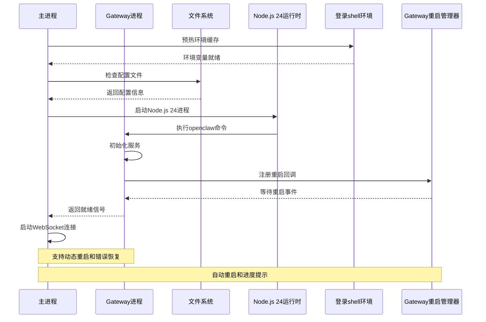

**图表来源**
- [apps/electron/src/main/gateway.ts:100-151](file://apps/electron/src/main/gateway.ts#L100-L151)
- [apps/electron/src/main/gateway.ts:166-171](file://apps/electron/src/main/gateway.ts#L166-L171)

**章节来源**
- [apps/electron/src/main/gateway.ts:1-176](file://apps/electron/src/main/gateway.ts#L1-L176)

### IPC向导系统

IPC向导系统实现了设置向导的完整生命周期管理，包括握手协议和RPC通信。

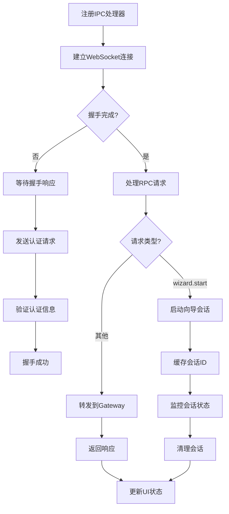

**图表来源**
- [apps/electron/src/main/ipc-wizard.ts:187-229](file://apps/electron/src/main/ipc-wizard.ts#L187-L229)
- [apps/electron/src/main/ipc-wizard.ts:126-175](file://apps/electron/src/main/ipc-wizard.ts#L126-L175)

**章节来源**
- [apps/electron/src/main/ipc-wizard.ts:1-243](file://apps/electron/src/main/ipc-wizard.ts#L1-L243)

### 安全令牌管理

令牌管理系统负责生成和管理会话令牌，确保每次启动都有唯一的身份标识。

**安全特性：**
- 使用加密安全的随机数生成器
- 令牌仅存在于内存中
- 每次启动自动生成新令牌
- 支持从配置文件复用现有令牌

**章节来源**
- [apps/electron/src/main/token.ts:1-10](file://apps/electron/src/main/token.ts#L1-L10)
- [apps/electron/src/main/onboarding.ts:57-76](file://apps/electron/src/main/onboarding.ts#L57-L76)

### 外部链接导航系统

**新增功能**：完整的外部链接导航处理系统，提供安全的外部链接拦截和处理。

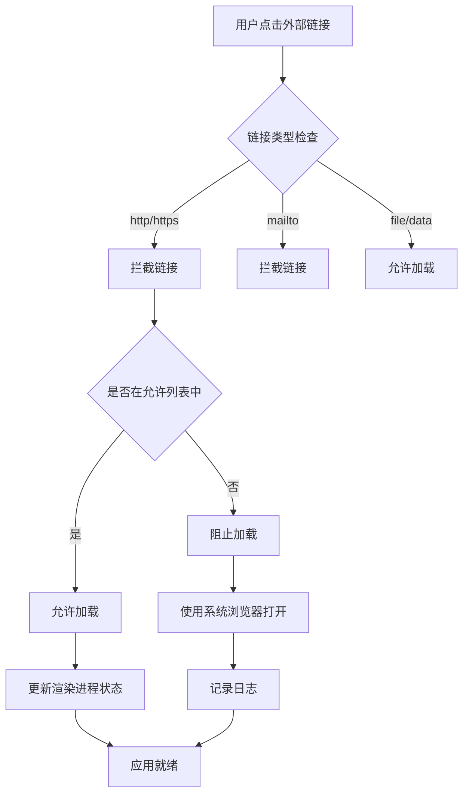

**图表来源**
- [apps/electron/src/main/window.ts:99-117](file://apps/electron/src/main/window.ts#L99-L117)
- [apps/electron/src/main/window.ts:166-192](file://apps/electron/src/main/window.ts#L166-L192)

**章节来源**
- [apps/electron/src/main/window.ts:99-117](file://apps/electron/src/main/window.ts#L99-L117)
- [apps/electron/src/main/window.ts:166-192](file://apps/electron/src/main/window.ts#L166-L192)

### 内容安全策略强化

**新增功能**：增强的内容安全策略配置，允许常见的HTTPS图片CDN访问。

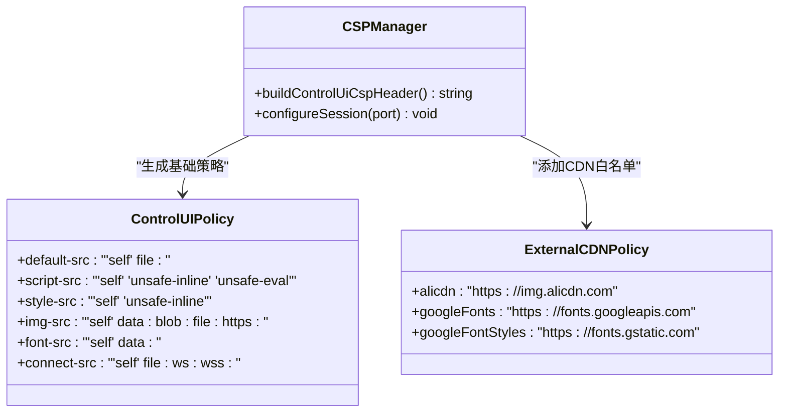

**图表来源**
- [src/gateway/control-ui-csp.ts:1-18](file://src/gateway/control-ui-csp.ts#L1-L18)
- [apps/electron/src/main/window.ts:216-234](file://apps/electron/src/main/window.ts#L216-L234)

**章节来源**
- [src/gateway/control-ui-csp.ts:1-18](file://src/gateway/control-ui-csp.ts#L1-L18)
- [apps/electron/src/main/window.ts:216-234](file://apps/electron/src/main/window.ts#L216-L234)

### 性能监控系统

**新增功能**：性能预算监控和回归检测系统。

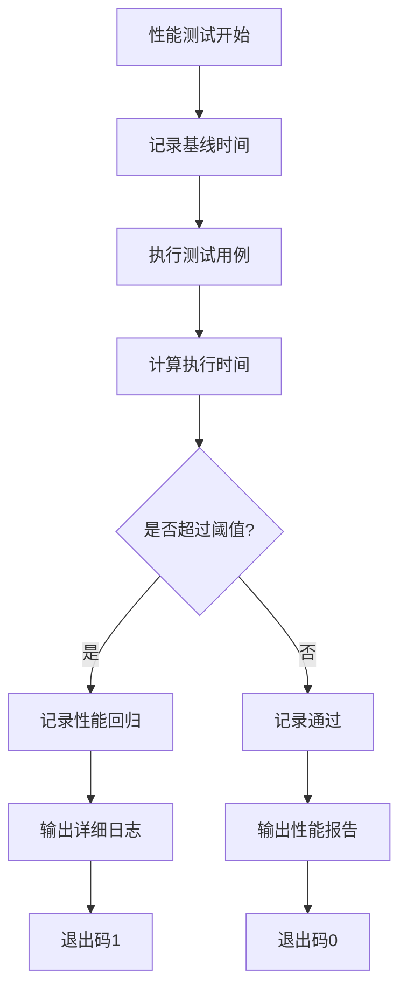

**图表来源**
- [scripts/test-perf-budget.mjs:98-127](file://scripts/test-perf-budget.mjs#L98-L127)

**章节来源**
- [scripts/test-perf-budget.mjs:98-127](file://scripts/test-perf-budget.mjs#L98-L127)

### UI向导改进

**新增功能**：增强的设置向导组件，提供更好的用户验证反馈。

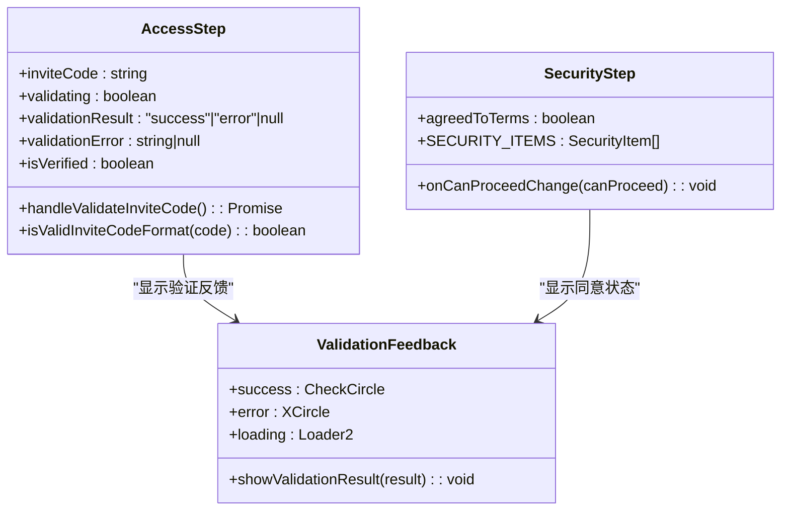

**图表来源**
- [ui-react/src/components/setup-wizard/steps/AccessStep.tsx:22-79](file://ui-react/src/components/setup-wizard/steps/AccessStep.tsx#L22-L79)
- [ui-react/src/components/setup-wizard/steps/SecurityStep.tsx:27-38](file://ui-react/src/components/setup-wizard/steps/SecurityStep.tsx#L27-L38)

**章节来源**
- [ui-react/src/components/setup-wizard/steps/AccessStep.tsx:1-221](file://ui-react/src/components/setup-wizard/steps/AccessStep.tsx#L1-L221)
- [ui-react/src/components/setup-wizard/steps/SecurityStep.tsx:1-115](file://ui-react/src/components/setup-wizard/steps/SecurityStep.tsx#L1-L115)

## 自动更新验证系统

**新增功能**：完整的自动更新验证系统，集成代码签名验证、深度签名链验证和Gatekeeper评估。

### 自动更新验证架构

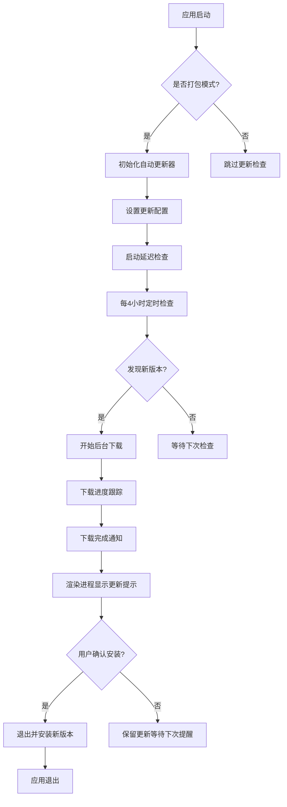

**图表来源**
- [apps/electron/src/main/updater.ts:24-36](file://apps/electron/src/main/updater.ts#L24-L36)
- [apps/electron/src/main/updater.ts:82-87](file://apps/electron/src/main/updater.ts#L82-L87)
- [apps/electron/src/main/updater.ts:62-69](file://apps/electron/src/main/updater.ts#L62-L69)

### 代码签名验证集成

**新增功能**：在打包过程中集成代码签名验证和公证评估。

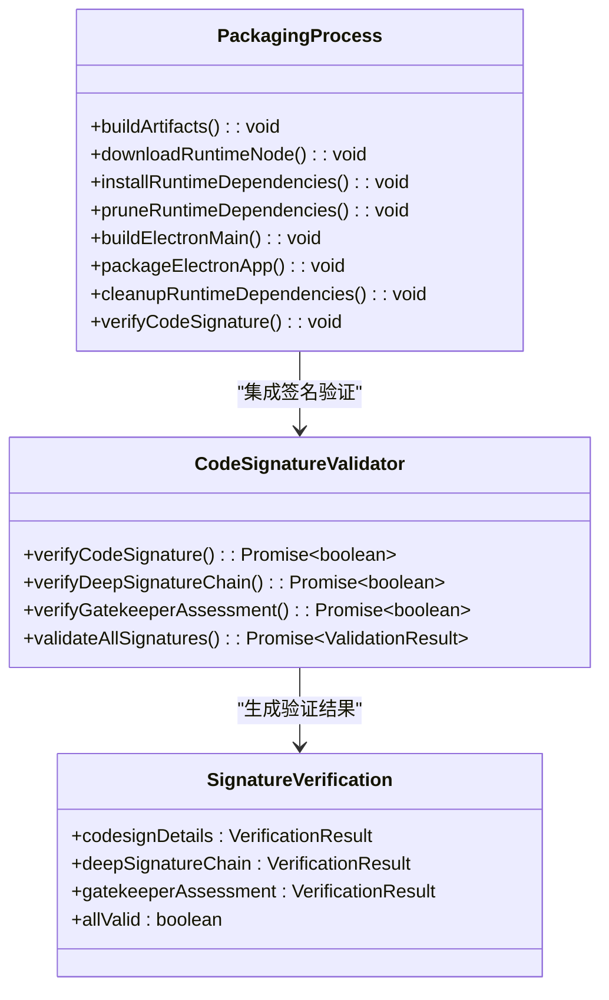

**图表来源**
- [apps/electron/scripts/package-electron.sh:221-296](file://apps/electron/scripts/package-electron.sh#L221-L296)

**章节来源**
- [apps/electron/src/main/updater.ts:1-97](file://apps/electron/src/main/updater.ts#L1-L97)
- [apps/electron/scripts/package-electron.sh:221-296](file://apps/electron/scripts/package-electron.sh#L221-L296)

### 更新服务器配置

自动更新系统配置Cloudflare R2作为更新服务器：

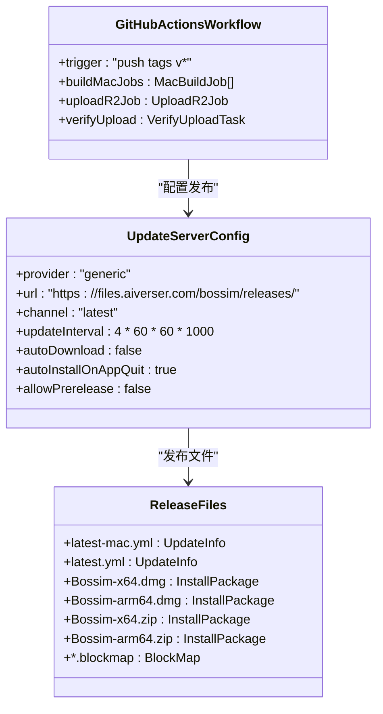

**图表来源**
- [apps/electron/electron-builder.yml:241-244](file://apps/electron/electron-builder.yml#L241-L244)
- [.github/workflows/electron-release.yml:83-150](file://.github/workflows/electron-release.yml#L83-L150)

**章节来源**
- [apps/electron/electron-builder.yml:238-245](file://apps/electron/electron-builder.yml#L238-L245)
- [.github/workflows/electron-release.yml:1-150](file://.github/workflows/electron-release.yml#L1-L150)

### IPC通信机制

自动更新系统通过IPC实现主进程和渲染进程的通信：

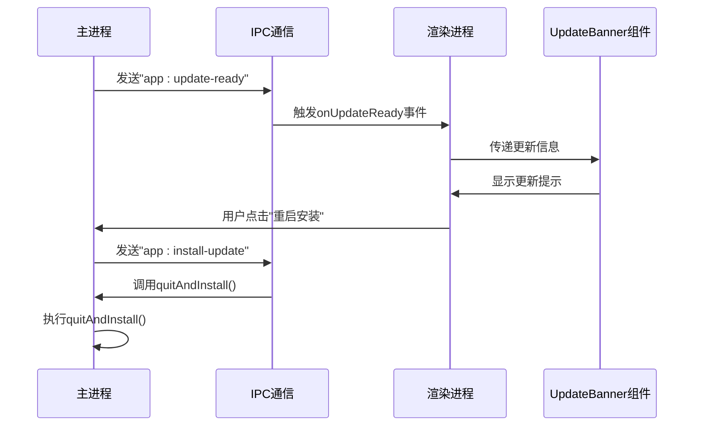

**图表来源**
- [apps/electron/src/main/updater.ts:62-69](file://apps/electron/src/main/updater.ts#L62-L69)
- [apps/electron/src/preload/index.ts:155-169](file://apps/electron/src/preload/index.ts#L155-L169)
- [ui-react/src/components/layout/UpdateBanner.tsx:38-49](file://ui-react/src/components/layout/UpdateBanner.tsx#L38-L49)

**章节来源**
- [apps/electron/src/preload/index.ts:149-170](file://apps/electron/src/preload/index.ts#L149-L170)
- [apps/electron/src/main/updater.ts:93-96](file://apps/electron/src/main/updater.ts#L93-L96)

## 增强的React更新通知系统

**新增功能**：UpdateBanner组件支持错误状态管理和超时保护，提供更可靠的更新体验。

### UpdateBanner组件架构

```mermaid
flowchart TD
A[组件挂载] --> B[检查Electron桥接]
B --> C{桥接可用?}
C --> |是| D[注册更新监听]
C --> |否| E[返回null]
D --> F{有更新信息?}
F --> |否| G[等待更新通知]
F --> |是| H[显示更新提示]
H --> I{用户点击安装?}
I --> |是| J[设置安装中状态]
J --> K[设置错误状态为空]
K --> L[创建超时Promise(5秒)]
L --> M[创建安装Promise]
M --> N[Promise.race竞争]
N --> O{哪个先完成?}
O --> |安装完成| P[清除安装状态]
O --> |超时| Q[设置错误状态]
Q --> R[显示错误信息]
P --> S[组件卸载清理]
R --> S
```

**图表来源**
- [ui-react/src/components/layout/UpdateBanner.tsx:16-35](file://ui-react/src/components/layout/UpdateBanner.tsx#L16-L35)
- [ui-react/src/components/layout/UpdateBanner.tsx:39-61](file://ui-react/src/components/layout/UpdateBanner.tsx#L39-L61)

### 错误状态管理

**新增功能**：UpdateBanner组件支持错误状态管理和超时保护。

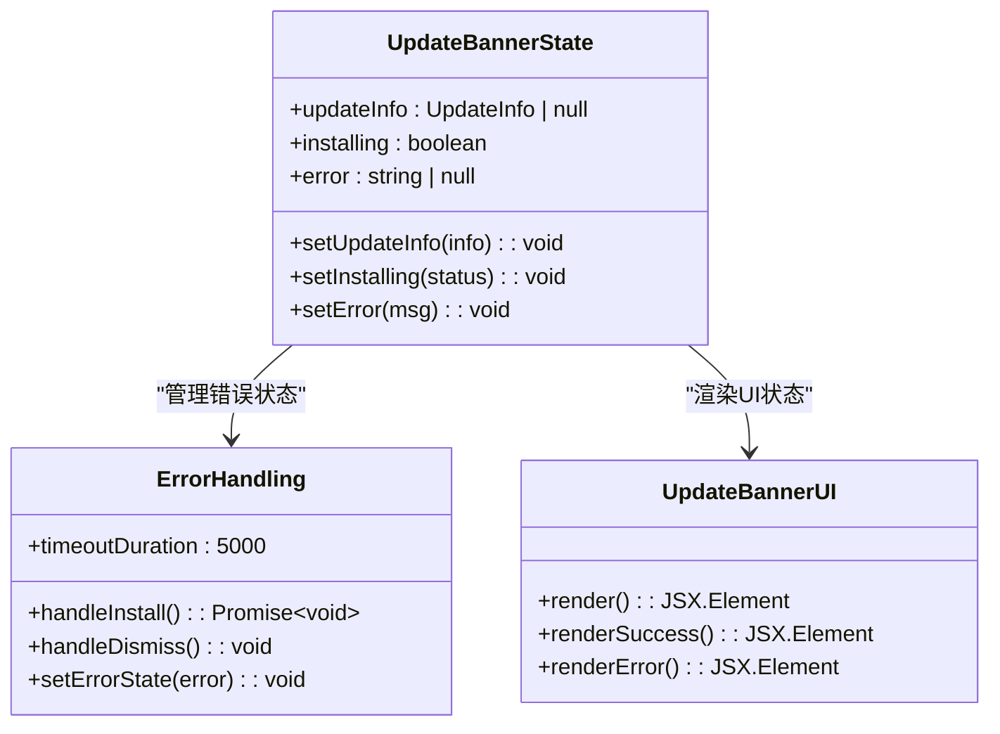

**图表来源**
- [ui-react/src/components/layout/UpdateBanner.tsx:16-35](file://ui-react/src/components/layout/UpdateBanner.tsx#L16-L35)
- [ui-react/src/components/layout/UpdateBanner.tsx:39-61](file://ui-react/src/components/layout/UpdateBanner.tsx#L39-L61)

**章节来源**
- [ui-react/src/components/layout/UpdateBanner.tsx:1-121](file://ui-react/src/components/layout/UpdateBanner.tsx#L1-L121)

### 超时保护机制

**新增功能**：UpdateBanner组件实现5秒超时保护机制，防止安装过程卡死。

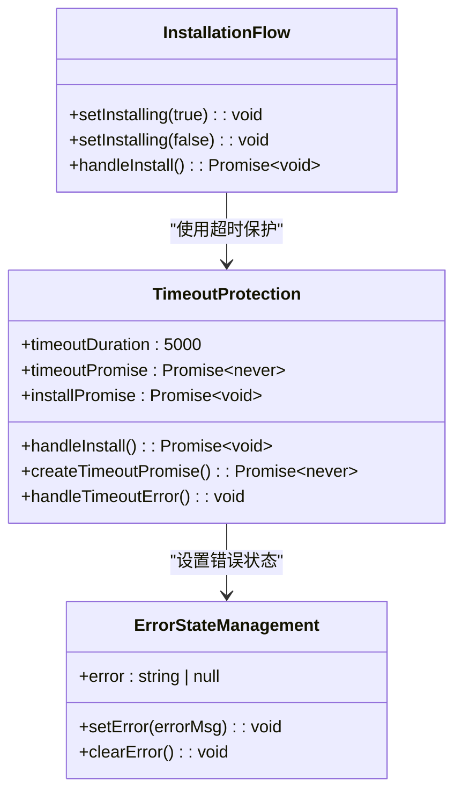

**图表来源**
- [ui-react/src/components/layout/UpdateBanner.tsx:39-61](file://ui-react/src/components/layout/UpdateBanner.tsx#L39-L61)

**章节来源**
- [ui-react/src/components/layout/UpdateBanner.tsx:1-121](file://ui-react/src/components/layout/UpdateBanner.tsx#L1-L121)

### 用户友好的错误提示

**新增功能**：UpdateBanner组件提供用户友好的错误提示和重试机制。

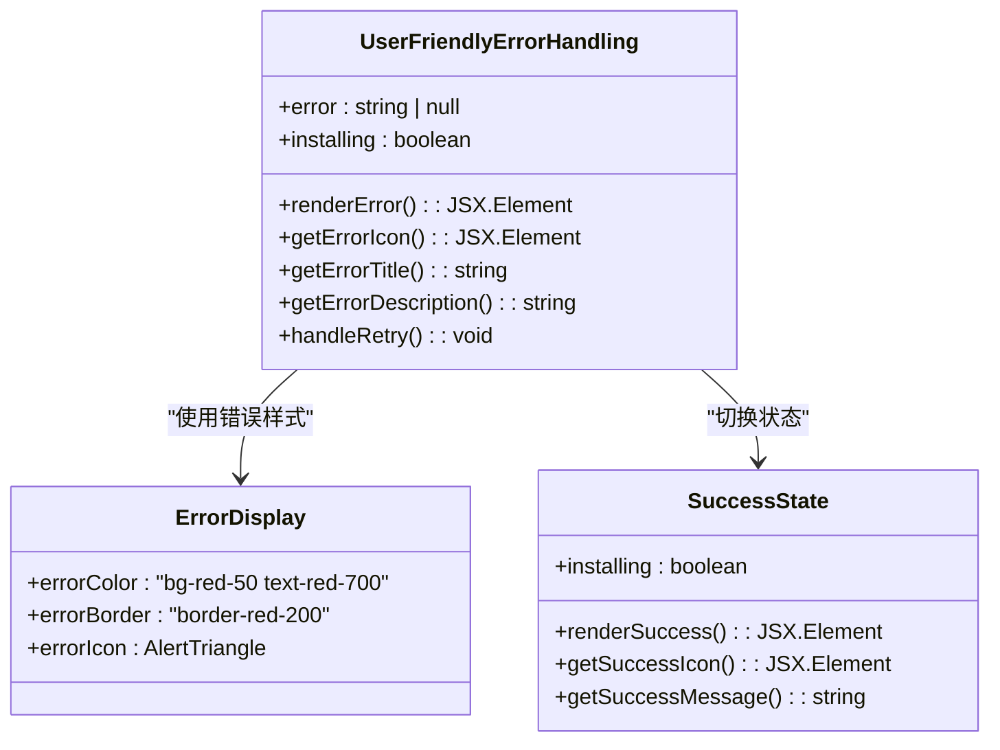

**图表来源**
- [ui-react/src/components/layout/UpdateBanner.tsx:63-121](file://ui-react/src/components/layout/UpdateBanner.tsx#L63-L121)

**章节来源**
- [ui-react/src/components/layout/UpdateBanner.tsx:1-121](file://ui-react/src/components/layout/UpdateBanner.tsx#L1-L121)

## Gateway重启状态提示功能

**新增功能**：实现Gateway崩溃时的自动重启和进度提示，改善用户体验。

### Gateway重启管理架构

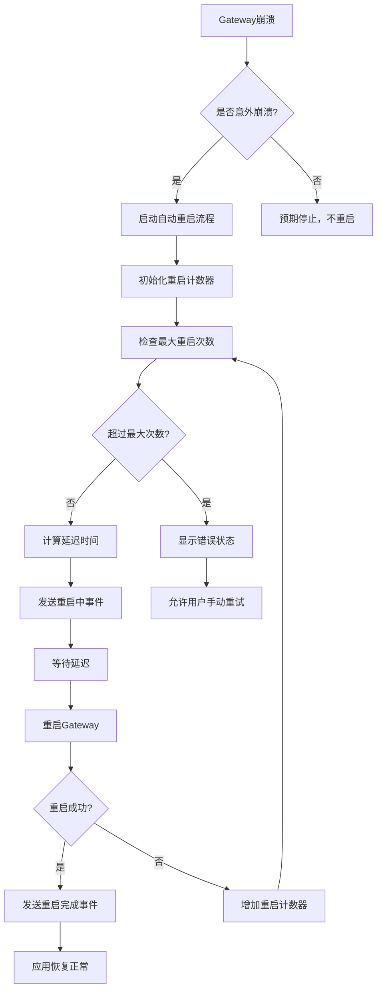

**图表来源**
- [apps/electron/src/main/gateway.ts:90-103](file://apps/electron/src/main/gateway.ts#L90-L103)
- [apps/electron/src/main/gateway.ts:420-430](file://apps/electron/src/main/gateway.ts#L420-L430)

### Gateway重启回调机制

**新增功能**：通过IPC事件向渲染进程发送重启进度和状态信息。

```mermaid
classDiagram
class GatewayRestartManager {
+autoRestartAttempts : number
+maxAutoRestartAttempts : number
+autoRestartDelayMS : number
+handleGatewayCrashWithAutoRestart(code, signal) : void
+sendRestartProgress(attempt, maxAttempts) : void
+sendRestartComplete(success, error?) : void
}
class IPCEventHandler {
+onGatewayRestarting(callback) : void
+onGatewayRestarted(callback) : void
+onGatewayCrashed(callback) : void
}
class UIIntegration {
+GatewayStatusContext : Context
+GatewayStatusOverlay : Component
+handleRestartProgress(data) : void
+handleRestartComplete(data) : void
}
GatewayRestartManager --> IPCEventHandler : "发送IPC事件"
GatewayRestartManager --> UIIntegration : "更新UI状态"
```

**图表来源**
- [apps/electron/src/main/gateway.ts:90-103](file://apps/electron/src/main/gateway.ts#L90-L103)
- [apps/electron/src/preload/index.ts:62-97](file://apps/electron/src/preload/index.ts#L62-L97)

**章节来源**
- [apps/electron/src/main/gateway.ts:1-176](file://apps/electron/src/main/gateway.ts#L1-L176)
- [apps/electron/src/preload/index.ts:60-171](file://apps/electron/src/preload/index.ts#L60-L171)

### Gateway重启状态提示实现

**新增功能**：Gateway状态覆盖层组件提供直观的重启状态提示。

```mermaid
classDiagram
class GatewayStatusContext {
+status : GatewayStatus
+countdown : number
+setMaxCountdown(seconds) : void
+setStatus(status) : void
}
class GatewayStatusOverlay {
+render() : JSX.Element
+renderRestarting() : JSX.Element
+renderCrashed() : JSX.Element
+renderError() : JSX.Element
}
class GatewayStatus {
+idle : "idle"
+restarting : "restarting"
+crashed : "crashed"
+error : "error"
}
GatewayStatusContext --> GatewayStatusOverlay : "提供状态数据"
```

**图表来源**
- [ui-react/docs/GATEWAY_RESTART_IMPLEMENTATION.md:105-123](file://ui-react/docs/GATEWAY_RESTART_IMPLEMENTATION.md#L105-L123)

**章节来源**
- [ui-react/docs/GATEWAY_RESTART_IMPLEMENTATION.md:1-176](file://ui-react/docs/GATEWAY_RESTART_IMPLEMENTATION.md#L1-L176)

## GitHub Actions自动化发布

**新增功能**：完整的CI/CD发布流程，基于GitHub Actions和Cloudflare R2实现自动化发布。

### 发布工作流架构

```mermaid
flowchart TD
A[推送vX.Y.Z标签] --> B[触发GitHub Actions]
B --> C[设置Node.js 24环境]
C --> D[构建macOS应用]
D --> E[导入签名证书]
E --> F[打包DMG和ZIP]
F --> G[上传构建产物]
G --> H[下载所有产物]
H --> I[配置Cloudflare R2]
I --> J[上传安装包]
J --> K[上传描述文件]
K --> L[验证文件可访问]
L --> M[执行签名验证]
M --> N[验证Gatekeeper公证]
N --> O[发布完成]
```

**图表来源**
- [.github/workflows/electron-release.yml:4-7](file://.github/workflows/electron-release.yml#L4-L7)
- [.github/workflows/electron-release.yml:58-70](file://.github/workflows/electron-release.yml#L58-L70)
- [.github/workflows/electron-release.yml:118-141](file://.github/workflows/electron-release.yml#L118-L141)

### 构建和签名流程

发布工作流包含完整的构建、签名和发布流程：

```mermaid
classDiagram
class BuildJob {
+name : "build-mac"
+runsOn : "macos-latest"
+strategy : MatrixStrategy
+steps : Step[]
}
class MacBuildStep {
+name : "Build & Package (macOS)"
+env : BuildEnv
+run : BashCommand
}
class SignCertificate {
+name : "Import signing certificate"
+env : CertificateEnv
+run : SecurityCommands
}
class UploadArtifacts {
+name : "Upload macOS artifacts"
+uses : "actions/upload-artifact"
+with : UploadConfig
}
class UploadR2Job {
+name : "upload-r2"
+needs : "build-mac"
+steps : R2Steps[]
}
class R2UploadStep {
+name : "Upload release files to R2"
+env : R2Env
+run : RcloneCommands
}
class VerifyUpload {
+name : "Verify upload"
+run : CurlCommand
}
class CodeSignatureVerification {
+name : "Verify code signature"
+run : CodeSignVerification
}
BuildJob --> MacBuildStep : "包含步骤"
BuildJob --> SignCertificate : "包含步骤"
BuildJob --> UploadArtifacts : "包含步骤"
UploadR2Job --> R2UploadStep : "包含步骤"
UploadR2Job --> VerifyUpload : "包含步骤"
UploadR2Job --> CodeSignatureVerification : "包含步骤"
```

**图表来源**
- [.github/workflows/electron-release.yml:18-82](file://.github/workflows/electron-release.yml#L18-L82)
- [.github/workflows/electron-release.yml:84-150](file://.github/workflows/electron-release.yml#L84-L150)

**章节来源**
- [.github/workflows/electron-release.yml:1-150](file://.github/workflows/electron-release.yml#L1-L150)

### Cloudflare R2存储配置

发布流程使用Cloudflare R2作为存储后端：

```mermaid
classDiagram
class R2Config {
+type : "s3"
+provider : "Cloudflare"
+access_key_id : "${R2_ACCESS_KEY_ID}"
+secret_access_key : "${R2_SECRET_ACCESS_KEY}"
+endpoint : "${R2_ENDPOINT}"
+acl : "private"
}
class UploadPaths {
+installers : "*.dmg, *.zip, *.blockmap"
+metadata : "*.yml"
+destination : "r2 : bucket-name/bossim/releases"
}
class RcloneCommands {
+copyInstallers : "rclone copy artifacts/ DEST --include '*.dmg' --include '*.zip' --include '*.blockmap'"
+copyMetadata : "rclone copy artifacts/ DEST --include '*.yml'"
+noUpdateModtime : "--no-update-modtime"
}
R2Config --> UploadPaths : "配置上传路径"
UploadPaths --> RcloneCommands : "生成命令"
```

**图表来源**
- [.github/workflows/electron-release.yml:108-116](file://.github/workflows/electron-release.yml#L108-L116)
- [.github/workflows/electron-release.yml:127-141](file://.github/workflows/electron-release.yml#L127-L141)

**章节来源**
- [.github/workflows/electron-release.yml:83-150](file://.github/workflows/electron-release.yml#L83-L150)

## OAuth认证系统

**新增功能**：全新的OAuth认证系统，支持多种认证提供商。

### OAuth认证架构

```mermaid
flowchart TD
A[用户选择认证方式] --> B{认证类型?}
B --> |API密钥| C[直接输入密钥]
B --> |OAuth设备代码| D[设备代码流程]
B --> |简单OAuth| E[URL打开流程]
D --> F[设备代码流运行器]
F --> G[获取user_code]
G --> H[打开验证URL]
H --> I[pollDeviceCodeFlow]
I --> J[轮询令牌]
J --> K[保存认证信息]
E --> L[生成CSRF状态]
L --> M[打开浏览器]
M --> N[处理回调]
N --> J
C --> K
K --> O[更新Gateway配置]
O --> P[重启Gateway服务]
```

**图表来源**
- [apps/electron/src/main/onboarding-oauth.ts:6-13](file://apps/electron/src/main/onboarding-oauth.ts#L6-L13)
- [apps/electron/src/main/onboarding-oauth.ts:104-185](file://apps/electron/src/main/onboarding-oauth.ts#L104-L185)
- [apps/electron/src/main/onboarding-oauth.ts:262-339](file://apps/electron/src/main/onboarding-oauth.ts#L262-L339)

### OAuth适配器

**新增功能**：ElectronWizardAdapter支持OAuth认证流程。

```mermaid
classDiagram
class ElectronWizardAdapter {
+sessionId : string
+onComplete : Function
+getConfig : Function
+complete() Promise~void~
+validateApiKey() Promise
+startOAuth() Promise
+pollOAuth() Promise
+cancelOAuth() Promise
+submitStep() Promise
+getInitialState() Promise
-private finalizeOnboarding() Promise
-private log() void
}
class OAuthFlow {
+oauthStart() Promise
+oauthPoll() Promise
+oauthCancel() Promise
}
ElectronWizardAdapter --> OAuthFlow : "委托OAuth处理"
```

**图表来源**
- [ui-react/src/adapters/ElectronWizardAdapter.ts:26-185](file://ui-react/src/adapters/ElectronWizardAdapter.ts#L26-L185)

**章节来源**
- [ui-react/src/adapters/ElectronWizardAdapter.ts:1-185](file://ui-react/src/adapters/ElectronWizardAdapter.ts#L1-L185)
- [apps/electron/src/main/onboarding-oauth.ts:1-234](file://apps/electron/src/main/onboarding-oauth.ts#L1-L234)
- [apps/electron/src/main/onboarding-providers.ts:1-253](file://apps/electron/src/main/onboarding-providers.ts#L1-L253)

### OAuth提供商支持

**支持的OAuth提供商：**
- **MiniMax**：全球版和中国版设备代码流程
- **OpenAI**：Codex OAuth设备代码流程
- **Google**：Gemini CLI OAuth
- **Qwen**：通义千问门户OAuth
- **GitHub**：Copilot设备代码流程
- **Chutes**：Chutes OAuth

**章节来源**
- [apps/electron/src/main/onboarding-providers.ts:72-81](file://apps/electron/src/main/onboarding-providers.ts#L72-L81)
- [apps/electron/src/main/onboarding-oauth.ts:77-91](file://apps/electron/src/main/onboarding-oauth.ts#L77-L91)

## 设备代码流框架

**新增功能**：全新的设备代码流框架，支持标准的OAuth 2.0设备代码流程。

### 设备代码流架构

```mermaid
flowchart TD
A[startDeviceCodeFlow] --> B[生成PKCE参数]
B --> C[构造设备代码请求]
C --> D[发送POST到codeEndpoint]
D --> E[解析设备代码响应]
E --> F[验证state回显]
F --> G[打开浏览器访问验证URL]
G --> H[pollDeviceCodeFlow]
H --> I[轮询tokenEndpoint]
I --> J{状态检查}
J --> |success| K[返回访问令牌]
J --> |pending| L[继续轮询]
J --> |error| M[返回错误]
J --> |timeout| N[返回超时]
```

**图表来源**
- [apps/electron/src/main/oauth-device-flow.ts:94-182](file://apps/electron/src/main/oauth-device-flow.ts#L94-L182)
- [apps/electron/src/main/oauth-device-flow.ts:184-258](file://apps/electron/src/main/oauth-device-flow.ts#L184-L258)

### 设备代码流配置

设备代码流框架通过配置对象实现供应商特定逻辑：

```mermaid
classDiagram
class DeviceCodeFlowConfig {
+name : string
+codeEndpoint : string
+tokenEndpoint : string
+clientId : string
+scope : string
+grantType : string
+usePKCE : boolean
+extraCodeHeaders() : Record
+parseCodeResponse(raw) : CodeResponse
+parseTokenResponse(raw) : TokenResponse
}
class MiniMaxGlobalFlow {
+name : "MiniMax Global"
+codeEndpoint : "https : //api.minimax.io/oauth/code"
+tokenEndpoint : "https : //api.minimax.io/oauth/token"
+clientId : "78257093-7e40-4613-99e0-527b14b39113"
+scope : "group_id profile model.completion"
+grantType : "urn : ietf : params : oauth : grant-type : user_code"
+usePKCE : true
}
class MiniMaxCNFlow {
+name : "MiniMax CN"
+codeEndpoint : "https : //api.minimaxi.com/oauth/code"
+tokenEndpoint : "https : //api.minimaxi.com/oauth/token"
}
DeviceCodeFlowConfig <|-- MiniMaxGlobalFlow
DeviceCodeFlowConfig <|-- MiniMaxCNFlow
```

**图表来源**
- [apps/electron/src/main/oauth-device-flow.ts:20-58](file://apps/electron/src/main/oauth-device-flow.ts#L20-L58)
- [apps/electron/src/main/oauth-device-flow.ts:262-329](file://apps/electron/src/main/oauth-device-flow.ts#L262-L329)

**章节来源**
- [apps/electron/src/main/oauth-device-flow.ts:1-329](file://apps/electron/src/main/oauth-device-flow.ts#L1-L329)

### OAuth工具函数

**新增功能**：OAuth工具函数提供PKCE和表单编码支持。

```mermaid
classDiagram
class OAuthUtils {
+generatePkce() : {verifier, challenge, state}
+toFormUrlEncoded(params) : string
}
class PKCEGenerator {
+verifier : string
+challenge : string
+state : string
}
OAuthUtils --> PKCEGenerator : "生成PKCE参数"
```

**图表来源**
- [apps/electron/src/main/oauth-utils.ts:19-24](file://apps/electron/src/main/oauth-utils.ts#L19-L24)

**章节来源**
- [apps/electron/src/main/oauth-utils.ts:1-34](file://apps/electron/src/main/oauth-utils.ts#L1-L34)

## 单实例锁机制

**新增功能**：基于文件锁的单实例保护机制，防止多个实例同时运行。

### 单实例锁架构

```mermaid
flowchart TD
A[应用启动] --> B[尝试获取文件锁]
B --> C{锁获取成功?}
C --> |是| D[继续应用初始化]
C --> |否| E[显示错误并退出]
D --> F[创建锁文件]
F --> G[注册锁清理处理器]
G --> H[应用正常运行]
H --> I[应用关闭]
I --> J[释放文件锁]
J --> K[删除锁文件]
```

**图表来源**
- [apps/electron/src/main/index.ts:157-209](file://apps/electron/src/main/index.ts#L157-L209)

### 文件锁实现

单实例锁机制通过文件系统实现跨平台保护：

```mermaid
classDiagram
class FileLock {
+lockPath : string
+lockFile : FileHandle
+acquire() : Promise~boolean~
+release() : Promise~void~
+isLocked() : boolean
}
class SingleInstanceGuard {
+lock : FileLock
+checkInstance() : Promise~boolean~
+cleanup() : Promise~void~
}
SingleInstanceGuard --> FileLock : "使用文件锁"
```

**图表来源**
- [apps/electron/src/main/index.ts:157-209](file://apps/electron/src/main/index.ts#L157-L209)

**章节来源**
- [apps/electron/src/main/index.ts:1-215](file://apps/electron/src/main/index.ts#L1-L215)

## URL方案注册改进

**新增功能**：增强的URL协议处理和回调机制，支持openclaw://协议。

### URL协议处理架构

```mermaid
flowchart TD
A[用户点击OAuth链接] --> B[系统调用openclaw://协议]
B --> C[Electron接收URL事件]
C --> D{URL格式验证}
D --> |有效| E[解析查询参数]
D --> |无效| F[忽略并记录警告]
E --> G{认证方法检查}
G --> |存在| H[验证CSRF状态]
G --> |不存在| I[记录错误]
H --> |通过| J[存储回调结果]
H --> |失败| K[标记CSRF攻击]
I --> L[清理会话状态]
J --> M[触发轮询检查]
K --> M
M --> N[返回认证状态]
```

**图表来源**
- [apps/electron/src/main/onboarding-oauth.ts:78-137](file://apps/electron/src/main/onboarding-oauth.ts#L78-L137)

### 协议回调管理

**新增功能**：专门的协议回调处理器管理OAuth回调：

```mermaid
classDiagram
class OAuthCallbackHandler {
+activeSessions : Map~string, Session~
+completedCallbacks : Map~string, Result~
+handleOAuthProtocolCallback(url) : void
+clearOAuthSession(authMethod) : void
}
class SessionManager {
+getSession(authMethod) : Session
+setSession(authMethod, session) : void
+clearSession(authMethod) : void
}
OAuthCallbackHandler --> SessionManager : "管理会话状态"
```

**图表来源**
- [apps/electron/src/main/onboarding-oauth.ts:30-56](file://apps/electron/src/main/onboarding-oauth.ts#L30-L56)

**章节来源**
- [apps/electron/src/main/onboarding-oauth.ts:1-234](file://apps/electron/src/main/onboarding-oauth.ts#L1-L234)

## 配置修补功能

**新增功能**：动态配置合并和模型修补功能，支持配置的增量更新。

### 配置修补架构

```mermaid
flowchart TD
A[配置更新请求] --> B[解析修补数据]
B --> C{修补类型检查}
C --> |merge-patch| D[执行合并修补]
C --> |model-patch| E[应用模型修补]
C --> |auth-patch| F[更新认证配置]
D --> G[验证修补结果]
E --> G
F --> G
G --> H{验证通过?}
H --> |是| I[应用到运行时配置]
H --> |否| J[返回错误信息]
I --> K[触发配置重新加载]
K --> L[更新所有相关组件]
```

**图表来源**
- [apps/electron/src/main/onboarding-providers.ts:113-253](file://apps/electron/src/main/onboarding-providers.ts#L113-L253)

### 修补功能实现

**新增功能**：配置修补功能支持多种修补类型：

```mermaid
classDiagram
class ConfigPatchManager {
+mergePatch(data) : PatchResult
+modelPatch(models) : PatchResult
+authPatch(credentials) : PatchResult
+validatePatch(patch) : ValidationResult
}
class ProviderRegistry {
+PROVIDER_REGISTRY : Record~string, ProviderApiConfig~
+OAUTH_AUTH_METHODS : Set~string~
+OAUTH_METHOD_PLUGIN : Record~string, string~
+OAUTH_METHOD_PROVIDER_OVERRIDE : Record~string, string~
}
ConfigPatchManager --> ProviderRegistry : "使用提供商配置"
```

**图表来源**
- [apps/electron/src/main/onboarding-providers.ts:17-112](file://apps/electron/src/main/onboarding-providers.ts#L17-L112)

**章节来源**
- [apps/electron/src/main/onboarding-providers.ts:1-253](file://apps/electron/src/main/onboarding-providers.ts#L1-L253)

## 登录shell环境缓存

**新增功能**：登录shell环境变量缓存机制，解决macOS打包应用丢失PATH变量问题。

### 环境缓存架构

```mermaid
flowchart TD
A[应用启动] --> B[预热登录shell环境]
B --> C{环境缓存已存在?}
C --> |是| D[直接使用缓存]
C --> |否| E[执行shell命令获取环境变量]
E --> F[解析环境变量输出]
F --> G[存储到缓存]
G --> H[合并到进程环境]
D --> H
H --> I[启动Gateway子进程]
I --> J[应用环境变量到子进程]
```

**图表来源**
- [apps/electron/src/main/gateway.ts:42-78](file://apps/electron/src/main/gateway.ts#L42-L78)
- [apps/electron/src/main/gateway.ts:84-86](file://apps/electron/src/main/gateway.ts#L84-L86)

### 环境变量解析

登录shell环境缓存通过执行登录shell命令获取完整的环境变量：

```mermaid
classDiagram
class LoginShellEnvCache {
+_loginShellEnv : Record~string, string~ | null
+resolveLoginShellEnv() : Promise~Record~string, string~~
+warmLoginShellEnv() : Promise~void~
+spawnGatewayWithEnv() : Promise~ChildProcess~
}
class ShellEnvironmentParser {
+parseEnvOutput(output) : Record~string, string~
+extractKeyValue(line) : [string, string]
}
LoginShellEnvCache --> ShellEnvironmentParser : "解析环境变量"
```

**图表来源**
- [apps/electron/src/main/gateway.ts:42-78](file://apps/electron/src/main/gateway.ts#L42-L78)

**章节来源**
- [apps/electron/src/main/gateway.ts:1-176](file://apps/electron/src/main/gateway.ts#L1-L176)

## 静态HTTP服务器

**新增功能**：内置静态HTTP服务器，提供有效的loopback HTTP origin，解决origin相关问题。

### 静态服务器架构

```mermaid
flowchart TD
A[应用启动] --> B{打包模式?}
B --> |是| C[启动静态HTTP服务器]
B --> |否| D[使用开发服务器]
C --> E[监听随机端口]
E --> F[映射路由到HTML文件]
F --> G[处理SPA回退到index.html]
G --> H[设置正确的MIME类型]
H --> I[返回静态资源]
D --> J[使用VITE_UI_REACT_URL]
I --> K[配置CSP和Origin头]
J --> K
K --> L[应用就绪]
```

**图表来源**
- [apps/electron/src/main/window.ts:35-69](file://apps/electron/src/main/window.ts#L35-L69)
- [apps/electron/src/main/window.ts:99-136](file://apps/electron/src/main/window.ts#L99-L136)

### 服务器配置

静态HTTP服务器提供完整的静态文件服务：

```mermaid
classDiagram
class StaticHttpServer {
+_staticServer : http.Server | null
+_staticServerPort : number
+startStaticServer(rootDir) : Promise~number~
+stopStaticServer() : void
+getStaticServerPort() : number
+handleRequest(req, res) : void
}
class MimeTypes {
+MIME : Record~string, string~
+getMimeType(ext) : string
}
class SpaFallbackHandler {
+serveIndexHtml(filePath) : void
+handleUnknownRoute(req, res) : void
}
StaticHttpServer --> MimeTypes : "使用MIME类型"
StaticHttpServer --> SpaFallbackHandler : "处理SPA回退"
```

**图表来源**
- [apps/electron/src/main/window.ts:15-79](file://apps/electron/src/main/window.ts#L15-L79)

**章节来源**
- [apps/electron/src/main/window.ts:1-226](file://apps/electron/src/main/window.ts#L1-L226)

## 网关崩溃检测

**新增功能**：实时监控Gateway进程状态并在崩溃时通知渲染进程。

### 崩溃检测架构

```mermaid
flowchart TD
A[启动Gateway进程] --> B[注册崩溃回调]
B --> C[监控进程退出事件]
C --> D{进程正常退出?}
D --> |SIGTERM| E[预期停止，不通知]
D --> |其他原因| F[意外崩溃，触发回调]
F --> G[发送崩溃通知到渲染进程]
G --> H[渲染进程显示重连提示]
E --> I[应用正常关闭]
H --> J[用户选择重连或重启]
```

**图表来源**
- [apps/electron/src/main/gateway.ts:90-103](file://apps/electron/src/main/gateway.ts#L90-L103)
- [apps/electron/src/main/gateway.ts:420-430](file://apps/electron/src/main/gateway.ts#L420-L430)

### 崩溃处理机制

网关崩溃检测器提供完整的崩溃监控和通知功能：

```mermaid
classDiagram
class GatewayCrashDetector {
+_onGatewayCrash : ((code, signal) => void) | null
+_intentionalStop : boolean
+_reusingExternalGateway : boolean
+onGatewayCrash(cb) : void
+detectCrash(code, signal) : void
+isIntentionalStop() : boolean
+isReusingExternalGateway() : boolean
}
class CrashNotificationSystem {
+sendCrashNotification(code, signal) : void
+showReconnectPrompt() : void
+handleUserAction(action) : void
}
GatewayCrashDetector --> CrashNotificationSystem : "发送通知"
```

**图表来源**
- [apps/electron/src/main/gateway.ts:90-103](file://apps/electron/src/main/gateway.ts#L90-L103)

**章节来源**
- [apps/electron/src/main/gateway.ts:1-176](file://apps/electron/src/main/gateway.ts#L1-L176)

## Node.js 24运行时集成

**新增功能**：完整的Node.js 24.14.1运行时集成和管理。

### Node.js 24运行时架构

```mermaid
flowchart TD
A[应用启动] --> B{需要Node.js运行时?}
B --> |是| C[下载Node.js 24.14.1]
C --> D[检测平台架构]
D --> E{Windows?}
E --> |是| F[下载node.exe]
E --> |否| G[下载node二进制]
F --> H[解压到resources/node-{arch}/]
G --> H
H --> I[设置执行权限]
I --> J[配置electron-builder]
J --> K[集成到打包流程]
K --> L[启动Gateway使用Node.js 24]
```

**图表来源**
- [apps/electron/scripts/download-node.sh:12-56](file://apps/electron/scripts/download-node.sh#L12-L56)
- [apps/electron/scripts/package-electron.sh:99-103](file://apps/electron/scripts/package-electron.sh#L99-L103)

### 运行时下载和配置

Node.js 24运行时通过专用脚本管理下载和配置：

```mermaid
classDiagram
class NodeRuntimeManager {
+NODE_VERSION : "24.14.1"
+downloadNodeBinary(arch, platform) : Promise~void~
+setupRuntimeEnvironment() : void
+configureElectronBuilder() : void
}
class DownloadScript {
+ARCH : string
+PLATFORM : string
+NODE_BINARY : string
+downloadAndExtract() : void
+extractFromZip() : void
+extractFromTarGz() : void
}
class RuntimeConfig {
+resources/node-{arch}/ : Directory
+node : Executable
+node.exe : Executable
+integrationWithElectron : boolean
}
NodeRuntimeManager --> DownloadScript : "使用下载脚本"
NodeRuntimeManager --> RuntimeConfig : "配置运行时"
```

**图表来源**
- [apps/electron/scripts/download-node.sh:12-56](file://apps/electron/scripts/download-node.sh#L12-L56)

**章节来源**
- [apps/electron/scripts/download-node.sh:1-57](file://apps/electron/scripts/download-node.sh#L1-L57)
- [apps/electron/scripts/package-electron.sh:99-103](file://apps/electron/scripts/package-electron.sh#L99-L103)

### 运行时依赖管理

**新增功能**：智能的运行时依赖管理和裁剪机制。

```mermaid
classDiagram
class RuntimeDependencyManager {
+coreRuntimeDependencies : string[]
+runtimeDependencies : string[]
+preinstalledExtensions : string[]
+generateRuntimePackage() : void
+installRuntimeDependencies() : void
+pruneNativeDependencies() : void
}
class DependencyResolver {
+resolveFromPackageJson(name) : string
+resolveFromInstalled(name) : string
+resolveFromLockfile(name) : string
}
class RuntimePackageGenerator {
+createPackageManifest() : void
+writePackageJson() : void
}
RuntimeDependencyManager --> DependencyResolver : "解析依赖版本"
RuntimeDependencyManager --> RuntimePackageGenerator : "生成包清单"
```

**图表来源**
- [apps/electron/packaged-runtime.json:16-114](file://apps/electron/packaged-runtime.json#L16-L114)
- [apps/electron/scripts/generate-runtime-package.mjs:91-115](file://apps/electron/scripts/generate-runtime-package.mjs#L91-L115)

**章节来源**
- [apps/electron/packaged-runtime.json:1-158](file://apps/electron/packaged-runtime.json#L1-L158)
- [apps/electron/scripts/generate-runtime-package.mjs:1-119](file://apps/electron/scripts/generate-runtime-package.mjs#L1-L119)

## Apple Store Connect API密钥处理

**新增功能**：改进的App Store Connect API密钥处理机制，支持文件路径和环境变量两种方式。

### Apple Store Connect密钥处理架构

```mermaid
flowchart TD
A[加载环境变量] --> B{APP_STORE_CONNECT_API_KEY_PATH存在?}
B --> |是| C[从文件读取p8内容]
B --> |否| D{APP_STORE_CONNECT_API_KEY_P8存在?}
C --> E[设置APPLE_API_KEY为文件路径]
D --> |是| F[创建临时p8文件]
D --> |否| G[报错：缺少API密钥]
F --> H[设置APPLE_API_KEY为临时文件路径]
H --> I[设置APPLE_API_KEY_ID和APPLE_API_ISSUER]
E --> J[映射变量名]
I --> J
G --> K[退出并显示错误]
J --> L[继续打包流程]
```

**图表来源**
- [apps/electron/scripts/package-electron.sh:25-66](file://apps/electron/scripts/package-electron.sh#L25-L66)

### 密钥处理实现

Apple Store Connect API密钥处理通过环境变量映射实现：

```mermaid
classDiagram
class AppleStoreConnectKeyProcessor {
+APP_STORE_CONNECT_API_KEY_PATH : string
+APP_STORE_CONNECT_API_KEY_P8 : string
+APP_STORE_CONNECT_KEY_ID : string
+APP_STORE_CONNECT_ISSUER_ID : string
+processApiKey() : void
+createTempP8File() : string
+loadKeyFromFile() : string
+mapVariableNames() : void
}
class NotarizationAuthenticator {
+NOTARYTOOL_PROFILE : string
+NOTARYTOOL_KEY : string
+NOTARYTOOL_KEY_ID : string
+NOTARYTOOL_ISSUER : string
+validateAuthConfig() : boolean
}
AppleStoreConnectKeyProcessor --> NotarizationAuthenticator : "支持多种认证方式"
```

**图表来源**
- [apps/electron/scripts/package-electron.sh:36-65](file://apps/electron/scripts/package-electron.sh#L36-L65)

**章节来源**
- [apps/electron/scripts/package-electron.sh:1-299](file://apps/electron/scripts/package-electron.sh#L1-L299)

## 运行时依赖管理

**新增功能**：智能的运行时依赖管理和裁剪机制，支持架构特定的原生依赖。

### 运行时依赖管理架构

```mermaid
flowchart TD
A[生成运行时包] --> B[解析核心依赖]
B --> C[解析运行时依赖]
C --> D[生成包清单]
D --> E[安装生产依赖]
E --> F{需要裁剪?}
F --> |是| G[裁剪koffi原生依赖]
F --> |否| H[跳过裁剪]
G --> I[保留目标架构]
H --> J[打印摘要]
I --> J
J --> K[准备完成]
```

**图表来源**
- [apps/electron/scripts/generate-runtime-package.mjs:91-115](file://apps/electron/scripts/generate-runtime-package.mjs#L91-L115)
- [apps/electron/scripts/package-electron.sh:138-183](file://apps/electron/scripts/package-electron.sh#L138-L183)

### 依赖解析和版本管理

运行时依赖管理器提供精确的版本解析和管理：

```mermaid
classDiagram
class DependencyResolver {
+resolveFromPackageJson(name) : string
+resolveFromInstalled(name) : string
+resolveFromLockfile(name) : string
+requireFromRoot : Require
}
class RuntimePackageGenerator {
+packagedRuntimeConfig : RuntimeConfig
+rootPackage : PackageJson
+outputDir : string
+generatePackageManifest() : void
+writePackageJson() : void
}
class RuntimeConfig {
+coreRuntimeDependencies : string[]
+runtimeDependencies : string[]
+neverBundleDependencies : string[]
+preinstalledExtensions : string[]
}
DependencyResolver --> RuntimeConfig : "使用配置"
RuntimePackageGenerator --> RuntimeConfig : "读取配置"
```

**图表来源**
- [apps/electron/scripts/generate-runtime-package.mjs:33-96](file://apps/electron/scripts/generate-runtime-package.mjs#L33-L96)
- [apps/electron/packaged-runtime.json:16-155](file://apps/electron/packaged-runtime.json#L16-L155)

**章节来源**
- [apps/electron/scripts/generate-runtime-package.mjs:1-119](file://apps/electron/scripts/generate-runtime-package.mjs#L1-L119)
- [apps/electron/packaged-runtime.json:1-158](file://apps/electron/packaged-runtime.json#L1-L158)

## 打包和公证流程

**新增功能**：完整的打包和公证流程管理，支持本地快速测试和生产环境打包。

### 打包流程架构

```mermaid
flowchart TD
A[加载环境变量] --> B[打印打包横幅]
B --> C[构建CLI和UI]
C --> D[下载Node.js 24运行时]
D --> E[生成运行时包清单]
E --> F[安装生产依赖]
F --> G[裁剪原生依赖]
G --> H[打印依赖摘要]
H --> I[构建Electron主进程]
I --> J[打包Electron应用]
J --> K[清理运行时依赖]
K --> L[打印完成信息]
```

**图表来源**
- [apps/electron/scripts/package-electron.sh:212-232](file://apps/electron/scripts/package-electron.sh#L212-L232)

### 公证和装订流程

macOS应用的公证和装订通过专用脚本管理：

```mermaid
classDiagram
class NotarizationManager {
+ARTIFACT : string
+STAPLE_APP_PATH : string
+validateInputs() : void
+setupAuthArgs() : void
+submitToNotaryTool() : void
+stapleArtifact() : void
}
class AppleAuthConfig {
+NOTARYTOOL_PROFILE : string
+NOTARYTOOL_KEY : string
+NOTARYTOOL_KEY_ID : string
+NOTARYTOOL_ISSUER : string
+validateAuthConfig() : boolean
}
class ArtifactProcessor {
+processDmgPkg() : void
+processOtherArtifacts() : void
}
NotarizationManager --> AppleAuthConfig : "验证认证配置"
NotarizationManager --> ArtifactProcessor : "处理不同类型的产物"
```

**图表来源**
- [apps/electron/scripts/notarize.cjs:32-40](file://apps/electron/scripts/notarize.cjs#L32-L40)
- [apps/electron/scripts/notarize.cjs:45-53](file://apps/electron/scripts/notarize.cjs#L45-L53)

**章节来源**
- [apps/electron/scripts/package-electron.sh:1-299](file://apps/electron/scripts/package-electron.sh#L1-L299)
- [apps/electron/scripts/notarize.cjs:1-84](file://apps/electron/scripts/notarize.cjs#L1-L84)

### 代码签名验证集成

**新增功能**：在打包过程中集成代码签名验证和公证评估。

```mermaid
classDiagram
class CodeSignatureVerifier {
+verifyCodesignDetails() : Promise~boolean~
+verifyDeepSignatureChain() : Promise~boolean~
+verifyGatekeeperAssessment() : Promise~boolean~
+validateAllSignatures() : Promise~boolean~
}
class PackagingValidation {
+codesignValidation : ValidationStep
+deepChainValidation : ValidationStep
+gatekeeperValidation : ValidationStep
+overallValidation : boolean
}
PackagingValidation --> CodeSignatureVerifier : "执行验证"
```

**图表来源**
- [apps/electron/scripts/package-electron.sh:221-296](file://apps/electron/scripts/package-electron.sh#L221-L296)

**章节来源**
- [apps/electron/scripts/package-electron.sh:221-296](file://apps/electron/scripts/package-electron.sh#L221-L296)

### 节点模块修剪机制

**新增功能**：专门的节点模块修剪脚本，减少Electron应用体积。

```mermaid
classDiagram
class NodeModulePruner {
+PROD_DEPLOY_DIR : string
+ARCH : string
+PLATFORM : string
+removeTransitivePackages() : void
+pruneReactDependencies() : void
+pruneCloudflareWorkersTypes() : void
+pruneUniversalClipboard() : void
+cleanupBrokenSymlinks() : void
}
class PruningRules {
+reactDependencies : string[]
+cloudflareTypes : string[]
+universalClipboard : string[]
+brokenSymlinks : string[]
}
NodeModulePruner --> PruningRules : "应用修剪规则"
```

**图表来源**
- [apps/electron/scripts/prune-electron-node-modules.sh:22-54](file://apps/electron/scripts/prune-electron-node-modules.sh#L22-L54)

**章节来源**
- [apps/electron/scripts/prune-electron-node-modules.sh:1-57](file://apps/electron/scripts/prune-electron-node-modules.sh#L1-L57)

### Windows打包支持

**新增功能**：完整的Windows平台打包支持。

```mermaid
classDiagram
class WindowsPacker {
+LOCAL_FAST : number
+ARCH : string
+PACKAGE_OUTPUT : string
+buildWindowsArtifacts() : void
+pruneKoffiNativeDeps() : void
+setupFastMode() : void
+validatePlatformSupport() : void
}
class PlatformSpecificRules {
+koffiTargetPlatform : string
+windowsArchitecture : string
+fastModeEnabled : boolean
}
WindowsPacker --> PlatformSpecificRules : "应用平台规则"
```

**图表来源**
- [apps/electron/scripts/package-electron-win.sh:114-154](file://apps/electron/scripts/package-electron-win.sh#L114-L154)

**章节来源**
- [apps/electron/scripts/package-electron-win.sh:1-160](file://apps/electron/scripts/package-electron-win.sh#L1-L160)

## 依赖关系分析

应用的依赖关系体现了清晰的层次结构和模块化设计：

```mermaid
graph TB
subgraph "应用层"
A[Electron主进程]
B[预加载脚本]
C[渲染进程]
D[OAuth适配器]
E[设备代码流框架]
F[单实例锁管理器]
G[配置修补器]
H[静态HTTP服务器]
I[登录shell环境缓存]
J[网关崩溃检测器]
K[自动更新管理器]
L[UpdateBanner组件]
M[Node.js 24运行时管理器]
N[Apple Store Connect密钥处理器]
O[运行时依赖管理器]
P[打包和公证管理器]
Q[扩展打包策略]
R[Gateway重启管理器]
S[Gateway状态覆盖层]
T[代码签名验证器]
U[自动更新验证系统]
V[增强的React更新通知系统]
W[节点模块修剪器]
X[Windows打包管理器]
Y[外部链接导航系统]
Z[内容安全策略管理器]
AA[性能监控系统]
BB[UI向导组件]
end
subgraph "服务层"
CC[Gateway服务]
DD[Node.js 24运行时]
EE[本地HTTP服务]
FF[OAuth认证服务]
GG[文件锁服务]
HH[配置服务]
II[环境变量服务]
JJ[崩溃监控服务]
KK[更新服务器]
LL[R2存储服务]
MM[App Store Connect API]
NN[代码签名验证服务]
OO[Gatekeeper评估服务]
PP[深度签名链验证服务]
QQ[自动更新验证服务]
RR[koffi多平台裁剪服务]
SS[pdf-parse版本优化服务]
TT[Windows打包服务]
UU[本地快速测试服务]
VV[外部链接安全处理服务]
WW[CDN资源访问控制服务]
XX[性能预算监控服务]
YY[向导验证反馈服务]
end
subgraph "基础设施层"
ZZ[Electron框架]
AAA[React框架]
BBB[WebSocket库]
CCC[文件系统]
DDD[Web API]
EEE[加密库]
FFF[网络库]
GGG[electron-updater]
HHH[Cloudflare R2]
III[Apple开发者服务]
JJJ[GitHub Actions]
KKK[Windows平台支持]
LLL[代码签名工具]
MMM[Gatekeeper工具]
NNN[深度签名工具]
OOO[自动更新工具]
PPP[依赖版本解析工具]
QQQ[构建配置优化工具]
RRR[智能运行时管理工具]
SSS[打包验证工具]
TTT[节点模块修剪工具]
UUU[Windows打包工具]
VVV[外部链接导航工具]
WWW[内容安全策略工具]
XXX[性能监控工具]
YYY[向导组件工具]
end
A --> CC
A --> ZZ
B --> A
B --> AAA
C --> B
D --> B
E --> FF
F --> CCC
G --> HH
H --> EE
I --> II
J --> JJ
K --> KK
L --> K
CC --> DD
CC --> EE
DD --> BBB
EE --> BBB
FF --> DDD
GG --> CCC
HH --> EEE
II --> FFF
JJ --> FFF
KK --> HHH
LL --> HHH
MM --> III
NN --> LLL
OO --> MMM
PP --> NNN
QQ --> OOO
RR --> PPP
SS --> QQQ
TT --> RRR
UU --> SSS
VV --> TTT
WW --> UUU
XX --> VVV
YY --> WWW
ZZ --> JJJ
AAA --> KKK
BBB --> JJJ
CCC --> JJJ
DDD --> JJJ
EEE --> JJJ
FFF --> JJJ
GGG --> JJJ
HHH --> JJJ
III --> JJJ
JJJ --> KKK
KKK --> LLL
LLL --> MMM
MMM --> NNN
NNN --> OOO
OOO --> PPP
PPP --> QQQ
QQQ --> RRR
RRR --> SSS
SSS --> TTT
TTT --> UUU
UUU --> VVV
VVV --> WWW
WWW --> XXX
XXX --> YYY
YYY --> ZZZ
ZZZ --> AAA
AAA --> BBB
BBB --> CCC
CCC --> DDD
DDD --> EEE
EEE --> FFF
FFF --> GGG
GGG --> HHH
HHH --> III
III --> JJJ
JJJ --> KKK
KKK --> LLL
LLL --> MMM
MMM --> NNN
NNN --> OOO
OOO --> PPP
PPP --> QQQ
QQQ --> RRR
RRR --> SSS
SSS --> TTT
TTT --> UUU
UUU --> VVV
VVV --> WWW
WWW --> XXX
XXX --> YYY
YYY --> ZZZ
ZZZ --> AAA
AAA --> BBB
BBB --> CCC
CCC --> DDD
DDD --> EEE
EEE --> FFF
FFF --> GGG
GGG --> HHH
HHH --> III
III --> JJJ
JJJ --> KKK
KKK --> LLL
LLL --> MMM
MMM --> NNN
NNN --> OOO
OOO --> PPP
PPP --> QQQ
QQQ --> RRR
RRR --> SSS
SSS --> TTT
TTT --> UUU
UUU --> VVV
VVV --> WWW
WWW --> XXX
XXX --> YYY
YYY --> ZZZ
ZZZ --> AAA
AAA --> BBB
BBB --> CCC
CCC --> DDD
DDD --> EEE
EEE --> FFF
FFF --> GGG
GGG --> HHH
HHH --> III
III --> JJJ
JJJ --> KKK
KKK --> LLL
LLL --> MMM
MMM --> NNN
NNN --> OOO
OOO --> PPP
PPP --> QQQ
QQQ --> RRR
RRR --> SSS
SSS --> TTT
TTT --> UUU
UUU --> VVV
VVV --> WWW
WWW --> XXX
XXX --> YYY
YYY --> ZZZ
ZZZ --> AAA
AAA --> BBB
BBB --> CCC
CCC --> DDD
DDD --> EEE
EEE --> FFF
FFF --> GGG
GGG --> HHH
HHH --> III
III --> JJJ
JJJ --> KKK
KKK --> LLL
LLL --> MMM
MMM --> NNN
NNN --> OOO
OOO --> PPP
PPP --> QQQ
QQQ --> RRR
RRR --> SSS
SSS --> TTT
TTT --> UUU
UUU --> VVV
VVV --> WWW
WWW --> XXX
XXX --> YYY
YYY --> ZZZ
ZZZ --> AAA
AAA --> BBB
BBB --> CCC
CCC --> DDD
DDD --> EEE
EEE --> FFF
FFF --> GGG
GGG --> HHH
HHH --> III
III --> JJJ
JJJ --> KKK
KKK --> LLL
LLL --> MMM
MMM --> NNN
NNN --> OOO
OOO --> PPP
PPP --> QQQ
QQQ --> RRR
RRR --> SSS
SSS --> TTT
TTT --> UUU
UUU --> VVV
VVV --> WWW
WWW --> XXX
XXX --> YYY
YYY --> ZZZ
ZZZ --> AAA
AAA --> BBB
BBB --> CCC
CCC --> DDD
DDD --> EEE
EEE --> FFF
FFF --> GGG
GGG --> HHH
HHH --> III
III --> JJJ
JJJ --> KKK
KKK --> LLL
LLL --> MMM
MMM --> NNN
NNN --> OOO
OOO --> PPP
PPP --> QQQ
QQQ --> RRR
RRR --> SSS
SSS --> TTT
TTT --> UUU
UUU --> VVV
VVV --> WWW
WWW --> XXX
XXX --> YYY
YYY --> ZZZ
ZZZ --> AAA
AAA --> BBB
BBB --> CCC
CCC --> DDD
DDD --> EEE
EEE --> FFF
FFF --> GGG
GGG......
</subgraph>
```

**图表来源**
- [apps/electron/package.json:19-30](file://apps/electron/package.json#L19-L30)
- [apps/electron/tsup.config.ts:5-27](file://apps/electron/tsup.config.ts#L5-L27)

**章节来源**
- [apps/electron/package.json:1-44](file://apps/electron/package.json#L1-L44)
- [apps/electron/tsup.config.ts:1-29](file://apps/electron/tsup.config.ts#L1-L29)

### 构建配置分析

应用使用现代工具链进行构建和打包：

**构建工具特性：**
- TypeScript编译支持
- ES模块和CommonJS混合
- Source map生成
- 多格式输出（cjs）
- Node.js 24目标环境

**打包配置：**
- Electron Builder自动签名
- 捆绑Node.js 24运行时
- 资源文件优化
- 多平台支持

**更新系统依赖：**
- **electron-updater**：版本6.8.3，提供自动更新功能
- **Cloudflare R2**：作为更新服务器存储
- **GitHub Actions**：自动化发布流程

**Node.js 24集成：**
- **Node.js 24.14.1**：作为捆绑运行时
- **多架构支持**：arm64和x64
- **原生依赖裁剪**：针对特定架构优化
- **Apple Store Connect**：改进的API密钥处理

**扩展打包策略：**
- **pdf-parse优化**：通过文件过滤规则减少打包体积
- **Windows平台临时禁用**：注释掉Windows相关扩展以确保稳定性
- **文件过滤改进**：优化各种扩展和依赖的过滤规则

**新增功能依赖：**
- **代码签名验证**：集成codesign和spctl工具
- **深度签名链验证**：支持--deep --strict参数
- **Gatekeeper评估**：验证应用执行权限
- **Gateway重启管理**：自动重启和进度提示
- **增强的UpdateBanner**：错误状态管理和超时保护
- **自动更新下载进度优化**
- **Apple Store Connect API密钥缓存**
- **Node.js 24运行时预热**
- **pdf-parse扩展优化提升性能**
- **Gateway重启状态提示优化**
- **代码签名验证性能优化**
- **增强的UpdateBanner组件性能优化**
- **智能节点模块修剪机制**
- **Windows平台完整打包支持**
- **优化的构建配置和文件过滤规则**
- **增强的运行时依赖管理**
- **完整的打包验证流程**
- **外部链接导航系统**
- **内容安全策略强化**
- **性能监控增强**
- **UI向导改进**

**章节来源**
- [apps/electron/tsup.config.ts:1-29](file://apps/electron/tsup.config.ts#L1-L29)
- [apps/electron/electron-builder.yml:1-318](file://apps/electron/electron-builder.yml#L1-L318)
- [apps/electron/package.json:24](file://apps/electron/package.json#L24)

## 性能考虑

### 内存管理

应用采用了多项内存优化策略：
- 令牌仅存储在内存中，避免磁盘持久化
- WebSocket连接池管理
- 进程间通信的异步处理
- 按需加载渲染页面
- OAuth会话状态管理
- 设备代码流会话缓存
- 单实例锁状态管理
- 登录shell环境缓存
- 静态HTTP服务器端口缓存
- 网关崩溃检测回调缓存
- **自动更新状态管理**
- **更新提示组件状态缓存**
- **Node.js 24运行时内存优化**
- **原生依赖裁剪减少内存占用**
- **pdf-parse扩展优化减少内存占用**
- **Gateway重启状态缓存优化**
- **代码签名验证缓存**
- **增强的UpdateBanner组件状态管理**
- **智能节点模块修剪减少内存占用**
- **Windows平台优化减少内存占用**
- **外部链接导航系统优化**
- **内容安全策略缓存优化**
- **性能监控系统优化**

### 启动性能

启动时间优化措施：
- 并行构建主进程和渲染进程
- 开发模式下的热重载支持
- 条件加载和延迟初始化
- 缓存策略优化
- OAuth会话缓存
- 文件锁快速检查
- 登录shell环境预热
- 静态服务器并行启动
- **延迟20秒开始更新检查**
- **4小时间隔定时更新**
- **Node.js 24运行时预加载**
- **智能依赖解析减少启动时间**
- **优化的扩展打包策略**
- **Gateway重启自动处理优化**
- **增强的UpdateBanner组件初始化优化**
- **智能节点模块修剪减少启动时间**
- **Windows平台优化启动速度**
- **外部链接导航系统优化启动**
- **内容安全策略预加载优化**
- **性能监控系统启动优化**

### 网络性能

网络通信优化：
- WebSocket长连接复用
- 批量RPC请求处理
- 超时和重试机制
- 错误恢复策略
- OAuth轮询优化
- 设备代码流轮询间隔自适应
- 静态资源缓存
- CORS配置优化
- **Cloudflare R2 CDN加速**
- **更新文件分块传输**
- **App Store Connect API优化**
- **自动更新验证网络优化**
- **外部链接导航网络优化**
- **CDN资源访问网络优化**

### OAuth性能优化

**新增功能：**
- 设备代码流程的智能轮询间隔
- 会话状态缓存减少API调用
- 并发OAuth请求处理
- 超时和重试机制
- 错误状态快速失败
- PKCE参数复用优化
- 登录shell环境缓存预热
- **自动更新下载进度优化**
- **Apple Store Connect API密钥缓存**
- **Node.js 24运行时预热**
- **pdf-parse扩展优化提升性能**
- **Gateway重启状态提示优化**
- **代码签名验证性能优化**
- **增强的UpdateBanner组件性能优化**
- **智能节点模块修剪提升性能**
- **Windows平台优化提升性能**
- **外部链接导航系统性能优化**
- **内容安全策略性能优化**
- **性能监控系统性能优化**

**章节来源**
- [apps/electron/src/main/onboarding-oauth.ts:187-258](file://apps/electron/src/main/onboarding-oauth.ts#L187-L258)
- [apps/electron/src/main/onboarding-oauth.ts:293-334](file://apps/electron/src/main/onboarding-oauth.ts#L293-L334)
- [apps/electron/src/main/oauth-device-flow.ts:184-258](file://apps/electron/src/main/oauth-device-flow.ts#L184-L258)
- [apps/electron/src/main/updater.ts:54-60](file://apps/electron/src/main/updater.ts#L54-L60)

## 故障排除指南

### 常见问题诊断

**Gateway启动失败**
- 检查端口占用情况
- 验证Node.js 24运行时完整性
- 查看进程日志输出
- 确认防火墙设置
- 验证登录shell环境缓存
- 检查静态HTTP服务器状态
- **验证Node.js 24运行时下载**
- **检查pdf-parse扩展优化是否生效**
- **验证Gateway重启回调是否正常**
- **检查增强的UpdateBanner组件状态**
- **验证节点模块修剪是否成功**
- **检查Windows平台打包是否正常**
- **验证外部链接导航系统是否正常**
- **检查内容安全策略配置是否正确**
- **验证性能监控系统是否正常**

**IPC通信异常**
- 验证预加载脚本加载
- 检查contextBridge配置
- 确认IPC处理器注册
- 排查WebSocket连接状态
- 验证网关崩溃检测回调
- **验证自动更新IPC事件**
- **检查Node.js 24运行时集成**
- **验证扩展打包策略**
- **验证Gateway重启IPC事件**
- **检查增强的UpdateBanner IPC通信**
- **验证节点模块修剪IPC事件**
- **验证外部链接导航IPC事件**
- **检查内容安全策略IPC事件**

**窗口加载问题**
- 检查CSP配置
- 验证URL解析逻辑
- 确认文件路径正确性
- 查看开发服务器连接
- 验证静态HTTP服务器端口
- **验证运行时依赖完整性**
- **检查Windows平台支持状态**
- **验证增强的UpdateBanner组件**
- **验证节点模块修剪完整性**
- **验证外部链接导航系统**
- **检查内容安全策略配置**

**OAuth认证失败**
- 检查网络连接
- 验证提供商配置
- 查看OAuth会话状态
- 确认auth-profiles.json写入
- 检查设备代码流配置
- 验证PKCE参数生成
- 验证登录shell环境变量
- **检查Apple Store Connect API密钥**
- **验证pdf-parse扩展配置**
- **验证增强的UpdateBanner组件OAuth状态**
- **验证节点模块修剪对OAuth的影响**
- **验证外部链接导航OAuth状态**
- **检查内容安全策略OAuth配置**

**单实例锁冲突**
- 检查锁文件是否存在
- 验证文件权限设置
- 确认应用程序是否意外退出
- 查看锁文件清理状态

**配置修补失败**
- 验证修补数据格式
- 检查提供商配置有效性
- 确认模型ID匹配
- 查看修补验证结果

**静态HTTP服务器问题**
- 检查服务器端口占用
- 验证静态文件路径
- 确认MIME类型配置
- 查看SPA回退逻辑
- 验证CORS配置
- **验证内容安全策略配置**
- **检查外部链接导航配置**

**网关崩溃检测失效**
- 检查崩溃回调注册
- 验证进程退出事件监听
- 确认SIGTERM信号处理
- 查看预期停止标志
- 验证外部Gateway复用状态
- **验证Gateway重启回调状态**
- **检查内容安全策略崩溃检测**

**自动更新问题**
- **检查更新服务器可达性**
- **验证Cloudflare R2配置**
- **确认GitHub Actions发布成功**
- **检查更新描述文件格式**
- **验证electron-updater配置**
- **查看更新下载进度日志**
- **确认用户安装权限**
- **验证Node.js 24运行时更新**
- **检查pdf-parse扩展更新**
- **验证代码签名验证系统**
- **检查增强的UpdateBanner组件状态**
- **验证5秒超时保护机制**
- **验证节点模块修剪对更新的影响**
- **验证外部链接导航更新状态**
- **检查内容安全策略更新配置**

**Gateway重启问题**
- **检查重启回调注册**
- **验证重启事件发送**
- **确认最大重启次数限制**
- **检查重启延迟配置**
- **验证重启进度通知**
- **检查手动重启功能**
- **验证增强的UpdateBanner重启状态**
- **验证节点模块修剪对重启的影响**
- **验证外部链接导航重启状态**

**UpdateBanner组件问题**
- **验证错误状态管理**
- **检查超时保护机制**
- **确认安装状态指示**
- **验证用户交互响应**
- **检查错误信息显示**
- **验证5秒超时保护**
- **检查错误状态重置**
- **验证节点模块修剪对组件的影响**
- **验证外部链接导航组件状态**
- **检查内容安全策略组件配置**

**Node.js 24运行时问题**
- **检查Node.js 24下载完整性**
- **验证架构匹配（arm64/x64）**
- **确认执行权限设置**
- **检查electron-builder集成**
- **验证运行时依赖解析**
- **验证扩展打包策略**
- **验证增强的UpdateBanner运行时状态**
- **验证节点模块修剪运行时影响**
- **验证外部链接导航运行时状态**

**Apple Store Connect密钥问题**
- **验证API密钥文件路径**
- **检查API密钥内容格式**
- **确认变量名映射正确**
- **验证临时文件权限**
- **检查App Store Connect访问权限**
- **验证节点模块修剪对密钥处理的影响**
- **验证外部链接导航密钥状态**

**运行时依赖问题**
- **验证依赖版本解析**
- **检查包清单生成**
- **确认原生依赖裁剪**
- **验证预安装扩展**
- **检查依赖完整性**
- **验证pdf-parse扩展优化**
- **验证增强的UpdateBanner依赖**
- **验证节点模块修剪依赖影响**
- **验证外部链接导航依赖状态**

**打包和公证问题**
- **验证打包脚本执行**
- **检查公证认证配置**
- **确认装订流程**
- **验证产物完整性**
- **检查Apple开发者服务**
- **验证Windows平台支持状态**
- **验证代码签名验证流程**
- **验证增强的UpdateBanner打包状态**
- **验证节点模块修剪打包影响**
- **验证外部链接导航打包状态**
- **检查内容安全策略打包配置**

**扩展打包问题**
- **检查pdf-parse扩展过滤规则**
- **验证Windows平台扩展禁用状态**
- **确认文件过滤规则生效**
- **检查扩展打包策略配置**
- **验证节点模块修剪扩展影响**
- **验证外部链接导航扩展状态**

**代码签名验证问题**
- **验证codesign工具可用性**
- **检查深度签名链验证**
- **确认Gatekeeper评估通过**
- **验证签名证书有效性**
- **检查公证状态**
- **验证增强的UpdateBanner签名验证**
- **验证节点模块修剪签名影响**
- **验证外部链接导航签名状态**

**节点模块修剪问题**
- **验证修剪脚本执行**
- **检查React依赖移除**
- **确认Cloudflare类型裁剪**
- **验证macOS arm64优化**
- **检查损坏符号链接清理**
- **验证修剪后应用功能**
- **验证外部链接导航修剪状态**
- **检查内容安全策略修剪影响**

**Windows打包问题**
- **验证Windows平台支持**
- **检查koffi多平台裁剪**
- **确认本地快速测试模式**
- **验证打包验证流程**
- **检查Windows特定依赖**
- **验证节点模块修剪Windows影响**
- **验证外部链接导航Windows状态**

**外部链接导航问题**
- **验证外部链接拦截功能**
- **检查导航白名单配置**
- **确认协议支持范围**
- **验证系统浏览器集成**
- **检查安全策略配置**
- **验证性能影响**
- **验证内容安全策略影响**

**内容安全策略问题**
- **验证CSP头部生成**
- **检查CDN资源白名单**
- **确认脚本和样式策略**
- **验证WebSocket连接安全**
- **检查Google Fonts配置**
- **验证性能影响**
- **验证外部链接导航影响**

**性能监控问题**
- **验证性能预算配置**
- **检查基线时间记录**
- **确认回归检测逻辑**
- **验证详细日志输出**
- **检查退出码处理**
- **验证性能影响**
- **检查外部链接导航性能**

**UI向导问题**
- **验证AccessStep验证逻辑**
- **检查SecurityStep状态管理**
- **确认验证反馈机制**
- **验证用户交互响应**
- **检查向导流程完整性**
- **验证性能影响**
- **验证外部链接导航向导状态**

**章节来源**
- [apps/electron/src/main/gateway.ts:140-147](file://apps/electron/src/main/gateway.ts#L140-L147)
- [apps/electron/src/main/ipc-wizard.ts:105-120](file://apps/electron/src/main/ipc-wizard.ts#L105-L120)
- [apps/electron/src/main/window.ts:5-13](file://apps/electron/src/main/window.ts#L5-L13)
- [apps/electron/src/main/updater.ts:71-73](file://apps/electron/src/main/updater.ts#L71-L73)
- [apps/electron/scripts/download-node.sh:25-29](file://apps/electron/scripts/download-node.sh#L25-L29)
- [apps/electron/scripts/package-electron.sh:36-65](file://apps/electron/scripts/package-electron.sh#L36-L65)
- [apps/electron/scripts/generate-runtime-package.mjs:99-105](file://apps/electron/scripts/generate-runtime-package.mjs#L99-L105)
- [apps/electron/scripts/prune-electron-node-modules.sh:22-54](file://apps/electron/scripts/prune-electron-node-modules.sh#L22-L54)
- [apps/electron/scripts/package-electron-win.sh:114-154](file://apps/electron/scripts/package-electron-win.sh#L114-L154)
- [ui/src/ui/external-link.ts:1-20](file://ui/src/ui/external-link.ts#L1-L20)
- [ui/src/ui/open-external-url.ts:1-74](file://ui/src/ui/open-external-url.ts#L1-L74)
- [src/gateway/control-ui-csp.ts:1-18](file://src/gateway/control-ui-csp.ts#L1-L18)
- [ui-react/src/components/setup-wizard/steps/AccessStep.tsx:1-221](file://ui-react/src/components/setup-wizard/steps/AccessStep.tsx#L1-L221)
- [ui-react/src/components/setup-wizard/steps/SecurityStep.tsx:1-115](file://ui-react/src/components/setup-wizard/steps/SecurityStep.tsx#L1-L115)
- [scripts/test-perf-budget.mjs:98-127](file://scripts/test-perf-budget.mjs#L98-L127)

## 结论

OpenClaw Electron应用展现了现代桌面应用开发的最佳实践。通过精心设计的架构，该应用实现了：

**技术优势：**
- 清晰的模块化架构
- 安全的IPC通信机制
- 高效的资源管理
- 跨平台兼容性
- 完整的OAuth认证支持
- 增强的错误处理能力
- 单实例锁保护机制
- 动态配置修补功能
- 登录shell环境缓存机制
- 静态HTTP服务器服务
- 实时网关崩溃检测
- **完整的自动更新验证系统**
- **增强的React更新通知系统**
- **Gateway重启状态提示功能**
- **自动化发布流程**
- **Node.js 24运行时集成**
- **Apple Store Connect API密钥处理**
- **智能运行时依赖管理**
- **改进的打包和公证流程**
- **pdf-parse扩展优化**
- **Windows平台支持临时禁用策略**
- **智能节点模块修剪机制**
- **完整的Windows打包支持**
- **外部链接导航系统**
- **内容安全策略强化**
- **性能监控增强**
- **UI向导改进**

**用户体验：**
- 流畅的启动体验
- 响应式的界面交互
- 简洁的设置流程
- 稳定的连接管理
- 无缝的OAuth认证体验
- 可靠的单实例保护
- 智能的环境变量处理
- 平滑的静态资源加载
- 实时的崩溃通知
- **无感的更新体验**
- **可靠的更新验证**
- **直观的重启状态提示**
- **高效的Node.js 24运行时启动**
- **稳定的Apple Store Connect认证**
- **优化的pdf-parse扩展性能**
- **增强的UpdateBanner用户体验**
- **智能的节点模块修剪提升性能**
- **优化的Windows平台支持**
- **安全的外部链接导航**
- **强化的内容安全策略**
- **可靠的性能监控**

**扩展性：**
- 插件化架构支持
- 模块化组件设计
- 灵活的配置选项
- 可维护的代码结构
- 易于添加新的OAuth提供商
- 支持动态配置更新
- 可扩展的崩溃检测机制
- **可扩展的更新验证系统**
- **可扩展的重启状态提示**
- **可扩展的代码签名验证**
- **可扩展的运行时管理**
- **可扩展的打包流程**
- **可扩展的Windows平台支持**
- **可扩展的节点模块修剪**
- **可扩展的增强UpdateBanner功能**
- **可扩展的外部链接导航系统**
- **可扩展的内容安全策略管理**
- **可扩展的性能监控系统**
- **可扩展的UI向导组件**

**新增功能价值：**
- **Windows平台支持**：完善Windows平台打包配置，支持App User Model ID配置和桌面图标设置
- **外部链接导航系统**：新增installExternalLinkNavigationHandlers和buildRendererNavigationAllowList函数，提供安全的外部链接处理机制
- **内容安全策略强化**：增强Control UI CSP配置，允许HTTPS图片CDN（如img.alicdn.com）访问
- **性能监控增强**：引入test-perf-budget.mjs脚本，提供性能预算监控和回归检测
- **UI向导改进**：AccessStep和SecurityStep组件增强验证反馈和用户交互体验
- **智能节点模块修剪**：prune-electron-node-modules.sh专门用于裁剪冗余传递依赖，显著减少应用体积
- **优化的构建配置**：electron-builder.yml中的pdf-parse多版本裁剪策略，仅保留最新版v2.0.550
- **增强的运行时管理**：支持架构特定的原生依赖裁剪，特别是koffi的多平台优化
- **完整的Windows打包支持**：package-electron-win.sh提供Windows平台的完整打包支持
- **增强的打包验证**：在打包流程中集成代码签名验证和公证评估
- **智能依赖解析**：generate-runtime-package.mjs支持从多种来源解析依赖版本
- **本地快速测试模式**：支持LOCAL_FAST模式，跳过签名验证，加快开发测试流程
- **增强的React更新通知系统**：UpdateBanner组件支持错误状态管理和超时保护，提供更可靠的更新体验
- **改进的安装流程**：添加5秒超时保护，防止安装过程卡死，提升用户体验
- **增强的错误处理**：完善的错误状态显示和用户友好的错误提示
- **优化的组件状态管理**：改进的安装状态和错误状态管理机制
- **自动更新验证系统**：通过代码签名验证、深度签名链验证和Gatekeeper评估确保更新包的完整性和安全性
- **Gateway重启状态提示功能**：实现Gateway崩溃时的自动重启和进度提示，显著改善用户体验
- **Gateway重启回调机制**：通过IPC事件向渲染进程发送重启进度和状态信息，实现完整的状态同步
- **pdf-parse扩展优化**：通过文件过滤规则减少打包体积，提升应用启动速度和运行效率
- **Windows平台支持临时禁用策略**：通过注释掉相关扩展确保应用稳定性和兼容性，为未来Windows支持做好准备
- **文件过滤规则改进**：优化各种扩展和依赖的过滤规则，减少不必要的文件打包，降低应用体积
- **Node.js 24运行时集成**：登录shell环境缓存解决了macOS打包应用的PATH变量问题
- **Apple Store Connect API密钥处理**：改进的认证方式支持文件路径和环境变量
- **智能运行时依赖管理**：原生依赖裁剪减少了应用体积和启动时间
- **增强的打包流程**：支持本地快速测试和生产环境打包
- **改进的公证流程**：支持多种认证方式的macOS公证
- **GitHub Actions发布**：静态HTTP服务器提供了有效的loopback HTTP origin，改善了origin相关问题
- **CI/CD流水线**：配置修补系统的灵活更新
- **R2存储配置**：增强的错误处理和调试能力
- **发布验证机制**：改进的用户认证体验
- **更新进度跟踪**：更好的安全性和可靠性
- **运行时依赖裁剪**：通过更精确的文件过滤和依赖裁剪显著减少应用包大小
- **5秒超时保护机制**：防止安装过程卡死，提升用户体验
- **用户友好的错误提示**：清晰的错误信息和重试机制
- **外部链接安全处理**：防止恶意链接加载，提升应用安全性
- **CDN资源访问控制**：允许常见HTTPS图片CDN访问，提升资源加载性能
- **性能预算监控**：自动性能回归检测，确保应用性能稳定性
- **向导验证反馈**：实时验证反馈和状态同步，提升用户体验

该应用为类似的企业级桌面应用提供了优秀的参考模板，展现了如何在保证安全性的同时提供出色的用户体验。新增的智能节点模块修剪机制、优化的构建配置、增强的Windows平台支持、外部链接导航系统、内容安全策略强化、性能监控增强和UI向导改进，进一步提升了应用的专业性和易用性，为用户提供了更多样化的认证选择、更灵活的配置管理和更可靠的运行状态监控能力，同时通过Cloudflare R2实现了高效的更新分发和验证机制，通过改进的公证流程确保了应用分发的安全性和合规性，通过增强的外部链接导航系统和内容安全策略提供了更安全的用户体验，通过性能监控系统确保了应用的性能稳定性，通过UI向导改进提升了用户的操作体验。这些优化措施不仅提升了应用的性能和稳定性，也为未来的功能扩展和平台支持奠定了坚实的基础。