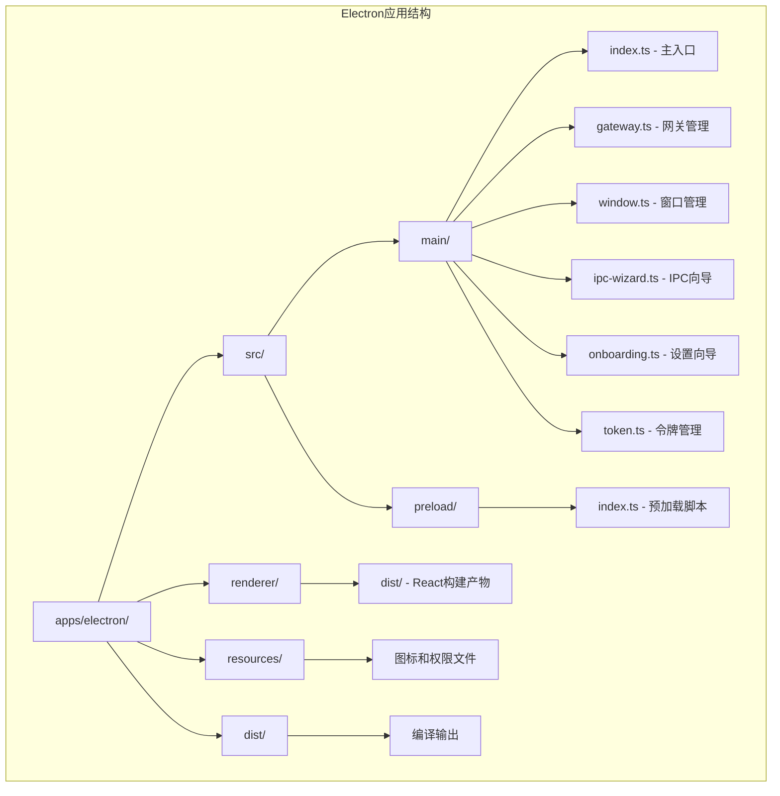
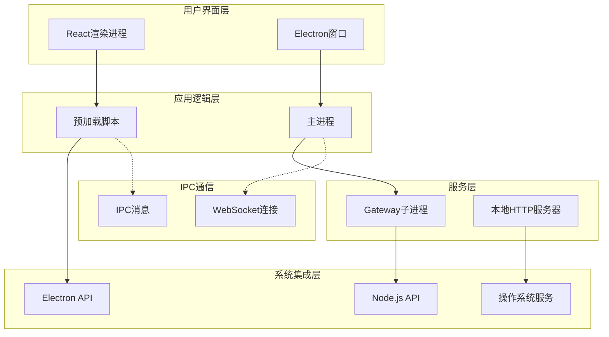
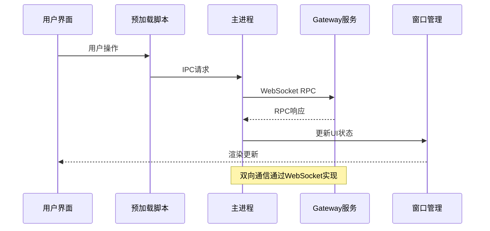
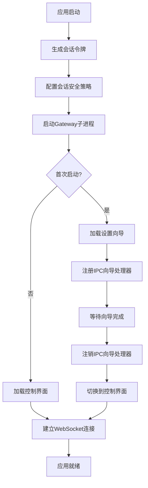
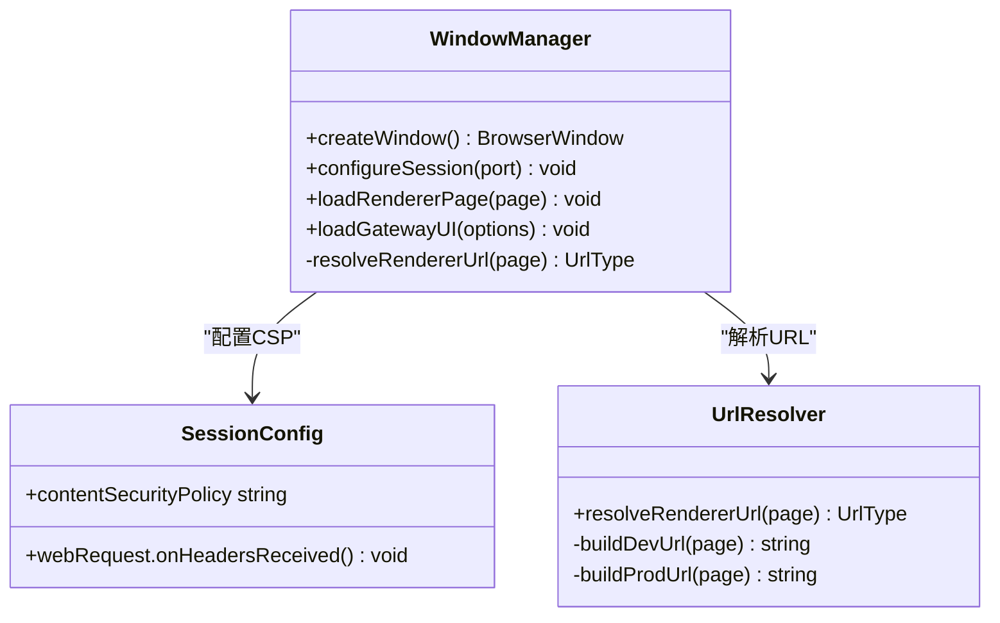
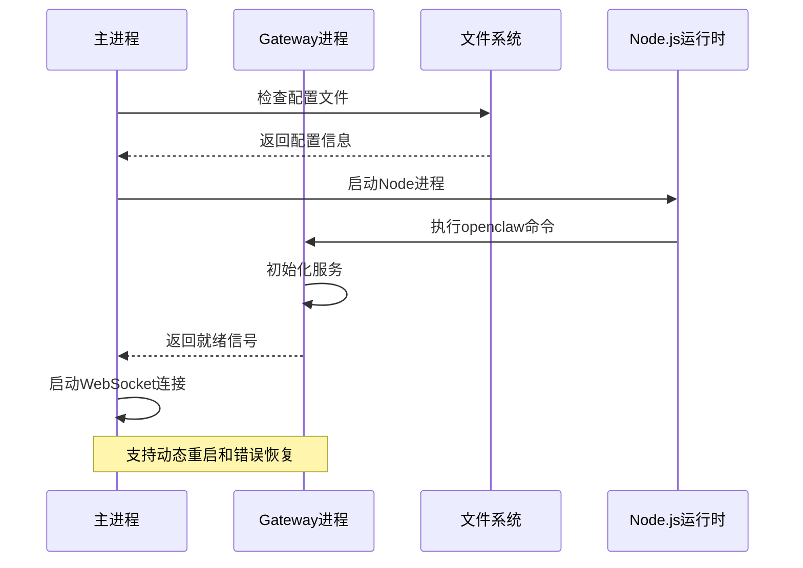
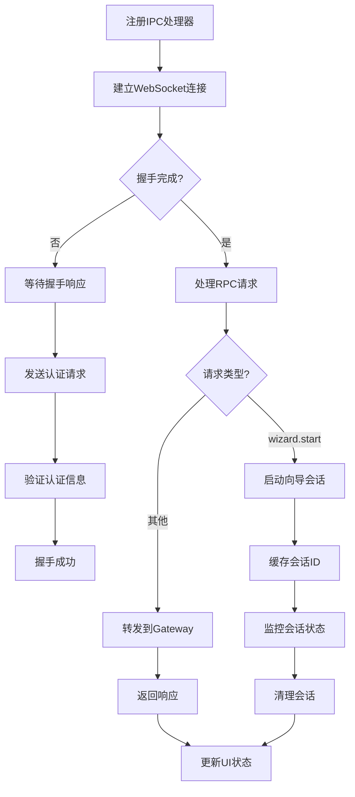
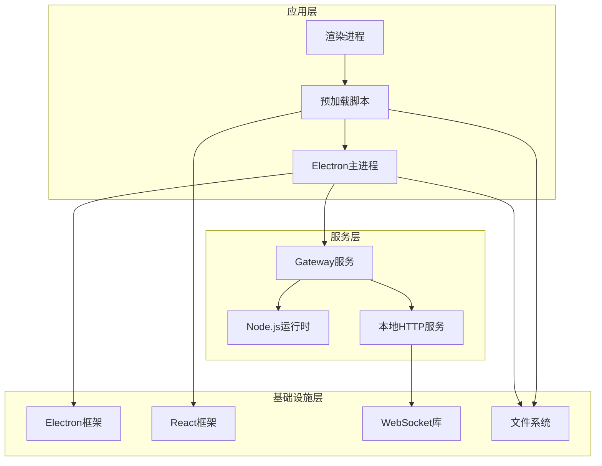

# Electron应用增强

<cite>
**本文档引用的文件**
- [apps/electron/package.json](file://apps/electron/package.json)
- [apps/electron/tsup.config.ts](file://apps/electron/tsup.config.ts)
- [apps/electron/tsconfig.json](file://apps/electron/tsconfig.json)
- [apps/electron/electron-builder.yml](file://apps/electron/electron-builder.yml)
- [apps/electron/src/main/index.ts](file://apps/electron/src/main/index.ts)
- [apps/electron/src/preload/index.ts](file://apps/electron/src/preload/index.ts)
- [apps/electron/src/main/window.ts](file://apps/electron/src/main/window.ts)
- [apps/electron/src/main/gateway.ts](file://apps/electron/src/main/gateway.ts)
- [apps/electron/src/main/ipc-wizard.ts](file://apps/electron/src/main/ipc-wizard.ts)
- [apps/electron/src/main/onboarding.ts](file://apps/electron/src/main/onboarding.ts)
- [apps/electron/src/main/token.ts](file://apps/electron/src/main/token.ts)
</cite>

## 目录
1. [简介](#简介)
2. [项目结构](#项目结构)
3. [核心组件](#核心组件)
4. [架构概览](#架构概览)
5. [详细组件分析](#详细组件分析)
6. [依赖关系分析](#依赖关系分析)
7. [性能考虑](#性能考虑)
8. [故障排除指南](#故障排除指南)
9. [结论](#结论)

## 简介

OpenClaw Electron应用是一个桌面客户端，集成了本地Gateway服务和React控制界面。该应用通过Electron框架提供跨平台支持，包含完整的设置向导、网关管理和实时通信功能。

该应用的主要特点包括：
- 内置Node.js运行时和OpenClaw CLI
- React驱动的设置向导和控制界面
- WebSocket实时通信
- 多平台打包支持（macOS、Windows、Linux）
- 安全的IPC通信机制

## 项目结构

Electron应用采用模块化的项目结构，主要分为以下几个部分：

**图表来源**
- [apps/electron/package.json:1-40](file://apps/electron/package.json#L1-L40)
- [apps/electron/tsup.config.ts:1-29](file://apps/electron/tsup.config.ts#L1-L29)

**章节来源**
- [apps/electron/package.json:1-40](file://apps/electron/package.json#L1-L40)
- [apps/electron/tsup.config.ts:1-29](file://apps/electron/tsup.config.ts#L1-L29)
- [apps/electron/tsconfig.json:1-27](file://apps/electron/tsconfig.json#L1-L27)

## 核心组件

### 主进程组件

主进程是Electron应用的核心，负责管理应用生命周期、窗口创建和IPC通信。

**主要职责：**
- 应用生命周期管理
- 窗口创建和配置
- Gateway子进程管理
- IPC消息处理
- 安全策略配置

### 预加载脚本

预加载脚本通过contextBridge安全地暴露API给渲染进程，实现主进程和渲染进程之间的安全通信。

**安全特性：**
- 仅暴露必要的API方法
- 隐藏Node.js内部实现细节
- 提供类型安全的接口

### 网关管理器

负责启动、停止和重启本地Gateway服务，管理与Gateway的WebSocket连接。

**功能特性：**
- 自动检测和使用捆绑的Node.js
- 支持动态端口配置
- 进程监控和错误处理
- 令牌管理和认证

**章节来源**
- [apps/electron/src/main/index.ts:1-115](file://apps/electron/src/main/index.ts#L1-L115)
- [apps/electron/src/preload/index.ts:1-40](file://apps/electron/src/preload/index.ts#L1-L40)
- [apps/electron/src/main/gateway.ts:1-176](file://apps/electron/src/main/gateway.ts#L1-L176)

## 架构概览

该应用采用分层架构设计，实现了清晰的关注点分离：

**图表来源**
- [apps/electron/src/main/index.ts:78-109](file://apps/electron/src/main/index.ts#L78-L109)
- [apps/electron/src/main/window.ts:124-148](file://apps/electron/src/main/window.ts#L124-L148)
- [apps/electron/src/main/gateway.ts:100-151](file://apps/electron/src/main/gateway.ts#L100-L151)

### 数据流架构

应用的数据流遵循单向数据流原则，确保状态的一致性和可预测性：

**图表来源**
- [apps/electron/src/preload/index.ts:11-39](file://apps/electron/src/preload/index.ts#L11-L39)
- [apps/electron/src/main/ipc-wizard.ts:192-228](file://apps/electron/src/main/ipc-wizard.ts#L192-L228)
- [apps/electron/src/main/gateway.ts:100-151](file://apps/electron/src/main/gateway.ts#L100-L151)

## 详细组件分析

### 主入口组件 (index.ts)

主入口文件是整个应用的协调中心，负责初始化各个组件并建立它们之间的联系。

**图表来源**
- [apps/electron/src/main/index.ts:78-109](file://apps/electron/src/main/index.ts#L78-L109)
- [apps/electron/src/main/onboarding.ts:23-59](file://apps/electron/src/main/onboarding.ts#L23-L59)

**章节来源**
- [apps/electron/src/main/index.ts:1-115](file://apps/electron/src/main/index.ts#L1-L115)

### 窗口管理系统

窗口管理系统负责创建和配置Electron窗口，实现不同页面的动态加载。

**图表来源**
- [apps/electron/src/main/window.ts:74-148](file://apps/electron/src/main/window.ts#L74-L148)

**章节来源**
- [apps/electron/src/main/window.ts:1-149](file://apps/electron/src/main/window.ts#L1-L149)

### Gateway服务管理

Gateway服务管理器负责启动、监控和控制本地Gateway进程。

**图表来源**
- [apps/electron/src/main/gateway.ts:100-151](file://apps/electron/src/main/gateway.ts#L100-L151)
- [apps/electron/src/main/gateway.ts:166-171](file://apps/electron/src/main/gateway.ts#L166-L171)

**章节来源**
- [apps/electron/src/main/gateway.ts:1-176](file://apps/electron/src/main/gateway.ts#L1-L176)

### IPC向导系统

IPC向导系统实现了设置向导的完整生命周期管理，包括握手协议和RPC通信。

**图表来源**
- [apps/electron/src/main/ipc-wizard.ts:187-229](file://apps/electron/src/main/ipc-wizard.ts#L187-L229)
- [apps/electron/src/main/ipc-wizard.ts:126-175](file://apps/electron/src/main/ipc-wizard.ts#L126-L175)

**章节来源**
- [apps/electron/src/main/ipc-wizard.ts:1-243](file://apps/electron/src/main/ipc-wizard.ts#L1-L243)

### 安全令牌管理

令牌管理系统负责生成和管理会话令牌，确保每次启动都有唯一的身份标识。

**安全特性：**
- 使用加密安全的随机数生成器
- 令牌仅存在于内存中
- 每次启动自动生成新令牌
- 支持从配置文件复用现有令牌

**章节来源**
- [apps/electron/src/main/token.ts:1-10](file://apps/electron/src/main/token.ts#L1-L10)
- [apps/electron/src/main/onboarding.ts:57-76](file://apps/electron/src/main/onboarding.ts#L57-L76)

## 依赖关系分析

应用的依赖关系体现了清晰的层次结构和模块化设计：

**图表来源**
- [apps/electron/package.json:18-38](file://apps/electron/package.json#L18-L38)
- [apps/electron/tsup.config.ts:5-27](file://apps/electron/tsup.config.ts#L5-L27)

**章节来源**
- [apps/electron/package.json:1-40](file://apps/electron/package.json#L1-L40)
- [apps/electron/tsup.config.ts:1-29](file://apps/electron/tsup.config.ts#L1-L29)

### 构建配置分析

应用使用现代工具链进行构建和打包：

**构建工具特性：**
- TypeScript编译支持
- ES模块和CommonJS混合
- Source map生成
- 多格式输出（cjs）
- Node.js目标环境

**打包配置：**
- Electron Builder自动签名
- 捆绑Node.js运行时
- 资源文件优化
- 多平台支持

**章节来源**
- [apps/electron/tsup.config.ts:1-29](file://apps/electron/tsup.config.ts#L1-L29)
- [apps/electron/electron-builder.yml:1-80](file://apps/electron/electron-builder.yml#L1-L80)

## 性能考虑

### 内存管理

应用采用了多项内存优化策略：
- 令牌仅存储在内存中，避免磁盘持久化
- WebSocket连接池管理
- 进程间通信的异步处理
- 按需加载渲染页面

### 启动性能

启动时间优化措施：
- 并行构建主进程和渲染进程
- 开发模式下的热重载支持
- 条件加载和延迟初始化
- 缓存策略优化

### 网络性能

网络通信优化：
- WebSocket长连接复用
- 批量RPC请求处理
- 超时和重试机制
- 错误恢复策略

## 故障排除指南

### 常见问题诊断

**Gateway启动失败**
- 检查端口占用情况
- 验证Node.js运行时完整性
- 查看进程日志输出
- 确认防火墙设置

**IPC通信异常**
- 验证预加载脚本加载
- 检查contextBridge配置
- 确认IPC处理器注册
- 排查WebSocket连接状态

**窗口加载问题**
- 检查CSP配置
- 验证URL解析逻辑
- 确认文件路径正确性
- 查看开发服务器连接

### 调试工具

**开发模式调试**
- 使用Electron DevTools
- 启用详细日志记录
- 监控进程状态
- 分析内存使用情况

**生产环境监控**
- 进程健康检查
- 网络连接监控
- 错误日志收集
- 性能指标跟踪

**章节来源**
- [apps/electron/src/main/gateway.ts:140-147](file://apps/electron/src/main/gateway.ts#L140-L147)
- [apps/electron/src/main/ipc-wizard.ts:105-120](file://apps/electron/src/main/ipc-wizard.ts#L105-L120)

## 结论

OpenClaw Electron应用展现了现代桌面应用开发的最佳实践。通过精心设计的架构，该应用实现了：

**技术优势：**
- 清晰的模块化架构
- 安全的IPC通信机制
- 高效的资源管理
- 跨平台兼容性

**用户体验：**
- 流畅的启动体验
- 响应式的界面交互
- 简洁的设置流程
- 稳定的连接管理

**扩展性：**
- 插件化架构支持
- 模块化组件设计
- 灵活的配置选项
- 可维护的代码结构

该应用为类似的企业级桌面应用提供了优秀的参考模板，展示了如何在保证安全性的同时提供出色的用户体验。