# Electron应用增强

<cite>
**本文档引用的文件**
- [apps/electron/package.json](file://apps/electron/package.json)
- [apps/electron/tsup.config.ts](file://apps/electron/tsup.config.ts)
- [apps/electron/tsconfig.json](file://apps/electron/tsconfig.json)
- [apps/electron/electron-builder.yml](file://apps/electron/electron-builder.yml)
- [apps/electron/src/main/index.ts](file://apps/electron/src/main/index.ts)
- [apps/electron/src/preload/index.ts](file://apps/electron/src/preload/index.ts)
- [apps/electron/src/main/window.ts](file://apps/electron/src/main/window.ts)
- [apps/electron/src/main/gateway.ts](file://apps/electron/src/main/gateway.ts)
- [apps/electron/src/main/ipc-wizard.ts](file://apps/electron/src/main/ipc-wizard.ts)
- [apps/electron/src/main/onboarding.ts](file://apps/electron/src/main/onboarding.ts)
- [apps/electron/src/main/token.ts](file://apps/electron/src/main/token.ts)
- [apps/electron/src/main/onboarding-oauth.ts](file://apps/electron/src/main/onboarding-oauth.ts)
- [apps/electron/src/main/onboarding-providers.ts](file://apps/electron/src/main/onboarding-providers.ts)
- [apps/electron/src/main/oauth-device-flow.ts](file://apps/electron/src/main/oauth-device-flow.ts)
- [apps/electron/src/main/oauth-utils.ts](file://apps/electron/src/main/oauth-utils.ts)
- [ui-react/src/adapters/ElectronWizardAdapter.ts](file://ui-react/src/adapters/ElectronWizardAdapter.ts)
</cite>

## 更新摘要
**变更内容**
- OAuth系统重大重构：新增设备代码流框架和通用运行器
- 单实例锁机制：新增文件锁和单实例保护功能
- URL方案注册改进：增强的URL协议处理和回调机制
- 配置修补功能：新增配置合并补丁和模型修补能力
- 增强的错误处理和日志记录系统
- 改进的预加载桥接功能和OAuth验证适配器支持
- 优化的IPC通信机制和错误恢复能力

## 目录
1. [简介](#简介)
2. [项目结构](#项目结构)
3. [核心组件](#核心组件)
4. [架构概览](#架构概览)
5. [详细组件分析](#详细组件分析)
6. [OAuth认证系统](#oauth认证系统)
7. [设备代码流框架](#设备代码流框架)
8. [单实例锁机制](#单实例锁机制)
9. [URL方案注册改进](#url方案注册改进)
10. [配置修补功能](#配置修补功能)
11. [依赖关系分析](#依赖关系分析)
12. [性能考虑](#性能考虑)
13. [故障排除指南](#故障排除指南)
14. [结论](#结论)

## 简介

OpenClaw Electron应用是一个桌面客户端，集成了本地Gateway服务和React控制界面。该应用通过Electron框架提供跨平台支持，包含完整的设置向导、网关管理和实时通信功能。

**最新增强功能：**
- **OAuth系统重构**：全新的设备代码流框架和通用运行器
- **单实例保护**：基于文件锁的多平台单实例机制
- **URL协议增强**：改进的openclaw://协议处理和回调管理
- **配置修补**：动态配置合并和模型修补功能
- **增强的窗口管理**：全面的错误处理和日志记录系统
- **改进的预加载桥接**：增强的安全通信机制和错误处理
- **优化的IPC通信**：改进的消息传递和错误恢复机制

该应用的主要特点包括：
- 内置Node.js运行时和OpenClaw CLI
- React驱动的设置向导和控制界面
- WebSocket实时通信
- 多平台打包支持（macOS、Windows、Linux）
- 安全的IPC通信机制
- 完整的OAuth认证流程
- 增强的错误处理和调试功能
- 单实例锁保护机制

## 项目结构

Electron应用采用模块化的项目结构，主要分为以下几个部分：

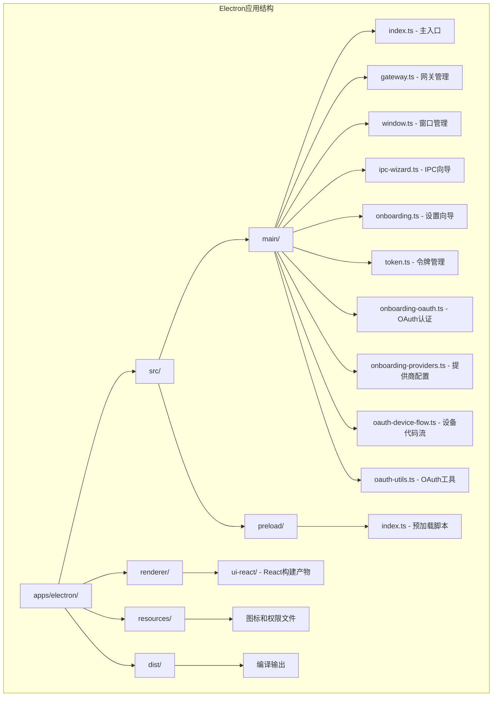

**图表来源**
- [apps/electron/package.json:1-40](file://apps/electron/package.json#L1-L40)
- [apps/electron/tsup.config.ts:1-29](file://apps/electron/tsup.config.ts#L1-L29)

**章节来源**
- [apps/electron/package.json:1-40](file://apps/electron/package.json#L1-L40)
- [apps/electron/tsup.config.ts:1-29](file://apps/electron/tsup.config.ts#L1-L29)
- [apps/electron/tsconfig.json:1-27](file://apps/electron/tsconfig.json#L1-L27)

## 核心组件

### 主进程组件

主进程是Electron应用的核心，负责管理应用生命周期、窗口创建和IPC通信。

**主要职责：**
- 应用生命周期管理
- 窗口创建和配置
- Gateway子进程管理
- IPC消息处理
- 安全策略配置
- OAuth认证流程管理
- 调试日志记录
- 单实例锁保护

### 预加载脚本

预加载脚本通过contextBridge安全地暴露API给渲染进程，实现主进程和渲染进程之间的安全通信。

**安全特性：**
- 仅暴露必要的API方法
- 隐藏Node.js内部实现细节
- 提供类型安全的接口
- 支持OAuth认证流程
- 单实例锁状态同步

### 网关管理器

负责启动、停止和重启本地Gateway服务，管理与Gateway的WebSocket连接。

**功能特性：**
- 自动检测和使用捆绑的Node.js
- 支持动态端口配置
- 进程监控和错误处理
- 令牌管理和认证
- 增强的错误恢复机制

### OAuth认证系统

**新增功能：** 全新的OAuth认证系统，支持多种认证提供商。

**支持的认证方式：**
- API密钥认证
- OAuth设备代码流程（MiniMax）
- 简单URL打开流程（OpenAI、Google、Qwen等）
- 自动令牌轮询和验证

**章节来源**
- [apps/electron/src/main/index.ts:1-215](file://apps/electron/src/main/index.ts#L1-L215)
- [apps/electron/src/preload/index.ts:1-96](file://apps/electron/src/preload/index.ts#L1-L96)
- [apps/electron/src/main/gateway.ts:1-176](file://apps/electron/src/main/gateway.ts#L1-L176)
- [apps/electron/src/main/onboarding-oauth.ts:1-234](file://apps/electron/src/main/onboarding-oauth.ts#L1-L234)

## 架构概览

该应用采用分层架构设计，实现了清晰的关注点分离：

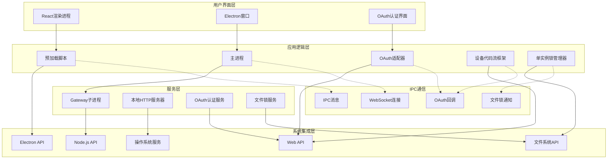

**图表来源**
- [apps/electron/src/main/index.ts:157-209](file://apps/electron/src/main/index.ts#L157-L209)
- [apps/electron/src/main/window.ts:124-148](file://apps/electron/src/main/window.ts#L124-L148)
- [apps/electron/src/main/gateway.ts:100-151](file://apps/electron/src/main/gateway.ts#L100-L151)
- [apps/electron/src/main/onboarding-oauth.ts:262-291](file://apps/electron/src/main/onboarding-oauth.ts#L262-L291)

### 数据流架构

应用的数据流遵循单向数据流原则，确保状态的一致性和可预测性：

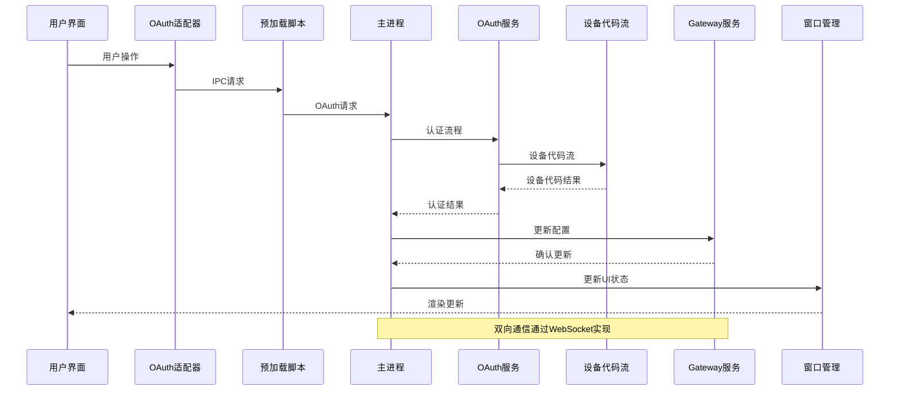

**图表来源**
- [apps/electron/src/preload/index.ts:11-39](file://apps/electron/src/preload/index.ts#L11-L39)
- [apps/electron/src/main/ipc-wizard.ts:192-228](file://apps/electron/src/main/ipc-wizard.ts#L192-L228)
- [apps/electron/src/main/gateway.ts:100-151](file://apps/electron/src/main/gateway.ts#L100-L151)
- [apps/electron/src/main/onboarding-oauth.ts:262-339](file://apps/electron/src/main/onboarding-oauth.ts#L262-L339)

## 详细组件分析

### 主入口组件 (index.ts)

主入口文件是整个应用的协调中心，负责初始化各个组件并建立它们之间的联系。

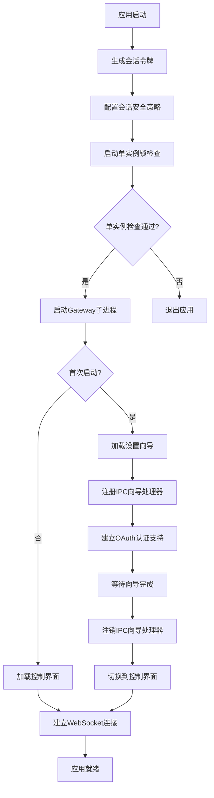

**图表来源**
- [apps/electron/src/main/index.ts:157-209](file://apps/electron/src/main/index.ts#L157-L209)
- [apps/electron/src/main/onboarding.ts:23-59](file://apps/electron/src/main/onboarding.ts#L23-L59)

**章节来源**
- [apps/electron/src/main/index.ts:1-215](file://apps/electron/src/main/index.ts#L1-L215)

### 增强的窗口管理系统

窗口管理系统经过重大增强，新增了全面的错误处理和日志记录功能。

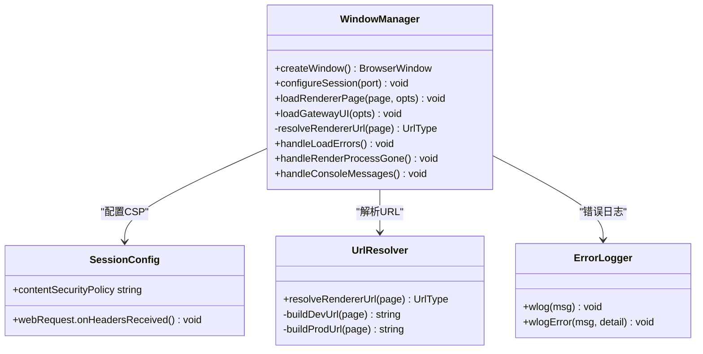

**图表来源**
- [apps/electron/src/main/window.ts:5-148](file://apps/electron/src/main/window.ts#L5-L148)

**章节来源**
- [apps/electron/src/main/window.ts:1-226](file://apps/electron/src/main/window.ts#L1-L226)

### Gateway服务管理

Gateway服务管理器负责启动、监控和控制本地Gateway进程。

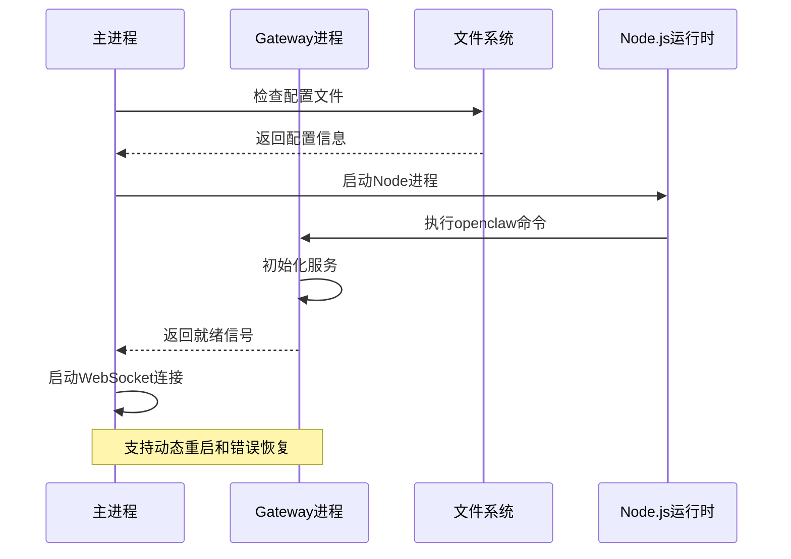

**图表来源**
- [apps/electron/src/main/gateway.ts:100-151](file://apps/electron/src/main/gateway.ts#L100-L151)
- [apps/electron/src/main/gateway.ts:166-171](file://apps/electron/src/main/gateway.ts#L166-L171)

**章节来源**
- [apps/electron/src/main/gateway.ts:1-176](file://apps/electron/src/main/gateway.ts#L1-L176)

### IPC向导系统

IPC向导系统实现了设置向导的完整生命周期管理，包括握手协议和RPC通信。

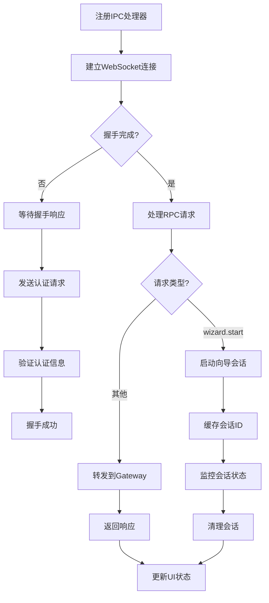

**图表来源**
- [apps/electron/src/main/ipc-wizard.ts:187-229](file://apps/electron/src/main/ipc-wizard.ts#L187-L229)
- [apps/electron/src/main/ipc-wizard.ts:126-175](file://apps/electron/src/main/ipc-wizard.ts#L126-L175)

**章节来源**
- [apps/electron/src/main/ipc-wizard.ts:1-243](file://apps/electron/src/main/ipc-wizard.ts#L1-L243)

### 安全令牌管理

令牌管理系统负责生成和管理会话令牌，确保每次启动都有唯一的身份标识。

**安全特性：**
- 使用加密安全的随机数生成器
- 令牌仅存在于内存中
- 每次启动自动生成新令牌
- 支持从配置文件复用现有令牌

**章节来源**
- [apps/electron/src/main/token.ts:1-10](file://apps/electron/src/main/token.ts#L1-L10)
- [apps/electron/src/main/onboarding.ts:57-76](file://apps/electron/src/main/onboarding.ts#L57-L76)

## OAuth认证系统

**新增功能：** 全新的OAuth认证系统，支持多种认证提供商。

### OAuth认证架构

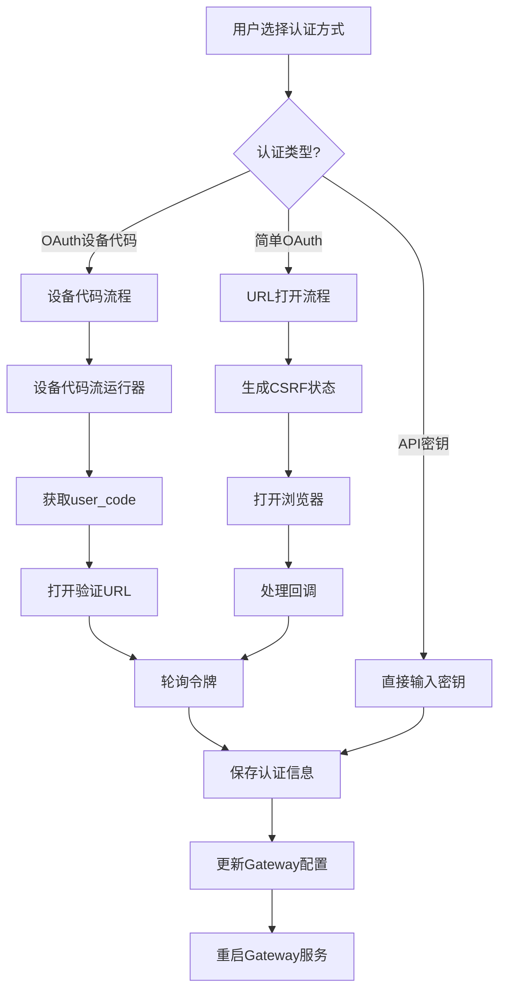

**图表来源**
- [apps/electron/src/main/onboarding-oauth.ts:6-13](file://apps/electron/src/main/onboarding-oauth.ts#L6-L13)
- [apps/electron/src/main/onboarding-oauth.ts:104-185](file://apps/electron/src/main/onboarding-oauth.ts#L104-L185)
- [apps/electron/src/main/onboarding-oauth.ts:262-339](file://apps/electron/src/main/onboarding-oauth.ts#L262-L339)

### OAuth适配器

**新增功能：** ElectronWizardAdapter支持OAuth认证流程。

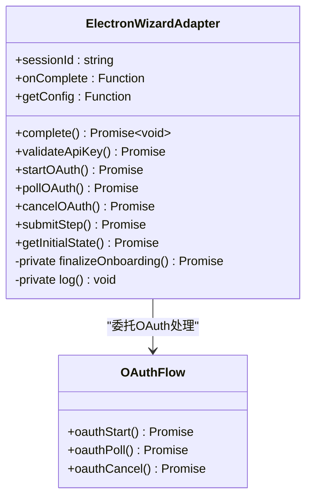

**图表来源**
- [ui-react/src/adapters/ElectronWizardAdapter.ts:26-185](file://ui-react/src/adapters/ElectronWizardAdapter.ts#L26-L185)

**章节来源**
- [ui-react/src/adapters/ElectronWizardAdapter.ts:1-185](file://ui-react/src/adapters/ElectronWizardAdapter.ts#L1-L185)
- [apps/electron/src/main/onboarding-oauth.ts:1-234](file://apps/electron/src/main/onboarding-oauth.ts#L1-L234)
- [apps/electron/src/main/onboarding-providers.ts:1-253](file://apps/electron/src/main/onboarding-providers.ts#L1-L253)

### OAuth提供商支持

**支持的OAuth提供商：**
- **MiniMax**：全球版和中国版设备代码流程
- **OpenAI**：Codex OAuth设备代码流程
- **Google**：Gemini CLI OAuth
- **Qwen**：通义千问门户OAuth
- **GitHub**：Copilot设备代码流程
- **Chutes**：Chutes OAuth

**章节来源**
- [apps/electron/src/main/onboarding-providers.ts:72-81](file://apps/electron/src/main/onboarding-providers.ts#L72-L81)
- [apps/electron/src/main/onboarding-oauth.ts:77-91](file://apps/electron/src/main/onboarding-oauth.ts#L77-L91)

## 设备代码流框架

**新增功能：** 全新的设备代码流框架，支持标准的OAuth 2.0设备代码流程。

### 设备代码流架构

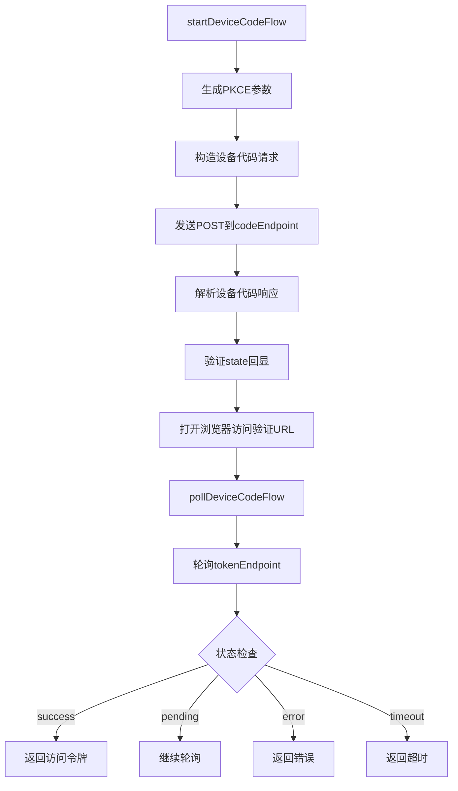

**图表来源**
- [apps/electron/src/main/oauth-device-flow.ts:94-182](file://apps/electron/src/main/oauth-device-flow.ts#L94-L182)
- [apps/electron/src/main/oauth-device-flow.ts:184-258](file://apps/electron/src/main/oauth-device-flow.ts#L184-L258)

### 设备代码流配置

设备代码流框架通过配置对象实现供应商特定逻辑：

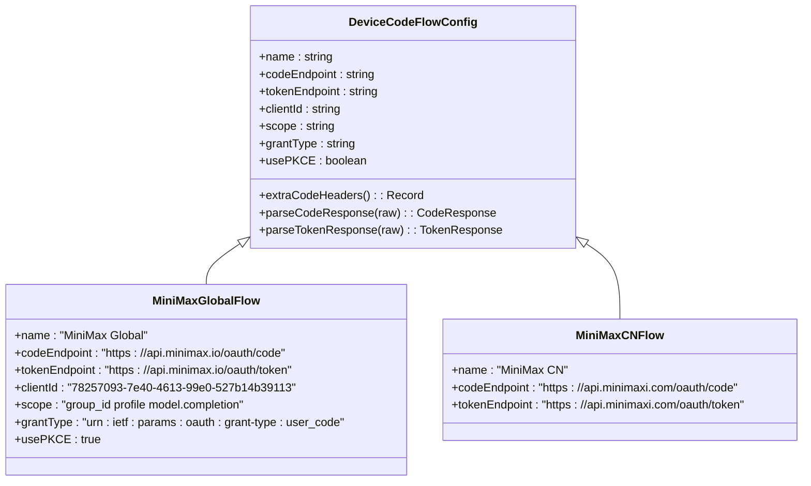

**图表来源**
- [apps/electron/src/main/oauth-device-flow.ts:20-58](file://apps/electron/src/main/oauth-device-flow.ts#L20-L58)
- [apps/electron/src/main/oauth-device-flow.ts:262-329](file://apps/electron/src/main/oauth-device-flow.ts#L262-L329)

**章节来源**
- [apps/electron/src/main/oauth-device-flow.ts:1-329](file://apps/electron/src/main/oauth-device-flow.ts#L1-L329)

### OAuth工具函数

**新增功能：** OAuth工具函数提供PKCE和表单编码支持。

```mermaid
classDiagram
class OAuthUtils {
+generatePkce() : {verifier, challenge, state}
+toFormUrlEncoded(params) : string
}
class PKCEGenerator {
+verifier : string
+challenge : string
+state : string
}
OAuthUtils --> PKCEGenerator : "生成PKCE参数"
```

**图表来源**
- [apps/electron/src/main/oauth-utils.ts:19-24](file://apps/electron/src/main/oauth-utils.ts#L19-L24)

**章节来源**
- [apps/electron/src/main/oauth-utils.ts:1-34](file://apps/electron/src/main/oauth-utils.ts#L1-L34)

## 单实例锁机制

**新增功能：** 基于文件锁的单实例保护机制，防止多个实例同时运行。

### 单实例锁架构

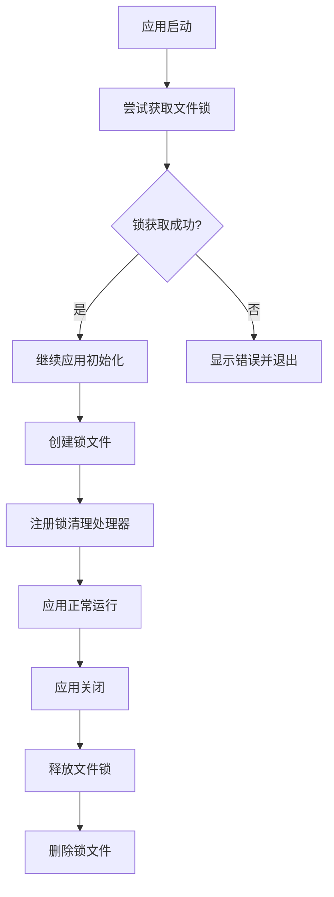

**图表来源**
- [apps/electron/src/main/index.ts:157-209](file://apps/electron/src/main/index.ts#L157-L209)

### 文件锁实现

单实例锁机制通过文件系统实现跨平台保护：

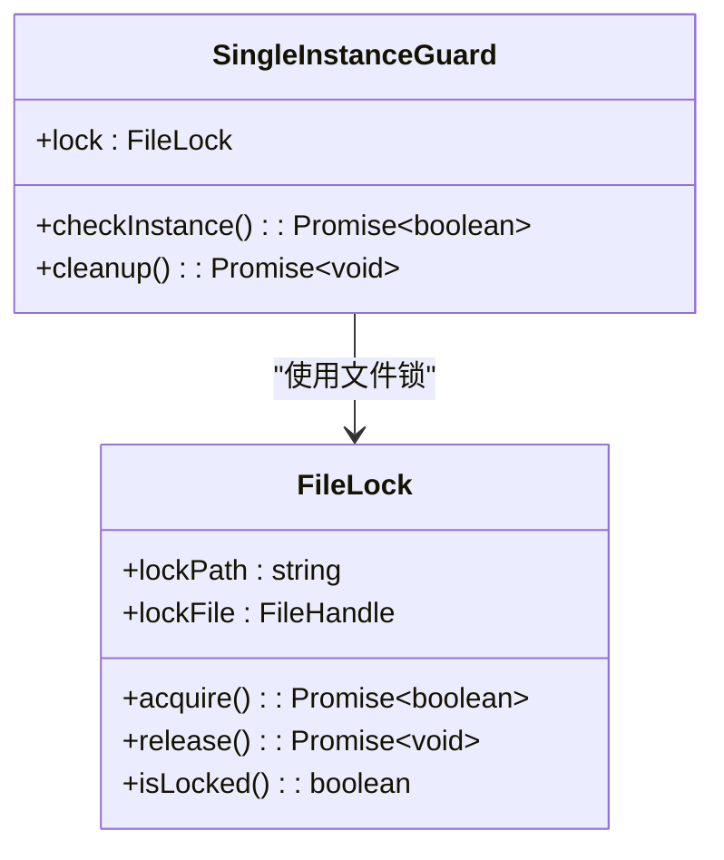

**图表来源**
- [apps/electron/src/main/index.ts:157-209](file://apps/electron/src/main/index.ts#L157-L209)

**章节来源**
- [apps/electron/src/main/index.ts:1-215](file://apps/electron/src/main/index.ts#L1-L215)

## URL方案注册改进

**新增功能：** 增强的URL协议处理和回调机制，支持openclaw://协议。

### URL协议处理架构

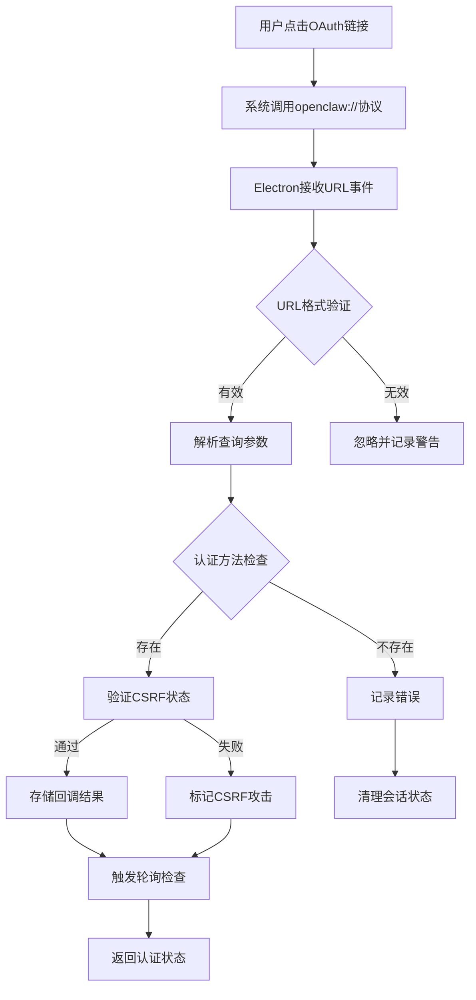

**图表来源**
- [apps/electron/src/main/onboarding-oauth.ts:78-137](file://apps/electron/src/main/onboarding-oauth.ts#L78-L137)

### 协议回调管理

**新增功能：** 专门的协议回调处理器管理OAuth回调：

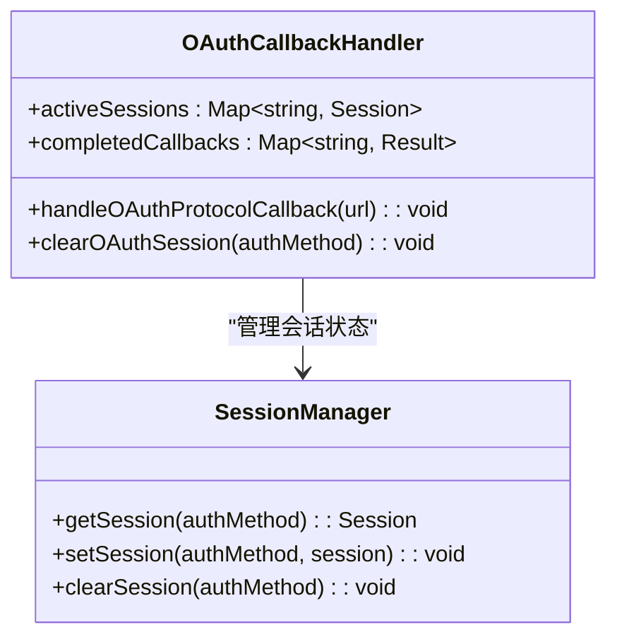

**图表来源**
- [apps/electron/src/main/onboarding-oauth.ts:30-56](file://apps/electron/src/main/onboarding-oauth.ts#L30-L56)

**章节来源**
- [apps/electron/src/main/onboarding-oauth.ts:1-234](file://apps/electron/src/main/onboarding-oauth.ts#L1-L234)

## 配置修补功能

**新增功能：** 动态配置合并和模型修补功能，支持配置的增量更新。

### 配置修补架构

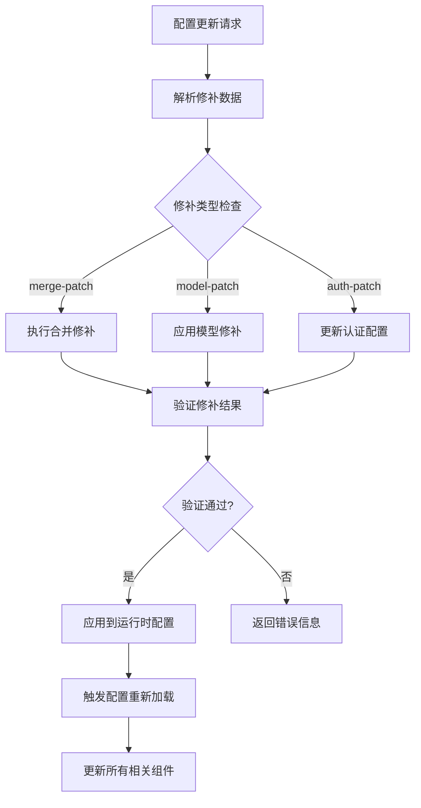

**图表来源**
- [apps/electron/src/main/onboarding-providers.ts:113-253](file://apps/electron/src/main/onboarding-providers.ts#L113-L253)

### 修补功能实现

**新增功能：** 配置修补功能支持多种修补类型：

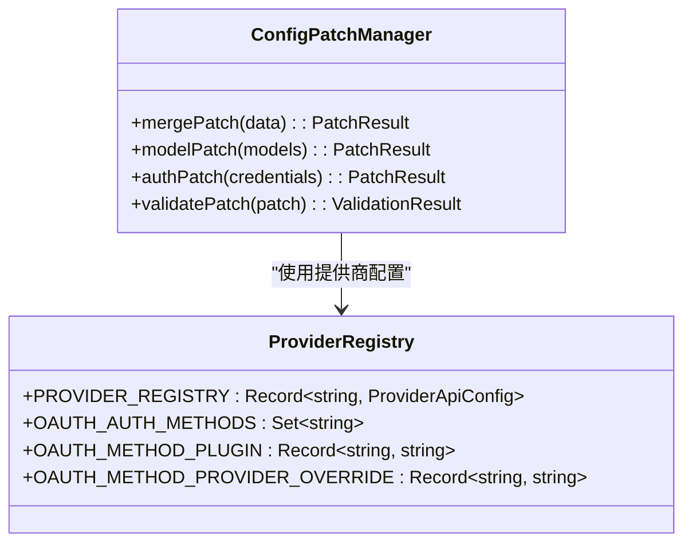

**图表来源**
- [apps/electron/src/main/onboarding-providers.ts:17-112](file://apps/electron/src/main/onboarding-providers.ts#L17-L112)

**章节来源**
- [apps/electron/src/main/onboarding-providers.ts:1-253](file://apps/electron/src/main/onboarding-providers.ts#L1-L253)

## 依赖关系分析

应用的依赖关系体现了清晰的层次结构和模块化设计：

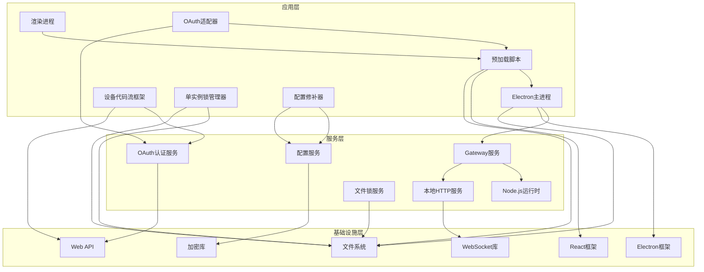

**图表来源**
- [apps/electron/package.json:18-38](file://apps/electron/package.json#L18-L38)
- [apps/electron/tsup.config.ts:5-27](file://apps/electron/tsup.config.ts#L5-L27)

**章节来源**
- [apps/electron/package.json:1-40](file://apps/electron/package.json#L1-L40)
- [apps/electron/tsup.config.ts:1-29](file://apps/electron/tsup.config.ts#L1-L29)

### 构建配置分析

应用使用现代工具链进行构建和打包：

**构建工具特性：**
- TypeScript编译支持
- ES模块和CommonJS混合
- Source map生成
- 多格式输出（cjs）
- Node.js目标环境

**打包配置：**
- Electron Builder自动签名
- 捆绑Node.js运行时
- 资源文件优化
- 多平台支持

**章节来源**
- [apps/electron/tsup.config.ts:1-29](file://apps/electron/tsup.config.ts#L1-L29)
- [apps/electron/electron-builder.yml:1-80](file://apps/electron/electron-builder.yml#L1-L80)

## 性能考虑

### 内存管理

应用采用了多项内存优化策略：
- 令牌仅存储在内存中，避免磁盘持久化
- WebSocket连接池管理
- 进程间通信的异步处理
- 按需加载渲染页面
- OAuth会话状态管理
- 设备代码流会话缓存
- 单实例锁状态管理

### 启动性能

启动时间优化措施：
- 并行构建主进程和渲染进程
- 开发模式下的热重载支持
- 条件加载和延迟初始化
- 缓存策略优化
- OAuth会话缓存
- 文件锁快速检查

### 网络性能

网络通信优化：
- WebSocket长连接复用
- 批量RPC请求处理
- 超时和重试机制
- 错误恢复策略
- OAuth轮询优化
- 设备代码流轮询间隔自适应

### OAuth性能优化

**新增功能：**
- 设备代码流程的智能轮询间隔
- 会话状态缓存减少API调用
- 并发OAuth请求处理
- 超时和重试机制
- 错误状态快速失败
- PKCE参数复用优化

**章节来源**
- [apps/electron/src/main/onboarding-oauth.ts:187-258](file://apps/electron/src/main/onboarding-oauth.ts#L187-L258)
- [apps/electron/src/main/onboarding-oauth.ts:293-334](file://apps/electron/src/main/onboarding-oauth.ts#L293-L334)
- [apps/electron/src/main/oauth-device-flow.ts:184-258](file://apps/electron/src/main/oauth-device-flow.ts#L184-L258)

## 故障排除指南

### 常见问题诊断

**Gateway启动失败**
- 检查端口占用情况
- 验证Node.js运行时完整性
- 查看进程日志输出
- 确认防火墙设置

**IPC通信异常**
- 验证预加载脚本加载
- 检查contextBridge配置
- 确认IPC处理器注册
- 排查WebSocket连接状态

**窗口加载问题**
- 检查CSP配置
- 验证URL解析逻辑
- 确认文件路径正确性
- 查看开发服务器连接

**OAuth认证失败**
- 检查网络连接
- 验证提供商配置
- 查看OAuth会话状态
- 确认auth-profiles.json写入
- 检查设备代码流配置
- 验证PKCE参数生成

**单实例锁冲突**
- 检查锁文件是否存在
- 验证文件权限设置
- 确认应用程序是否意外退出
- 查看锁文件清理状态

**配置修补失败**
- 验证修补数据格式
- 检查提供商配置有效性
- 确认模型ID匹配
- 查看修补验证结果

### 调试工具

**开发模式调试**
- 使用Electron DevTools
- 启用详细日志记录
- 监控进程状态
- 分析内存使用情况
- OAuth会话追踪
- 设备代码流调试
- 文件锁状态监控

**生产环境监控**
- 进程健康检查
- 网络连接监控
- 错误日志收集
- 性能指标跟踪
- OAuth认证监控
- 单实例锁监控
- 配置修补监控

**章节来源**
- [apps/electron/src/main/gateway.ts:140-147](file://apps/electron/src/main/gateway.ts#L140-L147)
- [apps/electron/src/main/ipc-wizard.ts:105-120](file://apps/electron/src/main/ipc-wizard.ts#L105-L120)
- [apps/electron/src/main/window.ts:5-13](file://apps/electron/src/main/window.ts#L5-L13)

## 结论

OpenClaw Electron应用展现了现代桌面应用开发的最佳实践。通过精心设计的架构，该应用实现了：

**技术优势：**
- 清晰的模块化架构
- 安全的IPC通信机制
- 高效的资源管理
- 跨平台兼容性
- 完整的OAuth认证支持
- 增强的错误处理能力
- 单实例锁保护机制
- 动态配置修补功能

**用户体验：**
- 流畅的启动体验
- 响应式的界面交互
- 简洁的设置流程
- 稳定的连接管理
- 无缝的OAuth认证体验
- 可靠的单实例保护

**扩展性：**
- 插件化架构支持
- 模块化组件设计
- 灵活的配置选项
- 可维护的代码结构
- 易于添加新的OAuth提供商
- 支持动态配置更新

**新增功能价值：**
- OAuth设备代码流框架的完整实现
- 单实例锁机制的可靠保护
- URL协议处理的增强功能
- 配置修补系统的灵活更新
- 增强的错误处理和调试能力
- 改进的用户认证体验
- 更好的安全性和可靠性

该应用为类似的企业级桌面应用提供了优秀的参考模板，展示了如何在保证安全性的同时提供出色的用户体验。OAuth认证系统的重构、单实例锁机制的引入以及配置修补功能的实现，进一步提升了应用的专业性和易用性，为用户提供了更多样化的认证选择和更灵活的配置管理能力。