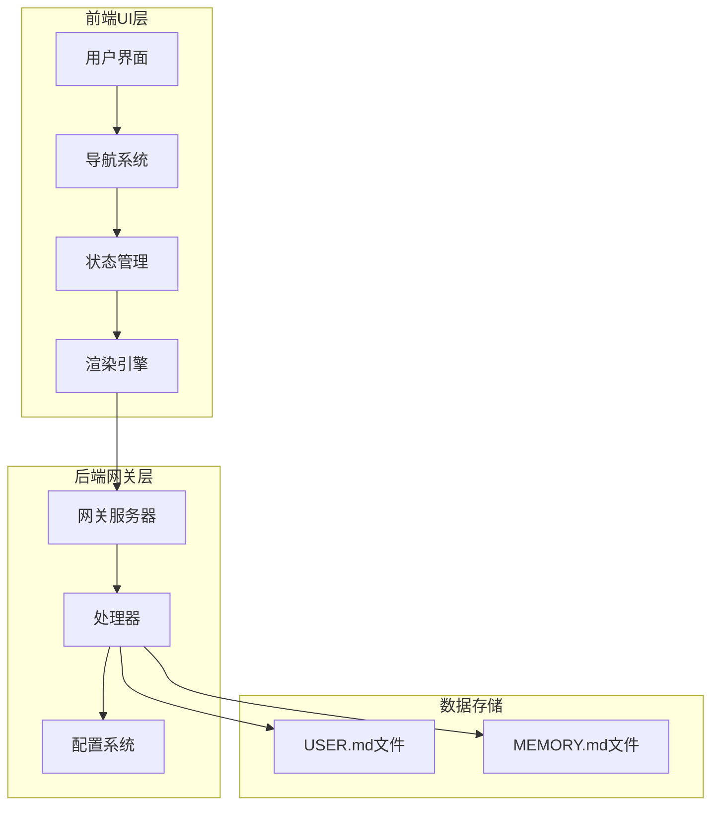
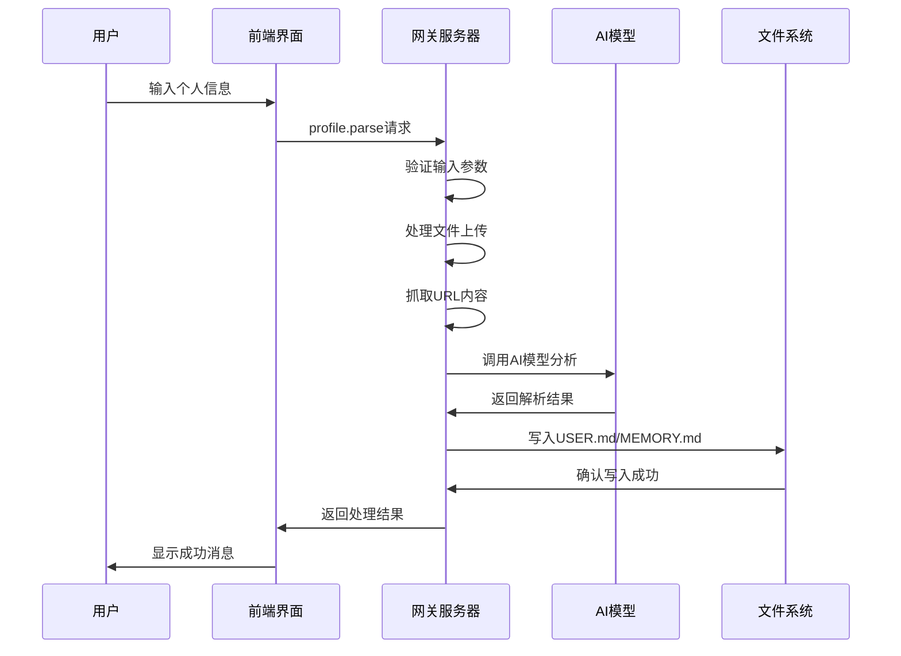
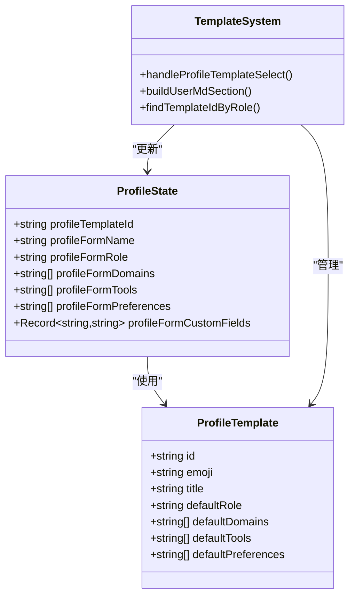
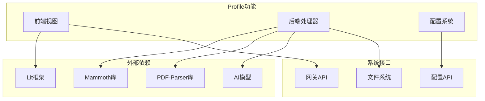

# Profile功能设计文档

<cite>
**本文档引用的文件**
- [profile-feature-design.md](file://docs/features/profile-feature-design.md)
- [profile.ts](file://ui/src/ui/views/profile.ts)
- [navigation.ts](file://ui/src/ui/navigation.ts)
- [app-settings.ts](file://ui/src/ui/app-settings.ts)
- [app.ts](file://ui/src/ui/app.ts)
- [profile.ts](file://src/gateway/server-methods/profile.ts)
- [types.openclaw.ts](file://src/config/types.openclaw.ts)
- [app-render.ts](file://ui/src/ui/app-render.ts)
</cite>

## 目录
1. [项目概述](#项目概述)
2. [项目结构](#项目结构)
3. [核心组件](#核心组件)
4. [架构概览](#架构概览)
5. [详细组件分析](#详细组件分析)
6. [依赖关系分析](#依赖关系分析)
7. [性能考虑](#性能考虑)
8. [故障排除指南](#故障排除指南)
9. [结论](#结论)

## 项目概述

Profile功能是OpenClaw项目中的一个核心用户画像管理模块，旨在为AI代理提供个性化的用户上下文信息。该功能通过两种方式帮助用户建立完整的个人档案：模板化配置和自由内容输入。

### 主要特性

- **模板化配置**：提供5种预设职业模板，用户选择后可快速填充个人信息
- **自由内容输入**：支持文本、URL链接和文档文件的混合输入
- **智能解析**：自动解析上传的.md、.doc、.docx、.pdf文件内容
- **覆盖式写入**：直接替换现有文件内容，确保数据一致性
- **多格式支持**：支持多种文件格式的自动解析和提取

## 项目结构

Profile功能的实现跨越了前端UI层和后端网关层，形成了完整的数据流架构：



**图表来源**
- [profile.ts:1-800](file://ui/src/ui/views/profile.ts#L1-L800)
- [profile.ts:1-378](file://src/gateway/server-methods/profile.ts#L1-L378)

**章节来源**
- [profile-feature-design.md:1-665](file://docs/features/profile-feature-design.md#L1-L665)

## 核心组件

### 前端组件架构

Profile功能的前端实现采用了模块化的设计模式，包含以下核心组件：

#### 状态管理系统
- **ProfileState**：管理整个Profile功能的状态
- **模板状态**：处理5种预设职业模板的数据
- **文件上传状态**：管理文件选择和上传过程
- **编辑状态**：控制编辑模式和预览模式的切换

#### 模板系统
- **职业模板**：包含内容创作者、作家、旅行向导、教育工作者、软件工程师5种模板
- **默认值配置**：每种模板提供预设的专业领域、常用工具和个人偏好
- **智能匹配**：根据现有USER.md中的ROLE字段自动匹配最合适的模板

#### 文件处理系统
- **文件类型支持**：.md、.doc、.docx、.pdf四种格式
- **大小限制**：默认单文件5MB，最多5个文件
- **安全验证**：检查文件类型和大小，防止恶意文件上传

**章节来源**
- [profile.ts:8-63](file://ui/src/ui/views/profile.ts#L8-L63)
- [profile.ts:77-123](file://ui/src/ui/views/profile.ts#L77-L123)

### 后端组件架构

#### 网关处理器
- **profile.parse方法**：核心解析处理器
- **AI模型集成**：使用默认AI模型进行内容分析
- **并发处理**：支持URL抓取和文件解析的并发执行

#### 配置管理系统
- **上传配置**：可配置的文件上传限制
- **模型配置**：支持动态模型选择和认证
- **错误处理**：完善的错误捕获和响应机制

**章节来源**
- [profile.ts:206-378](file://src/gateway/server-methods/profile.ts#L206-L378)
- [types.openclaw.ts:123-132](file://src/config/types.openclaw.ts#L123-L132)

## 架构概览

Profile功能采用客户端-服务器架构，实现了前后端的清晰分离：



**图表来源**
- [profile.ts:207-376](file://src/gateway/server-methods/profile.ts#L207-L376)
- [profile.ts:295-361](file://ui/src/ui/views/profile.ts#L295-L361)

### 数据流设计

Profile功能的数据流遵循严格的处理顺序：

1. **输入收集**：用户通过界面提交文本、URL或文件
2. **参数验证**：检查输入的有效性和格式
3. **内容处理**：解析文件内容和抓取URL文本
4. **AI分析**：使用预设prompt指导AI提取结构化信息
5. **结果分类**：将信息分为USER.md和MEMORY.md两类
6. **文件写入**：采用覆盖模式写入到指定文件

**章节来源**
- [profile.ts:119-174](file://src/gateway/server-methods/profile.ts#L119-L174)

## 详细组件分析

### 模板系统组件

模板系统是Profile功能的核心组成部分，提供了5种预设的职业模板：



**图表来源**
- [profile.ts:67-75](file://ui/src/ui/views/profile.ts#L67-L75)
- [profile.ts:271-284](file://ui/src/ui/views/profile.ts#L271-L284)

#### 模板匹配算法

模板系统实现了智能的角色匹配算法：

1. **精确匹配**：完全匹配ROLE字段
2. **部分匹配**：ROLE字段包含模板角色或相反
3. **回退机制**：如果匹配失败，选择第一个模板

**章节来源**
- [profile.ts:215-236](file://ui/src/ui/views/profile.ts#L215-L236)

### 文件处理组件

文件处理系统支持多种文档格式的解析：


**图表来源**
- [profile.ts:47-77](file://src/gateway/server-methods/profile.ts#L47-L77)

#### 文件解析策略

- **Markdown文件**：直接UTF-8解码
- **Word文档**：使用mammoth库提取纯文本
- **PDF文件**：使用pdf-parse库提取文本内容

**章节来源**
- [profile.ts:53-76](file://src/gateway/server-methods/profile.ts#L53-L76)

### 导航系统组件

导航系统为Profile功能提供了完整的路由支持：

```mermaid
graph LR
HOME[Profile首页] --> TEMPLATES[模板页面]
HOME --> EDIT[编辑页面]
TEMPLATES --> BACK1[返回按钮]
EDIT --> BACK2[返回按钮]
subgraph "路由配置"
ROUTE1[/profile]
ROUTE2[/profile/templates]
ROUTE3[/profile/edit]
end
HOME --> ROUTE1
TEMPLATES --> ROUTE2
EDIT --> ROUTE3
```

**图表来源**
- [navigation.ts:33-50](file://ui/src/ui/navigation.ts#L33-L50)

**章节来源**
- [navigation.ts:133-168](file://ui/src/ui/navigation.ts#L133-L168)

## 依赖关系分析

Profile功能的依赖关系相对简单，主要依赖于以下几个核心模块：



**图表来源**
- [profile.ts:8-11](file://src/gateway/server-methods/profile.ts#L8-L11)
- [profile.ts:1-5](file://ui/src/ui/views/profile.ts#L1-L5)

### 关键依赖项

1. **前端框架**：使用Lit框架构建响应式用户界面
2. **文档解析库**：mammoth用于Word文档解析，pdf-parse用于PDF解析
3. **AI模型**：集成到网关的AI模型服务
4. **文件系统**：直接操作workspace目录下的文件

**章节来源**
- [profile.ts:8-11](file://src/gateway/server-methods/profile.ts#L8-L11)

## 性能考虑

### 并发处理优化

Profile功能实现了多项性能优化措施：

- **并发文件处理**：URL抓取和文件解析采用Promise.all并发执行
- **内存管理**：及时清理文件读取器和解析结果
- **超时控制**：URL抓取设置15秒超时，防止长时间阻塞
- **AI调用限制**：设置60秒AI处理超时，避免资源占用

### 缓存策略

- **模板缓存**：模板数据在内存中缓存，避免重复加载
- **状态持久化**：用户输入的状态在页面切换时保持不变
- **配置缓存**：上传配置在启动时加载并缓存

## 故障排除指南

### 常见问题及解决方案

#### 文件上传失败
- **问题**：文件过大或格式不支持
- **解决方案**：检查文件大小限制和格式支持列表

#### URL解析错误
- **问题**：网络连接问题或访问限制
- **解决方案**：检查网络连接和目标网站的可访问性

#### AI模型不可用
- **问题**：API密钥配置错误或模型不可用
- **解决方案**：验证模型配置和API密钥设置

#### 文件写入权限问题
- **问题**：没有足够的权限写入workspace目录
- **解决方案**：检查文件系统的权限设置

**章节来源**
- [profile.ts:226-295](file://src/gateway/server-methods/profile.ts#L226-L295)

## 结论

Profile功能作为OpenClaw项目的重要组成部分，成功实现了用户画像的自动化管理和个性化配置。通过模板化配置和智能解析两大核心功能，该模块为AI代理提供了丰富的用户上下文信息，显著提升了对话的个性化程度和用户体验。

### 主要成就

1. **完整的用户画像管理**：支持结构化和非结构化的用户信息管理
2. **灵活的输入方式**：多种输入方式满足不同用户需求
3. **智能模板匹配**：基于现有信息的自动模板选择
4. **可靠的文件处理**：支持多种文档格式的安全解析
5. **清晰的架构设计**：前后端分离，职责明确

### 未来发展方向

1. **增强的模板系统**：支持用户自定义模板
2. **图片上传支持**：扩展文件类型支持
3. **版本历史管理**：提供Profile历史版本追踪
4. **导入导出功能**：支持Profile数据的备份和迁移

该功能的设计充分体现了现代Web应用的最佳实践，为后续的功能扩展奠定了坚实的基础。