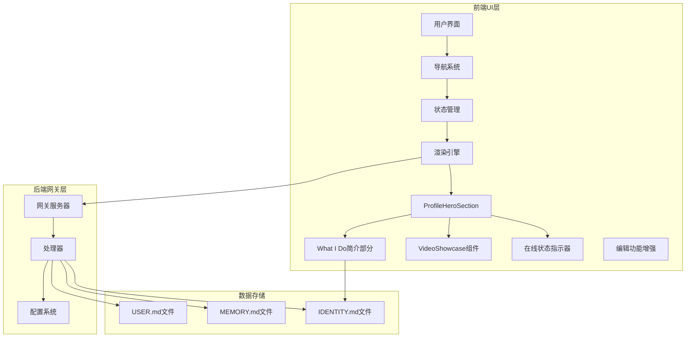
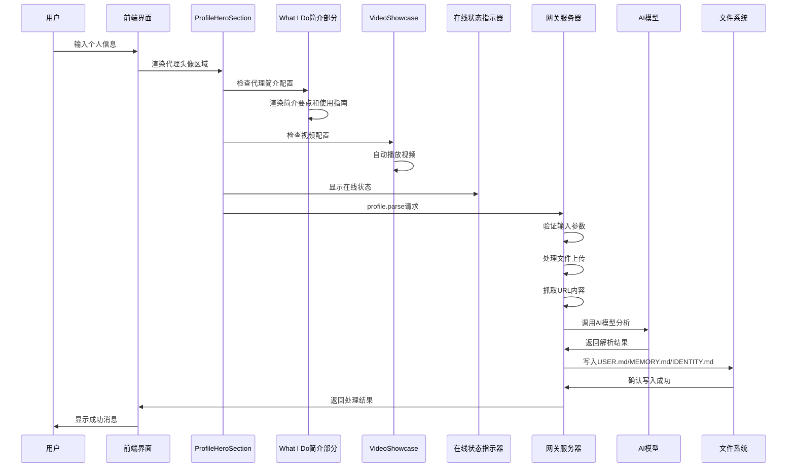
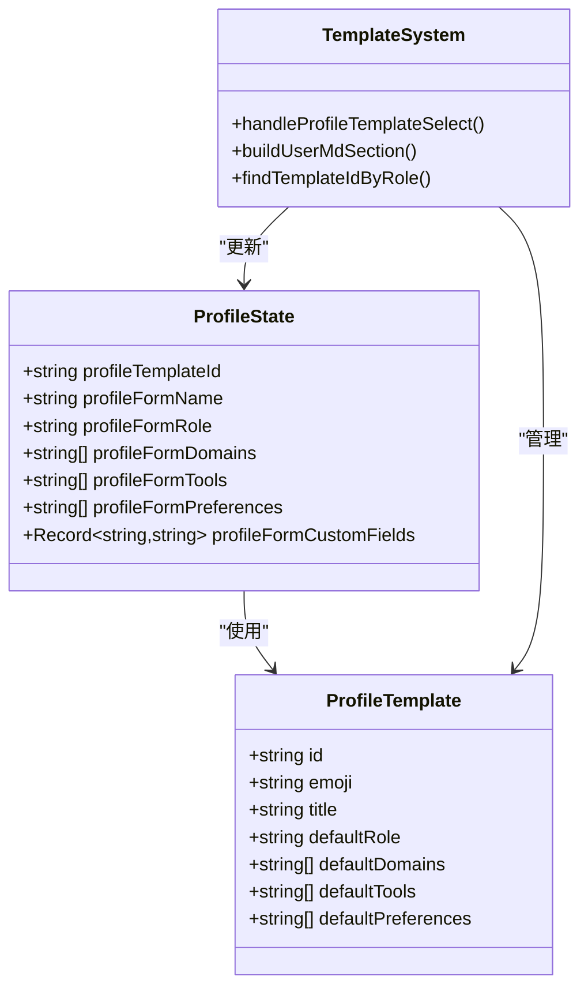
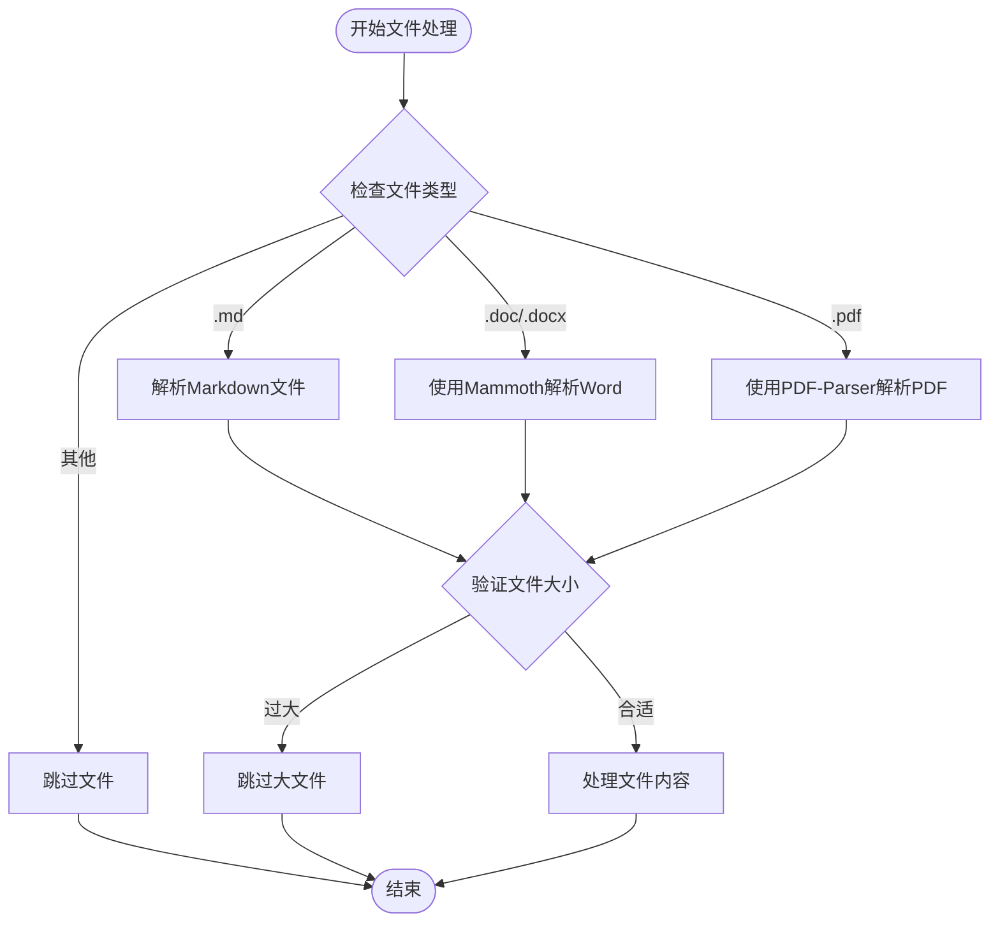
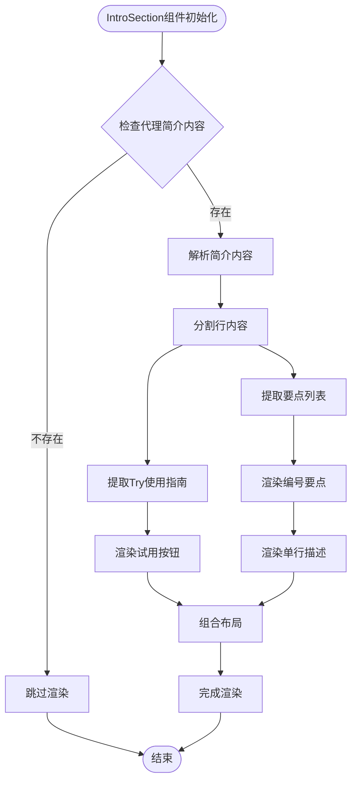
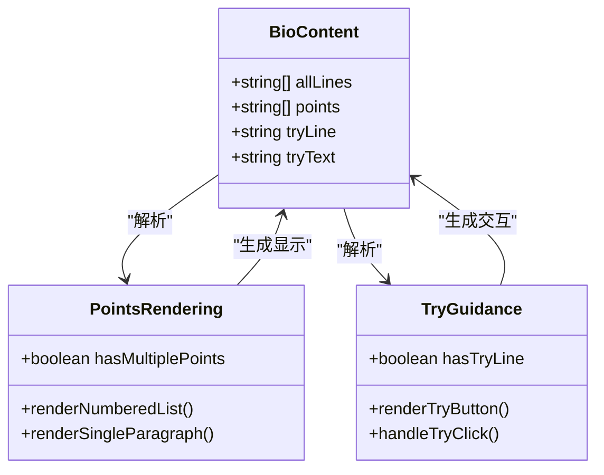
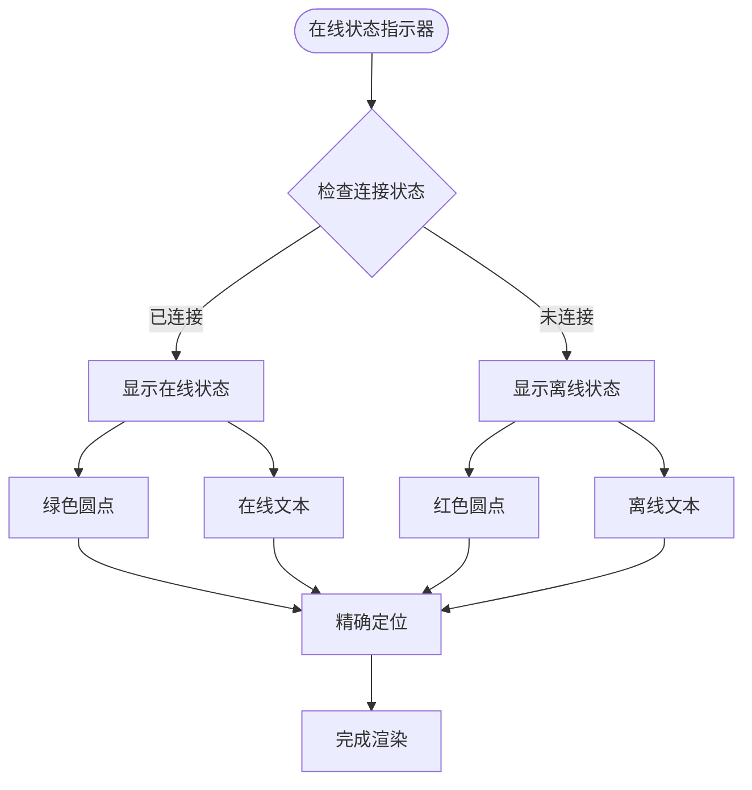
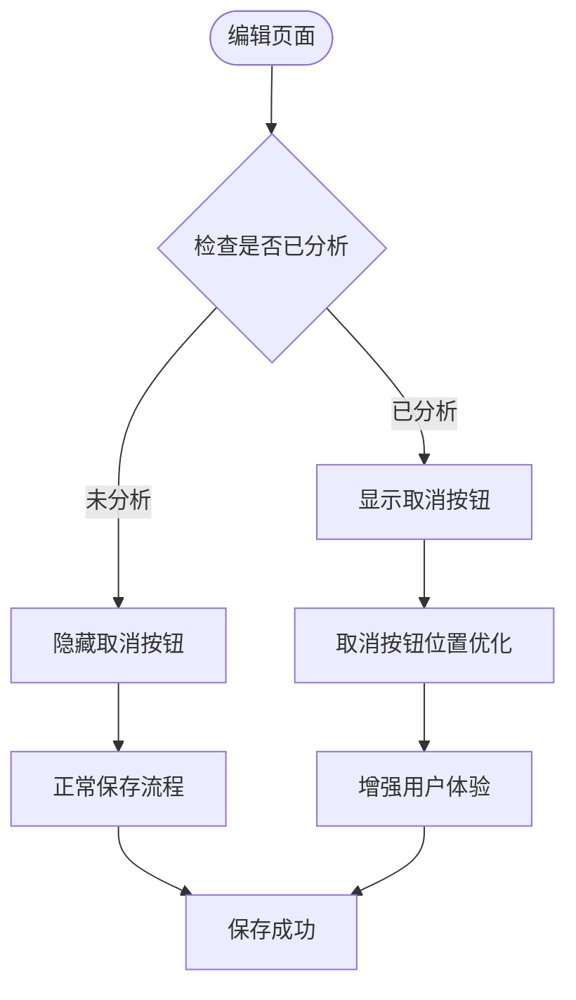
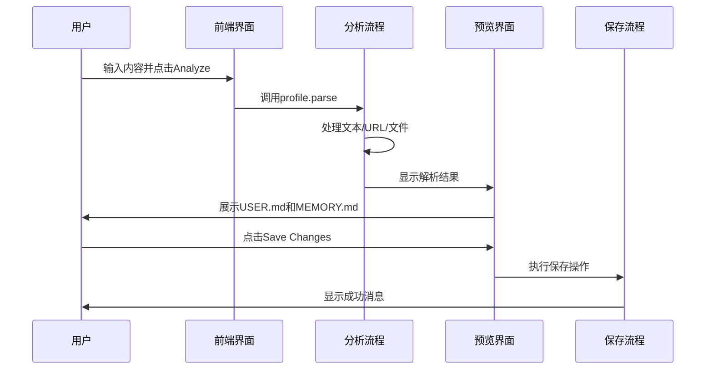
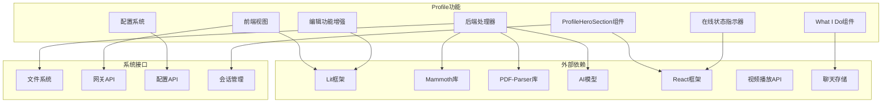

# Profile功能设计文档

<cite>
**本文档引用的文件**
- [profile-feature-design.md](file://docs/profile/profile-feature-design.md)
- [profile.ts](file://ui/src/ui/views/profile.ts)
- [navigation.ts](file://ui/src/ui/navigation.ts)
- [app-settings.ts](file://ui/src/ui/app-settings.ts)
- [app.ts](file://ui/src/ui/app.ts)
- [profile.ts](file://src/gateway/server-methods/profile.ts)
- [types.base.ts](file://src/config/types.base.ts)
- [session-types.ts](file://src/shared/session-types.ts)
- [profile.tsx](file://ui-react/src/components/agents/profile.tsx)
- [app-render.ts](file://ui/src/ui/app-render.ts)
</cite>

## 更新摘要
**所做更改**
- 新增What I Do简介部分章节，详细介绍代理身份的简要描述和使用指南
- 更新用户交互体验章节，包含新增的交互改进和优化
- 增强编辑功能章节，包含取消按钮位置优化和分析后保存流程
- 更新数据模型设计，包含What I Do字段的结构化描述
- 完善更新日志，反映最新的交互优化改进

## 目录
1. [项目概述](#项目概述)
2. [项目结构](#项目结构)
3. [核心组件](#核心组件)
4. [架构概览](#架构概览)
5. [详细组件分析](#详细组件分析)
6. [What I Do简介部分](#what-i-do简介部分)
7. [在线状态指示器](#在线状态指示器)
8. [编辑功能增强](#编辑功能增强)
9. [依赖关系分析](#依赖关系分析)
10. [性能考虑](#性能考虑)
11. [故障排除指南](#故障排除指南)
12. [结论](#结论)

## 项目概述

Profile功能是OpenClaw项目中的一个核心用户画像管理模块，旨在为AI代理提供个性化的用户上下文信息。该功能通过两种方式帮助用户建立完整的个人档案：模板化配置和自由内容输入。

### 主要特性

- **模板化配置**：提供5种预设职业模板，用户选择后可快速填充个人信息
- **自由内容输入**：支持文本、URL链接和文档文件的混合输入
- **智能解析**：自动解析上传的.md、.doc、.docx、.pdf文件内容
- **覆盖式写入**：直接替换现有文件内容，确保数据一致性
- **多格式支持**：支持多种文件格式的自动解析和提取
- **What I Do简介部分**：新增代理身份简要描述和使用指南功能
- **在线状态指示器**：改进的在线状态显示，提供更直观的连接状态反馈
- **编辑功能优化**：增强的编辑体验，包括取消按钮位置优化和分析后保存流程

## 项目结构

Profile功能的实现跨越了前端UI层和后端网关层，形成了完整的数据流架构：



**图表来源**
- [profile.tsx:380-482](file://ui-react/src/components/agents/profile.tsx#L380-L482)
- [profile.ts:1-800](file://ui/src/ui/views/profile.ts#L1-L800)
- [profile.ts:1-378](file://src/gateway/server-methods/profile.ts#L1-L378)

**章节来源**
- [profile-feature-design.md:1-665](file://docs/profile/profile-feature-design.md#L1-L665)

## 核心组件

### 前端组件架构

Profile功能的前端实现采用了模块化的设计模式，包含以下核心组件：

#### 状态管理系统
- **ProfileState**：管理整个Profile功能的状态
- **模板状态**：处理5种预设职业模板的数据
- **文件上传状态**：管理文件选择和上传过程
- **编辑状态**：控制编辑模式和预览模式的切换

#### 模板系统
- **职业模板**：包含内容创作者、作家、旅行向导、教育工作者、软件工程师5种模板
- **默认值配置**：每种模板提供预设的专业领域、常用工具和个人偏好
- **智能匹配**：根据现有USER.md中的ROLE字段自动匹配最合适的模板

#### 文件处理系统
- **文件类型支持**：.md、.doc、.docx、.pdf四种格式
- **大小限制**：默认单文件5MB，最多5个文件
- **安全验证**：检查文件类型和大小，防止恶意文件上传

#### What I Do简介部分
- **IntroSection组件**：专门负责代理身份的简要描述和使用指南展示
- **多行要点展示**：支持编号要点列表和单行描述两种显示模式
- **"Try:"使用指南**：提供可直接在聊天中使用的示例提示
- **交互式试用按钮**：一键将示例提示预填到聊天输入框

#### 在线状态指示器
- **实时状态显示**：显示代理的在线连接状态
- **颜色编码**：使用绿色圆点表示在线状态
- **位置优化**：精确的定位和样式设计

#### 编辑功能增强
- **取消按钮优化**：取消按钮从输入区域底部移至Save Changes按钮旁边
- **分析后保存**：解析结果先展示在编辑区，用户需点击Save Changes才会保存
- **状态修复**：修复进入Profile Edit页面时状态未正确设置导致自动保存的问题

**章节来源**
- [profile.ts:8-63](file://ui/src/ui/views/profile.ts#L8-L63)
- [profile.ts:77-123](file://ui/src/ui/views/profile.ts#L77-L123)
- [profile.tsx:380-482](file://ui-react/src/components/agents/profile.tsx#L380-L482)

### 后端组件架构

#### 网关处理器
- **profile.parse方法**：核心解析处理器
- **AI模型集成**：使用默认AI模型进行内容分析
- **并发处理**：支持URL抓取和文件解析的并发执行

#### 配置管理系统
- **上传配置**：可配置的文件上传限制
- **模型配置**：支持动态模型选择和认证
- **错误处理**：完善的错误捕获和响应机制

#### 代理身份配置
- **IdentityConfig类型**：扩展支持视频字段的代理身份配置
- **视频字段**：可选的展示视频URL，仅在代理详情页显示
- **兼容性保证**：向后兼容现有配置，不影响现有功能

**章节来源**
- [profile.ts:206-378](file://src/gateway/server-methods/profile.ts#L206-L378)
- [types.base.ts:232-241](file://src/config/types.base.ts#L232-L241)
- [session-types.ts:1-9](file://src/shared/session-types.ts#L1-L9)

## 架构概览

Profile功能采用客户端-服务器架构，实现了前后端的清晰分离：



**图表来源**
- [profile.ts:207-376](file://src/gateway/server-methods/profile.ts#L207-L376)
- [profile.tsx:380-482](file://ui-react/src/components/agents/profile.tsx#L380-L482)

### 数据流设计

Profile功能的数据流遵循严格的处理顺序：

1. **输入收集**：用户通过界面提交文本、URL或文件
2. **参数验证**：检查输入的有效性和格式
3. **内容处理**：解析文件内容和抓取URL文本
4. **AI分析**：使用预设prompt指导AI提取结构化信息
5. **结果分类**：将信息分为USER.md、MEMORY.md和IDENTITY.md三类
6. **文件写入**：采用覆盖模式写入到指定文件
7. **简介展示**：在代理详情页展示What I Do简介和使用指南
8. **在线状态**：实时显示代理的连接状态

**章节来源**
- [profile.ts:119-174](file://src/gateway/server-methods/profile.ts#L119-L174)

## 详细组件分析

### 模板系统组件

模板系统是Profile功能的核心组成部分，提供了5种预设的职业模板：



**图表来源**
- [profile.ts:67-75](file://ui/src/ui/views/profile.ts#L67-L75)
- [profile.ts:271-284](file://ui/src/ui/views/profile.ts#L271-L284)

#### 模板匹配算法

模板系统实现了智能的角色匹配算法：

1. **精确匹配**：完全匹配ROLE字段
2. **部分匹配**：ROLE字段包含模板角色或相反
3. **回退机制**：如果匹配失败，选择第一个模板

**章节来源**
- [profile.ts:215-236](file://ui/src/ui/views/profile.ts#L215-L236)

### 文件处理组件

文件处理系统支持多种文档格式的解析：



**图表来源**
- [profile.ts:47-77](file://src/gateway/server-methods/profile.ts#L47-L77)

#### 文件解析策略

- **Markdown文件**：直接UTF-8解码
- **Word文档**：使用mammoth库提取纯文本
- **PDF文件**：使用pdf-parse库提取文本内容

**章节来源**
- [profile.ts:53-76](file://src/gateway/server-methods/profile.ts#L53-L76)

### 导航系统组件

导航系统为Profile功能提供了完整的路由支持：

```mermaid
graph LR
HOME[Profile首页] --> TEMPLATES[模板页面]
HOME --> EDIT[编辑页面]
TEMPLATES --> BACK1[返回按钮]
EDIT --> BACK2[返回按钮]
subgraph "路由配置"
ROUTE1[/profile]
ROUTE2[/profile/templates]
ROUTE3[/profile/edit]
end
HOME --> ROUTE1
TEMPLATES --> ROUTE2
EDIT --> ROUTE3
```

**图表来源**
- [navigation.ts:33-50](file://ui/src/ui/navigation.ts#L33-L50)

**章节来源**
- [navigation.ts:133-168](file://ui/src/ui/navigation.ts#L133-L168)

## What I Do简介部分

### IntroSection组件

IntroSection组件是Profile功能中新增的What I Do简介核心组件，专门负责代理身份的简要描述和使用指南展示：



**图表来源**
- [profile.tsx:380-482](file://ui-react/src/components/agents/profile.tsx#L380-L482)

#### 组件特性

- **智能内容解析**：自动区分编号要点和"Try:"使用指南
- **多布局支持**：根据内容数量自动选择列表或单行显示模式
- **交互式试用**：提供一键试用功能，将示例提示预填到聊天输入框
- **视觉层次**：使用清晰的视觉层次和间距设计

#### 内容渲染策略

- **多行要点模式**：当存在多个要点时，使用编号列表展示
- **单行描述模式**：当只有一个要点时，直接渲染为段落文本
- **Try使用指南**：支持特殊格式的"Try:"提示，提供可交互的试用按钮
- **样式设计**：使用适当的字体大小、颜色和间距确保良好的可读性

### 简介内容结构

What I Do简介部分支持以下内容结构：



**图表来源**
- [profile.tsx:397-405](file://ui-react/src/components/agents/profile.tsx#L397-L405)

#### 内容格式规范

- **要点格式**：普通行内容被视为要点，自动编号展示
- **使用指南格式**：以"💬"表情符号开头的行被视为使用指南
- **清理处理**：自动去除表情符号和引号，提取干净的提示文本
- **多语言支持**：支持中英文混合的提示内容

#### 交互功能

- **一键试用**：点击"Try:"按钮可直接将提示内容预填到聊天输入框
- **会话导航**：自动检测最佳会话并导航到聊天界面
- **提示反馈**：提供视觉和文字反馈，告知用户操作结果
- **无障碍设计**：支持键盘导航和屏幕阅读器识别

**章节来源**
- [profile.tsx:380-482](file://ui-react/src/components/agents/profile.tsx#L380-L482)

## 在线状态指示器

### 实时状态显示

ProfileHeroSection组件中的在线状态指示器提供了直观的连接状态反馈：



**图表来源**
- [profile.tsx:269-272](file://ui-react/src/components/agents/profile.tsx#L269-L272)

#### 状态设计特点

- **颜色编码**：使用绿色圆点表示在线状态，提供直观的视觉反馈
- **精确位置**：位于头像下方，使用绝对定位确保准确位置
- **响应式设计**：支持不同屏幕尺寸的自适应显示
- **无障碍设计**：包含清晰的文本标签，便于屏幕阅读器识别

#### 定位和样式

- **绝对定位**：使用`absolute`定位确保相对于父容器的精确定位
- **居中对齐**：通过`left-1/2 -translate-x-1/2`实现水平居中
- **层级管理**：使用适当的z-index确保指示器显示在头像上方
- **动画效果**：支持平滑的颜色过渡和状态切换动画

**章节来源**
- [profile.tsx:269-272](file://ui-react/src/components/agents/profile.tsx#L269-L272)

## 编辑功能增强

### 取消按钮位置优化

编辑功能在多个方面进行了优化，其中最重要的改进是取消按钮的位置调整：



**图表来源**
- [profile.ts:370-378](file://ui/src/ui/views/profile.ts#L370-L378)

#### 优化内容

- **按钮位置**：取消按钮从输入区域底部移至Save Changes按钮旁边
- **逻辑改进**：仅在解析后显示取消按钮，避免误操作
- **用户体验**：提供更直观的撤销机制，用户可以轻松取消分析结果

### 分析后保存流程

Profile功能实现了智能的分析后保存机制：



**图表来源**
- [profile.ts:302-368](file://ui/src/ui/views/profile.ts#L302-L368)

#### 流程特点

- **非自动保存**：解析结果先展示在编辑区，用户需点击Save Changes才会保存
- **状态跟踪**：使用`profileEditHasAnalyzed`状态跟踪分析状态
- **内容恢复**：提供取消功能，可以恢复原始内容
- **错误处理**：完善的错误处理和用户反馈机制

**章节来源**
- [profile.ts:302-368](file://ui/src/ui/views/profile.ts#L302-L368)

## 依赖关系分析

Profile功能的依赖关系相对简单，主要依赖于以下几个核心模块：



**图表来源**
- [profile.ts:8-11](file://src/gateway/server-methods/profile.ts#L8-L11)
- [profile.ts:1-5](file://ui/src/ui/views/profile.ts#L1-L5)
- [profile.tsx:380-482](file://ui-react/src/components/agents/profile.tsx#L380-L482)

### 关键依赖项

1. **前端框架**：使用Lit框架构建响应式用户界面
2. **文档解析库**：mammoth用于Word文档解析，pdf-parse用于PDF解析
3. **AI模型**：集成到网关的AI模型服务
4. **文件系统**：直接操作workspace目录下的文件
5. **React生态系统**：What I Do组件基于React Hooks实现
6. **聊天存储系统**：用于试用功能的聊天状态管理
7. **浏览器媒体API**：利用原生HTML5视频播放能力
8. **在线状态管理**：实时连接状态检测和显示

**章节来源**
- [profile.ts:8-11](file://src/gateway/server-methods/profile.ts#L8-L11)

## 性能考虑

### 并发处理优化

Profile功能实现了多项性能优化措施：

- **并发文件处理**：URL抓取和文件解析采用Promise.all并发执行
- **内存管理**：及时清理文件读取器和解析结果
- **超时控制**：URL抓取设置15秒超时，防止长时间阻塞
- **AI调用限制**：设置60秒AI处理超时，避免资源占用
- **视频预加载优化**：视频组件启用预加载，提升播放体验
- **状态缓存**：在线状态和代理信息在组件间共享缓存
- **What I Do内容缓存**：简介内容在组件间共享，避免重复解析

### 缓存策略

- **模板缓存**：模板数据在内存中缓存，避免重复加载
- **状态持久化**：用户输入的状态在页面切换时保持不变
- **配置缓存**：上传配置在启动时加载并缓存
- **视频播放缓存**：浏览器自动缓存已加载的视频资源
- **文件内容缓存**：代理文件内容在组件间共享
- **简介内容缓存**：解析后的简介内容在组件间共享

### What I Do组件优化

- **智能渲染**：根据内容数量选择最优渲染模式
- **延迟加载**：试用按钮仅在需要时渲染
- **事件委托**：使用事件委托减少DOM事件监听器数量
- **虚拟滚动**：对于大量要点内容，使用虚拟滚动提升性能
- **防抖处理**：输入内容变化时使用防抖减少重新渲染频率

## 故障排除指南

### 常见问题及解决方案

#### 文件上传失败
- **问题**：文件过大或格式不支持
- **解决方案**：检查文件大小限制和格式支持列表

#### URL解析错误
- **问题**：网络连接问题或访问限制
- **解决方案**：检查网络连接和目标网站的可访问性

#### AI模型不可用
- **问题**：API密钥配置错误或模型不可用
- **解决方案**：验证模型配置和API密钥设置

#### 文件写入权限问题
- **问题**：没有足够的权限写入workspace目录
- **解决方案**：检查文件系统的权限设置

#### What I Do内容显示异常
- **问题**：简介内容格式不正确或解析失败
- **解决方案**：检查代理简介配置，验证内容格式规范

#### 试用功能异常
- **问题**：点击试用按钮无响应或无法预填聊天内容
- **解决方案**：检查聊天存储状态，验证会话导航逻辑

#### 在线状态显示异常
- **问题**：在线状态指示器不显示或显示错误
- **解决方案**：检查代理连接状态，验证在线状态计算逻辑

#### 编辑功能问题
- **问题**：取消按钮不显示或保存功能异常
- **解决方案**：检查分析状态标志，验证编辑流程逻辑

**章节来源**
- [profile.ts:226-295](file://src/gateway/server-methods/profile.ts#L226-L295)

## 结论

Profile功能作为OpenClaw项目的重要组成部分，成功实现了用户画像的自动化管理和个性化配置。通过模板化配置和智能解析两大核心功能，该模块为AI代理提供了丰富的用户上下文信息，显著提升了对话的个性化程度和用户体验。

### 主要成就

1. **完整的用户画像管理**：支持结构化和非结构化的用户信息管理
2. **灵活的输入方式**：多种输入方式满足不同用户需求
3. **智能模板匹配**：基于现有信息的自动模板选择
4. **可靠的文件处理**：支持多种文档格式的安全解析
5. **清晰的架构设计**：前后端分离，职责明确
6. **What I Do简介部分**：新增代理身份简要描述和使用指南功能
7. **直观的在线状态**：改进的在线状态指示器，提供更好的连接反馈
8. **优化的编辑体验**：增强的编辑功能，包括取消按钮位置优化和分析后保存流程

### What I Do简介部分优势

- **简洁明了**：通过要点列表和使用指南提供清晰的代理身份描述
- **交互友好**：支持一键试用功能，降低用户使用门槛
- **智能解析**：自动区分要点内容和使用指南，提供最佳展示效果
- **视觉设计**：采用清晰的视觉层次和间距，提升可读性
- **无障碍支持**：支持屏幕阅读器和键盘导航

### 在线状态指示器优势

- **实时反馈**：提供准确的连接状态信息
- **直观设计**：使用颜色编码提供清晰的视觉反馈
- **精确位置**：优化的定位确保良好的用户体验
- **无障碍支持**：包含文本标签便于屏幕阅读器识别

### 编辑功能增强优势

- **用户体验优化**：取消按钮位置改进，提供更好的撤销机制
- **流程控制**：分析后保存机制，避免意外的数据修改
- **状态管理**：完善的分析状态跟踪和内容恢复功能
- **错误处理**：健壮的错误处理和用户反馈机制

### 未来发展方向

1. **增强的模板系统**：支持用户自定义模板
2. **图片上传支持**：扩展文件类型支持
3. **版本历史管理**：提供Profile历史版本追踪
4. **导入导出功能**：支持Profile数据的备份和迁移
5. **What I Do内容编辑**：允许用户自定义和编辑简介内容
6. **高级在线状态**：支持更多连接状态的详细显示
7. **协作编辑功能**：允许多用户协作编辑Profile信息
8. **智能内容推荐**：基于用户行为推荐相关的使用指南

该功能的设计充分体现了现代Web应用的最佳实践，为后续的功能扩展奠定了坚实的基础。What I Do简介部分、在线状态指示器和编辑功能增强的加入进一步提升了Profile功能的多媒体表达能力、用户体验和实用性，使其成为更加完整和现代化的代理身份管理解决方案。