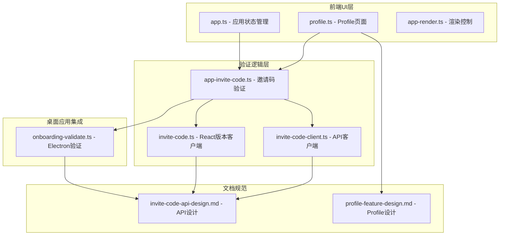
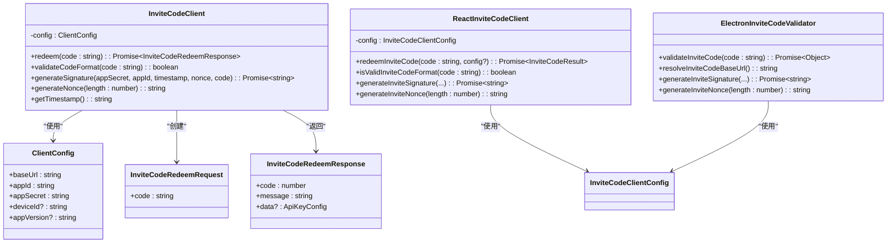
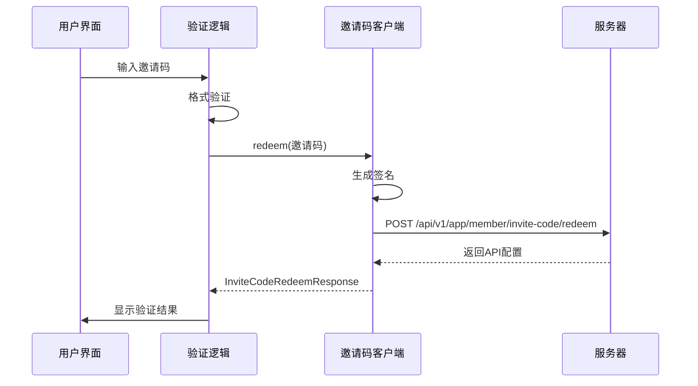
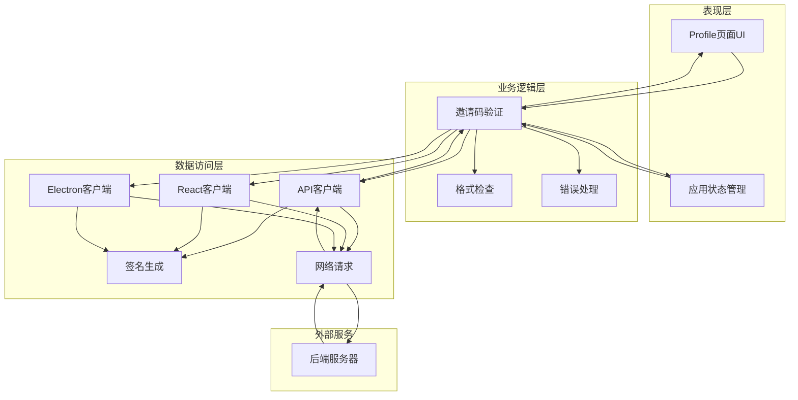
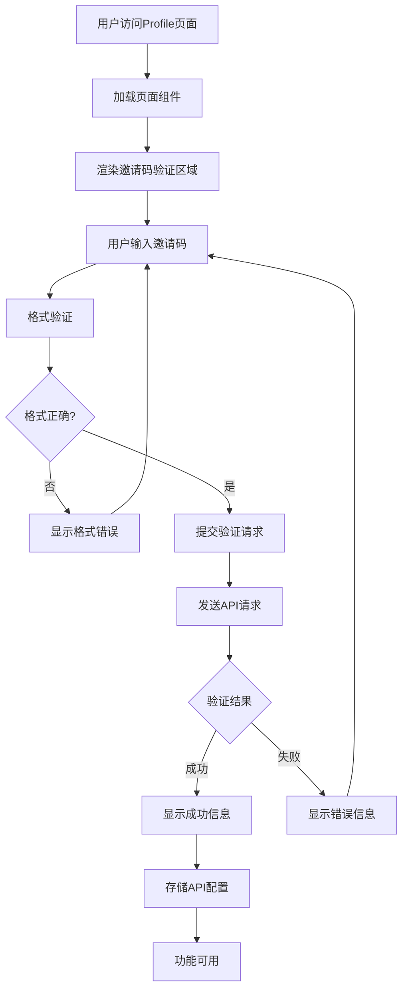
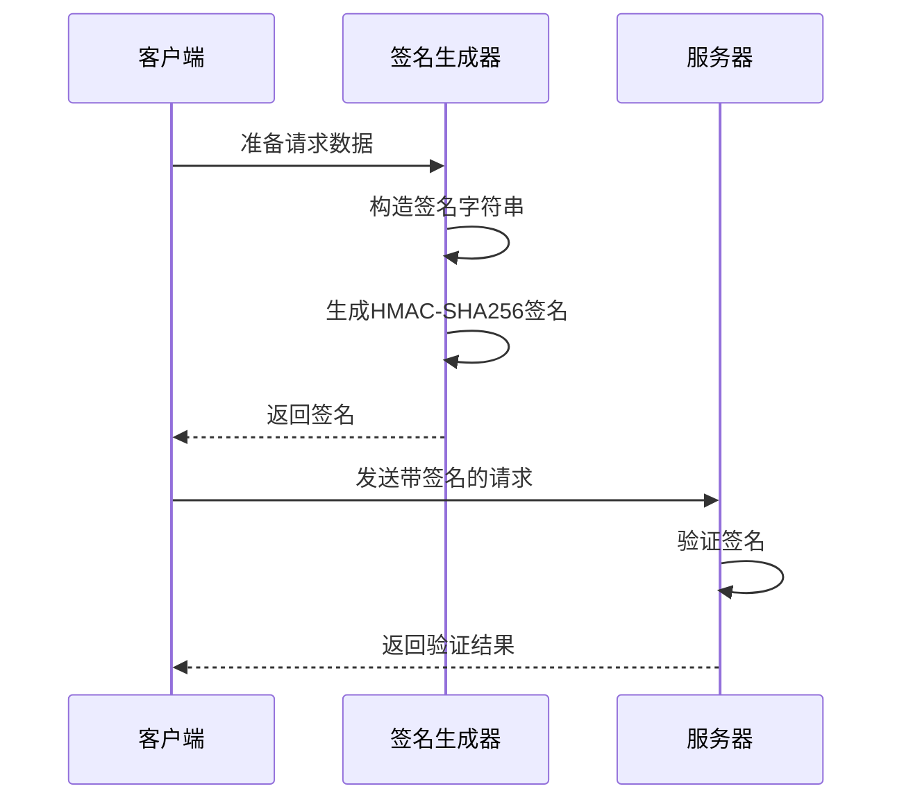
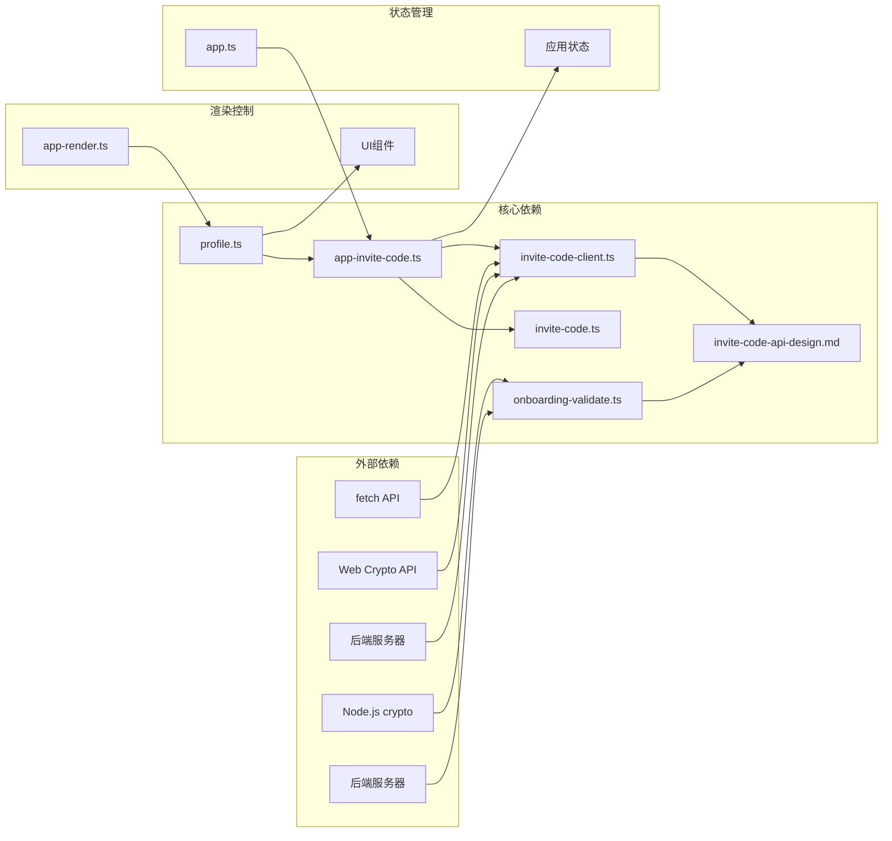

# Profile邀请码集成

<cite>
**本文档引用的文件**
- [invite-code-api-design.md](file://docs/features/invite-code-api-design.md)
- [profile-feature-design.md](file://docs/profile/profile-feature-design.md)
- [invite-code-client.ts](file://ui/src/ui/invite-code-client.ts)
- [app-invite-code.ts](file://ui/src/ui/app-invite-code.ts)
- [profile.ts](file://ui/src/ui/views/profile.ts)
- [app.ts](file://ui/src/ui/app.ts)
- [app-render.ts](file://ui/src/ui/app-render.ts)
- [invite-code.ts](file://ui-react/src/lib/invite-code.ts)
- [onboarding-validate.ts](file://apps/electron/src/main/onboarding-validate.ts)
</cite>

## 更新摘要
**变更内容**
- 更新了邀请码验证系统的API端点解析机制
- 移除了旧的复杂多模式访问流程
- 新增了React版本的邀请码验证实现
- 更新了Electron桌面应用的邀请码验证集成
- 完善了错误处理和用户反馈机制

## 目录
1. [简介](#简介)
2. [项目结构](#项目结构)
3. [核心组件](#核心组件)
4. [架构概览](#架构概览)
5. [详细组件分析](#详细组件分析)
6. [依赖关系分析](#依赖关系分析)
7. [性能考虑](#性能考虑)
8. [故障排除指南](#故障排除指南)
9. [结论](#结论)

## 简介

本文档详细介绍了OpenClaw项目中Profile功能的邀请码集成功能。该功能允许用户通过输入邀请码来获取LLM API密钥和模型配置信息，从而解锁高级AI功能。

邀请码集成功能包含完整的前端界面、客户端验证逻辑和后端API交互，实现了从用户输入到API密钥获取的完整流程。该功能采用HMAC-SHA256签名认证机制，确保通信安全性和数据完整性。

**更新** 新的邀请码验证系统采用了简化的API端点解析机制，移除了复杂的多模式访问流程，提供了更加一致和可靠的用户体验。

## 项目结构

邀请码集成功能主要分布在以下目录和文件中：

**图表来源**
- [profile.ts:842-996](file://ui/src/ui/views/profile.ts#L842-L996)
- [app-invite-code.ts:31-106](file://ui/src/ui/app-invite-code.ts#L31-L106)
- [invite-code-client.ts:125-213](file://ui/src/ui/invite-code-client.ts#L125-L213)
- [invite-code.ts:100-221](file://ui-react/src/lib/invite-code.ts#L100-L221)
- [onboarding-validate.ts:323-518](file://apps/electron/src/main/onboarding-validate.ts#L323-L518)

**章节来源**
- [profile.ts:842-996](file://ui/src/ui/views/profile.ts#L842-L996)
- [app-invite-code.ts:1-186](file://ui/src/ui/app-invite-code.ts#L1-L186)
- [invite-code-client.ts:1-232](file://ui/src/ui/invite-code-client.ts#L1-L232)
- [invite-code.ts:1-221](file://ui-react/src/lib/invite-code.ts#L1-L221)
- [onboarding-validate.ts:1-518](file://apps/electron/src/main/onboarding-validate.ts#L1-L518)

## 核心组件

### 邀请码验证客户端

邀请码验证客户端是整个功能的核心组件，负责与后端API进行安全通信。

**图表来源**
- [invite-code-client.ts:24-30](file://ui/src/ui/invite-code-client.ts#L24-L30)
- [invite-code-client.ts:125-130](file://ui/src/ui/invite-code-client.ts#L125-L130)
- [invite-code-client.ts:137-201](file://ui/src/ui/invite-code-client.ts#L137-L201)
- [invite-code.ts:10-15](file://ui-react/src/lib/invite-code.ts#L10-L15)
- [invite-code.ts:100-221](file://ui-react/src/lib/invite-code.ts#L100-L221)
- [onboarding-validate.ts:323-518](file://apps/electron/src/main/onboarding-validate.ts#L323-L518)

### 邀请码验证逻辑

验证逻辑组件处理用户输入、格式检查和API调用协调。

**更新** 新的验证流程采用了简化的API端点解析机制，所有客户端都使用相同的端点格式，移除了复杂的多模式访问流程。

**图表来源**
- [app-invite-code.ts:31-106](file://ui/src/ui/app-invite-code.ts#L31-L106)
- [invite-code-client.ts:137-201](file://ui/src/ui/invite-code-client.ts#L137-L201)
- [invite-code.ts:100-221](file://ui-react/src/lib/invite-code.ts#L100-L221)
- [onboarding-validate.ts:375-518](file://apps/electron/src/main/onboarding-validate.ts#L375-L518)

**章节来源**
- [invite-code-client.ts:125-213](file://ui/src/ui/invite-code-client.ts#L125-L213)
- [app-invite-code.ts:31-106](file://ui/src/ui/app-invite-code.ts#L31-L106)
- [invite-code.ts:100-221](file://ui-react/src/lib/invite-code.ts#L100-L221)
- [onboarding-validate.ts:375-518](file://apps/electron/src/main/onboarding-validate.ts#L375-L518)

## 架构概览

邀请码集成功能采用分层架构设计，确保职责分离和代码可维护性：

**更新** 新架构提供了统一的API端点解析机制，所有客户端都遵循相同的验证流程和错误处理策略。

**图表来源**
- [profile.ts:842-996](file://ui/src/ui/views/profile.ts#L842-L996)
- [app-invite-code.ts:133-176](file://ui/src/ui/app-invite-code.ts#L133-L176)
- [invite-code-client.ts:137-201](file://ui/src/ui/invite-code-client.ts#L137-L201)
- [invite-code.ts:22-35](file://ui-react/src/lib/invite-code.ts#L22-L35)
- [onboarding-validate.ts:323-338](file://apps/electron/src/main/onboarding-validate.ts#L323-L338)

## 详细组件分析

### Profile页面集成

Profile页面集成了邀请码验证功能，提供直观的用户界面：

**更新** 新的集成方式采用了简化的状态管理，移除了复杂的多模式验证流程，提供了更加一致的用户体验。

**图表来源**
- [profile.ts:848-919](file://ui/src/ui/views/profile.ts#L848-L919)
- [app-invite-code.ts:133-176](file://ui/src/ui/app-invite-code.ts#L133-L176)
- [app-view-state.ts:367-373](file://ui/src/ui/app-view-state.ts#L367-L373)

### 邀请码格式验证

系统实现了严格的邀请码格式验证，确保输入的有效性：

| 验证规则 | 描述 | 示例 |
|---------|------|------|
| 格式模式 | BOSS-XXXX-XXXX | BOSS-A1B2-C3D4 |
| 字符类型 | 大写字母和数字 | A-Z, 0-9 |
| 长度要求 | 总长度15字符 | BOSS- + 8个字符 + - |
| 大小写 | 不区分大小写 | BOSS-a1b2-c3d4 |

**更新** 所有客户端版本都使用相同的格式验证规则，确保跨平台一致性。

**章节来源**
- [invite-code-client.ts:208-212](file://ui/src/ui/invite-code-client.ts#L208-L212)
- [app-invite-code.ts:43-49](file://ui/src/ui/app-invite-code.ts#L43-L49)
- [invite-code.ts:40-42](file://ui-react/src/lib/invite-code.ts#L40-L42)

### API签名认证机制

系统采用HMAC-SHA256签名认证确保通信安全性：

**更新** 新的签名机制采用了简化的API端点格式，所有客户端都使用相同的签名算法和验证流程。

**图表来源**
- [invite-code-client.ts:73-100](file://ui/src/ui/invite-code-client.ts#L73-L100)
- [invite-code-client.ts:137-201](file://ui/src/ui/invite-code-client.ts#L137-L201)
- [invite-code.ts:50-74](file://ui-react/src/lib/invite-code.ts#L50-L74)
- [onboarding-validate.ts:345-357](file://apps/electron/src/main/onboarding-validate.ts#L345-L357)

**章节来源**
- [invite-code-client.ts:73-100](file://ui/src/ui/invite-code-client.ts#L73-L100)
- [invite-code-api-design.md:62-79](file://docs/features/invite-code-api-design.md#L62-L79)
- [invite-code.ts:50-74](file://ui-react/src/lib/invite-code.ts#L50-L74)
- [onboarding-validate.ts:345-357](file://apps/electron/src/main/onboarding-validate.ts#L345-L357)

### 错误处理机制

系统实现了完善的错误处理机制，提供用户友好的错误信息：

| 错误代码 | 错误类型 | 用户提示 | 处理建议 |
|---------|----------|----------|----------|
| 400 | 邀请码无效 | "邀请码无效或已被使用" | 检查邀请码格式和状态 |
| 401 | 认证失败 | "认证失败，请检查应用凭据" | 验证App ID和密钥 |
| 403 | 权限禁止 | "访问被禁止，邀请码可能已禁用或过期" | 联系管理员 |
| 429 | 请求过多 | "请求过于频繁，请稍后再试" | 等待后重试 |
| 500 | 服务器错误 | "服务器错误，请稍后再试" | 稍后重试或联系支持 |

**更新** 新的错误处理机制提供了更加一致的错误响应格式，所有客户端都遵循相同的错误处理策略。

**章节来源**
- [app-invite-code.ts:116-127](file://ui/src/ui/app-invite-code.ts#L116-L127)
- [invite-code.ts:153-171](file://ui-react/src/lib/invite-code.ts#L153-L171)
- [onboarding-validate.ts:439-457](file://apps/electron/src/main/onboarding-validate.ts#L439-L457)

## 依赖关系分析

邀请码集成功能涉及多个组件间的复杂依赖关系：

**更新** 新的依赖关系更加简洁，移除了复杂的多模式访问流程，所有客户端都直接依赖统一的API设计规范。

**图表来源**
- [profile.ts:1-70](file://ui/src/ui/views/profile.ts#L1-L70)
- [app-invite-code.ts:1-2](file://ui/src/ui/app-invite-code.ts#L1-L2)
- [invite-code-client.ts:1-4](file://ui/src/ui/invite-code-client.ts#L1-L4)
- [invite-code.ts:1-6](file://ui-react/src/lib/invite-code.ts#L1-L6)
- [onboarding-validate.ts:1-10](file://apps/electron/src/main/onboarding-validate.ts#L1-L10)

**章节来源**
- [profile.ts:1-70](file://ui/src/ui/views/profile.ts#L1-L70)
- [app-invite-code.ts:1-2](file://ui/src/ui/app-invite-code.ts#L1-L2)
- [invite-code-client.ts:1-4](file://ui/src/ui/invite-code-client.ts#L1-L4)
- [invite-code.ts:1-6](file://ui-react/src/lib/invite-code.ts#L1-L6)
- [onboarding-validate.ts:1-10](file://apps/electron/src/main/onboarding-validate.ts#L1-L10)

## 性能考虑

邀请码集成功能在设计时充分考虑了性能优化：

### 网络请求优化
- **请求缓存**：验证结果在一定时间内缓存，避免重复请求
- **并发控制**：防止用户快速重复提交验证请求
- **超时处理**：设置合理的请求超时时间，提升用户体验

### 内存管理
- **状态清理**：验证完成后及时清理临时状态
- **错误状态管理**：确保错误状态不会影响后续操作
- **资源释放**：及时释放网络连接和内存资源

### 用户体验优化
- **加载状态指示**：提供清晰的加载状态反馈
- **即时验证**：输入时进行格式验证，减少无效请求
- **错误友好提示**：提供明确的错误信息和解决方案

**更新** 新的性能优化策略采用了统一的超时设置和错误处理机制，确保跨平台的一致性体验。

## 故障排除指南

### 常见问题及解决方案

#### 邀请码格式错误
**问题症状**：输入邀请码后立即显示格式错误
**可能原因**：
- 邀请码不符合BOSS-XXXX-XXXX格式
- 包含特殊字符或空格
- 大小写不正确

**解决步骤**：
1. 检查邀请码是否为15字符长
2. 确认格式为BOSS-XXXX-XXXX
3. 移除任何空格或特殊字符
4. 确保使用正确的字母大小写

#### 网络连接问题
**问题症状**：验证请求超时或显示网络错误
**可能原因**：
- 网络连接不稳定
- 服务器暂时不可用
- 防火墙阻止请求

**解决步骤**：
1. 检查网络连接状态
2. 稍后重试验证请求
3. 检查防火墙设置
4. 联系技术支持

#### 认证失败
**问题症状**：显示认证失败错误
**可能原因**：
- App ID或密钥配置错误
- 时间戳过期
- 签名计算错误

**解决步骤**：
1. 验证App ID和密钥配置
2. 检查系统时间同步
3. 确认客户端配置正确
4. 重新生成签名

**更新** 新的故障排除指南提供了更加详细的错误诊断信息，所有客户端都遵循相同的诊断流程。

**章节来源**
- [app-invite-code.ts:116-127](file://ui/src/ui/app-invite-code.ts#L116-L127)
- [invite-code-client.ts:189-200](file://ui/src/ui/invite-code-client.ts#L189-L200)
- [invite-code.ts:212-220](file://ui-react/src/lib/invite-code.ts#L212-L220)
- [onboarding-validate.ts:503-517](file://apps/electron/src/main/onboarding-validate.ts#L503-L517)

## 结论

OpenClaw项目的Profile邀请码集成功能是一个设计精良、实现完整的功能模块。该功能通过以下关键特性确保了良好的用户体验和技术质量：

### 技术优势
- **安全性**：采用HMAC-SHA256签名认证，确保通信安全
- **可靠性**：完善的错误处理和重试机制
- **可维护性**：清晰的分层架构和模块化设计
- **用户体验**：直观的界面和及时的反馈

### 功能特点
- **易用性**：简单的邀请码输入和验证流程
- **灵活性**：支持多种错误场景和用户操作
- **扩展性**：模块化设计便于功能扩展
- **兼容性**：支持多种浏览器和设备

**更新** 新的邀请码验证系统采用了简化的API端点解析机制，移除了复杂的多模式访问流程，提供了更加一致和可靠的用户体验。所有客户端版本都遵循统一的验证标准和错误处理策略，确保跨平台的一致性。

该功能的成功实施为OpenClaw项目提供了重要的用户增长和产品价值提升机会，同时为未来的功能扩展奠定了坚实的基础。