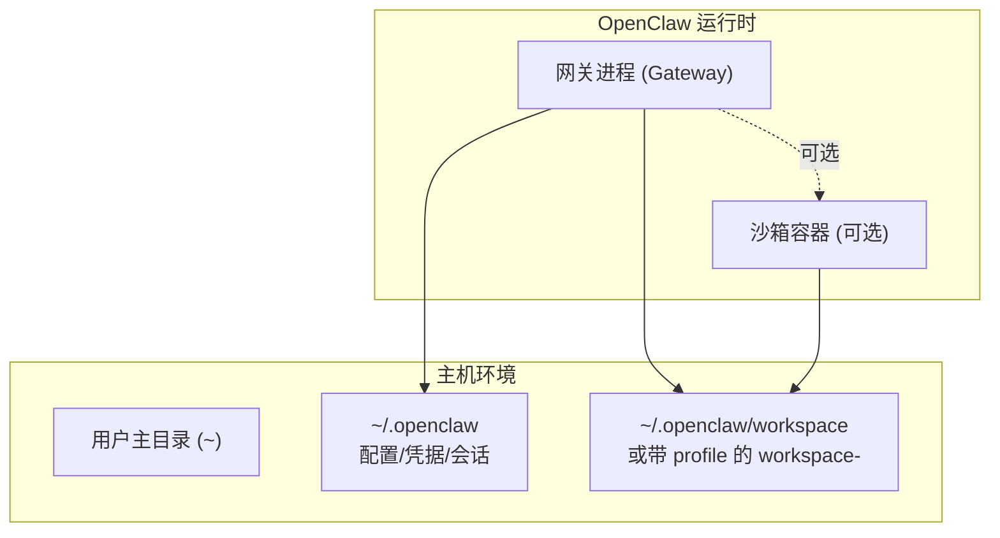
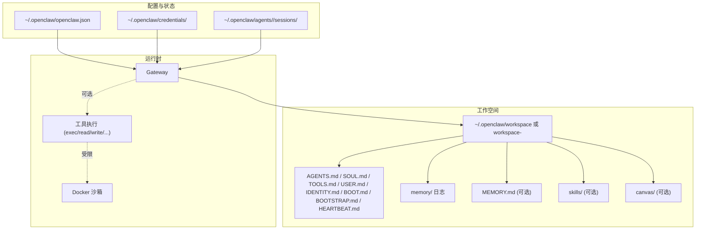
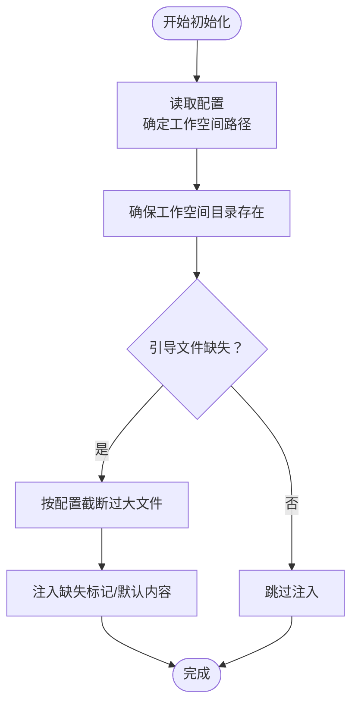
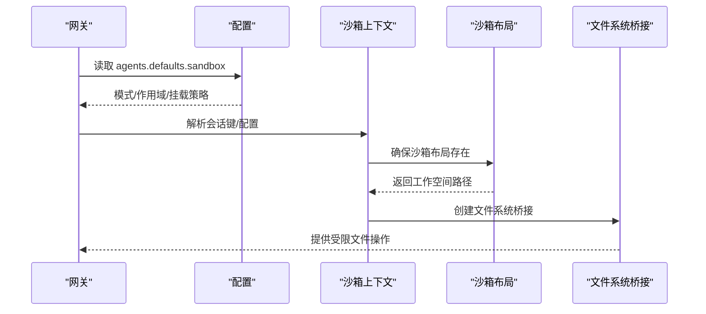
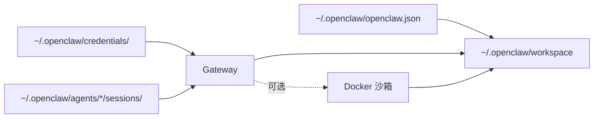

# 代理工作空间

<cite>
**本文引用的文件**
- [AGENTS.md](file://AGENTS.md)
- [SOUL.md 模板](file://docs/reference/templates/SOUL.md)
- [TOOLS.md 模板](file://docs/reference/templates/TOOLS.md)
- [agent-workspace 概念](file://docs/concepts/agent-workspace.md)
- [openclaw.mjs 入口脚本](file://openclaw.mjs)
- [Dockerfile.sandbox](file://Dockerfile.sandbox)
- [sandboxing 配置与行为](file://docs/gateway/sandboxing.md)
- [backup 备份 CLI](file://docs/cli/backup.md)
- [setup 初始化 CLI](file://docs/cli/setup.md)
- [workspace.ts 沙箱工作空间实现](file://src/agents/sandbox/workspace.ts)
- [context.ts 沙箱上下文与会话](file://src/agents/sandbox/context.ts)
- [workspace.test.ts 沙箱工作空间测试](file://src/agents/sandbox/workspace.test.ts)
- [AgentWorkspace.swift 模板生成（macOS）](file://apps/macos/Sources/OpenClaw/AgentWorkspace.swift)
</cite>

## 目录

1. [简介](#简介)
2. [项目结构](#项目结构)
3. [核心组件](#核心组件)
4. [架构总览](#架构总览)
5. [详细组件分析](#详细组件分析)
6. [依赖关系分析](#依赖关系分析)
7. [性能考量](#性能考量)
8. [故障排查指南](#故障排查指南)
9. [结论](#结论)
10. [附录](#附录)

## 简介

本文件面向 OpenClaw 代理工作空间（Agent Workspace），系统性阐述其组织结构、文件布局、初始化流程、文件注入机制、内容管理策略，以及在沙箱模式下的隔离与权限控制。同时提供配置示例、文件模板、最佳实践，以及备份、恢复与迁移的完整指南。

## 项目结构

OpenClaw 将“代理工作空间”与“全局配置/凭据/会话”目录分离，前者是代理的“家”，后者集中存放运行时状态与凭据。默认工作空间路径位于用户主目录下的专用子目录，并支持按配置文件进行覆盖；当启用沙箱时，工具执行与文件访问将被限制在受控范围内。

图示来源

- [agent-workspace 概念:24-42](file://docs/concepts/agent-workspace.md#L24-L42)
- [sandboxing 配置与行为:10-18](file://docs/gateway/sandboxing.md#L10-L18)

章节来源

- [agent-workspace 概念:11-42](file://docs/concepts/agent-workspace.md#L11-L42)

## 核心组件

- 工作空间根目录：默认位于 `~/.openclaw/workspace`，可通过配置文件覆盖；支持按 profile 切换后缀。
- 标准引导文件：AGENTS.md、SOUL.md、TOOLS.md、USER.md、IDENTITY.md、BOOT.md、BOOTSTRAP.md、HEARTBEAT.md 等。
- 日常记忆：按日切分的 memory/YYYY-MM-DD.md，以及可选的 MEMORY.md（仅主会话加载）。
- 可选扩展：skills/（本地技能覆盖）、canvas/（节点可视化界面）。
- 初始化与注入：首次运行或通过 CLI 自动注入缺失的引导文件；可配置最大注入字符数以避免过大文件影响注入。
- 沙箱模式：通过配置决定是否启用、作用域（会话/代理/共享）、工作空间挂载方式（只读/读写/无）及自定义绑定挂载。

章节来源

- [agent-workspace 概念:64-125](file://docs/concepts/agent-workspace.md#L64-L125)
- [setup 初始化 CLI:9-29](file://docs/cli/setup.md#L9-L29)

## 架构总览

下图展示工作空间在不同模式下的角色与交互：

图示来源

- [agent-workspace 概念:11-42](file://docs/concepts/agent-workspace.md#L11-L42)
- [sandboxing 配置与行为:10-18](file://docs/gateway/sandboxing.md#L10-L18)

## 详细组件分析

### 组件一：工作空间文件布局与职责

- AGENTS.md：工作空间使用说明、会话启动流程、记忆策略与安全默认值。
- SOUL.md：代理身份、语气、边界与一致性原则。
- USER.md：用户画像与称谓约定。
- IDENTITY.md：代理名称、风格与表情符号，由引导流程创建/更新。
- TOOLS.md：本地工具与约定的个人化笔记，不控制工具可用性。
- BOOT.md：启动检查清单（内部钩子启用时在网关重启时执行）。
- BOOTSTRAP.md：一次性首启仪式文件，完成后应删除。
- HEARTBEAT.md：心跳任务的简短清单。
- memory/YYYY-MM-DD.md：每日记忆日志，建议会话开始时读取当日与昨日。
- MEMORY.md（可选）：长期记忆，仅在主会话加载，避免泄露到群组/共享上下文。
- skills/（可选）：本地技能覆盖，与托管技能同名时优先。
- canvas/（可选）：节点显示的 Canvas UI 文件。

章节来源

- [agent-workspace 概念:64-125](file://docs/concepts/agent-workspace.md#L64-L125)
- [AGENTS.md:8-44](file://AGENTS.md#L8-L44)
- [SOUL.md 模板:8-44](file://docs/reference/templates/SOUL.md#L8-L44)
- [TOOLS.md 模板:8-48](file://docs/reference/templates/TOOLS.md#L8-L48)

### 组件二：初始化与文件注入机制

- 默认位置与覆盖：可通过配置文件设置工作空间路径；首次运行或通过 CLI 初始化时自动创建并注入缺失的引导文件。
- 注入策略：若引导文件缺失，系统会注入“缺失文件”标记并继续；大文件会被截断，可通过配置项调整最大注入字符数。
- 跳过引导：若已自行维护工作空间，可在配置中禁用引导文件的自动创建。
- 会话种子：在沙箱模式下，种子复制仅接受工作空间内的常规文件，忽略解析到工作空间外的符号链接/硬链接别名。

图示来源

- [agent-workspace 概念:39-50](file://docs/concepts/agent-workspace.md#L39-L50)
- [agent-workspace 概念:119-125](file://docs/concepts/agent-workspace.md#L119-L125)

章节来源

- [agent-workspace 概念:39-50](file://docs/concepts/agent-workspace.md#L39-L50)
- [agent-workspace 概念:119-125](file://docs/concepts/agent-workspace.md#L119-L125)

### 组件三：沙箱模式下的工作空间隔离与权限控制

- 启用与模式：通过配置控制是否启用沙箱，以及在何时启用（非主会话/全部会话）。
- 作用域：按会话、按代理或共享容器三种粒度。
- 工作空间访问：
  - none：工具看到的是沙箱内独立工作空间（位于用户目录下的沙箱根）。
  - ro：将宿主工作空间以只读方式挂载到容器内，禁用写/编辑/补丁应用。
  - rw：将宿主工作空间以读写方式挂载到容器内。
- 自定义绑定挂载：可将宿主目录以指定模式挂载进容器；敏感挂载建议只读；与工具策略和“提升执行”共同生效。
- 浏览器沙箱：可选的沙箱浏览器容器，具备网络与启动参数的安全默认值。
- 容器镜像：默认镜像不含 Node；如需运行时，可构建更通用的镜像或在容器内执行一次性安装命令。

图示来源

- [context.ts 沙箱上下文与会话:188-210](file://src/agents/sandbox/context.ts#L188-L210)
- [workspace.ts 沙箱工作空间实现:17-65](file://src/agents/sandbox/workspace.ts#L17-L65)
- [sandboxing 配置与行为:41-70](file://docs/gateway/sandboxing.md#L41-L70)

章节来源

- [sandboxing 配置与行为:10-18](file://docs/gateway/sandboxing.md#L10-L18)
- [sandboxing 配置与行为:41-70](file://docs/gateway/sandboxing.md#L41-L70)
- [workspace.ts 沙箱工作空间实现:17-65](file://src/agents/sandbox/workspace.ts#L17-L65)
- [workspace.test.ts 沙箱工作空间测试:22-35](file://src/agents/sandbox/workspace.test.ts#L22-L35)

### 组件四：入口与运行时要求

- 入口脚本负责检查 Node 版本、启用编译缓存、安装运行时警告过滤器，并尝试加载构建产物入口模块。
- 最低版本要求与提示信息在脚本中明确给出，确保运行时兼容性。

章节来源

- [openclaw.mjs 入口脚本:5-36](file://openclaw.mjs#L5-L36)
- [openclaw.mjs 入口脚本:83-90](file://openclaw.mjs#L83-L90)

### 组件五：容器基础镜像与工具链

- 提供一个最小化的 Debian 基础镜像，预装常用工具（bash、curl、git、jq、python3、ripgrep 等），用于沙箱环境。
- 该镜像默认不包含 Node；如需运行时，可参考沙箱通用脚本构建更完善的镜像。

章节来源

- [Dockerfile.sandbox:1-24](file://Dockerfile.sandbox#L1-L24)

### 组件六：文件模板与最佳实践

- AGENTS.md 模板：强调工作空间作为“家”的定位、首启流程、会话启动顺序与记忆策略。
- SOUL.md 模板：定义代理身份、边界与一致性原则，强调尊重隐私与谨慎对外行动。
- TOOLS.md 模板：记录本地工具与约定，强调与共享技能的分离，便于更新技能而不丢失个人配置。

章节来源

- [AGENTS.md 模板:8-44](file://docs/reference/templates/AGENTS.md#L8-L44)
- [SOUL.md 模板:8-44](file://docs/reference/templates/SOUL.md#L8-L44)
- [TOOLS.md 模板:8-48](file://docs/reference/templates/TOOLS.md#L8-L48)

### 组件七：macOS 模板生成与默认提示

- macOS 端提供默认模板生成逻辑，包含工作空间作为代理“家”的说明、备份建议、安全默认与每日记忆实践。

章节来源

- [AgentWorkspace.swift 模板生成（macOS）:158-193](file://apps/macos/Sources/OpenClaw/AgentWorkspace.swift#L158-L193)

## 依赖关系分析

- 工作空间与全局状态解耦：工作空间仅承载代理“记忆与日常”，全局状态承载配置、凭据与会话，避免误提交敏感信息。
- 沙箱对文件系统的约束：通过文件系统桥接与挂载策略，限制工具对宿主文件系统的访问范围。
- CLI 对初始化与备份的支持：提供一键初始化、备份归档与验证能力，便于迁移与灾难恢复。

图示来源

- [agent-workspace 概念:126-137](file://docs/concepts/agent-workspace.md#L126-L137)
- [sandboxing 配置与行为:10-18](file://docs/gateway/sandboxing.md#L10-L18)

章节来源

- [agent-workspace 概念:126-137](file://docs/concepts/agent-workspace.md#L126-L137)
- [sandboxing 配置与行为:10-18](file://docs/gateway/sandboxing.md#L10-L18)

## 性能考量

- 大型引导文件注入：可通过配置限制单文件与总量的最大注入字符数，避免注入超大文件导致性能问题。
- 备份体积：工作空间通常是备份体积的主要驱动因素；如需更快/更小的备份，可选择仅备份配置或排除工作空间。
- 沙箱镜像：默认镜像不含 Node；如需频繁运行脚本，建议构建通用镜像或在容器内执行一次性安装命令。

章节来源

- [agent-workspace 概念:119-125](file://docs/concepts/agent-workspace.md#L119-L125)
- [backup 备份 CLI:63-77](file://docs/cli/backup.md#L63-L77)
- [Dockerfile.sandbox:1-24](file://Dockerfile.sandbox#L1-L24)

## 故障排查指南

- 额外工作空间目录：若检测到多个工作空间目录，建议保留一个活动目录并清理其他目录，避免认证或状态漂移。
- 配置无效：当配置文件无效且仍希望备份除工作空间外的状态时，可使用仅备份配置的选项。
- 沙箱网络与绑定：若工具无法联网或无法访问宿主资源，检查网络模式、绑定挂载与只读设置；必要时调整为允许容器命名空间加入（仅在明确风险评估后启用）。
- 容器内环境变量：默认情况下容器不会继承宿主环境变量，需通过配置注入或自定义镜像解决。

章节来源

- [agent-workspace 概念:57-62](file://docs/concepts/agent-workspace.md#L57-L62)
- [backup 备份 CLI:49-61](file://docs/cli/backup.md#L49-L61)
- [sandboxing 配置与行为:185-231](file://docs/gateway/sandboxing.md#L185-L231)

## 结论

OpenClaw 的代理工作空间以“家”的概念组织代理的“记忆与日常”，并通过清晰的文件职责与初始化流程保障一致性。在沙箱模式下，工作空间的访问被严格限制，结合自定义绑定与网络策略，实现可控的隔离与权限控制。配合 CLI 的初始化与备份能力，用户可以安全地维护、迁移与恢复工作空间。

## 附录

### 配置示例与最佳实践

- 设置默认工作空间路径：在配置文件中设置 agents.defaults.workspace，或在首次运行时通过 CLI 指定。
- 跳过引导文件注入：若已自行维护工作空间，可在配置中开启跳过引导。
- 沙箱最小启用示例：启用非主会话沙箱、按会话作用域、无工作空间挂载，适合在保持主会话便利的同时降低风险。
- 备份策略：推荐将工作空间放入私有 Git 仓库；定期执行备份命令，必要时仅备份配置或排除工作空间以减小体积。

章节来源

- [agent-workspace 概念:29-50](file://docs/concepts/agent-workspace.md#L29-L50)
- [agent-workspace 概念:239-253](file://docs/concepts/agent-workspace.md#L239-L253)
- [backup 备份 CLI:13-21](file://docs/cli/backup.md#L13-L21)

### 备份、恢复与迁移指南

- 私有 Git 备份：在工作空间所在机器初始化私有仓库，添加关键文件并提交；后续增量更新即可。
- CLI 备份归档：使用备份命令创建本地压缩归档，包含状态、配置、凭据与可选工作空间；支持验证与仅配置备份。
- 迁移到新机器：在目标机克隆仓库至默认路径，设置配置中的工作空间路径，运行初始化命令以补齐缺失文件；如需会话历史，单独从旧机复制会话目录。

章节来源

- [agent-workspace 概念:138-230](file://docs/concepts/agent-workspace.md#L138-L230)
- [backup 备份 CLI:34-47](file://docs/cli/backup.md#L34-L47)
