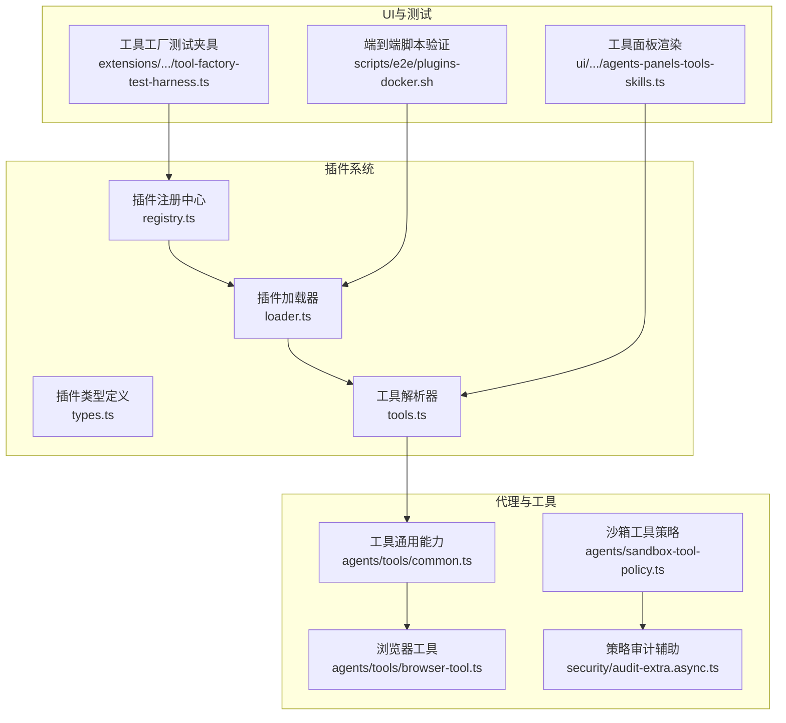
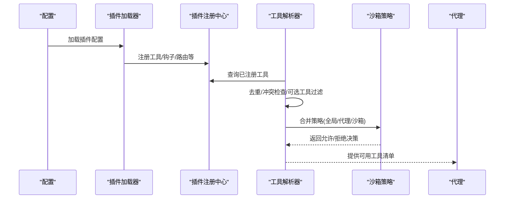
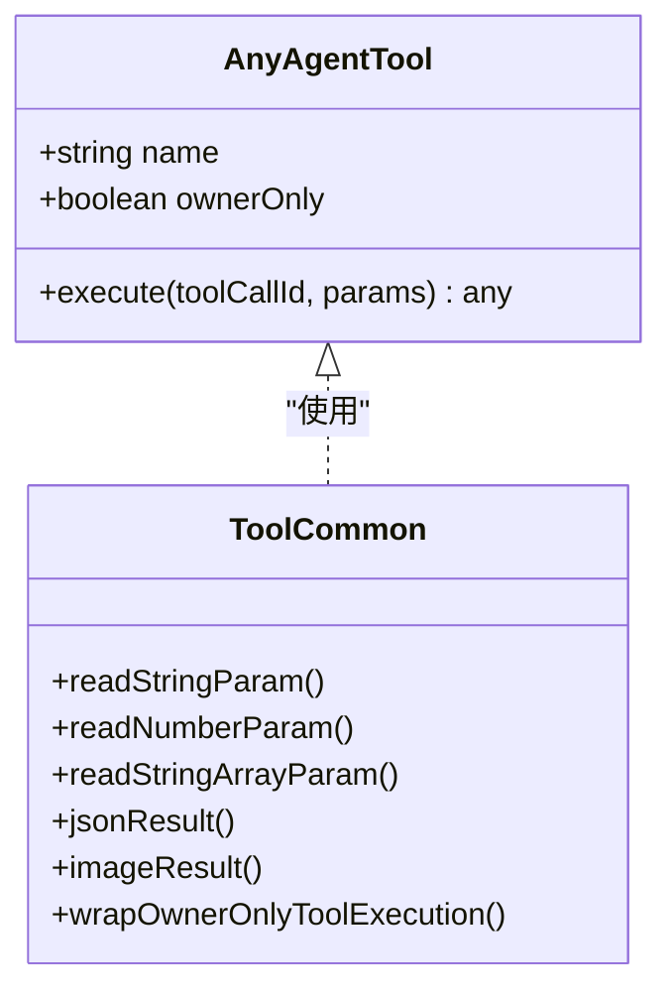
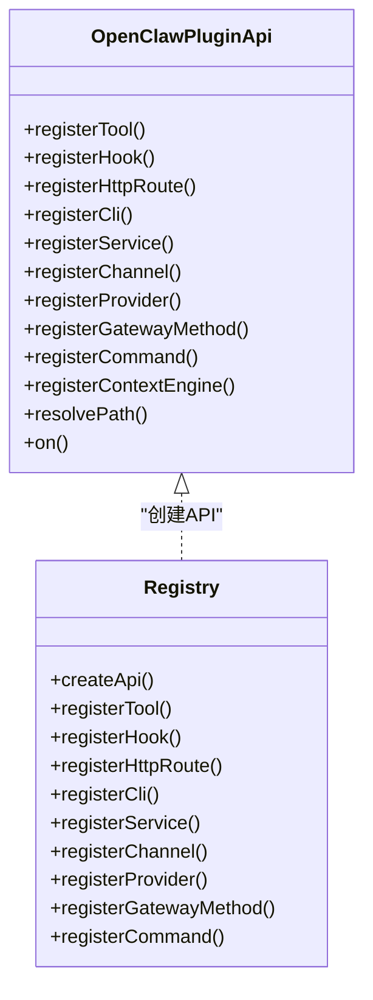
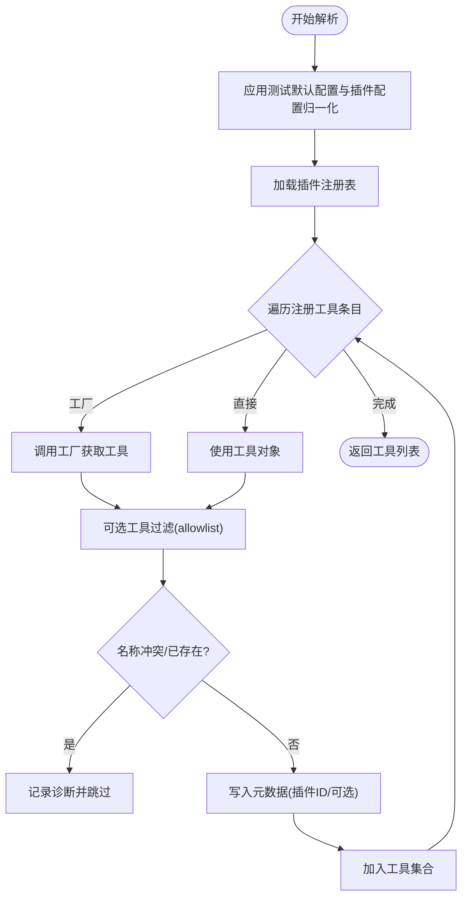
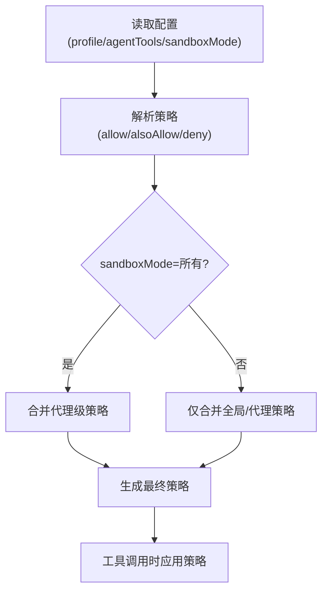
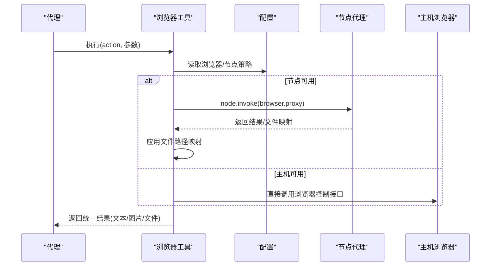
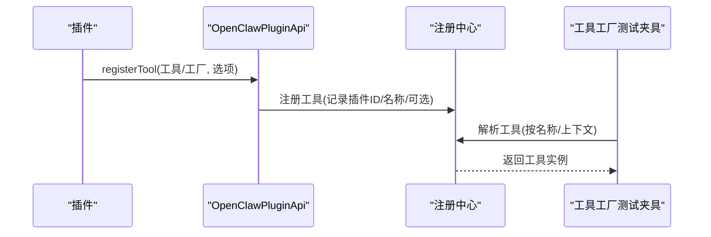
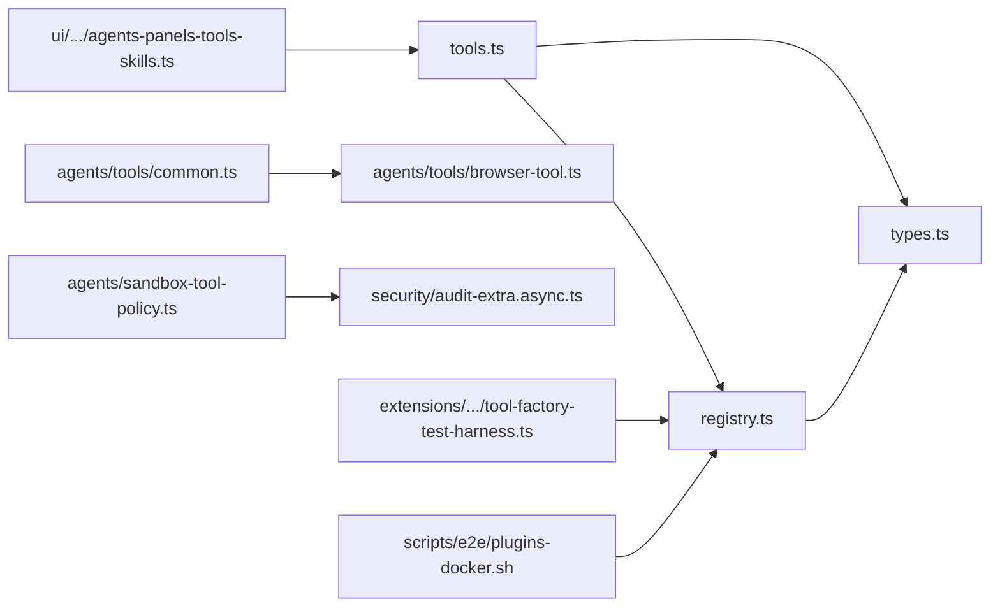

# 代理工具系统

<cite>
**本文档引用的文件**
- [src/plugins/tools.ts](file://src/plugins/tools.ts)
- [src/plugins/registry.ts](file://src/plugins/registry.ts)
- [src/plugins/types.ts](file://src/plugins/types.ts)
- [src/agents/tools/common.ts](file://src/agents/tools/common.ts)
- [src/agents/sandbox-tool-policy.ts](file://src/agents/sandbox-tool-policy.ts)
- [src/security/audit-extra.async.ts](file://src/security/audit-extra.async.ts)
- [src/agents/tools/browser-tool.ts](file://src/agents/tools/browser-tool.ts)
- [src/plugins/loader.ts](file://src/plugins/loader.ts)
- [src/plugins/tools.optional.test.ts](file://src/plugins/tools.optional.test.ts)
- [scripts/e2e/plugins-docker.sh](file://scripts/e2e/plugins-docker.sh)
- [extensions/feishu/src/tool-factory-test-harness.ts](file://extensions/feishu/src/tool-factory-test-harness.ts)
- [ui/src/ui/views/agents-panels-tools-skills.ts](file://ui/src/ui/views/agents-panels-tools-skills.ts)
</cite>

## 目录

1. [简介](#简介)
2. [项目结构](#项目结构)
3. [核心组件](#核心组件)
4. [架构总览](#架构总览)
5. [详细组件分析](#详细组件分析)
6. [依赖关系分析](#依赖关系分析)
7. [性能考虑](#性能考虑)
8. [故障排除指南](#故障排除指南)
9. [结论](#结论)
10. [附录](#附录)

## 简介

本文件面向OpenClaw代理工具系统，提供从架构到实现细节的完整技术文档。内容涵盖工具系统的设计理念、工具分类与调用机制、内置工具功能与使用方式、工具策略与权限控制、自定义工具开发与集成流程，以及最佳实践、性能优化与错误处理建议。文档同时给出工具目录、配置与测试的完整说明，并通过图示展示工具调用的端到端流程。

## 项目结构

OpenClaw将“工具”抽象为可被代理调用的原子能力单元，支持内置工具与插件扩展工具两类来源。系统通过插件注册中心统一管理工具、钩子、通道、网关方法等扩展点；在运行时根据配置与沙箱策略解析并构建可用工具集。

**图表来源**

- [src/plugins/registry.ts](file://src/plugins/registry.ts)
- [src/plugins/loader.ts](file://src/plugins/loader.ts)
- [src/plugins/types.ts](file://src/plugins/types.ts)
- [src/plugins/tools.ts](file://src/plugins/tools.ts)
- [src/agents/tools/common.ts](file://src/agents/tools/common.ts)
- [src/agents/tools/browser-tool.ts](file://src/agents/tools/browser-tool.ts)
- [src/agents/sandbox-tool-policy.ts](file://src/agents/sandbox-tool-policy.ts)
- [src/security/audit-extra.async.ts](file://src/security/audit-extra.async.ts)
- [ui/src/ui/views/agents-panels-tools-skills.ts](file://ui/src/ui/views/agents-panels-tools-skills.ts)
- [extensions/feishu/src/tool-factory-test-harness.ts](file://extensions/feishu/src/tool-factory-test-harness.ts)
- [scripts/e2e/plugins-docker.sh](file://scripts/e2e/plugins-docker.sh)

**章节来源**

- [src/plugins/registry.ts](file://src/plugins/registry.ts)
- [src/plugins/loader.ts](file://src/plugins/loader.ts)
- [src/plugins/types.ts](file://src/plugins/types.ts)
- [src/plugins/tools.ts](file://src/plugins/tools.ts)
- [src/agents/tools/common.ts](file://src/agents/tools/common.ts)
- [src/agents/sandbox-tool-policy.ts](file://src/agents/sandbox-tool-policy.ts)
- [src/security/audit-extra.async.ts](file://src/security/audit-extra.async.ts)
- [ui/src/ui/views/agents-panels-tools-skills.ts](file://ui/src/ui/views/agents-panels-tools-skills.ts)
- [extensions/feishu/src/tool-factory-test-harness.ts](file://extensions/feishu/src/tool-factory-test-harness.ts)
- [scripts/e2e/plugins-docker.sh](file://scripts/e2e/plugins-docker.sh)

## 核心组件

- 工具接口与通用能力：定义工具的最小契约（名称、执行函数）及输入参数解析、结果封装、权限拦截等通用能力。
- 插件注册中心：集中管理工具、钩子、HTTP路由、CLI命令、服务等扩展点，并提供API供插件注册。
- 工具解析器：基于配置与上下文，扫描已加载插件，生成最终可用工具列表，处理可选工具与命名冲突。
- 沙箱与策略：提供允许/拒绝白名单、附加允许策略与代理级策略合并，支持按代理维度细化。
- 内置工具：如浏览器工具，提供复杂动作编排与节点代理能力。
- UI与测试：工具面板渲染与工具工厂测试夹具，便于调试与验证。

**章节来源**

- [src/agents/tools/common.ts](file://src/agents/tools/common.ts)
- [src/plugins/registry.ts](file://src/plugins/registry.ts)
- [src/plugins/tools.ts](file://src/plugins/tools.ts)
- [src/agents/sandbox-tool-policy.ts](file://src/agents/sandbox-tool-policy.ts)
- [src/agents/tools/browser-tool.ts](file://src/agents/tools/browser-tool.ts)

## 架构总览

OpenClaw采用“插件即扩展”的架构。插件通过注册API向系统声明工具；运行时由工具解析器统一收集并去重，结合沙箱策略进行过滤与授权，最终形成代理可用的工具集合。

**图表来源**

- [src/plugins/loader.ts](file://src/plugins/loader.ts)
- [src/plugins/registry.ts](file://src/plugins/registry.ts)
- [src/plugins/tools.ts](file://src/plugins/tools.ts)
- [src/agents/sandbox-tool-policy.ts](file://src/agents/sandbox-tool-policy.ts)

## 详细组件分析

### 工具接口与通用能力

- 工具契约：每个工具至少包含名称与执行函数；可选ownerOnly字段用于限制仅所有者可调用。
- 输入参数解析：提供字符串、数字、数组、反应参数等多种读取器，支持蛇形键兼容与必填校验。
- 结果封装：统一返回文本+可选图片的结果格式，并支持图片净化与路径映射。
- 权限拦截：当senderIsOwner为false且工具标记为ownerOnly时，拦截执行并抛出错误。

**图表来源**

- [src/agents/tools/common.ts](file://src/agents/tools/common.ts)

**章节来源**

- [src/agents/tools/common.ts](file://src/agents/tools/common.ts)

### 插件注册中心与API

- 注册能力：工具、钩子、HTTP路由、CLI命令、服务、通道、提供者、网关方法等。
- API能力：插件通过OpenClawPluginApi注册工具（支持单个或工厂函数）、注册钩子、注册HTTP路由、注册CLI命令、注册服务、注册通道与提供者、注册网关方法、注册上下文引擎、路径解析、生命周期钩子等。
- 诊断与冲突：对重复注册、冲突、非法配置等进行诊断记录。

**图表来源**

- [src/plugins/types.ts](file://src/plugins/types.ts)
- [src/plugins/registry.ts](file://src/plugins/registry.ts)

**章节来源**

- [src/plugins/types.ts](file://src/plugins/types.ts)
- [src/plugins/registry.ts](file://src/plugins/registry.ts)

### 工具解析与可选工具策略

- 解析流程：应用测试默认配置与插件配置归一化，加载插件注册表，遍历注册工具条目，调用工厂或直接使用工具对象，进行名称规范化与冲突检查，收集元数据（插件ID、是否可选）。
- 可选工具：当allowlist为空时默认跳过可选工具；可通过工具名、插件ID或group:plugins允许特定可选工具。
- 冲突处理：当插件ID与核心工具同名或工具名重复时，记录诊断并阻止注册（除非显式抑制冲突）。

**图表来源**

- [src/plugins/tools.ts](file://src/plugins/tools.ts)

**章节来源**

- [src/plugins/tools.ts](file://src/plugins/tools.ts)
- [src/plugins/tools.optional.test.ts](file://src/plugins/tools.optional.test.ts)

### 沙箱与工具策略

- 策略来源：全局工具配置、代理工具配置、沙箱模式下的代理级策略。
- 合并与生效：allow与alsoAllow合并为允许集；deny为拒绝集；支持通配符“\*”作为隐式全量允许的补充。
- 审计与合并：提供策略解析与合并逻辑，支持按代理维度细化策略。

**图表来源**

- [src/agents/sandbox-tool-policy.ts](file://src/agents/sandbox-tool-policy.ts)
- [src/security/audit-extra.async.ts](file://src/security/audit-extra.async.ts)

**章节来源**

- [src/agents/sandbox-tool-policy.ts](file://src/agents/sandbox-tool-policy.ts)
- [src/security/audit-extra.async.ts](file://src/security/audit-extra.async.ts)

### 内置工具：浏览器工具

- 功能概览：支持状态查询、启动/停止、标签页管理、打开/聚焦/关闭、快照/截图、导航、控制台、PDF导出、上传/对话框钩子、动作编排等。
- 节点代理：当存在具备浏览器能力的节点时，自动路由至节点代理，避免主机环境限制。
- 结果封装：截图与PDF导出返回图片或文件路径，统一经通用封装输出。

**图表来源**

- [src/agents/tools/browser-tool.ts](file://src/agents/tools/browser-tool.ts)

**章节来源**

- [src/agents/tools/browser-tool.ts](file://src/agents/tools/browser-tool.ts)

### 自定义工具开发与集成

- 开发流程：在插件中通过OpenClawPluginApi.registerTool注册工具或工具工厂；工具可为单个对象或工厂函数，后者可按上下文动态生成工具集合。
- 工厂测试夹具：提供工具工厂测试夹具，便于在测试环境中解析与验证工具。
- 集成模式：工具随插件加载后由工具解析器统一收集，遵循命名规范与冲突处理规则。

**图表来源**

- [src/plugins/registry.ts](file://src/plugins/registry.ts)
- [src/plugins/types.ts](file://src/plugins/types.ts)
- [extensions/feishu/src/tool-factory-test-harness.ts](file://extensions/feishu/src/tool-factory-test-harness.ts)

**章节来源**

- [src/plugins/registry.ts](file://src/plugins/registry.ts)
- [src/plugins/types.ts](file://src/plugins/types.ts)
- [extensions/feishu/src/tool-factory-test-harness.ts](file://extensions/feishu/src/tool-factory-test-harness.ts)

### 工具目录与UI呈现

- 工具目录：插件加载后会列出工具名称，配合UI工具面板进行分组与筛选展示。
- UI交互：支持按关键字过滤、启用/禁用、允许列表控制等操作，便于管理员对工具进行可视化管理。

**章节来源**

- [scripts/e2e/plugins-docker.sh](file://scripts/e2e/plugins-docker.sh)
- [ui/src/ui/views/agents-panels-tools-skills.ts](file://ui/src/ui/views/agents-panels-tools-skills.ts)

## 依赖关系分析

- 组件耦合：工具解析器依赖插件加载器与注册中心；工具通用能力被具体工具实现复用；沙箱策略与审计模块为工具调用提供安全边界。
- 外部依赖：浏览器工具依赖节点代理与主机浏览器控制接口；UI依赖工具报告与配置状态。

**图表来源**

- [src/plugins/tools.ts](file://src/plugins/tools.ts)
- [src/plugins/registry.ts](file://src/plugins/registry.ts)
- [src/plugins/types.ts](file://src/plugins/types.ts)
- [src/agents/tools/common.ts](file://src/agents/tools/common.ts)
- [src/agents/tools/browser-tool.ts](file://src/agents/tools/browser-tool.ts)
- [src/agents/sandbox-tool-policy.ts](file://src/agents/sandbox-tool-policy.ts)
- [src/security/audit-extra.async.ts](file://src/security/audit-extra.async.ts)
- [ui/src/ui/views/agents-panels-tools-skills.ts](file://ui/src/ui/views/agents-panels-tools-skills.ts)
- [extensions/feishu/src/tool-factory-test-harness.ts](file://extensions/feishu/src/tool-factory-test-harness.ts)
- [scripts/e2e/plugins-docker.sh](file://scripts/e2e/plugins-docker.sh)

**章节来源**

- [src/plugins/tools.ts](file://src/plugins/tools.ts)
- [src/plugins/registry.ts](file://src/plugins/registry.ts)
- [src/plugins/types.ts](file://src/plugins/types.ts)
- [src/agents/tools/common.ts](file://src/agents/tools/common.ts)
- [src/agents/tools/browser-tool.ts](file://src/agents/tools/browser-tool.ts)
- [src/agents/sandbox-tool-policy.ts](file://src/agents/sandbox-tool-policy.ts)
- [src/security/audit-extra.async.ts](file://src/security/audit-extra.async.ts)
- [ui/src/ui/views/agents-panels-tools-skills.ts](file://ui/src/ui/views/agents-panels-tools-skills.ts)
- [extensions/feishu/src/tool-factory-test-harness.ts](file://extensions/feishu/src/tool-factory-test-harness.ts)
- [scripts/e2e/plugins-docker.sh](file://scripts/e2e/plugins-docker.sh)

## 性能考虑

- 快路径优化：当插件系统整体禁用时，工具解析器直接返回空列表，避免不必要的发现与JIT加载开销。
- 工具构造热路径：通过测试默认配置与插件配置归一化减少重复计算。
- 节点代理：在具备节点代理能力时优先使用，降低主机资源占用与跨进程通信成本。
- 图片与文件处理：统一进行图片净化与路径映射，避免重复I/O与不必要转换。

[本节为通用指导，无需“章节来源”]

## 故障排除指南

- 工具未出现：确认插件已正确加载并在插件列表中可见；检查工具名称与允许列表匹配。
- 工具冲突：查看诊断日志中的冲突提示，修正工具名称或插件ID；必要时抑制冲突以继续排查。
- 可选工具未加载：确认allowlist包含目标工具名、插件ID或group:plugins；检查插件是否标记为可选。
- 浏览器工具异常：检查浏览器启用状态、节点代理可用性与目标选择；确认profile与target设置合理。
- 权限问题：若工具标记为ownerOnly，请确保调用方为所有者；否则将被拦截。

**章节来源**

- [src/plugins/tools.ts](file://src/plugins/tools.ts)
- [src/plugins/tools.optional.test.ts](file://src/plugins/tools.optional.test.ts)
- [src/agents/tools/browser-tool.ts](file://src/agents/tools/browser-tool.ts)
- [src/agents/tools/common.ts](file://src/agents/tools/common.ts)

## 结论

OpenClaw代理工具系统通过插件化架构实现了高度可扩展的工具生态。工具解析器与注册中心保证了工具的统一管理与安全控制，沙箱策略与审计模块提供了细粒度的安全边界。内置工具（如浏览器工具）展示了复杂动作编排与节点代理的能力。开发者可通过OpenClawPluginApi快速扩展工具，配合测试夹具与UI工具面板实现高效开发与运维。

[本节为总结，无需“章节来源”]

## 附录

### 工具配置参考

- 工具策略配置项：允许列表、附加允许、拒绝列表、代理级策略、沙箱模式等。
- 插件配置：插件启用/禁用、插件入口、配置模式与UI提示等。

**章节来源**

- [src/agents/sandbox-tool-policy.ts](file://src/agents/sandbox-tool-policy.ts)
- [src/security/audit-extra.async.ts](file://src/security/audit-extra.async.ts)
- [src/plugins/types.ts](file://src/plugins/types.ts)

### 工具调用示例（步骤）

- 步骤1：插件通过OpenClawPluginApi.registerTool注册工具或工厂。
- 步骤2：工具解析器加载插件并收集工具，进行去重与冲突检查。
- 步骤3：合并沙箱与代理策略，生成最终可用工具清单。
- 步骤4：代理在会话中调用工具，工具执行并返回结果。

**章节来源**

- [src/plugins/registry.ts](file://src/plugins/registry.ts)
- [src/plugins/tools.ts](file://src/plugins/tools.ts)
- [src/agents/tools/browser-tool.ts](file://src/agents/tools/browser-tool.ts)
