# 会话管理工具

<cite>
**本文档引用的文件**
- [src/config/sessions.ts](file://src/config/sessions.ts)
- [src/config/sessions/session-key.ts](file://src/config/sessions/session-key.ts)
- [src/config/sessions/store.ts](file://src/config/sessions/store.ts)
- [src/config/sessions/types.ts](file://src/config/sessions/types.ts)
- [src/commands/agent/session.ts](file://src/commands/agent/session.ts)
- [src/gateway/server-methods/send.ts](file://src/gateway/server-methods/send.ts)
- [src/infra/outbound/targets.ts](file://src/infra/outbound/targets.ts)
- [src/infra/outbound/agent-delivery.ts](file://src/infra/outbound/agent-delivery.ts)
- [src/agents/tools/sessions-history-tool.ts](file://src/agents/tools/sessions-history-tool.ts)
- [src/tui/tui-session-actions.ts](file://src/tui/tui-session-actions.ts)
- [src/acp/session-mapper.ts](file://src/acp/session-mapper.ts)
- [src/agents/pi-extensions/session-manager-runtime-registry.ts](file://src/agents/pi-extensions/session-manager-runtime-registry.ts)
- [src/web/auto-reply/heartbeat-runner.ts](file://src/web/auto-reply/heartbeat-runner.ts)
- [src/config/sessions/store-maintenance.ts](file://src/config/sessions/store-maintenance.ts)
- [src/commands/status.ts](file://src/commands/status.ts)
- [src/ui/controllers/usage.ts](file://src/ui/controllers/usage.ts)
</cite>

## 目录

1. [简介](#简介)
2. [项目结构](#项目结构)
3. [核心组件](#核心组件)
4. [架构总览](#架构总览)
5. [详细组件分析](#详细组件分析)
6. [依赖关系分析](#依赖关系分析)
7. [性能考量](#性能考量)
8. [故障排查指南](#故障排查指南)
9. [结论](#结论)
10. [附录](#附录)

## 简介

本文件系统化梳理 OpenClaw 的会话管理工具，覆盖会话创建与解析、消息路由与目标选择、会话生成与生命周期管理、会话历史查询与数据管理、会话状态监控与同步等关键能力，并给出配置项、使用场景、集成方式、性能优化与并发控制、以及错误恢复机制的说明，帮助开发者与运维人员高效、安全地使用与扩展会话管理能力。

## 项目结构

围绕会话管理的关键模块分布如下：

- 配置与类型：会话键规则、存储结构、运行时字段与合并策略
- 命令层：请求级会话解析与新会话生成
- 网关层：发送接口的会话派生与镜像写入
- 出站通道：目标解析、心跳路由与发送上下文
- 工具层：会话历史查询与可见性控制
- TUI/前端：会话历史加载与展示
- ACP：会话映射与重置
- 运行时注册表：会话作用域的运行时缓存
- 心跳与状态：会话快照与状态更新
- 维护与缓存：磁盘配额、清理、缓存与锁队列

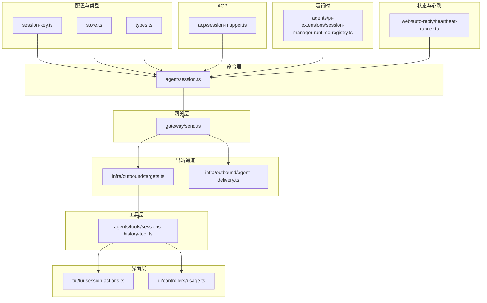

**图表来源**

- [src/config/sessions/session-key.ts:1-49](file://src/config/sessions/session-key.ts#L1-L49)
- [src/config/sessions/store.ts:1-800](file://src/config/sessions/store.ts#L1-L800)
- [src/config/sessions/types.ts:1-380](file://src/config/sessions/types.ts#L1-L380)
- [src/commands/agent/session.ts:1-173](file://src/commands/agent/session.ts#L1-L173)
- [src/gateway/server-methods/send.ts:1-482](file://src/gateway/server-methods/send.ts#L1-L482)
- [src/infra/outbound/targets.ts:1-549](file://src/infra/outbound/targets.ts#L1-L549)
- [src/infra/outbound/agent-delivery.ts:1-179](file://src/infra/outbound/agent-delivery.ts#L1-L179)
- [src/agents/tools/sessions-history-tool.ts:1-271](file://src/agents/tools/sessions-history-tool.ts#L1-L271)
- [src/tui/tui-session-actions.ts:279-315](file://src/tui/tui-session-actions.ts#L279-L315)
- [src/ui/controllers/usage.ts:270-315](file://src/ui/controllers/usage.ts#L270-L315)
- [src/acp/session-mapper.ts:38-98](file://src/acp/session-mapper.ts#L38-L98)
- [src/agents/pi-extensions/session-manager-runtime-registry.ts:1-29](file://src/agents/pi-extensions/session-manager-runtime-registry.ts#L1-L29)
- [src/web/auto-reply/heartbeat-runner.ts:78-116](file://src/web/auto-reply/heartbeat-runner.ts#L78-L116)

**章节来源**

- [src/config/sessions.ts:1-14](file://src/config/sessions.ts#L1-L14)

## 核心组件

- 会话键与作用域：根据消息上下文与配置决定 per-sender 或 global 会话键；支持组会话隔离与主会话桶归一。
- 会话存储与缓存：原子写入、缓存 TTL、迁移、磁盘配额、过期清理、文件轮转与并发锁队列。
- 会话解析与生成：从请求参数、显式键、消息来源推导会话键，评估新鲜度与重置策略，生成新会话 ID。
- 消息路由与目标选择：基于会话历史、通道能力与 allowFrom 规则解析目标；支持心跳路由与线程话题。
- 会话历史工具：安全裁剪与脱敏，限制返回大小，支持工具消息过滤与硬上限保护。
- 会话状态与心跳：会话快照、重置策略、状态更新与日志记录。
- ACP 映射与重置：通过标签或键解析会话，必要时触发重置。
- 运行时注册表：以会话管理器对象为键的弱映射，实现会话作用域的运行时缓存。

**章节来源**

- [src/config/sessions/session-key.ts:1-49](file://src/config/sessions/session-key.ts#L1-L49)
- [src/config/sessions/store.ts:1-800](file://src/config/sessions/store.ts#L1-L800)
- [src/commands/agent/session.ts:111-173](file://src/commands/agent/session.ts#L111-L173)
- [src/infra/outbound/targets.ts:65-168](file://src/infra/outbound/targets.ts#L65-L168)
- [src/agents/tools/sessions-history-tool.ts:169-271](file://src/agents/tools/sessions-history-tool.ts#L169-L271)
- [src/web/auto-reply/heartbeat-runner.ts:78-116](file://src/web/auto-reply/heartbeat-runner.ts#L78-L116)
- [src/acp/session-mapper.ts:38-98](file://src/acp/session-mapper.ts#L38-L98)
- [src/agents/pi-extensions/session-manager-runtime-registry.ts:1-29](file://src/agents/pi-extensions/session-manager-runtime-registry.ts#L1-L29)

## 架构总览

下图展示从请求到会话解析、目标选择、发送与历史查询的端到端流程。

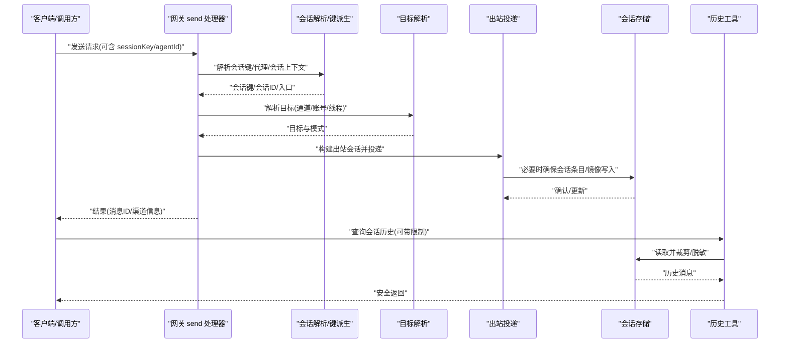

**图表来源**

- [src/gateway/server-methods/send.ts:90-331](file://src/gateway/server-methods/send.ts#L90-L331)
- [src/commands/agent/session.ts:111-173](file://src/commands/agent/session.ts#L111-L173)
- [src/infra/outbound/targets.ts:170-238](file://src/infra/outbound/targets.ts#L170-L238)
- [src/config/sessions/store.ts:511-533](file://src/config/sessions/store.ts#L511-L533)
- [src/agents/tools/sessions-history-tool.ts:235-270](file://src/agents/tools/sessions-history-tool.ts#L235-L270)

## 详细组件分析

### 会话创建与管理（命令层）

- 会话键派生：支持 per-sender/global 作用域、组会话隔离、主会话桶归一。
- 会话解析：从显式键、消息来源、代理 ID 推导；在多代理存储间回退查找；评估新鲜度与重置策略；生成新会话 ID。
- 生命周期：记录思考/详细级别持久化、会话滚动时清理引导快照。

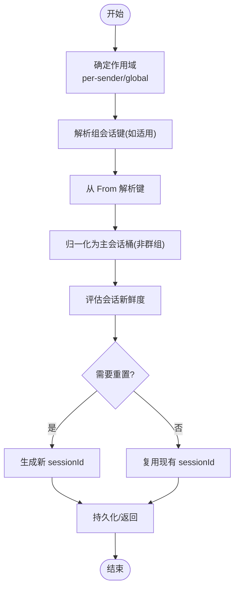

**图表来源**

- [src/config/sessions/session-key.ts:13-48](file://src/config/sessions/session-key.ts#L13-L48)
- [src/commands/agent/session.ts:111-173](file://src/commands/agent/session.ts#L111-L173)

**章节来源**

- [src/config/sessions/session-key.ts:1-49](file://src/config/sessions/session-key.ts#L1-L49)
- [src/commands/agent/session.ts:1-173](file://src/commands/agent/session.ts#L1-L173)

### 消息路由与目标选择（出站通道）

- 会话级目标解析：优先使用 lastChannel/lastTo，支持显式 to、线程话题、允许的 allowFrom 列表。
- 心跳路由：按配置选择 none/last/指定通道；校验账号可用性与直聊策略；推导 sender。
- 通道插件解析：调用插件的 resolveTarget 与 resolveDefaultTo，缺失时返回友好错误。

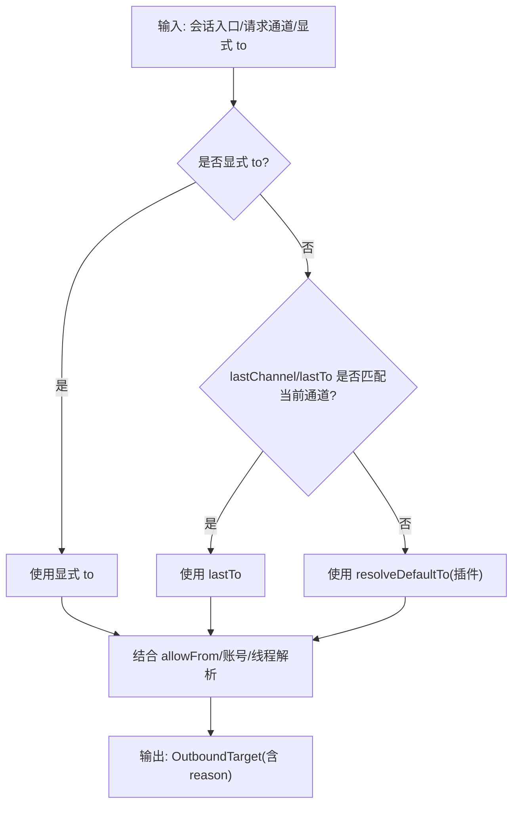

**图表来源**

- [src/infra/outbound/targets.ts:65-168](file://src/infra/outbound/targets.ts#L65-L168)
- [src/infra/outbound/targets.ts:240-370](file://src/infra/outbound/targets.ts#L240-L370)

**章节来源**

- [src/infra/outbound/targets.ts:1-549](file://src/infra/outbound/targets.ts#L1-L549)

### 会话发送工具（网关层）

- 发送处理器：参数校验、去重缓存、请求通道解析、目标解析、会话上下文构建、镜像写入。
- 会话派生：当未提供 sessionKey 时，基于路由推导目标会话并确保存在。
- 结果封装：返回消息 ID、渠道、聊天/频道标识等元信息。

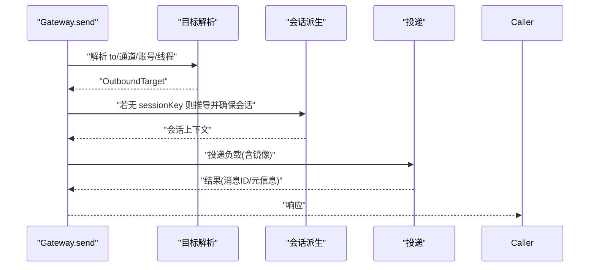

**图表来源**

- [src/gateway/server-methods/send.ts:90-331](file://src/gateway/server-methods/send.ts#L90-L331)

**章节来源**

- [src/gateway/server-methods/send.ts:1-482](file://src/gateway/server-methods/send.ts#L1-L482)

### 会话生成工具（会话解析与存储）

- 存储加载：缓存命中优先；空文件/锁读取容错；序列化缓存；迁移应用。
- 并发控制：写锁队列，避免竞态；失败重试；Windows 特殊写入策略。
- 维护策略：过期清理、数量封顶、磁盘配额、归档与轮转；警告模式保护活动会话。
- 入口更新：合并运行时模型字段、交付上下文标准化；持久化并清理遗留键。

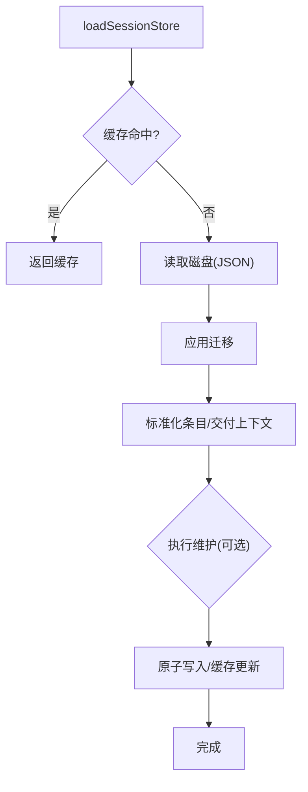

**图表来源**

- [src/config/sessions/store.ts:195-270](file://src/config/sessions/store.ts#L195-L270)
- [src/config/sessions/store.ts:340-509](file://src/config/sessions/store.ts#L340-L509)

**章节来源**

- [src/config/sessions/store.ts:1-800](file://src/config/sessions/store.ts#L1-L800)

### 会话历史工具（历史记录、查询与数据管理）

- 可见性与沙箱：请求者上下文、代理对代理策略、会话可见性检查。
- 查询与裁剪：限制条数、过滤工具消息、按 JSON 字节上限裁剪、硬上限保护。
- 脱敏与截断：内容长度与敏感信息脱敏，图片/签名等字段剔除或标记省略。

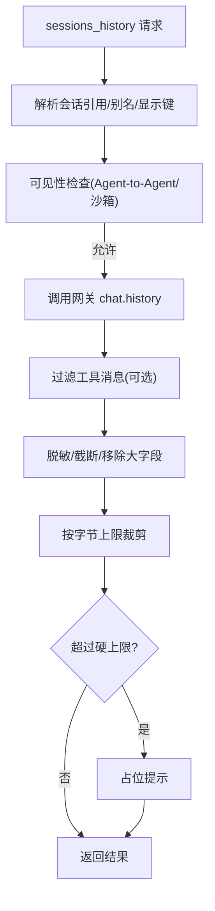

**图表来源**

- [src/agents/tools/sessions-history-tool.ts:169-271](file://src/agents/tools/sessions-history-tool.ts#L169-L271)

**章节来源**

- [src/agents/tools/sessions-history-tool.ts:1-271](file://src/agents/tools/sessions-history-tool.ts#L1-L271)

### 会话状态工具（状态监控、更新与同步）

- 会话快照：心跳运行时生成会话快照，记录键、会话 ID、新鲜度、重置策略与到期时间。
- 状态更新：心跳运行器更新会话条目中的 sessionId 与 updatedAt。
- 界面集成：TUI 加载历史并渲染；UI 控制台加载用量时间序列与日志。

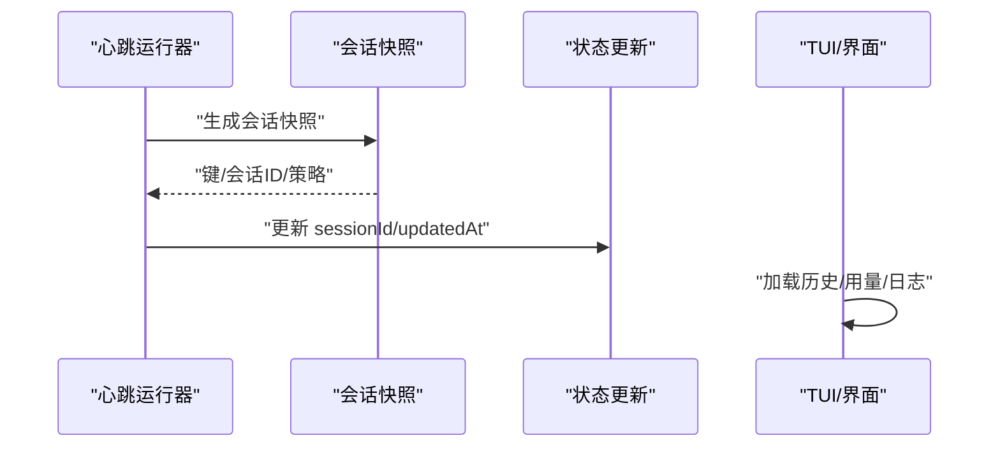

**图表来源**

- [src/web/auto-reply/heartbeat-runner.ts:78-116](file://src/web/auto-reply/heartbeat-runner.ts#L78-L116)
- [src/tui/tui-session-actions.ts:279-315](file://src/tui/tui-session-actions.ts#L279-L315)
- [src/ui/controllers/usage.ts:270-315](file://src/ui/controllers/usage.ts#L270-L315)

**章节来源**

- [src/web/auto-reply/heartbeat-runner.ts:78-116](file://src/web/auto-reply/heartbeat-runner.ts#L78-L116)
- [src/tui/tui-session-actions.ts:279-315](file://src/tui/tui-session-actions.ts#L279-L315)
- [src/ui/controllers/usage.ts:270-315](file://src/ui/controllers/usage.ts#L270-L315)

### ACP 会话映射与重置

- 标签/键解析：支持通过标签或键解析会话，可要求已存在。
- 条件重置：根据元数据或全局选项触发 sessions.reset。

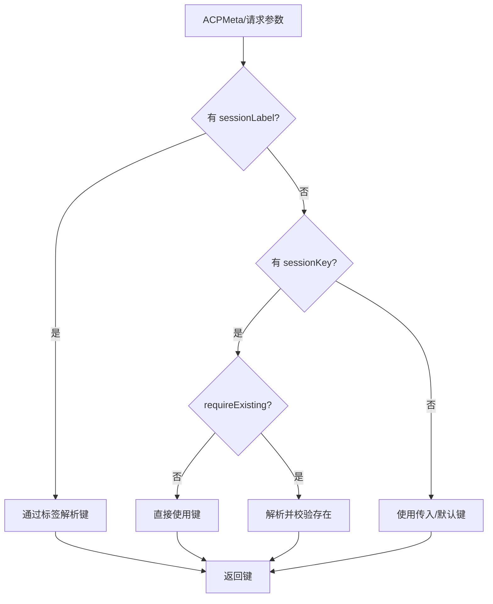

**图表来源**

- [src/acp/session-mapper.ts:38-98](file://src/acp/session-mapper.ts#L38-L98)

**章节来源**

- [src/acp/session-mapper.ts:38-98](file://src/acp/session-mapper.ts#L38-L98)

### 会话管理器运行时注册表

- 会话作用域缓存：以会话管理器对象为键的 WeakMap，保证同一实例稳定访问。
- 生命周期：set(null) 清理；get 不存在返回 null。

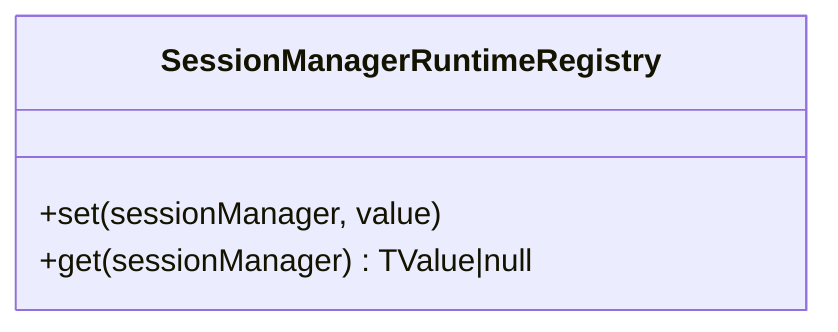

**图表来源**

- [src/agents/pi-extensions/session-manager-runtime-registry.ts:1-29](file://src/agents/pi-extensions/session-manager-runtime-registry.ts#L1-L29)

**章节来源**

- [src/agents/pi-extensions/session-manager-runtime-registry.ts:1-29](file://src/agents/pi-extensions/session-manager-runtime-registry.ts#L1-L29)

## 依赖关系分析

- 低耦合高内聚：会话键与存储解耦于命令层；网关仅依赖出站通道解析；历史工具独立于发送路径。
- 关键依赖链：
  - 命令层依赖会话键与存储类型
  - 网关依赖出站通道解析与会话上下文
  - 历史工具依赖网关 chat.history 与存储裁剪
  - ACP 依赖网关 sessions.resolve/sessions.reset
  - 运行时注册表为会话管理器提供会话作用域缓存

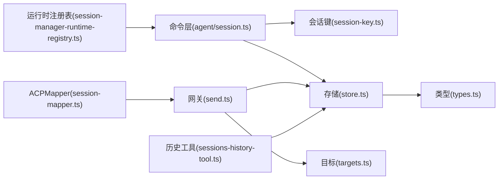

**图表来源**

- [src/commands/agent/session.ts:1-173](file://src/commands/agent/session.ts#L1-L173)
- [src/config/sessions/session-key.ts:1-49](file://src/config/sessions/session-key.ts#L1-L49)
- [src/config/sessions/store.ts:1-800](file://src/config/sessions/store.ts#L1-L800)
- [src/config/sessions/types.ts:1-380](file://src/config/sessions/types.ts#L1-L380)
- [src/gateway/server-methods/send.ts:1-482](file://src/gateway/server-methods/send.ts#L1-L482)
- [src/infra/outbound/targets.ts:1-549](file://src/infra/outbound/targets.ts#L1-L549)
- [src/agents/tools/sessions-history-tool.ts:1-271](file://src/agents/tools/sessions-history-tool.ts#L1-L271)
- [src/acp/session-mapper.ts:38-98](file://src/acp/session-mapper.ts#L38-L98)
- [src/agents/pi-extensions/session-manager-runtime-registry.ts:1-29](file://src/agents/pi-extensions/session-manager-runtime-registry.ts#L1-L29)

**章节来源**

- [src/commands/agent/session.ts:1-173](file://src/commands/agent/session.ts#L1-L173)
- [src/gateway/server-methods/send.ts:1-482](file://src/gateway/server-methods/send.ts#L1-L482)
- [src/infra/outbound/targets.ts:1-549](file://src/infra/outbound/targets.ts#L1-L549)
- [src/agents/tools/sessions-history-tool.ts:1-271](file://src/agents/tools/sessions-history-tool.ts#L1-L271)
- [src/acp/session-mapper.ts:38-98](file://src/acp/session-mapper.ts#L38-L98)
- [src/agents/pi-extensions/session-manager-runtime-registry.ts:1-29](file://src/agents/pi-extensions/session-manager-runtime-registry.ts#L1-L29)

## 性能考量

- 缓存与 TTL：会话存储缓存支持 TTL，减少频繁磁盘 IO；缓存键包含 mtime/size 用于一致性。
- 写入优化：原子写入与 Windows 重试；写前序列化缓存避免重复写。
- 并发控制：写锁队列串行化写操作，避免竞态；超时与过期检测。
- 维护策略：定期清理过期条目、数量封顶、磁盘配额与归档轮转，降低存储膨胀。
- 历史裁剪：按 JSON 字节上限与硬上限保护，避免大消息拖垮查询。
- 锁等待与队列：队列微任务驱动，避免阻塞事件循环。

[本节为通用性能建议，不直接分析具体文件]

## 故障排查指南

- 会话解析失败
  - 检查显式 sessionKey/agentId 是否正确；确认会话键大小写与规范化。
  - 若跨代理存储查找，确认其他代理存储路径与权限。
- 发送失败或目标解析错误
  - 核对通道是否支持；检查 resolveTarget 返回的错误原因；确认 allowFrom 与账号列表。
  - 心跳路由失败时，检查 heartbeat.target 配置与账号有效性。
- 历史查询异常
  - 确认会话可见性策略与沙箱设置；检查工具消息过滤与裁剪阈值。
- 存储写入问题
  - 查看写锁队列长度与超时；关注 Windows 下临时文件写入失败重试日志。
  - 检查磁盘配额与归档清理是否触发。
- 状态与心跳
  - 心跳会话快照中重置策略与到期时间；确认 sessionId 更新逻辑。

**章节来源**

- [src/commands/agent/session.ts:111-173](file://src/commands/agent/session.ts#L111-L173)
- [src/gateway/server-methods/send.ts:153-180](file://src/gateway/server-methods/send.ts#L153-L180)
- [src/infra/outbound/targets.ts:170-238](file://src/infra/outbound/targets.ts#L170-L238)
- [src/agents/tools/sessions-history-tool.ts:235-270](file://src/agents/tools/sessions-history-tool.ts#L235-L270)
- [src/config/sessions/store.ts:511-533](file://src/config/sessions/store.ts#L511-L533)

## 结论

OpenClaw 的会话管理工具通过“键派生—存储—解析—投递—历史—状态”的完整闭环，提供了高可靠、可维护、可扩展的会话能力。其设计强调：

- 会话键与作用域的灵活性与一致性
- 存储的并发安全与维护自动化
- 出站路由的可插拔与可配置
- 历史查询的安全与性能平衡
- 状态与心跳的可观测与可控

这些特性使得会话管理既适合单体部署，也便于在多代理、多通道环境下协同工作。

[本节为总结性内容，不直接分析具体文件]

## 附录

### 配置选项与使用场景

- 会话作用域与主会话桶
  - 作用域：per-sender/global
  - 主会话桶：用于非群组直接对话的统一入口
- 重置策略
  - 新会话触发符、空闲分钟、每日重置时间
- 维护策略
  - 过期时间、最大条目数、磁盘配额、文件轮转
- 心跳路由
  - 目标通道/账号/直聊策略/允许的 sender 列表

**章节来源**

- [src/config/sessions/session-key.ts:13-48](file://src/config/sessions/session-key.ts#L13-L48)
- [src/config/sessions/types.ts:377-380](file://src/config/sessions/types.ts#L377-L380)
- [src/config/sessions/store.ts:289-305](file://src/config/sessions/store.ts#L289-L305)
- [src/infra/outbound/targets.ts:240-370](file://src/infra/outbound/targets.ts#L240-L370)

### 集成方法

- 网关发送：通过 gateway send 接口自动派生会话并投递；可选镜像写入目标会话。
- 历史查询：调用 sessions_history 工具，按需过滤工具消息与限制大小。
- ACP 集成：通过标签/键解析会话，必要时触发重置。
- 界面集成：TUI/控制台加载历史、用量时间序列与日志。

**章节来源**

- [src/gateway/server-methods/send.ts:216-280](file://src/gateway/server-methods/send.ts#L216-L280)
- [src/agents/tools/sessions-history-tool.ts:169-271](file://src/agents/tools/sessions-history-tool.ts#L169-L271)
- [src/acp/session-mapper.ts:38-98](file://src/acp/session-mapper.ts#L38-L98)
- [src/tui/tui-session-actions.ts:279-315](file://src/tui/tui-session-actions.ts#L279-L315)
- [src/ui/controllers/usage.ts:270-315](file://src/ui/controllers/usage.ts#L270-L315)

### 并发处理与错误恢复

- 并发写入：写锁队列，超时与过期检测，Windows 写入重试。
- 错误恢复：读取空文件/锁文件的短暂容错；缓存一致性；维护警告模式保护活动会话。
- 历史安全：脱敏、截断、硬上限，避免大消息影响性能与安全。

**章节来源**

- [src/config/sessions/store.ts:535-727](file://src/config/sessions/store.ts#L535-L727)
- [src/agents/tools/sessions-history-tool.ts:31-167](file://src/agents/tools/sessions-history-tool.ts#L31-L167)
