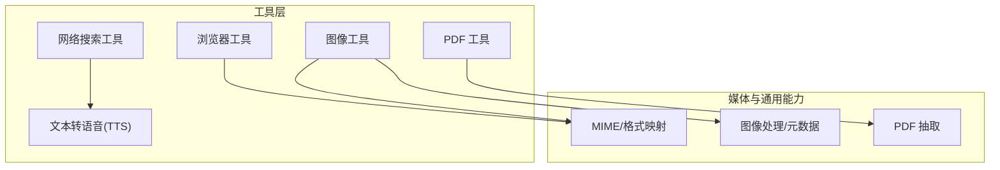
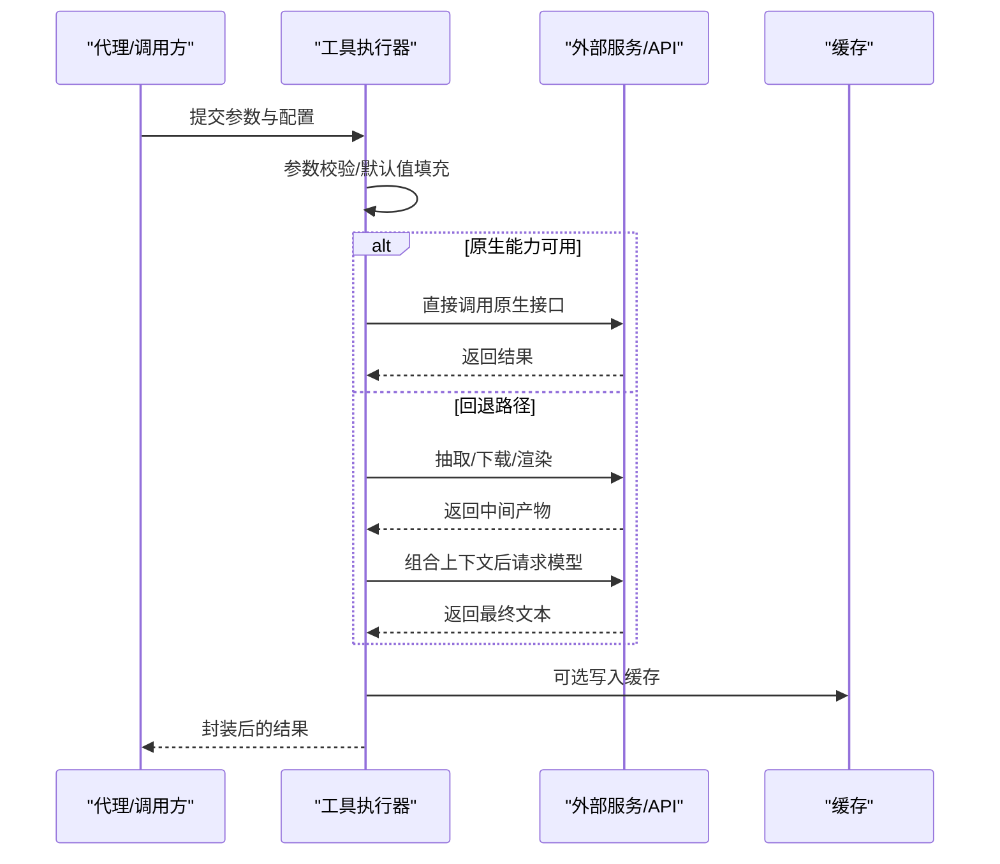
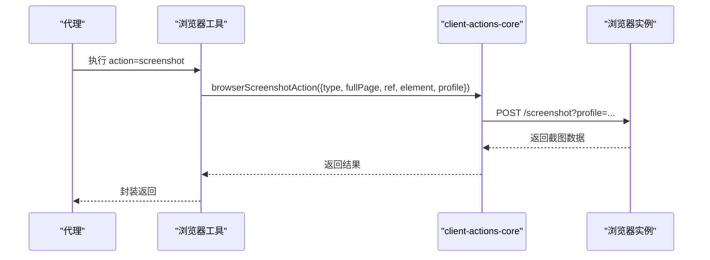
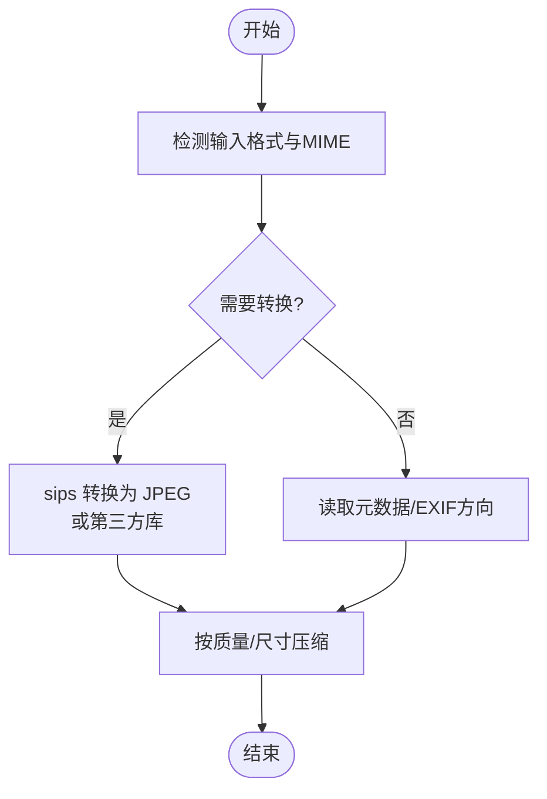
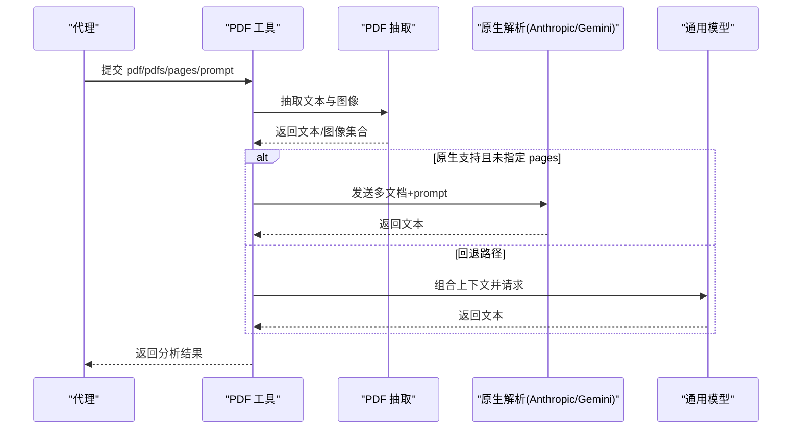
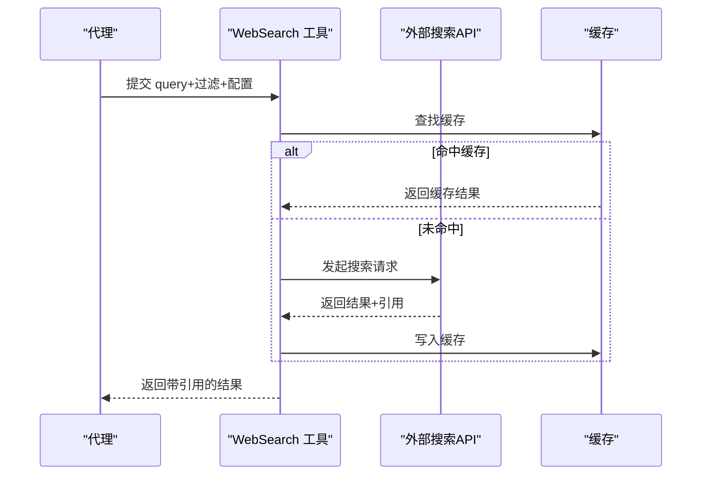
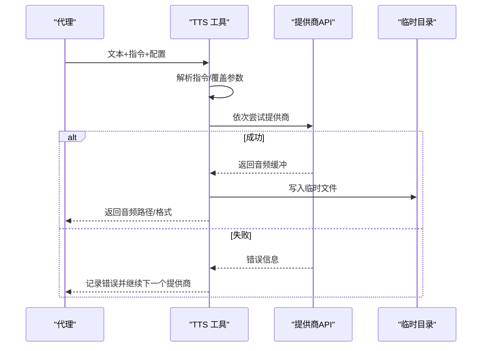
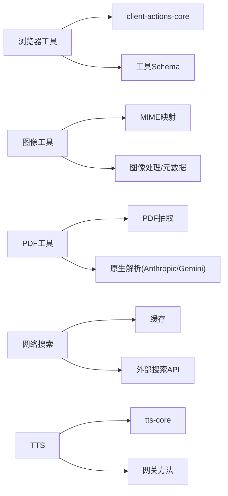

# 内置工具集

<cite>
**本文档引用的文件**
- [src/browser/client-actions-core.ts](file://src/browser/client-actions-core.ts)
- [src/agents/tools/browser-tool.schema.ts](file://src/agents/tools/browser-tool.schema.ts)
- [src/agents/tools/browser-tool.actions.ts](file://src/agents/tools/browser-tool.actions.ts)
- [src/agents/tools/browser-tool.test.ts](file://src/agents/tools/browser-tool.test.ts)
- [src/media/pdf-extract.ts](file://src/media/pdf-extract.ts)
- [src/agents/tools/pdf-tool.ts](file://src/agents/tools/pdf-tool.ts)
- [src/agents/tools/pdf-tool.test.ts](file://src/agents/tools/pdf-tool.test.ts)
- [src/agents/tools/pdf-native-providers.ts](file://src/agents/tools/pdf-native-providers.ts)
- [src/agents/tools/web-search.ts](file://src/agents/tools/web-search.ts)
- [src/tts/tts.ts](file://src/tts/tts.ts)
- [src/tts/tts-core.ts](file://src/tts/tts-core.ts)
- [src/media/mime.ts](file://src/media/mime.ts)
- [src/media/image-ops.ts](file://src/media/image-ops.ts)
- [apps/android/app/src/main/java/ai/openclaw/app/node/JpegSizeLimiter.kt](file://apps/android/app/src/main/java/ai/openclaw/app/node/JpegSizeLimiter.kt)
- [apps/android/app/src/main/java/ai/openclaw/app/voice/TalkDirectiveParser.kt](file://apps/android/app/src/main/java/ai/openclaw/app/voice/TalkDirectiveParser.kt)
- [src/gateway/server-methods/tts.ts](file://src/gateway/server-methods/tts.ts)
</cite>

## 目录

1. [简介](#简介)
2. [项目结构](#项目结构)
3. [核心组件](#核心组件)
4. [架构总览](#架构总览)
5. [详细组件分析](#详细组件分析)
6. [依赖关系分析](#依赖关系分析)
7. [性能考量](#性能考量)
8. [故障排查指南](#故障排查指南)
9. [结论](#结论)
10. [附录](#附录)

## 简介

本文件系统性梳理 OpenClaw 内置工具集，覆盖浏览器工具、图像工具、PDF 工具、网络搜索工具与文本转语音（TTS）工具。内容包括各工具的功能特性、参数与配置、调用流程、性能优化与错误处理策略，并提供面向非专业读者的可操作指南与最佳实践。

## 项目结构

OpenClaw 的工具实现主要位于以下模块：

- 浏览器工具：封装浏览器动作与快照能力，支持截图、导航、对话框与文件选择等交互。
- 图像工具：负责图片处理、格式转换与元数据读取。
- PDF 工具：支持 PDF 文本与图像抽取、多页过滤、原生模型解析与回退路径。
- 网络搜索工具：统一接入多个搜索引擎，提供结果排序、引用管理与缓存。
- 文本转语音（TTS）：多提供商语音合成，支持指令式参数与自动摘要。

图表来源

- [src/browser/client-actions-core.ts:1-260](file://src/browser/client-actions-core.ts#L1-L260)
- [src/media/mime.ts:167-192](file://src/media/mime.ts#L167-L192)
- [src/media/image-ops.ts:217-220](file://src/media/image-ops.ts#L217-L220)
- [src/media/pdf-extract.ts:1-104](file://src/media/pdf-extract.ts#L1-L104)
- [src/agents/tools/pdf-tool.ts:1-559](file://src/agents/tools/pdf-tool.ts#L1-L559)
- [src/agents/tools/web-search.ts:1-800](file://src/agents/tools/web-search.ts#L1-L800)
- [src/tts/tts.ts:1-800](file://src/tts/tts.ts#L1-L800)

章节来源

- [src/browser/client-actions-core.ts:1-260](file://src/browser/client-actions-core.ts#L1-L260)
- [src/agents/tools/browser-tool.schema.ts:1-139](file://src/agents/tools/browser-tool.schema.ts#L1-L139)
- [src/media/mime.ts:167-192](file://src/media/mime.ts#L167-L192)
- [src/media/image-ops.ts:217-220](file://src/media/image-ops.ts#L217-L220)
- [src/media/pdf-extract.ts:1-104](file://src/media/pdf-extract.ts#L1-L104)
- [src/agents/tools/pdf-tool.ts:1-559](file://src/agents/tools/pdf-tool.ts#L1-L559)
- [src/agents/tools/web-search.ts:1-800](file://src/agents/tools/web-search.ts#L1-L800)
- [src/tts/tts.ts:1-800](file://src/tts/tts.ts#L1-L800)

## 核心组件

- 浏览器工具：提供导航、截图、对话框、文件选择、表单填写、等待条件等动作；支持快照与标签页管理。
- 图像工具：支持多种输入（本地/远程）、格式转换、尺寸调整、元数据读取与压缩。
- PDF 工具：支持原生 PDF 解析（Anthropic/Gemini）与回退抽取（文本/图像），并进行多文档分析。
- 网络搜索工具：统一接入 Brave、Gemini、Grok、Kimi、Perplexity 等，支持过滤、缓存与引用提取。
- TTS 工具：支持 OpenAI、ElevenLabs、Edge 多提供商，具备指令解析、自动摘要与输出格式适配。

章节来源

- [src/agents/tools/browser-tool.schema.ts:18-35](file://src/agents/tools/browser-tool.schema.ts#L18-L35)
- [src/agents/tools/pdf-tool.ts:295-301](file://src/agents/tools/pdf-tool.ts#L295-L301)
- [src/agents/tools/web-search.ts:25-27](file://src/agents/tools/web-search.ts#L25-L27)
- [src/tts/tts.ts:258-325](file://src/tts/tts.ts#L258-L325)

## 架构总览

工具调用链路遵循“参数校验 → 能力分派 → 外部服务调用 → 结果封装”的模式。浏览器工具通过客户端动作接口与网关通信；PDF 工具优先尝试原生解析，失败时回退到抽取；网络搜索工具统一经受信任端点访问外部 API；TTS 工具按优先级尝试不同提供商。

图表来源

- [src/agents/tools/pdf-tool.ts:198-289](file://src/agents/tools/pdf-tool.ts#L198-L289)
- [src/agents/tools/pdf-tool.ts:529-538](file://src/agents/tools/pdf-tool.ts#L529-L538)
- [src/agents/tools/web-search.ts:1719-1744](file://src/agents/tools/web-search.ts#L1719-L1744)

## 详细组件分析

### 浏览器工具

- 功能特性
  - 导航、截图（全页/元素）、对话框与文件选择器钩子、表单填写、按键与拖拽、等待条件（文本/URL/加载状态）、脚本求值、关闭标签页。
  - 快照与标签页管理，支持配置文件档案（profile）与目标标签（targetId）。
- 关键参数
  - 行动类型（action）：status/start/stop/profiles/tabs/open/focus/close/snapshot/screenshot/navigate/console/pdf/upload/dialog/act。
  - 截图参数：targetId/fullPage/ref/element/type(profile)。
  - act 请求：kind 支持 click/type/press/hover/drag/select/fill/resize/wait/evaluate/close；并支持双击、修饰键、提交、缓慢输入、超时等。
  - 其他：target/url/targetId/limit/maxChars/mode/snapshotFormat/refs/interactive/compact/depth/selector/frame/labels/fullPage/ref/element/type/level/paths/inputRef/timeoutMs/accept/promptText/request 等。
- 使用示例与最佳实践
  - 快速截图：设置 action=screenshot，指定 type=png 或 jpeg，必要时设置 fullPage 或 element/ref。
  - 自动化表单：使用 action=act，kind=fill，fields 指定 ref 与值；或使用 kind=type 输入文本并可 submit。
  - 等待页面变化：kind=wait，结合 url/selector/text/textGone/loadState/timeoutMs。
  - 对话框与文件选择：armDialog/armFileChooser 后再触发相应动作。
- 性能与错误处理
  - 超时统一为约 20 秒；对无效参数抛出明确错误；profile 查询拼接到 URL；对不可用依赖（如 Canvas/PDF.js）给出提示。
- 代码路径参考
  - [浏览器动作定义与截图:15-76](file://src/browser/client-actions-core.ts#L15-L76)
  - [截图请求:235-259](file://src/browser/client-actions-core.ts#L235-L259)
  - [工具参数 Schema:88-139](file://src/agents/tools/browser-tool.schema.ts#L88-L139)
  - [快照默认值与模式:107-136](file://src/agents/tools/browser-tool.actions.ts#L107-L136)
  - [测试用例（快照与配置）:129-218](file://src/agents/tools/browser-tool.test.ts#L129-L218)

图表来源

- [src/browser/client-actions-core.ts:235-259](file://src/browser/client-actions-core.ts#L235-L259)
- [src/agents/tools/browser-tool.schema.ts:88-139](file://src/agents/tools/browser-tool.schema.ts#L88-L139)

章节来源

- [src/browser/client-actions-core.ts:1-260](file://src/browser/client-actions-core.ts#L1-L260)
- [src/agents/tools/browser-tool.schema.ts:1-139](file://src/agents/tools/browser-tool.schema.ts#L1-L139)
- [src/agents/tools/browser-tool.actions.ts:107-136](file://src/agents/tools/browser-tool.actions.ts#L107-L136)
- [src/agents/tools/browser-tool.test.ts:129-218](file://src/agents/tools/browser-tool.test.ts#L129-L218)

### 图像工具

- 功能特性
  - 多格式输入与 MIME 推断；图像元数据读取（含 EXIF 方向）；常见格式转换（JPEG/HEIC/WebP/PNG/GIF）；缩放与压缩。
- 关键参数
  - 输入：支持本地路径、HTTP/HTTPS、file://、data URI 等；限制最大字节数与像素数。
  - 输出：目标格式（jpg/jpeg/png/webp/gif/heic/heif）；质量与尺寸；元数据保留。
- 使用示例与最佳实践
  - 转换为 JPEG 并控制质量：传入 buffer 与质量参数，走 sips 或第三方库路径。
  - 读取 EXIF 方向：用于自动旋转以修正横幅方向。
  - 压缩至阈值：在移动端传输前压缩，避免超限。
- 性能与错误处理
  - 优先使用系统工具（如 macOS sips）；失败回退；对异常 MIME/格式返回空或抛错；Android 端提供尺寸限制器。
- 代码路径参考
  - [MIME 到格式映射:167-192](file://src/media/mime.ts#L167-L192)
  - [图像元数据读取（sips）:217-220](file://src/media/image-ops.ts#L217-L220)
  - [JPEG 压缩（sips）:174-215](file://src/media/image-ops.ts#L174-L215)
  - [Android JPEG 压缩限制器:14-34](file://apps/android/app/src/main/java/ai/openclaw/app/node/JpegSizeLimiter.kt#L14-L34)

图表来源

- [src/media/mime.ts:167-192](file://src/media/mime.ts#L167-L192)
- [src/media/image-ops.ts:174-220](file://src/media/image-ops.ts#L174-L220)
- [apps/android/app/src/main/java/ai/openclaw/app/node/JpegSizeLimiter.kt:14-34](file://apps/android/app/src/main/java/ai/openclaw/app/node/JpegSizeLimiter.kt#L14-L34)

章节来源

- [src/media/mime.ts:167-192](file://src/media/mime.ts#L167-L192)
- [src/media/image-ops.ts:174-220](file://src/media/image-ops.ts#L174-L220)
- [apps/android/app/src/main/java/ai/openclaw/app/node/JpegSizeLimiter.kt:14-34](file://apps/android/app/src/main/java/ai/openclaw/app/node/JpegSizeLimiter.kt#L14-L34)

### PDF 工具

- 功能特性
  - 原生 PDF 分析（Anthropic/Gemini）与回退路径（文本抽取 + 图像抽取）；多文档合并分析；页面范围过滤；最大页数与像素预算控制。
- 关键参数
  - prompt：分析指令；pdf/pdfs：单个或多个 PDF（最多 10）；pages：页码范围字符串；model：模型覆盖；maxBytesMb：最大字节数。
- 使用示例与最佳实践
  - 单文档分析：提供 pdf 与 prompt；若模型不支持图像，且无可抽取文本，则会报错提示。
  - 多文档比较：提供 pdfs 数组；原生模型支持多文档时优先使用。
  - 控制成本：合理设置 pages 与 maxBytesMb，避免超限。
- 性能与错误处理
  - 文本字符阈值低于阈值时，自动启用图像抽取；图像抽取按像素预算缩放；失败时记录错误并回退到文本路径。
- 代码路径参考
  - [PDF 抽取（文本+图像）:42-104](file://src/media/pdf-extract.ts#L42-L104)
  - [PDF 工具主流程与回退:198-289](file://src/agents/tools/pdf-tool.ts#L198-L289)
  - [原生 PDF 解析（Anthropic/Gemini）:95-143](file://src/agents/tools/pdf-native-providers.ts#L95-L143)
  - [测试用例（原生调用与多文档）:543-722](file://src/agents/tools/pdf-tool.test.ts#L543-L722)

图表来源

- [src/agents/tools/pdf-tool.ts:198-289](file://src/agents/tools/pdf-tool.ts#L198-L289)
- [src/media/pdf-extract.ts:42-104](file://src/media/pdf-extract.ts#L42-L104)
- [src/agents/tools/pdf-native-providers.ts:95-143](file://src/agents/tools/pdf-native-providers.ts#L95-L143)

章节来源

- [src/media/pdf-extract.ts:1-104](file://src/media/pdf-extract.ts#L1-L104)
- [src/agents/tools/pdf-tool.ts:1-559](file://src/agents/tools/pdf-tool.ts#L1-L559)
- [src/agents/tools/pdf-tool.test.ts:511-722](file://src/agents/tools/pdf-tool.test.ts#L511-L722)
- [src/agents/tools/pdf-native-providers.ts:95-143](file://src/agents/tools/pdf-native-providers.ts#L95-L143)

### 网络搜索工具

- 功能特性
  - 统一接入 Brave、Gemini、Grok、Kimi、Perplexity；支持国家/语言/新鲜度/日期过滤；结果缓存；引用提取与去重。
- 关键参数
  - query：查询词；count：返回数量（1-10）；country/language：地区与语言；freshness/date_after/date_before：时间过滤；search_lang/ui_lang：Brave 语言参数；domain_filter/max_tokens/max_tokens_per_page：Perplexity 原生参数；model/timeout/cacheTtl 等。
- 使用示例与最佳实践
  - 指定 provider 与 API Key：通过配置或环境变量设置；未配置时按可用密钥自动检测。
  - 使用缓存：合理设置 TTL，减少重复请求；对高延迟结果启用缓存。
  - 引用管理：工具自动提取引用链接并去重；可配置内联引用（部分提供商支持）。
- 性能与错误处理
  - 超时与 TTL 配置；对缺失密钥返回明确错误；对不支持的过滤组合给出提示。
- 代码路径参考
  - [工具参数 Schema（Brave/Perplexity/Gemini/Grok/Kimi）:153-283](file://src/agents/tools/web-search.ts#L153-L283)
  - [Perplexity 引用提取:427-457](file://src/agents/tools/web-search.ts#L427-L457)
  - [Kimi 搜索流程:1412-1450](file://src/agents/tools/web-search.ts#L1412-L1450)
  - [缓存写入与返回:1715-1744](file://src/agents/tools/web-search.ts#L1715-L1744)

图表来源

- [src/agents/tools/web-search.ts:1715-1744](file://src/agents/tools/web-search.ts#L1715-L1744)
- [src/agents/tools/web-search.ts:427-457](file://src/agents/tools/web-search.ts#L427-L457)

章节来源

- [src/agents/tools/web-search.ts:1-800](file://src/agents/tools/web-search.ts#L1-L800)

### 文本转语音（TTS）

- 功能特性
  - 多提供商：OpenAI、ElevenLabs、Edge；支持指令式参数覆盖（provider/voice/model/速度/音色/语言/种子/规范化）；自动摘要与长度控制；通道适配（Telegram/飞书/WhatsApp 等）。
- 关键参数
  - 文本长度上限、摘要开关、自动模式（off/always/inbound/tagged）；提供商优先级与 API Key；输出格式（mp3/opus/pcm 等）；Edge 特有参数（语言、音色、输出格式、节拍/速率/音量/代理/超时）。
- 使用示例与最佳实践
  - 指令覆盖：在消息中使用 [[tts:...]] 指令动态切换提供商/声音/模型/风格等。
  - 语音兼容：针对 Telegram 等通道自动选择 opus 输出；电话场景使用 pcm。
  - 超时与容错：按提供商顺序尝试，记录错误原因；Edge 不支持电话场景。
- 性能与错误处理
  - 超时统一配置；Edge 输出格式失败时自动回退；对非法参数抛出明确错误；临时文件定时清理。
- 代码路径参考
  - [配置解析与提供商顺序:258-325](file://src/tts/tts.ts#L258-L325)
  - [指令解析与覆盖:110-338](file://src/tts/tts-core.ts#L110-L338)
  - [OpenAI/ElevenLabs/Edge 实现:539-700](file://src/tts/tts-core.ts#L539-L700)
  - [通道输出格式适配:501-506](file://src/tts/tts.ts#L501-L506)
  - [Android 指令解析（语音参数）:47-68](file://apps/android/app/src/main/java/ai/openclaw/app/voice/TalkDirectiveParser.kt#L47-L68)
  - [网关侧提供商列表:129-157](file://src/gateway/server-methods/tts.ts#L129-L157)

图表来源

- [src/tts/tts.ts:557-723](file://src/tts/tts.ts#L557-L723)
- [src/tts/tts-core.ts:539-700](file://src/tts/tts-core.ts#L539-L700)
- [apps/android/app/src/main/java/ai/openclaw/app/voice/TalkDirectiveParser.kt:47-68](file://apps/android/app/src/main/java/ai/openclaw/app/voice/TalkDirectiveParser.kt#L47-L68)
- [src/gateway/server-methods/tts.ts:129-157](file://src/gateway/server-methods/tts.ts#L129-L157)

章节来源

- [src/tts/tts.ts:1-800](file://src/tts/tts.ts#L1-L800)
- [src/tts/tts-core.ts:1-700](file://src/tts/tts-core.ts#L1-L700)
- [apps/android/app/src/main/java/ai/openclaw/app/voice/TalkDirectiveParser.kt:47-68](file://apps/android/app/src/main/java/ai/openclaw/app/voice/TalkDirectiveParser.kt#L47-L68)
- [src/gateway/server-methods/tts.ts:129-157](file://src/gateway/server-methods/tts.ts#L129-L157)

## 依赖关系分析

- 浏览器工具依赖 client-actions-core 的 HTTP 接口与网关通信；参数由工具 Schema 校验。
- 图像工具依赖 MIME 映射与系统工具（如 sips）；Android 端提供尺寸限制器。
- PDF 工具依赖 pdf-extract 进行文本/图像抽取；原生解析依赖 Anthropic/Gemini 提供商。
- 网络搜索工具依赖受信任端点访问外部 API；缓存独立管理。
- TTS 工具依赖 OpenAI/ElevenLabs/Edge SDK；指令解析与覆盖在 tts-core 中实现。

图表来源

- [src/browser/client-actions-core.ts:1-260](file://src/browser/client-actions-core.ts#L1-L260)
- [src/agents/tools/browser-tool.schema.ts:1-139](file://src/agents/tools/browser-tool.schema.ts#L1-L139)
- [src/media/mime.ts:167-192](file://src/media/mime.ts#L167-L192)
- [src/media/image-ops.ts:217-220](file://src/media/image-ops.ts#L217-L220)
- [src/media/pdf-extract.ts:1-104](file://src/media/pdf-extract.ts#L1-L104)
- [src/agents/tools/pdf-tool.ts:1-559](file://src/agents/tools/pdf-tool.ts#L1-L559)
- [src/agents/tools/web-search.ts:1-800](file://src/agents/tools/web-search.ts#L1-L800)
- [src/tts/tts.ts:1-800](file://src/tts/tts.ts#L1-L800)
- [src/tts/tts-core.ts:1-700](file://src/tts/tts-core.ts#L1-L700)
- [src/gateway/server-methods/tts.ts:129-157](file://src/gateway/server-methods/tts.ts#L129-L157)

章节来源

- [src/browser/client-actions-core.ts:1-260](file://src/browser/client-actions-core.ts#L1-L260)
- [src/agents/tools/browser-tool.schema.ts:1-139](file://src/agents/tools/browser-tool.schema.ts#L1-L139)
- [src/media/mime.ts:167-192](file://src/media/mime.ts#L167-L192)
- [src/media/image-ops.ts:217-220](file://src/media/image-ops.ts#L217-L220)
- [src/media/pdf-extract.ts:1-104](file://src/media/pdf-extract.ts#L1-L104)
- [src/agents/tools/pdf-tool.ts:1-559](file://src/agents/tools/pdf-tool.ts#L1-L559)
- [src/agents/tools/web-search.ts:1-800](file://src/agents/tools/web-search.ts#L1-L800)
- [src/tts/tts.ts:1-800](file://src/tts/tts.ts#L1-L800)
- [src/tts/tts-core.ts:1-700](file://src/tts/tts-core.ts#L1-L700)
- [src/gateway/server-methods/tts.ts:129-157](file://src/gateway/server-methods/tts.ts#L129-L157)

## 性能考量

- 浏览器工具
  - 截图与动作请求统一超时；建议在批量操作时合并请求，减少往返。
- 图像工具
  - 优先使用系统工具（如 sips）；对大图先缩放再编码；Android 端使用尺寸限制器避免超限。
- PDF 工具
  - 文本字符不足时启用图像抽取；按像素预算缩放；限制最大页数与文档数量。
- 网络搜索工具
  - 合理设置 TTL 缓存；对高延迟结果启用缓存；按需裁剪 max_tokens 与 max_tokens_per_page。
- TTS 工具
  - 控制文本长度与摘要开关；Edge 输出格式失败时自动回退；临时文件定时清理。

## 故障排查指南

- 浏览器工具
  - 确认 profile 与 targetId 正确；检查超时与网络连通性；对缺失依赖（Canvas/PDF.js）查看日志。
- 图像工具
  - 检查输入 MIME 与格式映射；确认系统工具可用；Android 端注意尺寸限制。
- PDF 工具
  - 若模型不支持图像且无文本，会报错；检查 pages 与原生模型限制；确认 PDF 类型与大小。
- 网络搜索工具
  - 缺少 API Key 时会返回明确错误；检查 provider 与密钥来源；验证过滤参数组合。
- TTS 工具
  - Edge 不支持电话场景；检查提供商 API Key；对非法参数抛错；关注超时与临时文件清理。

章节来源

- [src/agents/tools/browser-tool.test.ts:129-218](file://src/agents/tools/browser-tool.test.ts#L129-L218)
- [src/agents/tools/pdf-tool.test.ts:543-722](file://src/agents/tools/pdf-tool.test.ts#L543-L722)
- [src/agents/tools/web-search.ts:564-602](file://src/agents/tools/web-search.ts#L564-L602)
- [src/tts/tts.ts:542-555](file://src/tts/tts.ts#L542-L555)
- [src/tts/tts-core.ts:46-81](file://src/tts/tts-core.ts#L46-L81)

## 结论

OpenClaw 内置工具集围绕“参数校验—能力分派—外部服务—结果封装”构建，具备良好的扩展性与健壮性。浏览器工具覆盖网页自动化与截图；图像工具提供跨平台格式转换与元数据读取；PDF 工具兼顾原生解析与回退路径；网络搜索工具统一接入多家引擎并管理引用；TTS 工具支持多提供商与指令式参数。建议在生产环境中结合缓存、超时与限额策略，确保稳定性与性能。

## 附录

- 参数与配置要点
  - 浏览器：action、target、profile、targetUrl/url、limit/maxChars/mode/snapshotFormat/refs、interactive/compact/depth/selector/frame/labels/fullPage/ref/element/type/level/paths/inputRef/timeoutMs/accept/promptText/request。
  - 图像：输入路径/URL、输出格式、质量、尺寸、元数据读取。
  - PDF：prompt、pdf/pdfs、pages、model、maxBytesMb。
  - 网络搜索：query、count、country/language、freshness/date_after/date_before、search_lang/ui_lang、domain_filter/max_tokens/max_tokens_per_page、provider、timeout、cacheTtl。
  - TTS：文本长度上限、摘要开关、自动模式、提供商优先级、API Key、输出格式、Edge 参数、指令覆盖。
