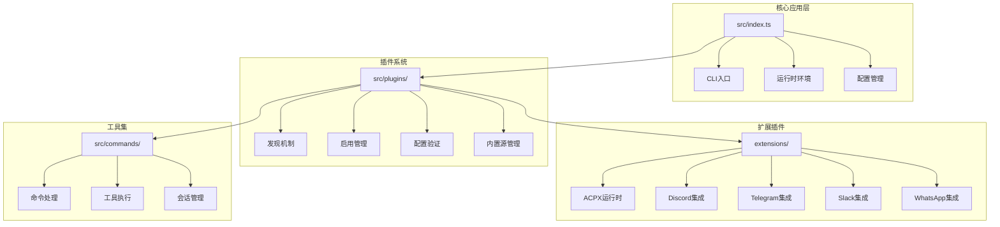
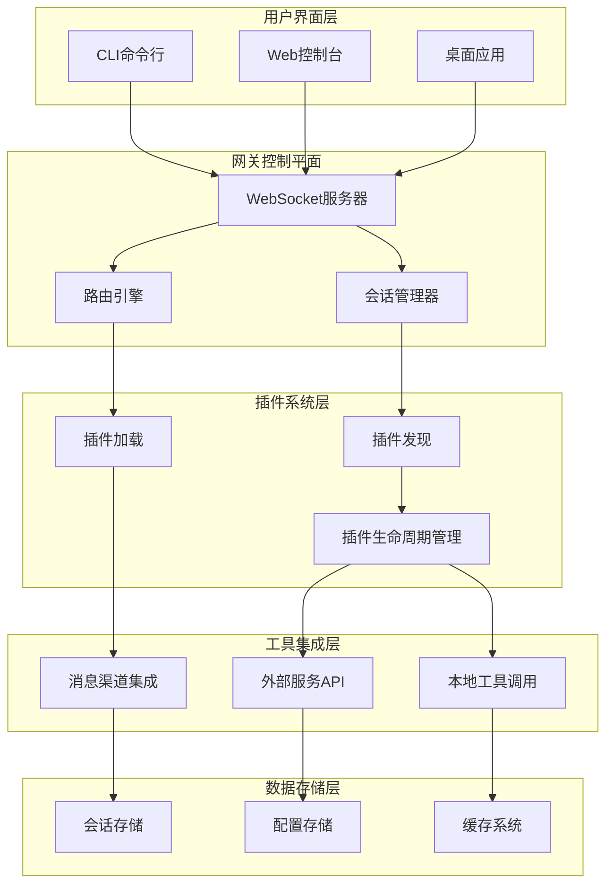
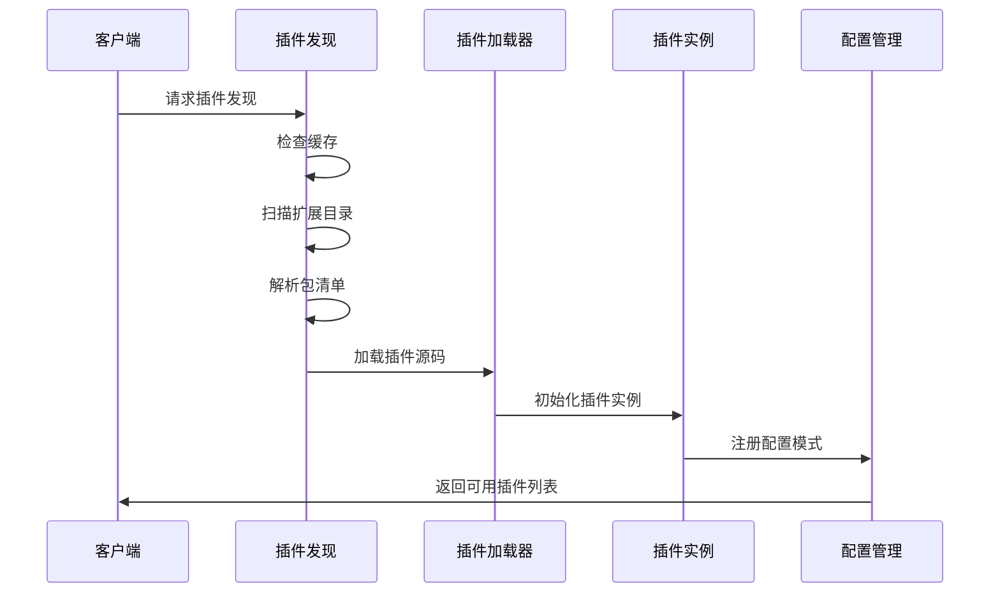
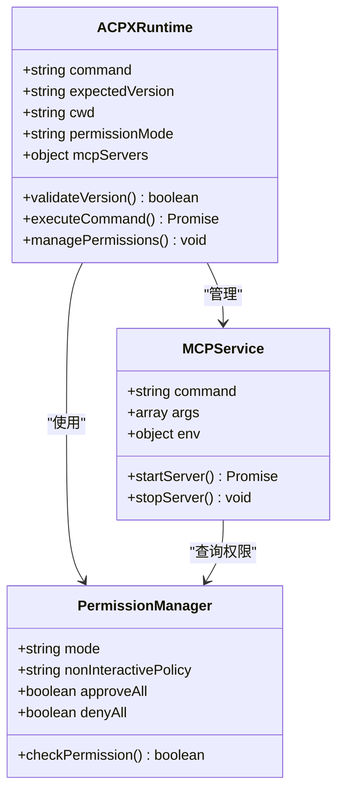
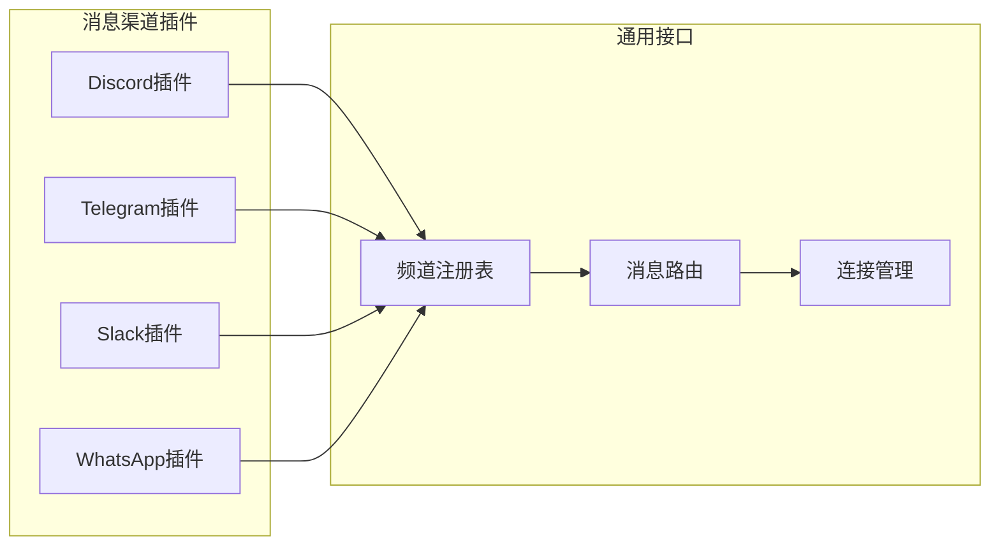
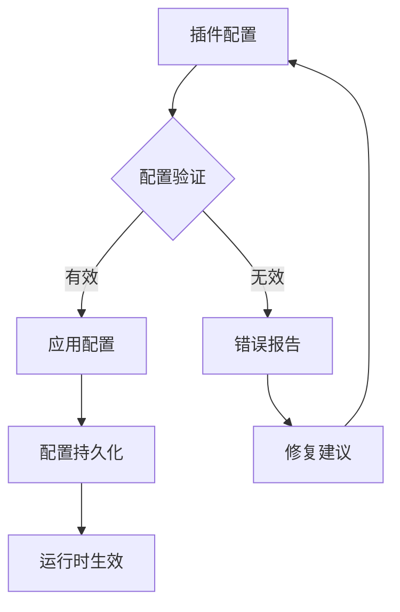

# 后端工具集成

<cite>
**本文档引用的文件**
- [README.md](file://README.md)
- [package.json](file://package.json)
- [src/index.ts](file://src/index.ts)
- [src/runtime.ts](file://src/runtime.ts)
- [src/cli/program.ts](file://src/cli/program.ts)
- [src/extensionAPI.ts](file://src/extensionAPI.ts)
- [src/plugins/discovery.ts](file://src/plugins/discovery.ts)
- [src/plugins/enable.ts](file://src/plugins/enable.ts)
- [src/plugins/config-schema.ts](file://src/plugins/config-schema.ts)
- [src/plugins/bundled-sources.ts](file://src/plugins/bundled-sources.ts)
- [extensions/acpx/openclaw.plugin.json](file://extensions/acpx/openclaw.plugin.json)
- [extensions/discord/openclaw.plugin.json](file://extensions/discord/openclaw.plugin.json)
- [extensions/telegram/openclaw.plugin.json](file://extensions/telegram/openclaw.plugin.json)
- [extensions/slack/openclaw.plugin.json](file://extensions/slack/openclaw.plugin.json)
- [extensions/whatsapp/openclaw.plugin.json](file://extensions/whatsapp/openclaw.plugin.json)
</cite>

## 目录
1. [简介](#简介)
2. [项目结构](#项目结构)
3. [核心组件](#核心组件)
4. [架构概览](#架构概览)
5. [详细组件分析](#详细组件分析)
6. [依赖关系分析](#依赖关系分析)
7. [性能考虑](#性能考虑)
8. [故障排除指南](#故障排除指南)
9. [结论](#结论)

## 简介

OpenClaw 是一个个人AI助手平台，专注于多渠道消息传递集成和可扩展的工具系统。该项目的核心优势在于其强大的后端工具集成功能，通过插件架构实现了对各种通信渠道、工具和服务的无缝集成。

该项目支持多种消息渠道（WhatsApp、Telegram、Slack、Discord、Google Chat、Signal等）以及丰富的工具功能（浏览器控制、Canvas可视化、节点管理、定时任务等）。通过模块化的插件系统，OpenClaw能够灵活地扩展新的功能和集成。

## 项目结构

OpenClaw采用现代化的模块化架构设计，主要包含以下核心目录结构：



**图表来源**
- [src/index.ts:1-94](file://src/index.ts#L1-L94)
- [src/plugins/discovery.ts:1-712](file://src/plugins/discovery.ts#L1-L712)

**章节来源**
- [README.md:1-560](file://README.md#L1-L560)
- [package.json:1-477](file://package.json#L1-L477)

## 核心组件

### CLI入口点
应用程序的主入口点位于 `src/index.ts`，负责初始化运行时环境、加载配置并启动CLI程序。

### 插件发现系统
`src/plugins/discovery.ts` 实现了完整的插件发现机制，支持从多个位置自动发现和加载插件：
- 工作空间扩展目录
- 内置扩展包
- 全局配置扩展目录
- 自定义路径扩展

### 运行时环境管理
`src/runtime.ts` 提供了统一的运行时环境接口，包括日志记录、错误处理和进程退出管理。

**章节来源**
- [src/index.ts:1-94](file://src/index.ts#L1-L94)
- [src/runtime.ts:1-54](file://src/runtime.ts#L1-L54)
- [src/plugins/discovery.ts:1-712](file://src/plugins/discovery.ts#L1-L712)

## 架构概览

OpenClaw采用了分层架构设计，通过插件系统实现了高度模块化的功能集成：



**图表来源**
- [README.md:185-240](file://README.md#L185-L240)
- [src/plugins/discovery.ts:618-712](file://src/plugins/discovery.ts#L618-L712)

## 详细组件分析

### 插件发现与加载机制

插件系统是OpenClaw的核心架构组件，实现了智能的插件发现和安全加载机制：



**图表来源**
- [src/plugins/discovery.ts:618-712](file://src/plugins/discovery.ts#L618-L712)
- [src/plugins/bundled-sources.ts:33-65](file://src/plugins/bundled-sources.ts#L33-L65)

#### 安全检查机制
插件系统实现了多层次的安全检查：

1. **路径安全验证**：防止插件源码逃逸到插件根目录之外
2. **权限检查**：验证插件目录的文件权限，防止世界可写权限
3. **所有权验证**：确保插件文件的所有权符合预期
4. **硬链接检测**：拒绝可能的安全风险硬链接

**章节来源**
- [src/plugins/discovery.ts:117-251](file://src/plugins/discovery.ts#L117-L251)

### ACPX运行时集成

ACPX（Agent Communication Protocol Extension）运行时提供了强大的后端工具集成能力：



**图表来源**
- [extensions/acpx/openclaw.plugin.json:1-106](file://extensions/acpx/openclaw.plugin.json#L1-L106)

#### 配置选项详解
ACPX运行时支持丰富的配置选项：

| 配置项 | 类型 | 描述 | 默认值 |
|--------|------|------|--------|
| command | string | ACPX命令路径或名称 | 使用内置ACPX |
| expectedVersion | string | 版本强制策略 | "any" |
| cwd | string | 默认工作目录 | 当前工作目录 |
| permissionMode | enum | 权限管理模式 | "approve-all" |
| nonInteractivePermissions | enum | 非交互权限策略 | "deny" |
| timeoutSeconds | number | 超时时间（秒） | 无限制 |
| queueOwnerTtlSeconds | number | 队列所有者TTL | 0 |

**章节来源**
- [extensions/acpx/openclaw.plugin.json:6-106](file://extensions/acpx/openclaw.plugin.json#L6-L106)

### 消息渠道集成

OpenClaw支持多种消息渠道的集成，每个渠道都有专门的插件实现：



**图表来源**
- [extensions/discord/openclaw.plugin.json:1-10](file://extensions/discord/openclaw.plugin.json#L1-L10)
- [extensions/telegram/openclaw.plugin.json:1-10](file://extensions/telegram/openclaw.plugin.json#L1-L10)
- [extensions/slack/openclaw.plugin.json:1-10](file://extensions/slack/openclaw.plugin.json#L1-L10)
- [extensions/whatsapp/openclaw.plugin.json:1-10](file://extensions/whatsapp/openclaw.plugin.json#L1-L10)

#### 渠道特性对比

| 插件ID | 支持功能 | 认证方式 | 配置复杂度 |
|--------|----------|----------|------------|
| discord | 文本消息、文件上传、嵌入式内容 | Bot Token | 中等 |
| telegram | 文本、图片、文档、Inline模式 | Bot Token | 简单 |
| slack | 多种消息类型、块元素、OAuth | Bot Token/App Token | 复杂 |
| whatsapp | 状态更新、媒体文件、联系人 | Baileys库 | 复杂 |

**章节来源**
- [extensions/discord/openclaw.plugin.json:1-10](file://extensions/discord/openclaw.plugin.json#L1-L10)
- [extensions/telegram/openclaw.plugin.json:1-10](file://extensions/telegram/openclaw.plugin.json#L1-L10)
- [extensions/slack/openclaw.plugin.json:1-10](file://extensions/slack/openclaw.plugin.json#L1-L10)
- [extensions/whatsapp/openclaw.plugin.json:1-10](file://extensions/whatsapp/openclaw.plugin.json#L1-L10)

### 插件配置管理系统

插件配置系统提供了统一的配置验证和管理机制：



**图表来源**
- [src/plugins/config-schema.ts:1-34](file://src/plugins/config-schema.ts#L1-L34)

**章节来源**
- [src/plugins/config-schema.ts:1-34](file://src/plugins/config-schema.ts#L1-L34)

## 依赖关系分析

OpenClaw的依赖关系体现了其模块化设计的特点：

```mermaid
graph TB
subgraph "核心依赖"
A[@mariozechner/pi-agent-core]
B[@mariozechner/pi-ai]
C[ws]
D[hono]
E[commander]
end
subgraph "渠道集成"
F[@whiskeysockets/baileys]
G[@grammyjs/transformer-throttler]
H[@slack/bolt]
I[@discordjs/voice]
end
subgraph "工具库"
J[node-llama-cpp]
K[@napi-rs/canvas]
L[sharp]
M[sqlite-vec]
end
subgraph "开发工具"
N[vitest]
O[typescript]
P[oxlint]
Q[tsx]
end
A --> F
B --> G
C --> H
D --> I
E --> J
F --> K
G --> L
H --> M
I --> N
J --> O
K --> P
L --> Q
```

**图表来源**
- [package.json:344-404](file://package.json#L344-L404)
- [package.json:405-427](file://package.json#L405-L427)

**章节来源**
- [package.json:1-477](file://package.json#L1-L477)

## 性能考虑

### 插件发现缓存机制
为了提高启动性能，插件发现系统实现了智能缓存机制：
- 默认缓存时间为1秒
- 支持通过环境变量调整缓存行为
- 缓存键包含工作空间目录、额外路径和所有权信息

### 并发处理优化
系统采用异步并发处理模式：
- 插件发现过程完全异步
- 支持并行加载多个插件
- 内存使用优化，避免重复加载

### 资源管理
- 进程退出时自动清理资源
- 终端状态恢复机制
- 内存泄漏防护

## 故障排除指南

### 常见问题诊断

#### 插件加载失败
**症状**：插件无法加载或出现安全警告
**解决方案**：
1. 检查插件目录权限（必须非世界可写）
2. 验证插件源码未逃逸到根目录之外
3. 确认插件文件所有权正确

#### 配置验证错误
**症状**：插件配置不被接受
**解决方案**：
1. 检查配置格式是否符合JSON Schema
2. 验证必需字段是否完整
3. 确认配置值在允许范围内

#### 渠道连接问题
**症状**：消息渠道无法正常工作
**解决方案**：
1. 验证认证令牌有效性
2. 检查网络连接和防火墙设置
3. 确认渠道API版本兼容性

**章节来源**
- [src/plugins/discovery.ts:216-227](file://src/plugins/discovery.ts#L216-L227)
- [src/plugins/config-schema.ts:9-26](file://src/plugins/config-schema.ts#L9-L26)

## 结论

OpenClaw的后端工具集成功能展现了现代AI助手平台的设计理念。通过模块化的插件架构、完善的安全机制和灵活的配置系统，该平台能够有效地集成各种工具和服务。

### 主要优势
1. **高度模块化**：插件系统支持动态加载和卸载
2. **安全性强**：多层安全检查防止恶意插件
3. **扩展性强**：支持自定义插件开发
4. **配置灵活**：提供丰富的配置选项
5. **性能优化**：智能缓存和并发处理

### 技术特色
- 统一的插件发现和加载机制
- 完善的安全验证体系
- 灵活的配置管理模式
- 丰富的消息渠道集成
- 强大的工具扩展能力

该架构为后续的功能扩展和技术演进奠定了坚实的基础，能够适应不断变化的技术需求和业务场景。