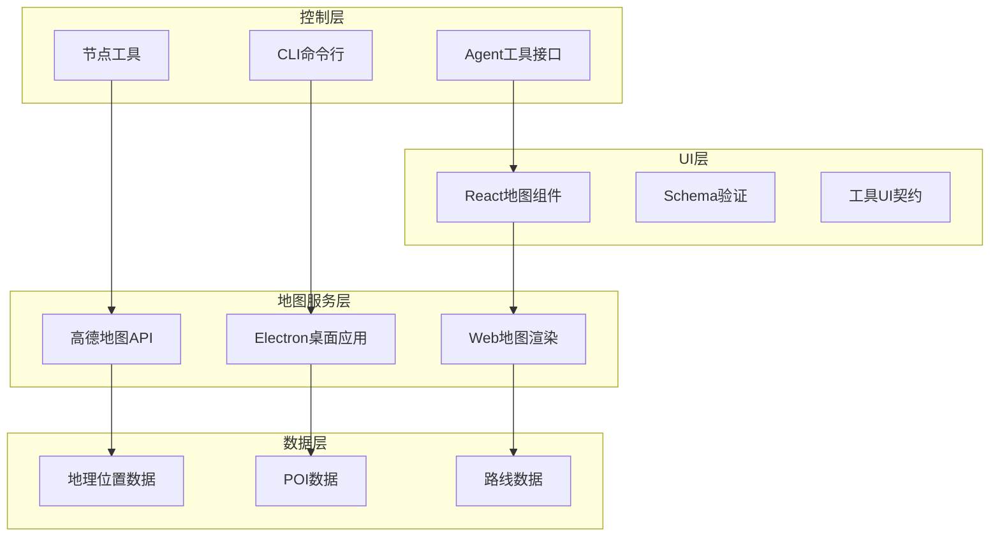
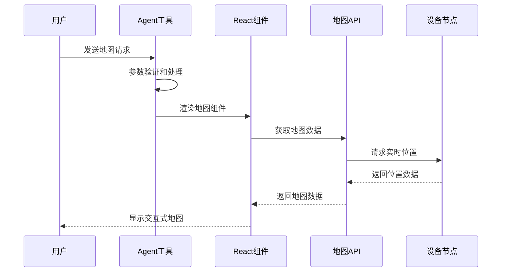
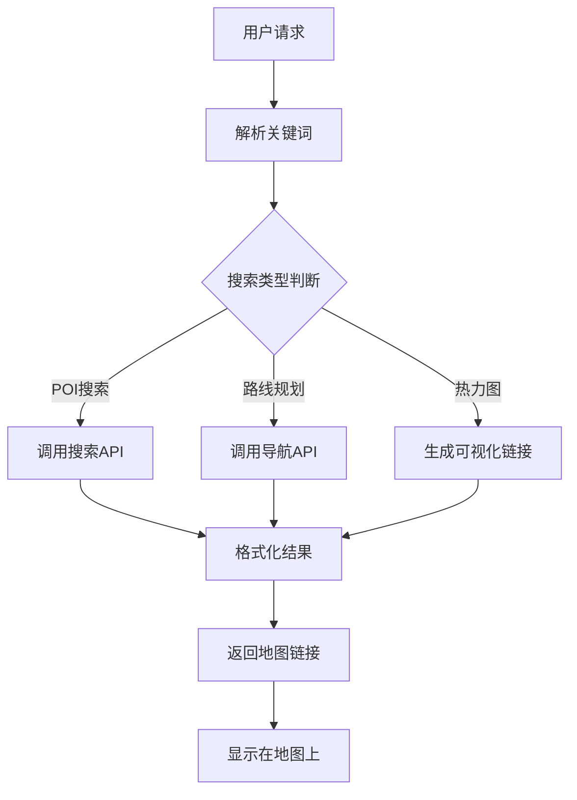
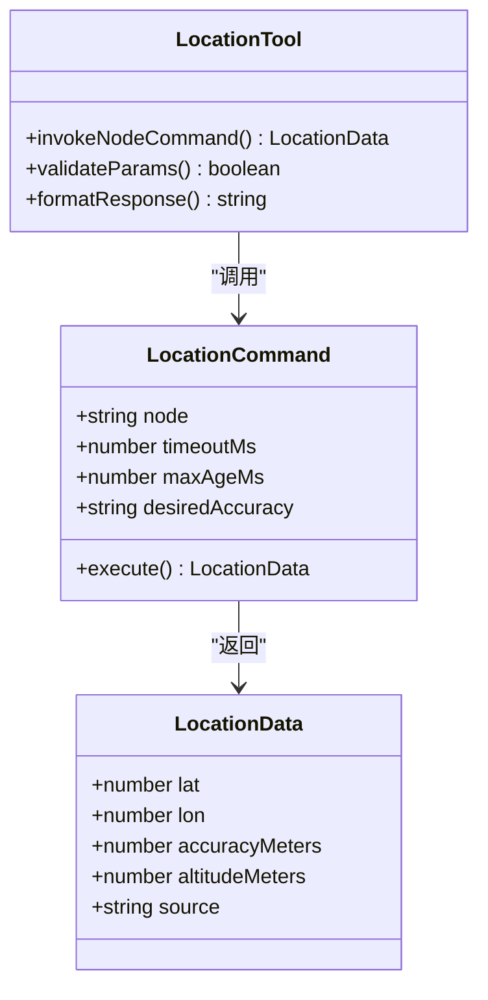
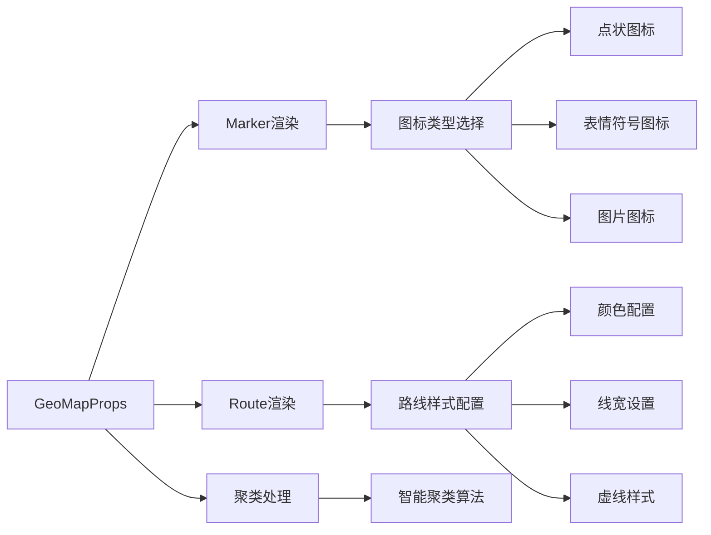
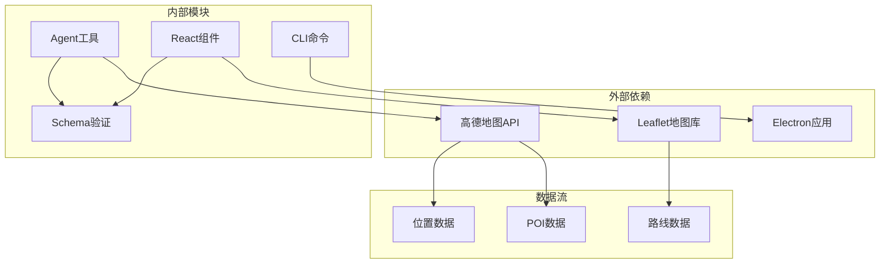

# 地理地图工具

<cite>
**本文档引用的文件**
- [README.md](file://README.md)
- [geo-map-tool.ts](file://src/agents/tools/geo-map-tool.ts)
- [schema.ts](file://ui-react/src/components/tool-ui/geo-map/schema.ts)
- [index.tsx](file://ui-react/src/components/tool-ui/geo-map/index.tsx)
- [gaode_skill.py](file://skills/amap-lbs-skill/gaode_skill.py)
- [SKILL.md](file://skills/amap-lbs-skill/SKILL.md)
- [location.md](file://docs/zh-CN/channels/location.md)
- [location-command.md](file://docs/nodes/location-command.md)
- [register.location.ts](file://src/cli/nodes-cli/register.location.ts)
- [nodes-tool.ts](file://src/agents/tools/nodes-tool.ts)
</cite>

## 目录
1. [简介](#简介)
2. [项目结构](#项目结构)
3. [核心组件](#核心组件)
4. [架构概览](#架构概览)
5. [详细组件分析](#详细组件分析)
6. [依赖关系分析](#依赖关系分析)
7. [性能考虑](#性能考虑)
8. [故障排除指南](#故障排除指南)
9. [结论](#结论)

## 简介

OpenClaw地理地图工具是一个强大的地理信息系统，为个人AI助手提供完整的地图服务功能。该工具集成了多种地图服务，包括高德地图API、Electron桌面应用集成、以及交互式Web地图渲染。

主要功能包括：
- POI（兴趣点）搜索和导航
- 周边搜索和地理编码
- 路线规划和路径计算
- 热力图数据可视化
- 实时位置获取和共享
- 交互式地图渲染

该系统支持多平台部署，包括Web界面、桌面应用和移动设备，为用户提供无缝的地图体验。

## 项目结构

OpenClaw地理地图工具采用模块化架构设计，主要由以下几个核心部分组成：

**图表来源**
- [geo-map-tool.ts:1-89](file://src/agents/tools/geo-map-tool.ts#L1-L89)
- [schema.ts:1-199](file://ui-react/src/components/tool-ui/geo-map/schema.ts#L1-L199)

**章节来源**
- [README.md:1-560](file://README.md#L1-L560)

## 核心组件

### 地图工具接口

地理地图工具的核心是一个TypeBox定义的参数模式，支持丰富的地图渲染功能：

- **标记点管理**：支持多种图标类型（点状、表情符号、图片）
- **路线绘制**：支持多点路线和自定义样式
- **视口控制**：支持自适应缩放和中心定位
- **主题支持**：提供明暗主题切换
- **聚类功能**：支持大量标记点的智能聚类

### UI组件架构

React地图组件采用严格的类型验证和契约设计：

- **Schema验证**：使用Zod进行运行时类型检查
- **工具UI契约**：定义标准化的组件接口
- **事件处理**：支持标记点和路线的点击事件
- **样式定制**：提供CSS变量支持的样式系统

### 地图服务集成

系统集成了多种地图服务提供商：

- **高德地图API**：提供POI搜索、地理编码、路线规划
- **Electron桌面应用**：支持原生桌面地图应用集成
- **Web地图渲染**：基于Leaflet的交互式Web地图

**章节来源**
- [geo-map-tool.ts:63-88](file://src/agents/tools/geo-map-tool.ts#L63-L88)
- [schema.ts:51-92](file://ui-react/src/components/tool-ui/geo-map/schema.ts#L51-L92)

## 架构概览

OpenClaw地理地图工具采用分层架构设计，确保各组件间的松耦合和高内聚：

**图表来源**
- [geo-map-tool.ts:77-88](file://src/agents/tools/geo-map-tool.ts#L77-L88)
- [nodes-tool.ts:578-606](file://src/agents/tools/nodes-tool.ts#L578-L606)

## 详细组件分析

### 高德地图技能集成

高德地图技能提供了完整的地图服务功能，包括POI搜索、路线规划和数据可视化：

**图表来源**
- [gaode_skill.py:146-194](file://skills/amap-lbs-skill/gaode_skill.py#L146-L194)
- [SKILL.md:103-225](file://skills/amap-lbs-skill/SKILL.md#L103-L225)

#### 技能配置和环境要求

高德地图技能需要特定的配置和依赖：

- **API密钥管理**：通过环境变量AMAP_WEBSERVICE_KEY管理
- **Node.js依赖**：需要axios库进行HTTP请求
- **Unix域套接字**：与Electron应用通信

#### 地理编码流程

系统支持多种地理编码方式：

1. **地址到坐标转换**：使用高德地理编码API
2. **坐标解析**：支持经纬度格式的直接解析
3. **周边搜索**：基于坐标进行半径搜索

**章节来源**
- [gaode_skill.py:1-276](file://skills/amap-lbs-skill/gaode_skill.py#L1-L276)
- [SKILL.md:1-248](file://skills/amap-lbs-skill/SKILL.md#L1-L248)

### 实时位置获取

系统支持从配对设备获取实时位置信息：

**图表来源**
- [register.location.ts:23-78](file://src/cli/nodes-cli/register.location.ts#L23-L78)
- [nodes-tool.ts:578-606](file://src/agents/tools/nodes-tool.ts#L578-L606)

#### 权限和准确性控制

系统提供多层次的位置权限控制：

- **权限级别**：Off、While Using、Always
- **精度控制**：粗略、平衡、精确三种精度级别
- **缓存策略**：支持位置数据缓存和时效性控制

**章节来源**
- [location.md:59-64](file://docs/zh-CN/channels/location.md#L59-L64)
- [location-command.md:1-99](file://docs/nodes/location-command.md#L1-L99)

### 地图渲染引擎

React地图组件提供了丰富的地图渲染功能：

**图表来源**
- [schema.ts:19-87](file://ui-react/src/components/tool-ui/geo-map/schema.ts#L19-L87)

#### 视口控制和用户体验

系统提供灵活的视口控制机制：

- **自适应缩放**：根据标记点自动调整视图
- **中心定位**：支持固定中心点和动态定位
- **缩放级别**：支持1-22级缩放范围
- **内边距设置**：支持视图边界调整

**章节来源**
- [schema.ts:94-115](file://ui-react/src/components/tool-ui/geo-map/schema.ts#L94-L115)
- [index.tsx:1-14](file://ui-react/src/components/tool-ui/geo-map/index.tsx#L1-L14)

## 依赖关系分析

地理地图工具的依赖关系呈现清晰的层次结构：

**图表来源**
- [geo-map-tool.ts:1-89](file://src/agents/tools/geo-map-tool.ts#L1-L89)
- [schema.ts:1-199](file://ui-react/src/components/tool-ui/geo-map/schema.ts#L1-L199)

### 数据验证和类型安全

系统采用多层数据验证确保类型安全：

- **编译时验证**：TypeBox在TypeScript层面进行类型检查
- **运行时验证**：Zod在运行时进行数据验证
- **契约测试**：工具UI契约确保组件间接口一致性

### 错误处理和恢复机制

系统实现了完善的错误处理机制：

- **网络错误处理**：API调用失败的重试和降级
- **权限错误处理**：位置权限被拒绝时的优雅降级
- **超时处理**：长时间无响应时的超时管理和用户反馈

**章节来源**
- [gaode_skill.py:24-79](file://skills/amap-lbs-skill/gaode_skill.py#L24-L79)
- [register.location.ts:260-272](file://src/cli/nodes-cli/register.location.ts#L260-L272)

## 性能考虑

地理地图工具在设计时充分考虑了性能优化：

### 内存管理
- **标记点聚类**：大量标记点的智能聚类减少内存占用
- **懒加载机制**：地图数据的按需加载和缓存策略
- **资源清理**：组件卸载时的资源清理和事件监听器移除

### 网络优化
- **请求合并**：相似请求的合并减少网络开销
- **缓存策略**：地理位置数据的智能缓存和失效机制
- **连接池管理**：API请求的连接复用和超时控制

### 渲染优化
- **虚拟滚动**：大量POI列表的虚拟滚动实现
- **增量更新**：地图数据的增量更新而非全量刷新
- **GPU加速**：WebGL渲染和CSS硬件加速

## 故障排除指南

### 常见问题诊断

#### 地图API集成问题
- **症状**：地图无法加载或显示空白
- **原因**：API密钥配置错误或网络连接问题
- **解决方案**：检查AMAP_WEBSERVICE_KEY环境变量，验证网络连接

#### 位置获取失败
- **症状**：无法获取设备当前位置
- **原因**：位置权限被拒绝或设备不支持
- **解决方案**：检查设备位置权限设置，验证GPS功能

#### Electron应用通信问题
- **症状**：Unix域套接字连接失败
- **原因**：Electron应用未启动或套接字文件不存在
- **解决方案**：启动Electron应用，检查套接字文件路径

### 调试工具和日志

系统提供了完善的调试和监控功能：

- **详细日志记录**：每个步骤的详细日志输出
- **性能监控**：关键操作的性能指标收集
- **错误追踪**：异常情况的完整堆栈跟踪

**章节来源**
- [gaode_skill.py:260-272](file://skills/amap-lbs-skill/gaode_skill.py#L260-L272)
- [location-command.md:74-81](file://docs/nodes/location-command.md#L74-L81)

## 结论

OpenClaw地理地图工具是一个功能完整、架构清晰的地理信息系统。通过模块化设计和多层抽象，系统实现了以下优势：

### 技术优势
- **跨平台兼容**：支持Web、桌面和移动设备
- **类型安全**：完整的TypeScript和Zod类型验证
- **性能优化**：智能缓存和渲染优化
- **扩展性强**：插件化的地图服务集成

### 用户价值
- **易用性**：直观的API接口和丰富的配置选项
- **可靠性**：完善的错误处理和降级机制
- **安全性**：严格的权限控制和数据保护
- **可维护性**：清晰的代码结构和文档体系

该工具为OpenClaw个人AI助手提供了强大的地理信息服务基础，支持从简单的POI搜索到复杂的路线规划等多种应用场景。通过持续的优化和扩展，该系统将继续为用户提供优质的地理信息服务体验。