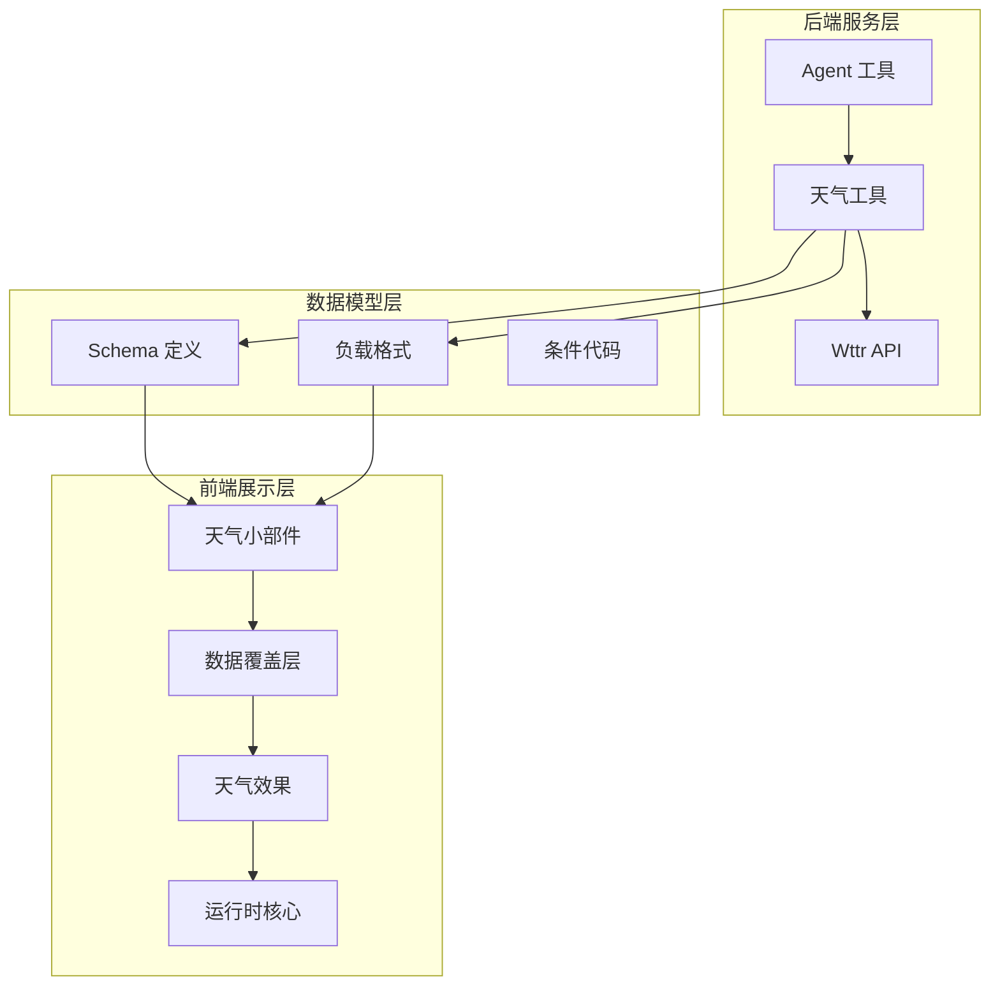
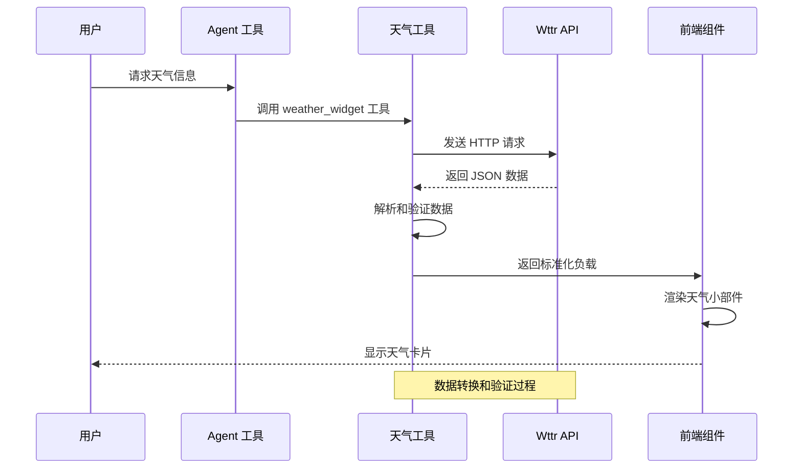
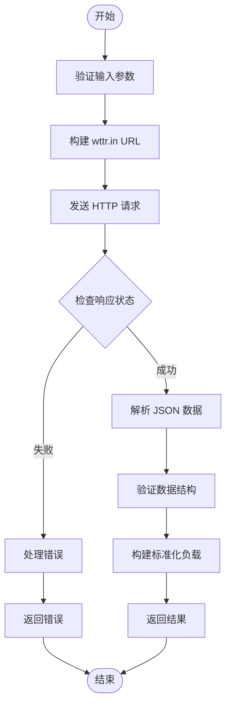
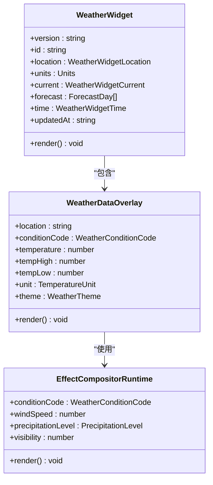
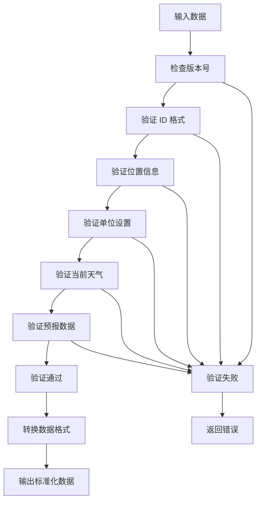
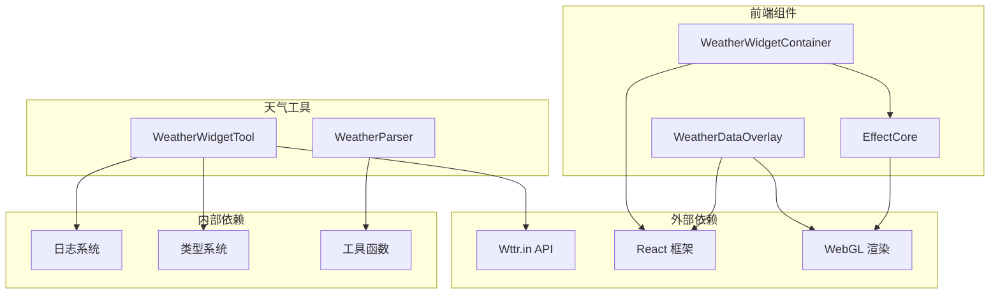

# 天气小部件工具

<cite>
**本文档引用的文件**
- [weather-widget-tool.ts](file://src/agents/tools/weather-widget-tool.ts)
- [weather-widget-tool.test.ts](file://src/agents/tools/weather-widget-tool.test.ts)
- [weather-widget-container.tsx](file://ui-react/src/components/tool-ui/weather-widget/weather-widget-container.tsx)
- [weather-data-overlay.tsx](file://ui-react/src/components/tool-ui/weather-widget/weather-data-overlay.tsx)
- [schema-runtime.ts](file://ui-react/src/components/tool-ui/weather-widget/schema-runtime.ts)
- [parse-weather-widget-payload.ts](file://ui-react/src/components/chat/parse-weather-widget-payload.ts)
- [weather-runtime-core.generated.ts](file://ui-react/src/components/tool-ui/weather-widget/generated/weather-runtime-core.generated.ts)
- [openclaw-tools.ts](file://src/agents/openclaw-tools.ts)
- [SKILL.md](file://skills/weather/SKILL.md)
</cite>

## 目录
1. [简介](#简介)
2. [项目结构](#项目结构)
3. [核心组件](#核心组件)
4. [架构概览](#架构概览)
5. [详细组件分析](#详细组件分析)
6. [依赖关系分析](#依赖关系分析)
7. [性能考虑](#性能考虑)
8. [故障排除指南](#故障排除指南)
9. [结论](#结论)

## 简介

天气小部件工具是 OpenClaw 项目中的一个智能工具，用于为聊天界面提供丰富的天气信息卡片。该工具通过调用 wttr.in API 获取天气数据，并将其转换为标准化的结构化 JSON 格式，然后在前端以美观的可视化界面展示。

该工具的主要特点包括：
- 支持当前天气和未来几天的天气预报
- 提供多种温度单位（摄氏度和华氏度）
- 集成动态天气效果（云层、雨水、闪电等）
- 自适应响应式设计
- 无障碍支持（减少动画偏好）

## 项目结构

天气小部件工具采用分层架构设计，主要包含以下组件：

**图表来源**
- [weather-widget-tool.ts:1-384](file://src/agents/tools/weather-widget-tool.ts#L1-L384)
- [weather-widget-container.tsx:1-145](file://ui-react/src/components/tool-ui/weather-widget/weather-widget-container.tsx#L1-L145)

**章节来源**
- [weather-widget-tool.ts:1-384](file://src/agents/tools/weather-widget-tool.ts#L1-L384)
- [weather-widget-container.tsx:1-145](file://ui-react/src/components/tool-ui/weather-widget/weather-widget-container.tsx#L1-L145)

## 核心组件

### 后端天气工具

天气工具是整个系统的核心，负责处理天气数据的获取、转换和验证。

#### 主要功能
- **数据获取**：从 wttr.in API 获取天气数据
- **数据转换**：将原始数据转换为标准化格式
- **参数验证**：验证用户输入参数的有效性
- **错误处理**：处理网络请求和数据解析异常

#### 关键接口
- `createWeatherWidgetTool()`: 创建天气工具实例
- `fetchWttrJson()`: 异步获取天气数据
- `buildPayloadFromWttr()`: 构建标准化天气负载
- `mapWwoWeatherCodeToCondition()`: 天气代码映射

**章节来源**
- [weather-widget-tool.ts:358-384](file://src/agents/tools/weather-widget-tool.ts#L358-L384)
- [weather-widget-tool.ts:322-356](file://src/agents/tools/weather-widget-tool.ts#L322-L356)

### 前端天气小部件

天气小部件提供丰富的视觉体验，包含多种天气效果和交互功能。

#### 主要特性
- **动态背景**：根据时间变化调整背景颜色
- **天气效果**：实时渲染云层、雨水、雪花等效果
- **响应式设计**：适配不同屏幕尺寸
- **无障碍支持**：支持减少动画偏好设置

#### 组件结构
- `WeatherWidget`: 主容器组件
- `WeatherDataOverlay`: 数据显示层
- `EffectCompositorRuntime`: 效果合成器
- `WeatherDataOverlay`: 数据覆盖层

**章节来源**
- [weather-widget-container.tsx:20-145](file://ui-react/src/components/tool-ui/weather-widget/weather-widget-container.tsx#L20-L145)
- [weather-data-overlay.tsx:131-587](file://ui-react/src/components/tool-ui/weather-widget/weather-data-overlay.tsx#L131-L587)

### 数据模型定义

系统使用严格的 TypeScript 类型定义确保数据一致性。

#### 核心类型
- `WeatherWidgetPayload`: 标准化天气数据格式
- `WeatherConditionCode`: 天气条件代码枚举
- `WeatherWidgetCurrent`: 当前天气信息
- `ForecastDay`: 未来天气预报条目

**章节来源**
- [schema-runtime.ts:1-72](file://ui-react/src/components/tool-ui/weather-widget/schema-runtime.ts#L1-L72)

## 架构概览

天气小部件工具采用客户端-服务器架构，实现了完整的数据流处理：

**图表来源**
- [weather-widget-tool.ts:358-384](file://src/agents/tools/weather-widget-tool.ts#L358-L384)
- [weather-widget-tool.ts:322-356](file://src/agents/tools/weather-widget-tool.ts#L322-L356)

## 详细组件分析

### 天气工具实现

天气工具是系统的核心逻辑组件，负责处理所有天气相关的业务逻辑。

#### 数据获取流程

**图表来源**
- [weather-widget-tool.ts:322-356](file://src/agents/tools/weather-widget-tool.ts#L322-L356)

#### 参数处理机制
天气工具支持灵活的参数配置：

| 参数名 | 类型 | 必需 | 默认值 | 描述 |
|--------|------|------|--------|------|
| location | string | 是 | - | 城市或机场代码 |
| dayOffset | number | 否 | 0 | 日期偏移量（0-3天） |
| units | "celsius" \| "fahrenheit" | 否 | "celsius" | 温度单位 |

**章节来源**
- [weather-widget-tool.ts:358-384](file://src/agents/tools/weather-widget-tool.ts#L358-L384)

### 前端渲染组件

前端组件提供了丰富的视觉体验和交互功能。

#### 天气效果系统

**图表来源**
- [weather-widget-container.tsx:20-145](file://ui-react/src/components/tool-ui/weather-widget/weather-widget-container.tsx#L20-L145)
- [weather-data-overlay.tsx:131-587](file://ui-react/src/components/tool-ui/weather-widget/weather-data-overlay.tsx#L131-L587)

#### 动态效果实现
前端组件集成了多种动态效果，包括：

- **天空渲染**：基于时间的渐变背景
- **云层效果**：多层云彩的动态渲染
- **降水效果**：雨滴、雪花的物理模拟
- **闪电效果**：随机触发的闪电特效
- **玻璃效果**：实时的玻璃反光和折射

**章节来源**
- [weather-runtime-core.generated.ts:1-29](file://ui-react/src/components/tool-ui/weather-widget/generated/weather-runtime-core.generated.ts#L1-L29)

### 数据验证和转换

系统实现了严格的数据验证机制，确保数据的完整性和一致性。

#### 数据验证流程

**图表来源**
- [parse-weather-widget-payload.ts:22-60](file://ui-react/src/components/chat/parse-weather-widget-payload.ts#L22-L60)

**章节来源**
- [parse-weather-widget-payload.ts:1-60](file://ui-react/src/components/chat/parse-weather-widget-payload.ts#L1-L60)

## 依赖关系分析

天气小部件工具的依赖关系相对简单，主要依赖于外部 API 和内部工具模块。

**图表来源**
- [weather-widget-tool.ts:5-8](file://src/agents/tools/weather-widget-tool.ts#L5-L8)
- [weather-widget-container.tsx:1-16](file://ui-react/src/components/tool-ui/weather-widget/weather-widget-container.tsx#L1-L16)

### 工具注册和集成

天气工具通过工具注册系统集成到 Agent 中：

**章节来源**
- [openclaw-tools.ts:167-167](file://src/agents/openclaw-tools.ts#L167-L167)

## 性能考虑

天气小部件工具在设计时充分考虑了性能优化：

### 网络请求优化
- **超时控制**：20秒超时限制，防止长时间等待
- **缓存策略**：合理利用浏览器缓存机制
- **错误重试**：在网络失败时自动重试

### 渲染性能优化
- **虚拟 DOM**：React 的高效更新机制
- **条件渲染**：仅渲染必要的组件
- **资源管理**：及时释放 WebGL 资源

### 内存管理
- **垃圾回收**：自动内存管理
- **资源清理**：组件卸载时清理事件监听器
- **循环引用**：避免不必要的循环引用

## 故障排除指南

### 常见问题和解决方案

#### 网络连接问题
**症状**：天气数据无法加载
**原因**：网络连接不稳定或 API 服务不可用
**解决方案**：
1. 检查网络连接状态
2. 验证 wttr.in API 可访问性
3. 查看浏览器开发者工具中的网络请求

#### 数据解析错误
**症状**：显示 "无效的天气数据" 错误
**原因**：API 返回的数据格式不符合预期
**解决方案**：
1. 检查 API 返回的状态码
2. 验证 JSON 数据结构
3. 查看日志中的详细错误信息

#### 渲染性能问题
**症状**：页面卡顿或渲染缓慢
**原因**：过多的 DOM 元素或复杂的 CSS 属性
**解决方案**：
1. 减少不必要的组件渲染
2. 优化 CSS 动画性能
3. 使用 React.memo 进行组件优化

**章节来源**
- [weather-widget-tool.ts:322-356](file://src/agents/tools/weather-widget-tool.ts#L322-L356)

### 调试技巧

#### 开发者工具使用
1. **Network 面板**：监控 API 请求和响应
2. **Console 面板**：查看错误和警告信息
3. **Elements 面板**：检查 DOM 结构和样式
4. **Performance 面板**：分析渲染性能

#### 日志记录
系统提供了详细的日志记录功能，可以帮助诊断问题：

**章节来源**
- [weather-widget-tool.ts:10-10](file://src/agents/tools/weather-widget-tool.ts#L10-L10)

## 结论

天气小部件工具是一个功能完整、设计精良的智能工具，它成功地将天气数据转换为美观且实用的可视化界面。该工具的主要优势包括：

### 技术优势
- **模块化设计**：清晰的前后端分离架构
- **类型安全**：完整的 TypeScript 类型定义
- **性能优化**：高效的渲染和资源管理
- **可扩展性**：易于添加新的天气效果和功能

### 用户体验
- **直观界面**：简洁美观的设计
- **响应式布局**：适配各种设备
- **无障碍支持**：考虑特殊需求用户
- **实时更新**：动态天气效果

### 维护性
- **代码组织**：清晰的文件结构和命名约定
- **测试覆盖**：完善的单元测试
- **文档齐全**：详细的注释和说明

该工具为 OpenClaw 项目提供了一个优秀的天气信息服务示例，展示了如何将外部 API 数据转换为用户友好的界面组件。其设计模式和实现技术可以作为其他类似项目的参考模板。