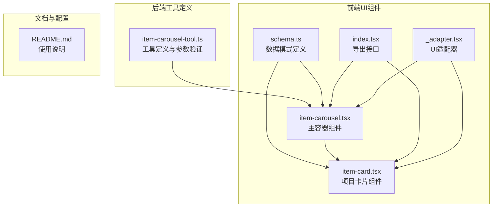
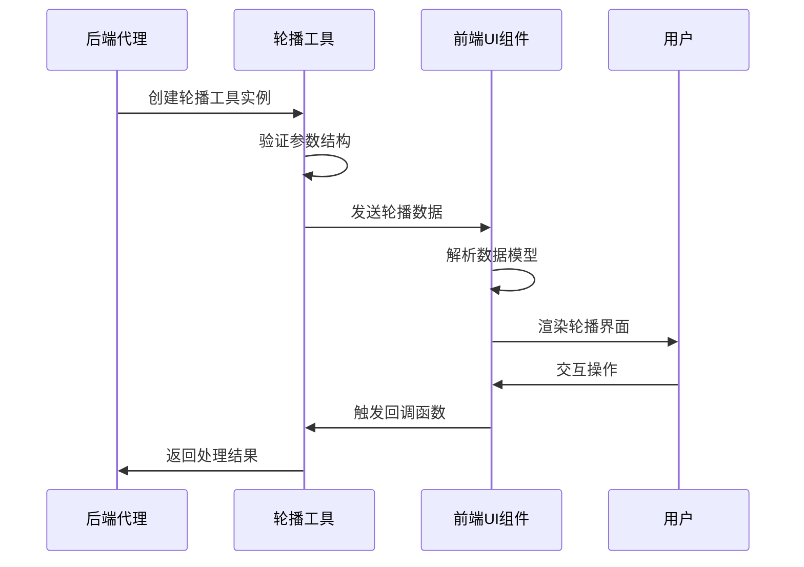
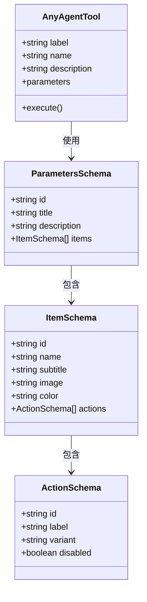
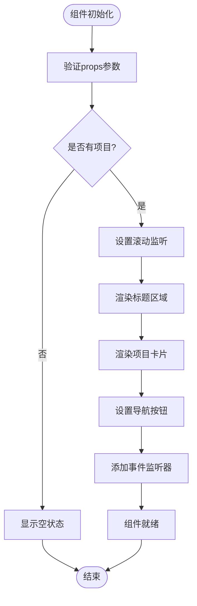
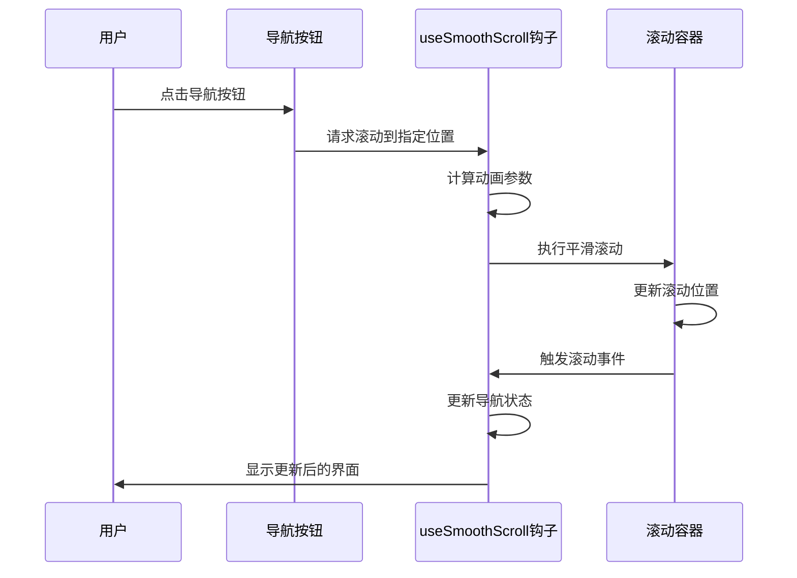
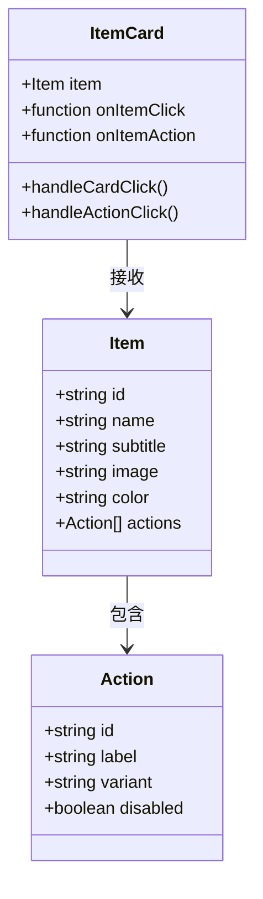
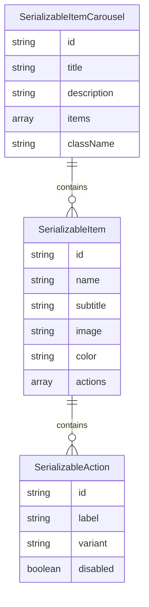
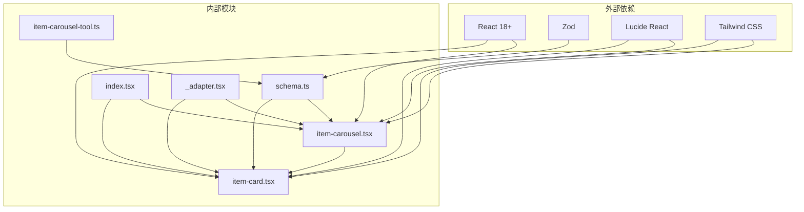

# 项目轮播工具

<cite>
**本文档引用的文件**
- [item-carousel-tool.ts](file://src/agents/tools/item-carousel-tool.ts)
- [schema.ts](file://ui-react/src/components/tool-ui/item-carousel/schema.ts)
- [item-carousel.tsx](file://ui-react/src/components/tool-ui/item-carousel/item-carousel.tsx)
- [item-card.tsx](file://ui-react/src/components/tool-ui/item-carousel/item-card.tsx)
- [index.tsx](file://ui-react/src/components/tool-ui/item-carousel/index.tsx)
- [_adapter.tsx](file://ui-react/src/components/tool-ui/item-carousel/_adapter.tsx)
- [README.md](file://ui-react/src/components/tool-ui/item-carousel/README.md)
</cite>

## 目录
1. [简介](#简介)
2. [项目结构](#项目结构)
3. [核心组件](#核心组件)
4. [架构概览](#架构概览)
5. [详细组件分析](#详细组件分析)
6. [依赖关系分析](#依赖关系分析)
7. [性能考虑](#性能考虑)
8. [故障排除指南](#故障排除指南)
9. [结论](#结论)

## 简介

OpenClaw项目中的轮播工具是一个完整的UI组件系统，用于在控制界面中展示水平滚动的商品、路线或POI（兴趣点）等项目列表。该工具采用React组件设计，支持响应式布局、平滑滚动动画和无障碍访问功能。

该轮播工具主要包含两个核心部分：
- **后端工具定义**：定义了轮播工具的数据结构和参数验证
- **前端UI组件**：实现了完整的轮播交互界面，包括导航按钮、卡片渲染和滚动动画

## 项目结构

轮播工具的项目结构遵循模块化设计原则，分为后端工具定义和前端UI组件两大部分：

**图表来源**
- [item-carousel-tool.ts:1-49](file://src/agents/tools/item-carousel-tool.ts#L1-L49)
- [schema.ts:1-78](file://ui-react/src/components/tool-ui/item-carousel/schema.ts#L1-L78)
- [item-carousel.tsx:1-404](file://ui-react/src/components/tool-ui/item-carousel/item-carousel.tsx#L1-L404)

**章节来源**
- [item-carousel-tool.ts:1-49](file://src/agents/tools/item-carousel-tool.ts#L1-L49)
- [schema.ts:1-78](file://ui-react/src/components/tool-ui/item-carousel/schema.ts#L1-L78)
- [item-carousel.tsx:1-404](file://ui-react/src/components/tool-ui/item-carousel/item-carousel.tsx#L1-L404)

## 核心组件

轮播工具系统由以下核心组件构成：

### 数据模型组件
- **ItemSchema**：定义单个项目的完整数据结构
- **ItemCarouselPropsSchema**：定义轮播容器的属性结构
- **SerializableItemSchema**：可序列化的项目数据模型

### UI组件层次
- **ItemCarousel**：主容器组件，负责整体布局和状态管理
- **ItemCard**：单个项目卡片组件，处理点击和操作事件
- **CarouselNavButton**：导航按钮组件，提供左右滚动功能
- **ItemCarouselHeader**：标题区域组件
- **EmptyState**：空状态组件

**章节来源**
- [schema.ts:9-24](file://ui-react/src/components/tool-ui/item-carousel/schema.ts#L9-L24)
- [item-carousel.tsx:232-404](file://ui-react/src/components/tool-ui/item-carousel/item-carousel.tsx#L232-L404)

## 架构概览

轮播工具采用分层架构设计，确保前后端数据的一致性和UI组件的可复用性：

**图表来源**
- [item-carousel-tool.ts:37-48](file://src/agents/tools/item-carousel-tool.ts#L37-L48)
- [item-carousel.tsx:240-248](file://ui-react/src/components/tool-ui/item-carousel/item-carousel.tsx#L240-L248)

## 详细组件分析

### 工具定义组件分析

#### 参数验证机制
轮播工具使用TypeBox库进行严格的参数验证，确保数据结构的完整性和一致性。

**图表来源**
- [item-carousel-tool.ts:7-35](file://src/agents/tools/item-carousel-tool.ts#L7-L35)

#### 执行流程
工具的执行流程简洁高效，直接返回传入的参数作为JSON响应。

**章节来源**
- [item-carousel-tool.ts:37-48](file://src/agents/tools/item-carousel-tool.ts#L37-L48)

### UI组件详细分析

#### 主容器组件架构
ItemCarousel主容器组件实现了完整的轮播功能，包括滚动控制、导航按钮和响应式布局。

**图表来源**
- [item-carousel.tsx:232-387](file://ui-react/src/components/tool-ui/item-carousel/item-carousel.tsx#L232-L387)

#### 滚动动画实现
组件内置了复杂的滚动动画系统，支持平滑滚动和边缘检测：

**图表来源**
- [item-carousel.tsx:250-289](file://ui-react/src/components/tool-ui/item-carousel/item-carousel.tsx#L250-L289)

#### 项目卡片组件设计
ItemCard组件提供了丰富的交互功能，支持点击事件和操作按钮：

**图表来源**
- [item-card.tsx:6-23](file://ui-react/src/components/tool-ui/item-carousel/item-card.tsx#L6-L23)

**章节来源**
- [item-carousel.tsx:1-404](file://ui-react/src/components/tool-ui/item-carousel/item-carousel.tsx#L1-L404)
- [item-card.tsx:1-111](file://ui-react/src/components/tool-ui/item-carousel/item-card.tsx#L1-L111)

### 数据模式验证

#### 序列化数据模型
系统提供了完整的数据序列化机制，确保前后端数据传输的一致性：

**图表来源**
- [schema.ts:33-58](file://ui-react/src/components/tool-ui/item-carousel/schema.ts#L33-L58)

**章节来源**
- [schema.ts:1-78](file://ui-react/src/components/tool-ui/item-carousel/schema.ts#L1-L78)

## 依赖关系分析

轮播工具系统的依赖关系清晰明确，遵循单一职责原则：

**图表来源**
- [item-carousel.tsx:1-8](file://ui-react/src/components/tool-ui/item-carousel/item-carousel.tsx#L1-L8)
- [_adapter.tsx:1-6](file://ui-react/src/components/tool-ui/item-carousel/_adapter.tsx#L1-L6)

**章节来源**
- [index.tsx:1-8](file://ui-react/src/components/tool-ui/item-carousel/index.tsx#L1-L8)
- [_adapter.tsx:1-6](file://ui-react/src/components/tool-ui/item-carousel/_adapter.tsx#L1-L6)

## 性能考虑

轮播工具在设计时充分考虑了性能优化：

### 滚动性能优化
- 使用`requestAnimationFrame`确保60fps滚动效果
- 实现滚动位置缓存，避免重复计算
- 支持减少动画偏好设置，提升无障碍体验

### 内存管理
- 组件卸载时自动清理事件监听器
- 使用`ResizeObserver`监听容器尺寸变化
- 实现滚动动画取消机制

### 渲染优化
- 条件渲染空状态组件
- 懒加载图片资源
- 响应式布局减少重排重绘

## 故障排除指南

### 常见问题及解决方案

#### 数据验证错误
当传递给轮播工具的数据不符合Schema要求时，会触发验证错误：

**问题症状**：组件渲染失败或显示错误信息
**解决方案**：检查数据结构是否符合Schema定义，特别是`id`字段的唯一性要求

#### 滚动功能异常
**问题症状**：导航按钮不显示或无法滚动
**解决方案**：确认容器元素存在且具有正确的CSS类名，检查`scroll-padding`样式设置

#### 图片加载问题
**问题症状**：卡片显示为占位色块而非图片
**解决方案**：验证图片URL的有效性，检查网络连接和CORS设置

**章节来源**
- [schema.ts:43-58](file://ui-react/src/components/tool-ui/item-carousel/schema.ts#L43-L58)

## 结论

OpenClaw项目的轮播工具系统展现了现代前端开发的最佳实践：

### 设计优势
- **类型安全**：使用TypeBox和Zod确保数据完整性
- **组件化设计**：清晰的模块划分和职责分离
- **用户体验**：流畅的动画效果和无障碍支持
- **可扩展性**：灵活的配置选项和插件机制

### 技术亮点
- 完整的TypeScript类型定义
- 响应式设计支持多设备适配
- 优化的滚动性能和内存管理
- 严格的数据验证和错误处理

该轮播工具系统为OpenClaw平台提供了强大的内容展示能力，能够有效提升用户交互体验和信息传达效率。