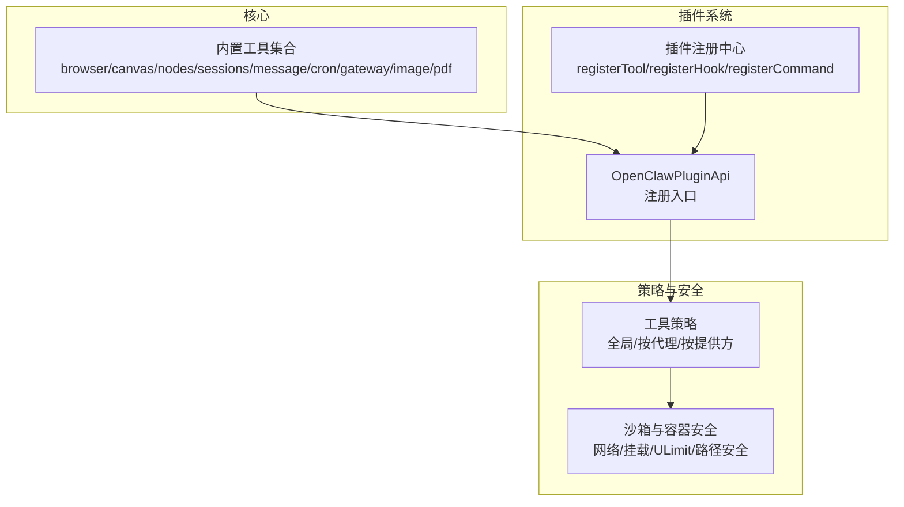
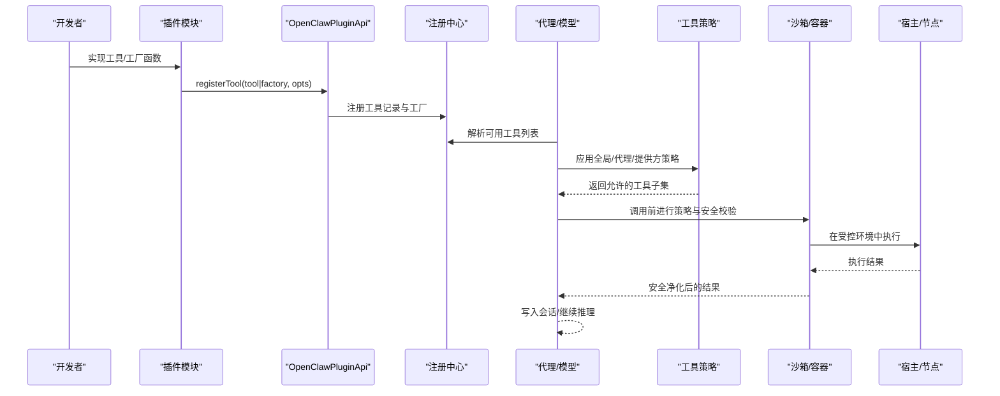
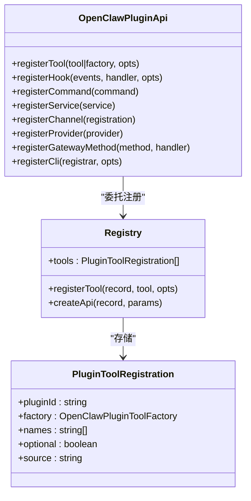
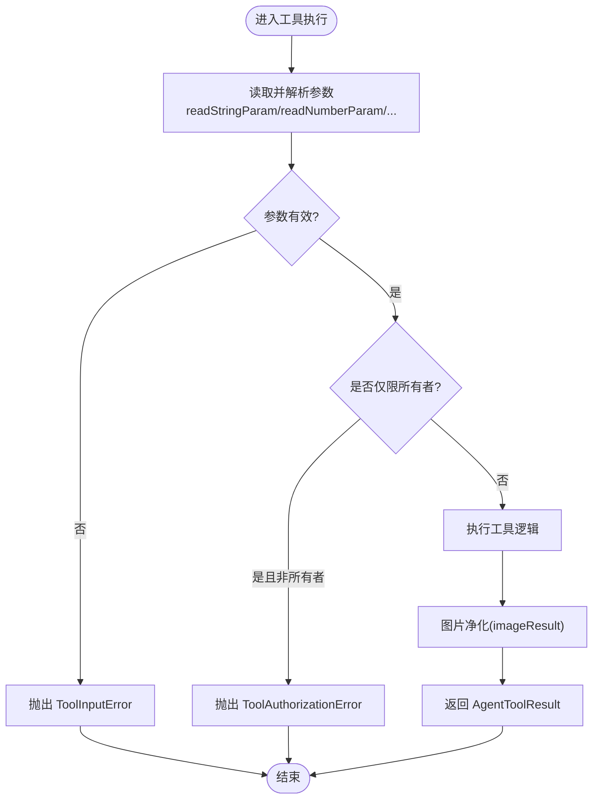
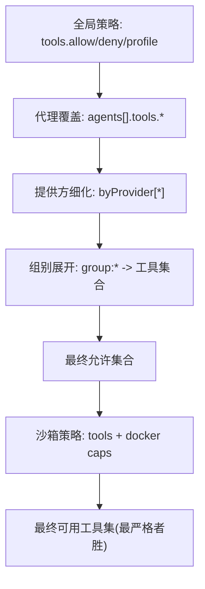
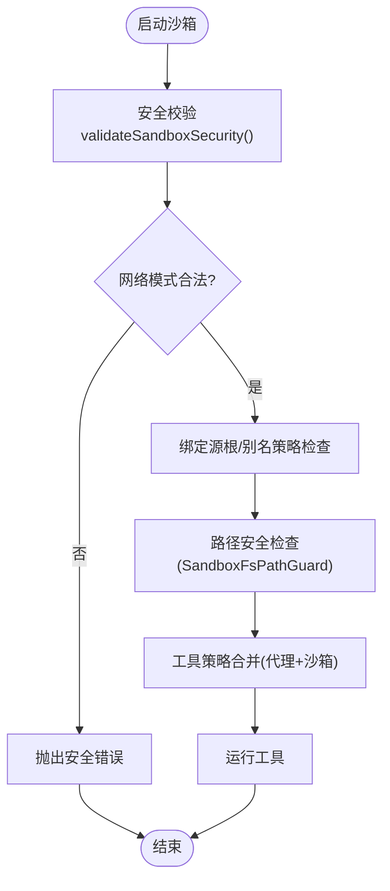
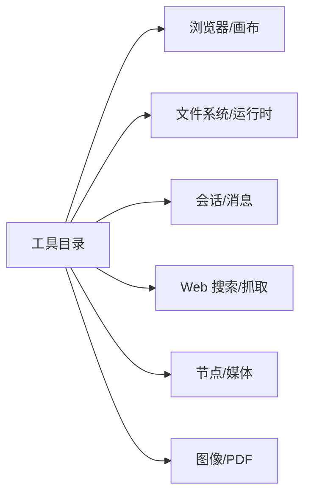
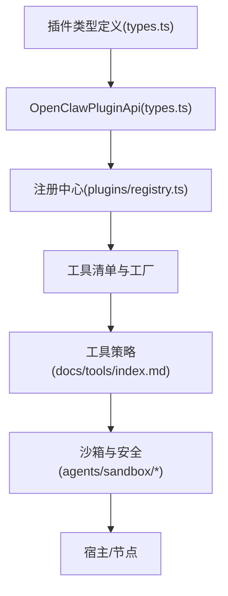

# 工具开发指南

<cite>
**本文档引用的文件**
- [src/plugins/registry.ts](file://src/plugins/registry.ts)
- [src/plugins/types.ts](file://src/plugins/types.ts)
- [src/agents/tools/common.ts](file://src/agents/tools/common.ts)
- [src/agents/pi-tools.params.ts](file://src/agents/pi-tools.params.ts)
- [src/agents/sandbox-tool-policy.ts](file://src/agents/sandbox-tool-policy.ts)
- [src/agents/sandbox/validate-sandbox-security.ts](file://src/agents/sandbox/validate-sandbox-security.ts)
- [src/agents/sandbox/docker.ts](file://src/agents/sandbox/docker.ts)
- [src/agents/sandbox/fs-bridge-path-safety.ts](file://src/agents/sandbox/fs-bridge-path-safety.ts)
- [src/agents/pi-tools-agent-config.test.ts](file://src/agents/pi-tools-agent-config.test.ts)
- [docs/tools/index.md](file://docs/tools/index.md)
- [docs/tools/creating-skills.md](file://docs/tools/creating-skills.md)
- [src/plugin-sdk/index.ts](file://src/plugin-sdk/index.ts)
- [extensions/feishu/src/tool-factory-test-harness.ts](file://extensions/feishu/src/tool-factory-test-harness.ts)
- [apps/macos/Sources/OpenClawProtocol/GatewayModels.swift](file://apps/macos/Sources/OpenClawProtocol/GatewayModels.swift)
- [apps/shared/OpenClawKit/Sources/OpenClawProtocol/GatewayModels.swift](file://apps/shared/OpenClawKit/Sources/OpenClawProtocol/GatewayModels.swift)
</cite>

## 目录

1. [简介](#简介)
2. [项目结构](#项目结构)
3. [核心组件](#核心组件)
4. [架构总览](#架构总览)
5. [详细组件分析](#详细组件分析)
6. [依赖关系分析](#依赖关系分析)
7. [性能考虑](#性能考虑)
8. [故障排查指南](#故障排查指南)
9. [结论](#结论)
10. [附录](#附录)

## 简介

本指南面向在 OpenClaw 平台上开发“工具”的工程师，系统阐述工具的开发流程、编码规范、测试方法与部署路径；详解工具接口定义、参数校验与返回值规范；说明工具注册机制、工具发现与生命周期管理；解释工具策略（含代理策略与沙箱策略）、权限控制与安全限制；并给出工具运行时环境、沙箱与隔离机制的技术细节。最后提供最佳实践、性能优化与错误处理建议，并覆盖测试、调试与部署的完整流程。

## 项目结构

OpenClaw 的工具体系由“核心工具 + 插件工具 + 策略与安全”三层构成：

- 核心工具：浏览器、画布、节点、会话、消息、定时等内置工具，统一暴露给模型调用。
- 插件工具：通过插件系统注册的第三方或自定义工具，扩展核心能力。
- 策略与安全：全局/按代理/按提供方的工具策略，以及沙箱与容器安全策略。

图示来源

- [src/plugins/registry.ts:185-624](file://src/plugins/registry.ts#L185-L624)
- [src/plugins/types.ts:263-306](file://src/plugins/types.ts#L263-L306)
- [src/agents/sandbox-tool-policy.ts:1-37](file://src/agents/sandbox-tool-policy.ts#L1-L37)
- [src/agents/sandbox/validate-sandbox-security.ts:272-306](file://src/agents/sandbox/validate-sandbox-security.ts#L272-L306)

章节来源

- [src/plugins/registry.ts:185-624](file://src/plugins/registry.ts#L185-L624)
- [src/plugins/types.ts:248-306](file://src/plugins/types.ts#L248-L306)
- [docs/tools/index.md:1-574](file://docs/tools/index.md#L1-L574)

## 核心组件

- 工具注册与发现：插件通过 OpenClawPluginApi.registerTool 注册工具，注册中心维护工具清单与工厂映射，支持按名称解析与批量构建。
- 工具接口与参数：工具需实现统一的 AgentTool 接口，参数读取提供字符串/数字/数组/反应动作等通用解析器，并对必填项进行校验。
- 工具策略：支持全局允许/拒绝、按代理覆盖、按提供方细化；同时支持组别快捷展开（如 group:fs、group:runtime）。
- 沙箱与安全：容器安全校验（网络模式、命名空间、绑定源根）、路径安全检查、文件桥接安全策略、工具策略合并（代理策略优先于沙箱策略）。

章节来源

- [src/plugins/types.ts:58-83](file://src/plugins/types.ts#L58-L83)
- [src/agents/tools/common.ts:74-228](file://src/agents/tools/common.ts#L74-L228)
- [src/agents/pi-tools.params.ts:168-204](file://src/agents/pi-tools.params.ts#L168-L204)
- [docs/tools/index.md:15-178](file://docs/tools/index.md#L15-L178)

## 架构总览

下图展示工具从注册到执行的端到端流程，包括策略与安全拦截点：

图示来源

- [src/plugins/registry.ts:193-218](file://src/plugins/registry.ts#L193-L218)
- [src/plugins/types.ts:273-276](file://src/plugins/types.ts#L273-L276)
- [src/agents/sandbox-tool-policy.ts:21-37](file://src/agents/sandbox-tool-policy.ts#L21-L37)
- [src/agents/sandbox/validate-sandbox-security.ts:283-306](file://src/agents/sandbox/validate-sandbox-security.ts#L283-L306)

## 详细组件分析

### 组件A：工具注册与发现

- 注册入口：OpenClawPluginApi 提供 registerTool，支持单个工具对象或工厂函数（按上下文动态生成工具列表）。
- 注册中心：维护工具名、工厂、可选标记与来源信息；支持按名称解析工具实例。
- 工具工厂：插件可导出工厂函数，根据上下文（会话、账号、工作区）返回一组工具，便于动态装配。

图示来源

- [src/plugins/types.ts:263-306](file://src/plugins/types.ts#L263-L306)
- [src/plugins/registry.ts:193-218](file://src/plugins/registry.ts#L193-L218)
- [src/plugins/registry.ts:102-127](file://src/plugins/registry.ts#L102-L127)

章节来源

- [src/plugins/registry.ts:185-624](file://src/plugins/registry.ts#L185-L624)
- [src/plugins/types.ts:248-306](file://src/plugins/types.ts#L248-L306)
- [extensions/feishu/src/tool-factory-test-harness.ts:37-76](file://extensions/feishu/src/tool-factory-test-harness.ts#L37-L76)

### 组件B：工具接口定义与参数校验

- 工具接口：统一的 AgentTool 类型，支持 ownerOnly 限制、execute 方法与可选元数据。
- 参数读取：提供字符串、数字、数组、反应动作等解析器，支持必填、去空、类型转换与严格模式。
- 参数校验：对必填参数组进行校验，缺失时报 ToolInputError；授权场景使用 ToolAuthorizationError。
- 结果封装：统一的 AgentToolResult 结构，支持文本与图片块组合，并进行图片净化。

图示来源

- [src/agents/tools/common.ts:74-228](file://src/agents/tools/common.ts#L74-L228)
- [src/agents/tools/common.ts:242-255](file://src/agents/tools/common.ts#L242-L255)
- [src/agents/tools/common.ts:257-302](file://src/agents/tools/common.ts#L257-L302)
- [src/agents/pi-tools.params.ts:168-204](file://src/agents/pi-tools.params.ts#L168-L204)

章节来源

- [src/agents/tools/common.ts:1-341](file://src/agents/tools/common.ts#L1-L341)
- [src/agents/pi-tools.params.ts:154-204](file://src/agents/pi-tools.params.ts#L154-L204)

### 组件C：工具策略与权限控制

- 全局策略：tools.allow/tools.deny 支持通配符与大小写不敏感匹配；deny 优先级更高。
- 代理策略：agents.list[].tools 可覆盖全局策略，支持 profile 快捷配置（minimal/coding/messaging/full）。
- 提供方策略：tools.byProvider 针对特定 provider 或 provider/model 进一步收窄工具集。
- 组别快捷：group:\* 展开为多个具体工具，便于快速组合（如 group:fs、group:runtime）。
- 策略合并：代理策略先应用，再叠加沙箱策略；两者取交集，最严格者生效。

图示来源

- [docs/tools/index.md:15-178](file://docs/tools/index.md#L15-L178)
- [src/agents/sandbox-tool-policy.ts:21-37](file://src/agents/sandbox-tool-policy.ts#L21-L37)
- [src/agents/pi-tools-agent-config.test.ts:570-608](file://src/agents/pi-tools-agent-config.test.ts#L570-L608)

章节来源

- [docs/tools/index.md:15-178](file://docs/tools/index.md#L15-L178)
- [src/agents/sandbox-tool-policy.ts:1-37](file://src/agents/sandbox-tool-policy.ts#L1-L37)
- [src/agents/pi-tools-agent-config.test.ts:570-608](file://src/agents/pi-tools-agent-config.test.ts#L570-L608)

### 组件D：运行时环境、沙箱与隔离机制

- 容器安全：校验网络模式（host/container:\* 等），禁止危险配置；校验绑定源根、保留容器目标、环境变量净化。
- 路径安全：对文件桥接路径进行安全检查，防止越权访问与符号链接逃逸；支持别名策略与只写要求。
- 工具策略与沙箱：代理策略与沙箱策略共同决定工具可用性；代理策略优先，二者取交集。
- Docker 参数：构建沙箱创建参数时进行安全校验，包括 ulimit、网络、capDrop、tmpfs 等。

图示来源

- [src/agents/sandbox/validate-sandbox-security.ts:283-306](file://src/agents/sandbox/validate-sandbox-security.ts#L283-L306)
- [src/agents/sandbox/docker.ts:317-344](file://src/agents/sandbox/docker.ts#L317-L344)
- [src/agents/sandbox/fs-bridge-path-safety.ts:1-49](file://src/agents/sandbox/fs-bridge-path-safety.ts#L1-L49)
- [src/agents/sandbox-tool-policy.ts:21-37](file://src/agents/sandbox-tool-policy.ts#L21-L37)

章节来源

- [src/agents/sandbox/validate-sandbox-security.ts:272-306](file://src/agents/sandbox/validate-sandbox-security.ts#L272-L306)
- [src/agents/sandbox/docker.ts:317-344](file://src/agents/sandbox/docker.ts#L317-L344)
- [src/agents/sandbox/fs-bridge-path-safety.ts:1-49](file://src/agents/sandbox/fs-bridge-path-safety.ts#L1-L49)
- [src/agents/sandbox-tool-policy.ts:1-37](file://src/agents/sandbox-tool-policy.ts#L1-L37)

### 组件E：工具目录与分类（概念性）

OpenClaw 将工具按功能分组，形成“工具目录”，帮助用户理解可用能力与使用边界。例如：

- 浏览器与画布：用于 UI 自动化与可视化呈现
- 文件系统与运行时：读写、编辑、执行命令
- 会话与消息：跨渠道消息发送与会话管理
- Web 搜索与抓取：信息检索与内容抽取
- 节点与摄像头：本地设备能力调用
- 图像与 PDF：多媒体内容分析

图示来源

- [docs/tools/index.md:179-574](file://docs/tools/index.md#L179-L574)

章节来源

- [docs/tools/index.md:179-574](file://docs/tools/index.md#L179-L574)

## 依赖关系分析

- 插件注册依赖 OpenClawPluginApi，后者封装了注册工具、钩子、命令、服务、通道与网关方法的能力。
- 工具策略与沙箱策略相互作用，最终决定工具可用性；策略解析依赖配置系统与工具清单。
- 安全校验贯穿容器创建与运行阶段，确保网络、挂载与路径安全。

图示来源

- [src/plugins/types.ts:248-306](file://src/plugins/types.ts#L248-L306)
- [src/plugins/registry.ts:185-624](file://src/plugins/registry.ts#L185-L624)
- [docs/tools/index.md:15-178](file://docs/tools/index.md#L15-L178)

章节来源

- [src/plugins/types.ts:248-306](file://src/plugins/types.ts#L248-L306)
- [src/plugins/registry.ts:185-624](file://src/plugins/registry.ts#L185-L624)
- [docs/tools/index.md:15-178](file://docs/tools/index.md#L15-L178)

## 性能考虑

- 工具参数解析与校验应尽量轻量，避免在热路径中做昂贵操作。
- 对大结果进行预压缩或分页输出，减少上下文占用。
- 合理使用并发与批处理（如并行观察、并行工作流），但注意资源上限与超时控制。
- 沙箱内 I/O 与网络请求应设置合理超时与重试策略，避免阻塞代理循环。
- 使用工具策略与组别快捷，减少不必要的工具暴露，降低模型选择成本。

## 故障排查指南

- 参数错误：检查 ToolInputError 抛出位置，确认必填参数与类型转换是否正确。
- 权限错误：确认 ToolAuthorizationError 是否由 ownerOnly 限制触发，核对 senderIsOwner 上下文。
- 策略未生效：检查 tools.allow/tools.deny/profile/byProvider 配置层级与优先级，确认组别展开是否符合预期。
- 沙箱失败：查看 validateSandboxSecurity 报错原因（网络模式、绑定源根、容器命名空间），调整配置。
- 文件路径问题：使用 SandboxFsPathGuard 与路径安全检查，避免符号链接逃逸与越权访问。
- 工具未注册：确认插件已加载、registerTool 已调用、名称拼写一致。

章节来源

- [src/agents/tools/common.ts:26-42](file://src/agents/tools/common.ts#L26-L42)
- [src/agents/tools/common.ts:242-255](file://src/agents/tools/common.ts#L242-L255)
- [src/agents/sandbox/validate-sandbox-security.ts:292-305](file://src/agents/sandbox/validate-sandbox-security.ts#L292-L305)
- [src/agents/sandbox/fs-bridge-path-safety.ts:1-49](file://src/agents/sandbox/fs-bridge-path-safety.ts#L1-L49)

## 结论

OpenClaw 的工具体系以插件注册为核心，结合强大的策略与安全机制，既保证了灵活性，又确保了可控性与安全性。开发者应遵循统一的工具接口与参数校验规范，合理设计工具策略与沙箱配置，以获得稳定、高效且可审计的工具运行体验。

## 附录

### 开发流程与最佳实践

- 设计工具接口：遵循 AgentTool 规范，提供清晰的参数 schema 与错误码。
- 编写参数解析：使用统一的解析器，确保必填项与类型约束。
- 实施策略与权限：在插件层面声明最小权限，配合全局/代理/提供方策略。
- 沙箱与安全：启用安全校验，限制网络与挂载，使用路径安全检查。
- 测试与调试：利用工具工厂测试夹具与单元测试，覆盖正常与异常路径。
- 部署与发布：通过插件系统打包与分发，确保配置 schema 与 UI 提示完善。

章节来源

- [src/plugin-sdk/index.ts:1-826](file://src/plugin-sdk/index.ts#L1-L826)
- [extensions/feishu/src/tool-factory-test-harness.ts:37-76](file://extensions/feishu/src/tool-factory-test-harness.ts#L37-L76)
- [docs/tools/creating-skills.md:1-59](file://docs/tools/creating-skills.md#L1-L59)

### 工具接口与参数规范（摘要）

- 工具接口：统一的 AgentTool，支持 ownerOnly、execute、details 等字段。
- 参数读取：字符串、数字、数组、反应动作等解析器，支持必填、去空、类型转换。
- 错误处理：ToolInputError、ToolAuthorizationError 等标准化错误类型。
- 结果封装：AgentToolResult，支持文本与图片块，自动图片净化。

章节来源

- [src/agents/tools/common.ts:7-10](file://src/agents/tools/common.ts#L7-L10)
- [src/agents/tools/common.ts:74-228](file://src/agents/tools/common.ts#L74-L228)
- [src/agents/tools/common.ts:230-302](file://src/agents/tools/common.ts#L230-L302)

### 工具注册与生命周期

- 注册：通过 OpenClawPluginApi.registerTool 注册工具或工厂。
- 发现：注册中心维护工具清单，按名称解析与批量构建。
- 生命周期：插件激活时注册，插件卸载时清理；工具在会话中按需实例化。

章节来源

- [src/plugins/registry.ts:193-218](file://src/plugins/registry.ts#L193-L218)
- [src/plugins/registry.ts:610-624](file://src/plugins/registry.ts#L610-L624)

### 工具策略与权限控制（要点）

- 全局 allow/deny：大小写不敏感，支持通配符；deny 优先。
- 代理覆盖：agents.list[].tools 可覆盖全局策略，支持 profile 快捷。
- 提供方细化：byProvider 针对 provider 或 provider/model 收窄工具集。
- 组别展开：group:\* 展开为多工具集合。
- 策略合并：代理策略优先于沙箱策略，取交集。

章节来源

- [docs/tools/index.md:15-178](file://docs/tools/index.md#L15-L178)
- [src/agents/sandbox-tool-policy.ts:21-37](file://src/agents/sandbox-tool-policy.ts#L21-L37)

### 运行时环境与沙箱

- 容器安全：网络模式、命名空间、绑定源根、保留容器目标、环境变量净化。
- 路径安全：别名策略、只写要求、符号链接逃逸防护。
- 工具策略：代理策略与沙箱策略合并，最严格者生效。
- Docker 参数：ulimit、网络、capDrop、tmpfs 等。

章节来源

- [src/agents/sandbox/validate-sandbox-security.ts:283-306](file://src/agents/sandbox/validate-sandbox-security.ts#L283-L306)
- [src/agents/sandbox/docker.ts:317-344](file://src/agents/sandbox/docker.ts#L317-L344)
- [src/agents/sandbox/fs-bridge-path-safety.ts:1-49](file://src/agents/sandbox/fs-bridge-path-safety.ts#L1-L49)
- [src/agents/sandbox-tool-policy.ts:21-37](file://src/agents/sandbox-tool-policy.ts#L21-L37)

### 工具目录与分类（参考）

- 浏览器/画布：UI 自动化与可视化
- 文件系统/运行时：读写、编辑、执行命令
- 会话/消息：跨渠道消息发送与会话管理
- Web 搜索/抓取：信息检索与内容抽取
- 节点/媒体：本地设备能力调用
- 图像/PDF：多媒体内容分析

章节来源

- [docs/tools/index.md:179-574](file://docs/tools/index.md#L179-L574)
