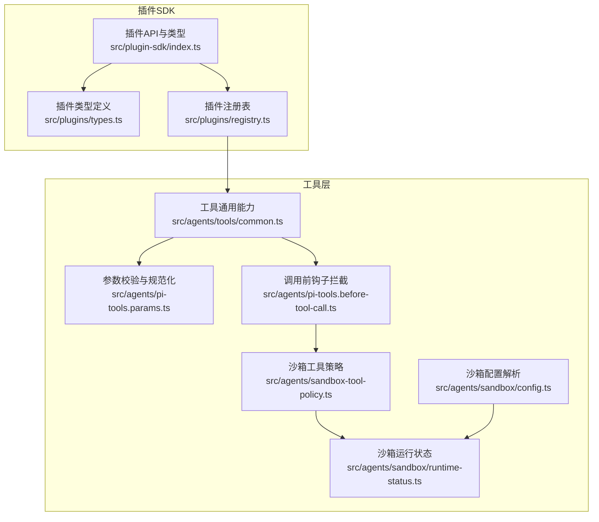
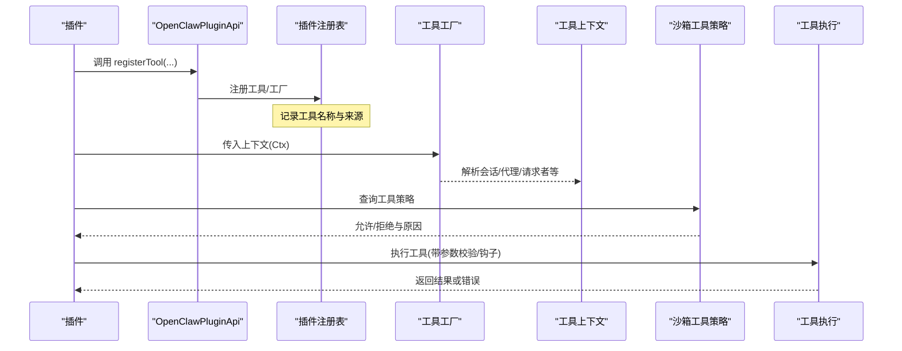
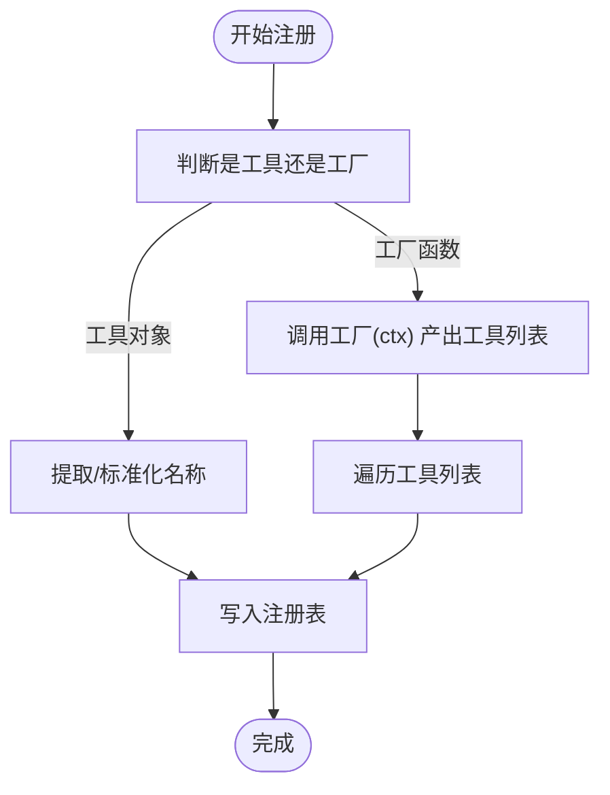
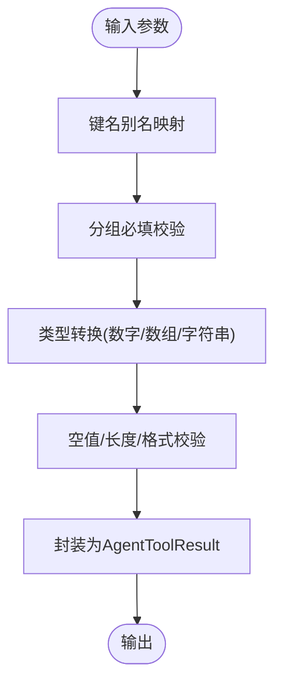
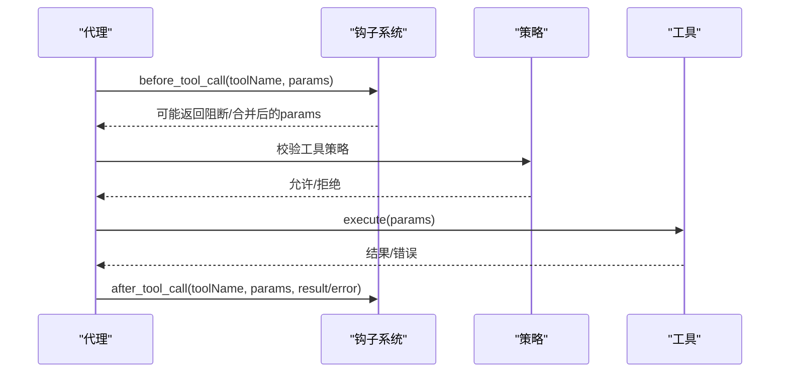
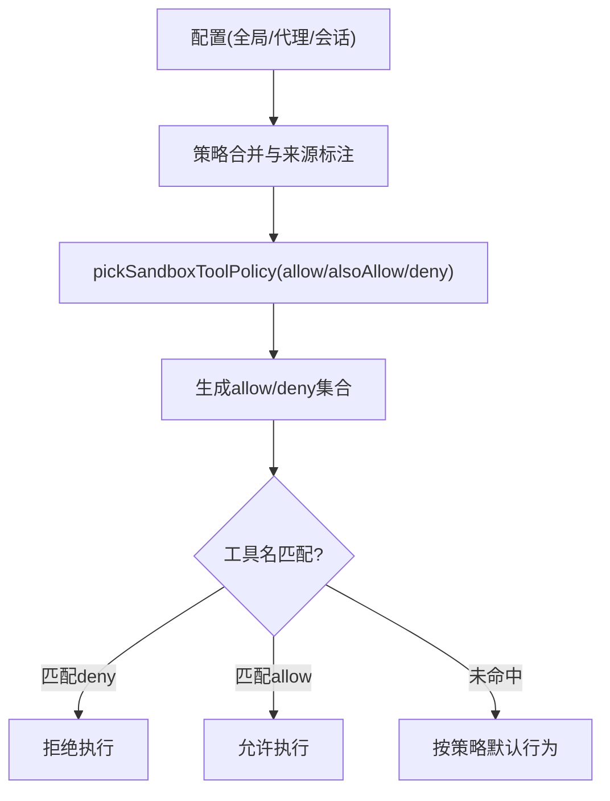
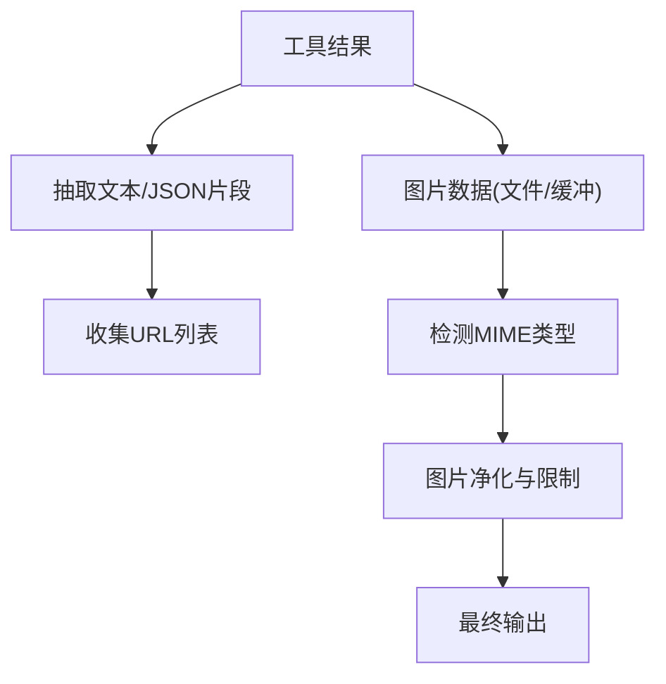
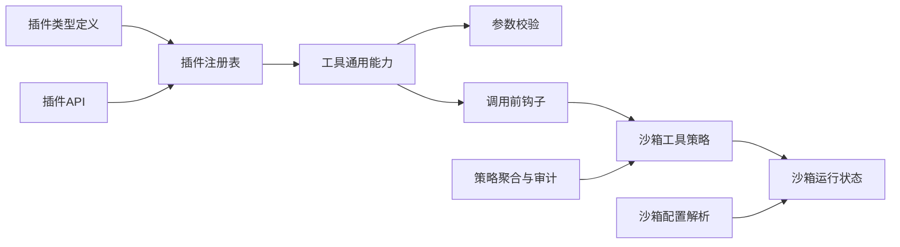

# 工具架构设计

<cite>
**本文档引用的文件**
- [src/plugin-sdk/index.ts](file://src/plugin-sdk/index.ts)
- [src/plugins/registry.ts](file://src/plugins/registry.ts)
- [src/plugins/types.ts](file://src/plugins/types.ts)
- [src/agents/tools/common.ts](file://src/agents/tools/common.ts)
- [src/agents/pi-tools.before-tool-call.ts](file://src/agents/pi-tools.before-tool-call.ts)
- [src/agents/pi-tools.params.ts](file://src/agents/pi-tools.params.ts)
- [src/agents/sandbox-tool-policy.ts](file://src/agents/sandbox-tool-policy.ts)
- [src/agents/sandbox/runtime-status.ts](file://src/agents/sandbox/runtime-status.ts)
- [src/agents/sandbox/config.ts](file://src/agents/sandbox/config.ts)
- [src/security/audit-extra.async.ts](file://src/security/audit-extra.async.ts)
- [src/plugins/bundled-dir.ts](file://src/plugins/bundled-dir.ts)
- [extensions/feishu/src/tool-factory-test-harness.ts](file://extensions/feishu/src/tool-factory-test-harness.ts)
- [src/agents/tool-loop-detection.ts](file://src/agents/tool-loop-detection.ts)
- [src/agents/pi-embedded-subscribe.handlers.tools.ts](file://src/agents/pi-embedded-subscribe.handlers.tools.ts)
- [src/agents/tool-policy.test.ts](file://src/agents/tool-policy.test.ts)
</cite>

## 目录

1. [引言](#引言)
2. [项目结构](#项目结构)
3. [核心组件](#核心组件)
4. [架构总览](#架构总览)
5. [详细组件分析](#详细组件分析)
6. [依赖关系分析](#依赖关系分析)
7. [性能考量](#性能考量)
8. [故障排查指南](#故障排查指南)
9. [结论](#结论)
10. [附录](#附录)

## 引言

本文件面向OpenClaw工具系统，提供从架构到实现细节的完整技术文档。内容涵盖工具注册机制、工具发现与生命周期管理、参数验证、执行流程、结果处理、运行时环境与沙箱隔离策略，并给出架构图与组件交互关系说明，同时总结工具扩展点、继承模式与组合策略。

## 项目结构

OpenClaw采用插件化架构，工具作为“插件能力”的一部分被注册到统一的插件注册表中。插件SDK导出工具工厂类型、钩子系统、HTTP路由、命令等能力；工具在运行期通过上下文解析并按需构建；安全策略由沙箱配置与工具策略共同决定。

**图表来源**

- [src/plugin-sdk/index.ts:1-826](file://src/plugin-sdk/index.ts#L1-L826)
- [src/plugins/types.ts:1-893](file://src/plugins/types.ts#L1-L893)
- [src/plugins/registry.ts:1-625](file://src/plugins/registry.ts#L1-L625)
- [src/agents/tools/common.ts:1-341](file://src/agents/tools/common.ts#L1-L341)
- [src/agents/pi-tools.params.ts:154-204](file://src/agents/pi-tools.params.ts#L154-L204)
- [src/agents/pi-tools.before-tool-call.ts:147-194](file://src/agents/pi-tools.before-tool-call.ts#L147-L194)
- [src/agents/sandbox-tool-policy.ts:1-38](file://src/agents/sandbox-tool-policy.ts#L1-L38)
- [src/agents/sandbox/runtime-status.ts:45-97](file://src/agents/sandbox/runtime-status.ts#L45-L97)
- [src/agents/sandbox/config.ts:170-188](file://src/agents/sandbox/config.ts#L170-L188)

**章节来源**

- [src/plugin-sdk/index.ts:1-826](file://src/plugin-sdk/index.ts#L1-L826)
- [src/plugins/registry.ts:1-625](file://src/plugins/registry.ts#L1-L625)

## 核心组件

- 插件API与类型：定义工具工厂、钩子、HTTP路由、命令等接口，提供统一的注册入口与运行时上下文。
- 插件注册表：集中管理工具、钩子、通道、提供方、网关方法、CLI、服务、命令与HTTP路由，支持诊断与冲突检测。
- 工具通用能力：参数读取、类型转换、错误封装、图片结果生成、所有者限制工具包装等。
- 参数校验与规范化：多组键名别名、必填校验、分组必填、参数归一化。
- 沙箱工具策略：允许/拒绝列表、通配符匹配、deny优先于allow。
- 沙箱运行状态与配置：根据会话与代理解析沙箱模式、主会话键、工具策略来源与覆盖。

**章节来源**

- [src/plugins/types.ts:263-306](file://src/plugins/types.ts#L263-L306)
- [src/plugins/registry.ts:185-625](file://src/plugins/registry.ts#L185-L625)
- [src/agents/tools/common.ts:74-341](file://src/agents/tools/common.ts#L74-L341)
- [src/agents/pi-tools.params.ts:154-204](file://src/agents/pi-tools.params.ts#L154-L204)
- [src/agents/sandbox-tool-policy.ts:21-37](file://src/agents/sandbox-tool-policy.ts#L21-L37)
- [src/agents/sandbox/runtime-status.ts:45-97](file://src/agents/sandbox/runtime-status.ts#L45-L97)
- [src/agents/sandbox/config.ts:170-188](file://src/agents/sandbox/config.ts#L170-L188)

## 架构总览

OpenClaw工具架构围绕“插件API → 注册表 → 工具工厂 → 运行时上下文 → 安全策略（沙箱）→ 执行与结果”的链路展开。插件通过API注册工具，工具在调用前经过参数校验与钩子拦截，再依据沙箱策略决定是否允许执行及如何隔离。

**图表来源**

- [src/plugins/registry.ts:193-218](file://src/plugins/registry.ts#L193-L218)
- [src/plugins/types.ts:75-77](file://src/plugins/types.ts#L75-L77)
- [src/agents/sandbox-tool-policy.ts:21-37](file://src/agents/sandbox-tool-policy.ts#L21-L37)
- [src/agents/pi-tools.before-tool-call.ts:147-194](file://src/agents/pi-tools.before-tool-call.ts#L147-L194)

## 详细组件分析

### 组件A：插件注册与工具发现

- 注册机制：插件通过API注册工具（单个或工厂），注册表记录工具名称、来源与可选性；支持工厂函数按上下文动态产出工具集合。
- 工具发现：测试夹具演示了按名称解析已注册工具的流程，体现“名称 → 工具实例”的映射。
- 冲突与诊断：注册表对重复路径、重叠HTTP路由、缺失认证方式等进行诊断并记录。

**图表来源**

- [src/plugins/registry.ts:193-218](file://src/plugins/registry.ts#L193-L218)
- [extensions/feishu/src/tool-factory-test-harness.ts:37-76](file://extensions/feishu/src/tool-factory-test-harness.ts#L37-L76)

**章节来源**

- [src/plugins/registry.ts:185-625](file://src/plugins/registry.ts#L185-L625)
- [extensions/feishu/src/tool-factory-test-harness.ts:37-76](file://extensions/feishu/src/tool-factory-test-harness.ts#L37-L76)

### 组件B：工具参数验证与规范化

- 多键名别名：支持驼峰/蛇形键名自动映射，提升兼容性。
- 分组必填：同一参数可用多个键表示，满足任一即视为已提供。
- 类型转换：字符串/数字/数组参数的严格/宽松解析，空值处理与错误提示。
- 结果封装：统一的JSON文本结果与图片结果生成，支持图片净化与详情透传。

**图表来源**

- [src/agents/tools/common.ts:74-341](file://src/agents/tools/common.ts#L74-L341)
- [src/agents/pi-tools.params.ts:154-204](file://src/agents/pi-tools.params.ts#L154-L204)

**章节来源**

- [src/agents/tools/common.ts:74-341](file://src/agents/tools/common.ts#L74-L341)
- [src/agents/pi-tools.params.ts:154-204](file://src/agents/pi-tools.params.ts#L154-L204)

### 组件C：工具执行流程与钩子拦截

- 调用前拦截：before_tool_call钩子可阻断或修改参数；若存在阻断则返回阻断原因。
- 钩子上下文：携带agentId、sessionKey、sessionId、runId、toolCallId等关键信息。
- 循环检测：基于工具名、参数哈希与结果/错误哈希的稳定摘要，避免无进展循环。

**图表来源**

- [src/agents/pi-tools.before-tool-call.ts:147-194](file://src/agents/pi-tools.before-tool-call.ts#L147-L194)
- [src/agents/tool-loop-detection.ts:172-238](file://src/agents/tool-loop-detection.ts#L172-L238)

**章节来源**

- [src/agents/pi-tools.before-tool-call.ts:147-194](file://src/agents/pi-tools.before-tool-call.ts#L147-L194)
- [src/agents/tool-loop-detection.ts:172-238](file://src/agents/tool-loop-detection.ts#L172-L238)

### 组件D：运行时环境与沙箱机制

- 运行状态解析：根据会话键解析代理ID、主会话键、沙箱模式与工具策略来源。
- 策略来源叠加：全局配置、代理配置、会话范围策略按优先级合并，支持alsoAllow与通配符。
- 策略判定：deny优先于allow，支持“\*”通配；测试覆盖典型场景。
- 审计与策略聚合：从配置中收集多层级策略并合并，便于审计与诊断。

**图表来源**

- [src/agents/sandbox/runtime-status.ts:45-97](file://src/agents/sandbox/runtime-status.ts#L45-L97)
- [src/agents/sandbox-tool-policy.ts:21-37](file://src/agents/sandbox-tool-policy.ts#L21-L37)
- [src/security/audit-extra.async.ts:132-149](file://src/security/audit-extra.async.ts#L132-L149)

**章节来源**

- [src/agents/sandbox/runtime-status.ts:45-97](file://src/agents/sandbox/runtime-status.ts#L45-L97)
- [src/agents/sandbox-tool-policy.ts:21-37](file://src/agents/sandbox-tool-policy.ts#L21-L37)
- [src/security/audit-extra.async.ts:132-149](file://src/security/audit-extra.async.ts#L132-L149)
- [src/agents/tool-policy.test.ts:122-149](file://src/agents/tool-policy.test.ts#L122-L149)

### 组件E：工具结果处理与媒体

- 文本与媒体：工具结果支持纯文本与图片混合，图片可从文件读取并自动推断MIME类型。
- 嵌入订阅处理：从工具结果中抽取URL与JSON片段，用于后续处理或展示。
- 图片净化：对工具结果中的图片进行净化与限制，确保输出安全可控。

**图表来源**

- [src/agents/tools/common.ts:257-302](file://src/agents/tools/common.ts#L257-L302)
- [src/agents/pi-embedded-subscribe.handlers.tools.ts:129-144](file://src/agents/pi-embedded-subscribe.handlers.tools.ts#L129-L144)

**章节来源**

- [src/agents/tools/common.ts:257-302](file://src/agents/tools/common.ts#L257-L302)
- [src/agents/pi-embedded-subscribe.handlers.tools.ts:129-144](file://src/agents/pi-embedded-subscribe.handlers.tools.ts#L129-L144)

### 组件F：工具扩展点、继承与组合

- 工具工厂：通过工厂函数接收上下文，按会话/代理/请求者等维度动态产出工具，实现“按需构建”。
- 钩子扩展：before_tool_call/after_tool_call等钩子提供扩展点，可在不侵入工具实现的情况下插入横切逻辑。
- 组合策略：通过alsoAllow与通配符组合allow/deny策略，形成灵活的组合式权限控制。

**章节来源**

- [src/plugins/types.ts:75-77](file://src/plugins/types.ts#L75-L77)
- [src/plugins/registry.ts:218-218](file://src/plugins/registry.ts#L218-L218)
- [src/agents/sandbox-tool-policy.ts:9-19](file://src/agents/sandbox-tool-policy.ts#L9-L19)

## 依赖关系分析

**图表来源**

- [src/plugins/types.ts:1-893](file://src/plugins/types.ts#L1-L893)
- [src/plugins/registry.ts:1-625](file://src/plugins/registry.ts#L1-L625)
- [src/agents/tools/common.ts:1-341](file://src/agents/tools/common.ts#L1-L341)
- [src/agents/pi-tools.params.ts:154-204](file://src/agents/pi-tools.params.ts#L154-L204)
- [src/agents/pi-tools.before-tool-call.ts:147-194](file://src/agents/pi-tools.before-tool-call.ts#L147-L194)
- [src/agents/sandbox-tool-policy.ts:1-38](file://src/agents/sandbox-tool-policy.ts#L1-L38)
- [src/agents/sandbox/runtime-status.ts:45-97](file://src/agents/sandbox/runtime-status.ts#L45-L97)
- [src/agents/sandbox/config.ts:170-188](file://src/agents/sandbox/config.ts#L170-L188)
- [src/security/audit-extra.async.ts:132-149](file://src/security/audit-extra.async.ts#L132-L149)

**章节来源**

- [src/plugins/types.ts:1-893](file://src/plugins/types.ts#L1-L893)
- [src/plugins/registry.ts:1-625](file://src/plugins/registry.ts#L1-L625)

## 性能考量

- 动态导入与边界：遵循动态导入守则，避免在同一模块路径上混用静态与动态导入，减少运行时开销与打包复杂度。
- 参数校验与钩子：参数校验与钩子拦截应尽量轻量，避免在热路径上做昂贵操作；必要时使用缓存或延迟计算。
- 图片处理：图片读取与MIME检测为IO与CPU开销项，建议在需要时才执行，并对输出进行净化以降低传输成本。
- 策略合并：策略聚合与来源标注在启动阶段完成，运行期仅做快速匹配，确保低延迟。

[本节为通用指导，无需具体文件分析]

## 故障排查指南

- 工具未注册：检查插件是否正确调用registerTool，确认名称标准化与唯一性；查看注册表诊断日志。
- 参数错误：核对必填参数与分组必填规则，关注参数别名映射与类型转换；参考工具通用错误类型定位问题。
- 钩子异常：before_tool_call钩子失败会被记录并抑制异常传播，检查钩子处理器日志与上下文字段。
- 沙箱拒绝：确认会话键、代理ID与沙箱模式解析是否正确；核对allow/deny策略与通配符匹配规则。
- 循环检测：若出现无进展循环，检查工具结果哈希与循环检测逻辑，必要时调整工具行为或参数。

**章节来源**

- [src/plugins/registry.ts:318-400](file://src/plugins/registry.ts#L318-L400)
- [src/agents/tools/common.ts:26-42](file://src/agents/tools/common.ts#L26-L42)
- [src/agents/pi-tools.before-tool-call.ts:188-191](file://src/agents/pi-tools.before-tool-call.ts#L188-L191)
- [src/agents/sandbox/runtime-status.ts:81-97](file://src/agents/sandbox/runtime-status.ts#L81-L97)
- [src/agents/tool-loop-detection.ts:172-238](file://src/agents/tool-loop-detection.ts#L172-L238)

## 结论

OpenClaw工具架构以插件API为核心，通过注册表统一管理工具与扩展点，结合参数校验、钩子拦截与沙箱策略，实现了高扩展性与强隔离的安全执行模型。工厂化工具与策略组合提供了灵活的工具装配方式，适合在多代理、多会话场景下安全地扩展与演进。

[本节为总结，无需具体文件分析]

## 附录

- 插件目录解析：支持通过环境变量或可执行文件旁的extensions目录定位内置插件目录，便于打包与分发。
- 工具策略测试：覆盖通配符、deny优先、空allow视为allow-all等关键行为，保障策略一致性。

**章节来源**

- [src/plugins/bundled-dir.ts:1-41](file://src/plugins/bundled-dir.ts#L1-L41)
- [src/agents/tool-policy.test.ts:122-149](file://src/agents/tool-policy.test.ts#L122-L149)
