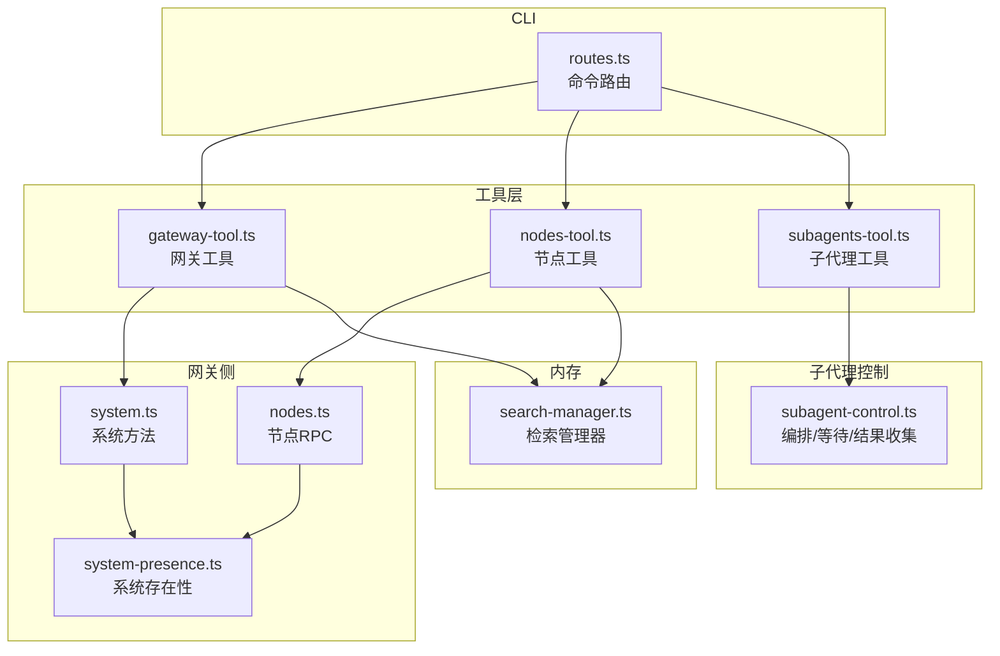
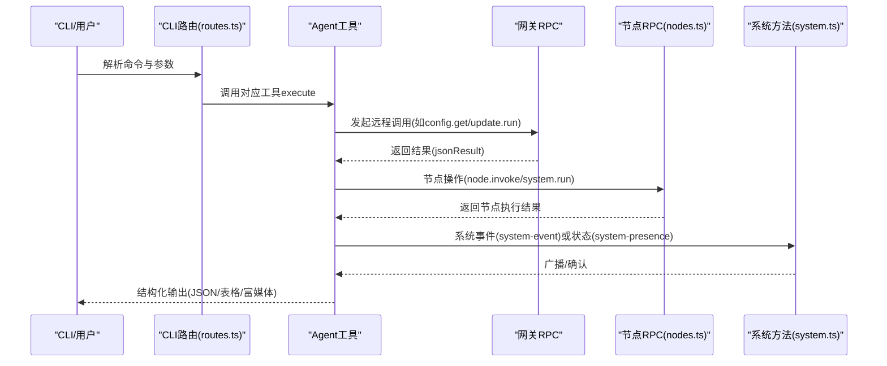
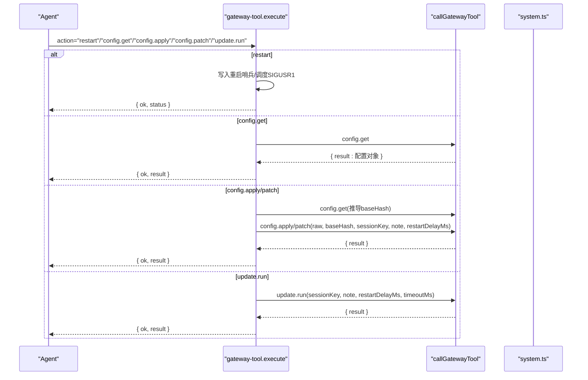
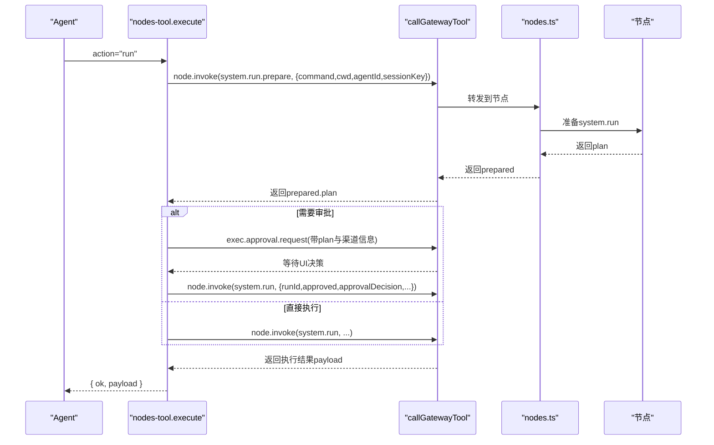
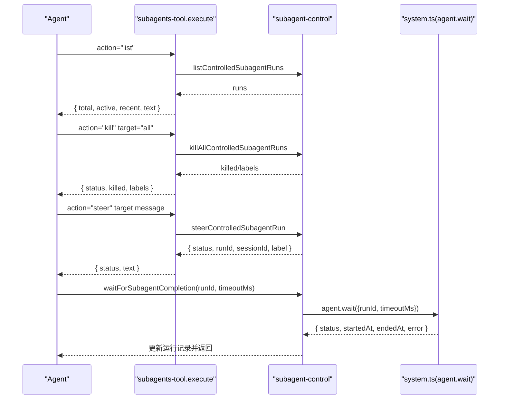
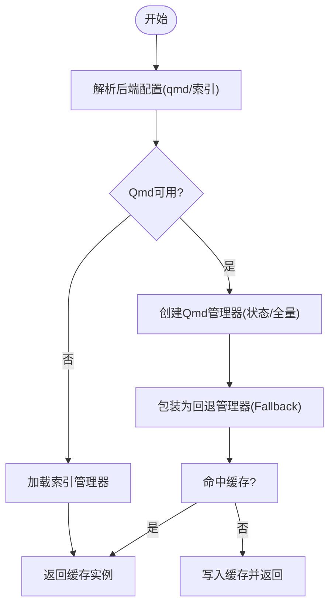
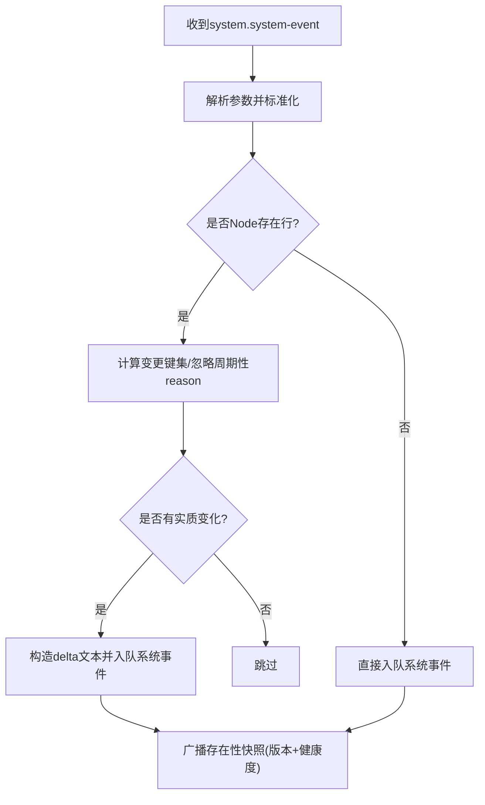
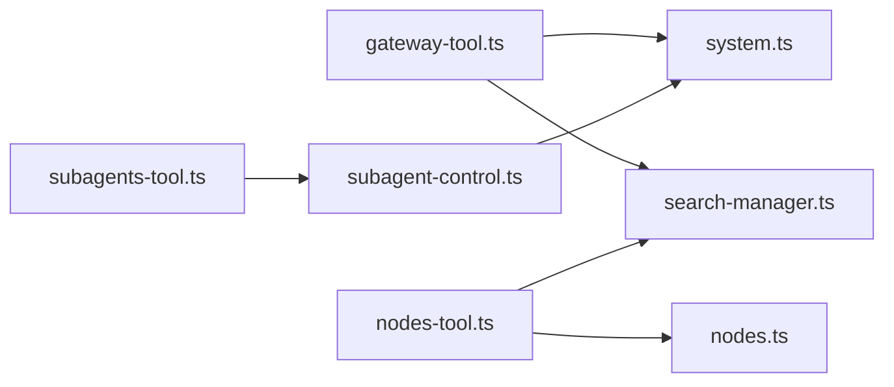

# 系统工具

<cite>
**本文引用的文件**
- [system-presence.ts](file://src/infra/system-presence.ts)
- [system.ts](file://src/gateway/server-methods/system.ts)
- [nodes.ts](file://src/gateway/server-methods/nodes.ts)
- [gateway-tool.ts](file://src/agents/tools/gateway-tool.ts)
- [nodes-tool.ts](file://src/agents/tools/nodes-tool.ts)
- [subagents-tool.ts](file://src/agents/tools/subagents-tool.ts)
- [subagent-control.ts](file://src/agents/subagent-control.ts)
- [routes.ts](file://src/cli/program/routes.ts)
- [index.md](file://docs/tools/index.md)
- [windows-acl.ts](file://src/security/windows-acl.ts)
- [search-manager.ts](file://src/memory/search-manager.ts)
- [test-manager.ts](file://src/memory/test-manager.ts)
- [test-manager-helpers.ts](file://src/memory/test-manager-helpers.ts)
- [openclaw.plugin.json](file://extensions/memory-core/openclaw.plugin.json)
- [nodes-cli-register.status.ts](file://src/cli/nodes-cli/register.status.ts)
- [acp-agents.md](file://docs/tools/acp-agents.md)
</cite>

## 目录

1. [简介](#简介)
2. [项目结构](#项目结构)
3. [核心组件](#核心组件)
4. [架构总览](#架构总览)
5. [详细组件分析](#详细组件分析)
6. [依赖关系分析](#依赖关系分析)
7. [性能考量](#性能考量)
8. [故障排查指南](#故障排查指南)
9. [结论](#结论)
10. [附录](#附录)

## 简介

本文件面向OpenClaw系统工具，系统性梳理以下能力：网关工具（远程重启、配置读取/应用/补丁、在线更新）、节点工具（设备发现/配对/通知/相机/屏幕录制/位置/通知操作/命令执行/通用invoke）、子代理工具（子代理编排、终止、引导消息）、内存工具（索引与检索管理）、以及系统级状态与存在性管理。文档同时覆盖API接口、参数规范、返回值约定、安全与权限控制、性能优化建议，并通过图示帮助理解关键流程。

## 项目结构

围绕“系统工具”的关键代码分布在如下模块：

- 网关侧系统方法与存在性管理：gateway/server-methods/system.ts、infra/system-presence.ts
- 节点侧RPC处理与节点生命周期：gateway/server-methods/nodes.ts
- 工具层（Agent侧）：agents/tools 下的 gateway-tool.ts、nodes-tool.ts、subagents-tool.ts
- 子代理编排与运行时控制：agents/subagent-control.ts
- CLI路由与入口：cli/program/routes.ts
- 内存后端与检索：memory/search-manager.ts 及其测试辅助
- 安全与权限：security/windows-acl.ts、docs/tools/acp-agents.md
- 文档与工具呈现：docs/tools/index.md、extensions/memory-core/openclaw.plugin.json

图表来源

- [system.ts:1-135](file://src/gateway/server-methods/system.ts#L1-L135)
- [nodes.ts:1-800](file://src/gateway/server-methods/nodes.ts#L1-L800)
- [system-presence.ts:1-191](file://src/infra/system-presence.ts#L1-L191)
- [gateway-tool.ts:1-229](file://src/agents/tools/gateway-tool.ts#L1-L229)
- [nodes-tool.ts:1-800](file://src/agents/tools/nodes-tool.ts#L1-L800)
- [subagents-tool.ts:1-183](file://src/agents/tools/subagents-tool.ts#L1-L183)
- [subagent-control.ts:676-721](file://src/agents/subagent-control.ts#L676-L721)
- [routes.ts:1-271](file://src/cli/program/routes.ts#L1-L271)
- [search-manager.ts:25-67](file://src/memory/search-manager.ts#L25-L67)

章节来源

- [routes.ts:1-271](file://src/cli/program/routes.ts#L1-L271)

## 核心组件

- 网关工具（gateway-tool）
  - 功能：远程重启、配置读取、配置模式化应用/补丁、在线更新触发
  - 关键参数：action、gatewayUrl、gatewayToken、timeoutMs、path/raw/baseHash/sessionKey/note/restartDelayMs等
  - 返回：统一jsonResult封装，包含ok与结果对象或错误
- 节点工具（nodes-tool）
  - 功能：节点状态/描述、待处理配对、批准/拒绝、通知、相机快照/剪辑、照片最新、屏幕录制、位置获取、通知操作、system.run命令执行、通用invoke
  - 关键参数：action、node、requestId、title/body/sound/priority/delivery、facing/maxWidth/quality/delayMs/deviceId/limit/duration/durationMs/includeAudio/fps/screenIndex/outPath/maxAgeMs/locationTimeoutMs/desiredAccuracy、command/cwd/env/commandTimeoutMs/invokeTimeoutMs/needsScreenRecording、invokeCommand/invokeParamsJson
  - 返回：jsonResult或带媒体路径/图片内容的结果
- 子代理工具（subagents-tool）
  - 功能：列出/终止/引导当前会话下的受控子代理
  - 关键参数：action/target/message/recentMinutes
  - 返回：包含状态、总数、活动/近期列表、文本摘要等
- 系统存在性与事件（system-presence + system handlers）
  - 功能：注册/更新系统存在性、广播变更、记录系统事件
  - 关键字段：text/deviceId/instanceId/host/ip/version/platform/deviceFamily/modelIdentifier/lastInputSeconds/reason/roles/scopes/tags
- 内存工具（memory）
  - 功能：检索管理器选择与缓存、索引管理器获取、同步能力检测
  - 关键函数：getMemorySearchManager、createMemoryManagerOrThrow、getRequiredMemoryIndexManager

章节来源

- [gateway-tool.ts:1-229](file://src/agents/tools/gateway-tool.ts#L1-L229)
- [nodes-tool.ts:1-800](file://src/agents/tools/nodes-tool.ts#L1-L800)
- [subagents-tool.ts:1-183](file://src/agents/tools/subagents-tool.ts#L1-L183)
- [system-presence.ts:1-191](file://src/infra/system-presence.ts#L1-L191)
- [system.ts:1-135](file://src/gateway/server-methods/system.ts#L1-L135)
- [search-manager.ts:25-67](file://src/memory/search-manager.ts#L25-L67)
- [test-manager.ts:1-13](file://src/memory/test-manager.ts#L1-L13)
- [test-manager-helpers.ts:1-19](file://src/memory/test-manager-helpers.ts#L1-L19)

## 架构总览

系统工具通过Agent侧工具调用网关RPC，网关侧方法负责校验、策略执行与状态广播；节点侧RPC负责节点生命周期、配对、唤醒与动作队列；子代理工具通过编排接口与网关等待接口完成任务分配与结果收集；内存工具提供检索与索引能力。

图表来源

- [routes.ts:1-271](file://src/cli/program/routes.ts#L1-L271)
- [gateway-tool.ts:1-229](file://src/agents/tools/gateway-tool.ts#L1-L229)
- [nodes-tool.ts:1-800](file://src/agents/tools/nodes-tool.ts#L1-L800)
- [system.ts:1-135](file://src/gateway/server-methods/system.ts#L1-L135)
- [nodes.ts:1-800](file://src/gateway/server-methods/nodes.ts#L1-L800)

## 详细组件分析

### 网关工具（远程重启、配置管理、在线更新）

- 功能定位
  - 远程重启：写入重启哨兵并调度SIGUSR1重启，支持延迟与原因/备注
  - 配置管理：config.get、config.schema.lookup、config.apply（整包替换）、config.patch（增量合并），均支持sessionKey与重启延时
  - 在线更新：update.run，支持超时与重启延时
- 参数规范
  - 通用：gatewayUrl、gatewayToken、timeoutMs
  - restart：delayMs、reason、note
  - config.get/schema.lookup：无额外必填
  - config.apply/patch：raw、baseHash（可从快照推导）、sessionKey、note、restartDelayMs
  - update.run：sessionKey、note、restartDelayMs、timeoutMs
- 返回值
  - 统一jsonResult({ ok, result|status })
  - restart返回调度结果
  - config.\*返回配置对象或变更摘要
  - update.run返回更新运行标识
- 使用场景
  - 非交互式运维：通过ACPx插件配合非交互权限策略
  - 远程诊断：先config.get再schema.lookup定位字段，再patch/apply
  - 在线升级：update.run并设置重启延时以平滑过渡

图表来源

- [gateway-tool.ts:1-229](file://src/agents/tools/gateway-tool.ts#L1-L229)
- [system.ts:1-135](file://src/gateway/server-methods/system.ts#L1-L135)

章节来源

- [gateway-tool.ts:1-229](file://src/agents/tools/gateway-tool.ts#L1-L229)
- [system.ts:1-135](file://src/gateway/server-methods/system.ts#L1-L135)
- [acp-agents.md:566-603](file://docs/tools/acp-agents.md#L566-L603)

### 节点工具（设备连接、命令执行、状态同步）

- 功能定位
  - 设备发现与描述：node.list、node.describe
  - 配对管理：node.pair.request/list/approve/reject/verify/rename
  - 通知：system.notify
  - 媒体：camera.snap/camera.clip/photos.latest、screen.record
  - 位置与通知：location.get、notifications.list/actions
  - 命令执行：system.run（含准备与审批流程）、通用invoke
- 参数规范
  - 通用：gatewayUrl、gatewayToken、timeoutMs、node
  - 通知：title/body/sound/priority(delivery)
  - 相机/屏幕：facing/maxWidth/quality/delayMs/deviceId/limit/duration/durationMs/includeAudio/fps/screenIndex/outPath
  - 位置：maxAgeMs/desiredAccuracy/locationTimeoutMs
  - system.run：command/cwd/env/commandTimeoutMs/invokeTimeoutMs/needsScreenRecording
  - invoke：invokeCommand/invokeParamsJson
- 执行流程
  - system.run：先system.run.prepare生成计划，若提示需要审批则通过exec.approval.request创建待决请求，等待UI决策后重试带批准标记
  - invoke：通用命令分发，必要时阻断可能造成上下文膨胀的媒体命令
- 返回值
  - 列表/描述/状态：jsonResult
  - 媒体：返回包含MEDIA:文件路径或图片数据的内容
  - 执行：返回payload或空对象

图表来源

- [nodes-tool.ts:607-746](file://src/agents/tools/nodes-tool.ts#L607-L746)
- [nodes.ts:776-800](file://src/gateway/server-methods/nodes.ts#L776-L800)

章节来源

- [nodes-tool.ts:1-800](file://src/agents/tools/nodes-tool.ts#L1-L800)
- [nodes.ts:1-800](file://src/gateway/server-methods/nodes.ts#L1-L800)
- [nodes-cli-register.status.ts:230-295](file://src/cli/nodes-cli/register.status.ts#L230-L295)

### 子代理工具（代理创建、任务分配、结果收集）

- 功能定位
  - 列出当前请求者会话下受控子代理，区分活跃与近期
  - 终止指定/全部子代理，支持级联终止统计
  - 引导（steer）子代理，向其推送目标消息
- 参数规范
  - action：list/kill/steer
  - target：runId/标签/“all”/“\*”
  - message：引导消息（有长度限制）
  - recentMinutes：时间窗口（1~MAX_RECENT_MINUTES）
- 结果收集
  - 通过agent.wait轮询子代理运行状态，更新本地运行记录并标注结局（ok/error/timeout/killed/reset/deleted）

图表来源

- [subagents-tool.ts:1-183](file://src/agents/tools/subagents-tool.ts#L1-L183)
- [subagent-control.ts:1209-1256](file://src/agents/subagent-control.ts#L1209-L1256)
- [system.ts:1-135](file://src/gateway/server-methods/system.ts#L1-L135)

章节来源

- [subagents-tool.ts:1-183](file://src/agents/tools/subagents-tool.ts#L1-L183)
- [subagent-control.ts:1209-1256](file://src/agents/subagent-control.ts#L1209-L1256)

### 内存工具（数据存储、检索与管理）

- 功能定位
  - 按agentId解析内存后端配置，优先Qmd，失败回退至索引管理器
  - 支持缓存与降级策略，提供同步能力检测
- 关键接口
  - getMemorySearchManager：返回可用管理器或状态
  - createMemoryManagerOrThrow/getRequiredMemoryIndexManager：强制获取并校验sync能力
- 插件配置
  - memory-core插件提供空配置模式，作为默认后备

图表来源

- [search-manager.ts:25-67](file://src/memory/search-manager.ts#L25-L67)
- [test-manager.ts:1-13](file://src/memory/test-manager.ts#L1-L13)
- [test-manager-helpers.ts:1-19](file://src/memory/test-manager-helpers.ts#L1-L19)
- [openclaw.plugin.json:1-9](file://extensions/memory-core/openclaw.plugin.json#L1-L9)

章节来源

- [search-manager.ts:25-67](file://src/memory/search-manager.ts#L25-L67)
- [test-manager.ts:1-13](file://src/memory/test-manager.ts#L1-L13)
- [test-manager-helpers.ts:1-19](file://src/memory/test-manager-helpers.ts#L1-L19)
- [openclaw.plugin.json:1-9](file://extensions/memory-core/openclaw.plugin.json#L1-L9)

### 系统存在性与状态监控

- 系统存在性模型
  - 字段：host/ip/version/platform/deviceFamily/modelIdentifier/lastInputSeconds/mode/reason/roles/scopes/tags
  - 支持合并去重列表字段，定时清理过期条目
- 状态上报与事件
  - system.system-event接收text与元数据，按Node/非Node分支生成系统事件并广播
  - system-presence维护全局映射，支持查询与版本广播

图表来源

- [system.ts:34-133](file://src/gateway/server-methods/system.ts#L34-L133)
- [system-presence.ts:159-191](file://src/infra/system-presence.ts#L159-L191)

章节来源

- [system-presence.ts:1-191](file://src/infra/system-presence.ts#L1-L191)
- [system.ts:1-135](file://src/gateway/server-methods/system.ts#L1-L135)

## 依赖关系分析

- 工具到网关RPC
  - gateway-tool与nodes-tool均通过callGatewayTool封装远程调用，统一处理超时与鉴权参数
- 网关到节点
  - nodes.ts中对节点命令进行白名单校验、APNs唤醒、后台受限命令处理与待处理动作队列
- 子代理到网关
  - subagent-control通过agent.wait轮询子代理生命周期，结合本地运行记录更新结局
- 内存到工具
  - 工具可通过getMemorySearchManager获取检索/索引管理器，用于后续数据操作

图表来源

- [gateway-tool.ts:1-229](file://src/agents/tools/gateway-tool.ts#L1-L229)
- [nodes-tool.ts:1-800](file://src/agents/tools/nodes-tool.ts#L1-L800)
- [subagents-tool.ts:1-183](file://src/agents/tools/subagents-tool.ts#L1-L183)
- [subagent-control.ts:1209-1256](file://src/agents/subagent-control.ts#L1209-L1256)
- [system.ts:1-135](file://src/gateway/server-methods/system.ts#L1-L135)
- [nodes.ts:1-800](file://src/gateway/server-methods/nodes.ts#L1-L800)
- [search-manager.ts:25-67](file://src/memory/search-manager.ts#L25-L67)

章节来源

- [gateway-tool.ts:1-229](file://src/agents/tools/gateway-tool.ts#L1-L229)
- [nodes-tool.ts:1-800](file://src/agents/tools/nodes-tool.ts#L1-L800)
- [subagents-tool.ts:1-183](file://src/agents/tools/subagents-tool.ts#L1-L183)
- [subagent-control.ts:1209-1256](file://src/agents/subagent-control.ts#L1209-L1256)
- [system.ts:1-135](file://src/gateway/server-methods/system.ts#L1-L135)
- [nodes.ts:1-800](file://src/gateway/server-methods/nodes.ts#L1-L800)
- [search-manager.ts:25-67](file://src/memory/search-manager.ts#L25-L67)

## 性能考量

- 缓存与回退
  - Qmd管理器支持缓存键构建与失效回调，避免重复初始化
- 超时与重试
  - 网关工具默认更新超时较高，节点invoke与system.run支持独立超时参数
- 资源占用
  - 媒体类操作（相机/屏幕）建议限制分辨率与时长，避免上下文膨胀
- 广播与事件
  - 系统事件仅在实质性变更时入队，减少冗余广播

章节来源

- [search-manager.ts:239-252](file://src/memory/search-manager.ts#L239-L252)
- [gateway-tool.ts:19-229](file://src/agents/tools/gateway-tool.ts#L19-L229)
- [nodes-tool.ts:530-577](file://src/agents/tools/nodes-tool.ts#L530-L577)

## 故障排查指南

- 网关工具
  - 重启失败：检查commands.restart开关与权限；确认重启哨兵写入成功
  - 配置apply/patch失败：确认baseHash来自config.get快照；核对raw格式与sessionKey
- 节点工具
  - system.run被拒：查看是否触发“需要审批”，通过exec.approval.request创建待决请求并等待UI决策
  - 媒体命令失败：确认允许媒体invoke命令或改用专用action（如camera_snap）
  - 节点未连接：检查APNs注册与鉴权，必要时发送唤醒提醒
- 子代理工具
  - 无法终止/引导：确认target匹配runId或标签；检查recentMinutes范围
  - 结果未回传：使用agent.wait轮询直至状态为ok/error/timeout
- 系统存在性
  - 事件未广播：确认system.system-event参数合法且存在实质性变更

章节来源

- [gateway-tool.ts:84-132](file://src/agents/tools/gateway-tool.ts#L84-L132)
- [nodes-tool.ts:696-745](file://src/agents/tools/nodes-tool.ts#L696-L745)
- [subagent-control.ts:1209-1256](file://src/agents/subagent-control.ts#L1209-L1256)
- [system.ts:34-133](file://src/gateway/server-methods/system.ts#L34-L133)

## 结论

OpenClaw系统工具通过Agent工具与网关RPC形成清晰的远程控制闭环，辅以节点侧严格的命令白名单与APNs唤醒策略，确保跨平台设备的稳定协作。子代理工具提供细粒度的任务编排与结果收集，内存工具支撑检索与索引能力。安全方面，权限策略与非交互模式配置可有效降低风险。性能上，缓存、超时与事件过滤等机制共同保障系统稳定性与响应速度。

## 附录

- 工具呈现与系统提示
  - 工具通过系统提示与Schema双重方式暴露给模型，确保Agent既能看到可用工具又能正确调用
- 权限与安全
  - Windows ACL分类可信主体，避免世界可写；ACPx插件支持非交互权限策略与失败降级

章节来源

- [index.md:565-574](file://docs/tools/index.md#L565-L574)
- [windows-acl.ts:82-119](file://src/security/windows-acl.ts#L82-L119)
- [acp-agents.md:566-603](file://docs/tools/acp-agents.md#L566-L603)
