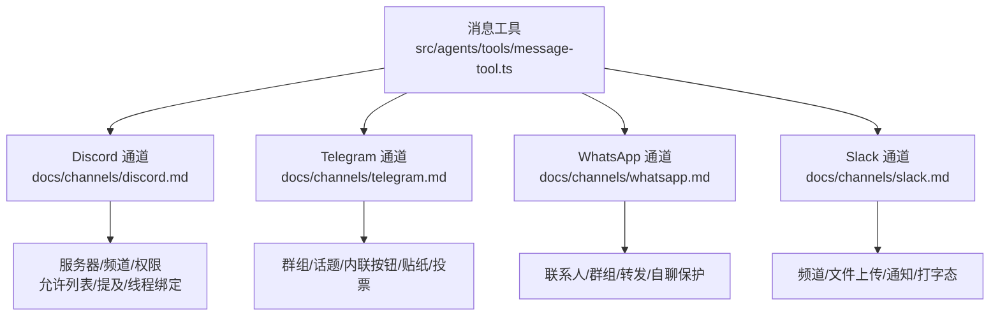
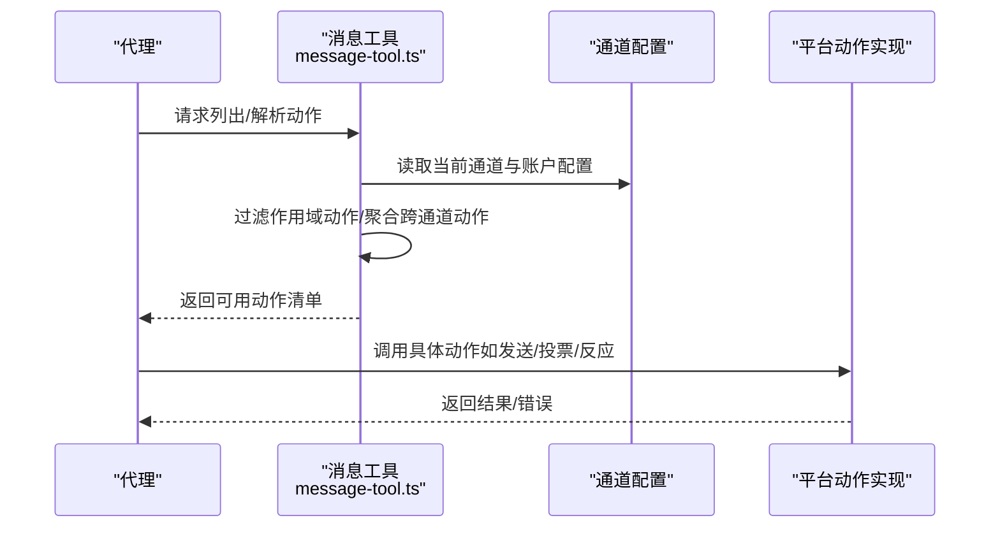
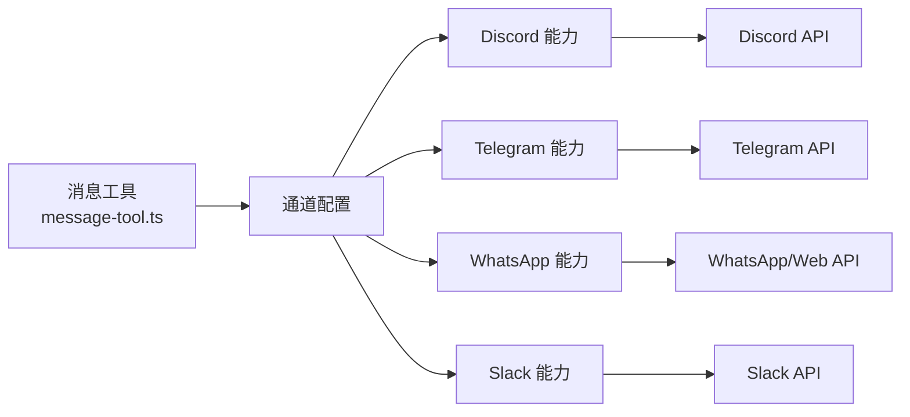

# 通道动作工具

<cite>
**本文引用的文件**
- [docs/channels/discord.md](file://docs/channels/discord.md)
- [docs/channels/telegram.md](file://docs/channels/telegram.md)
- [docs/channels/whatsapp.md](file://docs/channels/whatsapp.md)
- [docs/channels/slack.md](file://docs/channels/slack.md)
- [src/agents/tools/message-tool.ts](file://src/agents/tools/message-tool.ts)
</cite>

## 目录

1. [简介](#简介)
2. [项目结构](#项目结构)
3. [核心组件](#核心组件)
4. [架构总览](#架构总览)
5. [详细组件分析](#详细组件分析)
6. [依赖关系分析](#依赖关系分析)
7. [性能考量](#性能考量)
8. [故障排查指南](#故障排查指南)
9. [结论](#结论)
10. [附录](#附录)

## 简介

本文件面向OpenClaw的“通道动作工具”，系统化梳理并解读各消息平台（Discord、Telegram、WhatsApp、Slack）在OpenClaw中的动作工具实现、功能特性与使用方法。内容覆盖服务器/频道管理、用户权限控制、消息发送与媒体处理、群组与话题管理、文件上传与通知管理等，并提供API调用示例路径、参数配置要点、错误处理策略以及平台特定的限制、速率限制与最佳实践建议。

## 项目结构

OpenClaw通过“通道”抽象统一接入多平台消息系统，通道动作工具负责在不同平台间路由与执行消息相关操作。核心实现位于通用工具层，平台能力由各自文档与插件/扩展实现支撑。

图表来源

- [src/agents/tools/message-tool.ts:503-555](file://src/agents/tools/message-tool.ts#L503-L555)
- [docs/channels/discord.md:1-800](file://docs/channels/discord.md#L1-L800)
- [docs/channels/telegram.md:1-800](file://docs/channels/telegram.md#L1-L800)
- [docs/channels/whatsapp.md:1-446](file://docs/channels/whatsapp.md#L1-L446)
- [docs/channels/slack.md:1-555](file://docs/channels/slack.md#L1-L555)

章节来源

- [src/agents/tools/message-tool.ts:503-555](file://src/agents/tools/message-tool.ts#L503-L555)

## 核心组件

- 消息工具与动作解析：根据当前通道与上下文，动态解析可用动作集合，支持跨通道动作聚合与作用域过滤，确保隔离代理或定时任务可安全调用其他通道动作而不触发验证错误。
- 平台特定动作门控：通过通道配置项对动作进行细粒度开关（如发送、删除、反应、贴纸、投票、主题创建等），并按账户维度覆盖默认值。
- 组件与交互：部分平台支持富文本组件容器、模态表单、选择器与按钮等，具备复用性与权限限制能力。

章节来源

- [src/agents/tools/message-tool.ts:503-555](file://src/agents/tools/message-tool.ts#L503-L555)

## 架构总览

下图展示消息工具如何在不同通道中解析动作、路由到对应平台能力，并结合平台文档中的配置与行为进行统一编排。

图表来源

- [src/agents/tools/message-tool.ts:503-555](file://src/agents/tools/message-tool.ts#L503-L555)

## 详细组件分析

### Discord 动作工具

- 服务器与频道管理
  - 允许列表与提及策略：支持按服务器/频道白名单、用户/角色允许列表、是否必须@提及、忽略其他@等策略组合。
  - 线程绑定与会话：支持将线程绑定到子代理或ACP会话，实现稳定的工作空间；可配置空闲/最大存活时间。
  - 论坛/媒体频道：支持自动创建主题线程；父级不接受组件，需在子线程使用组件。
- 用户权限控制
  - DM策略：配对模式/允许列表/开放/禁用；未知用户默认阻断或提示配对。
  - 角色路由：基于角色ID进行路由，先于仅服务器绑定规则评估。
- 交互组件与富文本
  - 支持文本块、分隔符、动作行、媒体画廊、文件块；按钮/选择器/模态表单；可设置复用性与允许用户范围。
- 命令与回执
  - 原生斜杠命令注册与鉴权遵循相同允许列表；预览流式回复支持局部替换或分块追加。
- 配置要点与示例路径
  - 令牌与配对、服务器/频道允许列表、提及要求、线程绑定、反应通知、ACK反应、配置写入等。
  - 示例参考：[docs/channels/discord.md:1-800](file://docs/channels/discord.md#L1-L800)

章节来源

- [docs/channels/discord.md:1-800](file://docs/channels/discord.md#L1-L800)

### Telegram 动作工具

- 消息发送与媒体处理
  - HTML解析与回退：优先HTML，失败时回退纯文本；链接预览可关闭。
  - 实时预览流式回复：支持编辑消息文本；复杂回复回退正常投递并清理预览。
  - 媒体：音频（语音笔记）、视频（视频消息）、贴纸；支持缓存与搜索。
- 群组与话题管理
  - 论坛超级群：话题会话键包含topic标识；话题继承组配置；支持每话题路由到不同代理。
  - 线程绑定与ACP绑定：支持将话题绑定到ACP会话，后续消息直接路由。
- 内联按钮与动作
  - 内联按钮作用域：关闭/私聊/群组/全部/允许列表；回调数据透传为文本。
- 投票与限流
  - 投票创建：支持时长、匿名、公开、话题线程等参数；可通过动作门控禁用。
  - 限流与重试：文本分片长度、换行优先、媒体上限、超时、历史记录、重试策略等。
- 配置要点与示例路径
  - DM策略、群组策略、提及行为、ACK反应、配置写入、长轮询/Webhook、动作门控等。
  - 示例参考：[docs/channels/telegram.md:1-800](file://docs/channels/telegram.md#L1-L800)

章节来源

- [docs/channels/telegram.md:1-800](file://docs/channels/telegram.md#L1-L800)

### WhatsApp 动作工具

- 联系人与群组管理
  - DM策略与允许列表：配对/允许列表/开放/禁用；允许列表支持E.164号码。
  - 群组策略：群成员允许列表与发送者允许列表双层控制；提及/回复激活。
  - 自聊保护：当自身号码在允许列表中时，跳过已读回执、避免自触发@。
- 消息与媒体处理
  - 文本分片：长度优先或换行优先；媒体优化与大小限制；PTT语音兼容。
  - 媒体占位符与位置/联系人提取：标准化上下文后路由。
- ACK反应与凭证
  - 即时ACK反应；多账户凭据目录与登出行为。
- 配置要点与示例路径
  - DM/群组策略、文本分片、媒体上限、ACK反应、多账户凭据、会话历史等。
  - 示例参考：[docs/channels/whatsapp.md:1-446](file://docs/channels/whatsapp.md#L1-L446)

章节来源

- [docs/channels/whatsapp.md:1-446](file://docs/channels/whatsapp.md#L1-L446)

### Slack 动作工具

- 频道集成与文件上传
  - Socket Mode与HTTP事件API两种接入方式；支持用户令牌只读场景。
  - 文件下载与上传：私有URL认证下载至本地存储；上传支持线程回复。
- 通知与打字态
  - 反应增删映射为系统事件；成员加入/离开、频道重命名、Pin增删映射为系统事件。
  - 打字态回退：在助手原生不可用时，以临时反应模拟“正在输入”。
- 会话与回复标签
  - DM/频道/多人群组会话键；线程会话后缀；回复标签支持显式目标。
- 动作与门控
  - 消息、反应、Pin、成员信息、表情列表等动作组默认启用。
- 配置要点与示例路径
  - 授权令牌模型、DM/频道策略、提及与用户允许列表、文本分片、媒体上限、流式预览、动作门控等。
  - 示例参考：[docs/channels/slack.md:1-555](file://docs/channels/slack.md#L1-L555)

章节来源

- [docs/channels/slack.md:1-555](file://docs/channels/slack.md#L1-L555)

## 依赖关系分析

消息工具与平台能力之间存在清晰的解耦：工具层负责动作解析与门控，平台层负责具体API调用与行为实现。

图表来源

- [src/agents/tools/message-tool.ts:503-555](file://src/agents/tools/message-tool.ts#L503-L555)
- [docs/channels/discord.md:1-800](file://docs/channels/discord.md#L1-L800)
- [docs/channels/telegram.md:1-800](file://docs/channels/telegram.md#L1-L800)
- [docs/channels/whatsapp.md:1-446](file://docs/channels/whatsapp.md#L1-L446)
- [docs/channels/slack.md:1-555](file://docs/channels/slack.md#L1-L555)

## 性能考量

- 分片与流式传输
  - 各平台均提供文本分片与流式预览能力，减少大文本一次性传输带来的延迟与失败风险。
- 媒体处理
  - 图像自动优化、音频格式兼容、视频消息分离处理，降低带宽与失败率。
- 会话与历史
  - 合理设置历史窗口与线程绑定，避免无界上下文增长导致性能下降。
- 重试与超时
  - 针对网络波动与平台限流，配置合理的重试次数与超时时间，提升稳定性。

## 故障排查指南

- Discord
  - 令牌与权限：确认Bot令牌、OAuth权限与意图开启；检查服务器/频道允许列表与提及策略。
  - 线程与组件：论坛父级不接受组件，需在子线程使用；线程绑定失效时检查配置与会话状态。
  - 参考：[docs/channels/discord.md:1-800](file://docs/channels/discord.md#L1-L800)
- Telegram
  - 隐私模式与管理员：若群组看不到消息，需关闭隐私模式或设为管理员；长轮询/Webhook配置正确。
  - 投票与媒体：检查动作门控与媒体上限；投票参数范围与话题线程ID。
  - 参考：[docs/channels/telegram.md:1-800](file://docs/channels/telegram.md#L1-L800)
- WhatsApp
  - 登录与重连：未登录显示二维码；反复断开时运行诊断与日志追踪；确保有活动监听器。
  - 自聊保护：自身号码在允许列表中时，注意已读回执与@触发行为。
  - 参考：[docs/channels/whatsapp.md:1-446](file://docs/channels/whatsapp.md#L1-L446)
- Slack
  - Socket Mode/HTTP：校验令牌与事件订阅；HTTP模式需唯一webhook路径与签名密钥。
  - 命令与权限：启用原生命令或单命令模式；核对访问组与用户允许列表。
  - 参考：[docs/channels/slack.md:1-555](file://docs/channels/slack.md#L1-L555)

## 结论

OpenClaw通过统一的消息工具与平台文档，实现了跨平台一致的动作体验与灵活的权限控制。针对不同平台的特性（服务器/频道、群组/话题、Webhook/Socket Mode、媒体与流式传输），建议结合本文档的配置要点与最佳实践，按需启用动作门控、合理设置分片与流式策略、严格管理允许列表与提及策略，以获得稳定高效的通道动作工具集成效果。

## 附录

- 动作解析与跨通道聚合：参见消息工具中对通道动作的解析与聚合逻辑。
  - [src/agents/tools/message-tool.ts:503-555](file://src/agents/tools/message-tool.ts#L503-L555)
- 平台快速参考
  - Discord：令牌与配对、服务器/频道允许列表、线程绑定、组件与交互、命令与回执。
    - [docs/channels/discord.md:1-800](file://docs/channels/discord.md#L1-L800)
  - Telegram：DM/群组策略、实时预览、内联按钮、贴纸与投票、长轮询/Webhook。
    - [docs/channels/telegram.md:1-800](file://docs/channels/telegram.md#L1-L800)
  - WhatsApp：DM/群组策略、自聊保护、媒体处理、ACK反应、多账户凭据。
    - [docs/channels/whatsapp.md:1-446](file://docs/channels/whatsapp.md#L1-L446)
  - Slack：Socket/HTTP模式、文件上传、通知与打字态、动作门控、流式预览。
    - [docs/channels/slack.md:1-555](file://docs/channels/slack.md#L1-L555)
