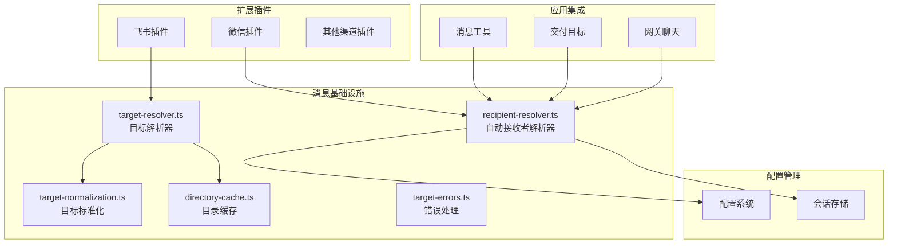
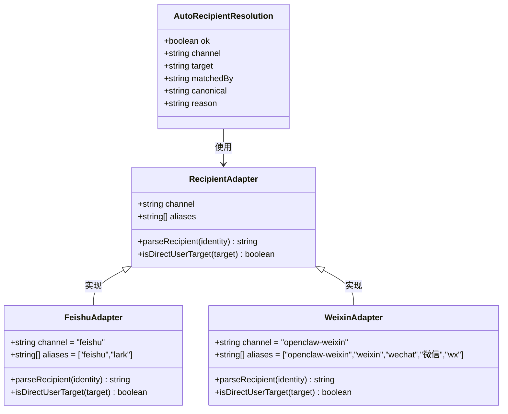
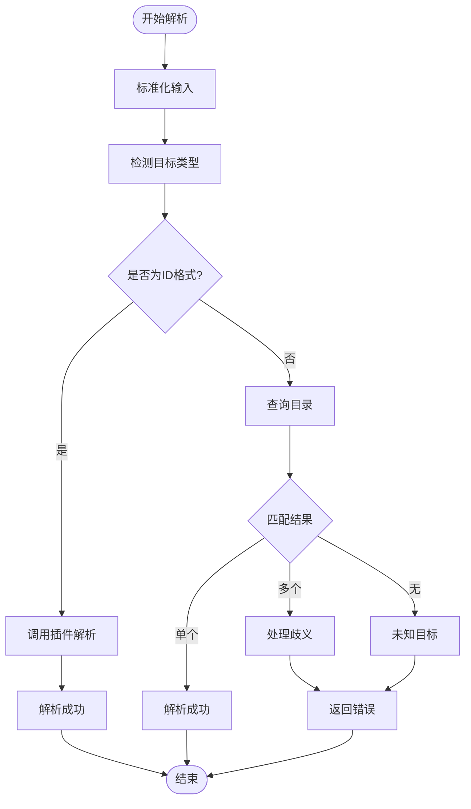
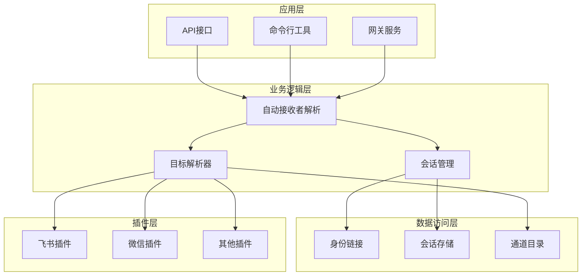
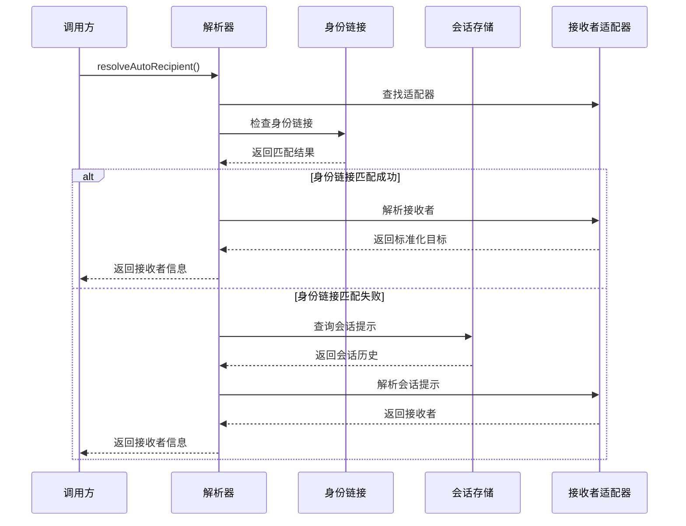
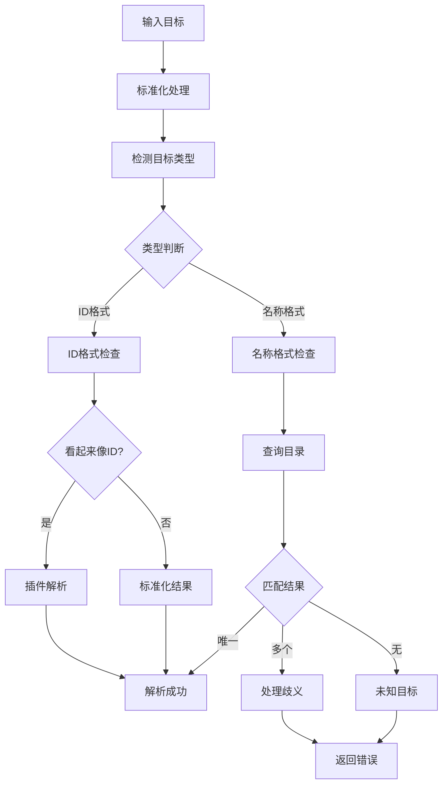
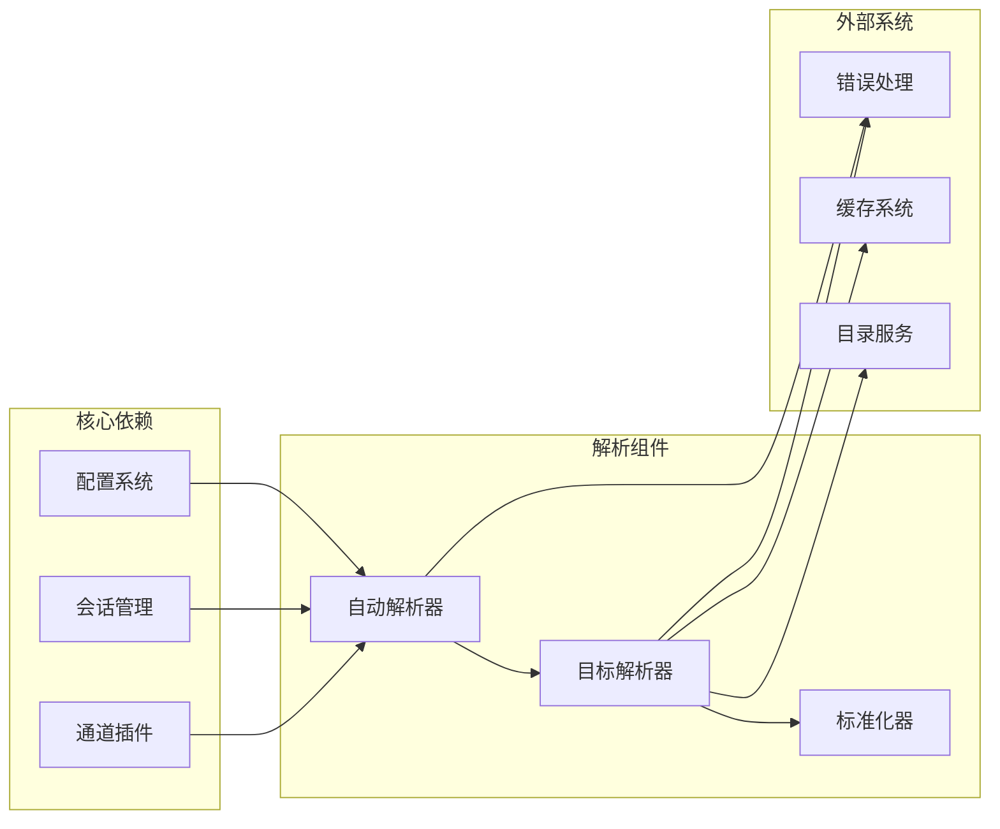

# 自动接收者解析

<cite>
**本文档引用的文件**
- [recipient-resolver.ts](file://src/infra/outbound/recipient-resolver.ts)
- [target-resolver.ts](file://src/infra/outbound/target-resolver.ts)
- [target-normalization.ts](file://src/infra/outbound/target-normalization.ts)
- [targets.ts](file://src/infra/outbound/targets.ts)
- [directory-cache.ts](file://src/infra/outbound/directory-cache.ts)
- [target-errors.ts](file://src/infra/outbound/target-errors.ts)
- [recipient-resolver.test.ts](file://src/infra/outbound/recipient-resolver.test.ts)
- [channel.ts](file://extensions/feishu/src/channel.ts)
- [message-tool.ts](file://src/agents/tools/message-tool.ts)
- [delivery-target.ts](file://src/cron/isolated-agent/delivery-target.ts)
- [chat.ts](file://src/gateway/server-methods/chat.ts)
</cite>

## 目录
1. [简介](#简介)
2. [项目结构](#项目结构)
3. [核心组件](#核心组件)
4. [架构概览](#架构概览)
5. [详细组件分析](#详细组件分析)
6. [依赖关系分析](#依赖关系分析)
7. [性能考虑](#性能考虑)
8. [故障排除指南](#故障排除指南)
9. [结论](#结论)

## 简介

自动接收者解析是OpenClaw消息系统中的关键功能，负责在没有明确指定目标接收者的情况下，自动从会话历史、身份链接和通道目录中推断出正确的消息接收者。该功能支持多种消息渠道（如飞书、微信等），并提供了智能的身份映射和目标解析能力。

该系统的核心价值在于：
- **自动化路由**：减少用户手动指定接收者的需求
- **多渠道支持**：统一处理不同消息平台的接收者格式
- **智能匹配**：基于会话历史和身份链接进行智能推断
- **错误处理**：提供详细的错误信息和回退机制

## 项目结构

OpenClaw的自动接收者解析功能主要分布在以下模块中：

**图表来源**
- [recipient-resolver.ts:1-280](file://src/infra/outbound/recipient-resolver.ts#L1-L280)
- [target-resolver.ts:1-551](file://src/infra/outbound/target-resolver.ts#L1-L551)
- [channel.ts:290-370](file://extensions/feishu/src/channel.ts#L290-L370)

**章节来源**
- [recipient-resolver.ts:1-280](file://src/infra/outbound/recipient-resolver.ts#L1-L280)
- [target-resolver.ts:1-551](file://src/infra/outbound/target-resolver.ts#L1-L551)

## 核心组件

### 自动接收者解析器

自动接收者解析器是整个系统的核心组件，负责根据多种数据源推断消息接收者：

**图表来源**
- [recipient-resolver.ts:5-98](file://src/infra/outbound/recipient-resolver.ts#L5-L98)

### 目标解析器

目标解析器负责处理通用的目标解析逻辑，包括目录查询和标准化：

**图表来源**
- [target-resolver.ts:379-512](file://src/infra/outbound/target-resolver.ts#L379-L512)

**章节来源**
- [recipient-resolver.ts:1-280](file://src/infra/outbound/recipient-resolver.ts#L1-L280)
- [target-resolver.ts:1-551](file://src/infra/outbound/target-resolver.ts#L1-L551)

## 架构概览

自动接收者解析系统采用分层架构设计，确保了良好的可扩展性和维护性：

**图表来源**
- [recipient-resolver.ts:240-280](file://src/infra/outbound/recipient-resolver.ts#L240-L280)
- [targets.ts:170-238](file://src/infra/outbound/targets.ts#L170-L238)

## 详细组件分析

### 自动接收者解析流程

自动接收者解析遵循以下优先级策略：

**图表来源**
- [recipient-resolver.ts:240-280](file://src/infra/outbound/recipient-resolver.ts#L240-L280)

### 接收者适配器设计

系统实现了专门的适配器来处理不同渠道的接收者格式：

| 渠道 | 适配器名称 | 支持的别名 | 特殊处理 |
|------|------------|------------|----------|
| 飞书 | FeishuAdapter | feishu, lark | 处理user:和chat:前缀 |
| 微信 | WeixinAdapter | openclaw-weixin, weixin, wechat, 微信, wx | 验证wxid格式和@im.wechat后缀 |

每个适配器都实现了统一的接口，确保了系统的可扩展性。

**章节来源**
- [recipient-resolver.ts:24-94](file://src/infra/outbound/recipient-resolver.ts#L24-L94)

### 目标解析算法

目标解析器采用了智能的解析策略：

**图表来源**
- [target-resolver.ts:379-512](file://src/infra/outbound/target-resolver.ts#L379-L512)

**章节来源**
- [target-resolver.ts:379-512](file://src/infra/outbound/target-resolver.ts#L379-L512)

## 依赖关系分析

自动接收者解析系统的关键依赖关系如下：

**图表来源**
- [recipient-resolver.ts:1-4](file://src/infra/outbound/recipient-resolver.ts#L1-L4)
- [target-resolver.ts:1-15](file://src/infra/outbound/target-resolver.ts#L1-L15)

**章节来源**
- [recipient-resolver.ts:1-4](file://src/infra/outbound/recipient-resolver.ts#L1-L4)
- [target-resolver.ts:1-15](file://src/infra/outbound/target-resolver.ts#L1-L15)

## 性能考虑

自动接收者解析系统在设计时充分考虑了性能优化：

### 缓存策略
- **目录缓存**：使用DirectoryCache类实现30分钟TTL的目录条目缓存
- **标准化缓存**：缓存目标标准化函数，避免重复计算
- **插件版本控制**：通过插件注册版本号实现缓存失效

### 内存管理
- **最大容量限制**：默认最多缓存2000个条目
- **LRU淘汰**：使用FIFO策略淘汰最旧的缓存项
- **按需清理**：配置变更时自动清理相关缓存

### 异步处理
- **并发查询**：目录查询支持Promise.all并行处理
- **超时控制**：插件调用具有合理的超时机制
- **错误隔离**：单个查询失败不影响整体性能

## 故障排除指南

### 常见问题及解决方案

| 问题类型 | 错误原因 | 解决方案 |
|----------|----------|----------|
| 身份链接缺失 | 配置中缺少session.identityLinks | 检查配置文件或添加身份链接 |
| 发送者缺失 | 没有有效的发送者候选者 | 提供至少一个发送者标识符 |
| 发送者歧义 | 多个发送者匹配同一接收者 | 使用更精确的发送者标识符 |
| 渠道缺失 | 不支持的接收者渠道 | 检查渠道名称或添加适配器 |
| 渠道歧义 | 多个接收者匹配同一发送者 | 提供更精确的接收者标识符 |

### 调试技巧

1. **启用详细日志**：查看解析过程中的中间结果
2. **检查配置**：验证身份链接和会话存储的正确性
3. **单元测试**：运行测试用例验证解析逻辑
4. **插件兼容性**：确认目标解析器插件正常工作

**章节来源**
- [recipient-resolver.test.ts:1-131](file://src/infra/outbound/recipient-resolver.test.ts#L1-L131)
- [target-errors.ts:1-31](file://src/infra/outbound/target-errors.ts#L1-L31)

## 结论

自动接收者解析系统通过精心设计的架构和算法，为OpenClaw提供了强大而灵活的消息路由能力。系统的主要优势包括：

- **智能化解析**：能够从多种数据源智能推断接收者
- **多渠道支持**：统一处理不同消息平台的格式差异
- **高性能设计**：通过缓存和异步处理确保响应速度
- **可扩展性**：模块化设计便于添加新的渠道支持
- **健壮性**：完善的错误处理和回退机制

该系统为OpenClaw的自动化消息传递奠定了坚实的基础，显著提升了用户体验和开发效率。