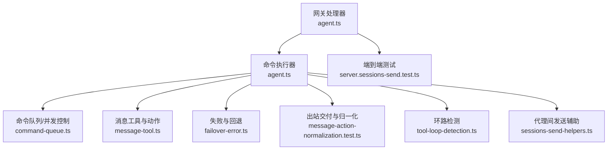
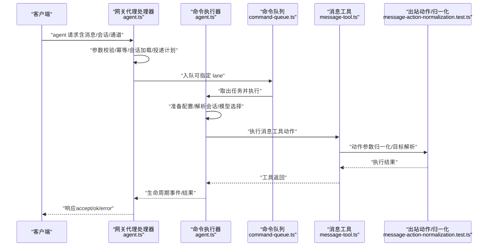
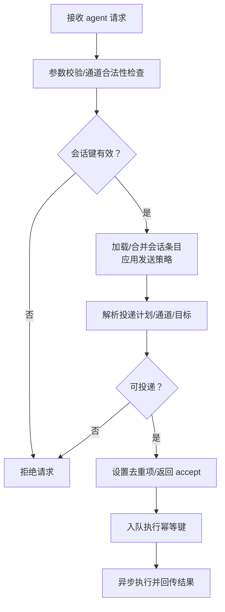
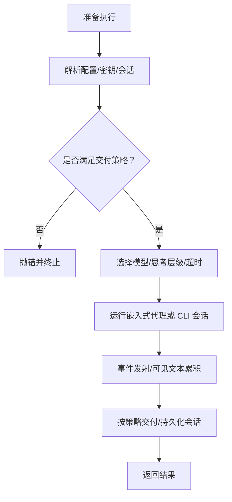
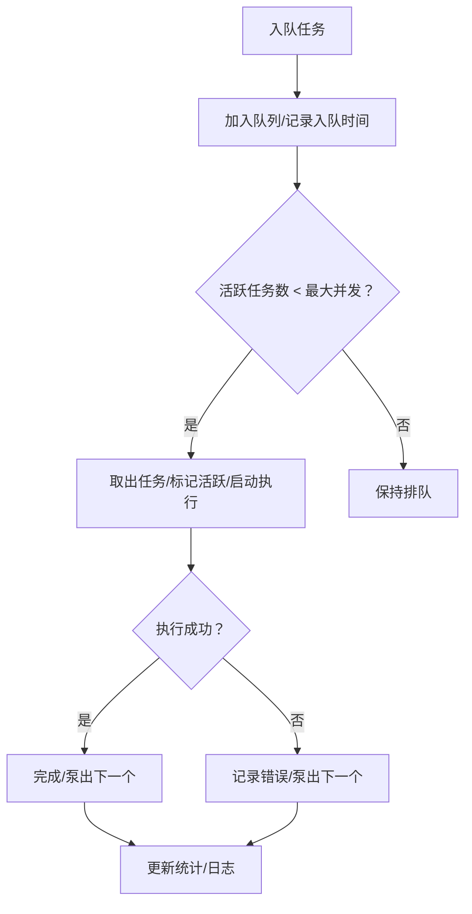
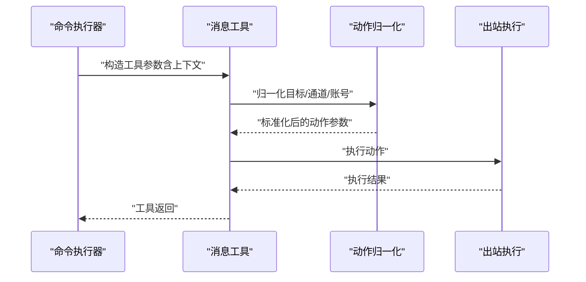
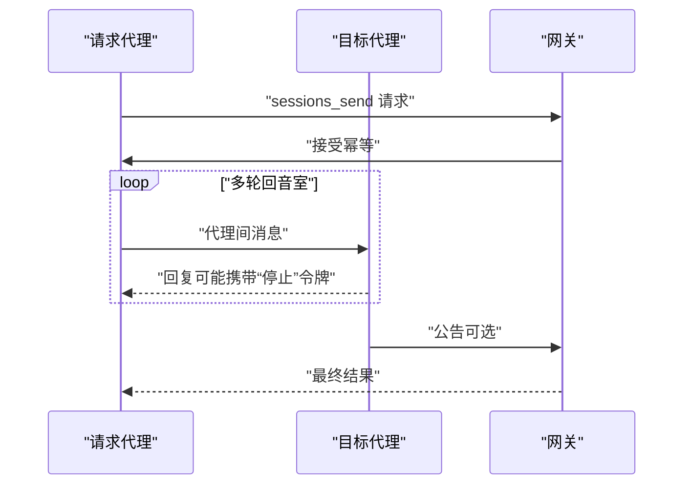
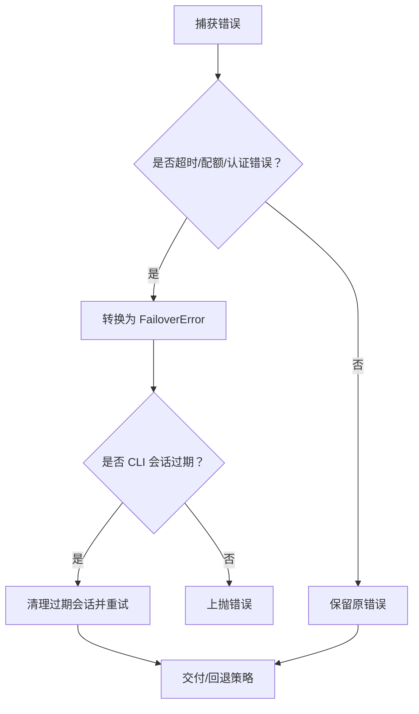
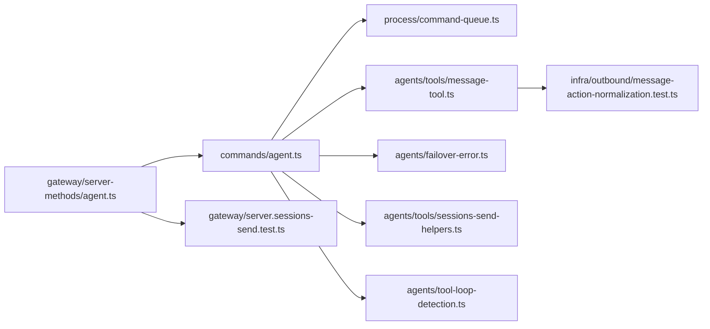

# 代理执行循环

<cite>
**本文引用的文件**
- [src/gateway/server-methods/agent.ts](file://src/gateway/server-methods/agent.ts)
- [src/commands/agent.ts](file://src/commands/agent.ts)
- [src/process/command-queue.ts](file://src/process/command-queue.ts)
- [src/agents/tools/sessions-send-helpers.ts](file://src/agents/tools/sessions-send-helpers.ts)
- [src/agents/tools/message-tool.ts](file://src/agents/tools/message-tool.ts)
- [src/agents/failover-error.ts](file://src/agents/failover-error.ts)
- [src/gateway/server.sessions-send.test.ts](file://src/gateway/server.sessions-send.test.ts)
- [src/agents/pi-embedded-subscribe.handlers.tools.ts](file://src/agents/pi-embedded-subscribe.handlers.tools.ts)
- [src/infra/outbound/message-action-normalization.test.ts](file://src/infra/outbound/message-action-normalization.test.ts)
- [src/auto-reply/reply/queue/directive.ts](file://src/auto-reply/reply/queue/directive.ts)
- [src/auto-reply/reply/queue/normalize.ts](file://src/auto-reply/reply/queue/normalize.ts)
- [src/agents/tool-loop-detection.ts](file://src/agents/tool-loop-detection.ts)
- [src/agents/bash-tools.exec-approval-followup.ts](file://src/agents/bash-tools.exec-approval-followup.ts)
</cite>

## 目录

1. [引言](#引言)
2. [项目结构](#项目结构)
3. [核心组件](#核心组件)
4. [架构总览](#架构总览)
5. [详细组件分析](#详细组件分析)
6. [依赖关系分析](#依赖关系分析)
7. [性能考量](#性能考量)
8. [故障排查指南](#故障排查指南)
9. [结论](#结论)
10. [附录](#附录)

## 引言

本文件系统性阐述 OpenClaw 的“代理执行循环”，覆盖从消息接收、解析与上下文构建，到决策制定、工具调用与响应生成的完整生命周期；同时深入解析并发执行、队列管理与优先级调度、错误处理与重试、异常恢复、调试与性能优化策略，并通过图示与路径引用帮助读者快速定位实现细节。

## 项目结构

围绕代理执行循环的关键模块分布如下：

- 网关层：负责请求接入、参数校验、幂等与去重、会话加载与投递计划、触发命令执行与结果回传
- 命令层：封装代理命令执行流程，包括会话解析、工作区准备、模型选择与回退、事件发射、交付与持久化
- 并发与队列：提供按“通道”隔离的命令队列，支持并发度控制、排队等待告警、清空与重启恢复
- 工具与消息：消息工具抽象、动作归一化、目标解析、跨渠道适配
- 错误与回退：统一失败分类、状态码映射、超时识别与回退错误类型
- 代理间通信：会话发送辅助函数，支持代理对代理的“回音室式”对话与公告

**图表来源**

- [src/gateway/server-methods/agent.ts](file://src/gateway/server-methods/agent.ts)
- [src/commands/agent.ts](file://src/commands/agent.ts)
- [src/process/command-queue.ts](file://src/process/command-queue.ts)
- [src/agents/tools/message-tool.ts](file://src/agents/tools/message-tool.ts)
- [src/agents/failover-error.ts](file://src/agents/failover-error.ts)
- [src/infra/outbound/message-action-normalization.test.ts](file://src/infra/outbound/message-action-normalization.test.ts)
- [src/agents/tool-loop-detection.ts](file://src/agents/tool-loop-detection.ts)
- [src/agents/tools/sessions-send-helpers.ts](file://src/agents/tools/sessions-send-helpers.ts)
- [src/gateway/server.sessions-send.test.ts](file://src/gateway/server.sessions-send.test.ts)

**章节来源**

- [src/gateway/server-methods/agent.ts](file://src/gateway/server-methods/agent.ts)
- [src/commands/agent.ts](file://src/commands/agent.ts)
- [src/process/command-queue.ts](file://src/process/command-queue.ts)
- [src/agents/tools/message-tool.ts](file://src/agents/tools/message-tool.ts)
- [src/agents/failover-error.ts](file://src/agents/failover-error.ts)
- [src/infra/outbound/message-action-normalization.test.ts](file://src/infra/outbound/message-action-normalization.test.ts)
- [src/agents/tool-loop-detection.ts](file://src/agents/tool-loop-detection.ts)
- [src/agents/tools/sessions-send-helpers.ts](file://src/agents/tools/sessions-send-helpers.ts)
- [src/gateway/server.sessions-send.test.ts](file://src/gateway/server.sessions-send.test.ts)

## 核心组件

- 网关代理处理器：负责参数校验、幂等与去重、会话加载、投递计划、触发命令执行与最终响应
- 代理命令执行器：准备配置、解析会话、选择模型与思考层级、运行嵌入式代理或 CLI、事件发射、交付与持久化
- 命令队列与并发：按“通道/主干”隔离的队列，支持并发度、等待告警、清空与重启恢复
- 消息工具与动作：统一路由与动作参数，进行目标归一化与跨渠道适配
- 失败与回退：统一失败分类、超时识别、状态码映射与回退错误类型
- 代理间发送辅助：构建代理对代理的上下文、回合与公告提示词
- 环路检测：检测重复工具调用、投票无进展、全局断路器与“回音室”模式

**章节来源**

- [src/gateway/server-methods/agent.ts](file://src/gateway/server-methods/agent.ts)
- [src/commands/agent.ts](file://src/commands/agent.ts)
- [src/process/command-queue.ts](file://src/process/command-queue.ts)
- [src/agents/tools/message-tool.ts](file://src/agents/tools/message-tool.ts)
- [src/agents/failover-error.ts](file://src/agents/failover-error.ts)
- [src/agents/tools/sessions-send-helpers.ts](file://src/agents/tools/sessions-send-helpers.ts)
- [src/agents/tool-loop-detection.ts](file://src/agents/tool-loop-detection.ts)

## 架构总览

下图展示了从“消息进入网关”到“代理执行完成并回传”的全链路：

**图表来源**

- [src/gateway/server-methods/agent.ts](file://src/gateway/server-methods/agent.ts)
- [src/commands/agent.ts](file://src/commands/agent.ts)
- [src/process/command-queue.ts](file://src/process/command-queue.ts)
- [src/agents/tools/message-tool.ts](file://src/agents/tools/message-tool.ts)
- [src/infra/outbound/message-action-normalization.test.ts](file://src/infra/outbound/message-action-normalization.test.ts)

## 详细组件分析

### 网关代理处理器（消息接收与派发）

- 参数校验与幂等：对请求参数进行严格校验，使用去重键避免重复执行
- 会话加载与策略：根据会话键加载/合并会话条目，应用发送策略与投递计划
- 投递计划与通道选择：在需要时解析默认通道与目标，确保可投递
- 入队执行：将代理命令以幂等键入队，随后异步执行并回传结果
- 终止态查询：提供 agent.wait 接口，支持生命周期与去重快照查询

**图表来源**

- [src/gateway/server-methods/agent.ts](file://src/gateway/server-methods/agent.ts)

**章节来源**

- [src/gateway/server-methods/agent.ts](file://src/gateway/server-methods/agent.ts)

### 代理命令执行器（上下文构建与决策）

- 配置与密钥：从源配置快照与网关注入中解析命令密钥，设置运行时配置
- 会话解析：支持按 to/sessionId/sessionKey/agentId 解析会话，必要时新建
- 思考与冗余：规范化思考/冗余级别，计算超时时间，决定子代理/超时策略
- 运行代理：根据提供者选择嵌入式代理或 CLI 会话，支持 ACP 转写与可见文本累积
- 事件与交付：发射生命周期与助手事件，按策略交付消息并持久化会话

**图表来源**

- [src/commands/agent.ts](file://src/commands/agent.ts)

**章节来源**

- [src/commands/agent.ts](file://src/commands/agent.ts)

### 并发与队列管理（按通道隔离与优先级）

- 队列模型：每个“通道/主干”独立 lane，维护队列、活跃任务集合、最大并发与代际
- 并发控制：通过 maxConcurrent 控制每 lane 并发度，避免资源争用
- 等待告警：超过阈值等待时记录日志与回调通知
- 清空与重启：支持清空单 lane 未执行任务、重启后重置代际并泵出剩余任务
- 全局等待：提供等待所有活跃任务结束的能力

**图表来源**

- [src/process/command-queue.ts](file://src/process/command-queue.ts)

**章节来源**

- [src/process/command-queue.ts](file://src/process/command-queue.ts)

### 消息工具与动作（上下文构建与工具调用）

- 动作参数：统一路由与动作参数，支持显式目标、账号、通道、线程等
- 目标归一化：在不同渠道间进行目标 ID 归一化与校验
- 工具执行：根据动作执行消息发送、回复、投票、线程等操作
- 上下文装饰：在直接调用场景跳过跨上下文装饰，避免重复修饰

**图表来源**

- [src/agents/tools/message-tool.ts](file://src/agents/tools/message-tool.ts)
- [src/infra/outbound/message-action-normalization.test.ts](file://src/infra/outbound/message-action-normalization.test.ts)

**章节来源**

- [src/agents/tools/message-tool.ts](file://src/agents/tools/message-tool.ts)
- [src/infra/outbound/message-action-normalization.test.ts](file://src/infra/outbound/message-action-normalization.test.ts)

### 代理间发送与公告（回音室式对话）

- 代理间上下文：构建请求方与目标方的会话与通道信息，用于“回音室”对话
- 回复回合：限制最大回合数，支持“停止”令牌提前结束
- 公告步骤：在回合结束后，允许目标代理发布公告，或使用“跳过”令牌保持沉默
- 测试验证：端到端测试覆盖“点对点回音室”与“公告”流程

**图表来源**

- [src/agents/tools/sessions-send-helpers.ts](file://src/agents/tools/sessions-send-helpers.ts)
- [src/gateway/server.sessions-send.test.ts](file://src/gateway/server.sessions-send.test.ts)

**章节来源**

- [src/agents/tools/sessions-send-helpers.ts](file://src/agents/tools/sessions-send-helpers.ts)
- [src/gateway/server.sessions-send.test.ts](file://src/gateway/server.sessions-send.test.ts)

### 错误处理、重试与异常恢复

- 失败分类：基于状态码、错误码与消息内容识别超时、配额、认证、模型不存在等
- 回退错误：将错误转换为统一的 FailoverError，携带原因、状态码、提供商与模型信息
- 超时判定：综合错误名、Abort/Timeout 提示与网络错误码识别超时
- 重试与回退：命令执行器在 CLI 会话过期时自动清理并重试，必要时切换到新会话
- 工具执行跟踪：在工具执行前后跟踪消息目标、文本与媒体 URL，便于回溯

**图表来源**

- [src/agents/failover-error.ts](file://src/agents/failover-error.ts)
- [src/commands/agent.ts](file://src/commands/agent.ts)
- [src/agents/pi-embedded-subscribe.handlers.tools.ts](file://src/agents/pi-embedded-subscribe.handlers.tools.ts)

**章节来源**

- [src/agents/failover-error.ts](file://src/agents/failover-error.ts)
- [src/commands/agent.ts](file://src/commands/agent.ts)
- [src/agents/pi-embedded-subscribe.handlers.tools.ts](file://src/agents/pi-embedded-subscribe.handlers.tools.ts)

### 调试方法、性能监控与优化

- 调试与诊断
  - 生命周期事件：命令执行器发射生命周期与助手事件，便于前端/客户端实时追踪
  - 环路检测：检测重复工具调用、投票无进展与“回音室”模式，防止死循环
  - 执行审批跟进：异步命令完成后通过网关工具发送摘要回复，提升可观测性
- 性能监控
  - 队列等待告警：超过阈值记录等待时长与排队长度
  - 代际与清空：重启后重置代际并泵出剩余任务，避免僵尸任务阻塞
  - 并发度调优：按通道/主干调整 maxConcurrent，平衡吞吐与稳定性
- 优化建议
  - 合理划分 lane：将高风险/低优先级任务放入独立 lane，避免与主干交互
  - 会话缓存与去重：利用幂等键减少重复执行
  - 动作归一化：在工具层统一目标与通道，降低下游适配成本

**章节来源**

- [src/commands/agent.ts](file://src/commands/agent.ts)
- [src/agents/tool-loop-detection.ts](file://src/agents/tool-loop-detection.ts)
- [src/agents/bash-tools.exec-approval-followup.ts](file://src/agents/bash-tools.exec-approval-followup.ts)
- [src/process/command-queue.ts](file://src/process/command-queue.ts)

## 依赖关系分析

**图表来源**

- [src/gateway/server-methods/agent.ts](file://src/gateway/server-methods/agent.ts)
- [src/commands/agent.ts](file://src/commands/agent.ts)
- [src/process/command-queue.ts](file://src/process/command-queue.ts)
- [src/agents/tools/message-tool.ts](file://src/agents/tools/message-tool.ts)
- [src/infra/outbound/message-action-normalization.test.ts](file://src/infra/outbound/message-action-normalization.test.ts)
- [src/agents/failover-error.ts](file://src/agents/failover-error.ts)
- [src/agents/tools/sessions-send-helpers.ts](file://src/agents/tools/sessions-send-helpers.ts)
- [src/agents/tool-loop-detection.ts](file://src/agents/tool-loop-detection.ts)
- [src/gateway/server.sessions-send.test.ts](file://src/gateway/server.sessions-send.test.ts)

**章节来源**

- [src/gateway/server-methods/agent.ts](file://src/gateway/server-methods/agent.ts)
- [src/commands/agent.ts](file://src/commands/agent.ts)
- [src/process/command-queue.ts](file://src/process/command-queue.ts)
- [src/agents/tools/message-tool.ts](file://src/agents/tools/message-tool.ts)
- [src/infra/outbound/message-action-normalization.test.ts](file://src/infra/outbound/message-action-normalization.test.ts)
- [src/agents/failover-error.ts](file://src/agents/failover-error.ts)
- [src/agents/tools/sessions-send-helpers.ts](file://src/agents/tools/sessions-send-helpers.ts)
- [src/agents/tool-loop-detection.ts](file://src/agents/tool-loop-detection.ts)
- [src/gateway/server.sessions-send.test.ts](file://src/gateway/server.sessions-send.test.ts)

## 性能考量

- 并发与隔离：通过 lane 将高风险任务与主干隔离，避免相互干扰
- 超时与回退：合理设置超时与回退策略，避免长时间阻塞
- 日志与告警：对等待超阈值进行日志与回调通知，便于及时干预
- 重启恢复：在进程内重启时重置代际并泵出剩余任务，保证队列健康

## 故障排查指南

- 常见问题
  - 会话策略拒绝：检查会话策略与投递计划，确认通道与目标合法
  - 幂等重复：确认 idempotencyKey 是否正确，避免重复执行
  - 超时与配额：识别 FailoverError 的原因，按需回退或限速
  - 目标解析失败：检查动作参数与目标归一化逻辑
- 排查步骤
  - 查看生命周期事件与助手事件
  - 使用 agent.wait 查询终端快照
  - 检查队列等待告警与活跃任务计数
  - 在环路检测开启时观察重复工具调用

**章节来源**

- [src/gateway/server-methods/agent.ts](file://src/gateway/server-methods/agent.ts)
- [src/commands/agent.ts](file://src/commands/agent.ts)
- [src/process/command-queue.ts](file://src/process/command-queue.ts)
- [src/agents/failover-error.ts](file://src/agents/failover-error.ts)
- [src/agents/tool-loop-detection.ts](file://src/agents/tool-loop-detection.ts)

## 结论

OpenClaw 的代理执行循环以“网关-命令-队列-工具-交付”为主线，通过严格的参数校验、幂等与去重、会话与投递策略、并发隔离与等待告警、统一的失败分类与回退、以及代理间“回音室式”对话与公告机制，实现了稳定、可观测且可扩展的代理执行闭环。配合环路检测与执行审批跟进，进一步提升了系统的鲁棒性与可运维性。

## 附录

- 关键实现路径参考
  - 网关代理处理器：[src/gateway/server-methods/agent.ts](file://src/gateway/server-methods/agent.ts)
  - 代理命令执行器：[src/commands/agent.ts](file://src/commands/agent.ts)
  - 命令队列与并发控制：[src/process/command-queue.ts](file://src/process/command-queue.ts)
  - 消息工具与动作：[src/agents/tools/message-tool.ts](file://src/agents/tools/message-tool.ts)
  - 动作参数归一化测试：[src/infra/outbound/message-action-normalization.test.ts](file://src/infra/outbound/message-action-normalization.test.ts)
  - 失败与回退错误：[src/agents/failover-error.ts](file://src/agents/failover-error.ts)
  - 代理间发送辅助：[src/agents/tools/sessions-send-helpers.ts](file://src/agents/tools/sessions-send-helpers.ts)
  - 端到端测试（代理间回音室与公告）：[src/gateway/server.sessions-send.test.ts](file://src/gateway/server.sessions-send.test.ts)
  - 环路检测：[src/agents/tool-loop-detection.ts](file://src/agents/tool-loop-detection.ts)
  - 执行审批跟进：[src/agents/bash-tools.exec-approval-followup.ts](file://src/agents/bash-tools.exec-approval-followup.ts)
  - 队列指令解析与归一化：[src/auto-reply/reply/queue/directive.ts](file://src/auto-reply/reply/queue/directive.ts), [src/auto-reply/reply/queue/normalize.ts](file://src/auto-reply/reply/queue/normalize.ts)
