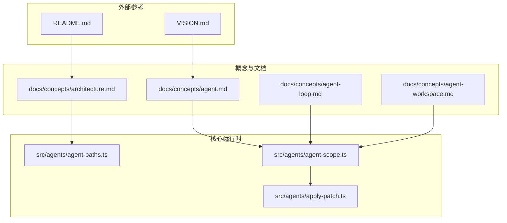
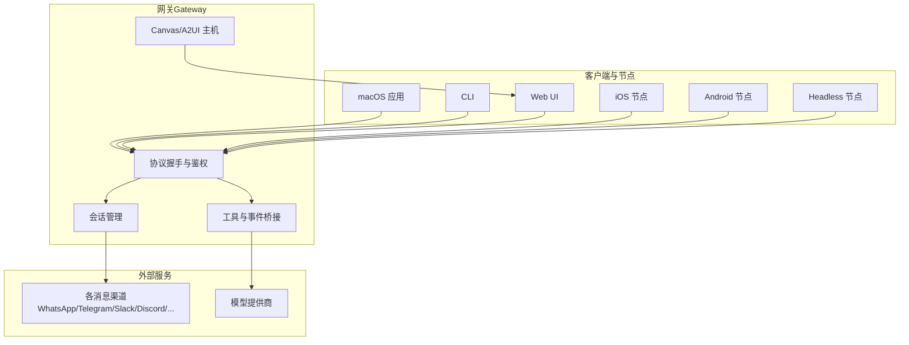
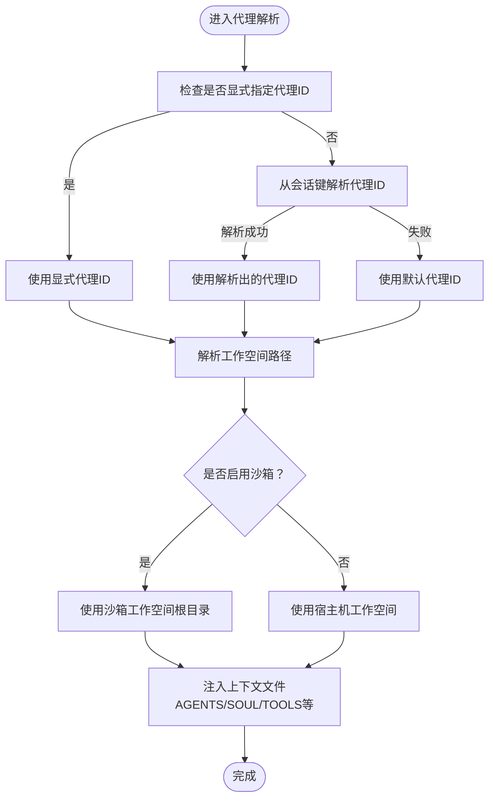
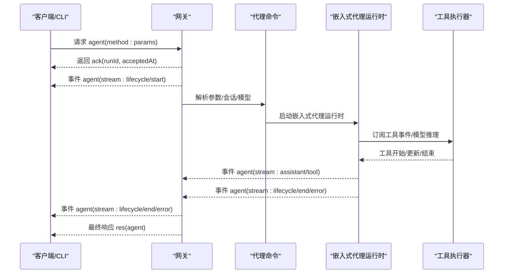
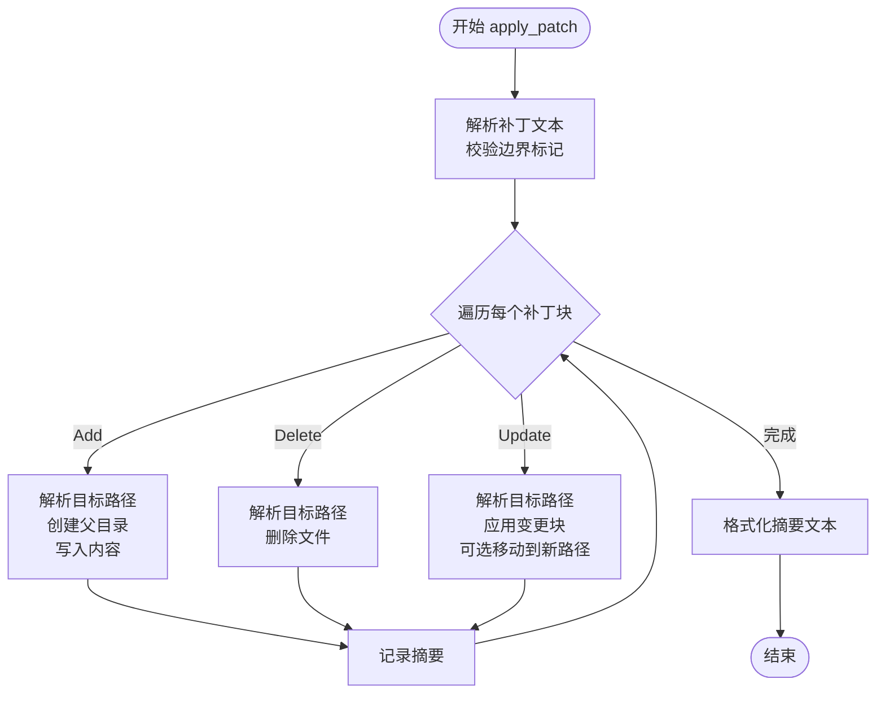
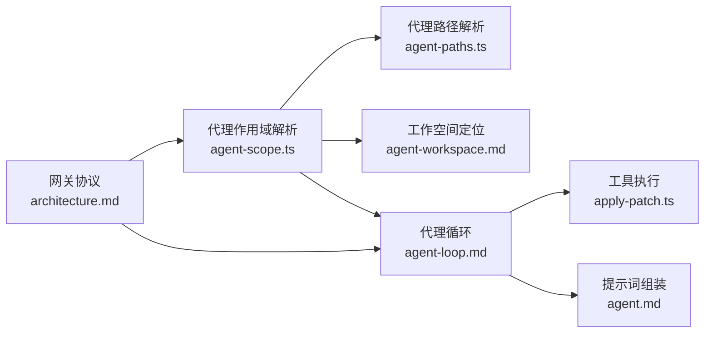

# 代理概念与架构

<cite>
**本文引用的文件**
- [README.md](file://README.md)
- [VISION.md](file://VISION.md)
- [docs/concepts/architecture.md](file://docs/concepts/architecture.md)
- [docs/concepts/agent.md](file://docs/concepts/agent.md)
- [docs/concepts/agent-loop.md](file://docs/concepts/agent-loop.md)
- [docs/concepts/agent-workspace.md](file://docs/concepts/agent-workspace.md)
- [src/agents/agent-paths.ts](file://src/agents/agent-paths.ts)
- [src/agents/agent-scope.ts](file://src/agents/agent-scope.ts)
- [src/agents/apply-patch.ts](file://src/agents/apply-patch.ts)
</cite>

## 目录

1. [引言](#引言)
2. [项目结构](#项目结构)
3. [核心组件](#核心组件)
4. [架构总览](#架构总览)
5. [详细组件分析](#详细组件分析)
6. [依赖分析](#依赖分析)
7. [性能考虑](#性能考虑)
8. [故障排查指南](#故障排查指南)
9. [结论](#结论)
10. [附录](#附录)

## 引言

本文件面向OpenClaw代理的概念与架构，系统化阐述其核心理念、运行机制与工程实现。OpenClaw以“本地优先、安全默认、可扩展工具链”为核心设计目标，通过统一的网关（Gateway）控制平面，承载多通道接入、会话管理、工具执行与事件流，形成“代理即控制中枢”的体系。与传统AI助手不同，OpenClaw强调：

- 代理身份与工作空间：每个代理拥有独立的工作目录与上下文注入机制，支持主会话与非主会话的沙箱隔离。
- 多会话与路由：基于会话键（sessionKey）解析代理ID，结合通道路由实现多代理协作。
- 端到端的代理循环：从消息输入、上下文组装、模型推理、工具调用到流式输出与持久化，形成闭环。
- 安全与可审计：路径边界检查、补丁应用的白盒策略、沙箱工作区等，确保对主机文件系统的最小暴露面。

## 项目结构

OpenClaw采用“概念文档 + 核心运行时 + 工具与插件”的分层组织方式。概念文档定义了代理、工作空间、架构与代理循环；核心运行时负责代理解析、工作空间定位、工具装配与会话管理；工具与插件提供能力扩展与钩子机制。

**图表来源**

- [docs/concepts/architecture.md:1-140](file://docs/concepts/architecture.md#L1-L140)
- [docs/concepts/agent.md:1-124](file://docs/concepts/agent.md#L1-L124)
- [docs/concepts/agent-loop.md:1-149](file://docs/concepts/agent-loop.md#L1-L149)
- [docs/concepts/agent-workspace.md:1-237](file://docs/concepts/agent-workspace.md#L1-L237)
- [src/agents/agent-paths.ts:1-26](file://src/agents/agent-paths.ts#L1-L26)
- [src/agents/agent-scope.ts:1-339](file://src/agents/agent-scope.ts#L1-L339)
- [src/agents/apply-patch.ts:1-583](file://src/agents/apply-patch.ts#L1-L583)
- [README.md:1-560](file://README.md#L1-L560)
- [VISION.md:1-111](file://VISION.md#L1-L111)

**章节来源**

- [README.md:1-560](file://README.md#L1-L560)
- [VISION.md:1-111](file://VISION.md#L1-L111)

## 核心组件

- 代理运行时与工作空间
  - 代理工作空间是工具与上下文的唯一工作目录，支持主会话与非主会话的沙箱隔离与多代理路由。
  - 上下文注入：首次会话启动时，将AGENTS.md、SOUL.md、TOOLS.md等文件注入系统提示，形成稳定的“记忆与边界”。
- 代理解析与会话键
  - 基于会话键解析代理ID，支持显式指定、会话键内嵌代理ID或回退至默认代理。
  - 支持按工作空间路径反查代理ID，便于多代理场景的路由与审计。
- 工具与补丁应用
  - 提供标准化工具接口与补丁应用工具，严格限制路径范围与变更粒度，保障安全与可审计性。

**章节来源**

- [docs/concepts/agent.md:1-124](file://docs/concepts/agent.md#L1-L124)
- [docs/concepts/agent-workspace.md:1-237](file://docs/concepts/agent-workspace.md#L1-L237)
- [src/agents/agent-scope.ts:86-111](file://src/agents/agent-scope.ts#L86-L111)
- [src/agents/agent-scope.ts:295-328](file://src/agents/agent-scope.ts#L295-L328)
- [src/agents/apply-patch.ts:79-123](file://src/agents/apply-patch.ts#L79-L123)

## 架构总览

OpenClaw采用“单网关控制平面 + 多客户端/节点”的架构。客户端（macOS应用、CLI、Web UI、自动化）与节点（macOS/iOS/Android/headless）通过WebSocket连接到网关，由网关统一维护消息通道、会话状态、工具与事件。

**图表来源**

- [docs/concepts/architecture.md:12-58](file://docs/concepts/architecture.md#L12-L58)
- [docs/concepts/architecture.md:80-92](file://docs/concepts/architecture.md#L80-L92)
- [README.md:185-212](file://README.md#L185-L212)

**章节来源**

- [docs/concepts/architecture.md:1-140](file://docs/concepts/architecture.md#L1-L140)
- [README.md:185-212](file://README.md#L185-L212)

## 详细组件分析

### 组件A：代理身份与工作空间

- 代理身份解析
  - 支持默认代理、显式代理ID与会话键内嵌代理ID三种来源，优先级明确且可回退。
  - 按工作空间路径反查代理ID，用于多代理路由与审计。
- 工作空间定位
  - 默认工作空间位于用户状态目录下的agents/<agentId>/agent，可通过环境变量覆盖。
  - 非主会话可启用沙箱，使用独立工作空间根目录，避免对宿主机工作空间的直接访问。
- 上下文注入
  - 首次会话启动时注入AGENTS.md、SOUL.md、TOOLS.md等文件内容，形成稳定的人设与边界。

**图表来源**

- [src/agents/agent-scope.ts:86-111](file://src/agents/agent-scope.ts#L86-L111)
- [src/agents/agent-scope.ts:295-328](file://src/agents/agent-scope.ts#L295-L328)
- [src/agents/agent-paths.ts:6-14](file://src/agents/agent-paths.ts#L6-L14)
- [docs/concepts/agent.md:24-47](file://docs/concepts/agent.md#L24-L47)

**章节来源**

- [src/agents/agent-scope.ts:86-111](file://src/agents/agent-scope.ts#L86-L111)
- [src/agents/agent-scope.ts:256-272](file://src/agents/agent-scope.ts#L256-L272)
- [src/agents/agent-paths.ts:6-25](file://src/agents/agent-paths.ts#L6-L25)
- [docs/concepts/agent.md:12-47](file://docs/concepts/agent.md#L12-L47)

### 组件B：代理循环与消息处理

- 入口与生命周期
  - 通过网关RPC（agent/agent.wait）或CLI触发代理循环；循环串行化执行，保证会话一致性。
  - 生命周期事件包括start/end/error，工具调用与助手输出通过流事件传递。
- 队列与并发
  - 每个会话键对应一条序列化通道，必要时通过全局通道串行化，避免工具/会话竞态。
- 提示词组装与系统提示
  - 基于OpenClaw基础提示、技能快照、引导上下文与运行时覆盖，构建最终系统提示，并考虑模型限制与压缩预留。
- 流式输出与回复整形
  - 助手增量输出通过assistant流返回；块流式可在text_end或message_end触发；最终回复由助手文本、工具摘要与错误文本组合而成，并进行重复抑制与静默过滤。

**图表来源**

- [docs/concepts/agent-loop.md:18-44](file://docs/concepts/agent-loop.md#L18-L44)
- [docs/concepts/agent-loop.md:65-96](file://docs/concepts/agent-loop.md#L65-L96)
- [docs/concepts/agent-loop.md:127-132](file://docs/concepts/agent-loop.md#L127-L132)

**章节来源**

- [docs/concepts/agent-loop.md:1-149](file://docs/concepts/agent-loop.md#L1-L149)

### 组件C：工具执行与补丁应用

- 补丁应用工具
  - 使用自定义补丁格式（包含Begin/End标记、Add/Delete/Update块、Move等），逐块解析并应用到目标文件。
  - 文件操作通过边界文件读写或沙箱桥接，严格限制在工作空间范围内，防止越权访问。
- 安全与可审计
  - 对路径别名（软/硬链接）进行策略化校验；对删除目标路径采用严格策略；记录变更摘要（新增/修改/删除）。
  - 支持中止信号，确保长时间操作可中断。

**图表来源**

- [src/agents/apply-patch.ts:125-189](file://src/agents/apply-patch.ts#L125-L189)
- [src/agents/apply-patch.ts:229-276](file://src/agents/apply-patch.ts#L229-L276)
- [src/agents/apply-patch.ts:351-373](file://src/agents/apply-patch.ts#L351-L373)

**章节来源**

- [src/agents/apply-patch.ts:79-123](file://src/agents/apply-patch.ts#L79-L123)
- [src/agents/apply-patch.ts:229-276](file://src/agents/apply-patch.ts#L229-L276)
- [src/agents/apply-patch.ts:351-373](file://src/agents/apply-patch.ts#L351-L373)

## 依赖分析

- 组件耦合与内聚
  - 代理解析与工作空间解析高度内聚，共同决定代理的运行环境与上下文注入策略。
  - 工具执行与补丁应用通过统一的文件操作抽象（边界文件读写/沙箱桥接）实现低耦合扩展。
- 外部依赖与集成点
  - 网关协议（WebSocket、JSON Schema、类型生成）为跨语言客户端提供一致契约。
  - 模型提供商通过统一的模型解析与回退策略对接，支持多供应商与多模型组合。
- 循环依赖与风险
  - 代理循环与工具执行解耦，避免在代理循环内部直接耦合具体工具实现，降低循环复杂度。

**图表来源**

- [src/agents/agent-scope.ts:1-339](file://src/agents/agent-scope.ts#L1-L339)
- [src/agents/agent-paths.ts:1-26](file://src/agents/agent-paths.ts#L1-L26)
- [docs/concepts/agent-loop.md:1-149](file://docs/concepts/agent-loop.md#L1-L149)
- [docs/concepts/agent.md:1-124](file://docs/concepts/agent.md#L1-L124)
- [docs/concepts/architecture.md:1-140](file://docs/concepts/architecture.md#L1-L140)

**章节来源**

- [src/agents/agent-scope.ts:1-339](file://src/agents/agent-scope.ts#L1-L339)
- [src/agents/agent-paths.ts:1-26](file://src/agents/agent-paths.ts#L1-L26)
- [docs/concepts/agent-loop.md:1-149](file://docs/concepts/agent-loop.md#L1-L149)
- [docs/concepts/agent.md:1-124](file://docs/concepts/agent.md#L1-L124)
- [docs/concepts/architecture.md:1-140](file://docs/concepts/architecture.md#L1-L140)

## 性能考虑

- 串行化与队列
  - 会话级串行化避免工具/会话竞态，减少重试与补偿成本；全局队列在高并发时提供额外保护。
- 流式输出与块流
  - 块流式在text_end或message_end触发，兼顾延迟与吞吐；可配置合并策略减少单行碎片。
- 提示词压缩与令牌预留
  - 在提示词组装阶段考虑模型限制与压缩预留，避免超限导致的重试与失败。
- 沙箱与路径边界
  - 通过边界文件读写与沙箱桥接，减少不必要的磁盘扫描与权限检查，提升工具执行效率。

[本节为通用指导，不直接分析具体文件]

## 故障排查指南

- 代理身份与会话键
  - 若代理ID解析异常，检查会话键格式与显式代理ID设置；确认默认代理配置与多代理路由规则。
- 工作空间与上下文
  - 确认工作空间路径存在且可写；检查上下文文件（AGENTS/SOUL/TOOLS等）是否正确注入；关注大文件截断与缺失文件标记。
- 工具执行与补丁应用
  - 若补丁应用失败，检查补丁格式边界标记、路径别名策略与工作空间范围限制；查看摘要记录与错误信息。
- 网关协议与鉴权
  - 确认WebSocket握手与鉴权令牌；检查设备配对与签名挑战；验证本地/远程连接的授权策略。

**章节来源**

- [docs/concepts/agent-loop.md:138-149](file://docs/concepts/agent-loop.md#L138-L149)
- [src/agents/apply-patch.ts:329-338](file://src/agents/apply-patch.ts#L329-L338)
- [docs/concepts/architecture.md:80-92](file://docs/concepts/architecture.md#L80-L92)

## 结论

OpenClaw的代理架构以“安全默认、本地优先、可扩展工具链”为核心，通过统一网关控制平面与严格的代理解析、工作空间与工具执行机制，实现了从消息输入到工具执行再到流式输出的完整闭环。其多代理路由、会话串行化与沙箱隔离等设计，既满足了个人用户的隐私与安全需求，也为多场景协作提供了清晰的扩展路径。

[本节为总结性内容，不直接分析具体文件]

## 附录

- 最佳实践与设计原则
  - 代理身份与工作空间
    - 明确代理ID来源与回退策略；在多代理场景中使用会话键内嵌代理ID或按工作空间路径反查。
    - 将工作空间作为私有内存，使用私有Git仓库备份；避免在工作空间中存储敏感凭证。
  - 会话与上下文
    - 首次会话注入AGENTS/SOUL/TOOLS等文件，形成稳定的人设与边界；根据需要调整引导文件大小限制。
    - 在非主会话启用沙箱，避免对宿主机工作空间的直接访问。
  - 工具与补丁
    - 使用标准补丁格式与边界检查，严格限制变更范围；在沙箱环境中执行文件操作。
    - 对长时间运行的工具提供中止信号支持，提升交互体验。
  - 网关与协议
    - 保持WebSocket握手与鉴权策略一致；在远程部署中启用Tailscale或SSH隧道，并配置必要的TLS与鉴权。
  - 安全与合规
    - 默认启用安全策略与沙箱；对未知来源的设备连接要求配对批准；定期审查代理日志与工具摘要。

**章节来源**

- [docs/concepts/agent-workspace.md:138-237](file://docs/concepts/agent-workspace.md#L138-L237)
- [docs/concepts/agent.md:114-124](file://docs/concepts/agent.md#L114-L124)
- [docs/concepts/architecture.md:117-128](file://docs/concepts/architecture.md#L117-L128)
- [VISION.md:41-51](file://VISION.md#L41-L51)
