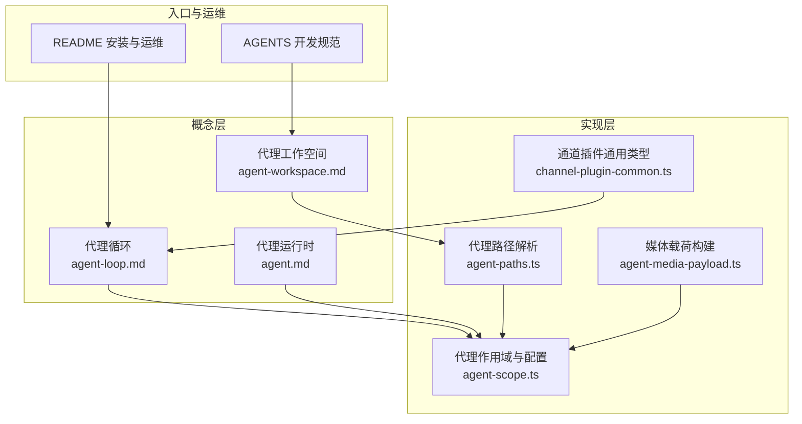
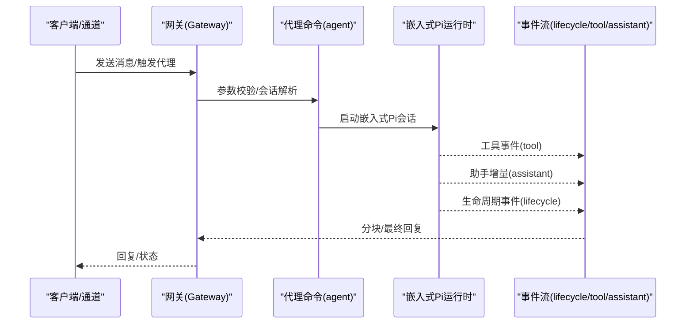
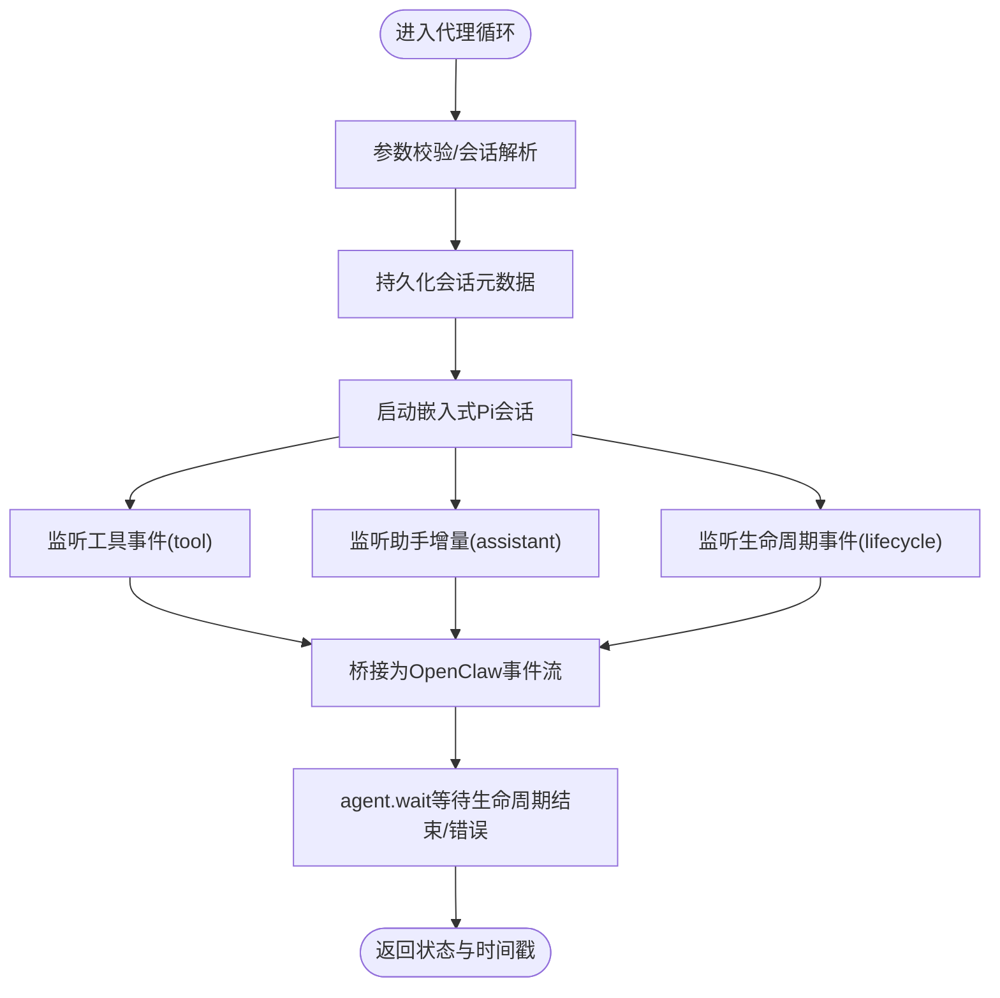
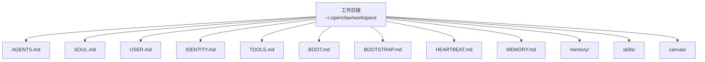
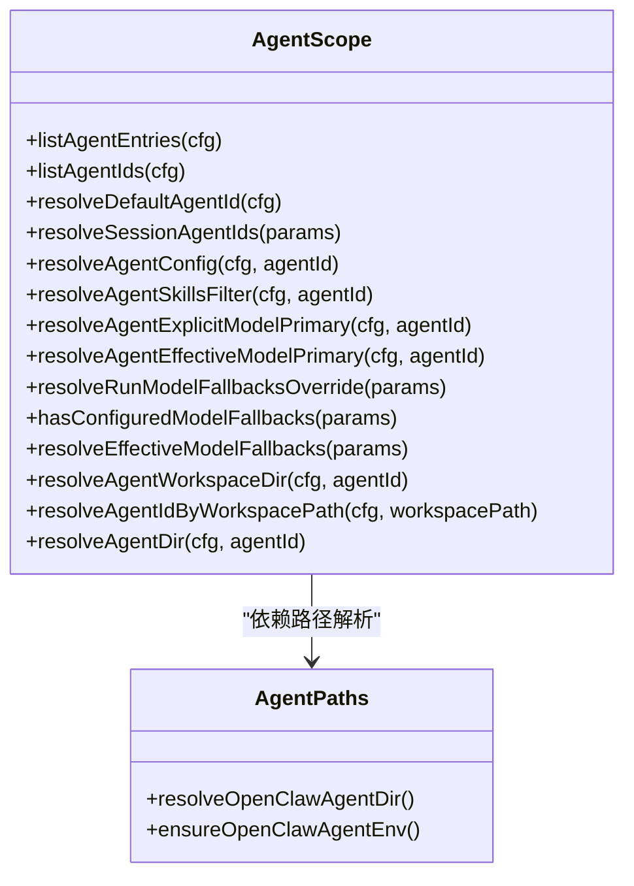
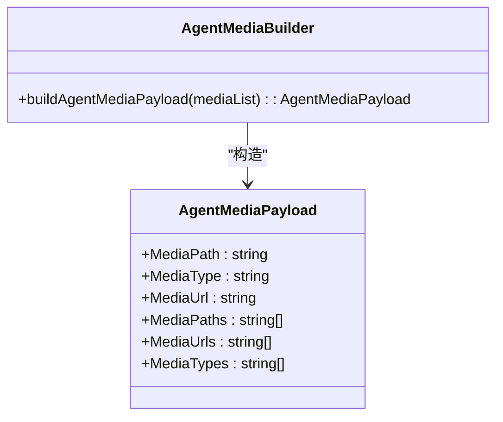
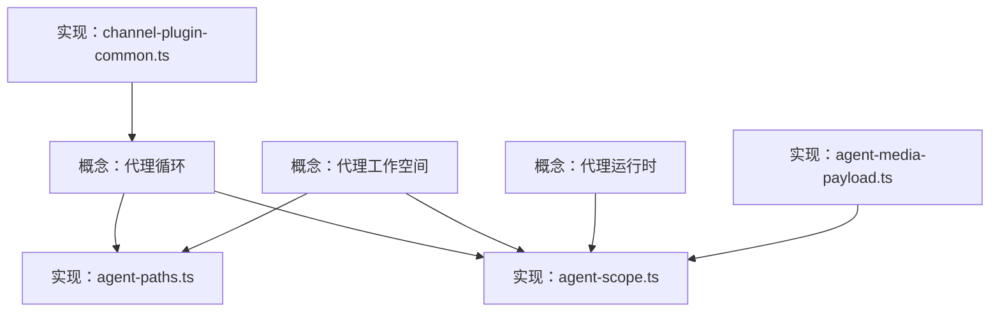

# 代理系统

<cite>
**本文引用的文件**
- [README.md](file://README.md)
- [AGENTS.md](file://AGENTS.md)
- [agent-loop.md](file://docs/concepts/agent-loop.md)
- [agent-workspace.md](file://docs/concepts/agent-workspace.md)
- [agent.md](file://docs/concepts/agent.md)
- [agent-paths.ts](file://src/agents/agent-paths.ts)
- [agent-scope.ts](file://src/agents/agent-scope.ts)
- [agent-media-payload.ts](file://src/plugin-sdk/agent-media-payload.ts)
- [channel-plugin-common.ts](file://src/plugin-sdk/channel-plugin-common.ts)
</cite>

## 目录

1. [简介](#简介)
2. [项目结构](#项目结构)
3. [核心组件](#核心组件)
4. [架构总览](#架构总览)
5. [详细组件分析](#详细组件分析)
6. [依赖关系分析](#依赖关系分析)
7. [性能考量](#性能考量)
8. [故障排查指南](#故障排查指南)
9. [结论](#结论)
10. [附录](#附录)

## 简介

本技术文档面向OpenClaw代理系统，系统性阐述AI代理的概念、工作原理与执行循环；详解代理工作空间的组织结构、工具调用机制与多代理协作模式；说明代理在消息处理、决策制定与工具执行中的角色；解释代理配置、身份管理与权限控制；并提供代理开发指南、工具集成方法与性能优化建议。文档同时给出基于仓库实际文件的架构图与流程图，帮助读者快速理解与落地实践。

## 项目结构

OpenClaw是一个“个人AI助手”，可在本地设备上运行，通过网关（Gateway）统一控制会话、通道、工具与事件流。代理系统的核心由以下部分组成：

- 概念文档：代理循环、代理工作空间、代理运行时等概念文档，定义了代理生命周期、prompt组装、工具执行、消息路由与权限模型。
- 核心实现：代理路径解析、代理作用域与配置解析、媒体载荷构建、通道插件通用类型等。
- 配置与安装：README中提供了安装、升级、守护进程安装与快速启动指引，以及安全默认策略与频道接入方式。

**图表来源**

- [agent-loop.md](file://docs/concepts/agent-loop.md)
- [agent-workspace.md](file://docs/concepts/agent-workspace.md)
- [agent.md](file://docs/concepts/agent.md)
- [agent-paths.ts](file://src/agents/agent-paths.ts)
- [agent-scope.ts](file://src/agents/agent-scope.ts)
- [agent-media-payload.ts](file://src/plugin-sdk/agent-media-payload.ts)
- [channel-plugin-common.ts](file://src/plugin-sdk/channel-plugin-common.ts)
- [README.md](file://README.md)
- [AGENTS.md](file://AGENTS.md)

**章节来源**

- [README.md](file://README.md)
- [AGENTS.md](file://AGENTS.md)

## 核心组件

- 代理循环（Agent Loop）
  - 定义从消息到动作再到最终回复的完整生命周期，包括参数校验、会话解析、模型推理、工具执行、流式输出与持久化。
  - 支持队列与并发控制，保证会话历史一致性。
  - 提供生命周期事件与工具事件流，支持内部钩子与插件钩子扩展。
- 代理工作空间（Agent Workspace）
  - 代理的唯一工作目录，作为工具与上下文的根目录；可启用沙箱隔离；支持Git私有备份。
  - 包含标准引导文件（如AGENTS.md、SOUL.md、TOOLS.md等），并在每轮会话开始时注入到上下文中。
- 代理运行时（Agent Runtime）
  - 基于嵌入式pi-mono运行时，结合OpenClaw的会话管理与工具绑定。
  - 支持技能加载、会话转录存储、分块流式回复与队列模式（steer/followup/collect）。
- 代理路径与作用域（Agent Paths & Scope）
  - 解析代理目录与环境变量，确保OPENCLAW_AGENT_DIR与PI_CODING_AGENT_DIR一致。
  - 解析代理ID、默认代理、会话代理映射、模型主备与回退策略、工作空间路径与代理目录。
- 媒体载荷与通道插件
  - 统一媒体载荷结构，便于跨通道传递图片/视频/文件等资源。
  - 通道插件通用类型与配置Schema，支撑多频道接入与配对流程。

**章节来源**

- [agent-loop.md](file://docs/concepts/agent-loop.md)
- [agent-workspace.md](file://docs/concepts/agent-workspace.md)
- [agent.md](file://docs/concepts/agent.md)
- [agent-paths.ts](file://src/agents/agent-paths.ts)
- [agent-scope.ts](file://src/agents/agent-scope.ts)
- [agent-media-payload.ts](file://src/plugin-sdk/agent-media-payload.ts)
- [channel-plugin-common.ts](file://src/plugin-sdk/channel-plugin-common.ts)

## 架构总览

下图展示了OpenClaw代理系统的关键交互：客户端/通道通过网关发起代理请求，代理命令解析后进入嵌入式Pi运行时，Pi事件桥接为OpenClaw的生命周期与工具流，最终生成分块回复并持久化会话。

**图表来源**

- [agent-loop.md](file://docs/concepts/agent-loop.md)

## 详细组件分析

### 组件A：代理循环（Agent Loop）

- 入口点
  - 网关RPC：agent、agent.wait
  - CLI：agent命令
- 执行要点
  - 参数验证与会话解析，立即返回runId与acceptedAt
  - 加载技能快照，调用runEmbeddedPiAgent
  - 订阅Pi事件，桥接为lifecycle、assistant、tool三类流
  - agent.wait等待生命周期结束或错误，返回状态与时间戳
- 并发与队列
  - 每个会话键串行执行，必要时通过全局队列串行化，避免工具/会话竞态
- 流式与回复整形
  - 助手增量来自Pi，支持分块与理由流；最终payload由助手文本、内联工具摘要与错误文本组合
  - 对重复消息工具进行抑制，必要时发出回退工具错误回复
- 超时与早停
  - agent.wait默认超时30秒；运行时默认600秒；AbortSignal、网关断开或RPC超时均可导致早停

**图表来源**

- [agent-loop.md](file://docs/concepts/agent-loop.md)

**章节来源**

- [agent-loop.md](file://docs/concepts/agent-loop.md)

### 组件B：代理工作空间（Agent Workspace）

- 默认位置与覆盖
  - 默认：~/.openclaw/workspace；可通过OPENCLAW_PROFILE切换不同工作区；可在配置中覆盖
  - 沙箱模式下，非主会话可能使用~/.openclaw/sandboxes下的隔离工作区
- 文件布局与职责
  - AGENTS.md、SOUL.md、USER.md、IDENTITY.md、TOOLS.md、BOOT.md、BOOTSTRAP.md、HEARTBEAT.md、MEMORY.md、memory/日志
  - skills/（可选）、canvas/（可选）
- 备份与迁移
  - 推荐私有Git备份；可将仓库迁移到新机器并设置agents.defaults.workspace
- 不在工作区的内容
  - 配置、凭据、会话转录、受管技能位于~/.openclaw/下，不应纳入工作区版本控制

**图表来源**

- [agent-workspace.md](file://docs/concepts/agent-workspace.md)

**章节来源**

- [agent-workspace.md](file://docs/concepts/agent-workspace.md)

### 组件C：代理路径与作用域（Agent Paths & Scope）

- 代理目录解析
  - 优先使用OPENCLAW_AGENT_DIR或PI_CODING_AGENT_DIR环境变量；否则使用默认state目录下的agents/<agentId>/agent
  - 确保两个环境变量一致，便于嵌入式代理运行
- 代理作用域与配置解析
  - 列举代理条目、去重并确定默认代理ID
  - 从会话键解析代理ID，支持显式agentId覆盖
  - 解析代理配置（名称、工作区、模型、技能、沙箱、工具策略等）
  - 解析模型主备与回退策略，支持按代理覆盖全局回退
  - 解析代理工作区与代理目录，支持按代理ID的独立工作区
- 路径规范化与归属判断
  - 规范化路径大小写与真实路径，用于判断给定路径属于哪个代理的工作区

**图表来源**

- [agent-scope.ts](file://src/agents/agent-scope.ts)
- [agent-paths.ts](file://src/agents/agent-paths.ts)

**章节来源**

- [agent-scope.ts](file://src/agents/agent-scope.ts)
- [agent-paths.ts](file://src/agents/agent-paths.ts)

### 组件D：媒体载荷与通道插件（Agent Media Payload & Channel Plugin Common）

- 媒体载荷
  - 统一字段：MediaPath、MediaType、MediaUrl、MediaPaths、MediaUrls、MediaTypes
  - 构建函数将媒体列表转换为载荷对象，便于跨通道传递
- 通道插件通用类型
  - 导出ChannelPlugin、PluginRuntime、OpenClawPluginApi等类型
  - 提供默认配置Schema、账户ID归一化、频道配置Schema与辅助方法
  - 提供格式化配对提示、配对成功消息常量与频道元信息查询

**图表来源**

- [agent-media-payload.ts](file://src/plugin-sdk/agent-media-payload.ts)

**章节来源**

- [agent-media-payload.ts](file://src/plugin-sdk/agent-media-payload.ts)
- [channel-plugin-common.ts](file://src/plugin-sdk/channel-plugin-common.ts)

## 依赖关系分析

- 概念与实现映射
  - agent-loop.md驱动agent-scope.ts与agent-paths.ts的实现细节（会话解析、队列、流式事件）
  - agent-workspace.md指导agent-paths.ts与agent-scope.ts如何解析工作区与代理目录
  - agent.md定义运行时契约，agent-scope.ts负责配置解析与模型回退策略
- 插件与通道
  - channel-plugin-common.ts为多频道接入提供统一类型与Schema，支撑代理循环中的消息路由与配对流程
- 配置与运维
  - README与AGENTS.md提供安装、升级、守护进程与开发规范，保障代理系统稳定运行

**图表来源**

- [agent-loop.md](file://docs/concepts/agent-loop.md)
- [agent-workspace.md](file://docs/concepts/agent-workspace.md)
- [agent.md](file://docs/concepts/agent.md)
- [agent-scope.ts](file://src/agents/agent-scope.ts)
- [agent-paths.ts](file://src/agents/agent-paths.ts)
- [agent-media-payload.ts](file://src/plugin-sdk/agent-media-payload.ts)
- [channel-plugin-common.ts](file://src/plugin-sdk/channel-plugin-common.ts)

**章节来源**

- [agent-loop.md](file://docs/concepts/agent-loop.md)
- [agent-workspace.md](file://docs/concepts/agent-workspace.md)
- [agent.md](file://docs/concepts/agent.md)
- [agent-scope.ts](file://src/agents/agent-scope.ts)
- [agent-paths.ts](file://src/agents/agent-paths.ts)
- [agent-media-payload.ts](file://src/plugin-sdk/agent-media-payload.ts)
- [channel-plugin-common.ts](file://src/plugin-sdk/channel-plugin-common.ts)

## 性能考量

- 队列与并发
  - 每会话串行执行，避免工具/会话竞态；必要时通过全局队列串行化，降低内存与IO抖动
- 流式与分块
  - 分块流式回复可减少单次长文本传输；合理设置分块边界与合并策略，平衡延迟与带宽
- 模型回退与缓存
  - 配置合理的模型主备回退策略，减少失败重试成本；利用会话压缩与上下文修剪降低token消耗
- 沙箱与隔离
  - 在非主会话启用沙箱，隔离工具执行与文件访问，提升安全性与稳定性
- 日志与可观测性
  - 使用生命周期与工具事件流进行可观测性埋点，定位瓶颈与异常

[本节为通用指导，不直接分析具体文件]

## 故障排查指南

- 安全与权限
  - 默认仅主会话在主机执行工具；群组/频道场景建议启用agents.defaults.sandbox以隔离执行
  - macOS节点权限需遵循TCC与提升权限开关，确保屏幕录制/通知等能力可用
- 会话与队列
  - 若出现消息乱序或重复，请检查队列模式（steer/followup/collect）与阻塞工具调用
- 配置与路径
  - 确认OPENCLAW_AGENT_DIR与PI_CODING_AGENT_DIR一致；核对代理工作区路径与代理ID映射
- 运维与诊断
  - 使用openclaw doctor检查配置与潜在风险；查看网关日志与会话转录定位问题

**章节来源**

- [README.md](file://README.md)
- [agent-loop.md](file://docs/concepts/agent-loop.md)
- [agent-scope.ts](file://src/agents/agent-scope.ts)

## 结论

OpenClaw代理系统以“嵌入式Pi运行时 + 网关控制平面”的双层架构为核心，通过严格的代理循环、工作空间与路径解析、媒体载荷与通道插件体系，实现了从消息到动作再到回复的端到端闭环。配合队列与并发控制、流式分块、模型回退与沙箱隔离，系统在安全性、可扩展性与性能之间取得良好平衡。开发者可依据本文档的架构图与流程图，快速完成代理创建、工具集成与结果处理，并在生产环境中持续优化与排障。

[本节为总结性内容，不直接分析具体文件]

## 附录

### 附录A：代理开发指南（基于仓库文件）

- 创建代理
  - 使用openclaw onboard或openclaw configure初始化工作区与基础文件（AGENTS.md、SOUL.md、TOOLS.md等）
  - 在~/.openclaw/openclaw.json中设置agents.defaults.workspace与首选模型
- 工具集成
  - 通过技能平台与内置工具（如apply_patch、exec、browser、canvas等）扩展能力
  - 使用插件钩子（before_model_resolve、before_prompt_build、before_tool_call、agent_end等）拦截与增强行为
- 结果处理
  - 通过assistant与tool事件流获取增量与工具结果；根据reply shaping规则组合最终回复
  - 对重复消息工具进行抑制，必要时发出回退工具错误回复

**章节来源**

- [agent.md](file://docs/concepts/agent.md)
- [agent-loop.md](file://docs/concepts/agent-loop.md)
- [agent-workspace.md](file://docs/concepts/agent-workspace.md)

### 附录B：代理配置与身份管理

- 代理配置
  - 通过agents.defaults与agents.list配置默认代理、工作区、模型、技能与沙箱策略
  - 会话键可携带代理ID，支持按会话覆盖代理
- 身份与权限
  - 通过IDENTITY.md定义代理身份；通道侧通过allowFrom与配对策略限制来源
  - macOS节点权限通过TCC与提升权限开关控制

**章节来源**

- [agent-scope.ts](file://src/agents/agent-scope.ts)
- [agent-workspace.md](file://docs/concepts/agent-workspace.md)
- [README.md](file://README.md)

### 附录C：多代理协作模式

- 多代理路由
  - 可按会话键或账户路由至不同代理，每个代理拥有独立工作区与工具策略
- 协作工具
  - sessions_list、sessions_history、sessions_send等工具可用于跨会话协调

**章节来源**

- [agent-loop.md](file://docs/concepts/agent-loop.md)
- [README.md](file://README.md)
