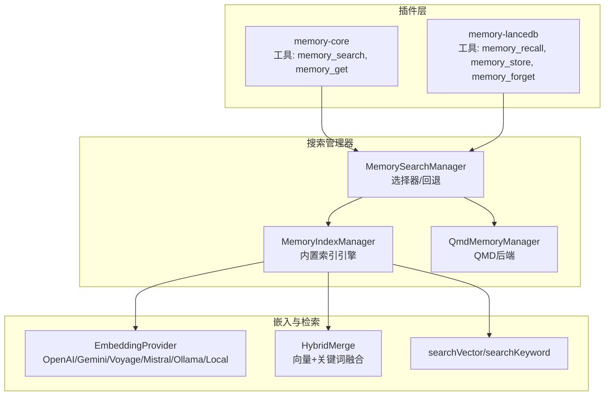
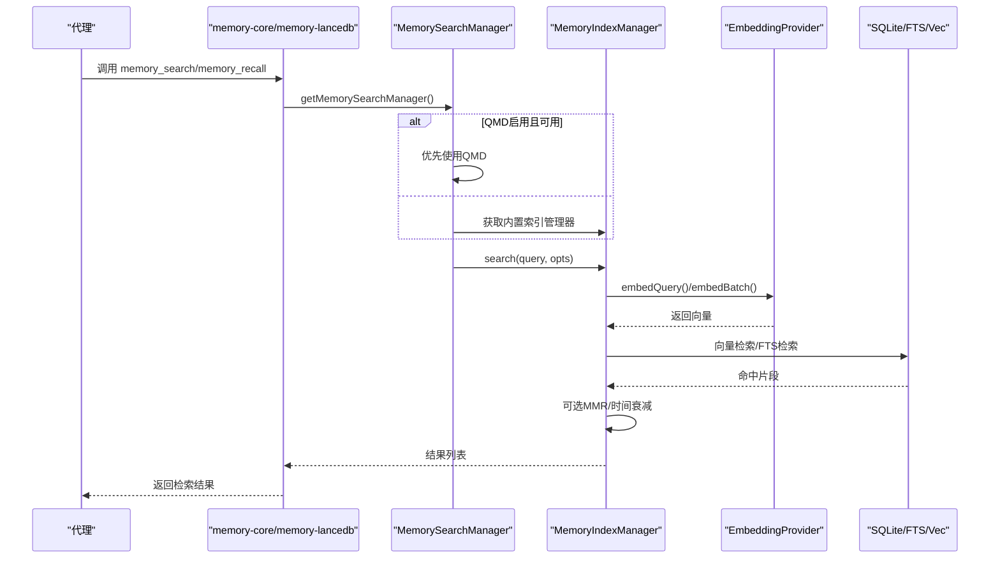
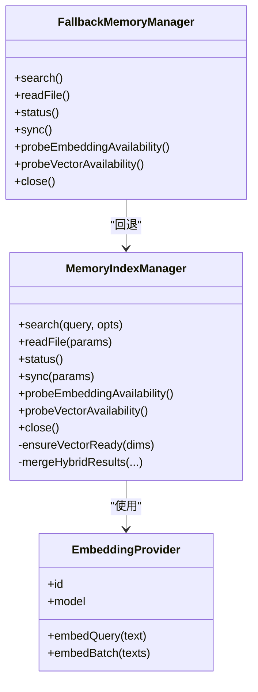
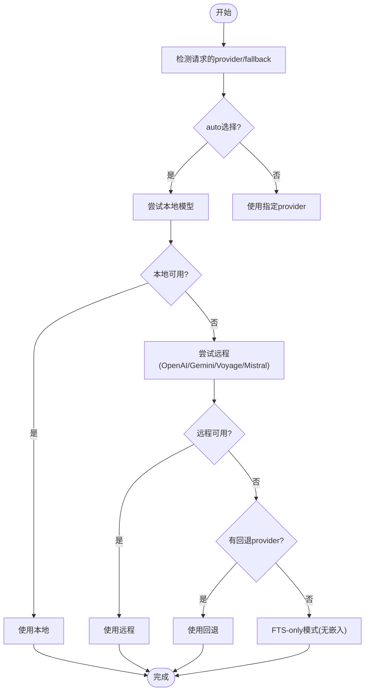
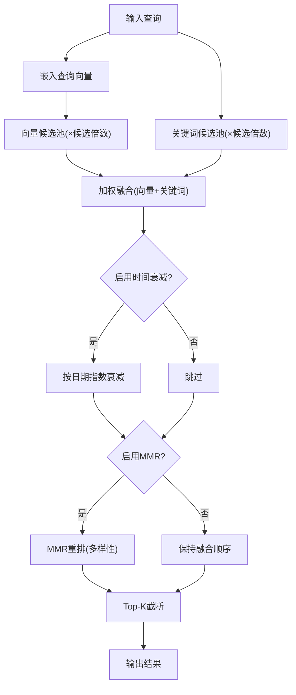
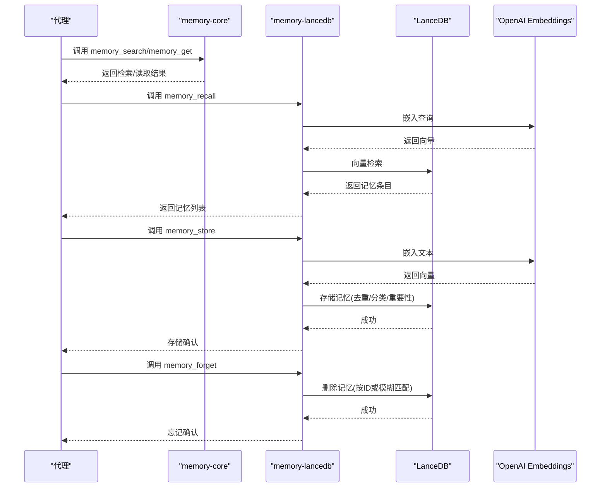
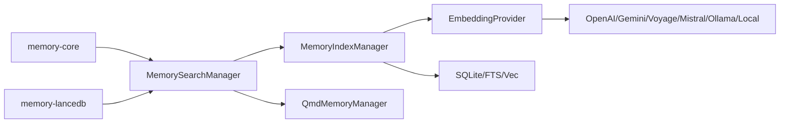

# 代理记忆系统

<cite>
**本文引用的文件**
- [docs/concepts/memory.md](file://docs/concepts/memory.md)
- [src/memory/index.ts](file://src/memory/index.ts)
- [src/memory/manager.ts](file://src/memory/manager.ts)
- [src/memory/search-manager.ts](file://src/memory/search-manager.ts)
- [src/memory/types.ts](file://src/memory/types.ts)
- [src/memory/backend-config.ts](file://src/memory/backend-config.ts)
- [src/memory/embeddings.ts](file://src/memory/embeddings.ts)
- [src/memory/hybrid.ts](file://src/memory/hybrid.ts)
- [src/memory/manager-search.ts](file://src/memory/manager-search.ts)
- [src/memory/manager-embedding-ops.ts](file://src/memory/manager-embedding-ops.ts)
- [extensions/memory-core/index.ts](file://extensions/memory-core/index.ts)
- [extensions/memory-lancedb/index.ts](file://extensions/memory-lancedb/index.ts)
</cite>

## 目录

1. [简介](#简介)
2. [项目结构](#项目结构)
3. [核心组件](#核心组件)
4. [架构总览](#架构总览)
5. [详细组件分析](#详细组件分析)
6. [依赖关系分析](#依赖关系分析)
7. [性能考量](#性能考量)
8. [故障排查指南](#故障排查指南)
9. [结论](#结论)
10. [附录](#附录)

## 简介

本文件面向OpenClaw代理记忆系统，系统性阐述其架构设计、数据存储与检索机制、上下文窗口管理、记忆压缩与信息提取策略、长期记忆与短期记忆的区分与访问模式、更新机制与过期策略、清理规则、优化配置与容量管理、监控指标与故障诊断、以及在实际应用中的使用场景与效果评估。目标是帮助开发者与运营人员以统一视角理解并高效运维该记忆子系统。

## 项目结构

OpenClaw记忆系统由“内置索引引擎（builtin）”与“外部后端（如QMD）”两套搜索管理器构成，并通过插件扩展提供不同记忆能力：

- 内置管理器：基于SQLite + 向量加速（可选）+ FTS（BM25）+ 嵌入缓存，支持混合检索、MMR多样性重排与时间衰减。
- 外部后端：QMD侧车（实验性），通过命令行与本地进程提供BM25+向量+重排序的检索能力。
- 插件层：memory-core提供文件级记忆工具（memory_search/memory_get）；memory-lancedb提供长程记忆（LanceDB）+自动召回/捕获。

图示来源

- [src/memory/search-manager.ts:25-86](file://src/memory/search-manager.ts#L25-L86)
- [src/memory/manager.ts:61-238](file://src/memory/manager.ts#L61-L238)
- [src/memory/hybrid.ts:57-155](file://src/memory/hybrid.ts#L57-L155)
- [src/memory/manager-search.ts:20-192](file://src/memory/manager-search.ts#L20-L192)
- [src/memory/embeddings.ts:166-286](file://src/memory/embeddings.ts#L166-L286)
- [extensions/memory-core/index.ts:10-35](file://extensions/memory-core/index.ts#L10-L35)
- [extensions/memory-lancedb/index.ts:292-679](file://extensions/memory-lancedb/index.ts#L292-L679)

章节来源

- [src/memory/index.ts:1-12](file://src/memory/index.ts#L1-L12)
- [src/memory/search-manager.ts:25-86](file://src/memory/search-manager.ts#L25-L86)
- [src/memory/manager.ts:61-238](file://src/memory/manager.ts#L61-L238)
- [src/memory/backend-config.ts:297-354](file://src/memory/backend-config.ts#L297-L354)

## 核心组件

- 搜索管理器选择与回退
  - 根据配置选择QMD或内置引擎；若QMD失败则回退到内置索引。
- 内置索引引擎（MemoryIndexManager）
  - 负责SQLite数据库初始化、表结构、文件监听与增量同步、向量/FTS可用性探测、嵌入缓存、批处理与重试、只读恢复等。
  - 提供search/readFile/status/sync/probe等接口。
- 嵌入提供者（EmbeddingProvider）
  - 支持OpenAI、Gemini、Voyage、Mistral、Ollama、Local（node-llama-cpp）。
  - 自动/回退策略、批量嵌入（OpenAI/Gemini/Voyage）、超时与重试、缓存键计算。
- 混合检索与后处理
  - 向量相似度 + BM25关键词匹配融合，支持MMR去重与时间衰减。
- 工具与CLI
  - memory-core：memory_search（语义检索）、memory_get（精确读取）。
  - memory-lancedb：memory_recall（检索）、memory_store（存储）、memory_forget（删除）。
- 配置解析
  - 解析memory.backend、citations、QMD集合与更新策略、会话索引开关等。

章节来源

- [src/memory/types.ts:61-81](file://src/memory/types.ts#L61-L81)
- [src/memory/manager.ts:61-238](file://src/memory/manager.ts#L61-L238)
- [src/memory/embeddings.ts:166-286](file://src/memory/embeddings.ts#L166-L286)
- [src/memory/hybrid.ts:57-155](file://src/memory/hybrid.ts#L57-L155)
- [src/memory/backend-config.ts:297-354](file://src/memory/backend-config.ts#L297-L354)
- [extensions/memory-core/index.ts:10-35](file://extensions/memory-core/index.ts#L10-L35)
- [extensions/memory-lancedb/index.ts:292-679](file://extensions/memory-lancedb/index.ts#L292-L679)

## 架构总览

记忆系统采用“插件注册 + 管理器选择 + 搜索执行”的分层架构：

- 插件层负责注册工具与CLI命令；
- 管理器选择器根据配置决定使用QMD还是内置索引；
- 内置索引在查询时按需触发同步，支持向量/FTS双通道检索与混合融合；
- 嵌入提供者负责文本向量化，支持批量与缓存；
- 后处理阶段可选地进行MMR与时间衰减，提升结果多样性与时效性。

图示来源

- [src/memory/search-manager.ts:25-86](file://src/memory/search-manager.ts#L25-L86)
- [src/memory/manager.ts:256-364](file://src/memory/manager.ts#L256-L364)
- [src/memory/manager-search.ts:20-192](file://src/memory/manager-search.ts#L20-L192)
- [src/memory/embeddings.ts:166-286](file://src/memory/embeddings.ts#L166-L286)

## 详细组件分析

### 组件A：内置索引引擎（MemoryIndexManager）

- 数据模型与存储
  - SQLite数据库，包含chunks、chunks_vec、chunks_fts、files、embedding_cache等表。
  - 向量表使用sqlite-vec扩展时，通过虚拟表vec0进行cosine距离查询；否则在JS侧计算余弦相似度。
  - FTS5用于BM25关键词检索。
  - 嵌入缓存表避免重复计算，支持按provider/model/provider_key/hash索引。
- 同步与增量
  - 文件系统监听（chokidar）与会话增量监听，异步触发同步。
  - 支持“按搜索触发”“按会话开始触发”“定时器触发”等策略。
  - 只读数据库错误具备自动恢复能力：重建连接、重置状态、重新加载元数据。
- 检索流程
  - 查询前确保向量可用；若FTS不可用则降级为向量检索。
  - 混合检索：向量池×候选倍数 + 关键词池×候选倍数，合并后归一化权重，再可选MMR与时间衰减。
  - 结果截断与片段长度控制。
- 批处理与重试
  - OpenAI/Gemini/Voyage批量嵌入，带并发与轮询、超时与重试。
  - 批处理失败达到阈值将禁用批量模式并回退到逐条嵌入。
- 安全与一致性
  - 读取文件路径白名单校验，仅允许工作区内的memory相关路径。
  - 唯一ID生成与冲突更新策略，保证索引一致性。

图示来源

- [src/memory/manager.ts:61-238](file://src/memory/manager.ts#L61-L238)
- [src/memory/embeddings.ts:32-60](file://src/memory/embeddings.ts#L32-L60)
- [src/memory/search-manager.ts:104-246](file://src/memory/search-manager.ts#L104-L246)

章节来源

- [src/memory/manager.ts:61-238](file://src/memory/manager.ts#L61-L238)
- [src/memory/manager.ts:451-551](file://src/memory/manager.ts#L451-L551)
- [src/memory/manager.ts:553-624](file://src/memory/manager.ts#L553-L624)
- [src/memory/manager.ts:626-738](file://src/memory/manager.ts#L626-L738)
- [src/memory/manager-search.ts:20-192](file://src/memory/manager-search.ts#L20-L192)
- [src/memory/hybrid.ts:57-155](file://src/memory/hybrid.ts#L57-L155)
- [src/memory/manager-embedding-ops.ts:49-205](file://src/memory/manager-embedding-ops.ts#L49-L205)

### 组件B：嵌入提供者与批处理（EmbeddingProvider）

- 自动选择与回退
  - 当provider为"auto"时，优先尝试本地模型，其次远程OpenAI/Gemini/Voyage/Mistral；若均缺API Key则进入FTS-only模式。
  - 主/备提供者均失败且均为认证错误时，返回null provider并提示原因。
- 批量嵌入
  - OpenAI/Gemini/Voyage支持批量作业，自动构建请求、并发调度、轮询等待、超时与重试。
  - 批处理失败计数达到阈值后禁用批量模式并回退。
- 缓存与键值
  - 嵌入缓存按provider/model/provider_key/hash组织，定期裁剪至最大条目限制。
  - providerKey综合考虑baseUrl/headers/model等，确保变更时触发重索引。
- 超时与重试
  - 查询与批量分别设置本地/远程超时阈值；对速率限制类错误指数退避重试。

图示来源

- [src/memory/embeddings.ts:166-286](file://src/memory/embeddings.ts#L166-L286)
- [src/memory/manager-embedding-ops.ts:495-532](file://src/memory/manager-embedding-ops.ts#L495-L532)
- [src/memory/manager-embedding-ops.ts:607-687](file://src/memory/manager-embedding-ops.ts#L607-L687)

章节来源

- [src/memory/embeddings.ts:166-286](file://src/memory/embeddings.ts#L166-L286)
- [src/memory/manager-embedding-ops.ts:49-205](file://src/memory/manager-embedding-ops.ts#L49-L205)
- [src/memory/manager-embedding-ops.ts:495-532](file://src/memory/manager-embedding-ops.ts#L495-L532)
- [src/memory/manager-embedding-ops.ts:607-687](file://src/memory/manager-embedding-ops.ts#L607-L687)

### 组件C：混合检索与后处理（Hybrid + MMR + 时间衰减）

- 向量检索
  - 使用cosine距离或sqlite-vec虚拟表；结果按相似度排序。
- 关键词检索（FTS5 BM25）
  - 将查询分词并构造AND条件；按BM25 rank转换为0~1分数。
- 融合策略
  - 合并向量与关键词结果，加权求和；默认权重归一化。
- 后处理
  - MMR：最大化边际相关性，减少近似重复；lambda控制相关性与多样性的平衡。
  - 时间衰减：按天数指数衰减，新内容保持高分，旧内容自然降低。
- 配置
  - 可独立开启MMR或时间衰减；候选倍数、最大结果数、最小分数等均可调。

图示来源

- [src/memory/hybrid.ts:57-155](file://src/memory/hybrid.ts#L57-L155)
- [src/memory/manager-search.ts:20-94](file://src/memory/manager-search.ts#L20-L94)
- [src/memory/manager-search.ts:136-192](file://src/memory/manager-search.ts#L136-L192)

章节来源

- [src/memory/hybrid.ts:57-155](file://src/memory/hybrid.ts#L57-L155)
- [src/memory/manager-search.ts:20-192](file://src/memory/manager-search.ts#L20-L192)

### 组件D：工具与CLI（memory-core 与 memory-lancedb）

- memory-core
  - 注册memory_search与memory_get工具；CLI提供memory子命令。
  - memory_search：语义检索，返回片段、路径、行号范围、得分。
  - memory_get：精确读取Markdown文件，支持起始行与行数切片。
- memory-lancedb
  - 注册memory_recall、memory_store、memory_forget工具。
  - 生命周期钩子：before_agent_start自动注入相关记忆上下文；agent_end自动捕获用户输入中的偏好/决策/实体等。
  - CLI提供ltm list/search/stats命令。
  - 规则过滤与类别识别，避免注入与噪声；支持GDPR式遗忘。

图示来源

- [extensions/memory-core/index.ts:10-35](file://extensions/memory-core/index.ts#L10-L35)
- [extensions/memory-lancedb/index.ts:292-679](file://extensions/memory-lancedb/index.ts#L292-L679)

章节来源

- [extensions/memory-core/index.ts:10-35](file://extensions/memory-core/index.ts#L10-L35)
- [extensions/memory-lancedb/index.ts:292-679](file://extensions/memory-lancedb/index.ts#L292-L679)

### 组件E：配置与后端选择（backend-config）

- 后端选择
  - memory.backend可为"builtin"或"qmd"；默认builtin。
  - QMD启用时，解析collections（默认工作区MEMORY.md与memory/\*_/_.md，可追加自定义路径）、更新周期、搜索模式、会话索引、限制参数、作用域策略等。
- 引用与作用域
  - citations支持auto/on/off；scope控制在群聊/频道中的可见性。
- QMD缓存键
  - 基于配置稳定序列化生成缓存键，避免重复实例化。

章节来源

- [src/memory/backend-config.ts:297-354](file://src/memory/backend-config.ts#L297-L354)

## 依赖关系分析

- 组件耦合
  - MemoryIndexManager依赖EmbeddingProvider、SQLite、FTS5、sqlite-vec（可选）。
  - FallbackMemoryManager包装QMD与内置索引，实现失败回退。
  - memory-core与memory-lancedb作为插件，通过OpenClaw插件API注册工具与CLI。
- 外部依赖
  - OpenAI/Gemini/Voyage/Mistral/Ollama/Local嵌入服务；node-llama-cpp本地模型；sqlite-vec扩展；QMD侧车（可选）。
- 循环依赖
  - 管理器与提供者之间为单向依赖，未见循环导入。

图示来源

- [src/memory/search-manager.ts:25-86](file://src/memory/search-manager.ts#L25-L86)
- [src/memory/manager.ts:61-238](file://src/memory/manager.ts#L61-L238)
- [src/memory/embeddings.ts:166-286](file://src/memory/embeddings.ts#L166-L286)

章节来源

- [src/memory/search-manager.ts:25-86](file://src/memory/search-manager.ts#L25-L86)
- [src/memory/manager.ts:61-238](file://src/memory/manager.ts#L61-L238)
- [src/memory/embeddings.ts:166-286](file://src/memory/embeddings.ts#L166-L286)

## 性能考量

- 向量检索加速
  - sqlite-vec启用时使用虚拟表vec0进行cosine距离查询；未启用时在JS侧计算，适合小规模或资源受限环境。
- 批量嵌入
  - OpenAI/Gemini/Voyage支持批量作业，显著降低API往返与成本；失败阈值触发禁用并回退。
- 嵌入缓存
  - 基于provider/model/provider_key/hash的缓存，定期裁剪至maxEntries上限，减少重复计算。
- 增量同步
  - chokidar监听与会话增量阈值触发，避免全量扫描；debounce降低频繁写入导致的抖动。
- 检索参数
  - 候选倍数、最大结果数、最小分数、MMR与时间衰减可调，平衡召回与精度。
- 超时与重试
  - 查询与批量分别设置本地/远程超时；对速率限制类错误进行指数退避重试。

章节来源

- [src/memory/manager.ts:689-738](file://src/memory/manager.ts#L689-L738)
- [src/memory/manager-embedding-ops.ts:49-205](file://src/memory/manager-embedding-ops.ts#L49-L205)
- [src/memory/manager-embedding-ops.ts:495-532](file://src/memory/manager-embedding-ops.ts#L495-L532)
- [src/memory/manager-embedding-ops.ts:607-687](file://src/memory/manager-embedding-ops.ts#L607-L687)
- [src/memory/hybrid.ts:57-155](file://src/memory/hybrid.ts#L57-L155)

## 故障排查指南

- 常见问题与定位
  - 无嵌入提供者：当所有远程API Key缺失且未启用本地模型时，系统进入FTS-only模式，仅支持关键词检索。
  - sqlite-vec加载失败：日志记录loadError，自动回退到JS侧相似度计算。
  - 只读数据库：检测到SQLITE_READONLY时自动重建连接并重置状态。
  - 批量嵌入失败：超过失败阈值后禁用批量模式并回退；记录lastError与lastProvider便于诊断。
  - QMD不可用：子进程退出或JSON解析失败时回退到内置索引。
- 诊断命令与指标
  - status()返回files/chunks/dirty、provider/model、sources、cache、fts、vector、batch、custom等信息。
  - memory-core CLI提供memory子命令；memory-lancedb CLI提供ltm list/search/stats。
- 恢复建议
  - 检查API Key与网络连通性；调整批量并发与轮询间隔；必要时禁用批量模式。
  - 若sqlite-vec不可用，可安装扩展或保持JS回退路径运行。
  - 对于QMD，检查二进制是否在PATH、SQLite扩展是否可用、XDG目录权限。

章节来源

- [src/memory/manager.ts:468-551](file://src/memory/manager.ts#L468-L551)
- [src/memory/manager.ts:626-738](file://src/memory/manager.ts#L626-L738)
- [src/memory/search-manager.ts:104-246](file://src/memory/search-manager.ts#L104-L246)
- [src/memory/embeddings.ts:288-323](file://src/memory/embeddings.ts#L288-L323)

## 结论

OpenClaw记忆系统通过“插件化工具 + 智能管理器选择 + 内置/外部双引擎 + 深度可调的检索后处理”，实现了从短期上下文到长期记忆的全栈覆盖。内置索引引擎在FTS+向量+缓存+批处理的协同下，兼顾性能与成本；QMD后端提供更丰富的检索体验；memory-lancedb为长程记忆提供自动召回/捕获与GDPR式遗忘能力。通过完善的监控、回退与恢复机制，系统在复杂生产环境中具备良好的稳定性与可维护性。

## 附录

### A. 上下文窗口管理与记忆压缩

- 记忆文件布局
  - 短期：memory/YYYY-MM-DD.md（按日记录，append-only），默认读取今日+昨日。
  - 长期：MEMORY.md（可选，仅主私会话加载）。
- 自动记忆刷新（预压缩提醒）
  - 在会话接近自动压缩时触发静默代理回合，提醒模型在上下文被压缩前持久化记忆。
- 记忆压缩与信息提取
  - 通过规则过滤与类别识别，自动从对话中抽取偏好、决策、实体等信息；支持正则与prompt注入防护。
- 过期策略与清理
  - 时间衰减按日指数衰减，新内容优先；嵌入缓存定期裁剪；sqlite-vec不可用时回退。

章节来源

- [docs/concepts/memory.md:17-91](file://docs/concepts/memory.md#L17-L91)
- [docs/concepts/memory.md:92-374](file://docs/concepts/memory.md#L92-L374)
- [docs/concepts/memory.md:375-741](file://docs/concepts/memory.md#L375-L741)
- [extensions/memory-lancedb/index.ts:192-286](file://extensions/memory-lancedb/index.ts#L192-L286)
- [extensions/memory-lancedb/index.ts:546-658](file://extensions/memory-lancedb/index.ts#L546-L658)

### B. 配置要点与优化建议

- 搜索配置
  - provider/fallback/model/remote/local；cache.enabled/maxEntries；query.hybrid.vectorWeight/textWeight/candidateMultiplier/mmr/temporalDecay。
- QMD配置
  - backend=qmd；includeDefaultMemory/paths；update.interval/debounceMs/onBoot/waitForBootSync/embedInterval；limits.maxResults/maxSnippetChars/maxInjectedChars/timeoutMs；scope（会话发送策略）。
- 批量嵌入
  - remote.batch.enabled/concurrency/pollIntervalMs/timeoutMinutes；失败阈值触发禁用。
- 向量加速
  - store.vector.enabled/extensionPath；未启用时自动回退JS相似度。

章节来源

- [docs/concepts/memory.md:92-374](file://docs/concepts/memory.md#L92-L374)
- [src/memory/backend-config.ts:297-354](file://src/memory/backend-config.ts#L297-L354)
- [src/memory/manager-embedding-ops.ts:49-205](file://src/memory/manager-embedding-ops.ts#L49-L205)

### C. 实际应用场景与效果评估

- 场景
  - 日常笔记与偏好记忆：短期记忆每日沉淀，长期记忆保存重要事实与决策。
  - 会话上下文增强：自动召回相关历史偏好与决策，提升一致性与个性化。
  - 会话转录索引：可选地将近期对话转录纳入检索，辅助复盘与知识沉淀。
- 评估维度
  - 召回率与精度：通过混合检索与后处理提升。
  - 时效性：时间衰减确保新信息优先。
  - 成本与延迟：批量嵌入与缓存降低API开销与响应时间。
  - 可靠性：回退与恢复机制保障服务连续性。

章节来源

- [docs/concepts/memory.md:375-741](file://docs/concepts/memory.md#L375-L741)
- [src/memory/hybrid.ts:57-155](file://src/memory/hybrid.ts#L57-L155)
- [src/memory/manager-embedding-ops.ts:495-532](file://src/memory/manager-embedding-ops.ts#L495-L532)
