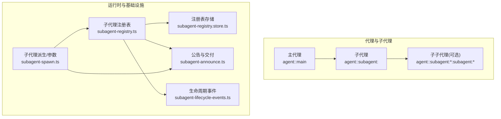
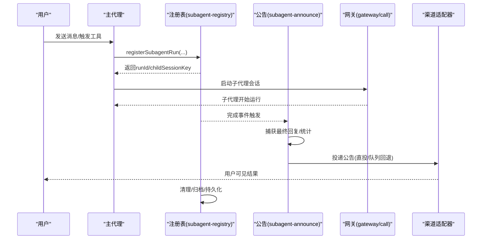
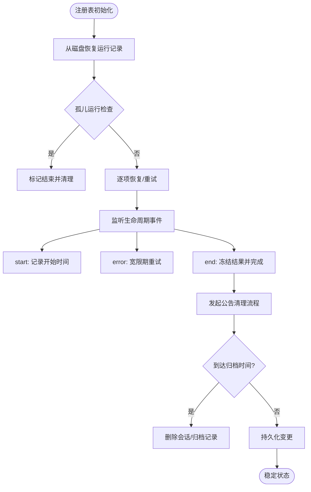
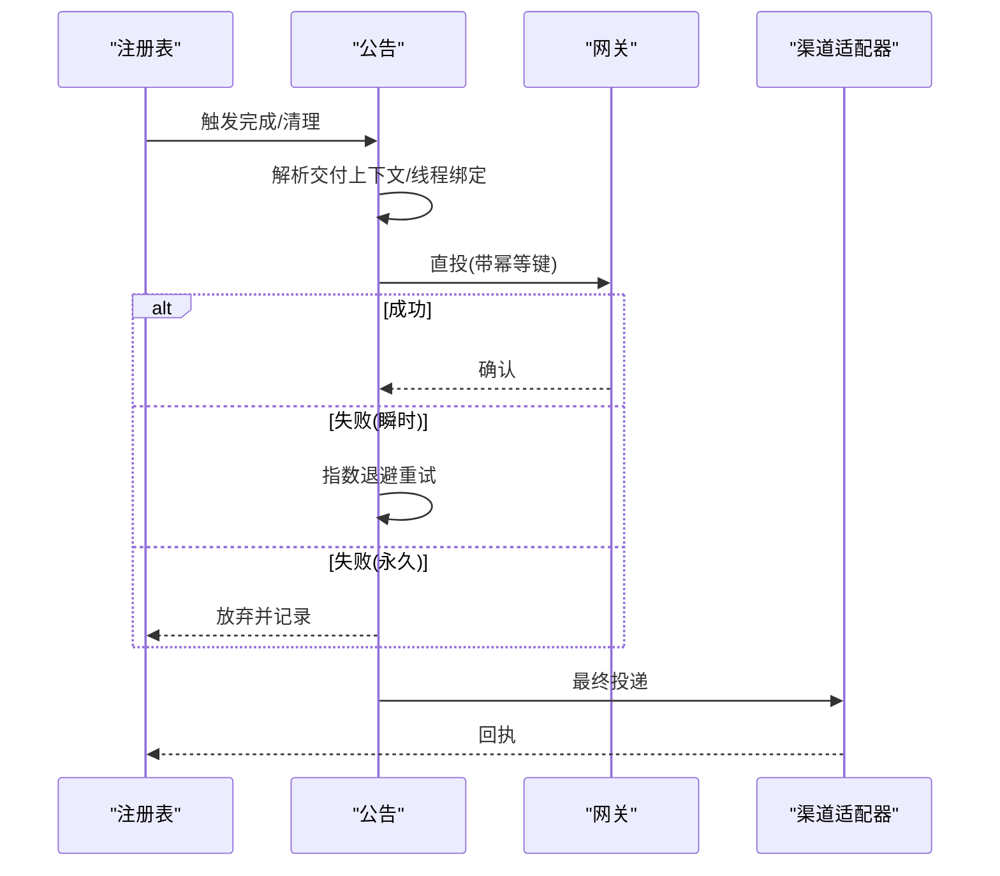
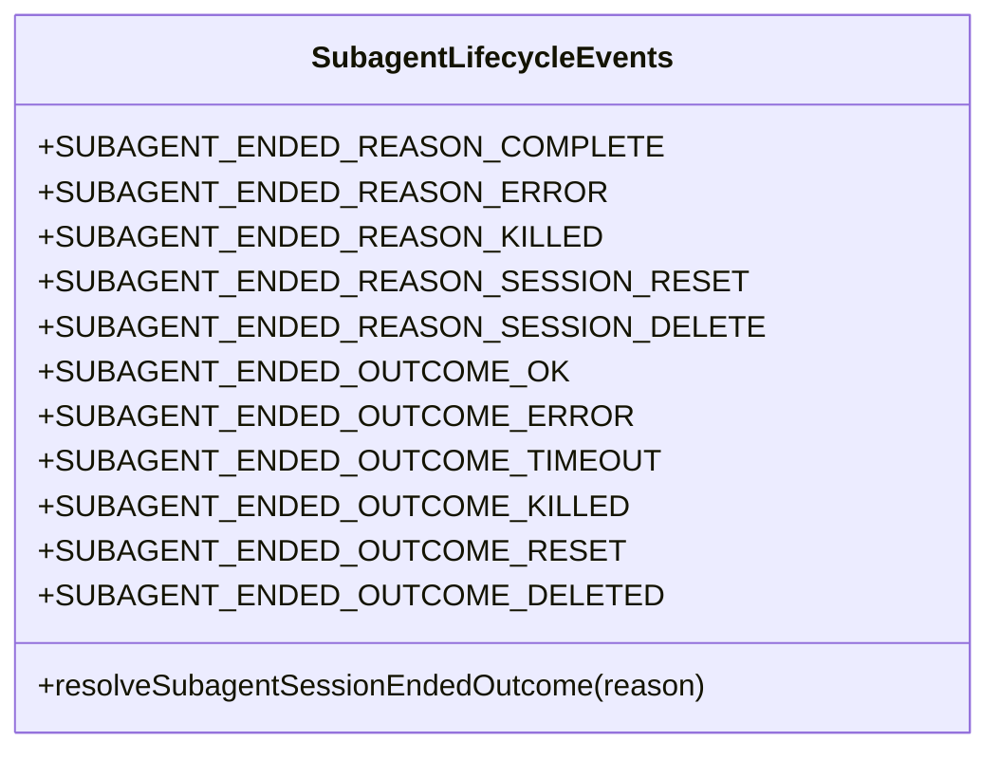
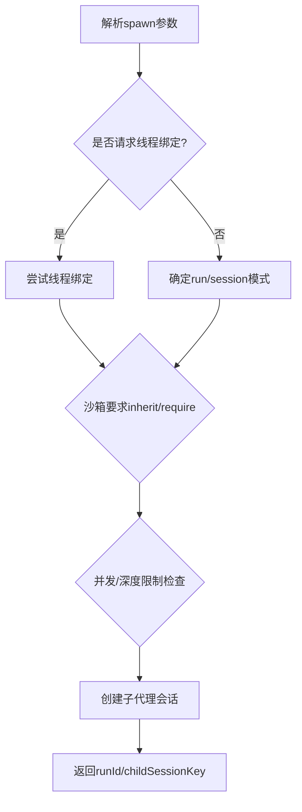
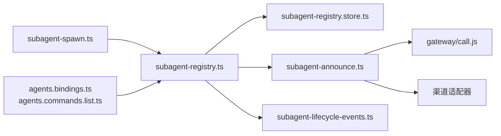

# 多代理协作

<cite>
**本文引用的文件**
- [src/agents/subagent-registry.ts](file://src/agents/subagent-registry.ts)
- [src/agents/subagent-registry.types.ts](file://src/agents/subagent-registry.types.ts)
- [src/agents/subagent-announce.ts](file://src/agents/subagent-announce.ts)
- [src/agents/subagent-lifecycle-events.ts](file://src/agents/subagent-lifecycle-events.ts)
- [src/agents/subagent-spawn.ts](file://src/agents/subagent-spawn.ts)
- [src/agents/subagent-registry.store.ts](file://src/agents/subagent-registry.store.ts)
- [src/agents/subagent-registry.nested.e2e.test.ts](file://src/agents/subagent-registry.nested.e2e.test.ts)
- [src/agents/subagent-registry.archive.e2e.test.ts](file://src/agents/subagent-registry.archive.e2e.test.ts)
- [src/agents/subagent-registry.lifecycle-retry-grace.e2e.test.ts](file://src/agents/subagent-registry.lifecycle-retry-grace.e2e.test.ts)
- [docs/tools/subagents.md](file://docs/tools/subagents.md)
- [docs/concepts/multi-agent.md](file://docs/concepts/multi-agent.md)
- [apps/macos/Sources/OpenClaw/AgentEventStore.swift](file://apps/macos/Sources/OpenClaw/AgentEventStore.swift)
- [src/commands/agents.bindings.ts](file://src/commands/agents.bindings.ts)
- [src/commands/agents.commands.list.ts](file://src/commands/agents.commands.list.ts)
- [src/commands/agents.commands.bind.ts](file://src/commands/agents.commands.bind.ts)
- [src/commands/agents.ts](file://src/commands/agents.ts)
</cite>

## 目录

1. [引言](#引言)
2. [项目结构](#项目结构)
3. [核心组件](#核心组件)
4. [架构总览](#架构总览)
5. [详细组件分析](#详细组件分析)
6. [依赖关系分析](#依赖关系分析)
7. [性能考量](#性能考量)
8. [故障排查指南](#故障排查指南)
9. [结论](#结论)
10. [附录](#附录)

## 引言

本文件面向OpenClaw多代理协作系统，系统性阐述多代理架构的设计理念、主代理与子代理的关系与职责分工、代理注册表的管理与生命周期控制、任务分配与资源协调、冲突解决机制，并提供最佳实践、性能优化与故障处理方案，以及部署、监控与调试指南。文中所有技术细节均基于仓库源码与官方文档进行归纳总结。

## 项目结构

OpenClaw在“代理”层面支持单人多脑（多agent）与通道账号隔离路由；在“子代理”层面支持后台并行工作流与结果回传。核心实现集中在src/agents目录，配套CLI命令用于代理与绑定管理，文档位于docs目录。

图示来源

- [src/agents/subagent-registry.ts:65-137](file://src/agents/subagent-registry.ts#L65-L137)
- [src/agents/subagent-registry.store.ts:48-85](file://src/agents/subagent-registry.store.ts#L48-L85)
- [src/agents/subagent-announce.ts:1-200](file://src/agents/subagent-announce.ts#L1-L200)
- [src/agents/subagent-lifecycle-events.ts:1-48](file://src/agents/subagent-lifecycle-events.ts#L1-L48)
- [src/agents/subagent-spawn.ts:1-200](file://src/agents/subagent-spawn.ts#L1-L200)

章节来源

- [docs/concepts/multi-agent.md:10-553](file://docs/concepts/multi-agent.md#L10-L553)
- [docs/tools/subagents.md:1-296](file://docs/tools/subagents.md#L1-L296)

## 核心组件

- 子代理注册表：维护子代理运行记录、生命周期状态、重试与清理流程、归档策略与持久化。
- 公告与交付：负责子代理完成后的结果回传、失败重试、线程绑定与渠道路由。
- 生命周期事件：定义子代理结束原因与结果类型，驱动后续清理与钩子触发。
- 子代理派生：解析spawn参数、线程绑定、沙箱约束、并发与深度限制。
- 注册表存储：磁盘序列化/反序列化，版本兼容与迁移。
- CLI与绑定：代理与绑定的增删查改、路由规则可视化与校验。

章节来源

- [src/agents/subagent-registry.ts:65-137](file://src/agents/subagent-registry.ts#L65-L137)
- [src/agents/subagent-announce.ts:1-200](file://src/agents/subagent-announce.ts#L1-L200)
- [src/agents/subagent-lifecycle-events.ts:1-48](file://src/agents/subagent-lifecycle-events.ts#L1-L48)
- [src/agents/subagent-spawn.ts:1-200](file://src/agents/subagent-spawn.ts#L1-L200)
- [src/agents/subagent-registry.store.ts:48-85](file://src/agents/subagent-registry.store.ts#L48-L85)
- [src/commands/agents.bindings.ts:161-175](file://src/commands/agents.bindings.ts#L161-L175)
- [src/commands/agents.commands.list.ts:75-127](file://src/commands/agents.commands.list.ts#L75-L127)
- [src/commands/agents.commands.bind.ts:53-91](file://src/commands/agents.commands.bind.ts#L53-L91)

## 架构总览

OpenClaw通过“主代理-子代理-公告-注册表”的闭环实现多代理协作：

- 主代理接收请求，必要时派生子代理执行后台任务；
- 子代理在独立会话中运行，完成后通过公告步骤回传摘要；
- 注册表跟踪每个子代理的生命周期、结果冻结、重试与清理；
- 渠道适配器负责最终投递，支持线程绑定与队列回退；
- CLI与绑定系统确保入站消息按规则路由到正确代理。

图示来源

- [src/agents/subagent-registry.ts:451-530](file://src/agents/subagent-registry.ts#L451-L530)
- [src/agents/subagent-announce.ts:161-187](file://src/agents/subagent-announce.ts#L161-L187)
- [src/agents/subagent-spawn.ts:134-154](file://src/agents/subagent-spawn.ts#L134-L154)

## 详细组件分析

### 子代理注册表与生命周期

- 运行记录结构：包含runId、子会话键、请求者信息、任务描述、模型/思考级别、超时、模式、归档时间、清理状态、重试计数、冻结结果等。
- 生命周期管理：监听agent事件流，处理start/error/end阶段；对错误采用宽限期重试，避免瞬态失败导致过早终结；完成时冻结最终结果文本，供公告使用。
- 清理与回收：支持“announce清理流程”，在公告完成后执行；全局定时清扫器按配置分钟数归档并删除会话与附件；孤儿运行（缺失会话或会话ID）被识别并清理。
- 持久化：启动时从磁盘恢复，变更后写回；支持版本兼容与迁移。

图示来源

- [src/agents/subagent-registry.ts:648-751](file://src/agents/subagent-registry.ts#L648-L751)
- [src/agents/subagent-registry.types.ts:6-58](file://src/agents/subagent-registry.types.ts#L6-L58)
- [src/agents/subagent-registry.store.ts:48-85](file://src/agents/subagent-registry.store.ts#L48-L85)

章节来源

- [src/agents/subagent-registry.ts:65-137](file://src/agents/subagent-registry.ts#L65-L137)
- [src/agents/subagent-registry.ts:227-250](file://src/agents/subagent-registry.ts#L227-L250)
- [src/agents/subagent-registry.ts:451-530](file://src/agents/subagent-registry.ts#L451-L530)
- [src/agents/subagent-registry.ts:714-751](file://src/agents/subagent-registry.ts#L714-L751)
- [src/agents/subagent-registry.store.ts:48-85](file://src/agents/subagent-registry.store.ts#L48-L85)

### 公告与交付

- 交付策略：优先直投agent，失败则队列路由；对瞬时错误进行指数退避重试；对永久性错误（如未知渠道、用户屏蔽）直接放弃。
- 线程绑定：在支持的渠道上，子代理可绑定线程以便后续消息继续路由到同一会话；请求者深度不同决定交付方式（外部直投或内部注入）。
- 结果合成：嵌套场景下，上层代理可聚合子代理结果并以常规助理语气呈现给用户。
- 超时与安全：公告超时可配置，最大安全超时上限保障；幂等键与队列项避免重复投递。

图示来源

- [src/agents/subagent-announce.ts:161-187](file://src/agents/subagent-announce.ts#L161-L187)
- [src/agents/subagent-announce.ts:103-134](file://src/agents/subagent-announce.ts#L103-L134)
- [src/agents/subagent-announce.ts:74-80](file://src/agents/subagent-announce.ts#L74-L80)

章节来源

- [src/agents/subagent-announce.ts:1-200](file://src/agents/subagent-announce.ts#L1-L200)
- [docs/tools/subagents.md:212-240](file://docs/tools/subagents.md#L212-L240)

### 生命周期事件与结束原因

- 结束原因：完成、错误、被杀、会话重置/删除等。
- 结果映射：根据结束原因映射为“ok/timeout/killed/reset/deleted”等结果类型，驱动后续钩子与清理。
- 钩子触发：仅在需要时发出“子代理结束”钩子，避免重复触发；支持抑制（如被杀或重启）。

图示来源

- [src/agents/subagent-lifecycle-events.ts:1-48](file://src/agents/subagent-lifecycle-events.ts#L1-L48)

章节来源

- [src/agents/subagent-lifecycle-events.ts:1-48](file://src/agents/subagent-lifecycle-events.ts#L1-L48)

### 子代理派生与参数

- 参数解析：任务、标签、目标代理、模型/思考级别、运行超时、线程绑定、模式（run/session）、清理策略、沙箱要求、附件等。
- 线程绑定：当请求thread=true且存在对应插件钩子时，自动创建或绑定线程；否则按默认模式运行。
- 并发与深度：受agents.defaults.subagents.maxConcurrent与maxSpawnDepth限制；深度2支持“编排者-工作者”模式。
- 工具策略：默认允许除会话工具外的工具集；深度2禁止sessions_spawn，防止无限分叉。

图示来源

- [src/agents/subagent-spawn.ts:47-101](file://src/agents/subagent-spawn.ts#L47-L101)
- [src/agents/subagent-spawn.ts:156-165](file://src/agents/subagent-spawn.ts#L156-L165)
- [src/agents/subagent-spawn.ts:177-200](file://src/agents/subagent-spawn.ts#L177-L200)
- [docs/tools/subagents.md:144-201](file://docs/tools/subagents.md#L144-L201)

章节来源

- [src/agents/subagent-spawn.ts:1-200](file://src/agents/subagent-spawn.ts#L1-L200)
- [docs/tools/subagents.md:144-201](file://docs/tools/subagents.md#L144-L201)

### 代理注册表存储与版本迁移

- 序列化格式：版本1/2，包含runs字典与版本号；旧字段映射到新字段（如cleanupCompletedAt、cleanupHandled）。
- 加载/保存：读取JSON文件，校验结构与版本；保存时写入当前版本。
- 迁移：兼容旧格式字段，缺失字段采用默认值或从其他字段推导。

章节来源

- [src/agents/subagent-registry.store.ts:48-85](file://src/agents/subagent-registry.store.ts#L48-L85)

### 绑定与多代理路由

- 绑定匹配：按peer/parentPeer/guildId/teamId/accountId等字段匹配，最具体规则优先；未指定accountId默认仅匹配默认账户。
- 多账号/号码：同一通道支持多个accountId，分别路由至不同代理；可通过allowlist控制访问。
- CLI管理：支持添加/删除/列出代理与绑定，输出路由汇总与提供商状态。

章节来源

- [docs/concepts/multi-agent.md:172-216](file://docs/concepts/multi-agent.md#L172-L216)
- [src/commands/agents.bindings.ts:161-175](file://src/commands/agents.bindings.ts#L161-L175)
- [src/commands/agents.commands.list.ts:75-127](file://src/commands/agents.commands.list.ts#L75-L127)
- [src/commands/agents.commands.bind.ts:53-91](file://src/commands/agents.commands.bind.ts#L53-L91)
- [src/commands/agents.ts:1-8](file://src/commands/agents.ts#L1-L8)

## 依赖关系分析

- 组件耦合
  - 注册表与公告：强耦合（完成即公告），弱耦合于网关调用与渠道适配器。
  - 注册表与生命周期事件：通过事件流解耦，便于扩展新的结束原因与结果。
  - 派生模块与注册表：派生时写入记录，后续由注册表统一管理。
  - 存储模块：低耦合，仅负责序列化/反序列化与版本迁移。
- 外部依赖
  - 网关RPC：用于会话创建/删除、等待、消息投递等。
  - 渠道适配器：负责最终投递与线程绑定。
  - 配置系统：agents.defaults.subagents.*与agents.list[].subagents.*影响行为。

图示来源

- [src/agents/subagent-spawn.ts:1-200](file://src/agents/subagent-spawn.ts#L1-L200)
- [src/agents/subagent-registry.ts:65-137](file://src/agents/subagent-registry.ts#L65-L137)
- [src/agents/subagent-announce.ts:1-200](file://src/agents/subagent-announce.ts#L1-L200)
- [src/agents/subagent-lifecycle-events.ts:1-48](file://src/agents/subagent-lifecycle-events.ts#L1-L48)
- [src/agents/subagent-registry.store.ts:48-85](file://src/agents/subagent-registry.store.ts#L48-L85)
- [src/commands/agents.bindings.ts:161-175](file://src/commands/agents.bindings.ts#L161-L175)
- [src/commands/agents.commands.list.ts:75-127](file://src/commands/agents.commands.list.ts#L75-L127)

## 性能考量

- 并发控制：子代理使用专用队列车道（lane=subagent），并发度由agents.defaults.subagents.maxConcurrent控制，避免资源争用。
- 超时与重试：子代理运行超时可配置；公告对瞬时错误进行指数退避重试，避免风暴式重试。
- 结果冻结：完成时捕获最终回复，避免重复计算与多次投递；对大输出进行截断保护。
- 归档与清理：按分钟数自动归档，释放会话与附件占用；孤儿运行快速清理，降低内存压力。

章节来源

- [docs/tools/subagents.md:276-296](file://docs/tools/subagents.md#L276-L296)
- [src/agents/subagent-registry.ts:99-115](file://src/agents/subagent-registry.ts#L99-L115)
- [src/agents/subagent-registry.ts:680-687](file://src/agents/subagent-registry.ts#L680-L687)
- [src/agents/subagent-registry.ts:714-751](file://src/agents/subagent-registry.ts#L714-L751)

## 故障排查指南

- 公告失败
  - 现象：子代理完成后未回传结果。
  - 排查：检查瞬时/永久错误模式匹配；确认网关连接与渠道可用性；查看重试次数与延迟。
  - 参考：[公告重试与错误分类:103-134](file://src/agents/subagent-announce.ts#L103-L134)
- 生命周期错误宽限期
  - 现象：子代理短暂报错但最终成功，注册表可能误判。
  - 排查：确认LIFECYCLE_ERROR_RETRY_GRACE_MS内是否收到后续start/end事件；检查pendingLifecycleError定时器。
  - 参考：[宽限期调度与清理:279-313](file://src/agents/subagent-registry.ts#L279-L313)
- 孤儿运行
  - 现象：子代理记录存在但会话缺失或会话ID为空。
  - 排查：检查会话存储路径与键大小写；确认会话是否被外部删除。
  - 参考：[孤儿运行判定与清理:153-182](file://src/agents/subagent-registry.ts#L153-L182)
- 归档未生效
  - 现象：子代理会话长期保留。
  - 排查：确认archiveAfterMinutes配置；检查清扫器是否启动；注意重启后定时器丢失。
  - 参考：[归档与清扫:680-687](file://src/agents/subagent-registry.ts#L680-L687), [src/agents/subagent-registry.ts:714-751](file://src/agents/subagent-registry.ts#L714-L751)
- 绑定冲突
  - 现象：多条绑定指向同一peer或规则冲突。
  - 排查：使用agents list --bindings查看路由；删除/修改冲突绑定。
  - 参考：[绑定管理与冲突检测:161-175](file://src/commands/agents.bindings.ts#L161-L175)

章节来源

- [src/agents/subagent-announce.ts:103-134](file://src/agents/subagent-announce.ts#L103-L134)
- [src/agents/subagent-registry.ts:279-313](file://src/agents/subagent-registry.ts#L279-L313)
- [src/agents/subagent-registry.ts:153-182](file://src/agents/subagent-registry.ts#L153-L182)
- [src/agents/subagent-registry.ts:680-687](file://src/agents/subagent-registry.ts#L680-L687)
- [src/agents/subagent-registry.ts:714-751](file://src/agents/subagent-registry.ts#L714-L751)
- [src/commands/agents.bindings.ts:161-175](file://src/commands/agents.bindings.ts#L161-L175)

## 结论

OpenClaw通过“子代理注册表+公告交付+生命周期事件”的组合，实现了主代理与子代理之间的清晰边界、可靠的结果回传与资源回收。配合多代理路由与绑定系统，可在单网关内实现多账号、多身份、多通道的隔离与协同。通过并发控制、超时与重试、归档与清理等机制，系统在复杂场景下保持稳定性与可运维性。

## 附录

### 多代理配置最佳实践

- 并发与深度
  - 将agents.defaults.subagents.maxConcurrent设置为CPU/IO能力的保守值；深度2适合编排者-工作者模式。
  - 参考：[并发与深度配置:144-163](file://docs/tools/subagents.md#L144-L163)
- 模型与成本
  - 子代理使用低成本模型，主代理使用高能力模型；通过agents.defaults.subagents.model覆盖。
  - 参考：[模型选择:103-116](file://src/agents/subagent-spawn.ts#L103-L116)
- 线程绑定
  - 在Discord等支持的渠道启用thread绑定，提升交互连贯性；合理设置空闲与最大存活时间。
  - 参考：[线程绑定:96-124](file://docs/tools/subagents.md#L96-L124)
- 安全与沙箱
  - 对非信任代理开启沙箱；通过agents.list[].sandbox与tools.elevated限制工具面。
  - 参考：[多代理沙箱与工具:502-550](file://docs/concepts/multi-agent.md#L502-L550)

### 部署、监控与调试

- 部署
  - 使用agents add创建代理工作区；通过channels login为各代理配置账号；使用bindings将入站消息路由到代理。
  - 参考：[多代理快速开始:73-120](file://docs/concepts/multi-agent.md#L73-L120)
- 监控
  - 使用/agents、/subagents list等命令查看运行状态；关注注册表持久化与清扫日志。
  - 参考：[子代理命令:14-36](file://docs/tools/subagents.md#L14-L36)
- 调试
  - 使用/agents、/subagents log/info查看运行元数据与输出；结合AgentEventStore观察事件流。
  - 参考：[macOS事件存储:1-22](file://apps/macos/Sources/OpenClaw/AgentEventStore.swift#L1-L22)

### 实际应用场景与案例

- 编排者-工作者：主代理负责对话，子代理执行长任务/研究，子子代理执行具体操作；结果由上层合成后回传。
- 多账号路由：同一WhatsApp账号下，个人与工作消息分别路由到不同代理，避免会话混杂。
- 线程绑定：在Discord群组中，子代理绑定特定线程，持续跟进用户后续输入。
- 参考文档中的示例配置与说明。

章节来源

- [docs/tools/subagents.md:144-201](file://docs/tools/subagents.md#L144-L201)
- [docs/concepts/multi-agent.md:132-171](file://docs/concepts/multi-agent.md#L132-L171)
- [apps/macos/Sources/OpenClaw/AgentEventStore.swift:1-22](file://apps/macos/Sources/OpenClaw/AgentEventStore.swift#L1-L22)
