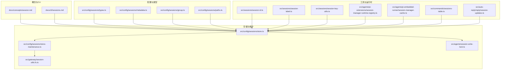
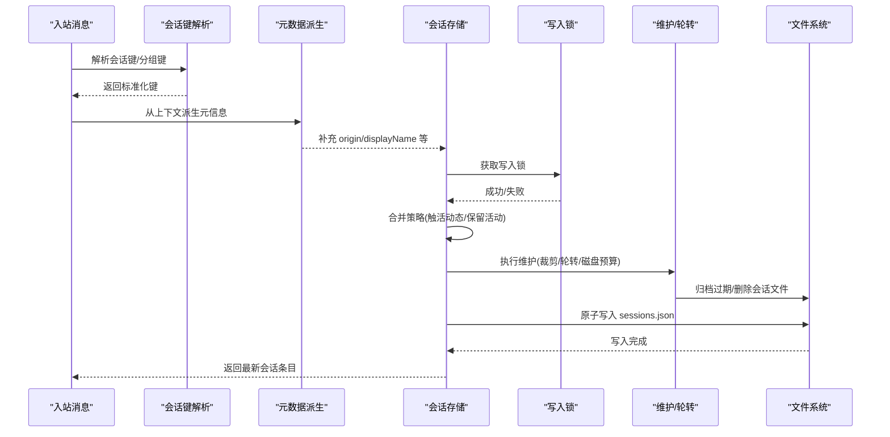
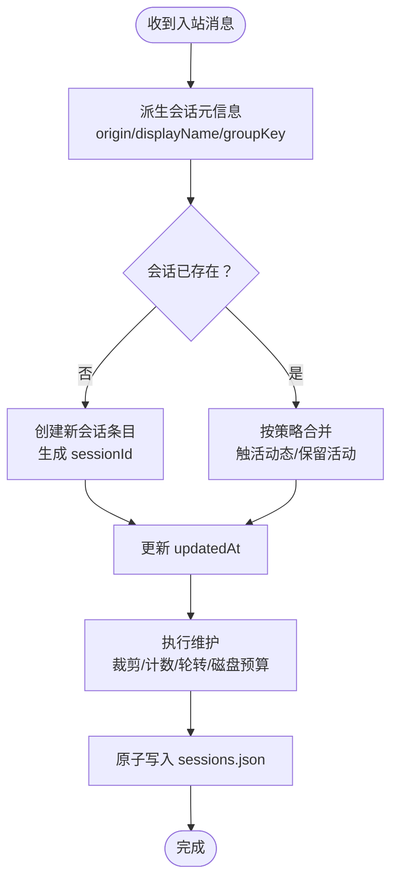
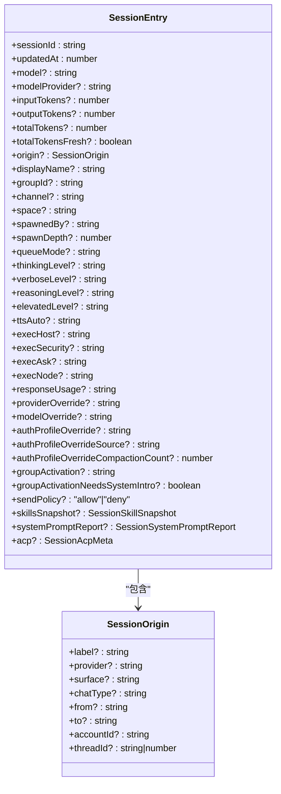
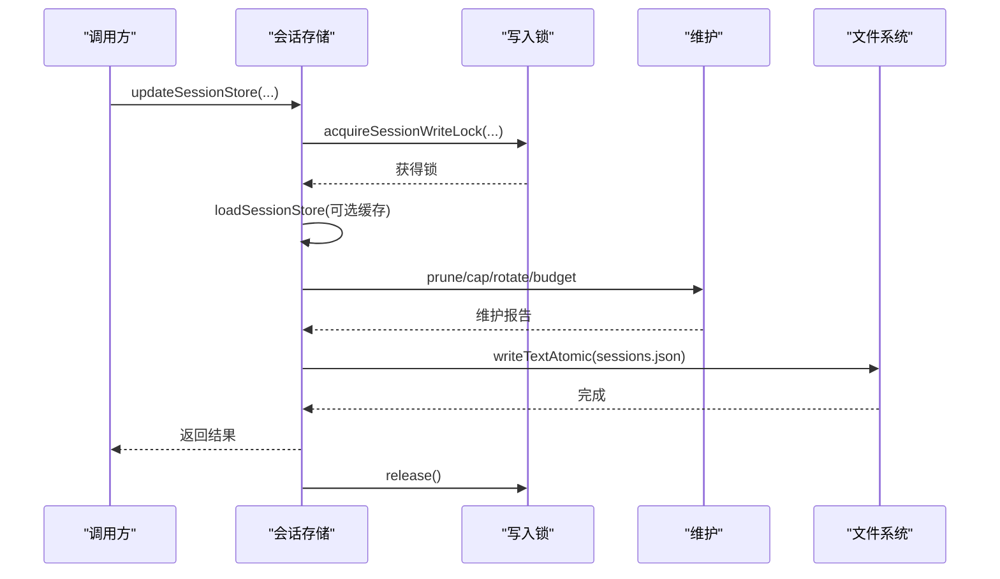
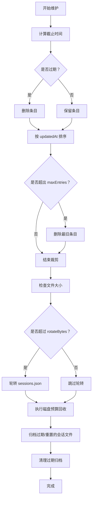
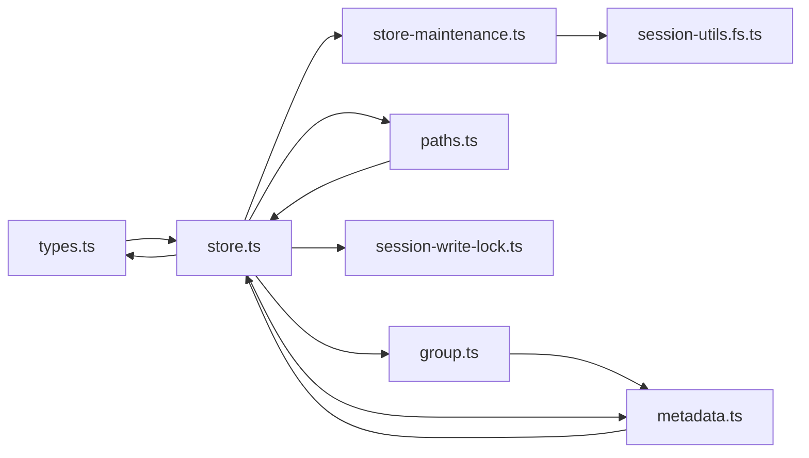

# 会话管理

<cite>
**本文引用的文件**
- [docs/concepts/session.md](file://docs/concepts/session.md)
- [docs/cli/sessions.md](file://docs/cli/sessions.md)
- [src/config/sessions/types.ts](file://src/config/sessions/types.ts)
- [src/config/sessions/store.ts](file://src/config/sessions/store.ts)
- [src/config/sessions/store-maintenance.ts](file://src/config/sessions/store-maintenance.ts)
- [src/config/sessions/metadata.ts](file://src/config/sessions/metadata.ts)
- [src/config/sessions/group.ts](file://src/config/sessions/group.ts)
- [src/config/sessions/paths.ts](file://src/config/sessions/paths.ts)
- [src/gateway/session-utils.fs.ts](file://src/gateway/session-utils.fs.ts)
- [src/agents/session-write-lock.ts](file://src/agents/session-write-lock.ts)
- [src/agents/session-dirs.ts](file://src/agents/session-dirs.ts)
- [src/agents/pi-extensions/session-manager-runtime-registry.ts](file://src/agents/pi-extensions/session-manager-runtime-registry.ts)
- [src/agents/pi-embedded-runner/session-manager-cache.ts](file://src/agents/pi-embedded-runner/session-manager-cache.ts)
- [src/sessions/session-id.ts](file://src/sessions/session-id.ts)
- [src/sessions/session-label.ts](file://src/sessions/session-label.ts)
- [src/sessions/session-key-utils.ts](file://src/sessions/session-key-utils.ts)
- [src/commands/sessions-table.ts](file://src/commands/sessions-table.ts)
- [src/auto-reply/reply/session-updates.ts](file://src/auto-reply/reply/session-updates.ts)
</cite>

## 目录

1. [简介](#简介)
2. [项目结构](#项目结构)
3. [核心组件](#核心组件)
4. [架构总览](#架构总览)
5. [详细组件分析](#详细组件分析)
6. [依赖关系分析](#依赖关系分析)
7. [性能考量](#性能考量)
8. [故障排查指南](#故障排查指南)
9. [结论](#结论)
10. [附录](#附录)

## 简介

本技术文档系统性阐述 OpenClaw 的会话管理系统，覆盖会话生命周期（创建、初始化、活跃维护、清理）、状态转换与持久化策略、工具结果处理、会话目录与文件组织、标识符与 slug 命名规范、数据序列化存储、并发与数据隔离、以及状态监控与调试方法。文档以代码为依据，结合图示帮助读者快速理解并正确使用会话管理能力。

## 项目结构

围绕会话管理的关键模块分布于以下路径：

- 概念与 CLI 文档：docs/concepts/session.md、docs/cli/sessions.md
- 会话类型与合并策略：src/config/sessions/types.ts
- 会话存储与写锁：src/config/sessions/store.ts、src/agents/session-write-lock.ts
- 维护与轮转：src/config/sessions/store-maintenance.ts、src/gateway/session-utils.fs.ts
- 元数据与分组键：src/config/sessions/metadata.ts、src/config/sessions/group.ts
- 路径解析与安全约束：src/config/sessions/paths.ts
- 会话键与标识符工具：src/sessions/session-id.ts、src/sessions/session-label.ts、src/sessions/session-key-utils.ts
- 运行时注册表与缓存：src/agents/pi-extensions/session-manager-runtime-registry.ts、src/agents/pi-embedded-runner/session-manager-cache.ts
- 目录扫描与展示：src/agents/session-dirs.ts、src/commands/sessions-table.ts
- 会话更新与计数：src/auto-reply/reply/session-updates.ts

图表来源

- [docs/concepts/session.md:1-311](file://docs/concepts/session.md#L1-L311)
- [docs/cli/sessions.md:1-105](file://docs/cli/sessions.md#L1-L105)
- [src/config/sessions/types.ts:1-380](file://src/config/sessions/types.ts#L1-L380)
- [src/config/sessions/store.ts:1-884](file://src/config/sessions/store.ts#L1-L884)
- [src/config/sessions/store-maintenance.ts:1-328](file://src/config/sessions/store-maintenance.ts#L1-L328)
- [src/gateway/session-utils.fs.ts:1-737](file://src/gateway/session-utils.fs.ts#L1-L737)
- [src/agents/session-write-lock.ts:1-561](file://src/agents/session-write-lock.ts#L1-L561)

章节来源

- [docs/concepts/session.md:1-311](file://docs/concepts/session.md#L1-L311)
- [docs/cli/sessions.md:1-105](file://docs/cli/sessions.md#L1-L105)

## 核心组件

- 会话条目与合并策略：定义会话字段、运行时模型规范化、合并策略（保留活动时间戳或触活动态）。
- 会话存储：加载/保存 sessions.json、写入锁、缓存、维护与轮转。
- 维护与轮转：按时间与数量裁剪、磁盘预算、文件轮转、归档清理。
- 元数据与分组键：从入站上下文派生会话元信息、群组显示名与键解析。
- 路径解析与安全：限定会话文件在会话目录内，避免越权访问。
- 并发与隔离：基于文件锁的写入串行化，队列化等待，进程级看门狗释放超时锁。
- 工具与运行时：会话键/标识符校验、标签长度限制、运行时注册表与缓存。
- 目录与展示：扫描 agents/\*/sessions 目录，表格化展示会话列表。
- 会话更新：增量更新计数、令牌统计刷新、清理输入输出分解。

章节来源

- [src/config/sessions/types.ts:68-272](file://src/config/sessions/types.ts#L68-L272)
- [src/config/sessions/store.ts:195-800](file://src/config/sessions/store.ts#L195-L800)
- [src/config/sessions/store-maintenance.ts:130-328](file://src/config/sessions/store-maintenance.ts#L130-L328)
- [src/config/sessions/metadata.ts:45-173](file://src/config/sessions/metadata.ts#L45-L173)
- [src/config/sessions/group.ts:23-108](file://src/config/sessions/group.ts#L23-L108)
- [src/config/sessions/paths.ts:171-203](file://src/config/sessions/paths.ts#L171-L203)
- [src/agents/session-write-lock.ts:444-561](file://src/agents/session-write-lock.ts#L444-L561)
- [src/sessions/session-id.ts:1-6](file://src/sessions/session-id.ts#L1-L6)
- [src/sessions/session-label.ts:1-21](file://src/sessions/session-label.ts#L1-L21)
- [src/agents/session-dirs.ts:5-22](file://src/agents/session-dirs.ts#L5-L22)
- [src/commands/sessions-table.ts:42-71](file://src/commands/sessions-table.ts#L42-L71)
- [src/auto-reply/reply/session-updates.ts:241-294](file://src/auto-reply/reply/session-updates.ts#L241-L294)

## 架构总览

下图展示会话管理从“入站消息”到“存储落盘”的关键流程，包括键解析、元数据派生、合并策略、写锁、维护与轮转、以及文件归档清理。

图表来源

- [src/config/sessions/store.ts:511-533](file://src/config/sessions/store.ts#L511-L533)
- [src/config/sessions/store.ts:340-509](file://src/config/sessions/store.ts#L340-L509)
- [src/config/sessions/store-maintenance.ts:155-328](file://src/config/sessions/store-maintenance.ts#L155-L328)
- [src/gateway/session-utils.fs.ts:188-228](file://src/gateway/session-utils.fs.ts#L188-L228)

## 详细组件分析

### 会话生命周期与状态转换

- 创建与初始化
  - 通过入站上下文派生会话元信息（渠道、主题、空间、线程等），并构建显示名。
  - 若不存在则创建新条目；若存在则按合并策略更新。
- 活跃状态维护
  - 更新 updatedAt 以反映最近交互；支持“触活动态”与“保留活动”两种合并策略。
  - 记录令牌用量、思考/详细级别、队列模式等运行时状态。
- 清理与重置
  - 支持按时间（pruneAfter）与数量（maxEntries）裁剪。
  - 文件过大触发轮转；删除/重置后归档历史会话文件。
  - 支持磁盘预算（maxDiskBytes/highWaterBytes）强制回收。

图表来源

- [src/config/sessions/metadata.ts:153-173](file://src/config/sessions/metadata.ts#L153-L173)
- [src/config/sessions/types.ts:250-288](file://src/config/sessions/types.ts#L250-L288)
- [src/config/sessions/store.ts:611-625](file://src/config/sessions/store.ts#L611-L625)
- [src/config/sessions/store-maintenance.ts:155-259](file://src/config/sessions/store-maintenance.ts#L155-L259)

章节来源

- [src/config/sessions/metadata.ts:45-173](file://src/config/sessions/metadata.ts#L45-L173)
- [src/config/sessions/types.ts:232-288](file://src/config/sessions/types.ts#L232-L288)
- [src/config/sessions/store.ts:611-625](file://src/config/sessions/store.ts#L611-L625)
- [src/config/sessions/store-maintenance.ts:155-259](file://src/config/sessions/store-maintenance.ts#L155-L259)

### 会话标识符与键规范

- 会话 ID
  - UUIDv4 格式校验；不存在时自动随机生成。
- 会话键
  - 标准化格式：agent:<agentId>:<scope>[:<subtype>:<id>…]，大小写不敏感，统一小写比较。
  - 支持直接消息（dm）、群组（group/channel）、线程（thread/topic）、Cron 任务、ACP 等。
- 分组键与显示名
  - 从上下文提取 provider、subject、groupChannel、space 等，生成稳定 slug 显示名。
- 标签与长度
  - 会话标签最大长度限制；非空且去除首尾空白。

图表来源

- [src/config/sessions/types.ts:68-171](file://src/config/sessions/types.ts#L68-L171)
- [src/config/sessions/types.ts:14-23](file://src/config/sessions/types.ts#L14-L23)

章节来源

- [src/sessions/session-id.ts:1-6](file://src/sessions/session-id.ts#L1-L6)
- [src/sessions/session-key-utils.ts:12-32](file://src/sessions/session-key-utils.ts#L12-L32)
- [src/config/sessions/group.ts:23-52](file://src/config/sessions/group.ts#L23-L52)
- [src/sessions/session-label.ts:1-21](file://src/sessions/session-label.ts#L1-L21)
- [src/config/sessions/types.ts:68-171](file://src/config/sessions/types.ts#L68-L171)

### 存储与持久化

- 读取与缓存
  - 支持 TTL 缓存 sessions.json，Windows 下对空文件进行短暂重试。
- 写入与原子化
  - 使用原子写入（写临时文件再重命名），确保一致性。
  - 写入前执行维护（裁剪、轮转、磁盘预算），完成后更新缓存。
- 锁与并发
  - 基于文件锁的互斥写入，队列化等待，支持超时与看门狗释放。
- 路径安全
  - 严格限定会话文件必须位于会话目录内，防止越权访问。

图表来源

- [src/config/sessions/store.ts:511-533](file://src/config/sessions/store.ts#L511-L533)
- [src/agents/session-write-lock.ts:444-561](file://src/agents/session-write-lock.ts#L444-L561)
- [src/config/sessions/store-maintenance.ts:275-328](file://src/config/sessions/store-maintenance.ts#L275-L328)

章节来源

- [src/config/sessions/store.ts:195-270](file://src/config/sessions/store.ts#L195-L270)
- [src/config/sessions/store.ts:340-509](file://src/config/sessions/store.ts#L340-L509)
- [src/agents/session-write-lock.ts:444-561](file://src/agents/session-write-lock.ts#L444-L561)
- [src/config/sessions/paths.ts:171-203](file://src/config/sessions/paths.ts#L171-L203)

### 维护与轮转

- 时间裁剪：按 pruneAfter 删除过期条目。
- 数量裁剪：按 maxEntries 保留最近更新的条目。
- 文件轮转：超过 rotateBytes 自动备份 sessions.json。
- 磁盘预算：当启用 maxDiskBytes 时，按高水位回收旧文件与归档。
- 归档清理：删除/重置后归档会话文件，并清理过期归档。

图表来源

- [src/config/sessions/store-maintenance.ts:155-259](file://src/config/sessions/store-maintenance.ts#L155-L259)
- [src/config/sessions/store-maintenance.ts:275-328](file://src/config/sessions/store-maintenance.ts#L275-L328)
- [src/gateway/session-utils.fs.ts:188-228](file://src/gateway/session-utils.fs.ts#L188-L228)

章节来源

- [src/config/sessions/store-maintenance.ts:130-328](file://src/config/sessions/store-maintenance.ts#L130-L328)
- [src/gateway/session-utils.fs.ts:230-267](file://src/gateway/session-utils.fs.ts#L230-L267)

### 会话目录与文件组织

- 位置
  - 每个 agent 对应一个 sessions 目录：~/.openclaw/agents/<agentId>/sessions/
- 文件
  - sessions.json：会话索引（键 -> 条目）
  - <SessionId>.jsonl：会话转录（每行一条消息记录）
  - 可能存在主题/线程变体：<SessionId>-topic-<threadId>.jsonl
- 目录扫描
  - 扫描 agents/\*/sessions 获取所有会话目录，用于聚合展示与维护。

章节来源

- [docs/concepts/session.md:64-72](file://docs/concepts/session.md#L64-L72)
- [src/agents/session-dirs.ts:5-22](file://src/agents/session-dirs.ts#L5-L22)

### 并发处理与数据隔离

- 并发控制
  - 单文件锁：同一会话文件在同一时刻仅允许一个写入者。
  - 队列化等待：多个并发写入请求排队，按 FIFO 执行。
  - 超时与看门狗：超时抛错；长时间持有锁自动释放。
- 数据隔离
  - 会话键隔离不同对话；dmScope 控制 DM 的隔离粒度。
  - 路径解析限制会话文件必须在会话目录内，避免跨目录污染。

章节来源

- [src/agents/session-write-lock.ts:444-561](file://src/agents/session-write-lock.ts#L444-L561)
- [src/config/sessions/paths.ts:171-203](file://src/config/sessions/paths.ts#L171-L203)
- [docs/concepts/session.md:10-56](file://docs/concepts/session.md#L10-L56)

### 会话工具结果处理与计数

- 工具结果修剪
  - 默认在调用大模型前修剪内存中的旧工具结果，不重写 JSONL 历史。
- 计数刷新
  - 增量更新 compactionCount；压缩后刷新 totalTokensFresh 并清理输入/输出分解计数。
- 展示与监控
  - 命令行 sessions 列表按 updatedAt 排序，显示关键指标（令牌、模型、队列模式等）。

章节来源

- [docs/concepts/session.md:177-188](file://docs/concepts/session.md#L177-L188)
- [src/auto-reply/reply/session-updates.ts:241-294](file://src/auto-reply/reply/session-updates.ts#L241-L294)
- [src/commands/sessions-table.ts:42-71](file://src/commands/sessions-table.ts#L42-L71)

## 依赖关系分析

图表来源

- [src/config/sessions/types.ts:1-380](file://src/config/sessions/types.ts#L1-L380)
- [src/config/sessions/store.ts:1-884](file://src/config/sessions/store.ts#L1-L884)
- [src/config/sessions/store-maintenance.ts:1-328](file://src/config/sessions/store-maintenance.ts#L1-L328)
- [src/config/sessions/metadata.ts:1-173](file://src/config/sessions/metadata.ts#L1-L173)
- [src/config/sessions/group.ts:1-108](file://src/config/sessions/group.ts#L1-L108)
- [src/config/sessions/paths.ts:1-203](file://src/config/sessions/paths.ts#L1-L203)
- [src/gateway/session-utils.fs.ts:1-737](file://src/gateway/session-utils.fs.ts#L1-L737)
- [src/agents/session-write-lock.ts:1-561](file://src/agents/session-write-lock.ts#L1-L561)

章节来源

- [src/config/sessions/store.ts:1-44](file://src/config/sessions/store.ts#L1-L44)
- [src/config/sessions/store-maintenance.ts:1-8](file://src/config/sessions/store-maintenance.ts#L1-L8)
- [src/gateway/session-utils.fs.ts:1-18](file://src/gateway/session-utils.fs.ts#L1-L18)

## 性能考量

- 大规模会话存储
  - 维护工作在写路径执行，大规模 store 会增加写延迟。
  - 建议启用“强制模式”，设置时间与数量上限，必要时启用磁盘预算并合理设置高水位。
- 缓存与 IO
  - sessions.json 支持 TTL 缓存；Windows 下读取空文件有短暂重试。
  - 原子写入减少损坏风险，但频繁写入仍需注意磁盘性能。
- 轮转与归档
  - 轮转与归档清理有助于控制磁盘占用，建议配合磁盘预算使用。

章节来源

- [docs/concepts/session.md:101-120](file://docs/concepts/session.md#L101-L120)
- [src/config/sessions/store.ts:195-270](file://src/config/sessions/store.ts#L195-L270)
- [src/config/sessions/store-maintenance.ts:275-328](file://src/config/sessions/store-maintenance.ts#L275-L328)

## 故障排查指南

- 会话维护警告
  - 当 mode 为 warn 时，若活跃会话可能被裁剪，会发出警告；可切换为 enforce 或提升阈值。
- 锁相关问题
  - 超时错误：检查锁文件是否存在、进程是否存活、是否发生 PID 回收。
  - 看门狗：长时间持有锁会被自动释放，确认业务逻辑缩短持有时间。
- 文件轮转与归档
  - 轮转后保留最近 3 份备份；归档清理会删除过期归档文件。
- CLI 检查
  - 使用 sessions 列表与 cleanup 预览/执行维护；通过 gateway call sessions.list 获取远程网关会话。

章节来源

- [src/config/sessions/store.ts:353-392](file://src/config/sessions/store.ts#L353-L392)
- [src/agents/session-write-lock.ts:444-561](file://src/agents/session-write-lock.ts#L444-L561)
- [src/gateway/session-utils.fs.ts:230-267](file://src/gateway/session-utils.fs.ts#L230-L267)
- [docs/cli/sessions.md:48-105](file://docs/cli/sessions.md#L48-L105)

## 结论

OpenClaw 的会话管理以“键驱动、元信息派生、合并策略、写入锁与维护轮转”为核心，兼顾了多用户场景下的隔离与并发安全，同时提供了完善的 CLI 与网关接口用于监控与维护。通过合理的配置（时间/数量/磁盘预算）与运维实践，可在高负载环境下保持稳定的会话生命周期管理。

## 附录

- 会话键映射与重置策略
  - dmScope、reset 触发词、每日/空闲重置、按类型/通道覆盖。
- 会话工具结果处理
  - 默认修剪内存中旧工具结果，不重写 JSONL；压缩后刷新令牌计数。
- 运行时注册表与缓存
  - 会话级弱引用注册表与会话管理器缓存，提升访问效率。

章节来源

- [docs/concepts/session.md:189-311](file://docs/concepts/session.md#L189-L311)
- [src/auto-reply/reply/session-updates.ts:241-294](file://src/auto-reply/reply/session-updates.ts#L241-L294)
- [src/agents/pi-extensions/session-manager-runtime-registry.ts:1-29](file://src/agents/pi-extensions/session-manager-runtime-registry.ts#L1-L29)
- [src/agents/pi-embedded-runner/session-manager-cache.ts:24-54](file://src/agents/pi-embedded-runner/session-manager-cache.ts#L24-L54)
