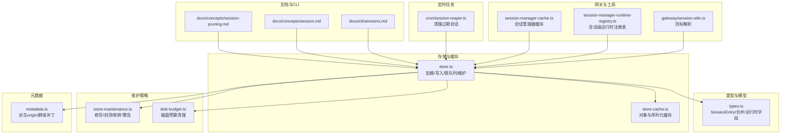
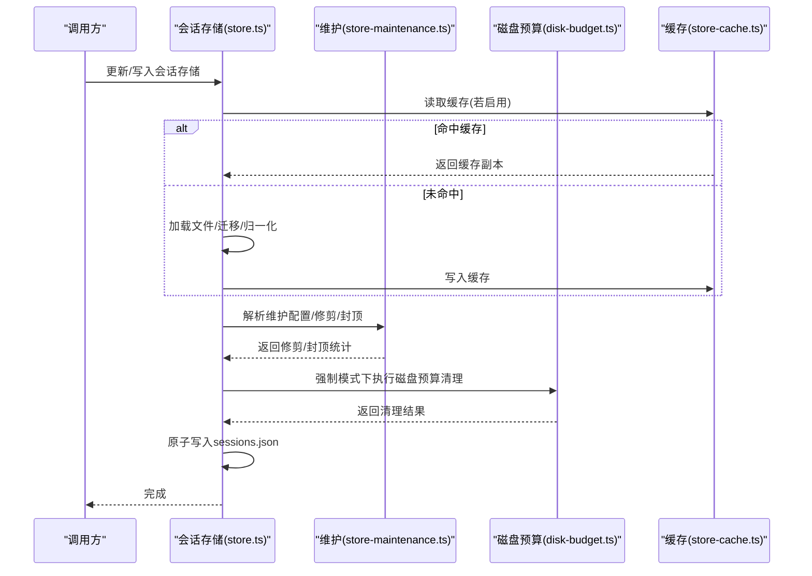
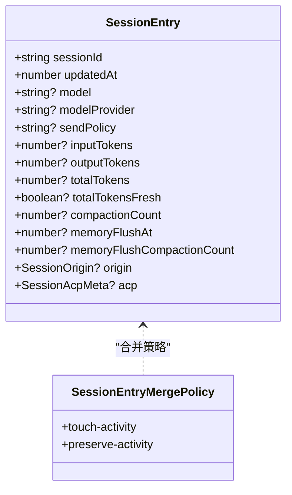
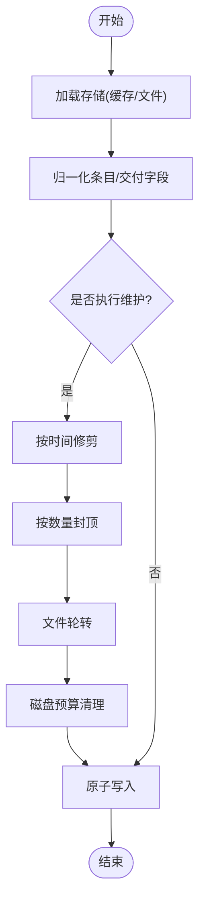
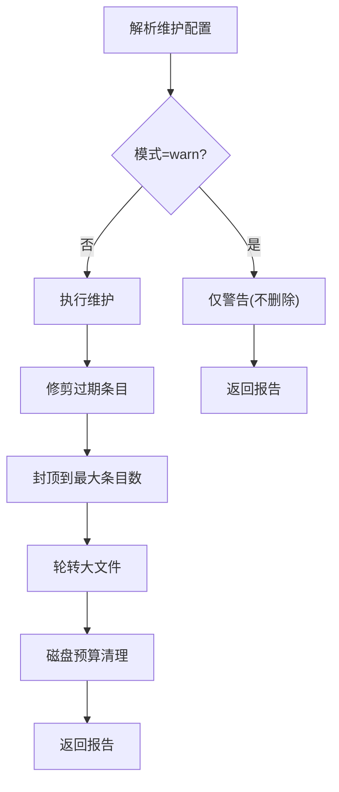
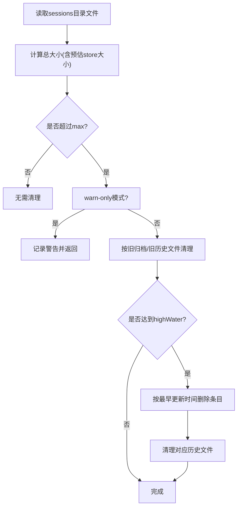
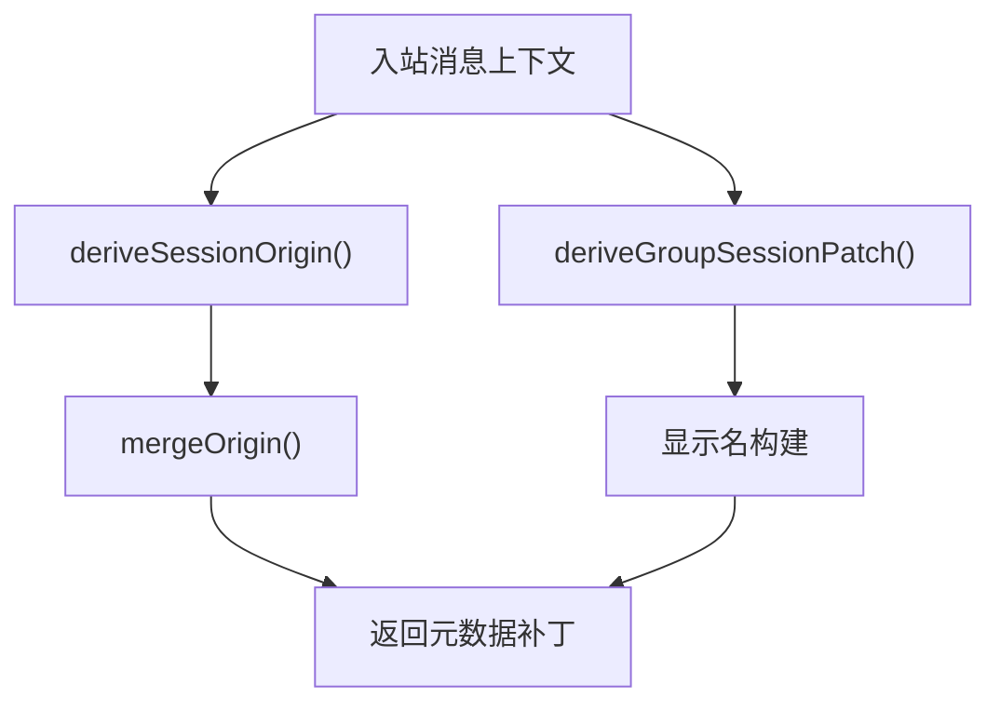
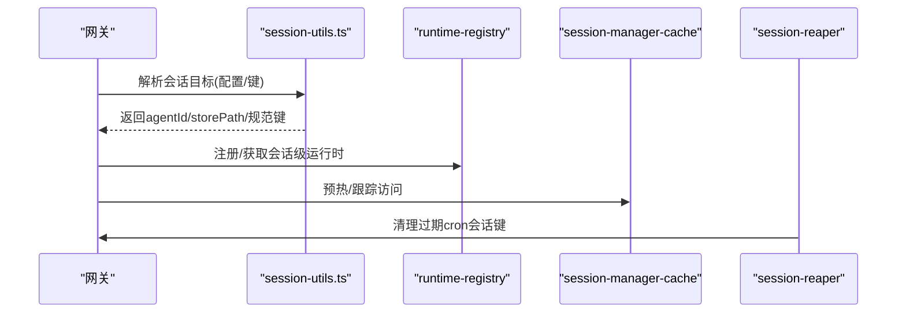
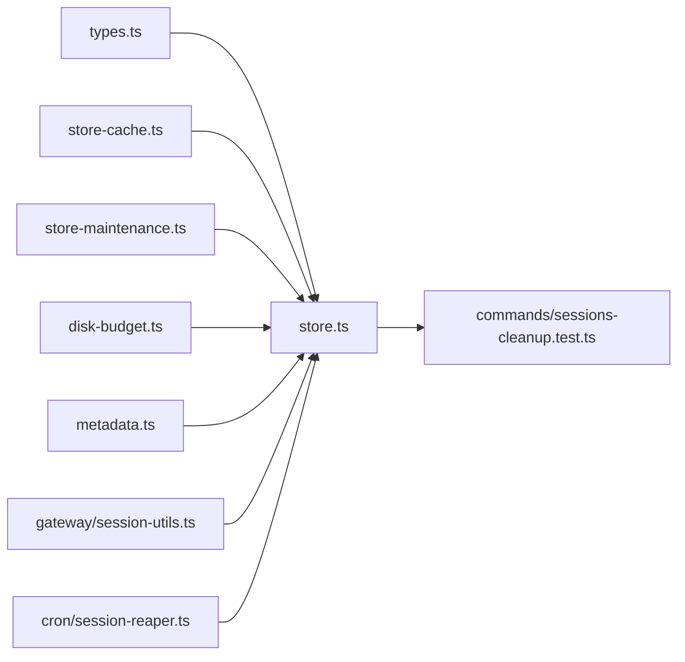

# 会话管理

<cite>
**本文引用的文件**
- [src/config/sessions/types.ts](file://src/config/sessions/types.ts)
- [src/config/sessions/store.ts](file://src/config/sessions/store.ts)
- [src/config/sessions/store-maintenance.ts](file://src/config/sessions/store-maintenance.ts)
- [src/config/sessions/disk-budget.ts](file://src/config/sessions/disk-budget.ts)
- [src/config/sessions/metadata.ts](file://src/config/sessions/metadata.ts)
- [src/config/sessions/store-cache.ts](file://src/config/sessions/store-cache.ts)
- [src/gateway/session-utils.ts](file://src/gateway/session-utils.ts)
- [src/agents/pi-extensions/session-manager-runtime-registry.ts](file://src/agents/pi-extensions/session-manager-runtime-registry.ts)
- [src/agents/pi-embedded-runner/session-manager-cache.ts](file://src/agents/pi-embedded-runner/session-manager-cache.ts)
- [src/cron/session-reaper.ts](file://src/cron/session-reaper.ts)
- [src/commands/sessions-cleanup.test.ts](file://src/commands/sessions-cleanup.test.ts)
- [src/auto-reply/reply/agent-runner-memory.ts](file://src/auto-reply/reply/agent-runner-memory.ts)
- [docs/concepts/session.md](file://docs/concepts/session.md)
- [docs/concepts/session-pruning.md](file://docs/concepts/session-pruning.md)
- [docs/cli/sessions.md](file://docs/cli/sessions.md)
</cite>

## 目录

1. [简介](#简介)
2. [项目结构](#项目结构)
3. [核心组件](#核心组件)
4. [架构总览](#架构总览)
5. [详细组件分析](#详细组件分析)
6. [依赖关系分析](#依赖关系分析)
7. [性能考量](#性能考量)
8. [故障排除指南](#故障排除指南)
9. [结论](#结论)
10. [附录](#附录)

## 简介

本文件系统化阐述 OpenClaw 会话管理系统：会话概念、生命周期与状态维护、工具结果保护、修剪策略、目录组织、消息路由与状态同步、与代理/工具执行/记忆存储的关系，并提供配置项、状态查询方法与故障排除指南。文档以代码级实现为依据，辅以图示帮助理解。

## 项目结构

会话管理相关代码主要位于以下模块：

- 类型与模型：定义会话条目、运行时字段、合并策略等
- 存储与缓存：加载/写入 sessions.json、缓存、锁队列、维护（修剪/封顶/轮转）
- 维护策略：按时间/数量/磁盘预算清理、警告模式
- 元数据派生：从入站消息推导会话来源与群组信息
- 网关与工具：网关会话目标解析、会话管理器缓存、定时清理
- 文档与 CLI：会话概念、修剪策略、CLI 使用参考

图表来源

- [src/config/sessions/store.ts:1-800](file://src/config/sessions/store.ts#L1-L800)
- [src/config/sessions/types.ts:1-380](file://src/config/sessions/types.ts#L1-L380)
- [src/config/sessions/store-cache.ts:1-82](file://src/config/sessions/store-cache.ts#L1-L82)
- [src/config/sessions/store-maintenance.ts:1-328](file://src/config/sessions/store-maintenance.ts#L1-L328)
- [src/config/sessions/disk-budget.ts:1-376](file://src/config/sessions/disk-budget.ts#L1-L376)
- [src/config/sessions/metadata.ts:1-173](file://src/config/sessions/metadata.ts#L1-L173)
- [src/gateway/session-utils.ts:480-503](file://src/gateway/session-utils.ts#L480-L503)
- [src/agents/pi-extensions/session-manager-runtime-registry.ts:1-29](file://src/agents/pi-extensions/session-manager-runtime-registry.ts#L1-L29)
- [src/agents/pi-embedded-runner/session-manager-cache.ts:1-54](file://src/agents/pi-embedded-runner/session-manager-cache.ts#L1-L54)
- [src/cron/session-reaper.ts:81-109](file://src/cron/session-reaper.ts#L81-L109)
- [docs/concepts/session.md:1-311](file://docs/concepts/session.md#L1-L311)
- [docs/concepts/session-pruning.md:1-122](file://docs/concepts/session-pruning.md#L1-L122)
- [docs/cli/sessions.md:1-105](file://docs/cli/sessions.md#L1-L105)

章节来源

- [src/config/sessions/store.ts:1-800](file://src/config/sessions/store.ts#L1-L800)
- [src/config/sessions/types.ts:1-380](file://src/config/sessions/types.ts#L1-L380)
- [src/config/sessions/store-cache.ts:1-82](file://src/config/sessions/store-cache.ts#L1-L82)
- [src/config/sessions/store-maintenance.ts:1-328](file://src/config/sessions/store-maintenance.ts#L1-L328)
- [src/config/sessions/disk-budget.ts:1-376](file://src/config/sessions/disk-budget.ts#L1-L376)
- [src/config/sessions/metadata.ts:1-173](file://src/config/sessions/metadata.ts#L1-L173)
- [src/gateway/session-utils.ts:480-503](file://src/gateway/session-utils.ts#L480-L503)
- [src/agents/pi-extensions/session-manager-runtime-registry.ts:1-29](file://src/agents/pi-extensions/session-manager-runtime-registry.ts#L1-L29)
- [src/agents/pi-embedded-runner/session-manager-cache.ts:1-54](file://src/agents/pi-embedded-runner/session-manager-cache.ts#L1-L54)
- [src/cron/session-reaper.ts:81-109](file://src/cron/session-reaper.ts#L81-L109)
- [docs/concepts/session.md:1-311](file://docs/concepts/session.md#L1-L311)
- [docs/concepts/session-pruning.md:1-122](file://docs/concepts/session-pruning.md#L1-L122)
- [docs/cli/sessions.md:1-105](file://docs/cli/sessions.md#L1-L105)

## 核心组件

- 会话条目与运行时字段：定义会话键、最后更新时间、模型/提供方、发送策略、队列参数、令牌统计、记忆与压缩计数、ACP 元信息等
- 会话存储：提供加载、写入、合并、归一化、原子写入、并发写锁队列、维护（修剪/封顶/轮转/磁盘预算）、缓存
- 维护策略：按时间阈值修剪、按最大条目数封顶、文件轮转、磁盘预算清理、警告模式
- 元数据派生：从入站消息推导会话来源（provider/from/to/account/thread）与群组标签
- 网关与工具：网关侧会话目标解析、会话管理器缓存与运行时注册表、定时清理过期会话
- 文档与 CLI：会话概念、修剪策略、清理命令使用

章节来源

- [src/config/sessions/types.ts:68-171](file://src/config/sessions/types.ts#L68-L171)
- [src/config/sessions/store.ts:195-270](file://src/config/sessions/store.ts#L195-L270)
- [src/config/sessions/store.ts:511-533](file://src/config/sessions/store.ts#L511-L533)
- [src/config/sessions/store-maintenance.ts:130-148](file://src/config/sessions/store-maintenance.ts#L130-L148)
- [src/config/sessions/disk-budget.ts:188-375](file://src/config/sessions/disk-budget.ts#L188-L375)
- [src/config/sessions/metadata.ts:45-87](file://src/config/sessions/metadata.ts#L45-L87)
- [src/gateway/session-utils.ts:480-503](file://src/gateway/session-utils.ts#L480-L503)
- [src/agents/pi-extensions/session-manager-runtime-registry.ts:1-29](file://src/agents/pi-extensions/session-manager-runtime-registry.ts#L1-L29)
- [src/agents/pi-embedded-runner/session-manager-cache.ts:24-54](file://src/agents/pi-embedded-runner/session-manager-cache.ts#L24-L54)
- [src/cron/session-reaper.ts:81-109](file://src/cron/session-reaper.ts#L81-L109)
- [docs/concepts/session.md:74-120](file://docs/concepts/session.md#L74-L120)
- [docs/concepts/session-pruning.md:1-122](file://docs/concepts/session-pruning.md#L1-L122)
- [docs/cli/sessions.md:48-105](file://docs/cli/sessions.md#L48-L105)

## 架构总览

会话管理围绕“会话存储文件 + 会话条目 + 维护策略 + 缓存/锁队列 + 元数据派生 + 网关/工具集成”的闭环展开。写入路径在保存前执行维护，读取路径支持缓存；维护策略可警告或强制执行；磁盘预算在强制模式下按旧文件与旧会话条目清理。

图表来源

- [src/config/sessions/store.ts:340-509](file://src/config/sessions/store.ts#L340-L509)
- [src/config/sessions/store-maintenance.ts:130-148](file://src/config/sessions/store-maintenance.ts#L130-L148)
- [src/config/sessions/disk-budget.ts:188-375](file://src/config/sessions/disk-budget.ts#L188-L375)
- [src/config/sessions/store-cache.ts:41-81](file://src/config/sessions/store-cache.ts#L41-L81)

## 详细组件分析

### 会话条目与合并策略

- 会话条目包含：会话标识、最后更新时间、模型/提供方、发送策略、队列参数、令牌统计、记忆/压缩计数、ACP 元信息、来源元数据等
- 合并策略：支持“触活动态”和“保留活动”两种策略，确保更新时间与会话 ID 的一致性与稳定性
- 运行时字段归一化：对模型/提供方进行去空白处理，避免冗余字段

图表来源

- [src/config/sessions/types.ts:68-171](file://src/config/sessions/types.ts#L68-L171)
- [src/config/sessions/types.ts:232-288](file://src/config/sessions/types.ts#L232-L288)

章节来源

- [src/config/sessions/types.ts:68-171](file://src/config/sessions/types.ts#L68-L171)
- [src/config/sessions/types.ts:178-272](file://src/config/sessions/types.ts#L178-L272)

### 会话存储与缓存

- 加载：支持缓存（TTL + mtime/size 校验）、Windows 下空文件重试、结构化克隆返回
- 写入：归一化、维护（修剪/封顶/轮转/磁盘预算）、原子写入、缓存更新
- 并发控制：基于文件锁的队列，避免竞态
- 入站元数据：派生 origin 与群组补丁，不刷新活动时间

图表来源

- [src/config/sessions/store.ts:195-270](file://src/config/sessions/store.ts#L195-L270)
- [src/config/sessions/store.ts:340-509](file://src/config/sessions/store.ts#L340-L509)
- [src/config/sessions/store-maintenance.ts:155-174](file://src/config/sessions/store-maintenance.ts#L155-L174)
- [src/config/sessions/store-maintenance.ts:226-259](file://src/config/sessions/store-maintenance.ts#L226-L259)
- [src/config/sessions/disk-budget.ts:188-375](file://src/config/sessions/disk-budget.ts#L188-L375)

章节来源

- [src/config/sessions/store.ts:195-270](file://src/config/sessions/store.ts#L195-L270)
- [src/config/sessions/store.ts:511-533](file://src/config/sessions/store.ts#L511-L533)
- [src/config/sessions/store.ts:729-754](file://src/config/sessions/store.ts#L729-L754)
- [src/config/sessions/store.ts:756-800](file://src/config/sessions/store.ts#L756-L800)
- [src/config/sessions/store-cache.ts:41-81](file://src/config/sessions/store-cache.ts#L41-L81)

### 维护策略与修剪

- 时间修剪：删除 updatedAt 早于阈值的条目
- 数量封顶：保留最近更新的 N 条，其余按更新时间排序后删除
- 文件轮转：超过阈值大小重命名为 .bak.<timestamp>，最多保留 3 个备份
- 警告模式：仅报告不会实际删除
- 活跃会话保护：在强制模式下，若活跃会话会被删除则跳过

图表来源

- [src/config/sessions/store-maintenance.ts:130-148](file://src/config/sessions/store-maintenance.ts#L130-L148)
- [src/config/sessions/store-maintenance.ts:155-174](file://src/config/sessions/store-maintenance.ts#L155-L174)
- [src/config/sessions/store-maintenance.ts:226-259](file://src/config/sessions/store-maintenance.ts#L226-L259)
- [src/config/sessions/store-maintenance.ts:275-327](file://src/config/sessions/store-maintenance.ts#L275-L327)

章节来源

- [src/config/sessions/store-maintenance.ts:130-148](file://src/config/sessions/store-maintenance.ts#L130-L148)
- [src/config/sessions/store-maintenance.ts:155-174](file://src/config/sessions/store-maintenance.ts#L155-L174)
- [src/config/sessions/store-maintenance.ts:180-219](file://src/config/sessions/store-maintenance.ts#L180-L219)
- [src/config/sessions/store-maintenance.ts:226-259](file://src/config/sessions/store-maintenance.ts#L226-L259)
- [src/config/sessions/store-maintenance.ts:275-327](file://src/config/sessions/store-maintenance.ts#L275-L327)

### 磁盘预算清理

- 计算 sessions 目录总大小（不含当前 store 文件），超过上限时优先清理旧归档与主会话历史文件
- 若仍超限，则按最早更新时间删除条目，同时清理对应的会话历史文件
- 支持 dry-run 与 warn-only 模式

图表来源

- [src/config/sessions/disk-budget.ts:188-375](file://src/config/sessions/disk-budget.ts#L188-L375)

章节来源

- [src/config/sessions/disk-budget.ts:188-375](file://src/config/sessions/disk-budget.ts#L188-L375)

### 元数据派生与群组标签

- 从入站消息上下文派生会话来源（provider/from/to/account/thread），并合并到现有 origin
- 群组场景派生 chatType、channel、groupId、subject/groupChannel/space，并生成显示名

图表来源

- [src/config/sessions/metadata.ts:45-87](file://src/config/sessions/metadata.ts#L45-L87)
- [src/config/sessions/metadata.ts:96-151](file://src/config/sessions/metadata.ts#L96-L151)
- [src/config/sessions/metadata.ts:153-172](file://src/config/sessions/metadata.ts#L153-L172)

章节来源

- [src/config/sessions/metadata.ts:45-87](file://src/config/sessions/metadata.ts#L45-L87)
- [src/config/sessions/metadata.ts:96-151](file://src/config/sessions/metadata.ts#L96-L151)
- [src/config/sessions/metadata.ts:153-172](file://src/config/sessions/metadata.ts#L153-L172)

### 网关与工具集成

- 网关侧会话目标解析：根据配置解析 agentId、storePath、规范化的 key 与候选 keys
- 会话管理器缓存：基于 TTL 的对象缓存与预热
- 会话管理器运行时注册表：以对象身份为键的弱映射，保持会话级运行时状态
- 定时清理：清理过期的 cron 会话键

图表来源

- [src/gateway/session-utils.ts:480-503](file://src/gateway/session-utils.ts#L480-L503)
- [src/agents/pi-extensions/session-manager-runtime-registry.ts:1-29](file://src/agents/pi-extensions/session-manager-runtime-registry.ts#L1-L29)
- [src/agents/pi-embedded-runner/session-manager-cache.ts:24-54](file://src/agents/pi-embedded-runner/session-manager-cache.ts#L24-L54)
- [src/cron/session-reaper.ts:81-109](file://src/cron/session-reaper.ts#L81-L109)

章节来源

- [src/gateway/session-utils.ts:480-503](file://src/gateway/session-utils.ts#L480-L503)
- [src/agents/pi-extensions/session-manager-runtime-registry.ts:1-29](file://src/agents/pi-extensions/session-manager-runtime-registry.ts#L1-L29)
- [src/agents/pi-embedded-runner/session-manager-cache.ts:24-54](file://src/agents/pi-embedded-runner/session-manager-cache.ts#L24-L54)
- [src/cron/session-reaper.ts:81-109](file://src/cron/session-reaper.ts#L81-L109)

### 会话生命周期与状态同步

- 生命周期：会话在下一次入站消息时评估是否过期；支持每日重置与空闲重置；重置触发包括 /new 与 /reset
- 状态同步：UI 通过网关查询会话列表与令牌统计；会话条目包含输入/输出/总令牌与上下文令牌
- 记忆与压缩：在接近自动压缩时触发静默内存冲刷，提醒模型将笔记持久化

章节来源

- [docs/concepts/session.md:207-218](file://docs/concepts/session.md#L207-L218)
- [docs/concepts/session.md:57-72](file://docs/concepts/session.md#L57-L72)
- [src/auto-reply/reply/agent-runner-memory.ts:523-566](file://src/auto-reply/reply/agent-runner-memory.ts#L523-L566)

### 会话工具结果保护与修剪

- 工具结果保护：在 LLM 请求前对旧工具结果进行修剪，不重写 JSONL 历史
- 修剪策略：按 TTL 与工具选择进行软修剪/硬清除，保留最近助手回复与图像块
- 与压缩区分：修剪是请求级瞬时行为，压缩是持久化摘要

章节来源

- [docs/concepts/session-pruning.md:1-122](file://docs/concepts/session-pruning.md#L1-L122)

### 会话目录组织

- 存储文件：每个 agent 一个 sessions.json
- 历史文件：每个 sessionId 对应 .jsonl；群组/主题附加标识
- 归档：删除/重置后的历史文件归档，按保留策略清理

章节来源

- [docs/concepts/session.md:64-73](file://docs/concepts/session.md#L64-L73)

### 会话配置选项与状态查询

- 维护配置：模式、修剪时间、最大条目、轮转字节、磁盘上限与高水位、重置归档保留
- 发送策略：按通道/类型/键前缀拒绝或允许
- 状态查询：CLI 列表、网关 RPC 查询、/status 与 /context 查看

章节来源

- [docs/concepts/session.md:74-120](file://docs/concepts/session.md#L74-L120)
- [docs/concepts/session.md:219-245](file://docs/concepts/session.md#L219-L245)
- [docs/cli/sessions.md:1-105](file://docs/cli/sessions.md#L1-L105)

## 依赖关系分析

- 模块内聚：types 提供数据模型，store 聚合加载/写入/维护/缓存，maintenance 与 disk-budget 提供策略实现
- 外部依赖：文件系统、配置加载、日志子系统、写锁
- 并发与一致性：写锁队列保证同一 storePath 的串行化写入；缓存通过 mtime/size 校验避免脏读

图表来源

- [src/config/sessions/types.ts:1-380](file://src/config/sessions/types.ts#L1-L380)
- [src/config/sessions/store.ts:1-800](file://src/config/sessions/store.ts#L1-L800)
- [src/config/sessions/store-cache.ts:1-82](file://src/config/sessions/store-cache.ts#L1-L82)
- [src/config/sessions/store-maintenance.ts:1-328](file://src/config/sessions/store-maintenance.ts#L1-L328)
- [src/config/sessions/disk-budget.ts:1-376](file://src/config/sessions/disk-budget.ts#L1-L376)
- [src/config/sessions/metadata.ts:1-173](file://src/config/sessions/metadata.ts#L1-L173)
- [src/gateway/session-utils.ts:480-503](file://src/gateway/session-utils.ts#L480-L503)
- [src/cron/session-reaper.ts:81-109](file://src/cron/session-reaper.ts#L81-L109)
- [src/commands/sessions-cleanup.test.ts:53-91](file://src/commands/sessions-cleanup.test.ts#L53-L91)

章节来源

- [src/config/sessions/store.ts:1-800](file://src/config/sessions/store.ts#L1-L800)
- [src/config/sessions/store-maintenance.ts:1-328](file://src/config/sessions/store-maintenance.ts#L1-L328)
- [src/config/sessions/disk-budget.ts:1-376](file://src/config/sessions/disk-budget.ts#L1-L376)
- [src/config/sessions/metadata.ts:1-173](file://src/config/sessions/metadata.ts#L1-L173)
- [src/gateway/session-utils.ts:480-503](file://src/gateway/session-utils.ts#L480-L503)
- [src/cron/session-reaper.ts:81-109](file://src/cron/session-reaper.ts#L81-L109)
- [src/commands/sessions-cleanup.test.ts:53-91](file://src/commands/sessions-cleanup.test.ts#L53-L91)

## 性能考量

- 大存储写入成本：高 maxEntries、长 pruneAfter、大量归档与启用磁盘预算会增加写入延迟
- 建议：生产环境使用 enforce 模式，同时设置时间与数量限制，合理设置磁盘预算与高水位
- 缓存：启用 TTL 缓存可显著降低重复读取开销

## 故障排除指南

- 写入失败/ENOENT：Windows 下临时文件写入存在竞态，框架内置重试；若仍失败，检查目录权限与磁盘空间
- 缓存失效：mtime/size 变更会触发缓存失效；确认文件系统事件与缓存 TTL 设置
- 维护未生效：确认 session.maintenance.mode 与 active-key 保护；使用 --dry-run 预览
- 磁盘不足：启用磁盘预算并设置合理 highWater；必要时增大 rotateBytes 或减少 pruneAfter

章节来源

- [src/config/sessions/store.ts:464-508](file://src/config/sessions/store.ts#L464-L508)
- [src/config/sessions/store-cache.ts:41-81](file://src/config/sessions/store-cache.ts#L41-L81)
- [docs/cli/sessions.md:48-105](file://docs/cli/sessions.md#L48-L105)
- [docs/concepts/session.md:101-120](file://docs/concepts/session.md#L101-L120)

## 结论

OpenClaw 会话管理通过严谨的数据模型、完善的维护策略与缓存/锁机制，在保证一致性的同时兼顾性能与可运维性。结合 CLI 与网关查询能力，用户可以高效地观察、清理与优化会话状态。

## 附录

- 会话创建/更新/销毁流程（代码路径）
  - 创建/更新：[updateSessionStoreEntry:729-754](file://src/config/sessions/store.ts#L729-L754)
  - 更新元数据：[recordSessionMetaFromInbound:756-800](file://src/config/sessions/store.ts#L756-L800)
  - 写入保存：[saveSessionStore:511-519](file://src/config/sessions/store.ts#L511-L519)
  - 批量维护：[updateSessionStore:521-533](file://src/config/sessions/store.ts#L521-L533)
  - 维护执行：[saveSessionStoreUnlocked:340-509](file://src/config/sessions/store.ts#L340-L509)
  - 修剪/封顶/轮转：[pruneStaleEntries:155-174](file://src/config/sessions/store-maintenance.ts#L155-L174)、[capEntryCount:226-259](file://src/config/sessions/store-maintenance.ts#L226-L259)、[rotateSessionFile:275-327](file://src/config/sessions/store-maintenance.ts#L275-L327)
  - 磁盘预算：[enforceSessionDiskBudget:188-375](file://src/config/sessions/disk-budget.ts#L188-L375)
  - 入站元数据派生：[deriveSessionMetaPatch:153-172](file://src/config/sessions/metadata.ts#L153-L172)
  - 网关目标解析：[resolveGatewaySessionStoreTarget:480-503](file://src/gateway/session-utils.ts#L480-L503)
  - 会话管理器缓存：[trackSessionManagerAccess:24-33](file://src/agents/pi-embedded-runner/session-manager-cache.ts#L24-L33)
  - 定时清理：[清理过期会话:81-109](file://src/cron/session-reaper.ts#L81-L109)
