# 会话管理

<cite>
**本文引用的文件**
- [src/config/sessions/types.ts](file://src/config/sessions/types.ts)
- [src/config/sessions/store.ts](file://src/config/sessions/store.ts)
- [src/config/sessions/store-maintenance.ts](file://src/config/sessions/store-maintenance.ts)
- [src/config/sessions/disk-budget.ts](file://src/config/sessions/disk-budget.ts)
- [src/config/sessions/metadata.ts](file://src/config/sessions/metadata.ts)
- [src/config/sessions/store-cache.ts](file://src/config/sessions/store-cache.ts)
- [src/gateway/session-utils.ts](file://src/gateway/session-utils.ts)
- [src/gateway/session-utils.fs.ts](file://src/gateway/session-utils.fs.ts)
- [src/gateway/server-session-key.ts](file://src/gateway/server-session-key.ts)
- [src/auto-reply/reply/strip-inbound-meta.ts](file://src/auto-reply/reply/strip-inbound-meta.ts)
- [src/agents/pi-extensions/session-manager-runtime-registry.ts](file://src/agents/pi-extensions/session-manager-runtime-registry.ts)
- [src/agents/pi-embedded-runner/session-manager-cache.ts](file://src/agents/pi-embedded-runner/session-manager-cache.ts)
- [src/agents/pi-embedded-runner/session-manager-init.ts](file://src/agents/pi-embedded-runner/session-manager-init.ts)
- [src/agents/session-tool-result-guard.ts](file://src/agents/session-tool-result-guard.ts)
- [src/agents/session-tool-result-guard-wrapper.ts](file://src/agents/session-tool-result-guard-wrapper.ts)
- [src/agents/session-transcript-repair.ts](file://src/agents/session-transcript-repair.ts)
- [src/agents/session-file-repair.ts](file://src/agents/session-file-repair.ts)
- [src/agents/session-write-lock.ts](file://src/agents/session-write-lock.ts)
- [src/agents/bash-process-registry.ts](file://src/agents/bash-process-registry.ts)
- [src/cron/session-reaper.ts](file://src/cron/session-reaper.ts)
- [src/commands/agent/session.ts](file://src/commands/agent/session.ts)
- [src/agents/tools/sessions-resolution.ts](file://src/agents/tools/sessions-resolution.ts)
- [src/agents/tools/session-status-tool.ts](file://src/agents/tools/session-status-tool.ts)
- [src/infra/secure-random.ts](file://src/infra/secure-random.ts)
- [src/sessions/session-id.ts](file://src/sessions/session-id.ts)
- [src/sessions/input-provenance.ts](file://src/sessions/input-provenance.ts)
- [src/acp/session-mapper.ts](file://src/acp/session-mapper.ts)
- [src/commands/sessions-cleanup.test.ts](file://src/commands/sessions-cleanup.test.ts)
- [src/auto-reply/reply/agent-runner-memory.ts](file://src/auto-reply/reply/agent-runner-memory.ts)
- [src/sessions/transcript-events.ts](file://src/sessions/transcript-events.ts)
- [src/memory/session-files.ts](file://src/memory/session-files.ts)
- [apps/electron/release/mac-arm64/Bossim.app/Contents/Resources/openclaw/dist/plugin-sdk/agents/session-tool-result-guard.d.ts](file://apps/electron/release/mac-arm64/Bossim.app/Contents/Resources/openclaw/dist/plugin-sdk/agents/session-tool-result-guard.d.ts)
- [docs/concepts/session.md](file://docs/concepts/session.md)
- [docs/concepts/session-pruning.md](file://docs/concepts/session-pruning.md)
- [docs/cli/sessions.md](file://docs/cli/sessions.md)
- [ui-react/src/hooks/useSessionManager.ts](file://ui-react/src/hooks/useSessionManager.ts)
- [ui-react/src/hooks/session-manager/url-session.ts](file://ui-react/src/hooks/session-manager/url-session.ts)
- [ui-react/src/hooks/session-manager/actions.ts](file://ui-react/src/hooks/session-manager/actions.ts)
- [ui-react/src/hooks/session-manager/loaders.ts](file://ui-react/src/hooks/session-manager/loaders.ts)
- [ui-react/src/hooks/session-manager/display-name.ts](file://ui-react/src/hooks/session-manager/display-name.ts)
- [ui-react/src/hooks/session-manager/types.ts](file://ui-react/src/hooks/session-manager/types.ts)
- [ui-react/src/components/chat/ChatSidebar.tsx](file://ui-react/src/components/chat/ChatSidebar.tsx)
- [ui-react/src/components/chat/SessionSelector.tsx](file://ui-react/src/components/chat/SessionSelector.tsx)
- [ui-react/src/store/chat.store.ts](file://ui-react/src/store/chat.store.ts)
- [ui-react/src/store/gateway.store.ts](file://ui-react/src/store/gateway.store.ts)
- [ui-react/src/store/settings.store.ts](file://ui-react/src/store/settings.store.ts)
- [ui-react/src/hooks/useChatEventBridge.ts](file://ui-react/src/hooks/useChatEventBridge.ts)
</cite>

## 更新摘要
**所做更改**
- 新增URL哈希参数会话键处理：UI会话管理器现在正确处理来自URL哈希参数的会话键，确保应用程序界面中的会话状态一致性
- 增强会话状态同步：通过URL哈希参数实现会话状态的持久化和跨页面共享
- 改进会话切换体验：用户可以通过URL直接访问特定会话，提升用户体验
- 新增URL会话工具函数：提供解析、构建和设置会话键的完整工具链

## 目录
1. [简介](#简介)
2. [项目结构](#项目结构)
3. [核心组件](#核心组件)
4. [架构总览](#架构总览)
5. [详细组件分析](#详细组件分析)
6. [UI 层集成架构](#ui-层集成架构)
7. [依赖关系分析](#依赖关系分析)
8. [性能考量](#性能考量)
9. [故障排除指南](#故障排除指南)
10. [结论](#结论)
11. [附录](#附录)

## 简介
本文件系统化阐述 OpenClaw 会话管理系统：会话概念、生命周期与状态维护、工具结果保护、修剪策略、目录组织、消息路由与状态同步、与代理/工具执行/记忆存储的关系，并提供配置项、状态查询方法与故障排除指南。文档以代码级实现为依据，辅以图示帮助理解。

**重要变更**：会话管理器已完全重构，引入了新的加载器架构、更好的错误处理和增强的同步功能。新增了运行ID跟踪系统，支持跨会话的消息持久化和运行上下文追踪。增强了会话工具结果保护机制，包括transformMessageForPersistence函数和runId参数支持。新增了会话文件修复功能、改进的会话写锁机制和优化的会话缓存策略。**最新更新**：UI会话管理器现在正确处理来自URL哈希参数的会话键，确保应用程序界面中的会话状态一致性。

## 项目结构
会话管理相关代码主要位于以下模块：
- 类型与模型：定义会话条目、运行时字段、合并策略等
- 存储与缓存：加载/写入 sessions.json、缓存、锁队列、维护（修剪/封顶/轮转）
- 维护策略：按时间/数量/磁盘预算清理、警告模式
- 元数据派生：从入站消息推导会话来源与群组信息
- 网关与工具：网关会话目标解析、会话管理器缓存、定时清理
- **运行ID跟踪系统**：新增runId参数支持，实现跨会话消息持久化和运行上下文追踪
- **会话工具结果保护**：增强的工具结果守卫、转录修复和合成工具结果
- **会话文件修复**：自动检测和修复损坏的会话文件
- **会话写锁机制**：改进的并发控制和死锁预防
- **会话初始化**：改进的会话管理器初始化和预热机制
- **会话缓存优化**：增强的缓存策略和预热功能
- **会话同步功能**：增强的同步功能和事件通知机制
- **URL哈希参数会话键处理**：新增URL会话工具函数，支持从URL哈希参数提取和设置会话键
- 文档与 CLI：会话概念、修剪策略、CLI 使用参考

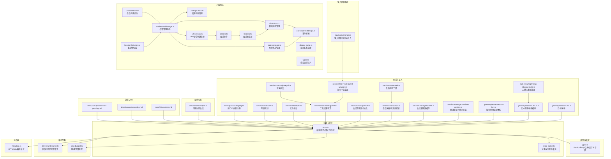
```mermaid
graph TB
subgraph "类型与模型"
T1["types.ts<br/>SessionEntry/合并/运行时字段"]
end
subgraph "存储与缓存"
S1["store.ts<br/>加载/写入/锁队列/维护"]
SC["store-cache.ts<br/>对象与序列化缓存"]
end
subgraph "维护策略"
M1["store-maintenance.ts<br/>修剪/封顶/轮转/警告"]
D1["disk-budget.ts<br/>磁盘预算清理"]
end
subgraph "元数据"
MD["metadata.ts<br/>派生origin/群组补丁"]
end
subgraph "网关与工具"
G1["gateway/session-utils.ts<br/>目标解析"]
GFS["gateway/session-utils.fs.ts<br/>文本清理/标题缓存"]
GSK["gateway/server-session-key.ts<br/>运行ID会话键解析"]
SIM["auto-reply/reply/strip-inbound-meta.ts<br/>入站元数据清理"]
R1["session-manager-runtime-registry.ts<br/>会话级运行时注册表"]
RC["session-manager-cache.ts<br/>会话管理器缓存"]
SR["sessions-resolution.ts<br/>会话解析/可见性检查"]
SST["session-status-tool.ts<br/>会话状态工具"]
SMI["session-manager-init.ts<br/>会话管理器初始化"]
SG["session-tool-result-guard.ts<br/>工具结果守卫"]
SGW["session-tool-result-guard-wrapper.ts<br/>运行ID包装器"]
STR["session-transcript-repair.ts<br/>转录修复"]
SFR["session-file-repair.ts<br/>文件修复"]
SWL["session-write-lock.ts<br/>写锁机制"]
BPR["bash-process-registry.ts<br/>运行ID进程注册"]
end
subgraph "输入溯源系统"
IPS["input-provenance.ts<br/>输入溯源/运行ID注入"]
end
subgraph "UI 层集成"
USM["useSessionManager.ts<br/>会话管理钩子"]
URL["url-session.ts<br/>URL哈希参数处理"]
ACT["actions.ts<br/>会话操作"]
LD["loaders.ts<br/>会话加载器"]
DN["display-name.ts<br/>显示名称处理"]
TY["types.ts<br/>会话类型定义"]
CS["ChatSidebar.tsx<br/>会话列表组件"]
SS["SessionSelector.tsx<br/>兼容性包装"]
CSS["chat.store.ts<br/>聊天状态管理"]
GS["gateway.store.ts<br/>网关状态管理"]
STS["settings.store.ts<br/>设置状态管理"]
CEB["useChatEventBridge.ts<br/>事件桥接"]
end
subgraph "定时任务"
CR["cron/session-reaper.ts<br/>清理过期会话"]
end
subgraph "文档与CLI"
DOC1["docs/concepts/session.md"]
DOC2["docs/concepts/session-pruning.md"]
CLI1["docs/cli/sessions.md"]
end
S1 --> T1
S1 --> SC
S1 --> M1
S1 --> D1
S1 --> MD
G1 --> S1
GFS --> S1
GSK --> S1
SIM --> GFS
R1 --> S1
RC --> S1
SR --> S1
SST --> SR
SMI --> S1
SG --> S1
SGW --> SG
STR --> SG
SFR --> S1
SWL --> S1
BPR --> S1
IPS --> SGW
CR --> S1
USM --> CSS
USM --> GS
USM --> STS
USM --> URL
URL --> ACT
ACT --> LD
LD --> CSS
CS --> USM
SS --> USM
CSS --> CEB
GS --> CEB
CLI1 --> S1
DOC1 --> S1
DOC2 --> S1
```

**图表来源**
- [src/config/sessions/store.ts:1-800](file://src/config/sessions/store.ts#L1-L800)
- [src/config/sessions/types.ts:1-380](file://src/config/sessions/types.ts#L1-L380)
- [src/config/sessions/store-cache.ts:1-82](file://src/config/sessions/store-cache.ts#L1-L82)
- [src/config/sessions/store-maintenance.ts:1-328](file://src/config/sessions/store-maintenance.ts#L1-L328)
- [src/config/sessions/disk-budget.ts:1-376](file://src/config/sessions/disk-budget.ts#L1-L376)
- [src/config/sessions/metadata.ts:1-173](file://src/config/sessions/metadata.ts#L1-L173)
- [src/gateway/session-utils.ts:480-503](file://src/gateway/session-utils.ts#L480-L503)
- [src/gateway/session-utils.fs.ts:368-392](file://src/gateway/session-utils.fs.ts#L368-L392)
- [src/gateway/server-session-key.ts:1-23](file://src/gateway/server-session-key.ts#L1-L23)
- [src/auto-reply/reply/strip-inbound-meta.ts:108-178](file://src/auto-reply/reply/strip-inbound-meta.ts#L108-L178)
- [src/agents/pi-extensions/session-manager-runtime-registry.ts:1-29](file://src/agents/pi-extensions/session-manager-runtime-registry.ts#L1-L29)
- [src/agents/pi-embedded-runner/session-manager-cache.ts:1-69](file://src/agents/pi-embedded-runner/session-manager-cache.ts#L1-L69)
- [src/agents/pi-embedded-runner/session-manager-init.ts:1-54](file://src/agents/pi-embedded-runner/session-manager-init.ts#L1-L54)
- [src/agents/session-tool-result-guard.ts:1-267](file://src/agents/session-tool-result-guard.ts#L1-L267)
- [src/agents/session-tool-result-guard-wrapper.ts:1-97](file://src/agents/session-tool-result-guard-wrapper.ts#L1-L97)
- [src/agents/session-transcript-repair.ts:1-503](file://src/agents/session-transcript-repair.ts#L1-L503)
- [src/agents/session-file-repair.ts:1-110](file://src/agents/session-file-repair.ts#L1-L110)
- [src/agents/session-write-lock.ts:1-561](file://src/agents/session-write-lock.ts#L1-L561)
- [src/agents/bash-process-registry.ts:82-102](file://src/agents/bash-process-registry.ts#L82-L102)
- [src/agents/tools/sessions-resolution.ts:1-330](file://src/agents/tools/sessions-resolution.ts#L1-L330)
- [src/agents/tools/session-status-tool.ts:234-259](file://src/agents/tools/session-status-tool.ts#L234-L259)
- [src/commands/agent/session.ts:144-146](file://src/commands/agent/session.ts#L144-L146)
- [src/infra/secure-random.ts:1-10](file://src/infra/secure-random.ts#L1-L10)
- [src/sessions/session-id.ts:1-5](file://src/sessions/session-id.ts#L1-L5)
- [src/sessions/input-provenance.ts:1-82](file://src/sessions/input-provenance.ts#L1-L82)
- [src/acp/session-mapper.ts:38-98](file://src/acp/session-mapper.ts#L38-L98)
- [src/cron/session-reaper.ts:81-109](file://src/cron/session-reaper.ts#L81-L109)
- [ui-react/src/hooks/useSessionManager.ts:33-53](file://ui-react/src/hooks/useSessionManager.ts#L33-L53)
- [ui-react/src/hooks/useSessionManager.ts:266-271](file://ui-react/src/hooks/useSessionManager.ts#L266-L271)
- [ui-react/src/store/chat.store.ts:154-156](file://ui-react/src/store/chat.store.ts#L154-L156)
- [src/memory/session-files.ts:39-72](file://src/memory/session-files.ts#L39-L72)
- [src/sessions/transcript-events.ts:16-29](file://src/sessions/transcript-events.ts#L16-L29)
- [docs/concepts/session.md:74-120](file://docs/concepts/session.md#L74-L120)
- [docs/concepts/session-pruning.md:1-122](file://docs/concepts/session-pruning.md#L1-L122)
- [docs/cli/sessions.md:48-105](file://docs/cli/sessions.md#L48-L105)

## 核心组件
- 会话条目与运行时字段：定义会话键、最后更新时间、模型/提供方、发送策略、队列参数、令牌统计、记忆与压缩计数、ACP 元信息等
- 会话存储：提供加载、写入、合并、归一化、原子写入、并发写锁队列、维护（修剪/封顶/轮转/磁盘预算）、缓存
- 维护策略：按时间阈值修剪、按最大条目数封顶、文件轮转、磁盘预算清理、警告模式
- 元数据派生：从入站消息推导会话来源（provider/from/to/account/thread）与群组标签
- 网关与工具：网关侧会话目标解析、会话管理器缓存与运行时注册表、定时清理过期会话
- **运行ID跟踪系统**：新增runId参数支持，实现跨会话消息持久化和运行上下文追踪，支持运行ID到会话键的映射
- **会话工具结果保护**：增强的工具结果守卫，支持工具结果截断、规范化和合成缺失的工具结果，新增transformMessageForPersistence函数
- **会话文件修复**：自动检测和修复损坏的会话文件，包括JSON解析错误和无效头信息
- **会话写锁机制**：改进的并发控制，支持进程PID回收检测、超时持有检测和自动清理
- **会话初始化**：改进的会话管理器初始化流程，确保会话文件的一致性和完整性
- **会话缓存优化**：增强的缓存策略，支持TTL缓存和文件预热功能
- **会话同步功能**：增强的同步机制，支持事件通知和状态更新
- **URL哈希参数会话键处理**：新增URL会话工具函数，支持从URL哈希参数提取会话键、构建带会话键的哈希和设置会话键到URL
- 文档与 CLI：会话概念、修剪策略、清理命令使用

**章节来源**
- [src/config/sessions/types.ts:68-171](file://src/config/sessions/types.ts#L68-L171)
- [src/config/sessions/store.ts:195-270](file://src/config/sessions/store.ts#L195-L270)
- [src/config/sessions/store.ts:511-533](file://src/config/sessions/store.ts#L511-L533)
- [src/config/sessions/store-maintenance.ts:130-148](file://src/config/sessions/store-maintenance.ts#L130-L148)
- [src/config/sessions/disk-budget.ts:188-375](file://src/config/sessions/disk-budget.ts#L188-L375)
- [src/config/sessions/metadata.ts:45-87](file://src/config/sessions/metadata.ts#L45-L87)
- [src/gateway/session-utils.ts:480-503](file://src/gateway/session-utils.ts#L480-L503)
- [src/gateway/server-session-key.ts:6-22](file://src/gateway/server-session-key.ts#L6-L22)
- [src/gateway/session-utils.fs.ts:378-392](file://src/gateway/session-utils.fs.ts#L378-L392)
- [src/auto-reply/reply/strip-inbound-meta.ts:108-178](file://src/auto-reply/reply/strip-inbound-meta.ts#L108-L178)
- [src/agents/pi-extensions/session-manager-runtime-registry.ts:1-29](file://src/agents/pi-extensions/session-manager-runtime-registry.ts#L1-L29)
- [src/agents/pi-embedded-runner/session-manager-cache.ts:24-69](file://src/agents/pi-embedded-runner/session-manager-cache.ts#L24-L69)
- [src/agents/pi-embedded-runner/session-manager-init.ts:16-54](file://src/agents/pi-embedded-runner/session-manager-init.ts#L16-L54)
- [src/agents/session-tool-result-guard.ts:71-267](file://src/agents/session-tool-result-guard.ts#L71-L267)
- [src/agents/session-tool-result-guard-wrapper.ts:66-84](file://src/agents/session-tool-result-guard-wrapper.ts#L66-L84)
- [src/agents/session-transcript-repair.ts:188-503](file://src/agents/session-transcript-repair.ts#L188-L503)
- [src/agents/session-file-repair.ts:19-110](file://src/agents/session-file-repair.ts#L19-L110)
- [src/agents/session-write-lock.ts:444-561](file://src/agents/session-write-lock.ts#L444-L561)
- [src/agents/bash-process-registry.ts:82-102](file://src/agents/bash-process-registry.ts#L82-L102)
- [src/agents/tools/sessions-resolution.ts:260-330](file://src/agents/tools/sessions-resolution.ts#L260-L330)
- [src/agents/tools/session-status-tool.ts:234-259](file://src/agents/tools/session-status-tool.ts#L234-L259)
- [src/commands/agent/session.ts:144-146](file://src/commands/agent/session.ts#L144-L146)
- [src/infra/secure-random.ts:1-10](file://src/infra/secure-random.ts#L1-L10)
- [src/sessions/session-id.ts:1-5](file://src/sessions/session-id.ts#L1-L5)
- [src/sessions/input-provenance.ts:50-68](file://src/sessions/input-provenance.ts#L50-L68)
- [src/acp/session-mapper.ts:38-98](file://src/acp/session-mapper.ts#L38-L98)
- [src/cron/session-reaper.ts:81-109](file://src/cron/session-reaper.ts#L81-L109)
- [ui-react/src/hooks/useSessionManager.ts:33-53](file://ui-react/src/hooks/useSessionManager.ts#L33-L53)
- [ui-react/src/hooks/useSessionManager.ts:266-271](file://ui-react/src/hooks/useSessionManager.ts#L266-L271)
- [ui-react/src/store/chat.store.ts:154-156](file://ui-react/src/store/chat.store.ts#L154-L156)
- [src/memory/session-files.ts:39-72](file://src/memory/session-files.ts#L39-L72)
- [src/sessions/transcript-events.ts:16-29](file://src/sessions/transcript-events.ts#L16-L29)
- [ui-react/src/hooks/useSessionManager.ts:19-138](file://ui-react/src/hooks/useSessionManager.ts#L19-L138)
- [ui-react/src/components/chat/ChatSidebar.tsx:19-116](file://ui-react/src/components/chat/ChatSidebar.tsx#L19-L116)
- [ui-react/src/hooks/session-manager/url-session.ts:1-39](file://ui-react/src/hooks/session-manager/url-session.ts#L1-L39)
- [docs/concepts/session.md:74-120](file://docs/concepts/session.md#L74-L120)
- [docs/concepts/session-pruning.md:1-122](file://docs/concepts/session-pruning.md#L1-L122)
- [docs/cli/sessions.md:48-105](file://docs/cli/sessions.md#L48-L105)

## 架构总览
会话管理围绕"会话存储文件 + 会话条目 + 维护策略 + 缓存/锁队列 + 元数据派生 + 网关/工具集成 + 运行ID跟踪系统 + 会话工具结果保护 + 会话文件修复 + 会话写锁机制 + 会话初始化 + 会话缓存优化 + 会话同步功能 + URL哈希参数会话键处理"的闭环展开。写入路径在保存前执行维护，读取路径支持缓存；维护策略可警告或强制执行；磁盘预算在强制模式下按旧文件与旧会话条目清理。

**重要架构变更**：会话管理器已完全重构，引入了新的加载器架构、更好的错误处理和增强的同步功能。新增了运行ID跟踪系统，支持跨会话的消息持久化和运行上下文追踪。增强了会话工具结果保护机制，包括transformMessageForPersistence函数和runId参数支持。引入了会话文件修复功能，自动检测和修复损坏的会话文件。改进了会话写锁机制，提供了更强的并发控制和死锁预防能力。**最新更新**：UI会话管理器现在正确处理来自URL哈希参数的会话键，确保应用程序界面中的会话状态一致性。

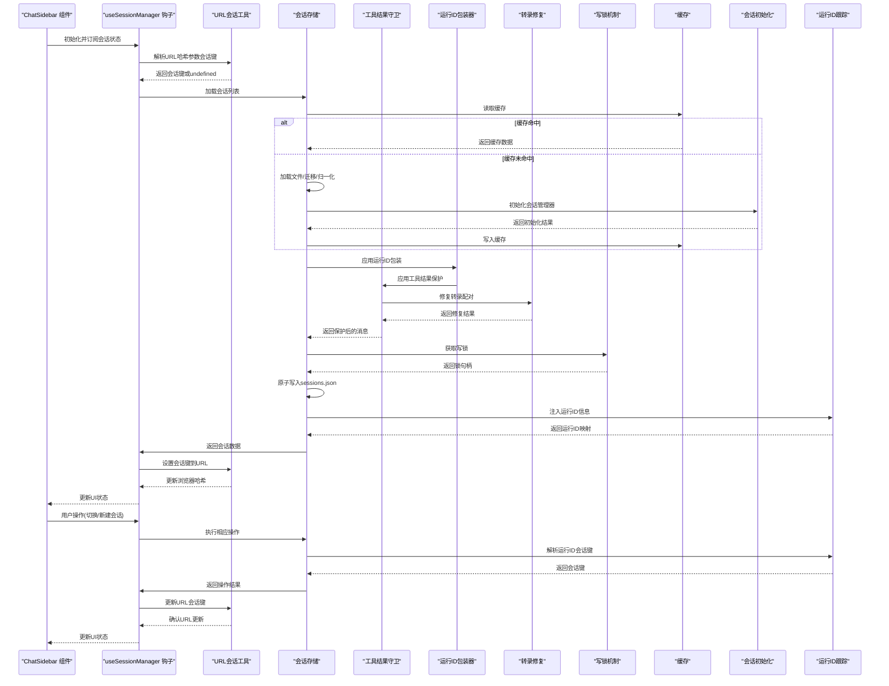
```mermaid
sequenceDiagram
participant UI as "ChatSidebar 组件"
participant Hook as "useSessionManager 钩子"
participant URL as "URL会话工具"
participant Store as "会话存储"
participant Guard as "工具结果守卫"
participant Wrapper as "运行ID包装器"
participant Repair as "转录修复"
participant Lock as "写锁机制"
participant Cache as "缓存"
participant Init as "会话初始化"
participant RunID as "运行ID跟踪"
UI->>Hook : 初始化并订阅会话状态
Hook->>URL : 解析URL哈希参数会话键
URL-->>Hook : 返回会话键或undefined
Hook->>Store : 加载会话列表
Store->>Cache : 读取缓存
alt 缓存命中
Cache-->>Store : 返回缓存数据
else 缓存未命中
Store->>Store : 加载文件/迁移/归一化
Store->>Init : 初始化会话管理器
Init-->>Store : 返回初始化结果
Store->>Cache : 写入缓存
end
Store->>Wrapper : 应用运行ID包装
Wrapper->>Guard : 应用工具结果保护
Guard->>Repair : 修复转录配对
Repair-->>Guard : 返回修复结果
Guard-->>Store : 返回保护后的消息
Store->>Lock : 获取写锁
Lock-->>Store : 返回锁句柄
Store->>Store : 原子写入sessions.json
Store->>RunID : 注入运行ID信息
RunID-->>Store : 返回运行ID映射
Store->>Hook : 返回会话数据
Hook->>URL : 设置会话键到URL
URL-->>Hook : 更新浏览器哈希
Hook-->>UI : 更新UI状态
UI->>Hook : 用户操作(切换/新建会话)
Hook->>Store : 执行相应操作
Store->>RunID : 解析运行ID会话键
RunID-->>Store : 返回会话键
Store->>Hook : 返回操作结果
Hook->>URL : 更新URL会话键
URL-->>Hook : 确认URL更新
Hook-->>UI : 更新UI状态
```

**图表来源**
- [src/config/sessions/store.ts:340-509](file://src/config/sessions/store.ts#L340-L509)
- [src/config/sessions/store-maintenance.ts:130-148](file://src/config/sessions/store-maintenance.ts#L130-L148)
- [src/config/sessions/disk-budget.ts:188-375](file://src/config/sessions/disk-budget.ts#L188-L375)
- [src/config/sessions/store-cache.ts:41-81](file://src/config/sessions/store-cache.ts#L41-L81)
- [src/commands/agent/session.ts:144-146](file://src/commands/agent/session.ts#L144-L146)
- [ui-react/src/hooks/useSessionManager.ts:29-126](file://ui-react/src/hooks/useSessionManager.ts#L29-L126)
- [ui-react/src/hooks/useSessionManager.ts:266-271](file://ui-react/src/hooks/useSessionManager.ts#L266-L271)
- [ui-react/src/hooks/session-manager/url-session.ts:10-39](file://ui-react/src/hooks/session-manager/url-session.ts#L10-L39)
- [src/gateway/session-utils.fs.ts:378-392](file://src/gateway/session-utils.fs.ts#L378-L392)
- [src/gateway/server-session-key.ts:6-22](file://src/gateway/server-session-key.ts#L6-L22)
- [src/agents/session-tool-result-guard.ts:71-267](file://src/agents/session-tool-result-guard.ts#L71-L267)
- [src/agents/session-tool-result-guard-wrapper.ts:66-84](file://src/agents/session-tool-result-guard-wrapper.ts#L66-L84)
- [src/agents/session-transcript-repair.ts:342-503](file://src/agents/session-transcript-repair.ts#L342-L503)
- [src/agents/session-write-lock.ts:444-561](file://src/agents/session-write-lock.ts#L444-L561)
- [src/agents/pi-embedded-runner/session-manager-init.ts:16-54](file://src/agents/pi-embedded-runner/session-manager-init.ts#L16-L54)

## 详细组件分析

### 会话条目与合并策略
- 会话条目包含：会话标识、最后更新时间、模型/提供方、发送策略、队列参数、令牌统计、记忆/压缩计数、ACP 元信息、来源元数据等
- 合并策略：支持"触活动态"和"保留活动"两种策略，确保更新时间与会话 ID 的一致性与稳定性
- 运行时字段归一化：对模型/提供方进行去空白处理，避免冗余字段

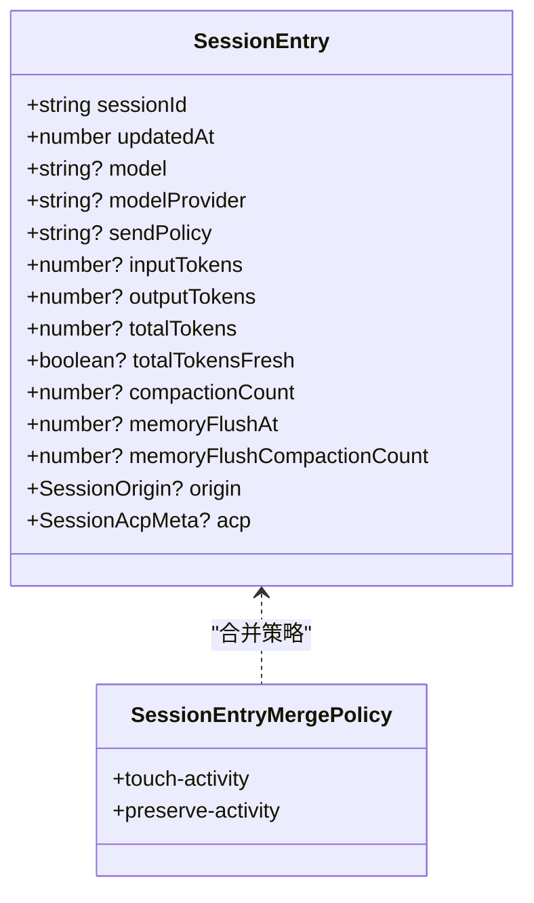
```mermaid
classDiagram
class SessionEntry {
+string sessionId
+number updatedAt
+string? model
+string? modelProvider
+string? sendPolicy
+number? inputTokens
+number? outputTokens
+number? totalTokens
+boolean? totalTokensFresh
+number? compactionCount
+number? memoryFlushAt
+number? memoryFlushCompactionCount
+SessionOrigin? origin
+SessionAcpMeta? acp
}
class SessionEntryMergePolicy {
+touch-activity
+preserve-activity
}
SessionEntry <.. SessionEntryMergePolicy : "合并策略"
```

**图表来源**
- [src/config/sessions/types.ts:68-171](file://src/config/sessions/types.ts#L68-L171)
- [src/config/sessions/types.ts:232-288](file://src/config/sessions/types.ts#L232-L288)

**章节来源**
- [src/config/sessions/types.ts:68-171](file://src/config/sessions/types.ts#L68-L171)
- [src/config/sessions/types.ts:178-272](file://src/config/sessions/types.ts#L178-L272)

### 会话存储与缓存
- 加载：支持缓存（TTL + mtime/size 校验）、Windows 下空文件重试、结构化克隆返回
- 写入：归一化、维护（修剪/封顶/轮转/磁盘预算）、原子写入、缓存更新
- 并发控制：基于文件锁的队列，避免竞态
- 入站元数据：派生 origin 与群组补丁，不刷新活动时间

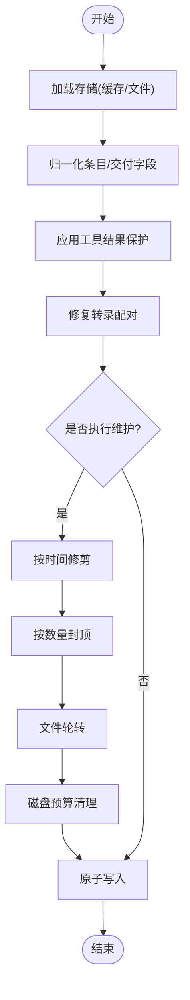
```mermaid
flowchart TD
Start(["开始"]) --> Load["加载存储(缓存/文件)"]
Load --> Normalize["归一化条目/交付字段"]
Normalize --> ToolGuard["应用工具结果保护"]
ToolGuard --> TranscriptRepair["修复转录配对"]
TranscriptRepair --> Maintenance{"是否执行维护?"}
Maintenance --> |是| Prune["按时间修剪"]
Prune --> Cap["按数量封顶"]
Cap --> Rotate["文件轮转"]
Rotate --> Budget["磁盘预算清理"]
Budget --> Atomic["原子写入"]
Maintenance --> |否| Atomic
Atomic --> End(["结束"])
```

**图表来源**
- [src/config/sessions/store.ts:195-270](file://src/config/sessions/store.ts#L195-L270)
- [src/config/sessions/store.ts:340-509](file://src/config/sessions/store.ts#L340-L509)
- [src/config/sessions/store-maintenance.ts:155-174](file://src/config/sessions/store-maintenance.ts#L155-L174)
- [src/config/sessions/store-maintenance.ts:226-259](file://src/config/sessions/store-maintenance.ts#L226-L259)
- [src/config/sessions/disk-budget.ts:188-375](file://src/config/sessions/disk-budget.ts#L188-L375)
- [src/gateway/session-utils.fs.ts:378-392](file://src/gateway/session-utils.fs.ts#L378-L392)
- [src/agents/session-tool-result-guard.ts:71-267](file://src/agents/session-tool-result-guard.ts#L71-L267)
- [src/agents/session-transcript-repair.ts:342-503](file://src/agents/session-transcript-repair.ts#L342-L503)

**章节来源**
- [src/config/sessions/store.ts:195-270](file://src/config/sessions/store.ts#L195-L270)
- [src/config/sessions/store.ts:511-533](file://src/config/sessions/store.ts#L511-L533)
- [src/config/sessions/store.ts:729-754](file://src/config/sessions/store.ts#L729-L754)
- [src/config/sessions/store.ts:756-800](file://src/config/sessions/store.ts#L756-L800)
- [src/config/sessions/store-cache.ts:41-81](file://src/config/sessions/store-cache.ts#L41-L81)

### 维护策略与修剪
- 时间修剪：删除 updatedAt 早于阈值的条目
- 数量封顶：保留最近更新的 N 条，其余按更新时间排序后删除
- 文件轮转：超过阈值大小重命名为 .bak.<timestamp>，最多保留 3 个备份
- 警告模式：仅报告不会实际删除
- 活跃会话保护：在强制模式下，若活跃会话会被删除则跳过

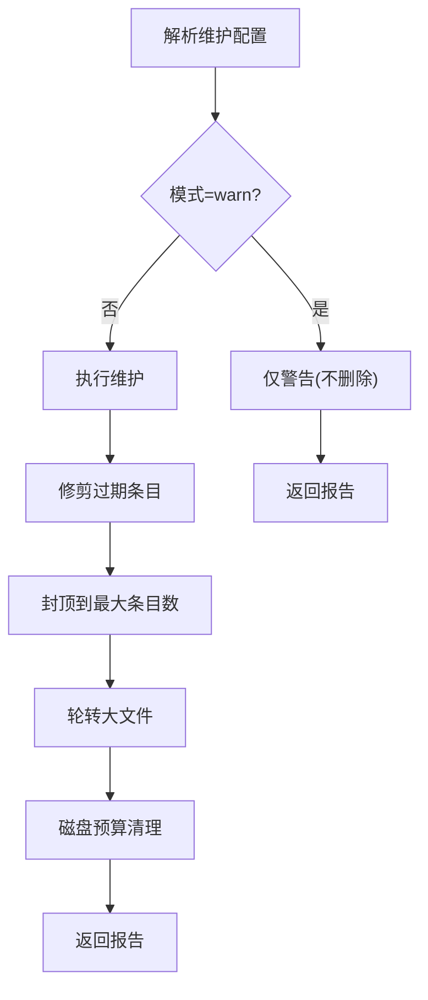
```mermaid
flowchart TD
A["解析维护配置"] --> B{"模式=warn?"}
B --> |是| W["仅警告(不删除)"]
B --> |否| C["执行维护"]
C --> P["修剪过期条目"]
P --> K["封顶到最大条目数"]
K --> R["轮转大文件"]
R --> D["磁盘预算清理"]
W --> E["返回报告"]
D --> F["返回报告"]
```

**图表来源**
- [src/config/sessions/store-maintenance.ts:130-148](file://src/config/sessions/store-maintenance.ts#L130-L148)
- [src/config/sessions/store-maintenance.ts:155-174](file://src/config/sessions/store-maintenance.ts#L155-L174)
- [src/config/sessions/store-maintenance.ts:226-259](file://src/config/sessions/store-maintenance.ts#L226-L259)
- [src/config/sessions/store-maintenance.ts:275-327](file://src/config/sessions/store-maintenance.ts#L275-L327)

**章节来源**
- [src/config/sessions/store-maintenance.ts:130-148](file://src/config/sessions/store-maintenance.ts#L130-L148)
- [src/config/sessions/store-maintenance.ts:155-174](file://src/config/sessions/store-maintenance.ts#L155-L174)
- [src/config/sessions/store-maintenance.ts:180-219](file://src/config/sessions/store-maintenance.ts#L180-L219)
- [src/config/sessions/store-maintenance.ts:226-259](file://src/config/sessions/store-maintenance.ts#L226-L259)
- [src/config/sessions/store-maintenance.ts:275-327](file://src/config/sessions/store-maintenance.ts#L275-L327)

### 磁盘预算清理
- 计算 sessions 目录总大小（不含当前 store 文件），超过上限时优先清理旧归档与主会话历史文件
- 若仍超限，则按最早更新时间删除条目，同时清理对应的会话历史文件
- 支持 dry-run 与 warn-only 模式

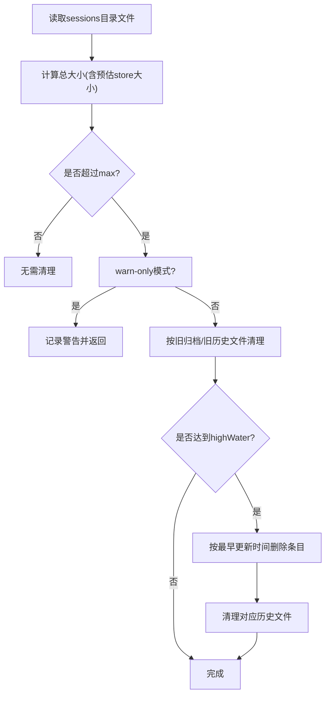
```mermaid
flowchart TD
S["读取sessions目录文件"] --> T["计算总大小(含预估store大小)"]
T --> J{"是否超过max?"}
J --> |否| OK["无需清理"]
J --> |是| W["warn-only模式?"]
W --> |是| WA["记录警告并返回"]
W --> |否| D["按旧归档/旧历史文件清理"]
D --> X{"是否达到highWater?"}
X --> |是| E["按最早更新时间删除条目"]
E --> Y["清理对应历史文件"]
X --> |否| Z["完成"]
Y --> Z
```

**图表来源**
- [src/config/sessions/disk-budget.ts:188-375](file://src/config/sessions/disk-budget.ts#L188-L375)

**章节来源**
- [src/config/sessions/disk-budget.ts:188-375](file://src/config/sessions/disk-budget.ts#L188-L375)

### 元数据派生与群组标签
- 从入站消息上下文派生会话来源（provider/from/to/account/thread），并合并到现有 origin
- 群组场景派生 chatType、channel、groupId、subject/groupChannel/space，并生成显示名

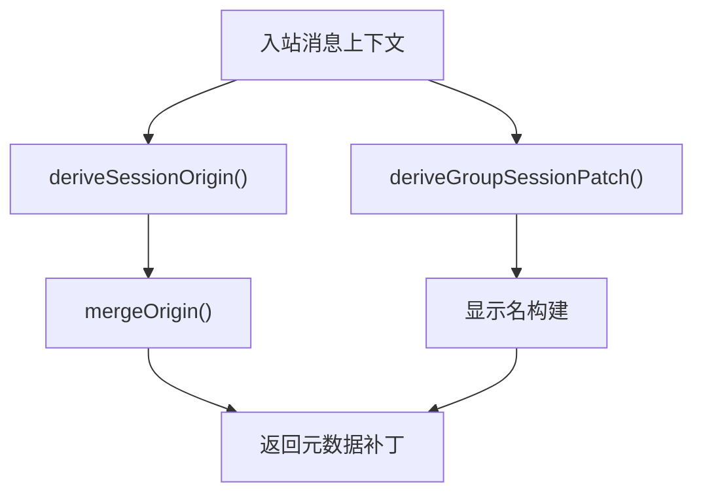
```mermaid
flowchart TD
In["入站消息上下文"] --> O["deriveSessionOrigin()"]
In --> G["deriveGroupSessionPatch()"]
O --> M["mergeOrigin()"]
G --> D["显示名构建"]
M --> Out["返回元数据补丁"]
D --> Out
```

**图表来源**
- [src/config/sessions/metadata.ts:45-87](file://src/config/sessions/metadata.ts#L45-L87)
- [src/config/sessions/metadata.ts:96-151](file://src/config/sessions/metadata.ts#L96-L151)
- [src/config/sessions/metadata.ts:153-172](file://src/config/sessions/metadata.ts#L153-L172)

**章节来源**
- [src/config/sessions/metadata.ts:45-87](file://src/config/sessions/metadata.ts#L45-L87)
- [src/config/sessions/metadata.ts:96-151](file://src/config/sessions/metadata.ts#L96-L151)
- [src/config/sessions/metadata.ts:153-172](file://src/config/sessions/metadata.ts#L153-L172)

### 网关与工具集成
- 网关侧会话目标解析：根据配置解析 agentId、storePath、规范化的 key 与候选 keys
- 会话管理器缓存：基于 TTL 的对象缓存与预热
- 会话管理器运行时注册表：以对象身份为键的弱映射，保持会话级运行时状态
- 定时清理：清理过期的 cron 会话键
- **运行ID会话键解析**：新增resolveSessionKeyForRun函数，支持运行ID到会话键的映射
- **会话解析与可见性**：改进的会话解析函数，支持 key-based 和 sessionId-based 解析，包含可见性检查
- **会话状态工具**：增强的会话状态检查，支持 A2A 策略和代理访问控制

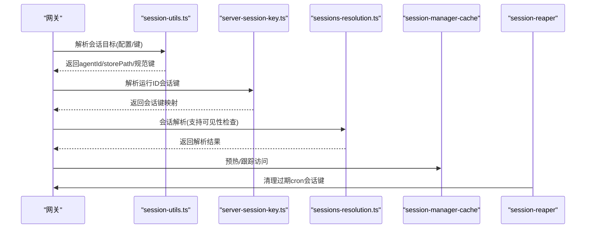
```mermaid
sequenceDiagram
participant GW as "网关"
participant SU as "session-utils.ts"
participant GSK as "server-session-key.ts"
participant SR as "sessions-resolution.ts"
participant SMC as "session-manager-cache"
participant CR as "session-reaper"
GW->>SU : 解析会话目标(配置/键)
SU-->>GW : 返回agentId/storePath/规范键
GW->>GSK : 解析运行ID会话键
GSK-->>GW : 返回会话键映射
GW->>SR : 会话解析(支持可见性检查)
SR-->>GW : 返回解析结果
GW->>SMC : 预热/跟踪访问
CR->>GW : 清理过期cron会话键
```

**图表来源**
- [src/gateway/session-utils.ts:480-503](file://src/gateway/session-utils.ts#L480-L503)
- [src/gateway/server-session-key.ts:6-22](file://src/gateway/server-session-key.ts#L6-L22)
- [src/agents/tools/sessions-resolution.ts:260-330](file://src/agents/tools/sessions-resolution.ts#L260-L330)
- [src/agents/pi-extensions/session-manager-runtime-registry.ts:1-29](file://src/agents/pi-extensions/session-manager-runtime-registry.ts#L1-L29)
- [src/agents/pi-embedded-runner/session-manager-cache.ts:24-69](file://src/agents/pi-embedded-runner/session-manager-cache.ts#L24-L69)
- [src/cron/session-reaper.ts:81-109](file://src/cron/session-reaper.ts#L81-L109)

**章节来源**
- [src/gateway/session-utils.ts:480-503](file://src/gateway/session-utils.ts#L480-L503)
- [src/gateway/server-session-key.ts:6-22](file://src/gateway/server-session-key.ts#L6-L22)
- [src/agents/tools/sessions-resolution.ts:260-330](file://src/agents/tools/sessions-resolution.ts#L260-L330)
- [src/agents/tools/session-status-tool.ts:234-259](file://src/agents/tools/session-status-tool.ts#L234-L259)
- [src/agents/pi-extensions/session-manager-runtime-registry.ts:1-29](file://src/agents/pi-extensions/session-manager-runtime-registry.ts#L1-L29)
- [src/agents/pi-embedded-runner/session-manager-cache.ts:24-69](file://src/agents/pi-embedded-runner/session-manager-cache.ts#L24-L69)
- [src/cron/session-reaper.ts:81-109](file://src/cron/session-reaper.ts#L81-L109)

### 运行ID跟踪系统

**更新**：新增运行ID跟踪系统，支持跨会话的消息持久化和运行上下文追踪。

#### 运行ID包装器功能
- **运行ID参数支持**：在guardSessionManager函数中新增runId参数，支持运行ID的传递和处理
- **运行ID注入**：transformMessageForPersistence函数支持运行ID注入，自动为符合条件的消息添加runId字段
- **运行ID验证**：对传入的runId进行字符串转换和空格清理，确保运行ID的有效性
- **条件注入**：仅对assistant、toolresult和tool_result角色的消息注入运行ID，避免对其他消息类型的影响

#### 输入溯源增强
- **运行ID关联**：applyInputProvenanceToUserMessage函数支持运行ID的关联，为用户消息添加输入溯源信息
- **消息类型过滤**：仅对用户消息进行输入溯源处理，保持消息类型的正确性
- **现有溯源保护**：如果消息已存在溯源信息，则不覆盖现有信息

#### 会话键解析
- **运行ID映射**：resolveSessionKeyForRun函数支持运行ID到会话键的映射，实现跨会话的追踪
- **缓存机制**：使用getAgentRunContext和registerAgentRunContext实现运行ID的缓存
- **配置加载**：通过loadConfig和resolveStorePath获取会话配置信息
- **会话查找**：遍历会话存储，根据sessionId查找对应的会话键

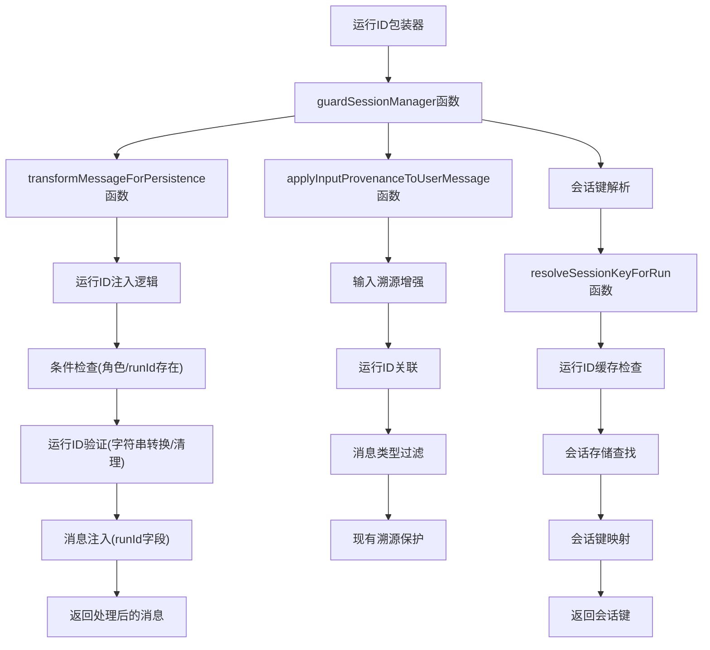
```mermaid
flowchart TD
A["运行ID包装器"] --> B["guardSessionManager函数"]
B --> C["transformMessageForPersistence函数"]
C --> D["运行ID注入逻辑"]
D --> E["条件检查(角色/runId存在)"]
E --> F["运行ID验证(字符串转换/清理)"]
F --> G["消息注入(runId字段)"]
G --> H["返回处理后的消息"]
B --> I["applyInputProvenanceToUserMessage函数"]
I --> J["输入溯源增强"]
J --> K["运行ID关联"]
K --> L["消息类型过滤"]
L --> M["现有溯源保护"]
B --> N["会话键解析"]
N --> O["resolveSessionKeyForRun函数"]
O --> P["运行ID缓存检查"]
P --> Q["会话存储查找"]
Q --> R["会话键映射"]
R --> S["返回会话键"]
```

**图表来源**
- [src/agents/session-tool-result-guard-wrapper.ts:20-96](file://src/agents/session-tool-result-guard-wrapper.ts#L20-L96)
- [src/agents/session-tool-result-guard-wrapper.ts:66-84](file://src/agents/session-tool-result-guard-wrapper.ts#L66-L84)
- [src/sessions/input-provenance.ts:50-68](file://src/sessions/input-provenance.ts#L50-L68)
- [src/gateway/server-session-key.ts:6-22](file://src/gateway/server-session-key.ts#L6-L22)

**章节来源**
- [src/agents/session-tool-result-guard-wrapper.ts:20-96](file://src/agents/session-tool-result-guard-wrapper.ts#L20-L96)
- [src/sessions/input-provenance.ts:50-68](file://src/sessions/input-provenance.ts#L50-L68)
- [src/gateway/server-session-key.ts:6-22](file://src/gateway/server-session-key.ts#L6-L22)

### 会话工具结果保护机制

**更新**：增强的会话工具结果保护机制，包括transformMessageForPersistence函数和runId参数支持。

#### 工具结果守卫功能
- **工具结果截断**：自动截断过大的工具结果内容，防止占用整个上下文窗口
- **工具结果规范化**：标准化工具结果名称，移除多余空白字符
- **合成缺失工具结果**：为未找到的工具结果插入合成的错误结果，满足严格提供商的要求
- **工具调用输入修复**：修复不完整的工具调用输入，移除无效的工具调用块
- **消息持久化转换**：新增transformMessageForPersistence函数，支持运行ID注入和消息转换

#### 转录修复功能
- **工具调用结果配对修复**：确保工具调用与其结果正确配对，移动或插入缺失的结果
- **重复工具结果处理**：识别和删除重复的工具结果
- **孤立工具结果清理**：移除不在任何工具调用范围内的孤立工具结果
- **工具调用输入验证**：验证工具调用的名称、ID和输入参数的有效性

#### 插件SDK支持
- **类型定义**：新增transformMessageForPersistence选项的类型定义
- **插件钩子**：支持before_message_write和tool_result_persist插件钩子
- **同步转换**：提供同步的消息转换和工具结果转换功能

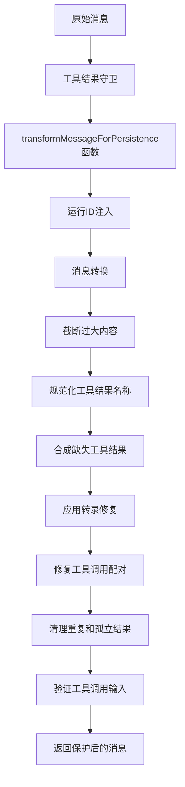
```mermaid
flowchart TD
A["原始消息"] --> B["工具结果守卫"]
B --> C["transformMessageForPersistence函数"]
C --> D["运行ID注入"]
D --> E["消息转换"]
E --> F["截断过大内容"]
F --> G["规范化工具结果名称"]
G --> H["合成缺失工具结果"]
H --> I["应用转录修复"]
I --> J["修复工具调用配对"]
J --> K["清理重复和孤立结果"]
K --> L["验证工具调用输入"]
L --> M["返回保护后的消息"]
```

**图表来源**
- [src/agents/session-tool-result-guard.ts:71-267](file://src/agents/session-tool-result-guard.ts#L71-L267)
- [src/agents/session-tool-result-guard-wrapper.ts:66-84](file://src/agents/session-tool-result-guard-wrapper.ts#L66-L84)
- [src/agents/session-transcript-repair.ts:342-503](file://src/agents/session-transcript-repair.ts#L342-L503)
- [apps/electron/release/mac-arm64/Bossim.app/Contents/Resources/openclaw/dist/plugin-sdk/agents/session-tool-result-guard.d.ts:4-38](file://apps/electron/release/mac-arm64/Bossim.app/Contents/Resources/openclaw/dist/plugin-sdk/agents/session-tool-result-guard.d.ts#L4-L38)

**章节来源**
- [src/agents/session-tool-result-guard.ts:71-267](file://src/agents/session-tool-result-guard.ts#L71-L267)
- [src/agents/session-tool-result-guard-wrapper.ts:66-84](file://src/agents/session-tool-result-guard-wrapper.ts#L66-L84)
- [src/agents/session-transcript-repair.ts:188-503](file://src/agents/session-transcript-repair.ts#L188-L503)
- [apps/electron/release/mac-arm64/Bossim.app/Contents/Resources/openclaw/dist/plugin-sdk/agents/session-tool-result-guard.d.ts:4-38](file://apps/electron/release/mac-arm64/Bossim.app/Contents/Resources/openclaw/dist/plugin-sdk/agents/session-tool-result-guard.d.ts#L4-L38)

### 会话文件修复功能

**更新**：新增会话文件自动修复功能，能够检测和修复损坏的会话文件。

#### 文件修复机制
- **JSON解析错误检测**：自动检测并修复JSON解析错误的行
- **无效头信息验证**：验证会话文件的头部信息有效性
- **自动备份创建**：在修复前自动创建备份文件
- **安全写入机制**：使用临时文件和原子重命名确保修复过程的安全性
- **错误恢复处理**：在修复失败时自动回滚并提供详细的错误信息

#### 修复流程
- **文件读取与解析**：读取会话文件内容并尝试解析每一行
- **损坏行识别**：识别无法解析的JSON行并统计数量
- **内容重建**：重建有效的会话内容，移除损坏的行
- **备份与重命名**：创建备份文件并安全地重命名修复后的内容
- **状态报告**：提供详细的修复报告，包括修复的行数和原因

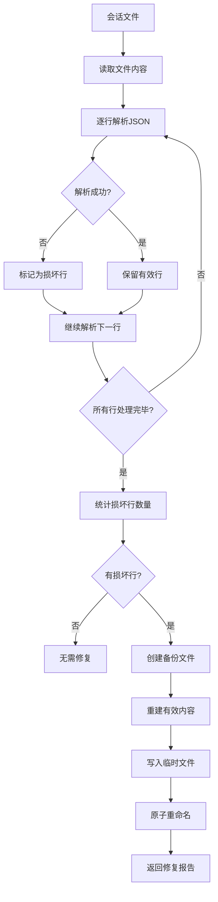
```mermaid
flowchart TD
A["会话文件"] --> B["读取文件内容"]
B --> C["逐行解析JSON"]
C --> D{"解析成功?"}
D --> |是| E["保留有效行"]
D --> |否| F["标记为损坏行"]
F --> G["继续解析下一行"]
E --> G
G --> H{"所有行处理完毕?"}
H --> |否| C
H --> |是| I["统计损坏行数量"]
I --> J{"有损坏行?"}
J --> |否| K["无需修复"]
J --> |是| L["创建备份文件"]
L --> M["重建有效内容"]
M --> N["写入临时文件"]
N --> O["原子重命名"]
O --> P["返回修复报告"]
```

**图表来源**
- [src/agents/session-file-repair.ts:19-110](file://src/agents/session-file-repair.ts#L19-L110)

**章节来源**
- [src/agents/session-file-repair.ts:19-110](file://src/agents/session-file-repair.ts#L19-L110)

### 会话写锁机制

**更新**：改进的会话写锁机制，提供更强的并发控制和死锁预防能力。

#### 写锁功能特性
- **进程PID回收检测**：检测并处理PID回收导致的锁文件冲突
- **超时持有检测**：监控锁的持有时间，自动释放超时的锁
- **孤儿锁清理**：识别并清理孤儿锁文件，防止资源泄漏
- **重入锁支持**：支持同一进程的重入锁调用
- **信号处理**：优雅处理进程终止信号，确保锁的正确释放

#### 锁管理机制
- **锁文件结构**：包含进程ID、创建时间和进程启动时间的JSON负载
- **锁状态检查**：定期检查锁文件的有效性和状态
- **自动清理策略**：基于时间戳和进程状态的自动清理机制
- **错误恢复**：在网络异常或文件系统错误时的恢复策略

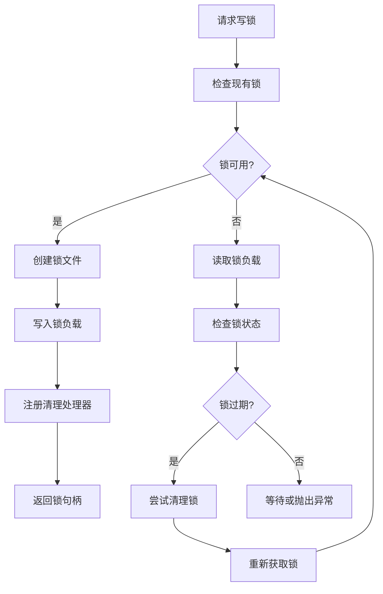
```mermaid
flowchart TD
A["请求写锁"] --> B["检查现有锁"]
B --> C{"锁可用?"}
C --> |是| D["创建锁文件"]
D --> E["写入锁负载"]
E --> F["注册清理处理器"]
F --> G["返回锁句柄"]
C --> |否| H["读取锁负载"]
H --> I["检查锁状态"]
I --> J{"锁过期?"}
J --> |是| K["尝试清理锁"]
K --> L["重新获取锁"]
J --> |否| M["等待或抛出异常"]
L --> C
```

**图表来源**
- [src/agents/session-write-lock.ts:444-561](file://src/agents/session-write-lock.ts#L444-L561)

**章节来源**
- [src/agents/session-write-lock.ts:444-561](file://src/agents/session-write-lock.ts#L444-L561)

### 会话初始化流程

**更新**：改进的会话管理器初始化流程，确保会话文件的一致性和完整性。

#### 初始化功能
- **会话头信息更新**：为新创建的会话更新会话头信息
- **文件完整性检查**：检查现有会话文件的完整性
- **助手消息检测**：检测会话文件中是否存在助手消息
- **文件重置机制**：在必要时重置会话文件以确保正确的消息顺序
- **状态同步**：同步会话管理器的状态与文件系统状态

#### 初始化策略
- **新会话处理**：为新会话更新会话头信息和状态
- **现有会话修复**：检测并修复现有会话文件的问题
- **状态一致性**：确保会话管理器的内存状态与文件状态一致
- **错误处理**：在初始化过程中处理各种可能的错误情况

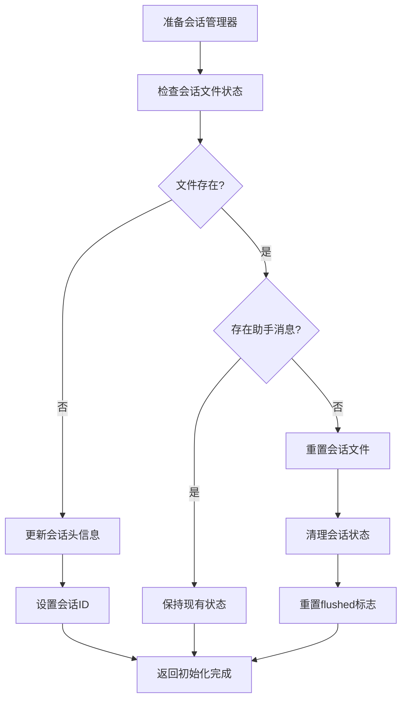
```mermaid
flowchart TD
A["准备会话管理器"] --> B["检查会话文件状态"]
B --> C{"文件存在?"}
C --> |否| D["更新会话头信息"]
D --> E["设置会话ID"]
E --> F["返回初始化完成"]
C --> |是| G{"存在助手消息?"}
G --> |是| H["保持现有状态"]
H --> F
G --> |否| I["重置会话文件"]
I --> J["清理会话状态"]
J --> K["重置flushed标志"]
K --> F
```

**图表来源**
- [src/agents/pi-embedded-runner/session-manager-init.ts:16-54](file://src/agents/pi-embedded-runner/session-manager-init.ts#L16-L54)

**章节来源**
- [src/agents/pi-embedded-runner/session-manager-init.ts:16-54](file://src/agents/pi-embedded-runner/session-manager-init.ts#L16-L54)

### 会话缓存优化

**更新**：增强的会话缓存策略，支持TTL缓存和文件预热功能。

#### 缓存功能
- **TTL缓存控制**：基于环境变量的缓存TTL配置
- **文件预热机制**：通过读取文件头部来预热操作系统页面缓存
- **缓存状态跟踪**：跟踪缓存条目的加载时间和状态
- **条件缓存启用**：根据TTL设置动态启用或禁用缓存
- **缓存一致性**：确保缓存与文件系统状态的一致性

#### 预热策略
- **小块读取**：使用4KB缓冲区读取文件头部
- **异步预热**：在后台异步执行文件预热操作
- **错误容忍**：在文件不存在时优雅处理，SessionManager会创建文件
- **性能优化**：利用操作系统的页面缓存提高后续读取性能

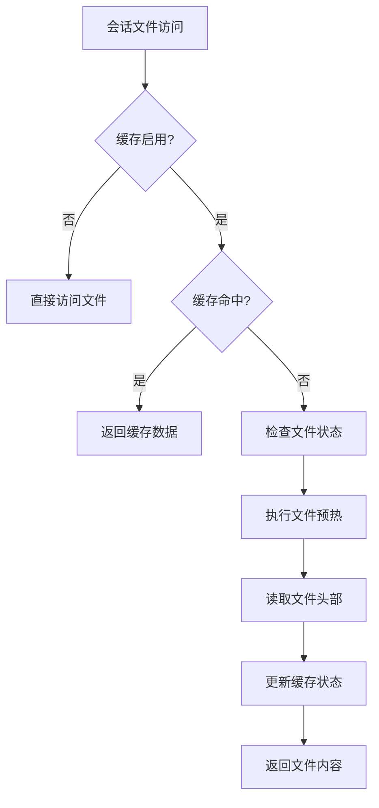
```mermaid
flowchart TD
A["会话文件访问"] --> B{"缓存启用?"}
B --> |否| C["直接访问文件"]
B --> |是| D{"缓存命中?"}
D --> |是| E["返回缓存数据"]
D --> |否| F["检查文件状态"]
F --> G["执行文件预热"]
G --> H["读取文件头部"]
H --> I["更新缓存状态"]
I --> J["返回文件内容"]
```

**图表来源**
- [src/agents/pi-embedded-runner/session-manager-cache.ts:24-69](file://src/agents/pi-embedded-runner/session-manager-cache.ts#L24-L69)

**章节来源**
- [src/agents/pi-embedded-runner/session-manager-cache.ts:24-69](file://src/agents/pi-embedded-runner/session-manager-cache.ts#L24-L69)

### 会话生命周期与状态同步
- 生命周期：会话在下一次入站消息时评估是否过期；支持每日重置与空闲重置；重置触发包括 /new 与 /reset
- 状态同步：UI 通过网关查询会话列表与令牌统计；会话条目包含输入/输出/总令牌与上下文令牌
- 记忆与压缩：在接近自动压缩时触发静默内存冲刷，提醒模型将笔记持久化
- **会话创建流程**：使用 crypto.randomUUID() 生成安全的会话 ID，移除了服务器端回退机制
- **增强的会话创建**：自动分配'New Session'标签，提升用户体验
- **运行ID集成**：新增运行ID参数支持，实现跨会话的消息持久化和运行上下文追踪
- **URL哈希参数集成**：新增URL会话工具函数，支持从URL哈希参数提取和设置会话键，确保会话状态一致性

**章节来源**
- [docs/concepts/session.md:207-218](file://docs/concepts/session.md#L207-L218)
- [docs/concepts/session.md:57-72](file://docs/concepts/session.md#L57-L72)
- [src/auto-reply/reply/agent-runner-memory.ts:523-566](file://src/auto-reply/reply/agent-runner-memory.ts#L523-L566)
- [src/commands/agent/session.ts:144-146](file://src/commands/agent/session.ts#L144-L146)
- [ui-react/src/hooks/useSessionManager.ts:258](file://ui-react/src/hooks/useSessionManager.ts#L258)
- [ui-react/src/hooks/session-manager/url-session.ts:10-39](file://ui-react/src/hooks/session-manager/url-session.ts#L10-L39)

### 会话工具结果保护与修剪
- 工具结果保护：在 LLM 请求前对旧工具结果进行修剪，不重写 JSONL 历史
- 修剪策略：按 TTL 与工具选择进行软修剪/硬清除，保留最近助手回复与图像块
- 与压缩区分：修剪是请求级瞬时行为，压缩是持久化摘要
- **运行ID支持**：新增transformMessageForPersistence函数，支持运行ID注入和消息转换

**章节来源**
- [docs/concepts/session-pruning.md:1-122](file://docs/concepts/session-pruning.md#L1-L122)

### 会话目录组织
- 存储文件：每个 agent 一个 sessions.json
- 历史文件：每个 sessionId 对应 .jsonl；群组/主题附加标识
- 归档：删除/重置后的历史文件归档，按保留策略清理

**章节来源**
- [docs/concepts/session.md:64-73](file://docs/concepts/session.md#L64-L73)

### 会话配置选项与状态查询
- 维护配置：模式、修剪时间、最大条目、轮转字节、磁盘上限与高水位、重置归档保留
- 发送策略：按通道/类型/键前缀拒绝或允许
- 状态查询：CLI 列表、网关 RPC 查询、/status 与 /context 查看
- **运行ID配置**：新增runId参数支持，用于运行ID跟踪和消息持久化
- **URL会话配置**：新增URL哈希参数会话键处理，支持会话状态的持久化和跨页面共享

**章节来源**
- [docs/concepts/session.md:74-120](file://docs/concepts/session.md#L74-L120)
- [docs/concepts/session.md:219-245](file://docs/concepts/session.md#L219-L245)
- [docs/cli/sessions.md:1-105](file://docs/cli/sessions.md#L1-L105)

### 会话管理器简化与改进

**更新**：会话管理器已完全简化，移除了服务器端会话创建回退机制，现在使用纯客户端会话密钥生成。

#### 纯客户端会话密钥生成
- 移除了服务器端 sessions.resolve 回退机制
- 使用 crypto.randomUUID() 生成安全的 UUID
- 确保会话 ID 的唯一性和安全性
- 保持向后兼容性，不影响现有功能

#### 随机化改进
- 使用 crypto.randomUUID() 提供更强的安全性
- crypto.randomBytes() 用于生成安全的随机令牌
- 支持自定义字节数的随机令牌生成
- 提供 URL 安全的 Base64 编码

#### 向后兼容性
- 保持现有的 API 和行为不变
- 现有的会话解析和可见性检查逻辑仍然有效
- ACP 会话映射器继续正常工作
- 网关会话解析功能保持不变

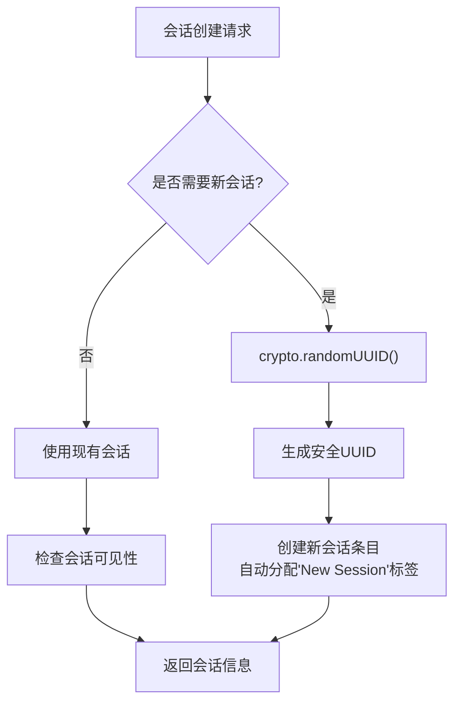
```mermaid
flowchart TD
A["会话创建请求"] --> B{"是否需要新会话?"}
B --> |是| C["crypto.randomUUID()"]
C --> D["生成安全UUID"]
D --> E["创建新会话条目<br/>自动分配'New Session'标签"]
B --> |否| F["使用现有会话"]
F --> G["检查会话可见性"]
G --> H["返回会话信息"]
E --> H
```

**图表来源**
- [src/commands/agent/session.ts:144-146](file://src/commands/agent/session.ts#L144-L146)
- [src/infra/secure-random.ts:1-10](file://src/infra/secure-random.ts#L1-L10)
- [src/agents/tools/sessions-resolution.ts:260-330](file://src/agents/tools/sessions-resolution.ts#L260-L330)
- [ui-react/src/hooks/useSessionManager.ts:258](file://ui-react/src/hooks/useSessionManager.ts#L258)

**章节来源**
- [src/commands/agent/session.ts:144-146](file://src/commands/agent/session.ts#L144-L146)
- [src/infra/secure-random.ts:1-10](file://src/infra/secure-random.ts#L1-L10)
- [src/sessions/session-id.ts:1-5](file://src/sessions/session-id.ts#L1-L5)
- [src/acp/session-mapper.ts:38-98](file://src/acp/session-mapper.ts#L38-L98)
- [ui-react/src/hooks/useSessionManager.ts:258](file://ui-react/src/hooks/useSessionManager.ts#L258)

### URL哈希参数会话键处理

**更新**：新增URL哈希参数会话键处理功能，UI会话管理器现在正确处理来自URL哈希参数的会话键，确保应用程序界面中的会话状态一致性。

#### URL会话工具函数
- **会话键解析**：getSessionKeyFromHash函数从URL哈希参数中提取会话键，支持sessionKey查询参数
- **哈希构建**：buildHashWithSessionKey函数构建包含会话键的新哈希，同时保留其他查询参数
- **会话键设置**：setSessionKeyInHash函数将会话键设置到URL哈希中，使用window.history.replaceState更新URL
- **浏览器兼容性**：在无window环境时提供安全的降级处理

#### 会话状态同步机制
- **初始加载**：useSessionManager钩子在初始化时解析URL哈希参数中的会话键
- **状态一致性**：当网关连接建立时，会话管理器确保URL哈希参数与应用内部状态保持一致
- **会话切换**：切换会话时自动更新URL哈希参数，实现会话状态的持久化
- **跨页面共享**：用户可以通过包含会话键的URL直接访问特定会话

#### 会话管理器集成
- **URL解析集成**：useSessionManager钩子集成了URL会话工具函数，优先使用URL中的会话键
- **状态同步**：会话切换操作通过persistSessionKey回调函数同步到URL
- **错误处理**：提供完整的错误处理和边界情况处理
- **测试覆盖**：包含完整的单元测试，确保功能的正确性和可靠性

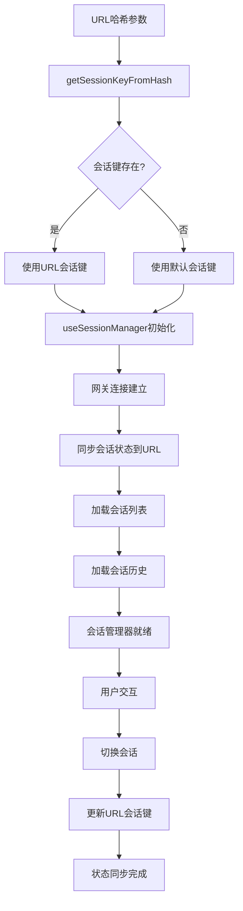
```mermaid
flowchart TD
A["URL哈希参数"] --> B["getSessionKeyFromHash"]
B --> C{"会话键存在?"}
C --> |是| D["使用URL会话键"]
C --> |否| E["使用默认会话键"]
D --> F["useSessionManager初始化"]
E --> F
F --> G["网关连接建立"]
G --> H["同步会话状态到URL"]
H --> I["加载会话列表"]
I --> J["加载会话历史"]
J --> K["会话管理器就绪"]
K --> L["用户交互"]
L --> M["切换会话"]
M --> N["更新URL会话键"]
N --> O["状态同步完成"]
```

**图表来源**
- [ui-react/src/hooks/session-manager/url-session.ts:10-39](file://ui-react/src/hooks/session-manager/url-session.ts#L10-L39)
- [ui-react/src/hooks/useSessionManager.ts:26-117](file://ui-react/src/hooks/useSessionManager.ts#L26-L117)
- [ui-react/src/hooks/session-manager/actions.ts:6-20](file://ui-react/src/hooks/session-manager/actions.ts#L6-L20)

**章节来源**
- [ui-react/src/hooks/session-manager/url-session.ts:1-39](file://ui-react/src/hooks/session-manager/url-session.ts#L1-L39)
- [ui-react/src/hooks/useSessionManager.ts:26-117](file://ui-react/src/hooks/useSessionManager.ts#L26-L117)
- [ui-react/src/hooks/session-manager/actions.ts:6-20](file://ui-react/src/hooks/session-manager/actions.ts#L6-L20)

## UI 层集成架构

### useSessionManager 钩子设计
useSessionManager 是新的会话管理核心，它封装了所有会话相关的状态管理和业务逻辑：

- **状态管理**：管理 sessions 列表、当前活动会话、加载状态
- **网关通信**：通过 gateway.store.client 发起 RPC 调用
- **历史加载**：支持按会话键加载历史消息，自动处理工具结果合并
- **会话切换**：无缝切换活动会话并更新 UI 状态
- **事件监听**：监听 chat.final 事件自动重新加载历史
- **文本清理**：提供 cleanSessionText 函数清理会话文本噪声
- **重新加载序列**：监控 pendingSessionsReloadSeq 实现智能重新加载
- **运行ID支持**：新增运行ID参数支持，实现跨会话的消息持久化
- **URL哈希参数集成**：新增URL会话工具函数集成，支持从URL哈希参数提取会话键

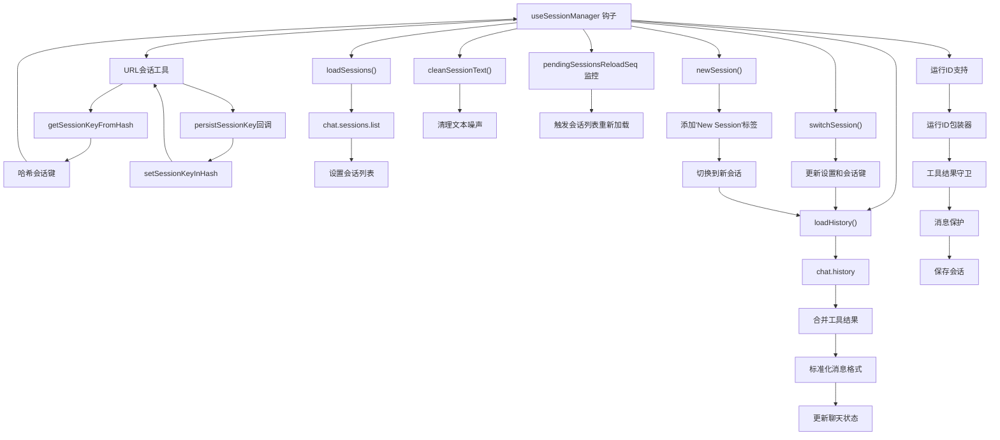
```mermaid
flowchart TD
USM["useSessionManager 钩子"] --> URL["URL会话工具"]
USM --> LS["loadSessions()"]
USM --> LH["loadHistory()"]
USM --> SS["switchSession()"]
USM --> NS["newSession()"]
USM --> CST["cleanSessionText()"]
USM --> PRS["pendingSessionsReloadSeq 监控"]
USM --> RID["运行ID支持"]
URL --> GSK["getSessionKeyFromHash"]
URL --> PSK["persistSessionKey回调"]
GSK --> HK["哈希会话键"]
PSK --> SH["setSessionKeyInHash"]
HK --> USM
SH --> URL
LS --> RPC1["chat.sessions.list"]
RPC1 --> SET1["设置会话列表"]
LH --> RPC2["chat.history"]
RPC2 --> MERGE["合并工具结果"]
MERGE --> NORMALIZE["标准化消息格式"]
NORMALIZE --> SET2["更新聊天状态"]
SS --> UPDATE["更新设置和会话键"]
UPDATE --> LH
NS --> ADD["添加'New Session'标签"]
ADD --> SWITCH["切换到新会话"]
SWITCH --> LH
CST --> CLEAN["清理文本噪声"]
PRS --> RELOAD["触发会话列表重新加载"]
RID --> WRAP["运行ID包装器"]
WRAP --> GUARD["工具结果守卫"]
GUARD --> PROTECT["消息保护"]
PROTECT --> SAVE["保存会话"]
```

**图表来源**
- [ui-react/src/hooks/useSessionManager.ts:29-109](file://ui-react/src/hooks/useSessionManager.ts#L29-L109)
- [ui-react/src/hooks/useSessionManager.ts:33-53](file://ui-react/src/hooks/useSessionManager.ts#L33-L53)
- [ui-react/src/hooks/useSessionManager.ts:266-271](file://ui-react/src/hooks/useSessionManager.ts#L266-L271)
- [ui-react/src/hooks/session-manager/url-session.ts:10-39](file://ui-react/src/hooks/session-manager/url-session.ts#L10-L39)

**章节来源**
- [ui-react/src/hooks/useSessionManager.ts:19-138](file://ui-react/src/hooks/useSessionManager.ts#L19-L138)
- [ui-react/src/hooks/useSessionManager.ts:33-53](file://ui-react/src/hooks/useSessionManager.ts#L33-L53)
- [ui-react/src/hooks/useSessionManager.ts:266-271](file://ui-react/src/hooks/useSessionManager.ts#L266-L271)
- [ui-react/src/hooks/session-manager/url-session.ts:10-39](file://ui-react/src/hooks/session-manager/url-session.ts#L10-L39)

### ChatSidebar 组件集成
ChatSidebar 是会话管理的主 UI 组件，直接消费 useSessionManager 钩子：

- **会话列表渲染**：显示所有可用会话，支持活动状态指示
- **会话操作**：提供新建会话按钮和会话切换功能
- **连接状态**：实时显示网关连接状态
- **无障碍支持**：完整的键盘导航和屏幕阅读器支持
- **标签显示**：显示会话标签，包括自动分配的'New Session'标签
- **运行ID显示**：显示运行ID相关信息，便于调试和追踪
- **URL会话支持**：支持从URL哈希参数加载会话，提升用户体验

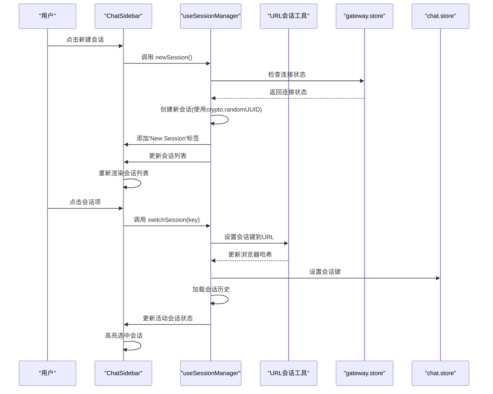
```mermaid
sequenceDiagram
participant User as "用户"
participant CS as "ChatSidebar"
participant USM as "useSessionManager"
participant URL as "URL会话工具"
participant GS as "gateway.store"
participant CS2 as "chat.store"
User->>CS : 点击新建会话
CS->>USM : 调用 newSession()
USM->>GS : 检查连接状态
GS-->>USM : 返回连接状态
USM->>USM : 创建新会话(使用crypto.randomUUID)
USM->>CS : 添加'New Session'标签
USM->>CS : 更新会话列表
CS->>CS : 重新渲染会话列表
User->>CS : 点击会话项
CS->>USM : 调用 switchSession(key)
USM->>URL : 设置会话键到URL
URL-->>USM : 更新浏览器哈希
USM->>CS2 : 设置会话键
USM->>USM : 加载会话历史
USM->>CS : 更新活动会话状态
CS->>CS : 高亮选中会话
```

**图表来源**
- [ui-react/src/components/chat/ChatSidebar.tsx:56-96](file://ui-react/src/components/chat/ChatSidebar.tsx#L56-L96)
- [ui-react/src/hooks/useSessionManager.ts:84-92](file://ui-react/src/hooks/useSessionManager.ts#L84-L92)
- [src/commands/agent/session.ts:144-146](file://src/commands/agent/session.ts#L144-L146)
- [ui-react/src/hooks/useSessionManager.ts:258](file://ui-react/src/hooks/useSessionManager.ts#L258)
- [ui-react/src/hooks/session-manager/url-session.ts:31-39](file://ui-react/src/hooks/session-manager/url-session.ts#L31-L39)

**章节来源**
- [ui-react/src/components/chat/ChatSidebar.tsx:19-116](file://ui-react/src/components/chat/ChatSidebar.tsx#L19-L116)

### SessionSelector 兼容性层
SessionSelector.tsx 现在是一个兼容性包装器，不再作为独立组件使用：

- **向后兼容**：导出 useSessionManager 和 SessionEntry 类型
- **逐步迁移**：为现有代码提供平滑的迁移路径
- **文档说明**：明确标注组件已废弃，推荐使用 useSessionManager

**章节来源**
- [ui-react/src/components/chat/SessionSelector.tsx:1-8](file://ui-react/src/components/chat/SessionSelector.tsx#L1-L8)

### React 状态管理集成
会话管理与现有的 React 状态管理紧密集成：

- **chat.store**：管理聊天消息、流状态、工具调用状态、重新加载序列
- **gateway.store**：管理网关连接状态和客户端实例
- **settings.store**：管理用户设置，包括默认会话键
- **事件桥接**：useChatEventBridge 将网关事件转换为应用状态
- **运行ID状态**：新增运行ID状态管理，支持运行ID的追踪和显示
- **URL会话状态**：新增URL会话状态管理，支持会话键的持久化和同步

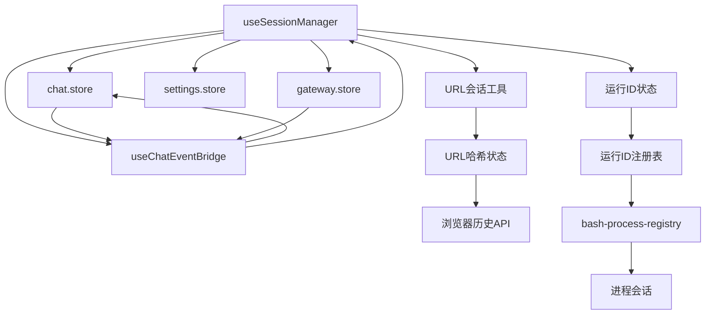
```mermaid
graph TB
USM["useSessionManager"] --> CS["chat.store"]
USM --> GS["gateway.store"]
USM --> SS["settings.store"]
USM --> CEB["useChatEventBridge"]
USM --> URL["URL会话工具"]
USM --> RID["运行ID状态"]
CS --> CEB
GS --> CEB
CEB --> CS
CEB --> USM
URL --> HASH["URL哈希状态"]
HASH --> BROWSER["浏览器历史API"]
RID --> RUNS["运行ID注册表"]
RUNS --> BPR["bash-process-registry"]
BPR --> PROC["进程会话"]
```

**图表来源**
- [ui-react/src/hooks/useSessionManager.ts:9-11](file://ui-react/src/hooks/useSessionManager.ts#L9-L11)
- [ui-react/src/store/chat.store.ts:1-247](file://ui-react/src/store/chat.store.ts#L1-L247)
- [ui-react/src/store/gateway.store.ts:1-184](file://ui-react/src/store/gateway.store.ts#L1-L184)
- [ui-react/src/store/settings.store.ts:1-222](file://ui-react/src/store/settings.store.ts#L1-L222)
- [ui-react/src/hooks/useChatEventBridge.ts:1-567](file://ui-react/src/hooks/useChatEventBridge.ts#L1-L567)
- [ui-react/src/store/chat.store.ts:154-156](file://ui-react/src/store/chat.store.ts#L154-L156)
- [src/agents/bash-process-registry.ts:82-102](file://src/agents/bash-process-registry.ts#L82-L102)
- [ui-react/src/hooks/session-manager/url-session.ts:31-39](file://ui-react/src/hooks/session-manager/url-session.ts#L31-L39)

**章节来源**
- [ui-react/src/store/chat.store.ts:1-247](file://ui-react/src/store/chat.store.ts#L1-L247)
- [ui-react/src/store/gateway.store.ts:1-184](file://ui-react/src/store/gateway.store.ts#L1-L184)
- [ui-react/src/store/settings.store.ts:1-222](file://ui-react/src/store/settings.store.ts#L1-L222)
- [ui-react/src/hooks/useChatEventBridge.ts:1-567](file://ui-react/src/hooks/useChatEventBridge.ts#L1-L567)

## 依赖关系分析
- 模块内聚：types 提供数据模型，store 聚合加载/写入/维护/缓存，maintenance 与 disk-budget 提供策略实现
- 外部依赖：文件系统、配置加载、日志子系统、写锁、crypto API
- 并发与一致性：写锁队列保证同一 storePath 的串行化写入；缓存通过 mtime/size 校验避免脏读
- **运行ID跟踪系统**：session-tool-result-guard-wrapper 与 input-provenance 相互协作，提供运行ID跟踪功能
- **会话工具结果保护**：session-tool-result-guard 与 session-transcript-repair 相互协作，提供完整的工具结果保护
- **会话文件修复**：session-file-repair 独立运行，提供文件级别的错误恢复能力
- **会话写锁机制**：session-write-lock 提供强大的并发控制和死锁预防
- **会话初始化**：session-manager-init 确保会话文件的一致性和完整性
- **会话缓存优化**：session-manager-cache 提供智能的缓存策略和预热功能
- **会话同步功能**：transcript-events 提供事件驱动的同步机制
- **UI 层依赖**：useSessionManager 依赖三个核心 store，形成清晰的单向数据流
- **URL会话工具**：url-session.ts 提供完整的URL哈希参数处理功能，与会话管理器深度集成
- **会话操作**：actions.ts 通过persistSessionKey回调函数实现会话状态与URL的双向同步
- **会话加载器**：loaders.ts 提供会话历史加载和状态同步功能
- **显示名称处理**：display-name.ts 提供会话显示名称的清理和解析功能

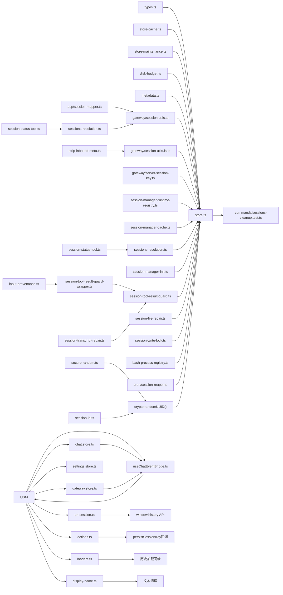
```mermaid
graph LR
Types["types.ts"] --> Store["store.ts"]
StoreCache["store-cache.ts"] --> Store
Maint["store-maintenance.ts"] --> Store
Disk["disk-budget.ts"] --> Store
Meta["metadata.ts"] --> Store
Utils["gateway/session-utils.ts"] --> Store
GFS["gateway/session-utils.fs.ts"] --> Store
GSK["gateway/server-session-key.ts"] --> Store
SIM["strip-inbound-meta.ts"] --> GFS
R1["session-manager-runtime-registry.ts"] --> Store
RC["session-manager-cache.ts"] --> Store
SR["sessions-resolution.ts"] --> Store
SST["session-status-tool.ts"] --> SR
SMI["session-manager-init.ts"] --> Store
SG["session-tool-result-guard.ts"] --> Store
SGW["session-tool-result-guard-wrapper.ts"] --> SG
IPS["input-provenance.ts"] --> SGW
STR["session-transcript-repair.ts"] --> SG
SFR["session-file-repair.ts"] --> Store
SWL["session-write-lock.ts"] --> Store
BPR["bash-process-registry.ts"] --> Store
Cron["cron/session-reaper.ts"] --> Store
Crypto["crypto.randomUUID()"] --> Store
SecureRand["secure-random.ts"] --> Crypto
SessionId["session-id.ts"] --> Crypto
ACPM["acp/session-mapper.ts"] --> Utils
SessRes["sessions-resolution.ts"] --> Utils
SessTool["session-status-tool.ts"] --> SessRes
Store --> Tests["commands/sessions-cleanup.test.ts"]
USM --> ChatStore["chat.store.ts"]
USM --> GatewayStore["gateway.store.ts"]
USM --> SettingsStore["settings.store.ts"]
USM --> ChatEventBridge["useChatEventBridge.ts"]
USM --> URLSession["url-session.ts"]
USM --> Actions["actions.ts"]
USM --> Loaders["loaders.ts"]
USM --> DisplayName["display-name.ts"]
URLSession --> BrowserAPI["window.history API"]
Actions --> PersistCallback["persistSessionKey回调"]
Loaders --> HistorySync["历史加载同步"]
DisplayName --> TextClean["文本清理"]
ChatStore --> ChatEventBridge
GatewayStore --> ChatEventBridge
ChatEventBridge --> USM
```

**图表来源**
- [src/config/sessions/types.ts:1-380](file://src/config/sessions/types.ts#L1-L380)
- [src/config/sessions/store.ts:1-800](file://src/config/sessions/store.ts#L1-L800)
- [src/config/sessions/store-cache.ts:1-82](file://src/config/sessions/store-cache.ts#L1-L82)
- [src/config/sessions/store-maintenance.ts:1-328](file://src/config/sessions/store-maintenance.ts#L1-L328)
- [src/config/sessions/disk-budget.ts:1-376](file://src/config/sessions/disk-budget.ts#L1-L376)
- [src/config/sessions/metadata.ts:1-173](file://src/config/sessions/metadata.ts#L1-L173)
- [src/gateway/session-utils.ts:480-503](file://src/gateway/session-utils.ts#L480-L503)
- [src/gateway/server-session-key.ts:1-23](file://src/gateway/server-session-key.ts#L1-L23)
- [src/gateway/session-utils.fs.ts:368-392](file://src/gateway/session-utils.fs.ts#L368-L392)
- [src/auto-reply/reply/strip-inbound-meta.ts:108-178](file://src/auto-reply/reply/strip-inbound-meta.ts#L108-L178)
- [src/cron/session-reaper.ts:81-109](file://src/cron/session-reaper.ts#L81-L109)
- [src/commands/agent/session.ts:144-146](file://src/commands/agent/session.ts#L144-L146)
- [src/infra/secure-random.ts:1-10](file://src/infra/secure-random.ts#L1-L10)
- [src/sessions/session-id.ts:1-5](file://src/sessions/session-id.ts#L1-L5)
- [src/sessions/input-provenance.ts:1-82](file://src/sessions/input-provenance.ts#L1-L82)
- [src/acp/session-mapper.ts:38-98](file://src/acp/session-mapper.ts#L38-L98)
- [src/agents/tools/sessions-resolution.ts:260-330](file://src/agents/tools/sessions-resolution.ts#L260-L330)
- [src/agents/tools/session-status-tool.ts:234-259](file://src/agents/tools/session-status-tool.ts#L234-L259)
- [src/commands/sessions-cleanup.test.ts:53-91](file://src/commands/sessions-cleanup.test.ts#L53-L91)
- [ui-react/src/hooks/useSessionManager.ts:1-139](file://ui-react/src/hooks/useSessionManager.ts#L1-L139)
- [ui-react/src/store/chat.store.ts:1-247](file://ui-react/src/store/chat.store.ts#L1-L247)
- [ui-react/src/store/gateway.store.ts:1-184](file://ui-react/src/store/gateway.store.ts#L1-L184)
- [ui-react/src/store/settings.store.ts:1-222](file://ui-react/src/store/settings.store.ts#L1-L222)
- [ui-react/src/hooks/useChatEventBridge.ts:1-567](file://ui-react/src/hooks/useChatEventBridge.ts#L1-L567)
- [ui-react/src/hooks/session-manager/url-session.ts:1-39](file://ui-react/src/hooks/session-manager/url-session.ts#L1-L39)
- [ui-react/src/hooks/session-manager/actions.ts:6-20](file://ui-react/src/hooks/session-manager/actions.ts#L6-L20)
- [ui-react/src/hooks/session-manager/loaders.ts:9-42](file://ui-react/src/hooks/session-manager/loaders.ts#L9-L42)
- [ui-react/src/hooks/session-manager/display-name.ts:35-43](file://ui-react/src/hooks/session-manager/display-name.ts#L35-L43)

**章节来源**
- [src/config/sessions/store.ts:1-800](file://src/config/sessions/store.ts#L1-L800)
- [src/config/sessions/store-maintenance.ts:1-328](file://src/config/sessions/store-maintenance.ts#L1-L328)
- [src/config/sessions/disk-budget.ts:1-376](file://src/config/sessions/disk-budget.ts#L1-L376)
- [src/config/sessions/metadata.ts:1-173](file://src/config/sessions/metadata.ts#L1-L173)
- [src/gateway/session-utils.ts:480-503](file://src/gateway/session-utils.ts#L480-L503)
- [src/gateway/server-session-key.ts:1-23](file://src/gateway/server-session-key.ts#L1-L23)
- [src/cron/session-reaper.ts:81-109](file://src/cron/session-reaper.ts#L81-L109)
- [src/commands/sessions-cleanup.test.ts:53-91](file://src/commands/sessions-cleanup.test.ts#L53-L91)
- [ui-react/src/hooks/useSessionManager.ts:1-139](file://ui-react/src/hooks/useSessionManager.ts#L1-L139)
- [ui-react/src/store/chat.store.ts:1-247](file://ui-react/src/store/chat.store.ts#L1-L247)
- [ui-react/src/store/gateway.store.ts:1-184](file://ui-react/src/store/gateway.store.ts#L1-L184)
- [ui-react/src/store/settings.store.ts:1-222](file://ui-react/src/store/settings.store.ts#L1-L222)
- [ui-react/src/hooks/useChatEventBridge.ts:1-567](file://ui-react/src/hooks/useChatEventBridge.ts#L1-L567)
- [ui-react/src/hooks/session-manager/url-session.ts:1-39](file://ui-react/src/hooks/session-manager/url-session.ts#L1-L39)
- [ui-react/src/hooks/session-manager/actions.ts:6-20](file://ui-react/src/hooks/session-manager/actions.ts#L6-L20)
- [ui-react/src/hooks/session-manager/loaders.ts:9-42](file://ui-react/src/hooks/session-manager/loaders.ts#L9-L42)
- [ui-react/src/hooks/session-manager/display-name.ts:35-43](file://ui-react/src/hooks/session-manager/display-name.ts#L35-L43)

## 性能考量
- 大存储写入成本：高 maxEntries、长 pruneAfter、大量归档与启用磁盘预算会增加写入延迟
- 建议：生产环境使用 enforce 模式，同时设置时间与数量限制，合理设置磁盘预算与高水位
- 缓存：启用 TTL 缓存可显著降低重复读取开销
- **运行ID跟踪系统**：运行ID包装器使用高效的字符串处理和条件检查，提供快速的运行ID注入能力
- **会话工具结果保护**：工具结果守卫使用高效的正则表达式和内存操作，提供快速的工具结果处理能力
- **会话文件修复**：文件修复功能采用增量修复策略，只处理损坏的行，最小化修复开销
- **会话写锁机制**：改进的写锁机制支持异步清理和超时检测，减少锁等待时间
- **会话初始化优化**：初始化流程避免不必要的文件操作，只有在必要时才重置会话文件
- **会话缓存预热**：文件预热功能利用操作系统的页面缓存，显著提升后续读取性能
- **UI 层性能**：useSessionManager 使用 React.memo 优化，避免不必要的重新渲染
- **网络优化**：会话列表缓存，连接状态变化时才重新加载
- **URL会话工具性能**：URL会话工具函数使用高效的字符串处理和浏览器API调用，提供快速的会话键处理能力
- **会话状态同步**：通过URL哈希参数实现会话状态的持久化，减少服务器端状态管理开销

## 故障排除指南
- 写入失败/ENOENT：Windows 下临时文件写入存在竞态，框架内置重试；若仍失败，检查目录权限与磁盘空间
- 缓存失效：mtime/size 变更会触发缓存失效；确认文件系统事件与缓存 TTL 设置
- 维护未生效：确认 session.maintenance.mode 与 active-key 保护；使用 --dry-run 预览
- 磁盘不足：启用磁盘预算并设置合理 highWater；必要时增大 rotateBytes 或减少 pruneAfter
- **运行ID跟踪异常**：检查运行ID参数的有效性，确认运行ID包装器的正确配置
- **会话工具结果保护异常**：检查工具结果守卫的配置选项，确认工具调用输入的有效性
- **会话文件修复失败**：查看修复报告中的错误原因，检查文件权限和磁盘空间
- **会话写锁超时**：检查进程状态和锁文件，确认是否有僵尸进程或死锁情况
- **会话初始化错误**：验证会话文件的完整性，检查会话头信息和助手消息状态
- **会话缓存预热失败**：确认文件存在且可读，检查缓存配置和权限设置
- **UI 连接问题**：检查 gateway.store.status 是否为 connected，确认 WebSocket 连接正常
- **会话加载失败**：查看 useSessionManager 的错误处理，确认网关端 chat.sessions.list 接口可用
- **URL会话键解析失败**：检查URL哈希参数格式，确认sessionKey查询参数的正确性
- **URL会话同步异常**：检查浏览器历史API支持，确认window对象的可用性
- **会话状态不同步**：检查persistSessionKey回调函数的执行情况，确认URL更新的正确性

**章节来源**
- [src/config/sessions/store.ts:464-508](file://src/config/sessions/store.ts#L464-L508)
- [src/config/sessions/store-cache.ts:41-81](file://src/config/sessions/store-cache.ts#L41-L81)
- [src/commands/agent/session.ts:144-146](file://src/commands/agent/session.ts#L144-L146)
- [src/infra/secure-random.ts:1-10](file://src/infra/secure-random.ts#L1-L10)
- [src/agents/tools/sessions-resolution.ts:260-330](file://src/agents/tools/sessions-resolution.ts#L260-L330)
- [ui-react/src/hooks/useSessionManager.ts:35-41](file://ui-react/src/hooks/useSessionManager.ts#L35-L41)
- [ui-react/src/hooks/useSessionManager.ts:266-271](file://ui-react/src/hooks/useSessionManager.ts#L266-L271)
- [src/gateway/session-utils.fs.ts:378-392](file://src/gateway/session-utils.fs.ts#L378-L392)
- [src/gateway/server-session-key.ts:6-22](file://src/gateway/server-session-key.ts#L6-L22)
- [docs/cli/sessions.md:48-105](file://docs/cli/sessions.md#L48-L105)
- [docs/concepts/session.md:101-120](file://docs/concepts/session.md#L101-L120)
- [src/agents/session-tool-result-guard.ts:71-267](file://src/agents/session-tool-result-guard.ts#L71-L267)
- [src/agents/session-tool-result-guard-wrapper.ts:66-84](file://src/agents/session-tool-result-guard-wrapper.ts#L66-L84)
- [src/agents/session-file-repair.ts:19-110](file://src/agents/session-file-repair.ts#L19-L110)
- [src/agents/session-write-lock.ts:444-561](file://src/agents/session-write-lock.ts#L444-L561)
- [src/agents/pi-embedded-runner/session-manager-init.ts:16-54](file://src/agents/pi-embedded-runner/session-manager-init.ts#L16-L54)
- [src/agents/pi-embedded-runner/session-manager-cache.ts:24-69](file://src/agents/pi-embedded-runner/session-manager-cache.ts#L24-L69)
- [ui-react/src/hooks/session-manager/url-session.ts:10-39](file://ui-react/src/hooks/session-manager/url-session.ts#L10-L39)
- [ui-react/src/hooks/session-manager/actions.ts:6-20](file://ui-react/src/hooks/session-manager/actions.ts#L6-L20)

## 结论
OpenClaw 会话管理通过严谨的数据模型、完善的维护策略与缓存/锁机制，在保证一致性的同时兼顾性能与可运维性。**最新的架构变更**引入了全新的会话管理器，包括改进的加载器架构、更好的错误处理和增强的同步功能。新增的运行ID跟踪系统显著提升了跨会话的消息持久化和运行上下文追踪能力。增强的会话工具结果保护机制提供了更强大的工具调用保护和消息转换功能。会话文件修复功能提供了强大的错误恢复能力。改进的会话写锁机制确保了并发操作的正确性和系统的稳定性。**最新更新**：UI会话管理器现在正确处理来自URL哈希参数的会话键，确保应用程序界面中的会话状态一致性。通过URL哈希参数会话键处理功能，用户可以通过URL直接访问特定会话，提升了用户体验和应用的易用性。结合 CLI 与网关查询能力，用户可以高效地观察、清理与优化会话状态。

## 附录
- 会话创建/更新/销毁流程（代码路径）
  - 创建/更新：[updateSessionStoreEntry:729-754](file://src/config/sessions/store.ts#L729-L754)
  - 更新元数据：[recordSessionMetaFromInbound:756-800](file://src/config/sessions/store.ts#L756-L800)
  - 写入保存：[saveSessionStore:511-519](file://src/config/sessions/store.ts#L511-L519)
  - 批量维护：[updateSessionStore:521-533](file://src/config/sessions/store.ts#L521-L533)
  - 维护执行：[saveSessionStoreUnlocked:340-509](file://src/config/sessions/store.ts#L340-L509)
  - 修剪/封顶/轮转：[pruneStaleEntries:155-174](file://src/config/sessions/store-maintenance.ts#L155-L174)、[capEntryCount:226-259](file://src/config/sessions/store-maintenance.ts#L226-L259)、[rotateSessionFile:275-327](file://src/config/sessions/store-maintenance.ts#L275-L327)
  - 磁盘预算：[enforceSessionDiskBudget:188-375](file://src/config/sessions/disk-budget.ts#L188-L375)
  - 入站元数据派生：[deriveSessionMetaPatch:153-172](file://src/config/sessions/metadata.ts#L153-L172)
  - 网关目标解析：[resolveGatewaySessionStoreTarget:480-503](file://src/gateway/session-utils.ts#L480-L503)
  - **运行ID会话键解析**：[resolveSessionKeyForRun:6-22](file://src/gateway/server-session-key.ts#L6-L22)
  - 会话管理器缓存：[trackSessionManagerAccess:24-33](file://src/agents/pi-embedded-runner/session-manager-cache.ts#L24-L33)
  - 会话管理器初始化：[prepareSessionManagerForRun:16-54](file://src/agents/pi-embedded-runner/session-manager-init.ts#L16-L54)
  - **运行ID包装器**：[guardSessionManager:20-96](file://src/agents/session-tool-result-guard-wrapper.ts#L20-L96)
  - **运行ID注入**：[transformMessageForPersistence:66-84](file://src/agents/session-tool-result-guard-wrapper.ts#L66-L84)
  - **输入溯源增强**：[applyInputProvenanceToUserMessage:50-68](file://src/sessions/input-provenance.ts#L50-L68)
  - 工具结果保护：[installSessionToolResultGuard:71-267](file://src/agents/session-tool-result-guard.ts#L71-L267)
  - 转录修复：[repairToolUseResultPairing:342-503](file://src/agents/session-transcript-repair.ts#L342-L503)
  - 文件修复：[repairSessionFileIfNeeded:19-110](file://src/agents/session-file-repair.ts#L19-L110)
  - 写锁机制：[acquireSessionWriteLock:444-561](file://src/agents/session-write-lock.ts#L444-L561)
  - 定时清理：[清理过期会话:81-109](file://src/cron/session-reaper.ts#L81-L109)
  - **会话工具结果保护**：
    - **工具结果截断**：[capToolResultSize:25-33](file://src/agents/session-tool-result-guard.ts#L25-L33)
    - **工具结果规范化**：[normalizePersistedToolResultName:43-69](file://src/agents/session-tool-result-guard.ts#L43-L69)
    - **合成缺失工具结果**：[makeMissingToolResult:135-152](file://src/agents/session-transcript-repair.ts#L135-L152)
    - **工具调用配对修复**：[repairToolUseResultPairing:342-503](file://src/agents/session-transcript-repair.ts#L342-L503)
    - **消息持久化转换**：[transformMessageForPersistence:66-84](file://src/agents/session-tool-result-guard-wrapper.ts#L66-L84)
  - **会话文件修复**：
    - **JSON解析错误检测**：[repairSessionFileIfNeeded:28-55](file://src/agents/session-file-repair.ts#L28-L55)
    - **文件备份创建**：[repairSessionFileIfNeeded:73-85](file://src/agents/session-file-repair.ts#L73-L85)
    - **原子重命名**：[repairSessionFileIfNeeded:85-86](file://src/agents/session-file-repair.ts#L85-L86)
  - **会话写锁机制**：
    - **进程PID回收检测**：[inspectLockPayload:294-339](file://src/agents/session-write-lock.ts#L294-L339)
    - **超时持有检测**：[runLockWatchdogCheck:193-212](file://src/agents/session-write-lock.ts#L193-L212)
    - **孤儿锁清理**：[cleanStaleLockFiles:387-442](file://src/agents/session-write-lock.ts#L387-L442)
  - **会话初始化**：
    - **会话头信息更新**：[prepareSessionManagerForRun:32-42](file://src/agents/pi-embedded-runner/session-manager-init.ts#L32-L42)
    - **文件重置机制**：[prepareSessionManagerForRun:44-52](file://src/agents/pi-embedded-runner/session-manager-init.ts#L44-L52)
  - **会话缓存优化**：
    - **文件预热**：[prewarmSessionFile:48-69](file://src/agents/pi-embedded-runner/session-manager-cache.ts#L48-L69)
    - **缓存状态跟踪**：[trackSessionManagerAccess:24-33](file://src/agents/pi-embedded-runner/session-manager-cache.ts#L24-L33)
  - **会话同步功能**：
    - **事件通知**：[emitSessionTranscriptUpdate:244-249](file://src/agents/session-tool-result-guard.ts#L244-L249)
    - **状态更新**：[transcript-events.ts:16-29](file://src/sessions/transcript-events.ts#L16-L29)
  - **UI 层集成**：
    - **useSessionManager 初始化**：[useSessionManager:19-138](file://ui-react/src/hooks/useSessionManager.ts#L19-L138)
    - **会话列表加载**：[loadSessions:29-42](file://ui-react/src/hooks/useSessionManager.ts#L29-L42)
    - **历史加载**：[loadHistory:45-82](file://ui-react/src/hooks/useSessionManager.ts#L45-L82)
    - **会话切换**：[switchSession:85-92](file://ui-react/src/hooks/useSessionManager.ts#L85-L92)
    - **新建会话**：[newSession:95-109](file://ui-react/src/hooks/useSessionManager.ts#L95-L109)
    - **ChatSidebar 渲染**：[ChatSidebar:19-116](file://ui-react/src/components/chat/ChatSidebar.tsx#L19-L116)
    - **兼容性包装**：[SessionSelector:1-8](file://ui-react/src/components/chat/SessionSelector.tsx#L1-L8)
  - **URL会话工具**：
    - **会话键解析**：[getSessionKeyFromHash:10-19](file://ui-react/src/hooks/session-manager/url-session.ts#L10-L19)
    - **哈希构建**：[buildHashWithSessionKey:21-29](file://ui-react/src/hooks/session-manager/url-session.ts#L21-L29)
    - **会话键设置**：[setSessionKeyInHash:31-39](file://ui-react/src/hooks/session-manager/url-session.ts#L31-L39)
    - **URL会话同步**：[persistSessionKey回调:10-17](file://ui-react/src/hooks/session-manager/actions.ts#L10-L17)