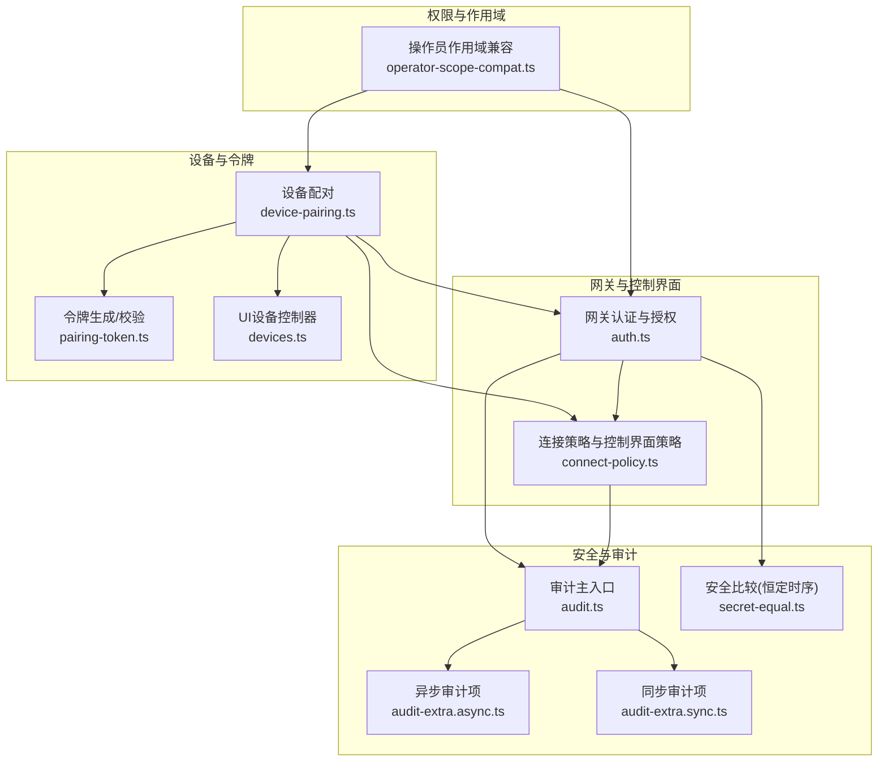
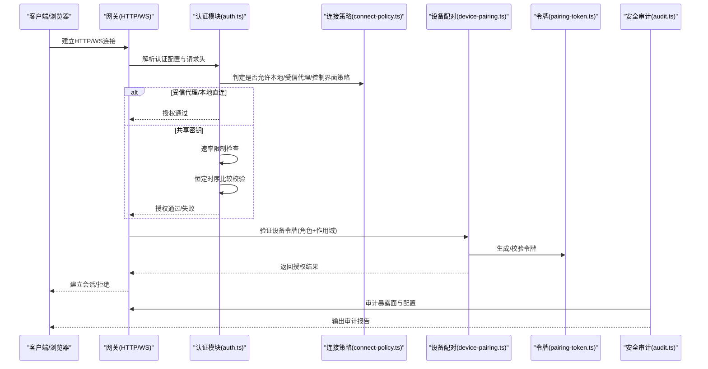
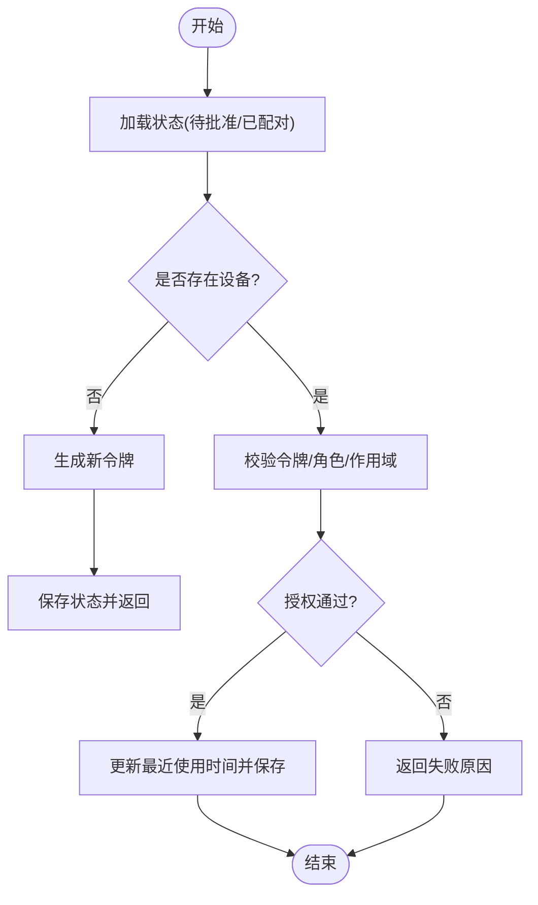
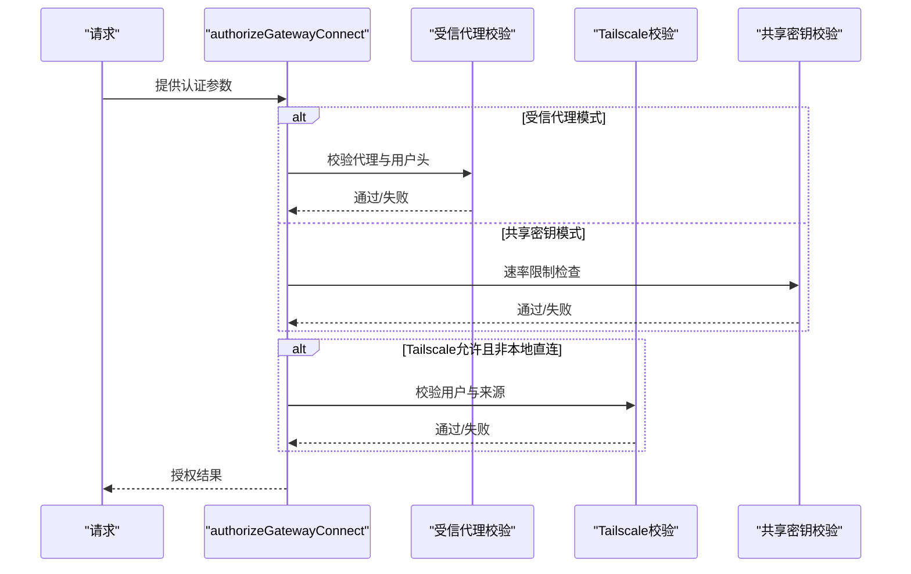
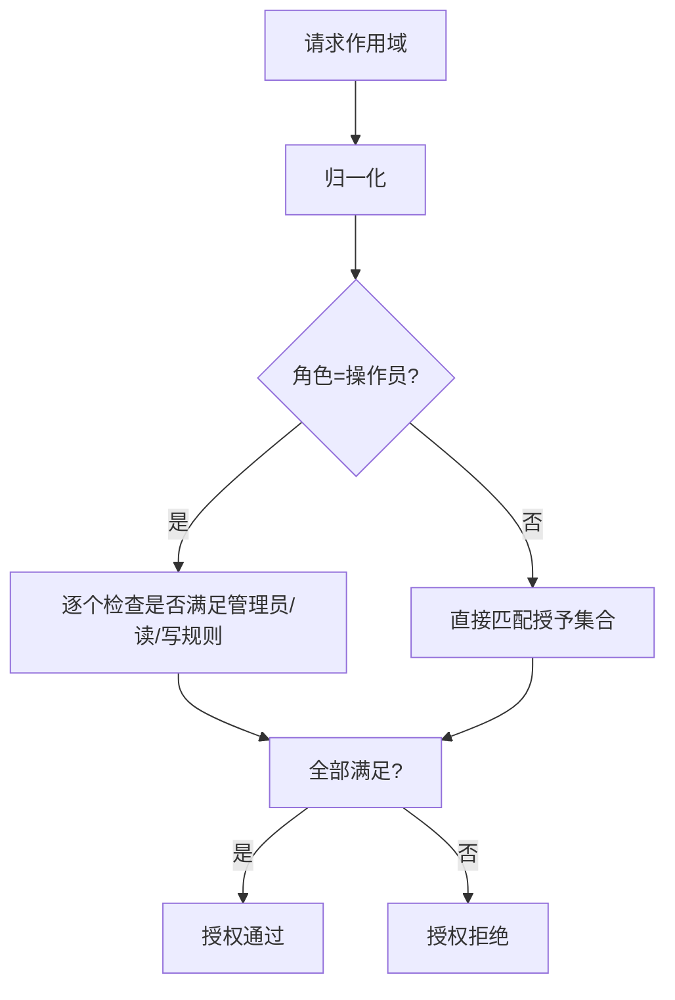
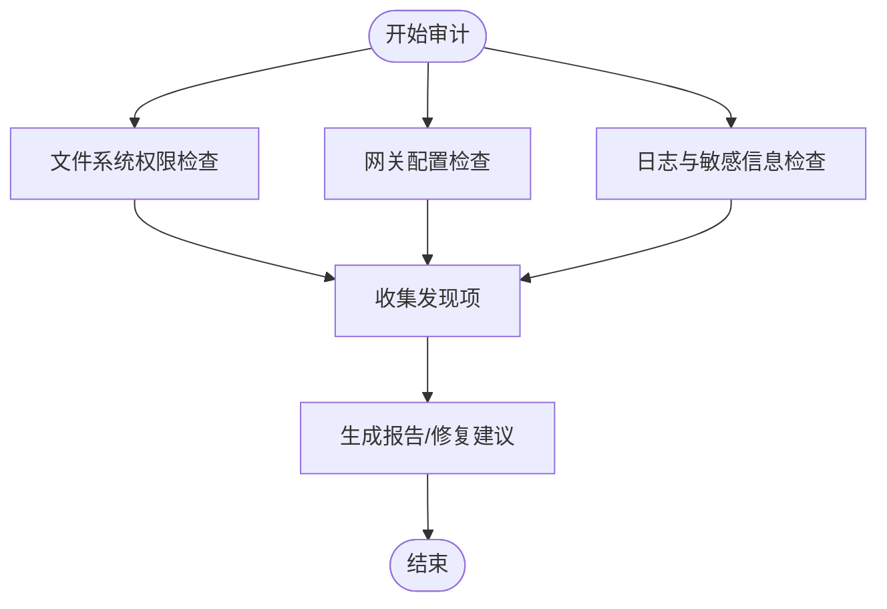
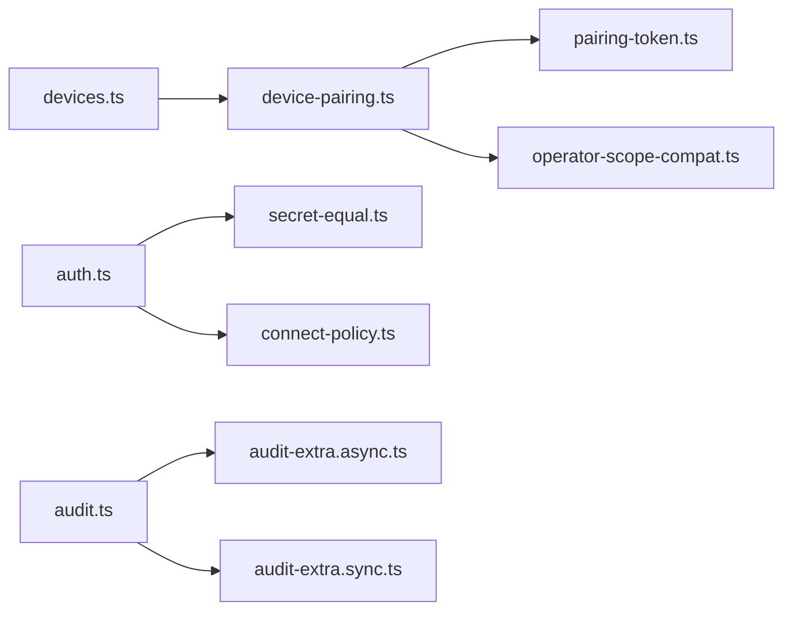

# 安全模型

<cite>
**本文引用的文件**   
- [SECURITY.md](file://SECURITY.md)
- [device-pairing.ts](file://src/infra/device-pairing.ts)
- [pairing-token.ts](file://src/infra/pairing-token.ts)
- [connect-policy.ts](file://src/gateway/server/ws-connection/connect-policy.ts)
- [auth.ts](file://src/gateway/auth.ts)
- [operator-scope-compat.ts](file://src/shared/operator-scope-compat.ts)
- [secret-equal.ts](file://src/security/secret-equal.ts)
- [audit.ts](file://src/security/audit.ts)
- [audit-extra.async.ts](file://src/security/audit-extra.async.ts)
- [audit-extra.sync.ts](file://src/security/audit-extra.sync.ts)
- [devices.ts](file://ui/src/ui/controllers/devices.ts)
- [command-gating.test.ts](file://src/channels/command-gating.test.ts)
- [index.md](file://docs/zh-CN/gateway/security/index.md)
</cite>

## 目录

1. [引言](#引言)
2. [项目结构](#项目结构)
3. [核心组件](#核心组件)
4. [架构总览](#架构总览)
5. [详细组件分析](#详细组件分析)
6. [依赖关系分析](#依赖关系分析)
7. [性能考量](#性能考量)
8. [故障排查指南](#故障排查指南)
9. [结论](#结论)
10. [附录](#附录)

## 引言

本文件面向OpenClaw的安全模型，系统化阐述其多层次安全架构、权限控制与访问审计体系，覆盖设备配对与认证令牌管理、会话与控制界面安全策略、敏感数据与密钥管理、安全边界与入侵检测、威胁响应与合规报告等主题。文档以仓库内现有实现为依据，结合CLI与UI交互路径，给出可操作的安全配置建议与最佳实践。

## 项目结构

OpenClaw安全相关能力主要分布在以下模块：

- 设备配对与令牌：设备身份、角色与作用域授权、令牌生成与校验、状态持久化与轮换
- 网关认证与控制界面策略：共享密钥、受信代理、Tailscale、速率限制与本地直连判定
- 权限与作用域兼容：操作员角色的作用域满足规则
- 审计与合规：文件系统权限、网关暴露面、日志脱敏、通道与插件安全
- UI与CLI：设备列表、令牌摘要、安全审计命令与输出

图表来源

- [device-pairing.ts:1-654](file://src/infra/device-pairing.ts#L1-L654)
- [pairing-token.ts:1-13](file://src/infra/pairing-token.ts#L1-L13)
- [connect-policy.ts:1-103](file://src/gateway/server/ws-connection/connect-policy.ts#L1-L103)
- [auth.ts:1-504](file://src/gateway/auth.ts#L1-L504)
- [operator-scope-compat.ts:1-50](file://src/shared/operator-scope-compat.ts#L1-L50)
- [audit.ts:1-800](file://src/security/audit.ts#L1-L800)
- [audit-extra.async.ts:983-1137](file://src/security/audit-extra.async.ts#L983-L1137)
- [audit-extra.sync.ts:1070-1105](file://src/security/audit-extra.sync.ts#L1070-L1105)
- [secret-equal.ts:1-13](file://src/security/secret-equal.ts#L1-L13)
- [devices.ts:1-46](file://ui/src/ui/controllers/devices.ts#L1-L46)

章节来源

- [device-pairing.ts:1-654](file://src/infra/device-pairing.ts#L1-L654)
- [auth.ts:1-504](file://src/gateway/auth.ts#L1-L504)
- [audit.ts:1-800](file://src/security/audit.ts#L1-L800)

## 核心组件

- 设备配对与令牌管理
  - 设备身份、角色与作用域：支持多角色、作用域展开与隐含关系，令牌按角色分发并记录使用时间
  - 令牌生命周期：生成、轮换、吊销、校验；校验采用恒定时序比较
  - 状态持久化：异步锁保证并发安全，JSON原子写入
- 网关认证与控制界面策略
  - 多模式认证：共享密钥(token/password)、受信代理(trusted-proxy)、Tailscale、无认证
  - 控制界面策略：允许/禁止不安全认证、危险禁用设备认证开关、本地客户端判定
  - 速率限制：针对共享密钥失败尝试进行限流
- 权限与作用域
  - 操作员角色的作用域满足规则：管理员可满足所有操作员类请求；读/写权限存在层级关系
- 审计与合规
  - 文件系统权限检查、网关暴露面与认证缺失检查、日志脱敏策略、通道与插件安全
  - 提供CLI命令进行快速审计与修复

章节来源

- [device-pairing.ts:32-67](file://src/infra/device-pairing.ts#L32-L67)
- [device-pairing.ts:222-253](file://src/infra/device-pairing.ts#L222-L253)
- [device-pairing.ts:470-508](file://src/infra/device-pairing.ts#L470-L508)
- [pairing-token.ts:1-13](file://src/infra/pairing-token.ts#L1-L13)
- [secret-equal.ts:1-13](file://src/security/secret-equal.ts#L1-L13)
- [auth.ts:217-292](file://src/gateway/auth.ts#L217-L292)
- [connect-policy.ts:12-33](file://src/gateway/server/ws-connection/connect-policy.ts#L12-L33)
- [operator-scope-compat.ts:18-29](file://src/shared/operator-scope-compat.ts#L18-L29)
- [audit.ts:339-687](file://src/security/audit.ts#L339-L687)
- [audit-extra.async.ts:983-1137](file://src/security/audit-extra.async.ts#L983-L1137)
- [audit-extra.sync.ts:1070-1105](file://src/security/audit-extra.sync.ts#L1070-L1105)

## 架构总览

下图展示了从客户端到网关再到设备配对与令牌系统的整体交互，以及审计与合规检查如何贯穿各层。

图表来源

- [auth.ts:378-503](file://src/gateway/auth.ts#L378-L503)
- [connect-policy.ts:35-102](file://src/gateway/server/ws-connection/connect-policy.ts#L35-L102)
- [device-pairing.ts:470-508](file://src/infra/device-pairing.ts#L470-L508)
- [pairing-token.ts:6-12](file://src/infra/pairing-token.ts#L6-L12)
- [audit.ts:1-120](file://src/security/audit.ts#L1-L120)

## 详细组件分析

### 设备配对与认证令牌管理

- 设备身份与角色
  - 设备信息包含标识、公钥、显示名、平台、角色与作用域集合
  - 角色与作用域支持合并与规范化，作用域存在隐含关系（如管理员包含读写审批配对）
- 令牌生命周期
  - 生成：随机字节经URL安全编码
  - 校验：恒定时序比较，避免时序侧信道
  - 轮换：基于批准的作用域范围进行轮换，记录轮换时间
  - 吊销：标记撤销时间戳
- 并发与持久化
  - 使用异步锁确保状态一致性
  - JSON原子写入，分别维护待批准与已配对设备列表

图表来源

- [device-pairing.ts:470-508](file://src/infra/device-pairing.ts#L470-L508)
- [pairing-token.ts:6-12](file://src/infra/pairing-token.ts#L6-L12)

章节来源

- [device-pairing.ts:32-67](file://src/infra/device-pairing.ts#L32-L67)
- [device-pairing.ts:195-220](file://src/infra/device-pairing.ts#L195-L220)
- [device-pairing.ts:222-253](file://src/infra/device-pairing.ts#L222-L253)
- [device-pairing.ts:470-508](file://src/infra/device-pairing.ts#L470-L508)
- [device-pairing.ts:572-612](file://src/infra/device-pairing.ts#L572-L612)
- [device-pairing.ts:614-640](file://src/infra/device-pairing.ts#L614-L640)
- [pairing-token.ts:1-13](file://src/infra/pairing-token.ts#L1-L13)
- [secret-equal.ts:1-13](file://src/security/secret-equal.ts#L1-L13)

### 网关认证与控制界面策略

- 认证模式解析
  - 支持token/password/trusted-proxy/none，默认token
  - 受信代理需配置用户头与允许用户列表
  - Tailscale仅在非密码/非受信代理模式下启用
- 控制界面策略
  - 允许/禁止不安全认证、危险禁用设备认证开关
  - 本地客户端判定严格，仅允许localhost代理链
- 速率限制
  - 针对共享密钥失败尝试进行限流，成功后重置

图表来源

- [auth.ts:378-503](file://src/gateway/auth.ts#L378-L503)
- [connect-policy.ts:12-33](file://src/gateway/server/ws-connection/connect-policy.ts#L12-L33)

章节来源

- [auth.ts:217-292](file://src/gateway/auth.ts#L217-L292)
- [auth.ts:378-503](file://src/gateway/auth.ts#L378-L503)
- [connect-policy.ts:35-102](file://src/gateway/server/ws-connection/connect-policy.ts#L35-L102)

### 权限与作用域控制

- 操作员角色的作用域满足规则
  - 管理员可满足所有操作员类请求
  - 读权限可满足读写请求
  - 写权限不可满足读权限
- 设备令牌的作用域
  - 请求的作用域必须被授予的作用域包含
  - 支持作用域展开与隐含关系

图表来源

- [operator-scope-compat.ts:18-29](file://src/shared/operator-scope-compat.ts#L18-L29)
- [device-pairing.ts:195-220](file://src/infra/device-pairing.ts#L195-L220)

章节来源

- [operator-scope-compat.ts:1-50](file://src/shared/operator-scope-compat.ts#L1-L50)
- [device-pairing.ts:195-220](file://src/infra/device-pairing.ts#L195-L220)

### 审计与合规

- 文件系统与配置权限
  - 检查状态目录、配置文件、凭据目录、会话文件、日志文件的可读/可写权限
  - 提供修复建议（权限模式调整）
- 网关暴露面与认证
  - 绑定非loopback但未配置认证、控制界面未配置允许来源、受信代理未配置等
  - 工具HTTP调用危险工具重启用、mDNS full模式、Tailscale funnel等
- 日志与敏感信息
  - 日志文件可读性检查与脱敏级别评估
- CLI与UI
  - 提供openclaw security audit命令进行快速审计与修复
  - UI设备控制器展示令牌摘要与配对列表

图表来源

- [audit.ts:208-337](file://src/security/audit.ts#L208-L337)
- [audit.ts:339-687](file://src/security/audit.ts#L339-L687)
- [audit.ts:799-800](file://src/security/audit.ts#L799-L800)
- [audit-extra.async.ts:983-1137](file://src/security/audit-extra.async.ts#L983-L1137)
- [audit-extra.sync.ts:1070-1105](file://src/security/audit-extra.sync.ts#L1070-L1105)

章节来源

- [audit.ts:1-800](file://src/security/audit.ts#L1-L800)
- [audit-extra.async.ts:983-1137](file://src/security/audit-extra.async.ts#L983-L1137)
- [audit-extra.sync.ts:1070-1105](file://src/security/audit-extra.sync.ts#L1070-L1105)
- [index.md:17-36](file://docs/zh-CN/gateway/security/index.md#L17-L36)

### 会话与控制界面安全策略

- 控制界面策略
  - 允许/禁止不安全认证、危险禁用设备认证开关
  - 本地客户端判定严格，远程连接仍拒绝
- 会话与路由
  - 会话键等标识符为路由控制，非多租户授权边界
- 速率限制与本地直连
  - 速率限制仅针对共享密钥失败尝试
  - 本地直连严格判定，避免代理伪造

章节来源

- [connect-policy.ts:35-102](file://src/gateway/server/ws-connection/connect-policy.ts#L35-L102)
- [auth.ts:125-146](file://src/gateway/auth.ts#L125-L146)

### 敏感数据与密钥管理

- 恒定时序比较
  - 对比提供的密钥与期望值时使用SHA-256哈希与恒定时序比较，避免时序侧信道
- 密钥读取与限制
  - 秘密文件读取限制最大字节数、拒绝符号链接
- 令牌生成
  - 使用随机字节生成URL安全编码的令牌

章节来源

- [secret-equal.ts:1-13](file://src/security/secret-equal.ts#L1-L13)
- [pairing-token.ts:1-13](file://src/infra/pairing-token.ts#L1-L13)
- [secret-file.ts:1-10](file://src/acp/secret-file.ts#L1-L10)
- [secret-file.ts:1-48](file://src/infra/secret-file.ts#L1-L48)

### 安全边界设计与入侵检测

- 边界模型
  - 网关为控制面，节点为执行扩展；二者在同一操作员信任边界内
  - 会话与内存隔离减少上下文泄露，但不构成主机级多租户授权边界
- 插件与临时目录
  - 插件为可信代码，临时目录用于媒体与沙箱邻接产物，需限定路径
- 入侵检测与异常监控
  - 审计报告中对暴露面、权限、日志可读性等进行告警
  - 速率限制作为暴力破解缓解手段

章节来源

- [SECURITY.md:88-172](file://SECURITY.md#L88-L172)
- [audit-extra.async.ts:983-1137](file://src/security/audit-extra.async.ts#L983-L1137)
- [audit.ts:673-684](file://src/security/audit.ts#L673-L684)

### 安全事件响应与合规报告

- 报告与处置
  - 提供安全政策与漏洞上报流程，明确所需信息与接受门槛
  - 通过CLI命令进行快速审计与修复
- 合规建议
  - 保持配置与状态目录权限最小化，日志脱敏级别符合要求
  - 控制界面绑定至loopback或受信网络，严格允许来源与受信代理配置

章节来源

- [SECURITY.md:1-288](file://SECURITY.md#L1-L288)
- [index.md:17-36](file://docs/zh-CN/gateway/security/index.md#L17-L36)

## 依赖关系分析

- 组件耦合
  - 设备配对依赖令牌生成与校验、作用域兼容与持久化
  - 网关认证依赖速率限制、受信代理与Tailscale校验
  - 审计模块依赖配置解析、文件系统检查与通道/插件安全检查
- 外部依赖
  - Node.js crypto模块用于哈希与恒定时序比较
  - CLI命令openclaw security audit驱动审计流程

图表来源

- [device-pairing.ts:1-654](file://src/infra/device-pairing.ts#L1-L654)
- [pairing-token.ts:1-13](file://src/infra/pairing-token.ts#L1-L13)
- [operator-scope-compat.ts:1-50](file://src/shared/operator-scope-compat.ts#L1-L50)
- [auth.ts:1-504](file://src/gateway/auth.ts#L1-L504)
- [secret-equal.ts:1-13](file://src/security/secret-equal.ts#L1-L13)
- [connect-policy.ts:1-103](file://src/gateway/server/ws-connection/connect-policy.ts#L1-L103)
- [audit.ts:1-800](file://src/security/audit.ts#L1-L800)
- [audit-extra.async.ts:1-1137](file://src/security/audit-extra.async.ts#L1-L1137)
- [audit-extra.sync.ts:1-1105](file://src/security/audit-extra.sync.ts#L1-L1105)
- [devices.ts:1-46](file://ui/src/ui/controllers/devices.ts#L1-L46)

章节来源

- [device-pairing.ts:1-654](file://src/infra/device-pairing.ts#L1-L654)
- [auth.ts:1-504](file://src/gateway/auth.ts#L1-L504)
- [audit.ts:1-800](file://src/security/audit.ts#L1-L800)

## 性能考量

- 令牌校验采用恒定时序比较，避免分支导致的性能差异
- 审计模块区分同步与异步检查，避免阻塞主流程
- 速率限制仅对共享密钥失败尝试生效，降低正常请求开销

## 故障排查指南

- 常见问题定位
  - 网关绑定非loopback且未配置认证：检查gateway.bind与gateway.auth
  - 控制界面未配置允许来源：检查gateway.controlUi.allowedOrigins
  - 受信代理未配置或用户头缺失：检查gateway.auth.trustedProxy
  - 日志文件可读性过高：调整日志脱敏级别与文件权限
- 修复建议
  - 使用openclaw security audit --fix自动修复部分问题
  - 严格控制状态目录与配置文件权限，避免世界可读/写
  - 限制工具HTTP调用危险工具重启用，避免扩大RCE面

章节来源

- [audit.ts:428-462](file://src/security/audit.ts#L428-L462)
- [audit.ts:463-505](file://src/security/audit.ts#L463-L505)
- [audit.ts:614-684](file://src/security/audit.ts#L614-L684)
- [audit-extra.async.ts:1095-1127](file://src/security/audit-extra.async.ts#L1095-L1127)
- [index.md:17-36](file://docs/zh-CN/gateway/security/index.md#L17-L36)

## 结论

OpenClaw的安全模型围绕“个人助理”信任模型构建，强调操作员信任边界内的控制面与执行面分离、严格的设备配对与令牌管理、多层认证与速率限制、以及持续的审计与合规检查。通过CLI与UI工具，用户可快速评估与修复安全风险，确保在开放的自动化场景中维持可控的边界与最小权限原则。

## 附录

- 安全配置示例（路径参考）
  - 设备配对与令牌管理：[device-pairing.ts:255-270](file://src/infra/device-pairing.ts#L255-L270)，[pairing-token.ts:6-12](file://src/infra/pairing-token.ts#L6-L12)
  - 网关认证策略：[auth.ts:217-292](file://src/gateway/auth.ts#L217-L292)，[connect-policy.ts:12-33](file://src/gateway/server/ws-connection/connect-policy.ts#L12-L33)
  - 作用域与权限：[operator-scope-compat.ts:18-29](file://src/shared/operator-scope-compat.ts#L18-L29)
  - 审计与修复：[audit.ts:339-687](file://src/security/audit.ts#L339-L687)，[index.md:17-36](file://docs/zh-CN/gateway/security/index.md#L17-L36)
- 权限验证与威胁防护（路径参考）
  - 恒定时序比较：[secret-equal.ts:1-13](file://src/security/secret-equal.ts#L1-L13)
  - 命令门控与访问组：[command-gating.test.ts:1-97](file://src/channels/command-gating.test.ts#L1-L97)
- 安全事件响应与合规（路径参考）
  - 安全政策与上报：[SECURITY.md:1-288](file://SECURITY.md#L1-L288)
  - 审计与日志：[audit.ts:799-800](file://src/security/audit.ts#L799-L800)，[audit-extra.async.ts:1095-1127](file://src/security/audit-extra.async.ts#L1095-L1127)
