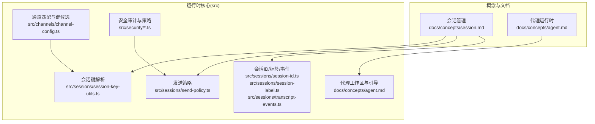
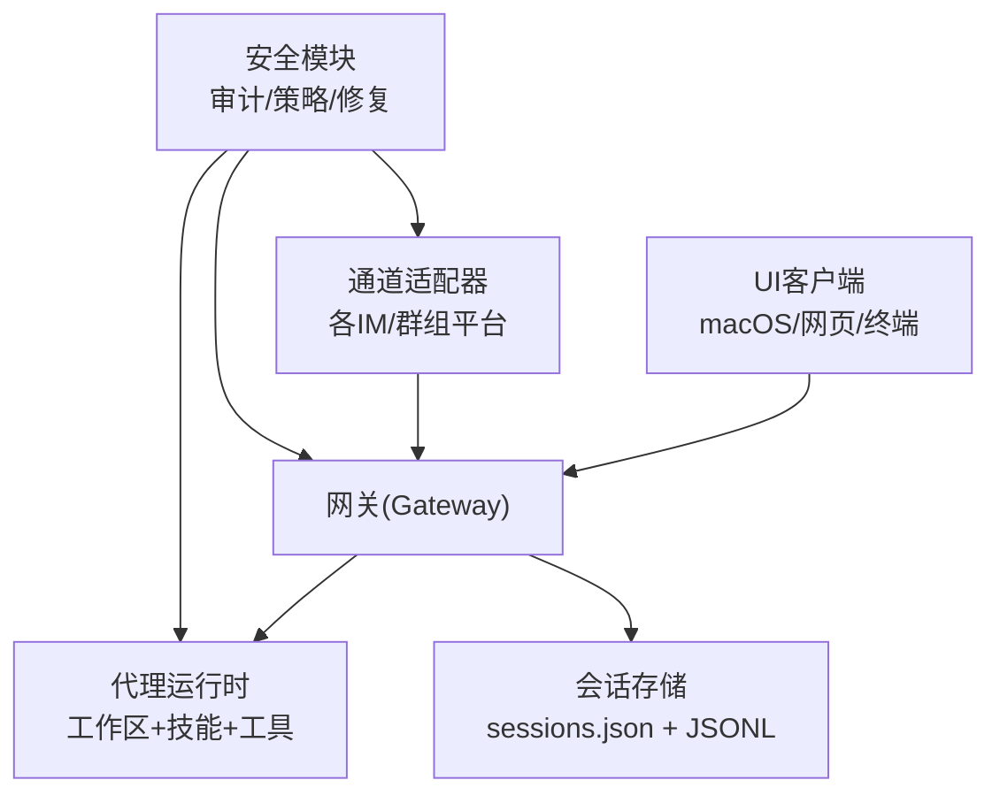
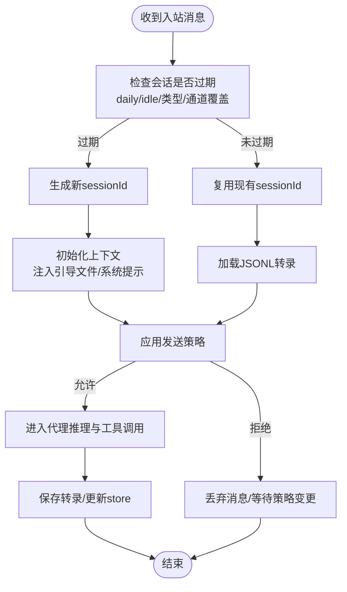
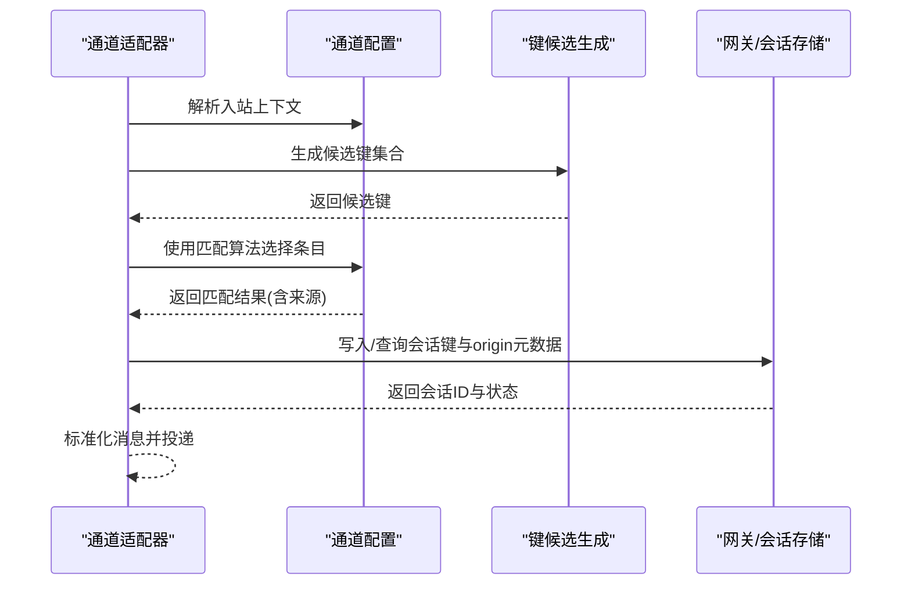
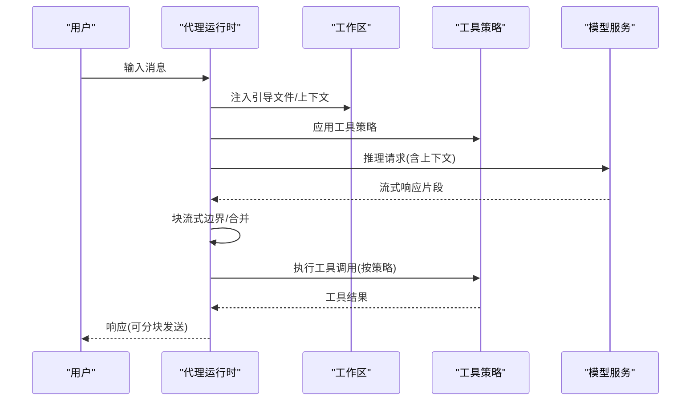
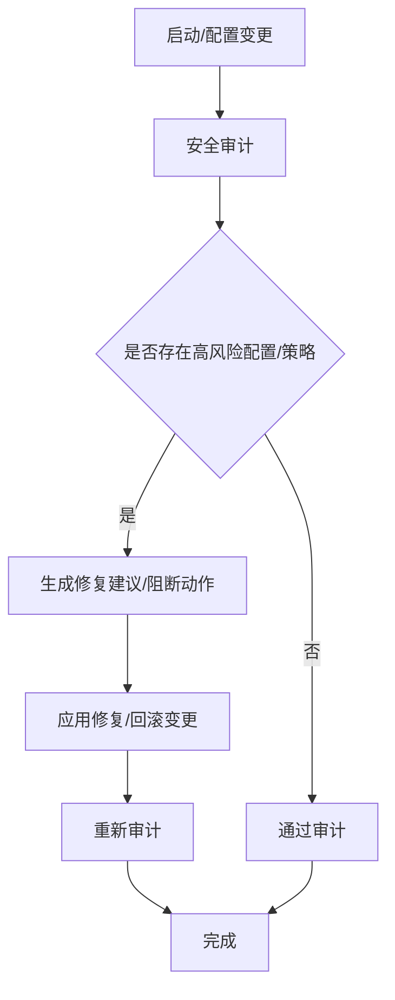
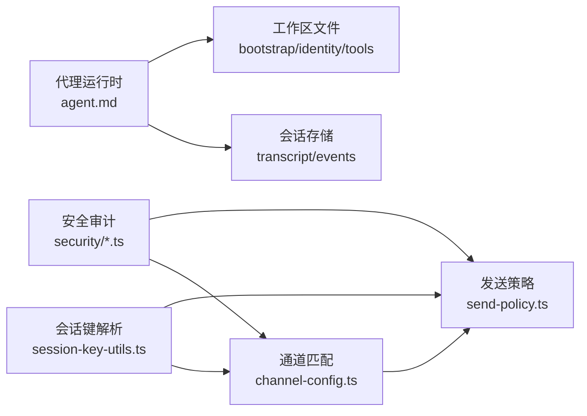

# 核心概念

<cite>
**本文引用的文件**
- [docs/concepts/session.md](file://docs/concepts/session.md)
- [docs/concepts/agent.md](file://docs/concepts/agent.md)
- [src/sessions/session-key-utils.ts](file://src/sessions/session-key-utils.ts)
- [src/channels/channel-config.ts](file://src/channels/channel-config.ts)
- [src/sessions/send-policy.ts](file://src/sessions/send-policy.ts)
- [src/sessions/session-id.ts](file://src/sessions/session-id.ts)
- [src/sessions/transcript-events.ts](file://src/sessions/transcript-events.ts)
- [src/sessions/session-label.ts](file://src/sessions/session-label.ts)
- [src/sessions/level-overrides.ts](file://src/sessions/level-overrides.ts)
- [src/sessions/model-overrides.ts](file://src/sessions/model-overrides.ts)
- [src/security/audit.ts](file://src/security/audit.ts)
- [src/security/dm-policy-shared.ts](file://src/security/dm-policy-shared.ts)
- [src/security/external-content.ts](file://src/security/external-content.ts)
- [src/security/dangerous-tools.ts](file://src/security/dangerous-tools.ts)
- [src/security/fix.ts](file://src/security/fix.ts)
- [src/security/audit-channel.ts](file://src/security/audit-channel.ts)
- [src/security/audit-extra.ts](file://src/security/audit-extra.ts)
- [src/security/audit-fs.ts](file://src/security/audit-fs.ts)
- [src/security/audit-tool-policy.ts](file://src/security/audit-tool-policy.ts)
- [src/security/mutable-allowlist-detectors.ts](file://src/security/mutable-allowlist-detectors.ts)
- [src/security/dangerous-config-flags.ts](file://src/security/dangerous-config-flags.ts)
- [src/security/fix.test.ts](file://src/security/fix.test.ts)
- [src/security/audit.test.ts](file://src/security/audit.test.ts)
- [src/security/dm-policy-channel-smoke.test.ts](file://src/security/dm-policy-channel-smoke.test.ts)
- [src/security/dm-policy-shared.test.ts](file://src/security/dm-policy-shared.test.ts)
- [src/security/external-content.test.ts](file://src/security/external-content.test.ts)
- [src/security/audit-channel.test.ts](file://src/security/audit-channel.test.ts)
- [src/security/audit-extra.test.ts](file://src/security/audit-extra.test.ts)
- [src/security/audit-fs.test.ts](file://src/security/audit-fs.test.ts)
- [src/security/audit-tool-policy.test.ts](file://src/security/audit-tool-policy.test.ts)
- [src/security/mutable-allowlist-detectors.test.ts](file://src/security/mutable-allowlist-detectors.test.ts)
- [src/security/dangerous-config-flags.test.ts](file://src/security/dangerous-config-flags.test.ts)
</cite>

## 目录

1. [引言](#引言)
2. [项目结构](#项目结构)
3. [核心组件](#核心组件)
4. [架构总览](#架构总览)
5. [详细组件分析](#详细组件分析)
6. [依赖关系分析](#依赖关系分析)
7. [性能考量](#性能考量)
8. [故障排查指南](#故障排查指南)
9. [结论](#结论)
10. [附录](#附录)

## 引言

本篇“核心概念”文档聚焦于OpenClaw的关键运行机制：会话管理、通道系统、AI代理工作原理与安全模型。我们将从系统架构视角出发，结合实际源码路径，解释会话生命周期与状态管理、通道适配器的匹配与路由策略、AI代理的决策流程与工具调用、以及多层次安全模型与权限控制。文档同时提供概念图与流程图，帮助开发者快速建立整体认知。

## 项目结构

OpenClaw采用多模块分层组织：概念文档位于docs目录，核心运行时逻辑分布在src下（会话、通道、安全、代理等子域），并通过CLI与网关进行统一编排。本文档围绕以下主题展开：

- 会话管理：键空间、生命周期、维护策略、发送策略
- 通道系统：通道匹配、路由元数据、键候选生成
- AI代理：工作区注入、技能加载、流式输出与队列模式
- 安全模型：审计、危险配置与工具、外部内容、DM策略

**图表来源**

- [docs/concepts/session.md:1-311](file://docs/concepts/session.md#L1-L311)
- [docs/concepts/agent.md:1-124](file://docs/concepts/agent.md#L1-L124)
- [src/sessions/session-key-utils.ts:1-133](file://src/sessions/session-key-utils.ts#L1-L133)
- [src/sessions/send-policy.ts](file://src/sessions/send-policy.ts)
- [src/sessions/session-id.ts](file://src/sessions/session-id.ts)
- [src/sessions/session-label.ts](file://src/sessions/session-label.ts)
- [src/sessions/transcript-events.ts](file://src/sessions/transcript-events.ts)
- [src/channels/channel-config.ts:1-183](file://src/channels/channel-config.ts#L1-L183)
- [src/security/audit.ts](file://src/security/audit.ts)
- [src/security/dm-policy-shared.ts](file://src/security/dm-policy-shared.ts)
- [src/security/external-content.ts](file://src/security/external-content.ts)
- [src/security/dangerous-tools.ts](file://src/security/dangerous-tools.ts)
- [src/security/fix.ts](file://src/security/fix.ts)

**章节来源**

- [docs/concepts/session.md:1-311](file://docs/concepts/session.md#L1-L311)
- [docs/concepts/agent.md:1-124](file://docs/concepts/agent.md#L1-L124)
- [src/sessions/session-key-utils.ts:1-133](file://src/sessions/session-key-utils.ts#L1-L133)
- [src/channels/channel-config.ts:1-183](file://src/channels/channel-config.ts#L1-L183)

## 核心组件

本节概述OpenClaw三大核心：会话、通道与安全，并给出它们在系统中的职责边界与交互方式。

- 会话管理
  - 负责会话键空间设计、会话生命周期与重置策略、维护与清理、发送策略、转录事件与标签
  - 关键实现参考：会话键解析、发送策略、会话ID/标签/事件
- 通道系统
  - 负责通道匹配、键候选生成、路由元数据解析与回退策略
  - 关键实现参考：通道匹配与键候选
- 安全模型
  - 负责安全审计、危险配置与工具检测、外部内容处理、DM策略与修复建议
  - 关键实现参考：安全审计、DM策略共享、外部内容、危险工具、修复建议

**章节来源**

- [docs/concepts/session.md:1-311](file://docs/concepts/session.md#L1-L311)
- [src/sessions/session-key-utils.ts:1-133](file://src/sessions/session-key-utils.ts#L1-L133)
- [src/sessions/send-policy.ts](file://src/sessions/send-policy.ts)
- [src/sessions/session-id.ts](file://src/sessions/session-id.ts)
- [src/sessions/session-label.ts](file://src/sessions/session-label.ts)
- [src/sessions/transcript-events.ts](file://src/sessions/transcript-events.ts)
- [src/channels/channel-config.ts:1-183](file://src/channels/channel-config.ts#L1-L183)
- [src/security/audit.ts](file://src/security/audit.ts)
- [src/security/dm-policy-shared.ts](file://src/security/dm-policy-shared.ts)
- [src/security/external-content.ts](file://src/security/external-content.ts)
- [src/security/dangerous-tools.ts](file://src/security/dangerous-tools.ts)
- [src/security/fix.ts](file://src/security/fix.ts)

## 架构总览

OpenClaw以“网关为中心”的分布式架构运行：UI客户端通过网关查询会话列表与令牌统计；通道适配器负责入站消息与路由；代理运行时在工作区内执行推理与工具调用；安全模块贯穿配置校验、审计与修复。

**图表来源**

- [docs/concepts/session.md:57-62](file://docs/concepts/session.md#L57-L62)
- [docs/concepts/agent.md:1-124](file://docs/concepts/agent.md#L1-L124)
- [src/security/audit.ts](file://src/security/audit.ts)
- [src/channels/channel-config.ts:1-183](file://src/channels/channel-config.ts#L1-L183)

## 详细组件分析

### 会话管理

会话是OpenClaw的核心抽象，承载对话历史与上下文。其设计要点包括：

- 键空间与作用域
  - 主键与直接消息作用域(dmScope)：支持main、per-peer、per-channel-peer、per-account-channel-peer
  - 群组/频道/线程隔离：按通道与账号维度拆分
  - 身份映射(identityLinks)：跨通道合并同一联系人的DM会话
- 生命周期与重置
  - 重置策略：每日重置(daily)与空闲重置(idle)，可按类型与通道覆盖
  - 触发方式：/new或/reset命令触发新会话ID
- 维护与清理
  - 维护模式：warn/enforce；按时间、数量、磁盘预算与轮换阈值控制
  - 清理顺序：过期裁剪→计数上限→归档→清理旧归档→轮换→磁盘预算
- 发送策略
  - 基于规则的允许/拒绝，支持按通道、键前缀与原始键前缀匹配
- 转录与事件
  - JSONL格式存储，转录事件用于上下文修剪与内存刷新

**图表来源**

- [docs/concepts/session.md:207-244](file://docs/concepts/session.md#L207-L244)
- [docs/concepts/session.md:74-120](file://docs/concepts/session.md#L74-L120)
- [src/sessions/send-policy.ts](file://src/sessions/send-policy.ts)
- [src/sessions/transcript-events.ts](file://src/sessions/transcript-events.ts)

**章节来源**

- [docs/concepts/session.md:1-311](file://docs/concepts/session.md#L1-L311)
- [src/sessions/session-id.ts](file://src/sessions/session-id.ts)
- [src/sessions/session-label.ts](file://src/sessions/session-label.ts)
- [src/sessions/transcript-events.ts](file://src/sessions/transcript-events.ts)
- [src/sessions/send-policy.ts](file://src/sessions/send-policy.ts)
- [src/sessions/level-overrides.ts](file://src/sessions/level-overrides.ts)
- [src/sessions/model-overrides.ts](file://src/sessions/model-overrides.ts)

### 通道系统与路由

通道适配器负责将来自不同平台的消息标准化并路由到正确的会话键。其关键能力：

- 通道匹配
  - 支持直接匹配、父级匹配、通配符匹配与键规范化
  - 匹配结果携带来源信息(direct/parent/wildcard)，便于审计与诊断
- 键候选生成
  - 从多种输入生成去重后的候选键集合，确保路由稳定
- 路由元数据
  - 提供label/provider/from/to/accountId/threadId等origin字段，增强UI可解释性

**图表来源**

- [src/channels/channel-config.ts:60-164](file://src/channels/channel-config.ts#L60-L164)
- [src/sessions/session-key-utils.ts:1-133](file://src/sessions/session-key-utils.ts#L1-L133)
- [docs/concepts/session.md:295-311](file://docs/concepts/session.md#L295-L311)

**章节来源**

- [src/channels/channel-config.ts:1-183](file://src/channels/channel-config.ts#L1-L183)
- [src/sessions/session-key-utils.ts:1-133](file://src/sessions/session-key-utils.ts#L1-L133)
- [docs/concepts/session.md:295-311](file://docs/concepts/session.md#L295-L311)

### AI代理工作原理

代理运行时基于嵌入式pi-mono内核，提供统一的推理与工具调用环境：

- 工作区与引导
  - 单一工作区作为cwd，首次会话注入AGENTS.md/SOUL.md/TOOLS.md/BOOTSTRAP.md/IDENTITY.md/USER.md等文件
  - 支持禁用引导文件创建，适用于预填充工作区
- 技能与工具
  - 从三处加载技能：内置、本地managed与工作区，工作区优先
  - 核心系统工具始终可用，部分高级工具受工具策略限制
- 流式输出与队列
  - steer模式：入站消息注入当前运行；队列在每次工具调用后检查，有排队消息则跳过剩余工具调用并优先处理
  - followup/collect模式：当前回合结束后再启动新回合
  - 可配置块流式边界(text_end/message_end)、块大小与合并策略
- 模型引用
  - 以“provider/model”形式解析模型引用，支持OpenRouter风格的多段ID

**图表来源**

- [docs/concepts/agent.md:24-104](file://docs/concepts/agent.md#L24-L104)

**章节来源**

- [docs/concepts/agent.md:1-124](file://docs/concepts/agent.md#L1-L124)

### 安全模型与权限控制

OpenClaw的安全模型贯穿配置、通道、工具与外部内容四个层面：

- 审计
  - 全面审计配置与运行时状态，输出可操作的修复建议
  - 包括通道元数据、额外审计项、文件系统访问、工具策略等
- DM策略
  - 针对多用户共享收件箱的直接消息隔离策略，避免上下文泄露
- 外部内容
  - 对外部输入进行清洗与标记，降低风险
- 危险配置与工具
  - 检测潜在危险配置标志与工具，提供阻断与修复指引
- 修复建议
  - 针对发现的问题提供最小可行修复方案，支持测试用例验证

**图表来源**

- [src/security/audit.ts](file://src/security/audit.ts)
- [src/security/dm-policy-shared.ts](file://src/security/dm-policy-shared.ts)
- [src/security/external-content.ts](file://src/security/external-content.ts)
- [src/security/dangerous-tools.ts](file://src/security/dangerous-tools.ts)
- [src/security/fix.ts](file://src/security/fix.ts)

**章节来源**

- [src/security/audit.ts](file://src/security/audit.ts)
- [src/security/dm-policy-shared.ts](file://src/security/dm-policy-shared.ts)
- [src/security/external-content.ts](file://src/security/external-content.ts)
- [src/security/dangerous-tools.ts](file://src/security/dangerous-tools.ts)
- [src/security/fix.ts](file://src/security/fix.ts)
- [src/security/audit-channel.ts](file://src/security/audit-channel.ts)
- [src/security/audit-extra.ts](file://src/security/audit-extra.ts)
- [src/security/audit-fs.ts](file://src/security/audit-fs.ts)
- [src/security/audit-tool-policy.ts](file://src/security/audit-tool-policy.ts)
- [src/security/mutable-allowlist-detectors.ts](file://src/security/mutable-allowlist-detectors.ts)
- [src/security/dangerous-config-flags.ts](file://src/security/dangerous-config-flags.ts)

## 依赖关系分析

- 会话键解析依赖通道配置的键候选生成，保证路由一致性
- 发送策略依赖会话键解析与通道匹配结果，形成“键→策略→路由”的闭环
- 安全模块对通道、工具策略与配置进行交叉审计，形成纵深防御
- 代理运行时依赖会话存储与工作区文件，形成“上下文→推理→工具→输出”的流水线

**图表来源**

- [src/sessions/session-key-utils.ts:1-133](file://src/sessions/session-key-utils.ts#L1-L133)
- [src/channels/channel-config.ts:1-183](file://src/channels/channel-config.ts#L1-L183)
- [src/sessions/send-policy.ts](file://src/sessions/send-policy.ts)
- [src/security/audit.ts](file://src/security/audit.ts)
- [docs/concepts/agent.md:1-124](file://docs/concepts/agent.md#L1-L124)
- [src/sessions/transcript-events.ts](file://src/sessions/transcript-events.ts)

**章节来源**

- [src/sessions/session-key-utils.ts:1-133](file://src/sessions/session-key-utils.ts#L1-L133)
- [src/channels/channel-config.ts:1-183](file://src/channels/channel-config.ts#L1-L183)
- [src/sessions/send-policy.ts](file://src/sessions/send-policy.ts)
- [src/security/audit.ts](file://src/security/audit.ts)
- [docs/concepts/agent.md:1-124](file://docs/concepts/agent.md#L1-L124)
- [src/sessions/transcript-events.ts](file://src/sessions/transcript-events.ts)

## 性能考量

- 会话存储写入路径上的维护开销
  - 高count上限、长过期窗口、大量归档与磁盘预算会增加写延迟
  - 建议启用enforce模式并设置时间+数量双限，配合合理的磁盘预算与水位线
- 流式输出与块合并
  - 合理设置块边界与合并策略，减少单行碎片与网络抖动
- 通道匹配与键候选
  - 规范化与去重可降低匹配成本，避免重复路由

[本节为通用指导，无需特定文件引用]

## 故障排查指南

- 会话相关
  - 使用状态与会话列表命令查看store路径与最近会话，定位异常
  - 通过发送/status/context/stop/compact等命令快速诊断与干预
- 通道与路由
  - 检查通道匹配来源(direct/parent/wildcard)与键候选生成是否符合预期
  - 核对origin元数据(label/provider/from/to/accountId/threadId)以确认路由链路
- 安全与策略
  - 运行安全审计，关注危险配置与工具、外部内容与通道元数据
  - 对发现的问题按修复建议逐项修正并重新审计

**章节来源**

- [docs/concepts/session.md:279-294](file://docs/concepts/session.md#L279-L294)
- [src/channels/channel-config.ts:14-32](file://src/channels/channel-config.ts#L14-L32)
- [src/security/audit.ts](file://src/security/audit.ts)
- [src/security/fix.ts](file://src/security/fix.ts)

## 结论

OpenClaw通过清晰的会话键空间与生命周期管理、稳健的通道匹配与路由、可审计的安全模型与权限控制，构建了高可用、可扩展且安全可控的多通道智能体平台。开发者在扩展新通道、引入新工具或调整会话策略时，应遵循本文档的架构原则与最佳实践，确保系统的稳定性与安全性。

[本节为总结性内容，无需特定文件引用]

## 附录

- 术语速览
  - 会话键：agent:<agentId>:<scope>:<id>，用于唯一标识一次对话
  - dmScope：直接消息作用域，决定DM上下文隔离粒度
  - 发送策略：基于规则的允许/拒绝机制
  - origin元数据：描述会话来源的路由信息
  - steer/followup/collect：队列模式，影响消息注入时机
- 参考路径
  - 会话管理与键空间：[docs/concepts/session.md:1-311](file://docs/concepts/session.md#L1-L311)
  - 代理工作区与引导：[docs/concepts/agent.md:1-124](file://docs/concepts/agent.md#L1-L124)
  - 会话键解析与类型推断：[src/sessions/session-key-utils.ts:1-133](file://src/sessions/session-key-utils.ts#L1-L133)
  - 通道匹配与键候选：[src/channels/channel-config.ts:1-183](file://src/channels/channel-config.ts#L1-L183)
  - 发送策略：[src/sessions/send-policy.ts](file://src/sessions/send-policy.ts)
  - 安全审计与修复：[src/security/audit.ts](file://src/security/audit.ts)、[src/security/fix.ts](file://src/security/fix.ts)

[本节为补充说明，无需特定文件引用]
