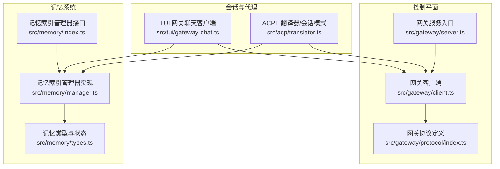
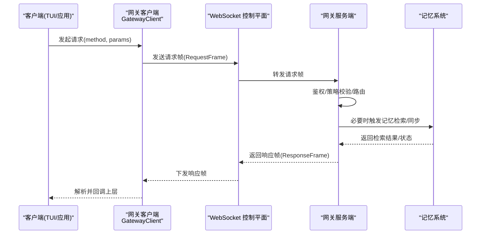
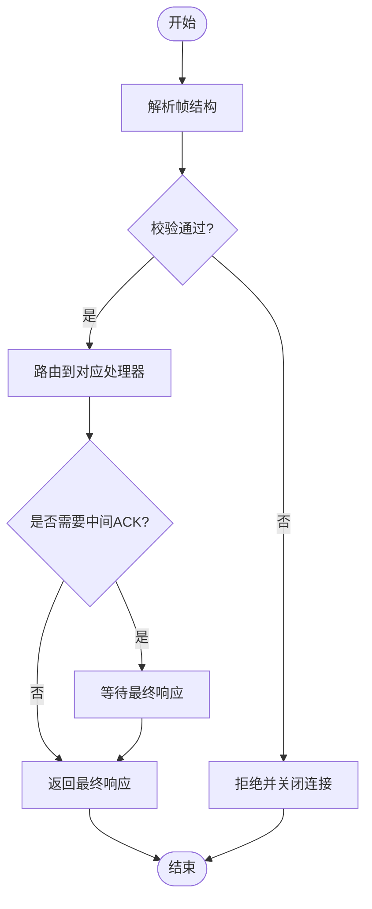
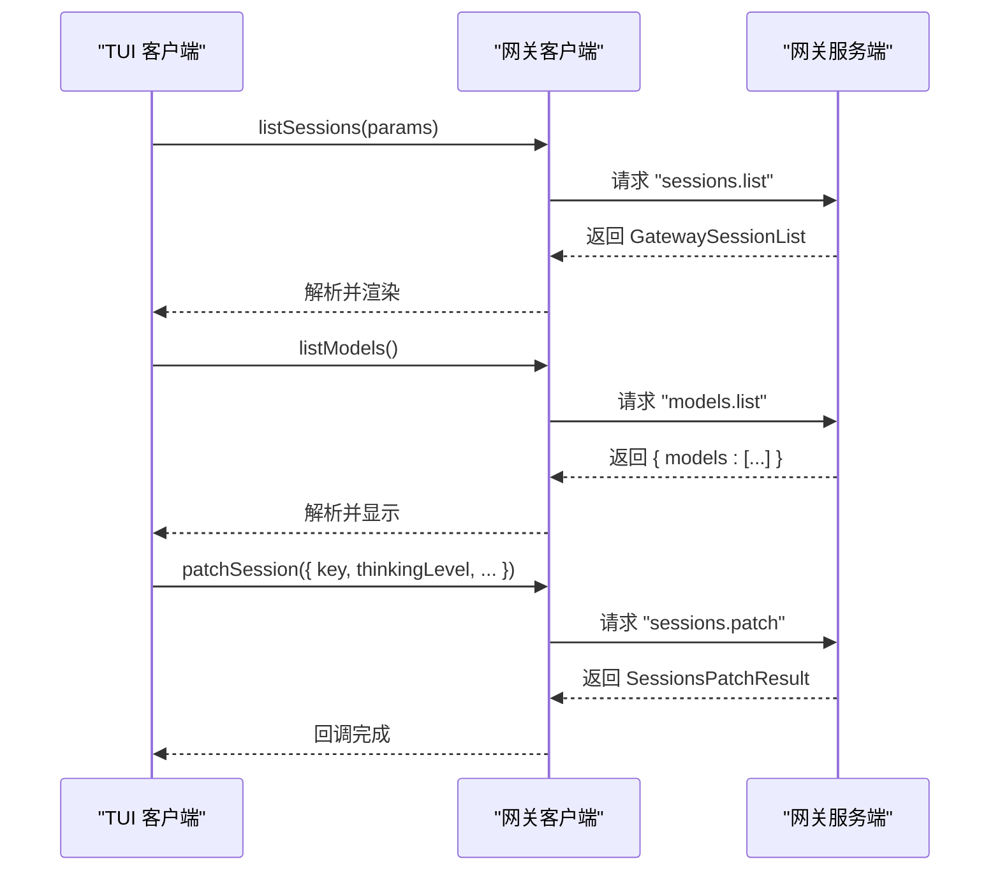
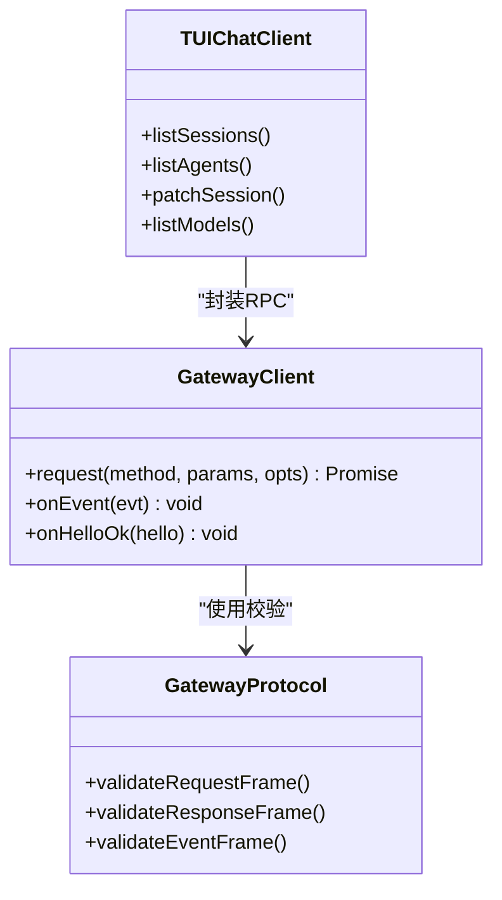
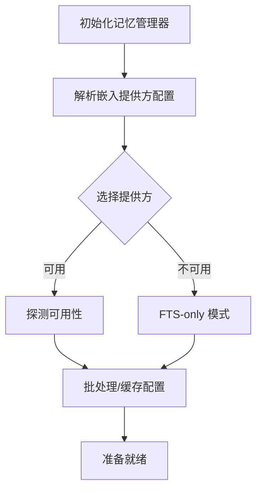
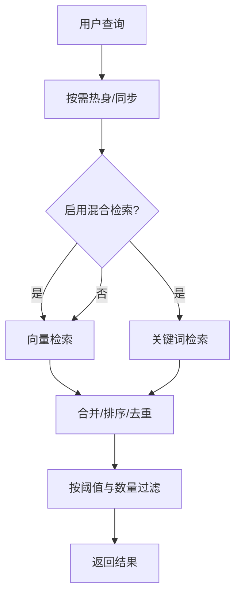
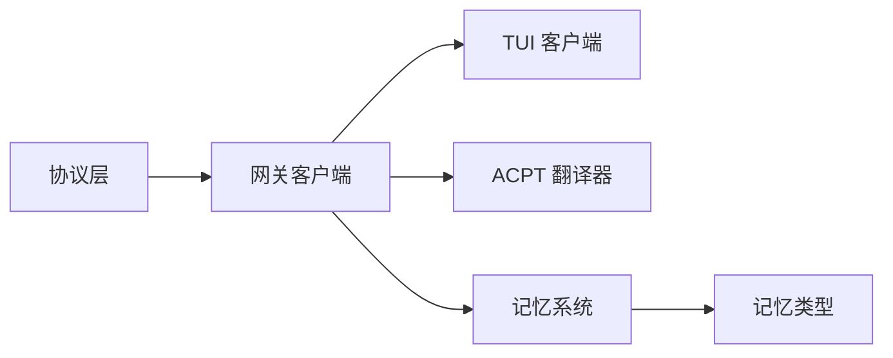
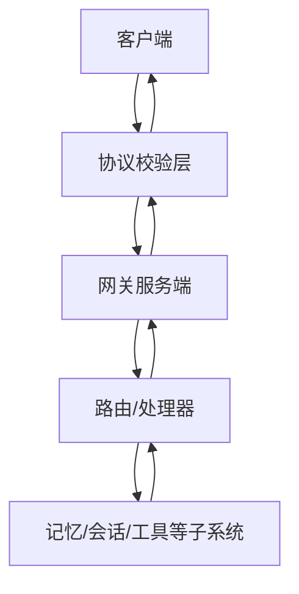

# 核心概念

<cite>
**本文引用的文件**
- [src/gateway/client.ts](file://src/gateway/client.ts)
- [src/gateway/protocol/index.ts](file://src/gateway/protocol/index.ts)
- [src/tui/gateway-chat.ts](file://src/tui/gateway-chat.ts)
- [src/acp/translator.ts](file://src/acp/translator.ts)
- [src/memory/index.ts](file://src/memory/index.ts)
- [src/memory/manager.ts](file://src/memory/manager.ts)
- [src/memory/types.ts](file://src/memory/types.ts)
- [src/gateway/server.ts](file://src/gateway/server.ts)
</cite>

## 目录

1. [引言](#引言)
2. [项目结构](#项目结构)
3. [核心组件](#核心组件)
4. [架构总览](#架构总览)
5. [详细组件分析](#详细组件分析)
6. [依赖分析](#依赖分析)
7. [性能考量](#性能考量)
8. [故障排查指南](#故障排查指南)
9. [结论](#结论)
10. [附录：术语表与概念图](#附录术语表与概念图)

## 引言

本文件面向希望深入理解 OpenClaw 系统“核心概念”的开发者与技术读者，围绕以下主题展开：网关协议架构、会话管理系统、AI 代理工作机制、模型选择策略与记忆存储机制。文档将解释各组件之间的关系与数据流（包括 WebSocket 控制平面、消息路由、工具执行与事件分发），并提供可定位到源码的路径示例与使用场景说明，帮助快速建立完整知识框架。

## 项目结构

OpenClaw 的核心由“网关客户端/协议”“会话管理”“记忆系统”“AI 代理与工具调用”等模块构成。下图给出与本文相关的关键模块与交互关系概览：

**图示来源**

- [src/gateway/client.ts](file://src/gateway/client.ts)
- [src/gateway/protocol/index.ts](file://src/gateway/protocol/index.ts)
- [src/gateway/server.ts](file://src/gateway/server.ts)
- [src/tui/gateway-chat.ts](file://src/tui/gateway-chat.ts)
- [src/acp/translator.ts](file://src/acp/translator.ts)
- [src/memory/index.ts](file://src/memory/index.ts)
- [src/memory/manager.ts](file://src/memory/manager.ts)
- [src/memory/types.ts](file://src/memory/types.ts)

**章节来源**

- [src/gateway/client.ts](file://src/gateway/client.ts)
- [src/gateway/protocol/index.ts](file://src/gateway/protocol/index.ts)
- [src/gateway/server.ts](file://src/gateway/server.ts)
- [src/tui/gateway-chat.ts](file://src/tui/gateway-chat.ts)
- [src/acp/translator.ts](file://src/acp/translator.ts)
- [src/memory/index.ts](file://src/memory/index.ts)
- [src/memory/manager.ts](file://src/memory/manager.ts)
- [src/memory/types.ts](file://src/memory/types.ts)

## 核心组件

- 网关协议与客户端
  - 协议层通过 Ajv 校验请求/响应帧与事件帧，统一方法名与参数结构，确保两端一致性。
  - 客户端负责连接建立、鉴权、心跳检测、重连退避、事件分发与请求-响应配对。
- 会话管理与代理
  - TUI 客户端封装 sessions.list/sessions.patch/status 等 RPC 调用，支持列出/修改会话、查询状态与模型列表。
  - ACP 翻译器通过 gateway.request 查询会话行信息，支撑会话模式切换等能力。
- 记忆系统
  - 提供检索接口、向量/关键词混合检索、增量同步、只读数据库恢复、批处理与缓存等能力；支持按会话热身与搜索触发同步。
- 模型选择策略
  - 记忆管理器在初始化时解析配置，选择嵌入模型提供方（如 OpenAI、本地、Gemini、Voyage、Mistral、Ollama 或自动），并记录回退原因与可用性状态。

**章节来源**

- [src/gateway/protocol/index.ts](file://src/gateway/protocol/index.ts)
- [src/gateway/client.ts](file://src/gateway/client.ts)
- [src/tui/gateway-chat.ts](file://src/tui/gateway-chat.ts)
- [src/acp/translator.ts](file://src/acp/translator.ts)
- [src/memory/index.ts](file://src/memory/index.ts)
- [src/memory/manager.ts](file://src/memory/manager.ts)
- [src/memory/types.ts](file://src/memory/types.ts)

## 架构总览

下图展示从客户端到网关再到记忆系统的典型交互流程：客户端通过 WebSocket 控制平面发起请求，网关进行鉴权与策略校验后，将请求路由至相应子系统（如会话、记忆、工具等），并在必要时返回事件或最终响应。

**图示来源**

- [src/gateway/client.ts](file://src/gateway/client.ts)
- [src/gateway/protocol/index.ts](file://src/gateway/protocol/index.ts)
- [src/memory/manager.ts](file://src/memory/manager.ts)

**章节来源**

- [src/gateway/client.ts](file://src/gateway/client.ts)
- [src/gateway/protocol/index.ts](file://src/gateway/protocol/index.ts)
- [src/memory/manager.ts](file://src/memory/manager.ts)

## 详细组件分析

### 组件一：网关协议架构与控制平面

- 协议定义
  - 使用 Ajv 对请求帧、响应帧、事件帧与各方法参数进行编译式校验，保证输入输出结构一致。
  - 方法集合覆盖会话、配置、技能、节点、工具、日志、定时任务等，统一以字符串方法名驱动。
- 控制平面
  - 客户端负责握手挑战、鉴权令牌加载与持久化、设备签名、TLS 指纹校验、心跳监控与断线重连。
  - 支持“期望最终响应”模式，避免提前解析中间 ACK 帧。
- 错误与恢复
  - 连接错误码与恢复建议可从细节中提取，支持基于设备令牌的单次重试预算与受信端点判定，防止无限重连循环。

**图示来源**

- [src/gateway/protocol/index.ts](file://src/gateway/protocol/index.ts)
- [src/gateway/client.ts](file://src/gateway/client.ts)

**章节来源**

- [src/gateway/protocol/index.ts](file://src/gateway/protocol/index.ts)
- [src/gateway/client.ts](file://src/gateway/client.ts)

### 组件二：会话管理系统

- 列表与查询
  - TUI 客户端封装 sessions.list/sessions.patch/status/models.list 等 RPC，支持限制数量、活跃分钟数、包含全局/未知会话、派生标题与最后消息预览等。
- 会话模式与状态
  - ACP 翻译器通过 gateway.request 查询会话行信息，用于派生标题、模型提供商、上下文/令牌用量等字段，支撑会话模式切换与可视化。
- 事件与心跳
  - 客户端监听 connect.challenge、tick 等事件，维护序列号与间隙检测，保障长连接稳定。

**图示来源**

- [src/tui/gateway-chat.ts](file://src/tui/gateway-chat.ts)
- [src/acp/translator.ts](file://src/acp/translator.ts)
- [src/gateway/client.ts](file://src/gateway/client.ts)

**章节来源**

- [src/tui/gateway-chat.ts](file://src/tui/gateway-chat.ts)
- [src/acp/translator.ts](file://src/acp/translator.ts)
- [src/gateway/client.ts](file://src/gateway/client.ts)

### 组件三：AI 代理工作机制

- 代理与会话
  - 代理通过会话键（sessionKey）参与对话生命周期管理，ACPT 翻译器可查询会话行信息以辅助决策与呈现。
- 工具与节点
  - 协议层提供节点配对、节点描述、节点调用、节点事件等方法，支持工具链扩展与执行审批。
- 事件驱动
  - 客户端接收 connect.challenge、tick、AgentEvent、ShutdownEvent 等事件，驱动 UI 更新与后台任务调度。

**图示来源**

- [src/gateway/client.ts](file://src/gateway/client.ts)
- [src/gateway/protocol/index.ts](file://src/gateway/protocol/index.ts)
- [src/tui/gateway-chat.ts](file://src/tui/gateway-chat.ts)

**章节来源**

- [src/gateway/client.ts](file://src/gateway/client.ts)
- [src/gateway/protocol/index.ts](file://src/gateway/protocol/index.ts)
- [src/tui/gateway-chat.ts](file://src/tui/gateway-chat.ts)

### 组件四：模型选择策略

- 初始化与提供方解析
  - 记忆管理器在构造时解析配置，决定嵌入模型提供方（OpenAI、本地、Gemini、Voyage、Mistral、Ollama 或 auto），并记录回退来源与原因。
- 可用性探测
  - 支持探测嵌入与向量可用性，若不可用则进入 FTS-only 模式，仍可进行关键词检索。
- 批处理与缓存
  - 支持批量嵌入、并发与轮询间隔配置，以及嵌入缓存条目上限；具备只读数据库恢复能力，提升稳定性。

**图示来源**

- [src/memory/manager.ts](file://src/memory/manager.ts)
- [src/memory/types.ts](file://src/memory/types.ts)

**章节来源**

- [src/memory/manager.ts](file://src/memory/manager.ts)
- [src/memory/types.ts](file://src/memory/types.ts)

### 组件五：记忆存储机制

- 检索策略
  - 支持向量检索、关键词检索与混合检索（BM25、MMR、时间衰减），并根据最小分数与最大结果数过滤。
- 同步与热身
  - 搜索前可触发同步；支持按会话启动时热身，减少首次检索延迟。
- 数据库与只读恢复
  - SQLite 数据库，具备只读错误自动重连与模式重建能力；支持额外路径白名单与工作区内外文件读取。

**图示来源**

- [src/memory/manager.ts](file://src/memory/manager.ts)
- [src/memory/types.ts](file://src/memory/types.ts)

**章节来源**

- [src/memory/manager.ts](file://src/memory/manager.ts)
- [src/memory/types.ts](file://src/memory/types.ts)

## 依赖分析

- 组件耦合
  - 网关客户端依赖协议层进行帧校验与方法定义；TUI 客户端与 ACP 翻译器均通过客户端发起 RPC。
  - 记忆系统独立于协议层，但被会话与代理流程调用；其内部依赖嵌入提供方与 SQLite 存储。
- 外部集成点
  - 设备身份与签名、TLS 指纹校验、心跳与断线重连策略，确保控制面安全与稳健。
- 循环依赖
  - 当前结构未见直接循环依赖；协议层仅作为校验与 Schema 定义存在，不反向依赖客户端。

**图示来源**

- [src/gateway/protocol/index.ts](file://src/gateway/protocol/index.ts)
- [src/gateway/client.ts](file://src/gateway/client.ts)
- [src/tui/gateway-chat.ts](file://src/tui/gateway-chat.ts)
- [src/acp/translator.ts](file://src/acp/translator.ts)
- [src/memory/index.ts](file://src/memory/index.ts)
- [src/memory/types.ts](file://src/memory/types.ts)

**章节来源**

- [src/gateway/protocol/index.ts](file://src/gateway/protocol/index.ts)
- [src/gateway/client.ts](file://src/gateway/client.ts)
- [src/tui/gateway-chat.ts](file://src/tui/gateway-chat.ts)
- [src/acp/translator.ts](file://src/acp/translator.ts)
- [src/memory/index.ts](file://src/memory/index.ts)
- [src/memory/types.ts](file://src/memory/types.ts)

## 性能考量

- 连接与心跳
  - 客户端内置心跳监控与断线退避，避免空闲连接占用资源；TLS 指纹校验仅在 wss 场景启用，兼顾安全与性能。
- 检索与批处理
  - 记忆系统支持批处理与并发控制，结合嵌入缓存与只读恢复，降低高负载下的延迟与失败率。
- 搜索优化
  - 混合检索通过权重与 MMR、时间衰减等策略提升相关性；候选集放大系数与最小分数阈值可调，平衡召回与质量。

[本节为通用指导，无需特定文件引用]

## 故障排查指南

- 连接与认证
  - 若出现“缺少挑战 nonce”“连接超时”“设备令牌不匹配”等错误，检查网关 URL 是否为 wss、是否设置 TLS 指纹、设备令牌是否过期。
- 断线与重连
  - 观察心跳超时与错误详情码，确认是否触发暂停重连策略（如令牌缺失/配对要求）。
- 记忆系统
  - 若只读数据库错误频繁，系统会自动重连并重建模式；关注批处理失败次数与最后错误来源，必要时调整并发与轮询间隔。

**章节来源**

- [src/gateway/client.ts](file://src/gateway/client.ts)

## 结论

OpenClaw 的核心以“网关协议+控制平面”为骨架，配合“会话管理+记忆检索+模型策略”，形成可扩展、可观测且健壮的 AI 代理运行时。通过 WebSocket 控制平面实现请求-响应与事件驱动，借助记忆系统提供上下文增强与检索加速，使代理在多通道、多模型场景下保持一致体验与可控成本。

[本节为总结，无需特定文件引用]

## 附录：术语表与概念图

- 术语表
  - 网关客户端：负责与网关建立与维护 WebSocket 连接、发送请求、接收事件与响应的客户端组件。
  - 协议帧：请求帧、响应帧、事件帧的统称，承载方法名、参数与负载。
  - 会话：一次或多轮对话的上下文容器，包含模型、令牌用量、思考/推理级别等状态。
  - 记忆系统：提供向量/关键词混合检索、增量同步、批处理与缓存的索引与存储子系统。
  - 设备令牌：基于设备身份签发的长期凭据，用于无共享令牌场景的自动重试与持久化。
  - FTS-only：在无嵌入提供方可用时的关键词检索模式。

- 概念图（控制平面与消息路由）

[本图为概念示意，无需图示来源]
