# 核心概念

<cite>
**本文引用的文件**
- [src/gateway/client.ts](file://src/gateway/client.ts)
- [src/gateway/protocol/index.ts](file://src/gateway/protocol/index.ts)
- [src/gateway/protocol/schema/types.ts](file://src/gateway/protocol/schema/types.ts)
- [src/gateway/protocol/schema/protocol-schemas.ts](file://src/gateway/protocol/schema/protocol-schemas.ts)
- [src/tui/gateway-chat.ts](file://src/tui/gateway-chat.ts)
- [src/acp/translator.ts](file://src/acp/translator.ts)
- [src/memory/index.ts](file://src/memory/index.ts)
- [src/memory/manager.ts](file://src/memory/manager.ts)
- [src/memory/types.ts](file://src/memory/types.ts)
- [src/gateway/server.ts](file://src/gateway/server.ts)
- [src/commands/agents.ts](file://src/commands/agents.ts)
- [src/commands/agents.bindings.ts](file://src/commands/agents.bindings.ts)
- [src/commands/agents.commands.add.ts](file://src/commands/agents.commands.add.ts)
- [src/commands/agents.commands.bind.ts](file://src/commands/agents.commands.bind.ts)
- [src/gateway/protocol/schema/agents-models-skills.ts](file://src/gateway/protocol/schema/agents-models-skills.ts)
- [src/gateway/protocol/schema/channels.ts](file://src/gateway/protocol/schema/channels.ts)
- [src/gateway/server-methods/channels.ts](file://src/gateway/server-methods/channels.ts)
- [src/gateway/server-methods/web.ts](file://src/gateway/server-methods/web.ts)
- [src/shared/session-types.ts](file://src/shared/session-types.ts)
</cite>

## 更新摘要
**所做更改**
- 新增代理管理系统章节，涵盖代理创建、配置、身份管理和文件管理
- 新增通道管理系统章节，包含通道状态监控、登录登出和Web登录流程
- 更新架构总览以反映新的代理和通道管理功能
- 增强协议架构部分，添加新的代理和通道相关方法
- 更新依赖分析以包含新的代理和通道组件

## 目录
1. [引言](#引言)
2. [项目结构](#项目结构)
3. [核心组件](#核心组件)
4. [架构总览](#架构总览)
5. [详细组件分析](#详细组件分析)
6. [依赖分析](#依赖分析)
7. [性能考量](#性能考量)
8. [故障排查指南](#故障排查指南)
9. [结论](#结论)
10. [附录：术语表与概念图](#附录术语表与概念图)

## 引言
本文件面向希望深入理解 OpenClaw 系统"核心概念"的开发者与技术读者，围绕以下主题展开：网关协议架构、会话管理系统、AI 代理工作机制、模型选择策略、记忆存储机制和**新增的代理管理系统**与**通道管理系统**。文档将解释各组件之间的关系与数据流（包括 WebSocket 控制平面、消息路由、工具执行与事件分发），并提供可定位到源码的路径示例与使用场景说明，帮助快速建立完整知识框架。

## 项目结构
OpenClaw 的核心由"网关客户端/协议"、"会话管理"、"记忆系统"、"AI 代理与工具调用"、**"代理管理系统"**和**"通道管理系统"**等模块构成。下图给出与本文相关的关键模块与交互关系概览：

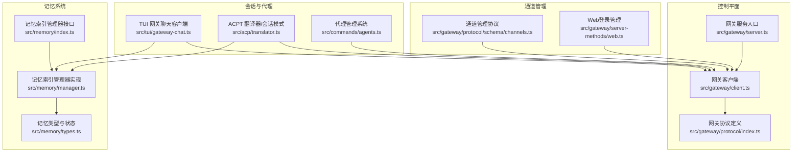
```mermaid
graph TB
subgraph "控制平面"
GWClient["网关客户端<br/>src/gateway/client.ts"]
GWProto["网关协议定义<br/>src/gateway/protocol/index.ts"]
GWServer["网关服务入口<br/>src/gateway/server.ts"]
end
subgraph "会话与代理"
TUIChat["TUI 网关聊天客户端<br/>src/tui/gateway-chat.ts"]
ACP["ACPT 翻译器/会话模式<br/>src/acp/translator.ts"]
Agents["代理管理系统<br/>src/commands/agents.ts"]
end
subgraph "通道管理"
Channels["通道管理协议<br/>src/gateway/protocol/schema/channels.ts"]
WebLogin["Web登录管理<br/>src/gateway/server-methods/web.ts"]
end
subgraph "记忆系统"
MemIdx["记忆索引管理器接口<br/>src/memory/index.ts"]
MemMgr["记忆索引管理器实现<br/>src/memory/manager.ts"]
MemTypes["记忆类型与状态<br/>src/memory/types.ts"]
end
GWClient --> GWProto
GWServer --> GWClient
TUIChat --> GWClient
ACP --> GWClient
Agents --> GWClient
Channels --> GWClient
WebLogin --> GWClient
MemIdx --> MemMgr
MemMgr --> MemTypes
TUIChat --> MemMgr
ACP --> MemMgr
```

**图示来源**
- [src/gateway/client.ts](file://src/gateway/client.ts)
- [src/gateway/protocol/index.ts](file://src/gateway/protocol/index.ts)
- [src/gateway/server.ts](file://src/gateway/server.ts)
- [src/tui/gateway-chat.ts](file://src/tui/gateway-chat.ts)
- [src/acp/translator.ts](file://src/acp/translator.ts)
- [src/commands/agents.ts](file://src/commands/agents.ts)
- [src/gateway/protocol/schema/channels.ts](file://src/gateway/protocol/schema/channels.ts)
- [src/gateway/server-methods/web.ts](file://src/gateway/server-methods/web.ts)
- [src/memory/index.ts](file://src/memory/index.ts)
- [src/memory/manager.ts](file://src/memory/manager.ts)
- [src/memory/types.ts](file://src/memory/types.ts)

**章节来源**
- [src/gateway/client.ts](file://src/gateway/client.ts)
- [src/gateway/protocol/index.ts](file://src/gateway/protocol/index.ts)
- [src/gateway/server.ts](file://src/gateway/server.ts)
- [src/tui/gateway-chat.ts](file://src/tui/gateway-chat.ts)
- [src/acp/translator.ts](file://src/acp/translator.ts)
- [src/commands/agents.ts](file://src/commands/agents.ts)
- [src/gateway/protocol/schema/channels.ts](file://src/gateway/protocol/schema/channels.ts)
- [src/gateway/server-methods/web.ts](file://src/gateway/server-methods/web.ts)
- [src/memory/index.ts](file://src/memory/index.ts)
- [src/memory/manager.ts](file://src/memory/manager.ts)
- [src/memory/types.ts](file://src/memory/types.ts)

## 核心组件
- **网关协议与客户端**
  - 协议层通过 Ajv 校验请求/响应帧与事件帧，统一方法名与参数结构，确保两端一致性。
  - 客户端负责连接建立、鉴权、心跳检测、重连退避、事件分发与请求-响应配对。
- **会话管理与代理**
  - TUI 客户端封装 sessions.list/sessions.patch/status 等 RPC 调用，支持列出/修改会话、查询状态与模型列表。
  - ACP 翻译器通过 gateway.request 查询会话行信息，支撑会话模式切换等能力。
- **代理管理系统**
  - 提供代理的创建、删除、更新、身份配置和文件管理功能。
  - 支持代理配置绑定、命令行操作和代理文件的增删改查。
  - 包含代理绑定解析、账户ID解析和路由绑定管理。
- **通道管理系统**
  - 提供通道状态监控、登录登出和Web登录流程管理。
  - 支持跨平台通道集成和统一的状态报告。
  - 包含通道账户快照、启用状态管理和Web登录流程。
- **记忆系统**
  - 提供检索接口、向量/关键词混合检索、增量同步、只读数据库恢复、批处理与缓存等能力；支持按会话热身与搜索触发同步。
- **模型选择策略**
  - 记忆管理器在初始化时解析配置，选择嵌入模型提供方（如 OpenAI、本地、Gemini、Voyage、Mistral、Ollama 或自动），并记录回退原因与可用性状态。

**章节来源**
- [src/gateway/protocol/index.ts](file://src/gateway/protocol/index.ts)
- [src/gateway/client.ts](file://src/gateway/client.ts)
- [src/tui/gateway-chat.ts](file://src/tui/gateway-chat.ts)
- [src/acp/translator.ts](file://src/acp/translator.ts)
- [src/commands/agents.ts](file://src/commands/agents.ts)
- [src/commands/agents.bindings.ts](file://src/commands/agents.bindings.ts)
- [src/gateway/protocol/schema/channels.ts](file://src/gateway/protocol/schema/channels.ts)
- [src/memory/index.ts](file://src/memory/index.ts)
- [src/memory/manager.ts](file://src/memory/manager.ts)
- [src/memory/types.ts](file://src/memory/types.ts)

## 架构总览
下图展示从客户端到网关再到记忆系统的典型交互流程：客户端通过 WebSocket 控制平面发起请求，网关进行鉴权与策略校验后，将请求路由至相应子系统（如会话、记忆、工具、**代理管理**、**通道管理**等），并在必要时返回事件或最终响应。

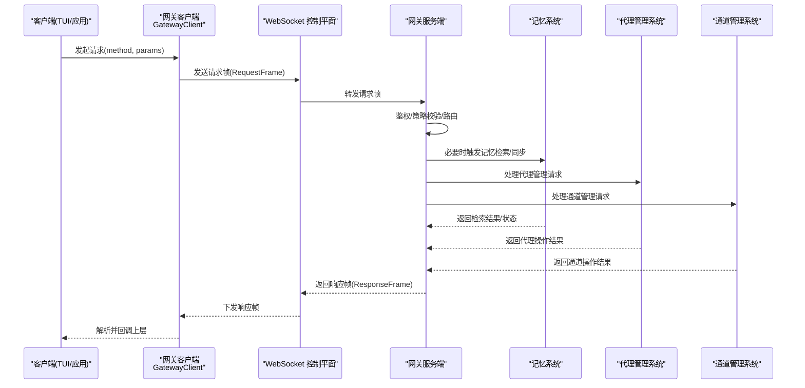
```mermaid
sequenceDiagram
participant CLI as "客户端(TUI/应用)"
participant GC as "网关客户端<br/>GatewayClient"
participant WS as "WebSocket 控制平面"
participant GS as "网关服务端"
participant MEM as "记忆系统"
participant AG as "代理管理系统"
participant CH as "通道管理系统"
CLI->>GC : 发起请求(method, params)
GC->>WS : 发送请求帧(RequestFrame)
WS->>GS : 转发请求帧
GS->>GS : 鉴权/策略校验/路由
GS->>MEM : 必要时触发记忆检索/同步
GS->>AG : 处理代理管理请求
GS->>CH : 处理通道管理请求
MEM-->>GS : 返回检索结果/状态
AG-->>GS : 返回代理操作结果
CH-->>GS : 返回通道操作结果
GS-->>WS : 返回响应帧(ResponseFrame)
WS-->>GC : 下发响应帧
GC-->>CLI : 解析并回调上层
```

**图示来源**
- [src/gateway/client.ts](file://src/gateway/client.ts)
- [src/gateway/protocol/index.ts](file://src/gateway/protocol/index.ts)
- [src/memory/manager.ts](file://src/memory/manager.ts)
- [src/commands/agents.ts](file://src/commands/agents.ts)
- [src/gateway/protocol/schema/channels.ts](file://src/gateway/protocol/schema/channels.ts)

**章节来源**
- [src/gateway/client.ts](file://src/gateway/client.ts)
- [src/gateway/protocol/index.ts](file://src/gateway/protocol/index.ts)
- [src/memory/manager.ts](file://src/memory/manager.ts)
- [src/commands/agents.ts](file://src/commands/agents.ts)
- [src/gateway/protocol/schema/channels.ts](file://src/gateway/protocol/schema/channels.ts)

## 详细组件分析

### 组件一：网关协议架构与控制平面
- **协议定义**
  - 使用 Ajv 对请求帧、响应帧、事件帧与各方法参数进行编译式校验，保证输入输出结构一致。
  - 方法集合覆盖会话、配置、技能、节点、工具、日志、定时任务、**代理管理**、**通道管理**等，统一以字符串方法名驱动。
- **控制平面**
  - 客户端负责握手挑战、鉴权令牌加载与持久化、设备签名、TLS 指纹校验、心跳监控与断线重连。
  - 支持"期望最终响应"模式，避免提前解析中间 ACK 帧。
- **错误与恢复**
  - 连接错误码与恢复建议可从细节中提取，支持基于设备令牌的单次重试预算与受信端点判定，防止无限重连循环。

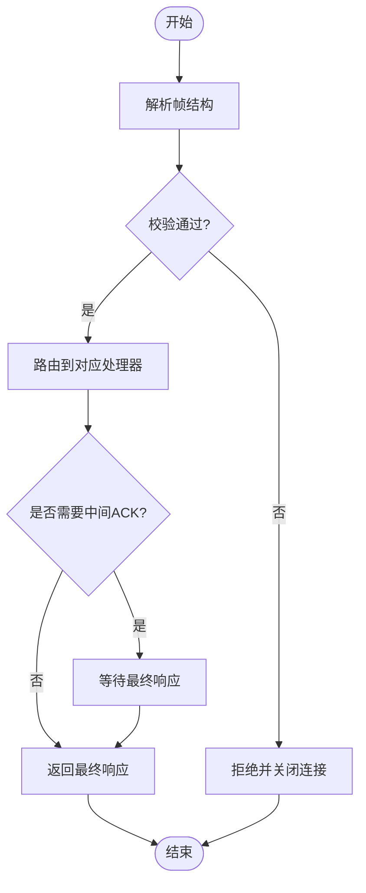
```mermaid
flowchart TD
Start(["开始"]) --> Parse["解析帧结构"]
Parse --> Validate{"校验通过?"}
Validate --> |否| Reject["拒绝并关闭连接"]
Validate --> |是| Dispatch["路由到对应处理器"]
Dispatch --> Ack{"是否需要中间ACK?"}
Ack --> |是| WaitFinal["等待最终响应"]
Ack --> |否| Respond["返回最终响应"]
WaitFinal --> Respond
Respond --> End(["结束"])
Reject --> End
```

**图示来源**
- [src/gateway/protocol/index.ts](file://src/gateway/protocol/index.ts)
- [src/gateway/client.ts](file://src/gateway/client.ts)

**章节来源**
- [src/gateway/protocol/index.ts](file://src/gateway/protocol/index.ts)
- [src/gateway/client.ts](file://src/gateway/client.ts)

### 组件二：会话管理系统
- **列表与查询**
  - TUI 客户端封装 sessions.list/sessions.patch/status/models.list 等 RPC，支持限制数量、活跃分钟数、包含全局/未知会话、派生标题与最后消息预览等。
- **会话模式与状态**
  - ACP 翻译器通过 gateway.request 查询会话行信息，用于派生标题、模型提供商、上下文/令牌用量等字段，支撑会话模式切换与可视化。
- **事件与心跳**
  - 客户端监听 connect.challenge、tick 等事件，维护序列号与间隙检测，保障长连接稳定。

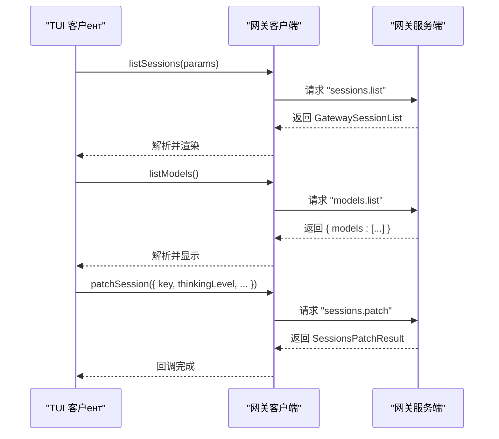
```mermaid
sequenceDiagram
participant TUI as "TUI 客户ент"
participant GC as "网关客户端"
participant GS as "网关服务端"
TUI->>GC : listSessions(params)
GC->>GS : 请求 "sessions.list"
GS-->>GC : 返回 GatewaySessionList
GC-->>TUI : 解析并渲染
TUI->>GC : listModels()
GC->>GS : 请求 "models.list"
GS-->>GC : 返回 { models : [...] }
GC-->>TUI : 解析并显示
TUI->>GC : patchSession({ key, thinkingLevel, ... })
GC->>GS : 请求 "sessions.patch"
GS-->>GC : 返回 SessionsPatchResult
GC-->>TUI : 回调完成
```

**图示来源**
- [src/tui/gateway-chat.ts](file://src/tui/gateway-chat.ts)
- [src/acp/translator.ts](file://src/acp/translator.ts)
- [src/gateway/client.ts](file://src/gateway/client.ts)

**章节来源**
- [src/tui/gateway-chat.ts](file://src/tui/gateway-chat.ts)
- [src/acp/translator.ts](file://src/acp/translator.ts)
- [src/gateway/client.ts](file://src/gateway/client.ts)

### 组件三：AI 代理工作机制
- **代理与会话**
  - 代理通过会话键（sessionKey）参与对话生命周期管理，ACPT 翻译器可查询会话行信息以辅助决策与呈现。
- **代理管理功能**
  - 支持代理的创建、删除、更新和身份配置，提供代理文件的增删改查操作。
  - 通过命令行接口提供代理管理的便捷操作。
- **工具与节点**
  - 协议层提供节点配对、节点描述、节点调用、节点事件等方法，支持工具链扩展与执行审批。
- **事件驱动**
  - 客户端接收 connect.challenge、tick、AgentEvent、ShutdownEvent 等事件，驱动 UI 更新与后台任务调度。

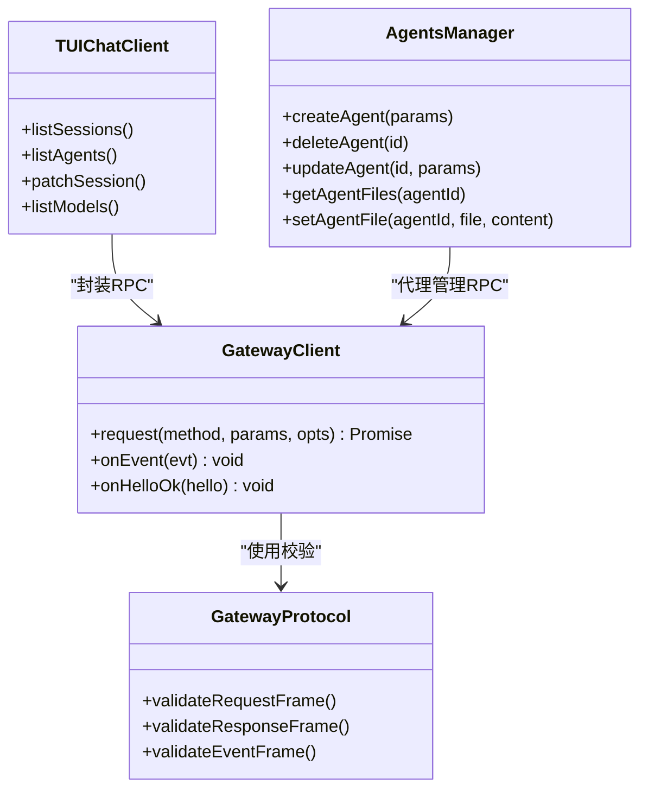
```mermaid
classDiagram
class GatewayClient {
+request(method, params, opts) Promise
+onEvent(evt) void
+onHelloOk(hello) void
}
class GatewayProtocol {
+validateRequestFrame()
+validateResponseFrame()
+validateEventFrame()
}
class TUIChatClient {
+listSessions()
+listAgents()
+patchSession()
+listModels()
}
class AgentsManager {
+createAgent(params)
+deleteAgent(id)
+updateAgent(id, params)
+getAgentFiles(agentId)
+setAgentFile(agentId, file, content)
}
GatewayClient --> GatewayProtocol : "使用校验"
TUIChatClient --> GatewayClient : "封装RPC"
AgentsManager --> GatewayClient : "代理管理RPC"
```

**图示来源**
- [src/gateway/client.ts](file://src/gateway/client.ts)
- [src/gateway/protocol/index.ts](file://src/gateway/protocol/index.ts)
- [src/tui/gateway-chat.ts](file://src/tui/gateway-chat.ts)
- [src/commands/agents.ts](file://src/commands/agents.ts)

**章节来源**
- [src/gateway/client.ts](file://src/gateway/client.ts)
- [src/gateway/protocol/index.ts](file://src/gateway/protocol/index.ts)
- [src/tui/gateway-chat.ts](file://src/tui/gateway-chat.ts)
- [src/commands/agents.ts](file://src/commands/agents.ts)

### 组件四：代理管理系统
- **代理创建与配置**
  - 支持通过 AgentsCreateParams 创建新代理，配置代理的基本信息和初始设置。
  - 提供 AgentsUpdateParams 用于更新现有代理的配置和参数。
- **代理身份管理**
  - 通过 AgentIdentityParams 和 AgentIdentityResult 管理代理的身份信息，包括名称、主题、头像等。
- **代理文件管理**
  - 支持 AgentsFilesListParams/Result、AgentsFilesGetParams/Result、AgentsFilesSetParams/Result 进行代理文件的管理。
  - 提供代理配置文件的存储、检索和更新功能。
- **代理列表与查询**
  - 通过 AgentsListParams/ListResult 获取所有代理的概览信息。
  - 支持代理的绑定和解绑操作。
- **代理绑定管理**
  - 通过 agents.bindings.ts 提供绑定解析、账户ID解析和路由绑定管理。
  - 支持绑定冲突检测、升级和移除操作。

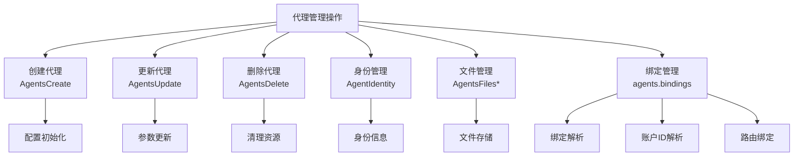
```mermaid
flowchart TD
AgentOps["代理管理操作"] --> Create["创建代理<br/>AgentsCreate"]
AgentOps --> Update["更新代理<br/>AgentsUpdate"]
AgentOps --> Delete["删除代理<br/>AgentsDelete"]
AgentOps --> Identity["身份管理<br/>AgentIdentity"]
AgentOps --> Files["文件管理<br/>AgentsFiles*"]
AgentOps --> Bindings["绑定管理<br/>agents.bindings"]
Create --> Config["配置初始化"]
Update --> Params["参数更新"]
Delete --> Cleanup["清理资源"]
Identity --> Info["身份信息"]
Files --> Store["文件存储"]
Bindings --> Parse["绑定解析"]
Bindings --> Resolve["账户ID解析"]
Bindings --> Route["路由绑定"]
```

**图示来源**
- [src/commands/agents.ts](file://src/commands/agents.ts)
- [src/commands/agents.bindings.ts](file://src/commands/agents.bindings.ts)
- [src/commands/agents.commands.add.ts](file://src/commands/agents.commands.add.ts)
- [src/commands/agents.commands.bind.ts](file://src/commands/agents.commands.bind.ts)
- [src/gateway/protocol/schema/agents-models-skills.ts](file://src/gateway/protocol/schema/agents-models-skills.ts)

**章节来源**
- [src/commands/agents.ts](file://src/commands/agents.ts)
- [src/commands/agents.bindings.ts](file://src/commands/agents.bindings.ts)
- [src/commands/agents.commands.add.ts](file://src/commands/agents.commands.add.ts)
- [src/commands/agents.commands.bind.ts](file://src/commands/agents.commands.bind.ts)
- [src/gateway/protocol/schema/agents-models-skills.ts](file://src/gateway/protocol/schema/agents-models-skills.ts)

### 组件五：通道管理系统
- **通道状态监控**
  - 通过 ChannelsStatusParams/Result 监控所有通道的状态，包括连接状态、认证状态和错误信息。
  - 支持通道的健康检查和状态报告。
  - 通道账户快照包含详细的运行时状态信息。
- **通道登录登出**
  - 提供 ChannelsLogoutParams 用于主动登出特定通道。
  - 支持通道的重新连接和状态恢复。
- **Web登录流程**
  - 通过 WebLoginStartParams/WebLoginWaitParams 实现Web登录的启动和等待流程。
  - 支持OAuth登录和其他Web认证方式。
  - 包含QR码登录和超时控制机制。
- **跨平台集成**
  - 支持多种通信平台的统一管理，包括Telegram、Discord、Slack等。
  - 提供平台特定的配置和适配。
- **通道账户管理**
  - 支持通道账户的启用/禁用状态管理。
  - 提供默认账户ID解析和账户绑定功能。

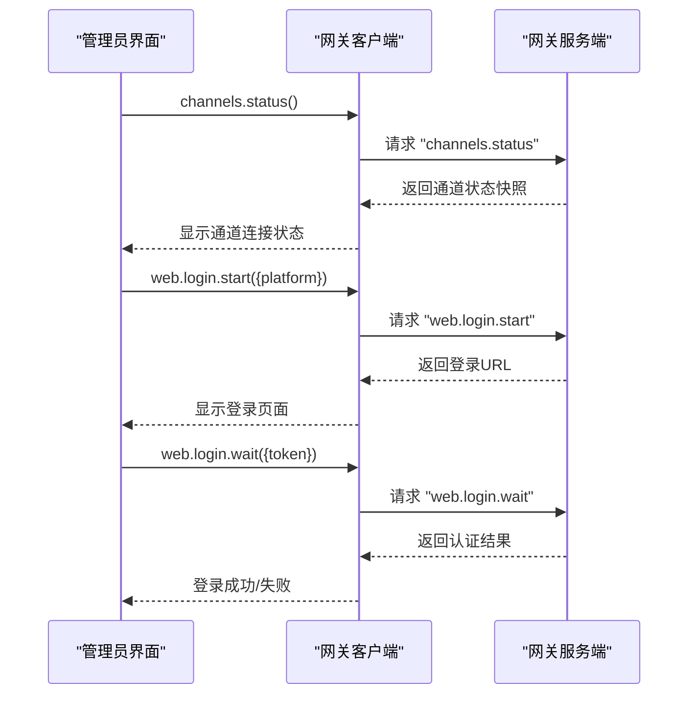
```mermaid
sequenceDiagram
participant Admin as "管理员界面"
participant GC as "网关客户端"
participant GS as "网关服务端"
Admin->>GC : channels.status()
GC->>GS : 请求 "channels.status"
GS-->>GC : 返回通道状态快照
GC-->>Admin : 显示通道连接状态
Admin->>GC : web.login.start({platform})
GC->>GS : 请求 "web.login.start"
GS-->>GC : 返回登录URL
GC-->>Admin : 显示登录页面
Admin->>GC : web.login.wait({token})
GC->>GS : 请求 "web.login.wait"
GS-->>GC : 返回认证结果
GC-->>Admin : 登录成功/失败
```

**图示来源**
- [src/gateway/protocol/schema/channels.ts](file://src/gateway/protocol/schema/channels.ts)
- [src/gateway/server-methods/channels.ts](file://src/gateway/server-methods/channels.ts)
- [src/gateway/server-methods/web.ts](file://src/gateway/server-methods/web.ts)
- [src/gateway/client.ts](file://src/gateway/client.ts)

**章节来源**
- [src/gateway/protocol/schema/channels.ts](file://src/gateway/protocol/schema/channels.ts)
- [src/gateway/server-methods/channels.ts](file://src/gateway/server-methods/channels.ts)
- [src/gateway/server-methods/web.ts](file://src/gateway/server-methods/web.ts)
- [src/gateway/client.ts](file://src/gateway/client.ts)

### 组件六：模型选择策略
- **初始化与提供方解析**
  - 记忆管理器在构造时解析配置，决定嵌入模型提供方（OpenAI、本地、Gemini、Voyage、Mistral、Ollama 或 auto），并记录回退来源与原因。
- **可用性探测**
  - 支持探测嵌入与向量可用性，若不可用则进入 FTS-only 模式，仍可进行关键词检索。
- **批处理与缓存**
  - 支持批量嵌入、并发与轮询间隔配置，以及嵌入缓存条目上限；具备只读数据库恢复能力，提升稳定性。

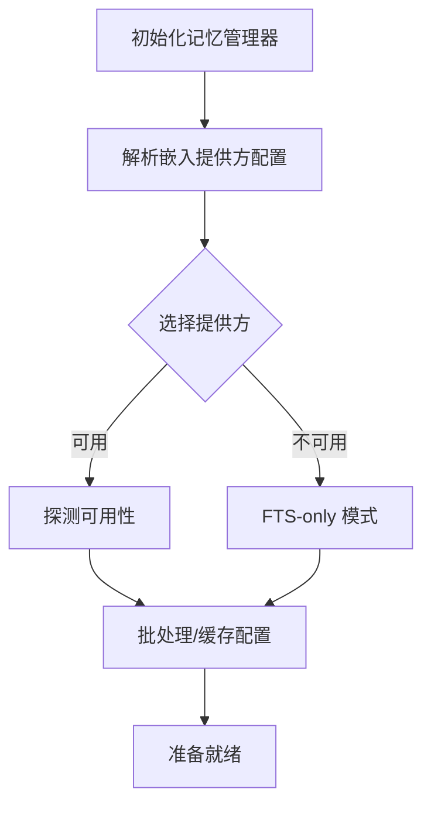
```mermaid
flowchart TD
Init["初始化记忆管理器"] --> ResolveCfg["解析嵌入提供方配置"]
ResolveCfg --> Choose{"选择提供方"}
Choose --> |可用| Probe["探测可用性"]
Choose --> |不可用| FTSOnly["FTS-only 模式"]
Probe --> Batch["批处理/缓存配置"]
FTSOnly --> Batch
Batch --> Ready["准备就绪"]
```

**图示来源**
- [src/memory/manager.ts](file://src/memory/manager.ts)
- [src/memory/types.ts](file://src/memory/types.ts)

**章节来源**
- [src/memory/manager.ts](file://src/memory/manager.ts)
- [src/memory/types.ts](file://src/memory/types.ts)

### 组件七：记忆存储机制
- **检索策略**
  - 支持向量检索、关键词检索与混合检索（BM25、MMR、时间衰减），并根据最小分数与最大结果数过滤。
- **同步与热身**
  - 搜索前可触发同步；支持按会话启动时热身，减少首次检索延迟。
- **数据库与只读恢复**
  - SQLite 数据库，具备只读错误自动重连与模式重建能力；支持额外路径白名单与工作区内外文件读取。

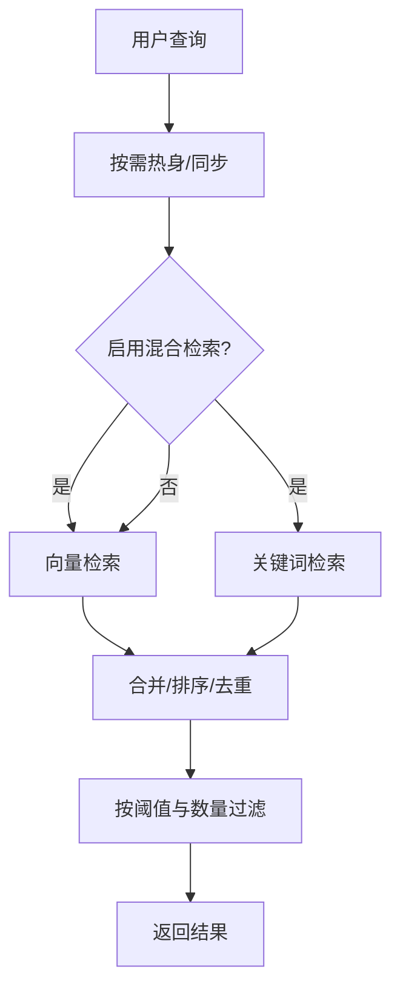
```mermaid
flowchart TD
Q["用户查询"] --> Warm["按需热身/同步"]
Warm --> Hybrid{"启用混合检索?"}
Hybrid --> |是| Vec["向量检索"]
Hybrid --> |是| KW["关键词检索"]
Hybrid --> |否| Vec
Vec --> Merge["合并/排序/去重"]
KW --> Merge
Merge --> Filter["按阈值与数量过滤"]
Filter --> Return["返回结果"]
```

**图示来源**
- [src/memory/manager.ts](file://src/memory/manager.ts)
- [src/memory/types.ts](file://src/memory/types.ts)

**章节来源**
- [src/memory/manager.ts](file://src/memory/manager.ts)
- [src/memory/types.ts](file://src/memory/types.ts)

## 依赖分析
- **组件耦合**
  - 网关客户端依赖协议层进行帧校验与方法定义；TUI 客户端与 ACP 翻译器均通过客户端发起 RPC。
  - **代理管理系统**通过命令行接口与网关协议层交互，提供代理的创建、更新、删除和文件管理功能。
  - **通道管理系统**独立于协议层，但通过网关客户端进行通道状态监控和登录管理。
  - 记忆系统独立于协议层，但被会话与代理流程调用；其内部依赖嵌入提供方与 SQLite 存储。
- **外部集成点**
  - 设备身份与签名、TLS 指纹校验、心跳与断线重连策略，确保控制面安全与稳健。
  - **代理和通道管理功能**通过统一的协议层进行外部集成，支持多种平台和工具。
- **循环依赖**
  - 当前结构未见直接循环依赖；协议层仅作为校验与 Schema 定义存在，不反向依赖客户端。

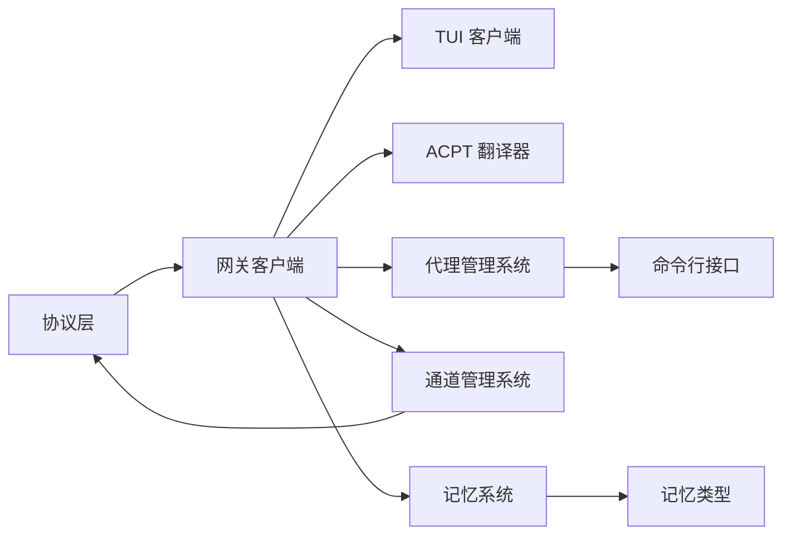
```mermaid
graph LR
Proto["协议层"] --> Client["网关客户端"]
Client --> TUI["TUI 客户端"]
Client --> ACP["ACPT 翻译器"]
Client --> Agents["代理管理系统"]
Client --> Channels["通道管理系统"]
Client --> Mem["记忆系统"]
Agents --> Commands["命令行接口"]
Channels --> Proto
Mem --> Types["记忆类型"]
```

**图示来源**
- [src/gateway/protocol/index.ts](file://src/gateway/protocol/index.ts)
- [src/gateway/client.ts](file://src/gateway/client.ts)
- [src/tui/gateway-chat.ts](file://src/tui/gateway-chat.ts)
- [src/acp/translator.ts](file://src/acp/translator.ts)
- [src/commands/agents.ts](file://src/commands/agents.ts)
- [src/gateway/protocol/schema/channels.ts](file://src/gateway/protocol/schema/channels.ts)
- [src/memory/index.ts](file://src/memory/index.ts)
- [src/memory/types.ts](file://src/memory/types.ts)

**章节来源**
- [src/gateway/protocol/index.ts](file://src/gateway/protocol/index.ts)
- [src/gateway/client.ts](file://src/gateway/client.ts)
- [src/tui/gateway-chat.ts](file://src/tui/gateway-chat.ts)
- [src/acp/translator.ts](file://src/acp/translator.ts)
- [src/commands/agents.ts](file://src/commands/agents.ts)
- [src/gateway/protocol/schema/channels.ts](file://src/gateway/protocol/schema/channels.ts)
- [src/memory/index.ts](file://src/memory/index.ts)
- [src/memory/types.ts](file://src/memory/types.ts)

## 性能考量
- **连接与心跳**
  - 客户端内置心跳监控与断线退避，避免空闲连接占用资源；TLS 指纹校验仅在 wss 场景启用，兼顾安全与性能。
- **代理管理性能**
  - **代理创建和更新操作**支持异步处理，避免阻塞主控制平面。
  - **代理文件管理**采用增量同步策略，减少不必要的网络传输。
  - **代理绑定管理**通过批量操作和冲突检测优化性能。
- **通道管理性能**
  - **通道状态监控**采用轮询和事件驱动相结合的方式，平衡实时性和资源消耗。
  - **Web登录流程**支持超时控制和重试机制，提升用户体验。
  - **通道账户管理**通过快照和缓存机制提高状态查询效率。
- **检索与批处理**
  - 记忆系统支持批处理与并发控制，结合嵌入缓存与只读恢复，降低高负载下的延迟与失败率。
- **搜索优化**
  - 混合检索通过权重与 MMR、时间衰减等策略提升相关性；候选集放大系数与最小分数阈值可调，平衡召回与质量。

## 故障排查指南
- **连接与认证**
  - 若出现"缺少挑战 nonce""连接超时""设备令牌不匹配"等错误，检查网关 URL 是否为 wss、是否设置 TLS 指纹、设备令牌是否过期。
- **断线与重连**
  - 观察心跳超时与错误详情码，确认是否触发暂停重连策略（如令牌缺失/配对要求）。
- **代理管理问题**
  - **代理创建失败**：检查代理配置参数、权限设置和资源限制。
  - **代理文件访问异常**：验证文件路径、权限和存储空间。
  - **代理身份信息同步失败**：确认身份提供方的可用性和认证状态。
  - **代理绑定冲突**：检查绑定规范格式和账户ID解析结果。
- **通道管理问题**
  - **通道状态异常**：检查网络连接、认证凭据和平台API状态。
  - **Web登录超时**：验证登录URL、超时设置和浏览器兼容性。
  - **通道登出失败**：确认平台支持的登出操作和清理流程。
  - **通道账户解析失败**：检查插件配置和默认账户ID设置。
- **记忆系统**
  - 若只读数据库错误频繁，系统会自动重连并重建模式；关注批处理失败次数与最后错误来源，必要时调整并发与轮询间隔。

**章节来源**
- [src/gateway/client.ts](file://src/gateway/client.ts)
- [src/commands/agents.ts](file://src/commands/agents.ts)
- [src/commands/agents.bindings.ts](file://src/commands/agents.bindings.ts)
- [src/gateway/protocol/schema/channels.ts](file://src/gateway/protocol/schema/channels.ts)

## 结论
OpenClaw 的核心以"网关协议+控制平面"为骨架，配合"会话管理+记忆检索+模型策略+**代理管理+通道管理**"，形成可扩展、可观测且健壮的 AI 代理运行时。通过 WebSocket 控制平面实现请求-响应与事件驱动，借助记忆系统提供上下文增强与检索加速，**新增的代理管理系统**提供灵活的代理创建、配置和管理能力，**通道管理系统**实现多平台通信通道的统一监控和管理，使代理在多通道、多模型场景下保持一致体验与可控成本。

## 附录：术语表与概念图

- **术语表**
  - 网关客户端：负责与网关建立与维护 WebSocket 连接、发送请求、接收事件与响应的客户端组件。
  - 协议帧：请求帧、响应帧、事件帧的统称，承载方法名、参数与负载。
  - 会话：一次或多轮对话的上下文容器，包含模型、令牌用量、思考/推理级别等状态。
  - 记忆系统：提供向量/关键词混合检索、增量同步、批处理与缓存的索引与存储子系统。
  - 设备令牌：基于设备身份签发的长期凭据，用于无共享令牌场景的自动重试与持久化。
  - FTS-only：在无嵌入提供方可用时的关键词检索模式。
  - **代理管理**：**新增** 代理的创建、配置、身份管理和文件管理功能集合。
  - **通道管理**：**新增** 跨平台通信通道的状态监控、登录登出和Web登录流程管理。
  - **代理文件**：**新增** 代理相关的配置文件、脚本文件和数据文件的统称。
  - **代理绑定**：**新增** 将代理与特定通道账户关联的路由规则。
  - **通道账户快照**：**新增** 通道账户的实时运行时状态信息。

- **概念图（控制平面与消息路由）**
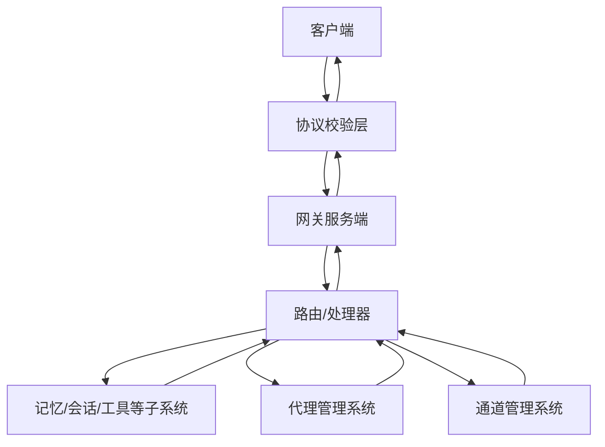
```mermaid
graph TB
C["客户端"] --> P["协议校验层"]
P --> S["网关服务端"]
S --> R["路由/处理器"]
R --> M["记忆/会话/工具等子系统"]
R --> AG["代理管理系统"]
R --> CH["通道管理系统"]
AG --> R
CH --> R
M --> R
R --> S
S --> P
P --> C
```

- **概念图（代理管理流程）**
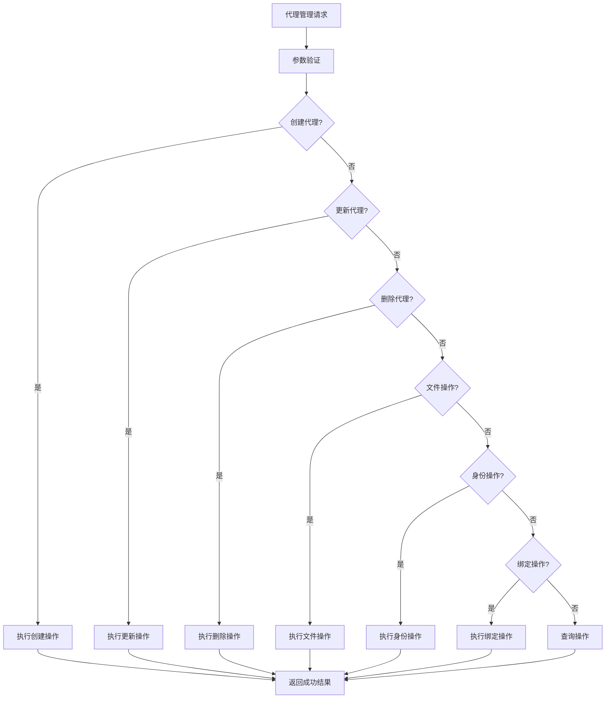
```mermaid
flowchart TD
Start["代理管理请求"] --> Validate["参数验证"]
Validate --> Create{"创建代理?"}
Create --> |是| CreateOp["执行创建操作"]
Create --> |否| Update{"更新代理?"}
Update --> |是| UpdateOp["执行更新操作"]
Update --> |否| Delete{"删除代理?"}
Delete --> |是| DeleteOp["执行删除操作"]
Delete --> |否| Files{"文件操作?"}
Files --> |是| FilesOp["执行文件操作"]
Files --> |否| Identity{"身份操作?"}
Identity --> |是| IdentityOp["执行身份操作"]
Identity --> |否| Bindings{"绑定操作?"}
Bindings --> |是| BindOp["执行绑定操作"]
Bindings --> |否| List["查询操作"]
List --> Success["返回成功结果"]
CreateOp --> Success
UpdateOp --> Success
DeleteOp --> Success
FilesOp --> Success
IdentityOp --> Success
BindOp --> Success
```

- **概念图（通道管理流程）**
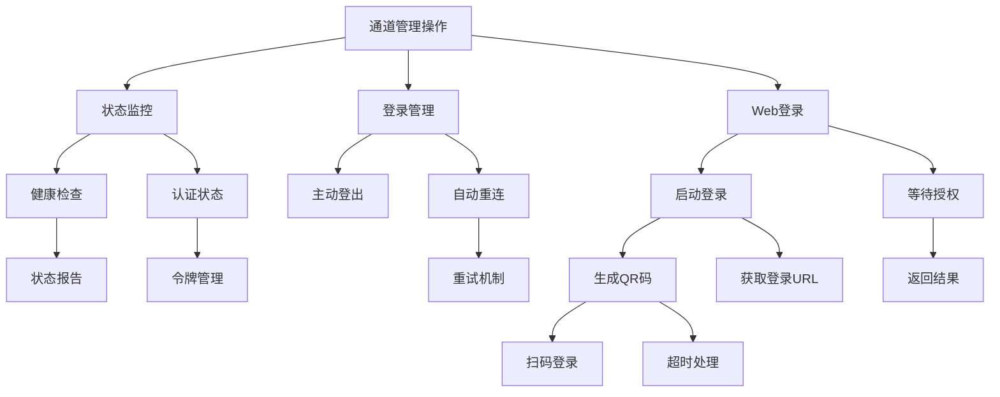
```mermaid
flowchart TD
ChannelOps["通道管理操作"] --> Status["状态监控"]
ChannelOps --> Login["登录管理"]
ChannelOps --> WebLogin["Web登录"]
Status --> Health["健康检查"]
Status --> Auth["认证状态"]
Login --> Logout["主动登出"]
Login --> Reconnect["自动重连"]
WebLogin --> Start["启动登录"]
WebLogin --> Wait["等待授权"]
Start --> QR["生成QR码"]
Start --> URL["获取登录URL"]
Wait --> Result["返回结果"]
QR --> Scan["扫码登录"]
QR --> Timeout["超时处理"]
Health --> Report["状态报告"]
Auth --> Tokens["令牌管理"]
Reconnect --> Retry["重试机制"]
```

- **概念图（代理绑定管理流程）**
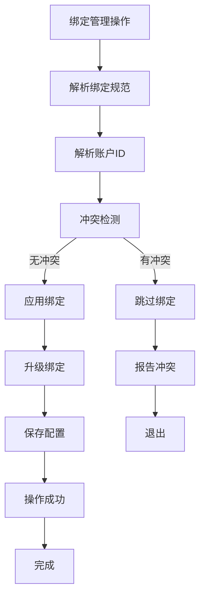
```mermaid
flowchart TD
BindOps["绑定管理操作"] --> Parse["解析绑定规范"]
Parse --> Resolve["解析账户ID"]
Resolve --> Check["冲突检测"]
Check --> |无冲突| Apply["应用绑定"]
Check --> |有冲突| Skip["跳过绑定"]
Apply --> Upgrade["升级绑定"]
Upgrade --> Save["保存配置"]
Skip --> Report["报告冲突"]
Report --> Exit["退出"]
Save --> Success["操作成功"]
Success --> Done["完成"]
```