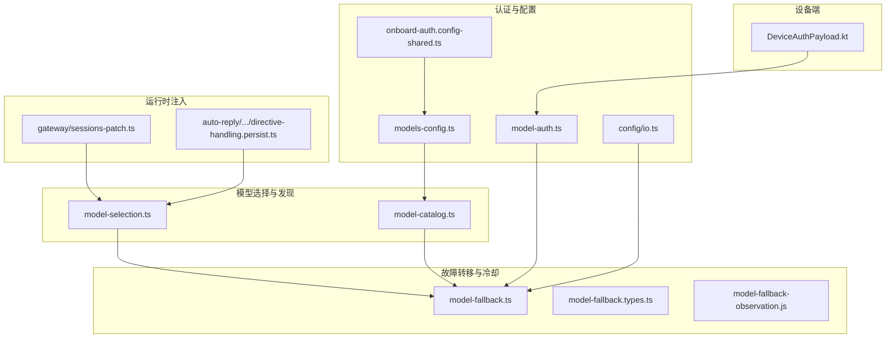
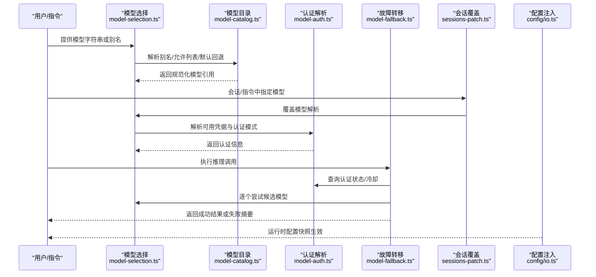
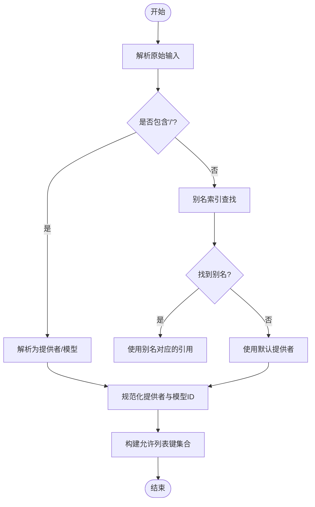
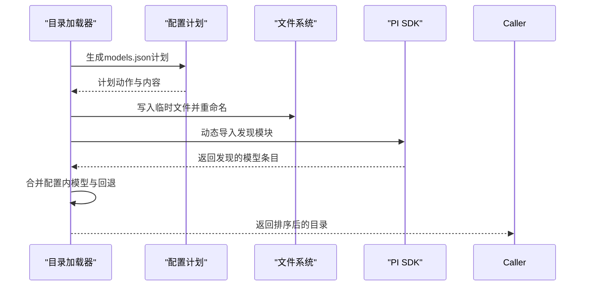
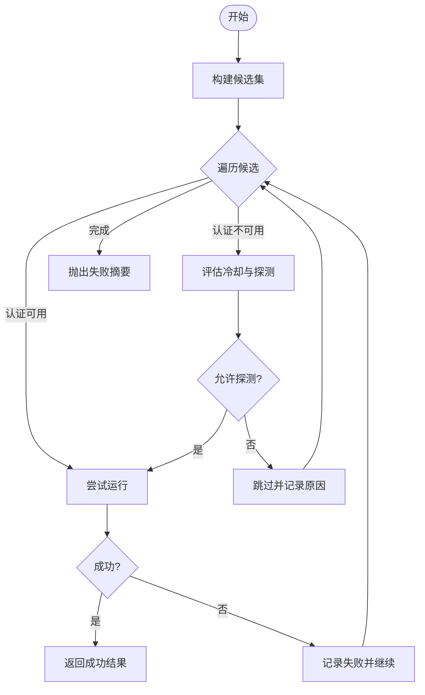
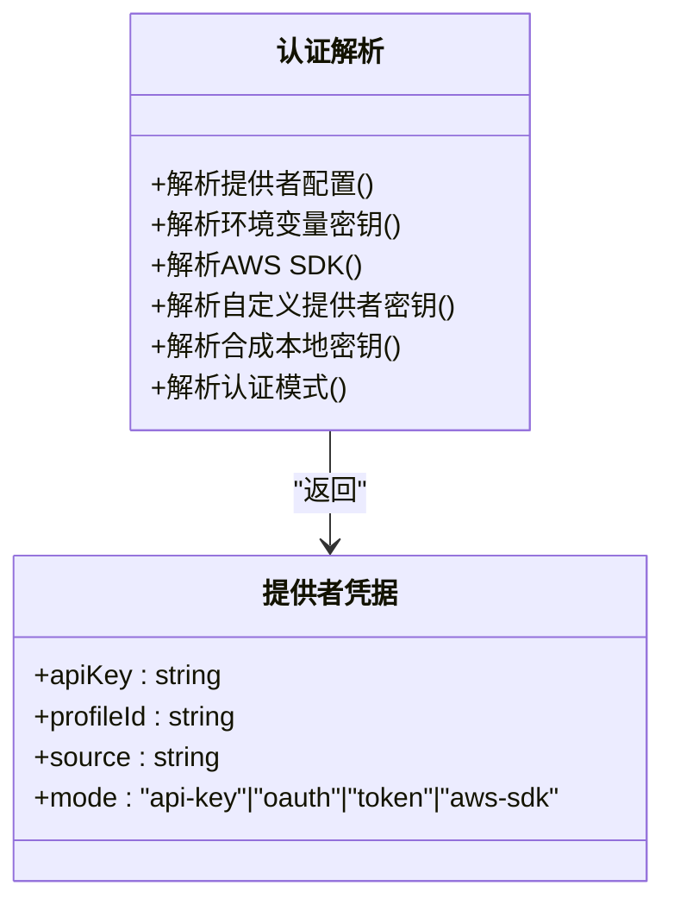
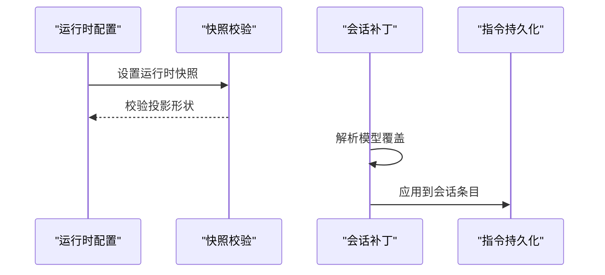
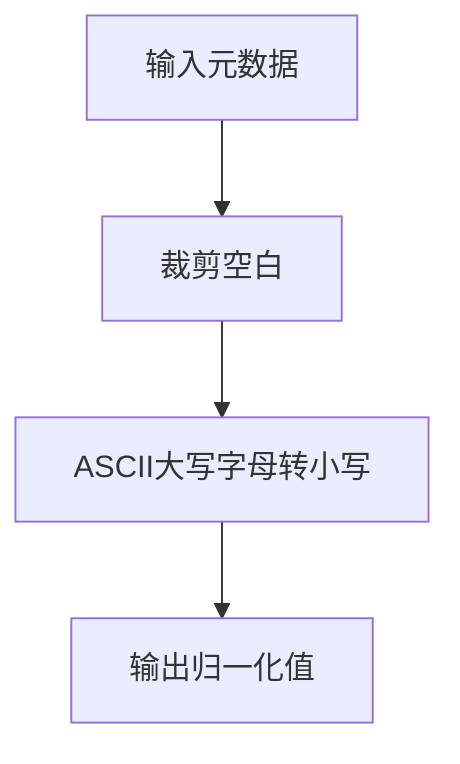
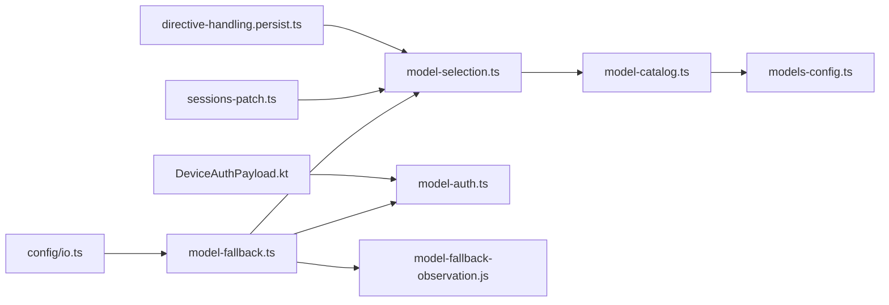

# 模型管理

<cite>
**本文引用的文件**
- [src/agents/model-fallback.ts](file://src/agents/model-fallback.ts)
- [src/agents/model-selection.ts](file://src/agents/model-selection.ts)
- [src/agents/model-auth.ts](file://src/agents/model-auth.ts)
- [src/agents/models-config.ts](file://src/agents/models-config.ts)
- [src/agents/model-catalog.ts](file://src/agents/model-catalog.ts)
- [src/agents/model-fallback.types.ts](file://src/agents/model-fallback.types.ts)
- [src/gateway/sessions-patch.ts](file://src/gateway/sessions-patch.ts)
- [src/auto-reply/reply/directive-handling.persist.ts](file://src/auto-reply/reply/directive-handling.persist.ts)
- [apps/android/app/src/main/java/ai/openclaw/app/gateway/DeviceAuthPayload.kt](file://apps/android/app/src/main/java/ai/openclaw/app/gateway/DeviceAuthPayload.kt)
- [src/config/io.ts](file://src/config/io.ts)
- [src/commands/onboard-auth.config-shared.ts](file://src/commands/onboard-auth.config-shared.ts)
- [src/agents/model-fallback-observation.js](file://src/agents/model-fallback-observation.js)
</cite>

## 目录

1. [简介](#简介)
2. [项目结构](#项目结构)
3. [核心组件](#核心组件)
4. [架构总览](#架构总览)
5. [详细组件分析](#详细组件分析)
6. [依赖关系分析](#依赖关系分析)
7. [性能考量](#性能考量)
8. [故障排查指南](#故障排查指南)
9. [结论](#结论)
10. [附录](#附录)

## 简介

本文件面向OpenClaw模型管理系统，系统化阐述以下主题：

- 模型提供商的选择策略与认证路径
- 模型发现与目录构建机制
- 故障转移算法与冷却探测策略
- 模型配置的合并、验证与运行时注入
- 模型别名、认证标记与兼容性检查
- 模型选择优先级、负载均衡与性能监控
- 配置示例、故障排查方法与最佳实践
- 完整的模型注册、选择与使用流程（以代码片段路径形式呈现）

## 项目结构

围绕“模型管理”的关键模块分布如下：

- 模型选择与别名解析：src/agents/model-selection.ts
- 故障转移与冷却探测：src/agents/model-fallback.ts
- 认证与密钥解析：src/agents/model-auth.ts
- 模型目录与发现：src/agents/model-catalog.ts
- 运行时配置快照与注入：src/config/io.ts
- 模型配置生成与写入：src/agents/models-config.ts
- 会话与指令中的模型覆盖：src/gateway/sessions-patch.ts、src/auto-reply/reply/directive-handling.persist.ts
- 设备端认证载荷标准化：apps/android/app/src/main/java/.../DeviceAuthPayload.kt
- 引导阶段的提供商配置合并：src/commands/onboard-auth.config-shared.ts

**图表来源**

- [src/agents/model-selection.ts:1-671](file://src/agents/model-selection.ts#L1-L671)
- [src/agents/model-catalog.ts:1-310](file://src/agents/model-catalog.ts#L1-L310)
- [src/agents/model-fallback.ts:1-817](file://src/agents/model-fallback.ts#L1-L817)
- [src/agents/model-fallback.types.ts:1-16](file://src/agents/model-fallback.types.ts#L1-L16)
- [src/agents/model-auth.ts:1-442](file://src/agents/model-auth.ts#L1-L442)
- [src/agents/models-config.ts:1-111](file://src/agents/models-config.ts#L1-L111)
- [src/config/io.ts:1350-1404](file://src/config/io.ts#L1350-L1404)
- [src/commands/onboard-auth.config-shared.ts:119-155](file://src/commands/onboard-auth.config-shared.ts#L119-L155)
- [src/gateway/sessions-patch.ts:341-386](file://src/gateway/sessions-patch.ts#L341-L386)
- [src/auto-reply/reply/directive-handling.persist.ts:137-173](file://src/auto-reply/reply/directive-handling.persist.ts#L137-L173)
- [apps/android/app/src/main/java/ai/openclaw/app/gateway/DeviceAuthPayload.kt:1-52](file://apps/android/app/src/main/java/ai/openclaw/app/gateway/DeviceAuthPayload.kt#L1-L52)

**章节来源**

- [src/agents/model-selection.ts:1-671](file://src/agents/model-selection.ts#L1-L671)
- [src/agents/model-catalog.ts:1-310](file://src/agents/model-catalog.ts#L1-L310)
- [src/agents/model-fallback.ts:1-817](file://src/agents/model-fallback.ts#L1-L817)
- [src/agents/model-auth.ts:1-442](file://src/agents/model-auth.ts#L1-L442)
- [src/agents/models-config.ts:1-111](file://src/agents/models-config.ts#L1-L111)
- [src/config/io.ts:1350-1404](file://src/config/io.ts#L1350-L1404)
- [src/commands/onboard-auth.config-shared.ts:119-155](file://src/commands/onboard-auth.config-shared.ts#L119-L155)
- [src/gateway/sessions-patch.ts:341-386](file://src/gateway/sessions-patch.ts#L341-L386)
- [src/auto-reply/reply/directive-handling.persist.ts:137-173](file://src/auto-reply/reply/directive-handling.persist.ts#L137-L173)
- [apps/android/app/src/main/java/ai/openclaw/app/gateway/DeviceAuthPayload.kt:1-52](file://apps/android/app/src/main/java/ai/openclaw/app/gateway/DeviceAuthPayload.kt#L1-L52)

## 核心组件

- 模型选择与别名解析：负责将用户输入解析为规范化模型引用，支持别名索引、允许列表与默认回退策略。
- 模型目录与发现：从本地models.json与SDK发现能力构建模型目录，并提供合成回退与输入类型标注。
- 故障转移与冷却探测：按优先级遍历候选模型，结合认证状态与冷却时间进行探测决策，记录失败原因并支持重试。
- 认证与密钥解析：统一解析环境变量、配置文件、OAuth令牌与AWS SDK链路，支持多配置文件与代理模式。
- 运行时配置注入：通过运行时快照与投影，确保配置变更在不重启情况下生效；同时支持会话与指令级别的覆盖。

**章节来源**

- [src/agents/model-selection.ts:238-353](file://src/agents/model-selection.ts#L238-L353)
- [src/agents/model-catalog.ts:193-278](file://src/agents/model-catalog.ts#L193-L278)
- [src/agents/model-fallback.ts:502-763](file://src/agents/model-fallback.ts#L502-L763)
- [src/agents/model-auth.ts:216-321](file://src/agents/model-auth.ts#L216-L321)
- [src/config/io.ts:1350-1404](file://src/config/io.ts#L1350-L1404)

## 架构总览

OpenClaw的模型管理由“发现—选择—认证—执行—回退”闭环构成。下图展示了关键交互：

**图表来源**

- [src/agents/model-selection.ts:266-353](file://src/agents/model-selection.ts#L266-L353)
- [src/agents/model-catalog.ts:214-278](file://src/agents/model-catalog.ts#L214-L278)
- [src/agents/model-auth.ts:216-321](file://src/agents/model-auth.ts#L216-L321)
- [src/agents/model-fallback.ts:502-763](file://src/agents/model-fallback.ts#L502-L763)
- [src/gateway/sessions-patch.ts:341-386](file://src/gateway/sessions-patch.ts#L341-L386)
- [src/config/io.ts:1350-1404](file://src/config/io.ts#L1350-L1404)

## 详细组件分析

### 组件A：模型选择与别名解析

- 别名索引与键映射：通过别名到引用的映射表，支持以简短别名快速定位模型。
- 允许列表与键集合：基于配置的允许列表构建键集合，用于过滤候选集。
- 规范化与默认回退：对提供者ID与模型ID进行规范化处理；当未显式提供者时，采用默认提供者并发出兼容性警告。
- 允许模型集构建：允许任意模型或仅允许配置列表内的模型，并可将默认模型加入允许集。
- 模型引用解析：支持“提供者/模型”格式与纯模型别名两种输入方式。

**图表来源**

- [src/agents/model-selection.ts:266-353](file://src/agents/model-selection.ts#L266-L353)
- [src/agents/model-selection.ts:419-493](file://src/agents/model-selection.ts#L419-L493)

**章节来源**

- [src/agents/model-selection.ts:238-353](file://src/agents/model-selection.ts#L238-L353)
- [src/agents/model-selection.ts:419-493](file://src/agents/model-selection.ts#L419-L493)

### 组件B：模型目录与发现

- 动态导入SDK：延迟加载模型发现模块，避免一次性依赖导致的缓存污染。
- 本地models.json生成：根据配置计划生成并原子写入，确保权限安全与并发一致性。
- 合成回退：当目录缺失特定模型时，基于模板ID进行回退填充，提升可用性。
- 输入类型标注：为模型标注文本/图像/文档等输入类型，辅助路由与能力匹配。

**图表来源**

- [src/agents/models-config.ts:75-111](file://src/agents/models-config.ts#L75-L111)
- [src/agents/model-catalog.ts:193-278](file://src/agents/model-catalog.ts#L193-L278)

**章节来源**

- [src/agents/models-config.ts:75-111](file://src/agents/models-config.ts#L75-L111)
- [src/agents/model-catalog.ts:193-278](file://src/agents/model-catalog.ts#L193-L278)

### 组件C：故障转移与冷却探测

- 候选集构建：优先主模型，再追加配置的回退链；当请求提供者不同于配置主提供者时，仅保留已在链中的回退项。
- 冷却探测：当所有认证配置均处于冷却时，依据错误类型与冷却边界决定是否探测；对瞬时限流/过载场景允许单次探测。
- 失败记录与摘要：记录每次尝试的原因、状态码与错误消息，最终汇总失败摘要。
- 上下文溢出保护：对可能的上下文溢出错误直接抛出，避免错误转移导致更差结果。

**图表来源**

- [src/agents/model-fallback.ts:502-763](file://src/agents/model-fallback.ts#L502-L763)
- [src/agents/model-fallback.types.ts:3-16](file://src/agents/model-fallback.types.ts#L3-L16)

**章节来源**

- [src/agents/model-fallback.ts:502-763](file://src/agents/model-fallback.ts#L502-L763)
- [src/agents/model-fallback.types.ts:1-16](file://src/agents/model-fallback.types.ts#L1-L16)

### 组件D：认证与密钥解析

- 多源解析：优先使用认证配置文件中的配置，其次尝试环境变量标记、AWS SDK链路、自定义提供者密钥与合成本地密钥。
- 模式识别：自动识别OAuth、Token、API Key或AWS SDK模式，并给出来源标签。
- 错误提示：当无法解析到可用密钥时，提供明确的错误信息与修复建议。

**图表来源**

- [src/agents/model-auth.ts:216-321](file://src/agents/model-auth.ts#L216-L321)
- [src/agents/model-auth.ts:361-415](file://src/agents/model-auth.ts#L361-L415)

**章节来源**

- [src/agents/model-auth.ts:216-321](file://src/agents/model-auth.ts#L216-L321)
- [src/agents/model-auth.ts:361-415](file://src/agents/model-auth.ts#L361-L415)

### 组件E：运行时配置注入与覆盖

- 运行时快照：保存运行时配置与来源快照，校验顶层投影形状，确保兼容性。
- 会话覆盖：在会话补丁中支持对模型字段的覆盖，解析允许的模型引用并应用到会话条目。
- 指令覆盖：在自动回复指令中支持模型指令与配置覆盖，解析别名与配置并应用到会话。

**图表来源**

- [src/config/io.ts:1350-1404](file://src/config/io.ts#L1350-L1404)
- [src/gateway/sessions-patch.ts:341-386](file://src/gateway/sessions-patch.ts#L341-L386)
- [src/auto-reply/reply/directive-handling.persist.ts:137-173](file://src/auto-reply/reply/directive-handling.persist.ts#L137-L173)

**章节来源**

- [src/config/io.ts:1350-1404](file://src/config/io.ts#L1350-L1404)
- [src/gateway/sessions-patch.ts:341-386](file://src/gateway/sessions-patch.ts#L341-L386)
- [src/auto-reply/reply/directive-handling.persist.ts:137-173](file://src/auto-reply/reply/directive-handling.persist.ts#L137-L173)

### 组件F：设备端认证载荷标准化

- 字段归一化：对平台与设备家族元数据进行ASCII小写化与空白裁剪，保证跨运行时一致性。
- 载荷拼接：将版本号、设备ID、客户端ID、角色、作用域、签名时间、令牌、随机数与归一化元数据拼接为固定格式字符串。

**图表来源**

- [apps/android/app/src/main/java/ai/openclaw/app/gateway/DeviceAuthPayload.kt:35-51](file://apps/android/app/src/main/java/ai/openclaw/app/gateway/DeviceAuthPayload.kt#L35-L51)

**章节来源**

- [apps/android/app/src/main/java/ai/openclaw/app/gateway/DeviceAuthPayload.kt:1-52](file://apps/android/app/src/main/java/ai/openclaw/app/gateway/DeviceAuthPayload.kt#L1-L52)

## 依赖关系分析

- 模型选择依赖模型目录与别名索引；目录依赖SDK发现与本地models.json。
- 故障转移依赖认证状态、冷却探测与失败观察记录。
- 运行时注入依赖配置快照与投影；会话与指令覆盖依赖模型选择与目录。
- 设备端认证载荷标准化独立于后端逻辑，但需与后端认证解析保持字段语义一致。

**图表来源**

- [src/agents/model-selection.ts:1-671](file://src/agents/model-selection.ts#L1-L671)
- [src/agents/model-catalog.ts:1-310](file://src/agents/model-catalog.ts#L1-L310)
- [src/agents/models-config.ts:1-111](file://src/agents/models-config.ts#L1-L111)
- [src/agents/model-fallback.ts:1-817](file://src/agents/model-fallback.ts#L1-L817)
- [src/agents/model-auth.ts:1-442](file://src/agents/model-auth.ts#L1-L442)
- [src/agents/model-fallback-observation.js](file://src/agents/model-fallback-observation.js)
- [src/gateway/sessions-patch.ts:341-386](file://src/gateway/sessions-patch.ts#L341-L386)
- [src/auto-reply/reply/directive-handling.persist.ts:137-173](file://src/auto-reply/reply/directive-handling.persist.ts#L137-L173)
- [src/config/io.ts:1350-1404](file://src/config/io.ts#L1350-L1404)
- [apps/android/app/src/main/java/ai/openclaw/app/gateway/DeviceAuthPayload.kt:1-52](file://apps/android/app/src/main/java/ai/openclaw/app/gateway/DeviceAuthPayload.kt#L1-L52)

**章节来源**

- [src/agents/model-selection.ts:1-671](file://src/agents/model-selection.ts#L1-L671)
- [src/agents/model-catalog.ts:1-310](file://src/agents/model-catalog.ts#L1-L310)
- [src/agents/model-fallback.ts:1-817](file://src/agents/model-fallback.ts#L1-L817)
- [src/agents/model-auth.ts:1-442](file://src/agents/model-auth.ts#L1-L442)
- [src/agents/models-config.ts:1-111](file://src/agents/models-config.ts#L1-L111)
- [src/gateway/sessions-patch.ts:341-386](file://src/gateway/sessions-patch.ts#L341-L386)
- [src/auto-reply/reply/directive-handling.persist.ts:137-173](file://src/auto-reply/reply/directive-handling.persist.ts#L137-L173)
- [src/config/io.ts:1350-1404](file://src/config/io.ts#L1350-L1404)
- [apps/android/app/src/main/java/ai/openclaw/app/gateway/DeviceAuthPayload.kt:1-52](file://apps/android/app/src/main/java/ai/openclaw/app/gateway/DeviceAuthPayload.kt#L1-L52)

## 性能考量

- 目录加载与动态导入：采用延迟导入与缓存策略，避免一次性依赖导致的阻塞与缓存污染。
- 并发写入与原子更新：models.json写入采用临时文件+原子重命名，配合写锁避免竞态。
- 冷却探测节流：限制探测频率与最大探测键数量，降低对上游的无效压力。
- 允许列表与别名索引：通过键集合与映射表减少重复解析成本。
- 运行时快照校验：仅在必要时重建快照，避免频繁深拷贝与序列化。

[本节为通用指导，无需具体文件分析]

## 故障排查指南

- 认证问题
  - 现象：无法解析提供者的API Key或认证模式异常。
  - 排查：确认认证配置文件、环境变量标记、AWS SDK链路与自定义提供者密钥；查看认证模式识别结果与来源标签。
  - 参考路径
    - [src/agents/model-auth.ts:216-321](file://src/agents/model-auth.ts#L216-L321)
    - [src/agents/model-auth.ts:361-415](file://src/agents/model-auth.ts#L361-L415)
- 模型不可用或不在允许列表
  - 现象：模型引用被拒绝或目录为空。
  - 排查：检查允许列表、别名索引与默认回退；确认models.json已生成且权限正确。
  - 参考路径
    - [src/agents/model-selection.ts:419-493](file://src/agents/model-selection.ts#L419-L493)
    - [src/agents/models-config.ts:75-111](file://src/agents/models-config.ts#L75-L111)
- 故障转移失败
  - 现象：所有候选模型均失败，抛出失败摘要。
  - 排查：查看失败原因、状态码与错误消息；确认冷却状态与探测节流；检查上下文溢出保护逻辑。
  - 参考路径
    - [src/agents/model-fallback.ts:753-763](file://src/agents/model-fallback.ts#L753-L763)
    - [src/agents/model-fallback-observation.js](file://src/agents/model-fallback-observation.js)
- 会话/指令覆盖无效
  - 现象：模型覆盖未生效。
  - 排查：确认覆盖解析逻辑、允许列表与默认模型；检查运行时快照是否正确投影。
  - 参考路径
    - [src/gateway/sessions-patch.ts:341-386](file://src/gateway/sessions-patch.ts#L341-L386)
    - [src/auto-reply/reply/directive-handling.persist.ts:137-173](file://src/auto-reply/reply/directive-handling.persist.ts#L137-L173)
    - [src/config/io.ts:1350-1404](file://src/config/io.ts#L1350-L1404)

**章节来源**

- [src/agents/model-auth.ts:216-321](file://src/agents/model-auth.ts#L216-L321)
- [src/agents/model-auth.ts:361-415](file://src/agents/model-auth.ts#L361-L415)
- [src/agents/model-selection.ts:419-493](file://src/agents/model-selection.ts#L419-L493)
- [src/agents/models-config.ts:75-111](file://src/agents/models-config.ts#L75-L111)
- [src/agents/model-fallback.ts:753-763](file://src/agents/model-fallback.ts#L753-L763)
- [src/gateway/sessions-patch.ts:341-386](file://src/gateway/sessions-patch.ts#L341-L386)
- [src/auto-reply/reply/directive-handling.persist.ts:137-173](file://src/auto-reply/reply/directive-handling.persist.ts#L137-L173)
- [src/config/io.ts:1350-1404](file://src/config/io.ts#L1350-L1404)

## 结论

OpenClaw的模型管理系统通过“发现—选择—认证—执行—回退”的闭环设计，实现了高可用、可扩展与可观测的模型运行体系。其关键特性包括：

- 基于别名与允许列表的灵活选择策略
- 以SDK与本地文件协同的模型目录发现
- 面向认证状态与冷却时间的智能探测与回退
- 运行时快照与覆盖注入保障配置的即时生效
- 跨平台与跨运行时的一致性与安全性

[本节为总结性内容，无需具体文件分析]

## 附录

### 模型配置示例（路径指引）

- 模型别名与允许列表
  - [src/agents/model-selection.ts:238-264](file://src/agents/model-selection.ts#L238-L264)
  - [src/agents/model-selection.ts:419-493](file://src/agents/model-selection.ts#L419-L493)
- 模型目录与合成回退
  - [src/agents/model-catalog.ts:193-278](file://src/agents/model-catalog.ts#L193-L278)
- 认证配置与模式识别
  - [src/agents/model-auth.ts:216-321](file://src/agents/model-auth.ts#L216-L321)
  - [src/agents/model-auth.ts:361-415](file://src/agents/model-auth.ts#L361-L415)
- 运行时配置快照与投影
  - [src/config/io.ts:1350-1404](file://src/config/io.ts#L1350-L1404)
- 会话与指令覆盖
  - [src/gateway/sessions-patch.ts:341-386](file://src/gateway/sessions-patch.ts#L341-L386)
  - [src/auto-reply/reply/directive-handling.persist.ts:137-173](file://src/auto-reply/reply/directive-handling.persist.ts#L137-L173)
- 引导阶段提供商配置合并
  - [src/commands/onboard-auth.config-shared.ts:119-155](file://src/commands/onboard-auth.config-shared.ts#L119-L155)

### 最佳实践

- 使用别名与允许列表统一管理模型引用，避免硬编码提供者ID。
- 在多提供者环境中启用冷却探测与节流，防止对上游造成冲击。
- 将默认模型纳入允许列表，确保回退路径始终可用。
- 使用运行时快照与覆盖机制，实现配置变更的平滑过渡。
- 对认证配置进行最小权限原则管理，优先使用认证文件与环境变量标记。

[本节为通用指导，无需具体文件分析]
