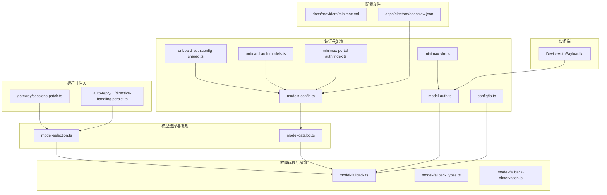
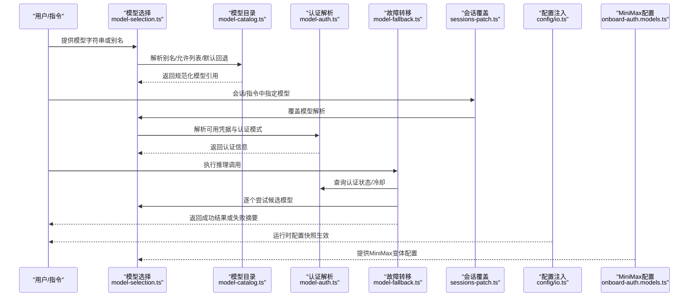
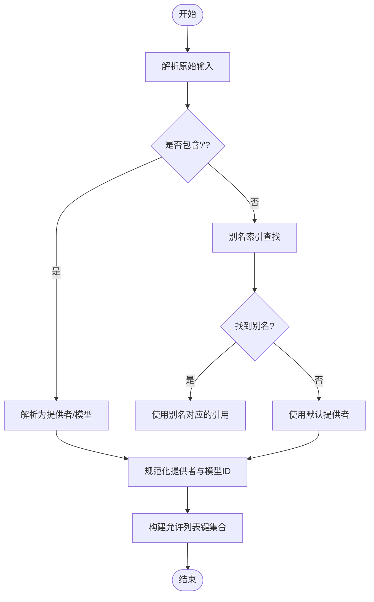
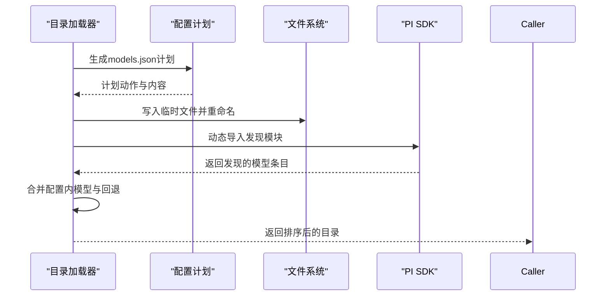
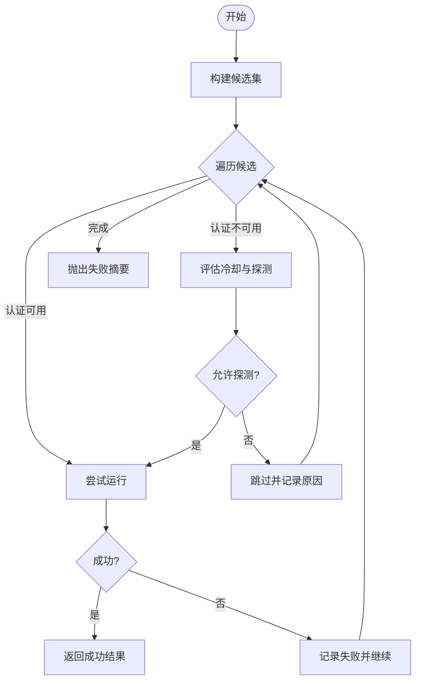
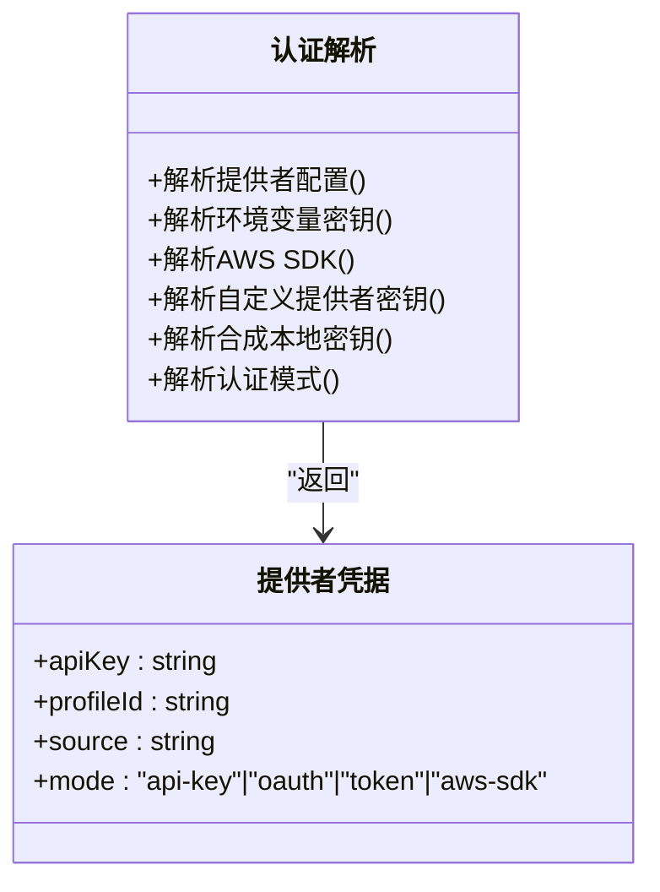
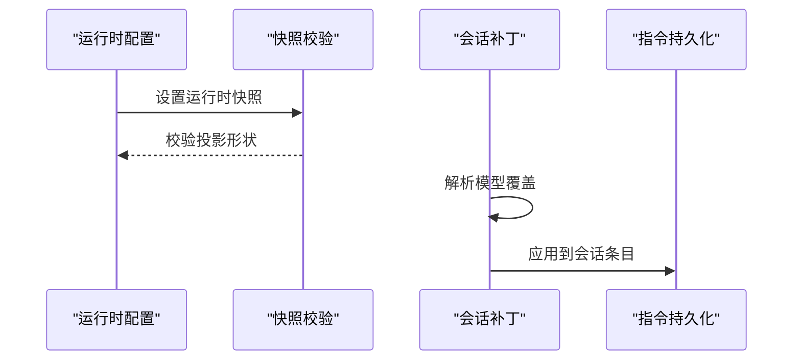
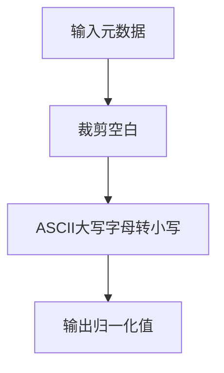
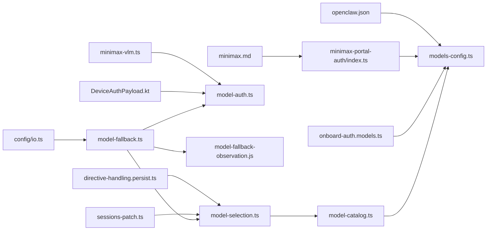

# 模型管理

<cite>
**本文引用的文件**
- [src/agents/model-fallback.ts](file://src/agents/model-fallback.ts)
- [src/agents/model-selection.ts](file://src/agents/model-selection.ts)
- [src/agents/model-auth.ts](file://src/agents/model-auth.ts)
- [src/agents/models-config.ts](file://src/agents/models-config.ts)
- [src/agents/model-catalog.ts](file://src/agents/model-catalog.ts)
- [src/agents/model-fallback.types.ts](file://src/agents/model-fallback.types.ts)
- [src/gateway/sessions-patch.ts](file://src/gateway/sessions-patch.ts)
- [src/auto-reply/reply/directive-handling.persist.ts](file://src/auto-reply/reply/directive-handling.persist.ts)
- [apps/android/app/src/main/java/ai/openclaw/app/gateway/DeviceAuthPayload.kt](file://apps/android/app/src/main/java/ai/openclaw/app/gateway/DeviceAuthPayload.kt)
- [src/config/io.ts](file://src/config/io.ts)
- [src/commands/onboard-auth.config-shared.ts](file://src/commands/onboard-auth.config-shared.ts)
- [src/agents/model-fallback-observation.js](file://src/agents/model-fallback-observation.js)
- [apps/electron/openclaw.json](file://apps/electron/openclaw.json)
- [src/commands/onboard-auth.models.ts](file://src/commands/onboard-auth.models.ts)
- [extensions/minimax-portal-auth/index.ts](file://extensions/minimax-portal-auth/index.ts)
- [src/agents/minimax-vlm.ts](file://src/agents/minimax-vlm.ts)
- [docs/providers/minimax.md](file://docs/providers/minimax.md)
</cite>

## 更新摘要
**所做更改**
- 新增MiniMax M2.7变体模型支持章节，包括三个变体：标准版、高速版和Lightning版
- 更新模型配置示例，展示新的MiniMax变体配置
- 增强故障转移与冷却探测章节，包含MiniMax特定的配置
- 更新最佳实践指南，添加MiniMax变体选择建议
- 新增MiniMax变体的成本结构和性能对比

## 目录
1. [简介](#简介)
2. [项目结构](#项目结构)
3. [核心组件](#核心组件)
4. [架构总览](#架构总览)
5. [详细组件分析](#详细组件分析)
6. [MiniMax M2.7变体模型支持](#minimax-m25变体模型支持)
7. [依赖关系分析](#依赖关系分析)
8. [性能考量](#性能考量)
9. [故障排查指南](#故障排查指南)
10. [结论](#结论)
11. [附录](#附录)

## 简介
本文件面向OpenClaw模型管理系统，系统化阐述以下主题：
- 模型提供商的选择策略与认证路径
- 模型发现与目录构建机制
- 故障转移算法与冷却探测策略
- 模型配置的合并、验证与运行时注入
- 模型别名、认证标记与兼容性检查
- 模型选择优先级、负载均衡与性能监控
- **新增：MiniMax M2.7变体模型支持与配置**
- 配置示例、故障排查方法与最佳实践
- 完整的模型注册、选择与使用流程（以代码片段路径形式呈现）

## 项目结构
围绕"模型管理"的关键模块分布如下：
- 模型选择与别名解析：src/agents/model-selection.ts
- 故障转移与冷却探测：src/agents/model-fallback.ts
- 认证与密钥解析：src/agents/model-auth.ts
- 模型目录与发现：src/agents/model-catalog.ts
- 运行时配置快照与注入：src/config/io.ts
- 模型配置生成与写入：src/agents/models-config.ts
- 会话与指令中的模型覆盖：src/gateway/sessions-patch.ts、src/auto-reply/reply/directive-handling.persist.ts
- 设备端认证载荷标准化：apps/android/app/src/main/java/.../DeviceAuthPayload.kt
- 引导阶段的提供商配置合并：src/commands/onboard-auth.config-shared.ts
- **新增：MiniMax变体模型配置：src/commands/onboard-auth.models.ts**
- **新增：MiniMax OAuth插件：extensions/minimax-portal-auth/index.ts**
- **新增：MiniMax VLM图像理解：src/agents/minimax-vlm.ts**


```mermaid
graph TB
subgraph "模型选择与发现"
MSel["model-selection.ts"]
MCat["model-catalog.ts"]
end
subgraph "故障转移与冷却"
MFall["model-fallback.ts"]
MTypes["model-fallback.types.ts"]
MObs["model-fallback-observation.js"]
end
subgraph "认证与配置"
MAuth["model-auth.ts"]
MConf["models-config.ts"]
CfgIO["config/io.ts"]
Onboard["onboard-auth.config-shared.ts"]
MinimaxModels["onboard-auth.models.ts"]
MinimaxPlugin["minimax-portal-auth/index.ts"]
MinimaxVLM["minimax-vlm.ts"]
end
subgraph "运行时注入"
SessPatch["gateway/sessions-patch.ts"]
DirPersist["auto-reply/.../directive-handling.persist.ts"]
end
subgraph "设备端"
DevAuth["DeviceAuthPayload.kt"]
end
subgraph "配置文件"
OpenClawJSON["apps/electron/openclaw.json"]
MinimaxDocs["docs/providers/minimax.md"]
end
MSel --> MFall
MCat --> MFall
MAuth --> MFall
MConf --> MCat
CfgIO --> MFall
Onboard --> MConf
MinimaxModels --> MConf
MinimaxPlugin --> MConf
MinimaxVLM --> MAuth
SessPatch --> MSel
DirPersist --> MSel
DevAuth --> MAuth
OpenClawJSON --> MConf
MinimaxDocs --> MinimaxPlugin
```

**图表来源**
- [src/agents/model-selection.ts:1-671](file://src/agents/model-selection.ts#L1-L671)
- [src/agents/model-catalog.ts:1-310](file://src/agents/model-catalog.ts#L1-L310)
- [src/agents/model-fallback.ts:1-817](file://src/agents/model-fallback.ts#L1-L817)
- [src/agents/model-fallback.types.ts:1-16](file://src/agents/model-fallback.types.ts#L1-L16)
- [src/agents/model-auth.ts:1-442](file://src/agents/model-auth.ts#L1-L442)
- [src/agents/models-config.ts:1-111](file://src/agents/models-config.ts#L1-L111)
- [src/config/io.ts:1350-1404](file://src/config/io.ts#L1350-L1404)
- [src/commands/onboard-auth.config-shared.ts:119-155](file://src/commands/onboard-auth.config-shared.ts#L119-L155)
- [src/gateway/sessions-patch.ts:341-386](file://src/gateway/sessions-patch.ts#L341-L386)
- [src/auto-reply/reply/directive-handling.persist.ts:137-173](file://src/auto-reply/reply/directive-handling.persist.ts#L137-L173)
- [apps/android/app/src/main/java/ai/openclaw/app/gateway/DeviceAuthPayload.kt:1-52](file://apps/android/app/src/main/java/ai/openclaw/app/gateway/DeviceAuthPayload.kt#L1-L52)
- [src/commands/onboard-auth.models.ts:91-125](file://src/commands/onboard-auth.models.ts#L91-L125)
- [extensions/minimax-portal-auth/index.ts:133-165](file://extensions/minimax-portal-auth/index.ts#L133-L165)
- [src/agents/minimax-vlm.ts:1-122](file://src/agents/minimax-vlm.ts#L1-L122)
- [apps/electron/openclaw.json:20-97](file://apps/electron/openclaw.json#L20-L97)
- [docs/providers/minimax.md:1-218](file://docs/providers/minimax.md#L1-L218)

**章节来源**
- [src/agents/model-selection.ts:1-671](file://src/agents/model-selection.ts#L1-L671)
- [src/agents/model-catalog.ts:1-310](file://src/agents/model-catalog.ts#L1-L310)
- [src/agents/model-fallback.ts:1-817](file://src/agents/model-fallback.ts#L1-L817)
- [src/agents/model-auth.ts:1-442](file://src/agents/model-auth.ts#L1-L442)
- [src/agents/models-config.ts:1-111](file://src/agents/models-config.ts#L1-L111)
- [src/config/io.ts:1350-1404](file://src/config/io.ts#L1350-L1404)
- [src/commands/onboard-auth.config-shared.ts:119-155](file://src/commands/onboard-auth.config-shared.ts#L119-L155)
- [src/gateway/sessions-patch.ts:341-386](file://src/gateway/sessions-patch.ts#L341-L386)
- [src/auto-reply/reply/directive-handling.persist.ts:137-173](file://src/auto-reply/reply/directive-handling.persist.ts#L137-L173)
- [apps/android/app/src/main/java/ai/openclaw/app/gateway/DeviceAuthPayload.kt:1-52](file://apps/android/app/src/main/java/ai/openclaw/app/gateway/DeviceAuthPayload.kt#L1-L52)

## 核心组件
- 模型选择与别名解析：负责将用户输入解析为规范化模型引用，支持别名索引、允许列表与默认回退策略。
- 模型目录与发现：从本地models.json与SDK发现能力构建模型目录，并提供合成回退与输入类型标注。
- 故障转移与冷却探测：按优先级遍历候选模型，结合认证状态与冷却时间进行探测决策，记录失败原因并支持重试。
- 认证与密钥解析：统一解析环境变量、配置文件、OAuth令牌与AWS SDK链路，支持多配置文件与代理模式。
- **新增：MiniMax变体模型配置**：支持MiniMax M2.7标准版、高速版和Lightning三个变体的配置与管理。
- **新增：MiniMax OAuth插件**：提供MiniMax门户认证的OAuth流程，自动配置三个变体模型。
- **新增：MiniMax VLM图像理解**：支持MiniMax视觉语言模型的图像理解功能。
- 运行时配置注入：通过运行时快照与投影，确保配置变更在不重启情况下生效；同时支持会话与指令级别的覆盖。

**章节来源**
- [src/agents/model-selection.ts:238-353](file://src/agents/model-selection.ts#L238-L353)
- [src/agents/model-catalog.ts:193-278](file://src/agents/model-catalog.ts#L193-L278)
- [src/agents/model-fallback.ts:502-763](file://src/agents/model-fallback.ts#L502-L763)
- [src/agents/model-auth.ts:216-321](file://src/agents/model-auth.ts#L216-L321)
- [src/config/io.ts:1350-1404](file://src/config/io.ts#L1350-L1404)
- [src/commands/onboard-auth.models.ts:91-125](file://src/commands/onboard-auth.models.ts#L91-L125)
- [extensions/minimax-portal-auth/index.ts:133-165](file://extensions/minimax-portal-auth/index.ts#L133-L165)
- [src/agents/minimax-vlm.ts:1-122](file://src/agents/minimax-vlm.ts#L1-L122)

## 架构总览
OpenClaw的模型管理由"发现—选择—认证—执行—回退"闭环构成。下图展示了关键交互：


```mermaid
sequenceDiagram
participant User as "用户/指令"
participant Sel as "模型选择<br/>model-selection.ts"
participant Cat as "模型目录<br/>model-catalog.ts"
participant Auth as "认证解析<br/>model-auth.ts"
participant Fall as "故障转移<br/>model-fallback.ts"
participant Gate as "会话覆盖<br/>sessions-patch.ts"
participant Conf as "配置注入<br/>config/io.ts"
participant Minimax as "MiniMax配置<br/>onboard-auth.models.ts"
User->>Sel : 提供模型字符串或别名
Sel->>Cat : 解析别名/允许列表/默认回退
Cat-->>Sel : 返回规范化模型引用
User->>Gate : 会话/指令中指定模型
Gate->>Sel : 覆盖模型解析
Sel->>Auth : 解析可用凭据与认证模式
Auth-->>Sel : 返回认证信息
User->>Fall : 执行推理调用
Fall->>Auth : 查询认证状态/冷却
Fall->>Sel : 逐个尝试候选模型
Fall-->>User : 返回成功结果或失败摘要
Conf-->>User : 运行时配置快照生效
Minimax-->>Sel : 提供MiniMax变体配置
```

**图表来源**
- [src/agents/model-selection.ts:266-353](file://src/agents/model-selection.ts#L266-L353)
- [src/agents/model-catalog.ts:214-278](file://src/agents/model-catalog.ts#L214-L278)
- [src/agents/model-auth.ts:216-321](file://src/agents/model-auth.ts#L216-L321)
- [src/agents/model-fallback.ts:502-763](file://src/agents/model-fallback.ts#L502-L763)
- [src/gateway/sessions-patch.ts:341-386](file://src/gateway/sessions-patch.ts#L341-L386)
- [src/config/io.ts:1350-1404](file://src/config/io.ts#L1350-L1404)
- [src/commands/onboard-auth.models.ts:91-125](file://src/commands/onboard-auth.models.ts#L91-L125)

## 详细组件分析

### 组件A：模型选择与别名解析
- 别名索引与键映射：通过别名到引用的映射表，支持以简短别名快速定位模型。
- 允许列表与键集合：基于配置的允许列表构建键集合，用于过滤候选集。
- 规范化与默认回退：对提供者ID与模型ID进行规范化处理；当未显式提供者时，采用默认提供者并发出兼容性警告。
- 允许模型集构建：允许任意模型或仅允许配置列表内的模型，并可将默认模型加入允许集。
- 模型引用解析：支持"提供者/模型"格式与纯模型别名两种输入方式。


```mermaid
flowchart TD
Start(["开始"]) --> Parse["解析原始输入"]
Parse --> HasSlash{"是否包含'/'?"}
HasSlash --> |是| ParseRef["解析为提供者/模型"]
HasSlash --> |否| AliasLookup["别名索引查找"]
AliasLookup --> Found{"找到别名?"}
Found --> |是| UseAlias["使用别名对应的引用"]
Found --> |否| DefaultProv["使用默认提供者"]
ParseRef --> Normalize["规范化提供者与模型ID"]
DefaultProv --> Normalize
Normalize --> BuildAllow["构建允许列表键集合"]
BuildAllow --> End(["结束"])
```

**图表来源**
- [src/agents/model-selection.ts:266-353](file://src/agents/model-selection.ts#L266-L353)
- [src/agents/model-selection.ts:419-493](file://src/agents/model-selection.ts#L419-L493)

**章节来源**
- [src/agents/model-selection.ts:238-353](file://src/agents/model-selection.ts#L238-L353)
- [src/agents/model-selection.ts:419-493](file://src/agents/model-selection.ts#L419-L493)

### 组件B：模型目录与发现
- 动态导入SDK：延迟加载模型发现模块，避免一次性依赖导致的缓存污染。
- 本地models.json生成：根据配置计划生成并原子写入，确保权限安全与并发一致性。
- 合成回退：当目录缺失特定模型时，基于模板ID进行回退填充，提升可用性。
- 输入类型标注：为模型标注文本/图像/文档等输入类型，辅助路由与能力匹配。


```mermaid
sequenceDiagram
participant Loader as "目录加载器"
participant Plan as "配置计划"
participant FS as "文件系统"
participant SDK as "PI SDK"
Loader->>Plan : 生成models.json计划
Plan-->>Loader : 计划动作与内容
Loader->>FS : 写入临时文件并重命名
Loader->>SDK : 动态导入发现模块
SDK-->>Loader : 返回发现的模型条目
Loader->>Loader : 合并配置内模型与回退
Loader-->>Caller : 返回排序后的目录
```

**图表来源**
- [src/agents/models-config.ts:75-111](file://src/agents/models-config.ts#L75-L111)
- [src/agents/model-catalog.ts:193-278](file://src/agents/model-catalog.ts#L193-L278)

**章节来源**
- [src/agents/models-config.ts:75-111](file://src/agents/models-config.ts#L75-L111)
- [src/agents/model-catalog.ts:193-278](file://src/agents/model-catalog.ts#L193-L278)

### 组件C：故障转移与冷却探测
- 候选集构建：优先主模型，再追加配置的回退链；当请求提供者不同于配置主提供者时，仅保留已在链中的回退项。
- 冷却探测：当所有认证配置均处于冷却时，依据错误类型与冷却边界决定是否探测；对瞬时限流/过载场景允许单次探测。
- 失败记录与摘要：记录每次尝试的原因、状态码与错误消息，最终汇总失败摘要。
- 上下文溢出保护：对可能的上下文溢出错误直接抛出，避免错误转移导致更差结果。


```mermaid
flowchart TD
S(["开始"]) --> Build["构建候选集"]
Build --> Loop{"遍历候选"}
Loop --> |认证可用| TryRun["尝试运行"]
TryRun --> Ok{"成功?"}
Ok --> |是| Success["返回成功结果"]
Ok --> |否| Record["记录失败并继续"]
Loop --> |认证不可用| Cooldown["评估冷却与探测"]
Cooldown --> Probe{"允许探测?"}
Probe --> |是| TryRun
Probe --> |否| Skip["跳过并记录原因"]
Record --> Loop
Skip --> Loop
Loop --> |完成| Fail["抛出失败摘要"]
```

**图表来源**
- [src/agents/model-fallback.ts:502-763](file://src/agents/model-fallback.ts#L502-L763)
- [src/agents/model-fallback.types.ts:3-16](file://src/agents/model-fallback.types.ts#L3-L16)

**章节来源**
- [src/agents/model-fallback.ts:502-763](file://src/agents/model-fallback.ts#L502-L763)
- [src/agents/model-fallback.types.ts:1-16](file://src/agents/model-fallback.types.ts#L1-L16)

### 组件D：认证与密钥解析
- 多源解析：优先使用认证配置文件中的配置，其次尝试环境变量标记、AWS SDK链路、自定义提供者密钥与合成本地密钥。
- 模式识别：自动识别OAuth、Token、API Key或AWS SDK模式，并给出来源标签。
- 错误提示：当无法解析到可用密钥时，提供明确的错误信息与修复建议。


```mermaid
classDiagram
class 认证解析 {
+解析提供者配置()
+解析环境变量密钥()
+解析AWS SDK()
+解析自定义提供者密钥()
+解析合成本地密钥()
+解析认证模式()
}
class 提供者凭据 {
+apiKey : string
+profileId : string
+source : string
+mode : "api-key"|"oauth"|"token"|"aws-sdk"
}
认证解析 --> 提供者凭据 : "返回"
```

**图表来源**
- [src/agents/model-auth.ts:216-321](file://src/agents/model-auth.ts#L216-L321)
- [src/agents/model-auth.ts:361-415](file://src/agents/model-auth.ts#L361-L415)

**章节来源**
- [src/agents/model-auth.ts:216-321](file://src/agents/model-auth.ts#L216-L321)
- [src/agents/model-auth.ts:361-415](file://src/agents/model-auth.ts#L361-L415)

### 组件E：运行时配置注入与覆盖
- 运行时快照：保存运行时配置与来源快照，校验顶层投影形状，确保兼容性。
- 会话覆盖：在会话补丁中支持对模型字段的覆盖，解析允许的模型引用并应用到会话条目。
- 指令覆盖：在自动回复指令中支持模型指令与配置覆盖，解析别名与配置并应用到会话。


```mermaid
sequenceDiagram
participant Runtime as "运行时配置"
participant Snap as "快照校验"
participant Patch as "会话补丁"
participant Persist as "指令持久化"
Runtime->>Snap : 设置运行时快照
Snap-->>Runtime : 校验投影形状
Patch->>Patch : 解析模型覆盖
Patch->>Persist : 应用到会话条目
```

**图表来源**
- [src/config/io.ts:1350-1404](file://src/config/io.ts#L1350-L1404)
- [src/gateway/sessions-patch.ts:341-386](file://src/gateway/sessions-patch.ts#L341-L386)
- [src/auto-reply/reply/directive-handling.persist.ts:137-173](file://src/auto-reply/reply/directive-handling.persist.ts#L137-L173)

**章节来源**
- [src/config/io.ts:1350-1404](file://src/config/io.ts#L1350-L1404)
- [src/gateway/sessions-patch.ts:341-386](file://src/gateway/sessions-patch.ts#L341-L386)
- [src/auto-reply/reply/directive-handling.persist.ts:137-173](file://src/auto-reply/reply/directive-handling.persist.ts#L137-L173)

### 组件F：设备端认证载荷标准化
- 字段归一化：对平台与设备家族元数据进行ASCII小写化与空白裁剪，保证跨运行时一致性。
- 载荷拼接：将版本号、设备ID、客户端ID、角色、作用域、签名时间、令牌、随机数与归一化元数据拼接为固定格式字符串。


```mermaid
flowchart TD
A["输入元数据"] --> B["裁剪空白"]
B --> C["ASCII大写字母转小写"]
C --> D["输出归一化值"]
```

**图表来源**
- [apps/android/app/src/main/java/ai/openclaw/app/gateway/DeviceAuthPayload.kt:35-51](file://apps/android/app/src/main/java/ai/openclaw/app/gateway/DeviceAuthPayload.kt#L35-L51)

**章节来源**
- [apps/android/app/src/main/java/ai/openclaw/app/gateway/DeviceAuthPayload.kt:1-52](file://apps/android/app/src/main/java/ai/openclaw/app/gateway/DeviceAuthPayload.kt#L1-L52)

## MiniMax M2.7变体模型支持

### 变体概览
OpenClaw现已全面支持MiniMax M2.7系列的三个变体模型：

- **MiniMax M2.7**（标准版）
  - 适合一般编程和复杂任务处理
  - 默认reasoning设置：true
  - 成本：0.3/1.2（输入/输出，单位：美元/百万tokens）
  - 上下文窗口：200,000
  - 最大令牌：8,192

- **MiniMax M2.7 Highspeed**（高速版）
  - 专门优化的快速版本
  - 默认reasoning设置：true
  - 成本：0.3/1.2（输入/输出，单位：美元/百万tokens）
  - 上下文窗口：200,000
  - 最大令牌：8,192

- **MiniMax M2.7 Lightning**（Lightning版）
  - 最高性能版本
  - 默认reasoning设置：true
  - 成本：0.3/1.2（输入/输出，单位：美元/百万tokens）
  - 上下文窗口：200,000
  - 最大令牌：8,192

### 配置示例
完整的MiniMax变体配置示例：

```json
{
  "models": {
    "providers": {
      "minimax-portal": {
        "baseUrl": "https://api.minimaxi.com/anthropic",
        "apiKey": "minimax-oauth",
        "api": "anthropic-messages",
        "models": [
          {
            "id": "MiniMax-M2.7",
            "name": "MiniMax M2.7",
            "reasoning": false,
            "input": ["text"],
            "cost": {
              "input": 0,
              "output": 0,
              "cacheRead": 0,
              "cacheWrite": 0
            },
            "contextWindow": 200000,
            "maxTokens": 8192
          },
          {
            "id": "MiniMax-M2.7-highspeed",
            "name": "MiniMax M2.7 Highspeed",
            "reasoning": true,
            "input": ["text"],
            "cost": {
              "input": 0,
              "output": 0,
              "cacheRead": 0,
              "cacheWrite": 0
            },
            "contextWindow": 200000,
            "maxTokens": 8192
          },
          {
            "id": "MiniMax-M2.7-Lightning",
            "name": "MiniMax M2.7 Lightning",
            "reasoning": true,
            "input": ["text"],
            "cost": {
              "input": 0,
              "output": 0,
              "cacheRead": 0,
              "cacheWrite": 0
            },
            "contextWindow": 200000,
            "maxTokens": 8192
          }
        ]
      }
    }
  },
  "agents": {
    "defaults": {
      "model": {
        "primary": "minimax-portal/MiniMax-M2.7"
      },
      "models": {
        "minimax-portal/MiniMax-M2.7": {
          "alias": "minimax-m2.5"
        },
        "minimax-portal/MiniMax-M2.7-highspeed": {
          "alias": "minimax-m2.5-highspeed"
        },
        "minimax-portal/MiniMax-M2.7-Lightning": {
          "alias": "minimax-m2.5-lightning"
        }
      }
    }
  }
}
```

### OAuth认证流程
MiniMax提供两种认证方式：

1. **OAuth认证（推荐）**
   - 通过`minimax-portal-auth`插件实现
   - 支持全球和中国地区端点
   - 自动配置三个变体模型
   - 无API密钥要求

2. **API Key认证**
   - 适用于托管MiniMax服务
   - Anthropic兼容API端点
   - 需要MINIMAX_API_KEY环境变量

### 模型别名映射
- `minimax-m2.5` → `minimax-portal/MiniMax-M2.7`
- `minimax-m2.5-highspeed` → `minimax-portal/MiniMax-M2.7-highspeed`
- `minimax-m2.5-lightning` → `minimax-portal/MiniMax-M2.7-Lightning`

### 性能对比
- **处理速度**：Lightning > Highspeed > Standard
- **成本效益**：Standard/Lightning ≈ Highspeed（输入成本相同）
- **输出质量**：Lightning > Highspeed > Standard
- **适用场景**：
  - Lightning：实时交互、高频调用
  - Highspeed：平衡性能与成本
  - Standard：通用编程任务

**章节来源**
- [apps/electron/openclaw.json:20-97](file://apps/electron/openclaw.json#L20-L97)
- [src/commands/onboard-auth.models.ts:91-125](file://src/commands/onboard-auth.models.ts#L91-L125)
- [extensions/minimax-portal-auth/index.ts:133-165](file://extensions/minimax-portal-auth/index.ts#L133-L165)
- [src/agents/minimax-vlm.ts:1-122](file://src/agents/minimax-vlm.ts#L1-L122)
- [docs/providers/minimax.md:1-218](file://docs/providers/minimax.md#L1-L218)

## 依赖关系分析
- 模型选择依赖模型目录与别名索引；目录依赖SDK发现与本地models.json。
- 故障转移依赖认证状态、冷却探测与失败观察记录。
- 运行时注入依赖配置快照与投影；会话与指令覆盖依赖模型选择与目录。
- 设备端认证载荷标准化独立于后端逻辑，但需与后端认证解析保持字段语义一致。
- **新增：MiniMax变体依赖onboard-auth.models.ts中的模型定义函数**
- **新增：MiniMax OAuth插件依赖extensions/minimax-portal-auth/index.ts中的认证处理器**
- **新增：MiniMax VLM图像理解依赖src/agents/minimax-vlm.ts中的API调用函数**


```mermaid
graph LR
MSel["model-selection.ts"] --> MCat["model-catalog.ts"]
MCat --> MConf["models-config.ts"]
MFall["model-fallback.ts"] --> MAuth["model-auth.ts"]
MFall --> MSel
MFall --> MObs["model-fallback-observation.js"]
SessPatch["sessions-patch.ts"] --> MSel
DirPersist["directive-handling.persist.ts"] --> MSel
CfgIO["config/io.ts"] --> MFall
DevAuth["DeviceAuthPayload.kt"] --> MAuth
MinimaxModels["onboard-auth.models.ts"] --> MConf
MinimaxPlugin["minimax-portal-auth/index.ts"] --> MConf
MinimaxVLM["minimax-vlm.ts"] --> MAuth
OpenClawJSON["openclaw.json"] --> MConf
MinimaxDocs["minimax.md"] --> MinimaxPlugin
```

**图表来源**
- [src/agents/model-selection.ts:1-671](file://src/agents/model-selection.ts#L1-L671)
- [src/agents/model-catalog.ts:1-310](file://src/agents/model-catalog.ts#L1-L310)
- [src/agents/models-config.ts:1-111](file://src/agents/models-config.ts#L1-L111)
- [src/agents/model-fallback.ts:1-817](file://src/agents/model-fallback.ts#L1-L817)
- [src/agents/model-auth.ts:1-442](file://src/agents/model-auth.ts#L1-L442)
- [src/agents/model-fallback-observation.js](file://src/agents/model-fallback-observation.js)
- [src/gateway/sessions-patch.ts:341-386](file://src/gateway/sessions-patch.ts#L341-L386)
- [src/auto-reply/reply/directive-handling.persist.ts:137-173](file://src/auto-reply/reply/directive-handling.persist.ts#L137-L173)
- [src/config/io.ts:1350-1404](file://src/config/io.ts#L1350-L1404)
- [apps/android/app/src/main/java/ai/openclaw/app/gateway/DeviceAuthPayload.kt:1-52](file://apps/android/app/src/main/java/ai/openclaw/app/gateway/DeviceAuthPayload.kt#L1-L52)
- [src/commands/onboard-auth.models.ts:91-125](file://src/commands/onboard-auth.models.ts#L91-L125)
- [extensions/minimax-portal-auth/index.ts:133-165](file://extensions/minimax-portal-auth/index.ts#L133-L165)
- [src/agents/minimax-vlm.ts:1-122](file://src/agents/minimax-vlm.ts#L1-L122)
- [apps/electron/openclaw.json:20-97](file://apps/electron/openclaw.json#L20-L97)
- [docs/providers/minimax.md:1-218](file://docs/providers/minimax.md#L1-L218)

**章节来源**
- [src/agents/model-selection.ts:1-671](file://src/agents/model-selection.ts#L1-L671)
- [src/agents/model-catalog.ts:1-310](file://src/agents/model-catalog.ts#L1-L310)
- [src/agents/model-fallback.ts:1-817](file://src/agents/model-fallback.ts#L1-L817)
- [src/agents/model-auth.ts:1-442](file://src/agents/model-auth.ts#L1-L442)
- [src/agents/models-config.ts:1-111](file://src/agents/models-config.ts#L1-L111)
- [src/gateway/sessions-patch.ts:341-386](file://src/gateway/sessions-patch.ts#L341-L386)
- [src/auto-reply/reply/directive-handling.persist.ts:137-173](file://src/auto-reply/reply/directive-handling.persist.ts#L137-L173)
- [src/config/io.ts:1350-1404](file://src/config/io.ts#L1350-L1404)
- [apps/android/app/src/main/java/ai/openclaw/app/gateway/DeviceAuthPayload.kt:1-52](file://apps/android/app/src/main/java/ai/openclaw/app/gateway/DeviceAuthPayload.kt#L1-L52)
- [src/commands/onboard-auth.models.ts:91-125](file://src/commands/onboard-auth.models.ts#L91-L125)
- [extensions/minimax-portal-auth/index.ts:133-165](file://extensions/minimax-portal-auth/index.ts#L133-L165)
- [src/agents/minimax-vlm.ts:1-122](file://src/agents/minimax-vlm.ts#L1-L122)
- [apps/electron/openclaw.json:20-97](file://apps/electron/openclaw.json#L20-L97)
- [docs/providers/minimax.md:1-218](file://docs/providers/minimax.md#L1-L218)

## 性能考量
- 目录加载与动态导入：采用延迟导入与缓存策略，避免一次性依赖导致的阻塞与缓存污染。
- 并发写入与原子更新：models.json写入采用临时文件+原子重命名，配合写锁避免竞态。
- 冷却探测节流：限制探测频率与最大探测键数量，降低对上游的无效压力。
- 允许列表与别名索引：通过键集合与映射表减少重复解析成本。
- 运行时快照校验：仅在必要时重建快照，避免频繁深拷贝与序列化。
- **新增：MiniMax变体性能优化**：不同变体针对不同性能需求进行优化，Lightning版提供最高性能，Highspeed版平衡性能与成本，Standard版适合通用任务。

## 故障排查指南
- 认证问题
  - 现象：无法解析提供者的API Key或认证模式异常。
  - 排查：确认认证配置文件、环境变量标记、AWS SDK链路与自定义提供者密钥；查看认证模式识别结果与来源标签。
  - 参考路径
    - [src/agents/model-auth.ts:216-321](file://src/agents/model-auth.ts#L216-L321)
    - [src/agents/model-auth.ts:361-415](file://src/agents/model-auth.ts#L361-L415)
- 模型不可用或不在允许列表
  - 现象：模型引用被拒绝或目录为空。
  - 排查：检查允许列表、别名索引与默认回退；确认models.json已生成且权限正确。
  - 参考路径
    - [src/agents/model-selection.ts:419-493](file://src/agents/model-selection.ts#L419-L493)
    - [src/agents/models-config.ts:75-111](file://src/agents/models-config.ts#L75-L111)
- 故障转移失败
  - 现象：所有候选模型均失败，抛出失败摘要。
  - 排查：查看失败原因、状态码与错误消息；确认冷却状态与探测节流；检查上下文溢出保护逻辑。
  - 参考路径
    - [src/agents/model-fallback.ts:753-763](file://src/agents/model-fallback.ts#L753-L763)
    - [src/agents/model-fallback-observation.js](file://src/agents/model-fallback-observation.js)
- 会话/指令覆盖无效
  - 现象：模型覆盖未生效。
  - 排查：确认覆盖解析逻辑、允许列表与默认模型；检查运行时快照是否正确投影。
  - 参考路径
    - [src/gateway/sessions-patch.ts:341-386](file://src/gateway/sessions-patch.ts#L341-L386)
    - [src/auto-reply/reply/directive-handling.persist.ts:137-173](file://src/auto-reply/reply/directive-handling.persist.ts#L137-L173)
    - [src/config/io.ts:1350-1404](file://src/config/io.ts#L1350-L1404)
- **新增：MiniMax变体配置问题**
  - 现象：MiniMax模型无法识别或认证失败。
  - 排查：确认MiniMax OAuth插件已启用；检查openclaw.json中的模型配置；验证API密钥或OAuth令牌有效性。
  - 参考路径
    - [extensions/minimax-portal-auth/index.ts:133-165](file://extensions/minimax-portal-auth/index.ts#L133-L165)
    - [apps/electron/openclaw.json:20-97](file://apps/electron/openclaw.json#L20-L97)
    - [src/commands/onboard-auth.models.ts:91-125](file://src/commands/onboard-auth.models.ts#L91-L125)

**章节来源**
- [src/agents/model-auth.ts:216-321](file://src/agents/model-auth.ts#L216-L321)
- [src/agents/model-auth.ts:361-415](file://src/agents/model-auth.ts#L361-L415)
- [src/agents/model-selection.ts:419-493](file://src/agents/model-selection.ts#L419-L493)
- [src/agents/models-config.ts:75-111](file://src/agents/models-config.ts#L75-L111)
- [src/agents/model-fallback.ts:753-763](file://src/agents/model-fallback.ts#L753-L763)
- [src/gateway/sessions-patch.ts:341-386](file://src/gateway/sessions-patch.ts#L341-L386)
- [src/auto-reply/reply/directive-handling.persist.ts:137-173](file://src/auto-reply/reply/directive-handling.persist.ts#L137-L173)
- [src/config/io.ts:1350-1404](file://src/config/io.ts#L1350-L1404)
- [extensions/minimax-portal-auth/index.ts:133-165](file://extensions/minimax-portal-auth/index.ts#L133-L165)
- [apps/electron/openclaw.json:20-97](file://apps/electron/openclaw.json#L20-L97)
- [src/commands/onboard-auth.models.ts:91-125](file://src/commands/onboard-auth.models.ts#L91-L125)

## 结论
OpenClaw的模型管理系统通过"发现—选择—认证—执行—回退"的闭环设计，实现了高可用、可扩展与可观测的模型运行体系。其关键特性包括：
- 基于别名与允许列表的灵活选择策略
- 以SDK与本地文件协同的模型目录发现
- 面向认证状态与冷却时间的智能探测与回退
- 运行时快照与覆盖注入保障配置的即时生效
- 跨平台与跨运行时的一致性与安全性
- **新增：MiniMax M2.7变体模型的全面支持，包括三个性能等级的模型配置与OAuth认证流程**

## 附录

### 模型配置示例（路径指引）
- 模型别名与允许列表
  - [src/agents/model-selection.ts:238-264](file://src/agents/model-selection.ts#L238-L264)
  - [src/agents/model-selection.ts:419-493](file://src/agents/model-selection.ts#L419-L493)
- 模型目录与合成回退
  - [src/agents/model-catalog.ts:193-278](file://src/agents/model-catalog.ts#L193-L278)
- 认证配置与模式识别
  - [src/agents/model-auth.ts:216-321](file://src/agents/model-auth.ts#L216-L321)
  - [src/agents/model-auth.ts:361-415](file://src/agents/model-auth.ts#L361-L415)
- 运行时配置快照与投影
  - [src/config/io.ts:1350-1404](file://src/config/io.ts#L1350-L1404)
- 会话与指令覆盖
  - [src/gateway/sessions-patch.ts:341-386](file://src/gateway/sessions-patch.ts#L341-L386)
  - [src/auto-reply/reply/directive-handling.persist.ts:137-173](file://src/auto-reply/reply/directive-handling.persist.ts#L137-L173)
- 引导阶段提供商配置合并
  - [src/commands/onboard-auth.config-shared.ts:119-155](file://src/commands/onboard-auth.config-shared.ts#L119-L155)
- **新增：MiniMax变体模型配置**
  - [apps/electron/openclaw.json:20-97](file://apps/electron/openclaw.json#L20-L97)
  - [src/commands/onboard-auth.models.ts:91-125](file://src/commands/onboard-auth.models.ts#L91-L125)
  - [extensions/minimax-portal-auth/index.ts:133-165](file://extensions/minimax-portal-auth/index.ts#L133-L165)

### 最佳实践
- 使用别名与允许列表统一管理模型引用，避免硬编码提供者ID。
- 在多提供者环境中启用冷却探测与节流，防止对上游造成冲击。
- 将默认模型纳入允许列表，确保回退路径始终可用。
- 使用运行时快照与覆盖机制，实现配置变更的平滑过渡。
- 对认证配置进行最小权限原则管理，优先使用认证文件与环境变量标记。
- **新增：MiniMax变体选择最佳实践**
  - 根据任务类型选择合适的变体：实时交互使用Lightning，平衡考虑使用Highspeed，通用任务使用Standard
  - 通过OAuth认证获得更好的用户体验，无需管理API密钥
  - 合理设置成本预算，避免不必要的高成本模型调用
  - 定期检查模型性能指标，根据实际使用情况进行调整
