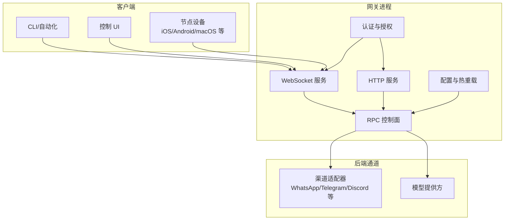
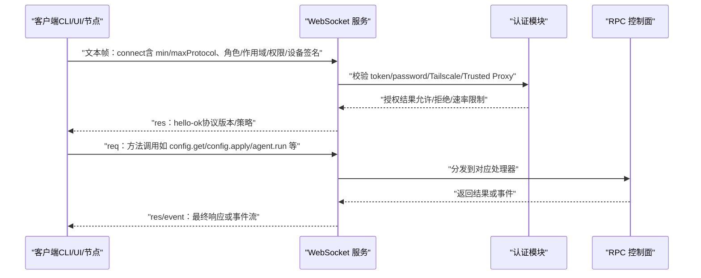
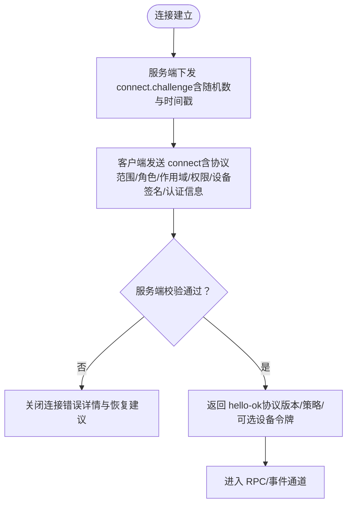
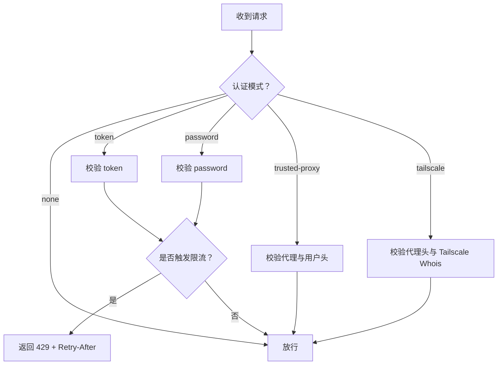
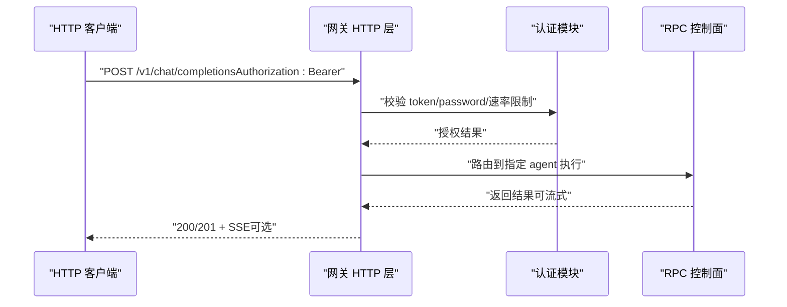
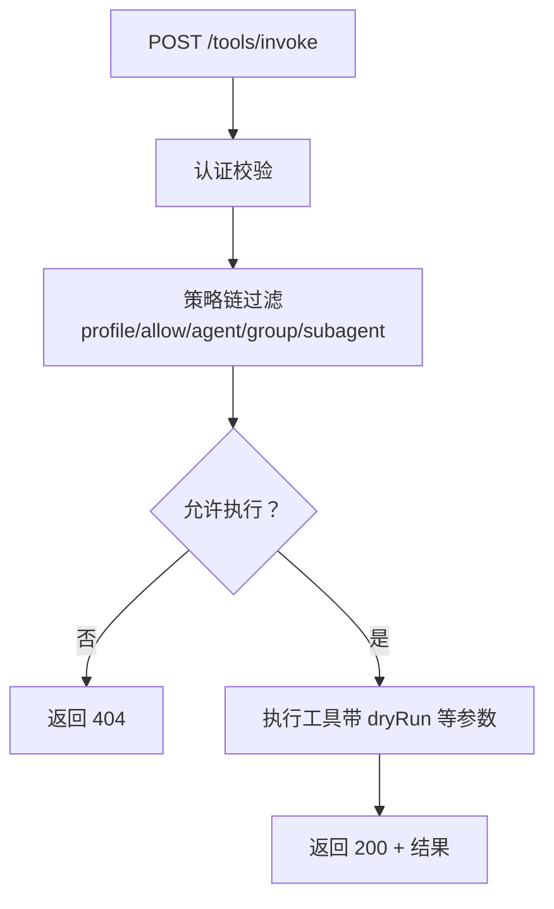
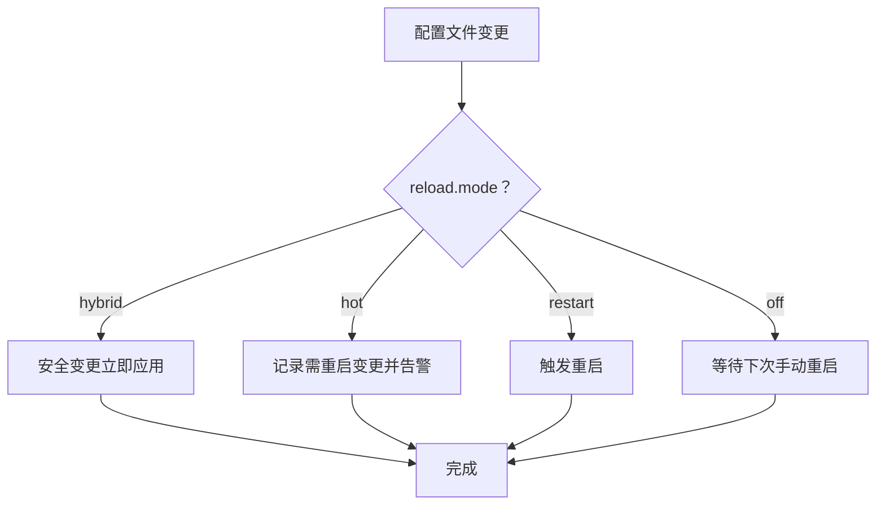
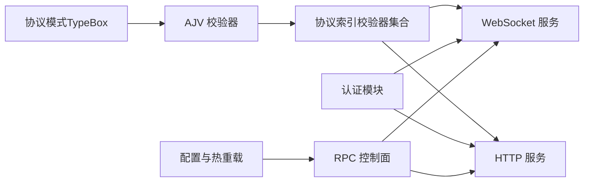

# 网关架构

<cite>
**本文引用的文件**
- [docs/gateway/index.md](file://docs/gateway/index.md)
- [docs/gateway/configuration.md](file://docs/gateway/configuration.md)
- [docs/gateway/protocol.md](file://docs/gateway/protocol.md)
- [docs/gateway/openai-http-api.md](file://docs/gateway/openai-http-api.md)
- [docs/gateway/tools-invoke-http-api.md](file://docs/gateway/tools-invoke-http-api.md)
- [docs/gateway/health.md](file://docs/gateway/health.md)
- [src/gateway/protocol/schema.ts](file://src/gateway/protocol/schema.ts)
- [src/gateway/protocol/index.ts](file://src/gateway/protocol/index.ts)
- [src/gateway/auth.ts](file://src/gateway/auth.ts)
- [src/gateway/call.ts](file://src/gateway/call.ts)
- [src/gateway/boot.ts](file://src/gateway/boot.ts)
</cite>

## 目录

1. [引言](#引言)
2. [项目结构](#项目结构)
3. [核心组件](#核心组件)
4. [架构总览](#架构总览)
5. [详细组件分析](#详细组件分析)
6. [依赖关系分析](#依赖关系分析)
7. [性能考量](#性能考量)
8. [故障排查指南](#故障排查指南)
9. [结论](#结论)
10. [附录](#附录)

## 引言

本文件系统化梳理 OpenClaw 网关的架构与运行机制，覆盖协议设计、连接管理、消息传递、安全与认证、HTTP API、RPC 调用、配置热重载、健康检查与诊断、以及扩展性与运维实践。目标是帮助开发者与运维人员快速理解并高效地部署、监控与维护网关。

## 项目结构

OpenClaw 将“网关”作为统一的控制平面与节点传输载体，通过单一端口同时承载：

- WebSocket 控制与 RPC
- HTTP API（OpenAI 兼容、工具调用等）
- 控制 UI 与钩子（hooks）

默认绑定模式为回环地址，认证默认开启；支持远程模式与 TLS 指纹校验；配置文件采用 JSON5 并具备严格校验与热重载能力。

图示来源

- [docs/gateway/index.md:68-93](file://docs/gateway/index.md#L68-L93)
- [docs/gateway/configuration.md:349-387](file://docs/gateway/configuration.md#L349-L387)

章节来源

- [docs/gateway/index.md:27-124](file://docs/gateway/index.md#L27-L124)
- [docs/gateway/configuration.md:349-387](file://docs/gateway/configuration.md#L349-L387)

## 核心组件

- 协议与帧模型：基于 WebSocket 文本帧的请求/响应/事件三类帧，首帧必须为 connect；协议版本由 schema 统一生成与校验。
- 认证与授权：支持 token/password/trusted-proxy/tailscale 等多种模式，具备速率限制与迁移指引。
- HTTP API：提供 OpenAI 兼容聊天接口与工具直接调用接口，均受网关认证保护。
- 配置与热重载：JSON5 配置严格校验，支持 hybrid/hot/restart/off 四种热重载模式。
- 健康检查与诊断：CLI 提供 status/health 命令与日志线索，便于快速定位问题。

章节来源

- [docs/gateway/protocol.md:10-268](file://docs/gateway/protocol.md#L10-L268)
- [src/gateway/protocol/index.ts:1-673](file://src/gateway/protocol/index.ts#L1-L673)
- [src/gateway/auth.ts:1-504](file://src/gateway/auth.ts#L1-L504)
- [docs/gateway/openai-http-api.md:1-133](file://docs/gateway/openai-http-api.md#L1-L133)
- [docs/gateway/tools-invoke-http-api.md:1-111](file://docs/gateway/tools-invoke-http-api.md#L1-L111)
- [docs/gateway/configuration.md:349-547](file://docs/gateway/configuration.md#L349-L547)
- [docs/gateway/health.md:1-36](file://docs/gateway/health.md#L1-L36)

## 架构总览

网关以“单端口多协议”的方式对外提供服务：

- WebSocket：控制面（connect/hello-ok）、RPC 方法、事件推送（presence/health/tick/shutdown 等）。
- HTTP：OpenAI 兼容聊天接口、工具调用接口、控制 UI 与钩子。
- 认证：统一的认证与授权模块，支持多种模式与速率限制。
- 配置：集中式 JSON5 配置，严格校验与热重载。

图示来源

- [docs/gateway/protocol.md:22-91](file://docs/gateway/protocol.md#L22-L91)
- [src/gateway/auth.ts:378-485](file://src/gateway/auth.ts#L378-L485)
- [src/gateway/protocol/index.ts:1-673](file://src/gateway/protocol/index.ts#L1-L673)

## 详细组件分析

### 协议与帧模型

- 传输层：WebSocket 文本帧，首帧必须为 connect。
- 帧类型：
  - 请求：req（id/method/params）
  - 响应：res（id/ok/payload|error）
  - 事件：event（event/payload/可选序列号与状态版本）
- 版本协商：客户端声明 min/maxProtocol，服务端拒绝不兼容版本。
- 设备身份与配对：connect 参数中包含设备标识与签名，服务端签名校验与迁移指引完善。
- 角色与作用域：operator/node 双角色，operator 支持 read/write/admin/approvals/pairing 等细粒度作用域；节点声明能力清单与命令白名单。

图示来源

- [docs/gateway/protocol.md:22-91](file://docs/gateway/protocol.md#L22-L91)
- [docs/gateway/protocol.md:216-256](file://docs/gateway/protocol.md#L216-L256)

章节来源

- [docs/gateway/protocol.md:10-268](file://docs/gateway/protocol.md#L10-L268)
- [src/gateway/protocol/schema.ts:1-19](file://src/gateway/protocol/schema.ts#L1-L19)
- [src/gateway/protocol/index.ts:1-673](file://src/gateway/protocol/index.ts#L1-L673)

### 认证与授权

- 模式：
  - none/token/password/trusted-proxy/tailscale
  - 默认 token 模式，支持环境变量覆盖
- 速率限制：共享密钥作用域，失败尝试计入并可返回 Retry-After
- Tailscale：在允许范围内，可通过代理头进行用户识别与放行
- Trusted Proxy：要求明确的代理列表与用户头，可限定允许用户
- 安全约束：本地直连与私有网络豁免需显式开关；远程访问强制使用 wss，并支持 TLS 指纹固定

图示来源

- [src/gateway/auth.ts:217-292](file://src/gateway/auth.ts#L217-L292)
- [src/gateway/auth.ts:378-485](file://src/gateway/auth.ts#L378-L485)

章节来源

- [src/gateway/auth.ts:1-504](file://src/gateway/auth.ts#L1-L504)

### HTTP API：OpenAI 兼容聊天接口

- 端点：POST /v1/chat/completions
- 认证：Bearer Token（与网关一致）
- 代理路由：通过 model 或 x-openclaw-agent-id 指定代理；支持 x-openclaw-session-key 精准路由
- 流式输出：SSE（text/event-stream），以 data 行返回 JSON，以 [DONE] 结束
- 安全边界：该端点等同于网关控制面权限，仅在内网/隧道/受信入口暴露

图示来源

- [docs/gateway/openai-http-api.md:14-133](file://docs/gateway/openai-http-api.md#L14-L133)

章节来源

- [docs/gateway/openai-http-api.md:1-133](file://docs/gateway/openai-http-api.md#L1-L133)

### HTTP API：工具直接调用接口

- 端点：POST /tools/invoke
- 认证：Bearer Token（与网关一致）
- 请求体：tool/action/args/sessionKey/dryRun
- 策略与路由：遵循与代理相同的工具策略链（tools.profile/byProvider/profile/allow/agent 级 allow、群组策略、子代理）
- 默认禁用列表：部分高风险工具默认禁止，可通过 gateway.tools.allow/deny 自定义

图示来源

- [docs/gateway/tools-invoke-http-api.md:30-111](file://docs/gateway/tools-invoke-http-api.md#L30-L111)

章节来源

- [docs/gateway/tools-invoke-http-api.md:1-111](file://docs/gateway/tools-invoke-http-api.md#L1-L111)

### 配置管理与热重载

- 文件格式：JSON5（支持注释与尾随逗号），严格校验未知键与类型
- 热重载模式：
  - hybrid（默认）：安全变更即时生效，需要重启的变更自动重启
  - hot：仅安全变更，需人工重启
  - restart：每次变更均重启
  - off：禁用文件监听
- 关键字段分类：通道、代理与模型、自动化、会话与消息、工具与媒体、UI 与杂项、网关服务器、基础设施
- RPC 更新：config.apply（整包替换）与 config.patch（部分合并），带 baseHash 与重启协同

图示来源

- [docs/gateway/configuration.md:349-447](file://docs/gateway/configuration.md#L349-L447)

章节来源

- [docs/gateway/configuration.md:1-547](file://docs/gateway/configuration.md#L1-L547)

### 运行时与生命周期

- 默认端口与绑定：默认端口 18789，绑定模式 loopback；非 loopback 必须配置认证
- 远程访问：优先 Tailscale/VPN，回退 SSH 隧道；远程模式需配置 gateway.remote.url
- 服务安装与监督：macOS launchd、Linux systemd user/system；支持 doctor 修复服务配置漂移
- 多实例：同一主机建议仅运行一个网关；多实例需确保端口、配置路径、状态目录、工作区唯一

章节来源

- [docs/gateway/index.md:78-190](file://docs/gateway/index.md#L78-L190)

### 健康检查与诊断

- CLI 命令：status/health/logs，支持 --all/--deep/--json
- 渠道健康：针对特定渠道的登录状态、凭证时效、会话存储位置与常见错误码
- 日志线索：web-heartbeat/web-reconnect/web-auto-reply/web-inbound 等关键词

章节来源

- [docs/gateway/health.md:1-36](file://docs/gateway/health.md#L1-L36)

### 启动引导与会话映射快照

- BOOT.md：在启动阶段按指示执行任务，使用静默回复标记避免干扰
- 主会话映射快照：在引导前后对主会话映射进行快照与恢复，保证一致性

章节来源

- [src/gateway/boot.ts:1-204](file://src/gateway/boot.ts#L1-L204)

## 依赖关系分析

- 协议层依赖 TypeBox 定义的模式与 AJV 校验器，确保请求/响应/事件的强类型与一致性
- 认证层依赖可信代理解析、Tailscale Whois、速率限制器与安全比较函数
- HTTP 层复用 WebSocket 的认证与授权逻辑，统一安全边界
- 配置层与热重载依赖文件系统监听与合并策略

图示来源

- [src/gateway/protocol/schema.ts:1-19](file://src/gateway/protocol/schema.ts#L1-L19)
- [src/gateway/protocol/index.ts:253-458](file://src/gateway/protocol/index.ts#L253-L458)
- [src/gateway/auth.ts:1-504](file://src/gateway/auth.ts#L1-L504)

章节来源

- [src/gateway/protocol/schema.ts:1-19](file://src/gateway/protocol/schema.ts#L1-L19)
- [src/gateway/protocol/index.ts:1-673](file://src/gateway/protocol/index.ts#L1-L673)
- [src/gateway/auth.ts:1-504](file://src/gateway/auth.ts#L1-L504)

## 性能考量

- 单端口多协议：减少连接与资源开销，提升吞吐
- 严格的配置校验与热重载策略：避免运行期因配置错误导致的抖动
- 速率限制与安全校验：降低恶意请求对系统的影响
- 会话与消息路由：通过会话键与线程绑定实现稳定的状态管理
- 工具调用策略：在 HTTP 层即进行策略过滤，避免不必要的后端执行

## 故障排查指南

- 常见症状与原因：
  - “拒绝绑定且无认证”：非 loopback 绑定未配置 token/password
  - “另一个网关已在监听/EADDRINUSE”：端口冲突
  - “配置为远程模式但未设置远端 URL”：gateway.mode=remote 但 gateway.remote.url 缺失
  - “connect 时未授权”：客户端与网关认证不一致
- 建议步骤：
  - 使用 openclaw status/health/logs 获取当前状态与日志
  - 对渠道问题执行 openclaw channels logout && openclaw channels login
  - 如为远程模式，确认 gateway.remote.url 正确或切换为本地模式
  - 对于 HTTP 接口 429，检查速率限制与重试策略

章节来源

- [docs/gateway/index.md:235-244](file://docs/gateway/index.md#L235-L244)
- [docs/gateway/health.md:27-36](file://docs/gateway/health.md#L27-L36)

## 结论

OpenClaw 网关以统一的协议与认证体系为核心，通过单端口多协议的方式提供强大的控制面与节点传输能力。其严格的配置校验、灵活的热重载模式、完善的 HTTP API 与安全边界，使其既适合个人自建也适用于生产环境的运维与扩展。配合健康检查与诊断工具，能够有效保障系统的稳定性与可观测性。

## 附录

- 部署与运维要点
  - 本地开发：openclaw gateway --port 18789；调试可加 --verbose
  - 远程访问：优先 Tailscale/VPN；回退 SSH 隧道
  - 服务安装：macOS 使用 launchd；Linux 使用 systemd user/system
  - 多实例：确保端口、配置路径、状态目录、工作区唯一
- 监控与日志
  - openclaw logs --follow 实时查看
  - openclaw status/health --json 获取运行态快照
  - 关注 web-\* 相关日志关键词
- 安全最佳实践
  - 远程访问一律使用 wss；必要时启用 TLS 指纹固定
  - 仅在内网/隧道暴露 HTTP 接口；避免公网直连
  - 合理配置速率限制与受限用户白名单

章节来源

- [docs/gateway/index.md:27-190](file://docs/gateway/index.md#L27-L190)
- [docs/gateway/openai-http-api.md:31-42](file://docs/gateway/openai-http-api.md#L31-L42)
- [docs/gateway/tools-invoke-http-api.md:62-82](file://docs/gateway/tools-invoke-http-api.md#L62-L82)
