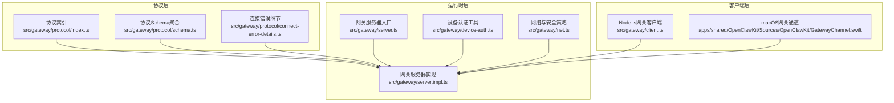
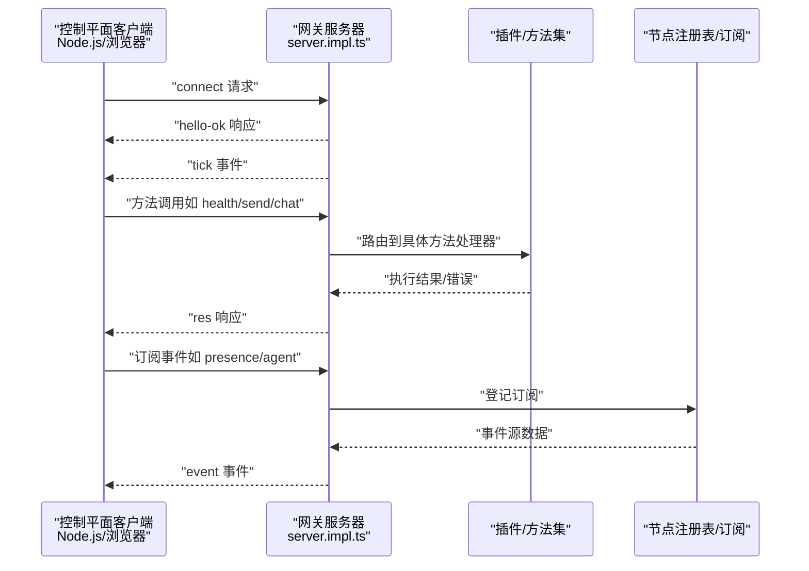
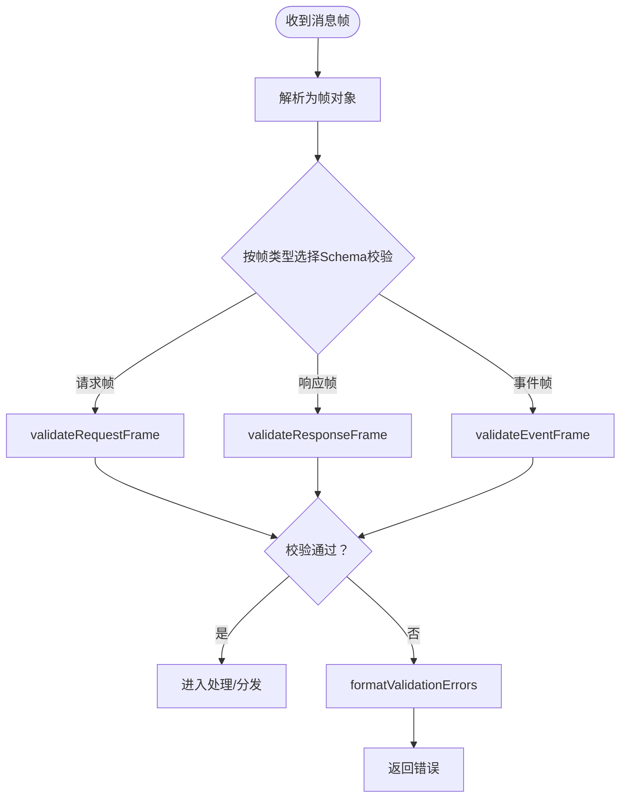
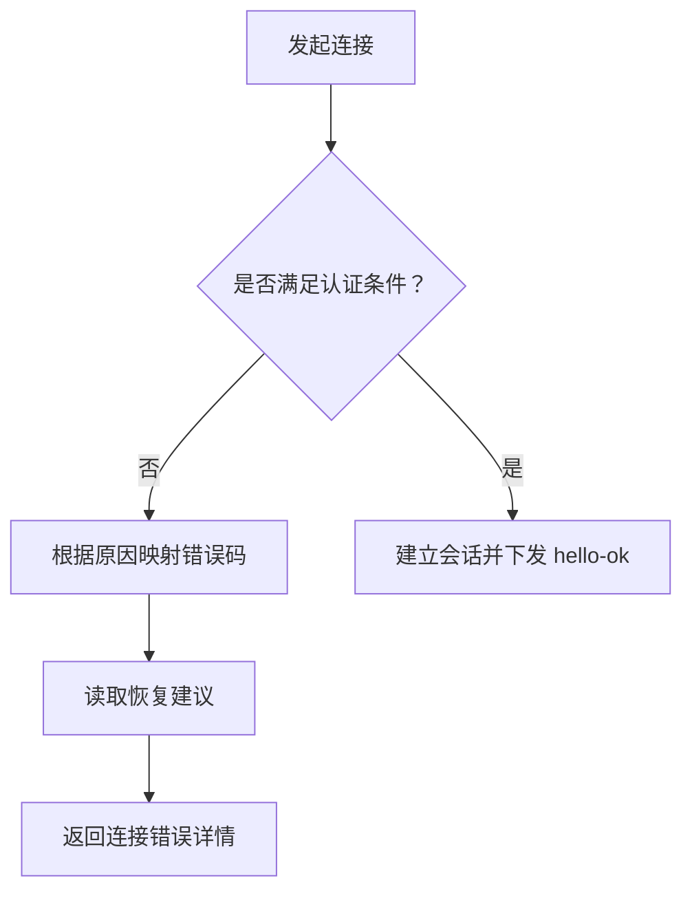
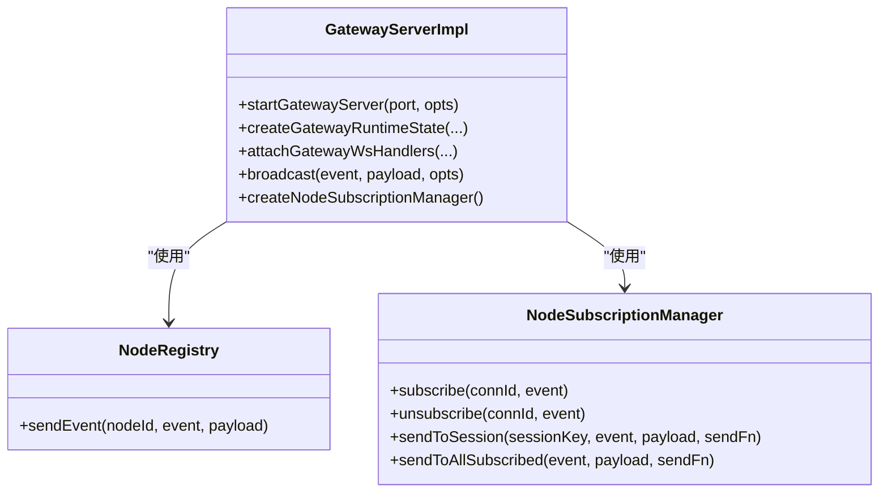
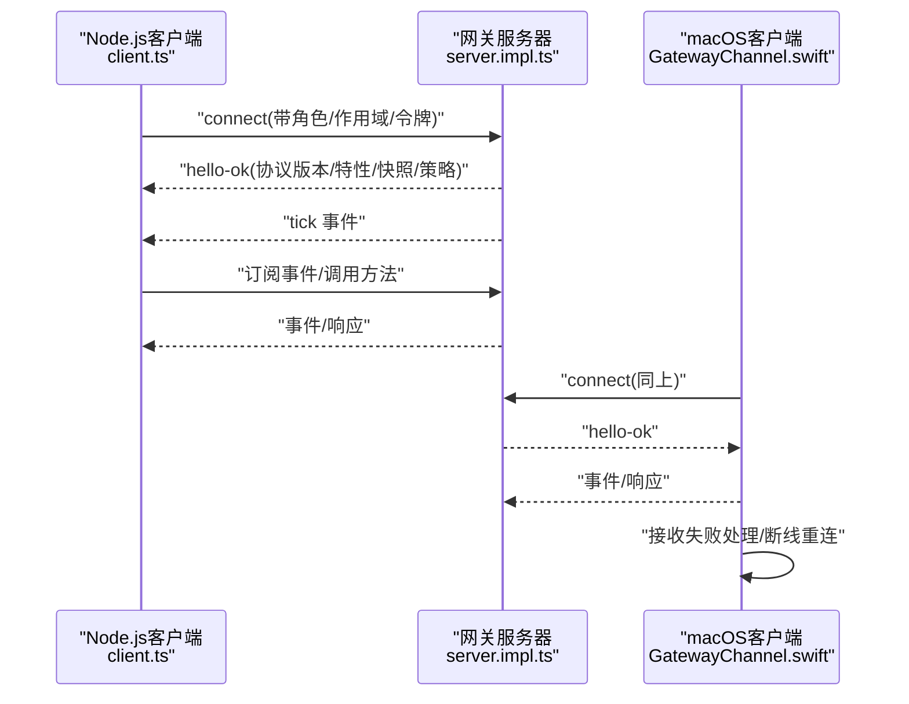
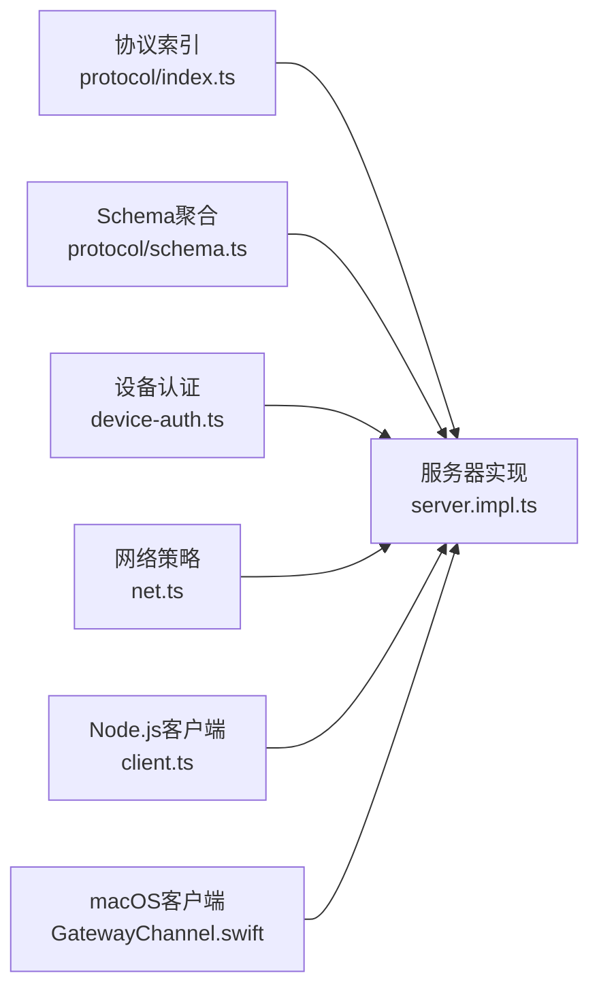

# 网关架构

<cite>
**本文引用的文件**
- [src/gateway/server.ts](file://src/gateway/server.ts)
- [src/gateway/server.impl.ts](file://src/gateway/server.impl.ts)
- [src/gateway/client.ts](file://src/gateway/client.ts)
- [src/gateway/protocol/index.ts](file://src/gateway/protocol/index.ts)
- [src/gateway/protocol/schema.ts](file://src/gateway/protocol/schema.ts)
- [src/gateway/protocol/connect-error-details.ts](file://src/gateway/protocol/connect-error-details.ts)
- [src/gateway/device-auth.ts](file://src/gateway/device-auth.ts)
- [src/gateway/net.ts](file://src/gateway/net.ts)
- [apps/shared/OpenClawKit/Sources/OpenClawKit/GatewayChannel.swift](file://apps/shared/OpenClawKit/Sources/OpenClawKit/GatewayChannel.swift)
- [apps/shared/OpenClawKit/Tests/OpenClawKitTests/GatewayNodeSessionTests.swift](file://apps/shared/OpenClawKit/Tests/OpenClawKitTests/GatewayNodeSessionTests.swift)
- [docs/concepts/typebox.md](file://docs/concepts/typebox.md)
</cite>

## 目录

1. [引言](#引言)
2. [项目结构](#项目结构)
3. [核心组件](#核心组件)
4. [架构总览](#架构总览)
5. [详细组件分析](#详细组件分析)
6. [依赖关系分析](#依赖关系分析)
7. [性能考量](#性能考量)
8. [故障排查指南](#故障排查指南)
9. [结论](#结论)
10. [附录](#附录)

## 引言

本文件面向OpenClaw网关架构，系统化阐述WebSocket网关的设计原理、组件构成与数据流。重点覆盖以下主题：

- 网关作为单一长连接承载所有消息表面的作用
- 控制平面客户端（macOS应用、CLI、Web UI、自动化）通过WebSocket连接网关的机制
- 节点（macOS/iOS/Android/headless）以“角色声明”方式连接网关
- 画布主机服务的实现与运行时状态
- 网关协议类型系统、JSON Schema验证、事件分发机制与身份验证流程
- 提供连接生命周期、请求响应模式与事件订阅机制的代码级参考路径

## 项目结构

OpenClaw的网关位于后端核心模块中，采用“协议定义—运行时—客户端”的分层组织：

- 协议层：统一的TypeBox类型系统与JSON Schema导出，驱动运行时校验与跨语言代码生成
- 运行时层：网关服务器启动、插件加载、方法注册、事件广播、节点订阅管理、维护定时器等
- 客户端层：Node.js网关客户端与macOS Swift客户端，分别用于自动化与原生应用接入

图表来源

- [src/gateway/server.ts:1-4](file://src/gateway/server.ts#L1-L4)
- [src/gateway/server.impl.ts:1-120](file://src/gateway/server.impl.ts#L1-L120)
- [src/gateway/protocol/index.ts:1-60](file://src/gateway/protocol/index.ts#L1-L60)
- [src/gateway/protocol/schema.ts:1-19](file://src/gateway/protocol/schema.ts#L1-L19)
- [src/gateway/protocol/connect-error-details.ts:1-40](file://src/gateway/protocol/connect-error-details.ts#L1-L40)
- [src/gateway/device-auth.ts:1-55](file://src/gateway/device-auth.ts#L1-L55)
- [src/gateway/net.ts:411-457](file://src/gateway/net.ts#L411-L457)
- [src/gateway/client.ts:1-96](file://src/gateway/client.ts#L1-L96)
- [apps/shared/OpenClawKit/Sources/OpenClawKit/GatewayChannel.swift:573-603](file://apps/shared/OpenClawKit/Sources/OpenClawKit/GatewayChannel.swift#L573-L603)

章节来源

- [src/gateway/server.ts:1-4](file://src/gateway/server.ts#L1-L4)
- [src/gateway/server.impl.ts:1-120](file://src/gateway/server.impl.ts#L1-L120)
- [src/gateway/protocol/index.ts:1-60](file://src/gateway/protocol/index.ts#L1-L60)
- [src/gateway/protocol/schema.ts:1-19](file://src/gateway/protocol/schema.ts#L1-L19)
- [src/gateway/protocol/connect-error-details.ts:1-40](file://src/gateway/protocol/connect-error-details.ts#L1-L40)
- [src/gateway/device-auth.ts:1-55](file://src/gateway/device-auth.ts#L1-L55)
- [src/gateway/net.ts:411-457](file://src/gateway/net.ts#L411-L457)
- [src/gateway/client.ts:1-96](file://src/gateway/client.ts#L1-L96)
- [apps/shared/OpenClawKit/Sources/OpenClawKit/GatewayChannel.swift:573-603](file://apps/shared/OpenClawKit/Sources/OpenClawKit/GatewayChannel.swift#L573-L603)

## 核心组件

- 协议与Schema
  - 使用TypeBox定义请求/响应/事件帧与各方法参数/结果Schema，统一导出JSON Schema并驱动运行时Ajv校验
  - 关键文件：[协议索引:1-673](file://src/gateway/protocol/index.ts#L1-L673)、[Schema聚合:1-19](file://src/gateway/protocol/schema.ts#L1-L19)
- 网关服务器
  - 启动配置解析、插件加载、方法注册、事件广播、节点订阅管理、维护定时器、TLS与发现服务
  - 入口与实现：[服务器入口:1-4](file://src/gateway/server.ts#L1-L4)、[服务器实现:266-350](file://src/gateway/server.impl.ts#L266-L350)
- 设备认证
  - 构建设备认证载荷（含角色、范围、时间戳、随机数等），支持平台与设备族元数据归一化
  - 文件：[设备认证工具:1-55](file://src/gateway/device-auth.ts#L1-L55)
- 网络与安全
  - 解析绑定地址、可信代理、本地回环/私有地址判定、WebSocket URL安全策略
  - 文件：[网络与安全策略:411-457](file://src/gateway/net.ts#L411-L457)
- 客户端
  - Node.js客户端：连接参数、重连、事件回调、错误封装
  - macOS客户端：WebSocket接收处理、解码、事件分发、断线重连
  - 文件：[Node.js客户端:1-96](file://src/gateway/client.ts#L1-L96)、[macOS网关通道:573-603](file://apps/shared/OpenClawKit/Sources/OpenClawKit/GatewayChannel.swift#L573-L603)

章节来源

- [src/gateway/protocol/index.ts:1-673](file://src/gateway/protocol/index.ts#L1-L673)
- [src/gateway/protocol/schema.ts:1-19](file://src/gateway/protocol/schema.ts#L1-L19)
- [src/gateway/server.ts:1-4](file://src/gateway/server.ts#L1-L4)
- [src/gateway/server.impl.ts:266-350](file://src/gateway/server.impl.ts#L266-L350)
- [src/gateway/device-auth.ts:1-55](file://src/gateway/device-auth.ts#L1-L55)
- [src/gateway/net.ts:411-457](file://src/gateway/net.ts#L411-L457)
- [src/gateway/client.ts:1-96](file://src/gateway/client.ts#L1-L96)
- [apps/shared/OpenClawKit/Sources/OpenClawKit/GatewayChannel.swift:573-603](file://apps/shared/OpenClawKit/Sources/OpenClawKit/GatewayChannel.swift#L573-L603)

## 架构总览

OpenClaw网关以单一WebSocket长连接为核心，承载控制平面与节点之间的所有消息面。控制平面客户端（macOS应用、CLI、Web UI、自动化）通过WS连接到网关；节点以“角色声明”方式连接，网关据此授予能力边界与订阅权限。运行时负责：

- 插件与方法注册（含频道方法）
- 事件广播与去重
- 维护定时器（心跳、健康、媒体清理等）
- 认证与速率限制
- 画布主机服务（可选）

图表来源

- [src/gateway/server.impl.ts:580-630](file://src/gateway/server.impl.ts#L580-L630)
- [src/gateway/server.impl.ts:727-740](file://src/gateway/server.impl.ts#L727-L740)
- [src/gateway/protocol/index.ts:253-262](file://src/gateway/protocol/index.ts#L253-L262)

章节来源

- [src/gateway/server.impl.ts:580-630](file://src/gateway/server.impl.ts#L580-L630)
- [src/gateway/server.impl.ts:727-740](file://src/gateway/server.impl.ts#L727-L740)
- [src/gateway/protocol/index.ts:253-262](file://src/gateway/protocol/index.ts#L253-L262)

## 详细组件分析

### 协议类型系统与JSON Schema验证

- 类型系统
  - 使用TypeBox定义帧类型（请求/响应/事件）、方法参数与结果类型
  - 通过Ajv编译Schema为验证函数，统一在运行时进行参数与结果校验
- JSON Schema导出
  - 从TypeBox导出JSON Schema，作为跨语言代码生成与外部集成的契约
- 错误格式化
  - 将Ajv错误对象格式化为人类可读字符串，便于诊断

图表来源

- [src/gateway/protocol/index.ts:253-458](file://src/gateway/protocol/index.ts#L253-L458)

章节来源

- [src/gateway/protocol/index.ts:253-458](file://src/gateway/protocol/index.ts#L253-L458)
- [docs/concepts/typebox.md:1-41](file://docs/concepts/typebox.md#L1-L41)

### 身份验证与连接错误细节

- 设备认证载荷
  - 支持v2/v3版本载荷构建，包含设备ID、客户端ID、模式、角色、作用域、签名时间、令牌、随机数及可选平台/设备族信息
- 连接错误码
  - 定义认证/设备认证/配对等错误码，提供恢复建议（如重试携带设备令牌、更新认证配置等）
- URL安全策略
  - 默认仅允许wss或loopback的ws；可选允许私有网络ws

图表来源

- [src/gateway/device-auth.ts:20-54](file://src/gateway/device-auth.ts#L20-L54)
- [src/gateway/protocol/connect-error-details.ts:1-137](file://src/gateway/protocol/connect-error-details.ts#L1-L137)
- [src/gateway/net.ts:411-457](file://src/gateway/net.ts#L411-L457)

章节来源

- [src/gateway/device-auth.ts:20-54](file://src/gateway/device-auth.ts#L20-L54)
- [src/gateway/protocol/connect-error-details.ts:1-137](file://src/gateway/protocol/connect-error-details.ts#L1-L137)
- [src/gateway/net.ts:411-457](file://src/gateway/net.ts#L411-L457)

### 网关服务器运行时

- 启动流程
  - 配置读取与迁移、插件加载、方法注册、TLS与发现服务、维护定时器、代理转发与速率限制
- 事件与方法
  - 广播心跳、健康快照、代理事件；注册核心与频道方法；节点订阅管理
- 画布主机服务
  - 可选启用，配合运行时状态与日志子系统

图表来源

- [src/gateway/server.impl.ts:266-350](file://src/gateway/server.impl.ts#L266-L350)
- [src/gateway/server.impl.ts:628-642](file://src/gateway/server.impl.ts#L628-L642)

章节来源

- [src/gateway/server.impl.ts:266-350](file://src/gateway/server.impl.ts#L266-L350)
- [src/gateway/server.impl.ts:628-642](file://src/gateway/server.impl.ts#L628-L642)

### 客户端连接生命周期与事件订阅

- Node.js客户端
  - 支持URL、延迟重连、心跳间隔、设备令牌、角色与作用域声明、TLS指纹校验、事件回调与连接错误回调
- macOS客户端
  - 接收消息、解码帧、处理接收失败、断线重连、失败挂起请求清理与调度重连

图表来源

- [src/gateway/client.ts:67-96](file://src/gateway/client.ts#L67-L96)
- [apps/shared/OpenClawKit/Sources/OpenClawKit/GatewayChannel.swift:573-603](file://apps/shared/OpenClawKit/Sources/OpenClawKit/GatewayChannel.swift#L573-L603)
- [apps/shared/OpenClawKit/Tests/OpenClawKitTests/GatewayNodeSessionTests.swift:104-138](file://apps/shared/OpenClawKit/Tests/OpenClawKitTests/GatewayNodeSessionTests.swift#L104-L138)

章节来源

- [src/gateway/client.ts:67-96](file://src/gateway/client.ts#L67-L96)
- [apps/shared/OpenClawKit/Sources/OpenClawKit/GatewayChannel.swift:573-603](file://apps/shared/OpenClawKit/Sources/OpenClawKit/GatewayChannel.swift#L573-L603)
- [apps/shared/OpenClawKit/Tests/OpenClawKitTests/GatewayNodeSessionTests.swift:104-138](file://apps/shared/OpenClawKit/Tests/OpenClawKitTests/GatewayNodeSessionTests.swift#L104-L138)

### 节点角色声明与能力边界

- 角色声明
  - 客户端在连接时声明role、scopes、caps、commands等，网关据此授予能力与订阅权限
- 能力与订阅
  - 服务器侧维护节点注册表与订阅管理，按会话/事件维度分发

章节来源

- [src/gateway/client.ts:67-96](file://src/gateway/client.ts#L67-L96)
- [src/gateway/server.impl.ts:628-642](file://src/gateway/server.impl.ts#L628-L642)

### 画布主机服务

- 启动与运行时
  - 在运行时状态初始化阶段创建并管理画布主机服务，结合日志与运行时上下文
- 用途
  - 支持可视化/交互式场景下的主机服务能力（可选启用）

章节来源

- [src/gateway/server.impl.ts:566-567](file://src/gateway/server.impl.ts#L566-L567)

## 依赖关系分析

- 协议层依赖
  - 协议索引导出Ajv编译后的验证器与Schema，被运行时与客户端共享
- 运行时耦合
  - 服务器实现依赖插件注册、方法列表、事件广播、节点订阅、维护定时器、TLS与发现
- 客户端依赖
  - Node.js客户端依赖协议验证、设备认证、网络安全策略
  - macOS客户端依赖解码器与事件处理逻辑

图表来源

- [src/gateway/protocol/index.ts:1-60](file://src/gateway/protocol/index.ts#L1-L60)
- [src/gateway/protocol/schema.ts:1-19](file://src/gateway/protocol/schema.ts#L1-L19)
- [src/gateway/device-auth.ts:1-55](file://src/gateway/device-auth.ts#L1-L55)
- [src/gateway/net.ts:411-457](file://src/gateway/net.ts#L411-L457)
- [src/gateway/server.impl.ts:266-350](file://src/gateway/server.impl.ts#L266-L350)
- [src/gateway/client.ts:1-96](file://src/gateway/client.ts#L1-L96)
- [apps/shared/OpenClawKit/Sources/OpenClawKit/GatewayChannel.swift:573-603](file://apps/shared/OpenClawKit/Sources/OpenClawKit/GatewayChannel.swift#L573-L603)

章节来源

- [src/gateway/protocol/index.ts:1-60](file://src/gateway/protocol/index.ts#L1-L60)
- [src/gateway/protocol/schema.ts:1-19](file://src/gateway/protocol/schema.ts#L1-L19)
- [src/gateway/device-auth.ts:1-55](file://src/gateway/device-auth.ts#L1-L55)
- [src/gateway/net.ts:411-457](file://src/gateway/net.ts#L411-L457)
- [src/gateway/server.impl.ts:266-350](file://src/gateway/server.impl.ts#L266-L350)
- [src/gateway/client.ts:1-96](file://src/gateway/client.ts#L1-L96)
- [apps/shared/OpenClawKit/Sources/OpenClawKit/GatewayChannel.swift:573-603](file://apps/shared/OpenClawKit/Sources/OpenClawKit/GatewayChannel.swift#L573-L603)

## 性能考量

- 连接与事件
  - 使用单一长连接降低握手开销；事件广播支持丢弃过慢目标以保护整体吞吐
- 维护定时器
  - 心跳、健康快照、去重清理、媒体清理等周期性任务需合理配置间隔，避免过度CPU占用
- 认证与速率限制
  - 对认证尝试设置速率限制，防止滥用；浏览器来源采用更严格的限流策略
- 插件与方法
  - 方法注册与插件加载应尽量幂等与延迟初始化，减少启动时延

## 故障排查指南

- 连接失败与错误码
  - 使用连接错误细节模块读取错误码与恢复建议，定位认证/设备认证/配对问题
- WebSocket URL安全
  - 确认使用wss或loopback ws；必要时开启私有网络ws但需谨慎评估风险
- 客户端断线与重连
  - 检查接收失败处理、解码失败日志、断线重连调度与挂起请求清理
- 协议验证错误
  - 使用formatValidationErrors输出详细校验错误，逐项修正字段与Schema不匹配问题

章节来源

- [src/gateway/protocol/connect-error-details.ts:1-137](file://src/gateway/protocol/connect-error-details.ts#L1-L137)
- [src/gateway/net.ts:411-457](file://src/gateway/net.ts#L411-L457)
- [apps/shared/OpenClawKit/Sources/OpenClawKit/GatewayChannel.swift:581-590](file://apps/shared/OpenClawKit/Sources/OpenClawKit/GatewayChannel.swift#L581-L590)
- [src/gateway/protocol/index.ts:424-458](file://src/gateway/protocol/index.ts#L424-L458)

## 结论

OpenClaw网关通过统一的协议类型系统与Schema验证、严格的认证与安全策略、完善的事件分发与节点订阅管理，实现了控制平面与节点间高效、一致且可扩展的消息通路。单一长连接设计确保了消息表面的集中与低延迟，同时通过维护定时器与画布主机服务支撑复杂场景。

## 附录

- 代码级参考路径（不含具体代码内容）
  - 连接生命周期与请求响应模式
    - [Node.js客户端选项与回调:67-96](file://src/gateway/client.ts#L67-L96)
    - [macOS客户端接收与断线处理:573-603](file://apps/shared/OpenClawKit/Sources/OpenClawKit/GatewayChannel.swift#L573-L603)
  - 事件订阅机制
    - [节点订阅管理器接口:628-642](file://src/gateway/server.impl.ts#L628-L642)
    - [测试中的连接成功帧构造:104-138](file://apps/shared/OpenClawKit/Tests/OpenClawKitTests/GatewayNodeSessionTests.swift#L104-L138)
  - 协议类型系统与Schema验证
    - [协议索引与Ajv编译:253-458](file://src/gateway/protocol/index.ts#L253-L458)
    - [TypeBox与JSON Schema导出说明:1-41](file://docs/concepts/typebox.md#L1-L41)
  - 身份验证流程
    - [设备认证载荷构建:20-54](file://src/gateway/device-auth.ts#L20-L54)
    - [连接错误码与恢复建议:1-137](file://src/gateway/protocol/connect-error-details.ts#L1-L137)
    - [WebSocket URL安全策略:411-457](file://src/gateway/net.ts#L411-L457)
  - 服务器运行时
    - [服务器启动与运行时状态:266-350](file://src/gateway/server.impl.ts#L266-L350)
    - [事件广播与节点订阅:580-630](file://src/gateway/server.impl.ts#L580-L630)
