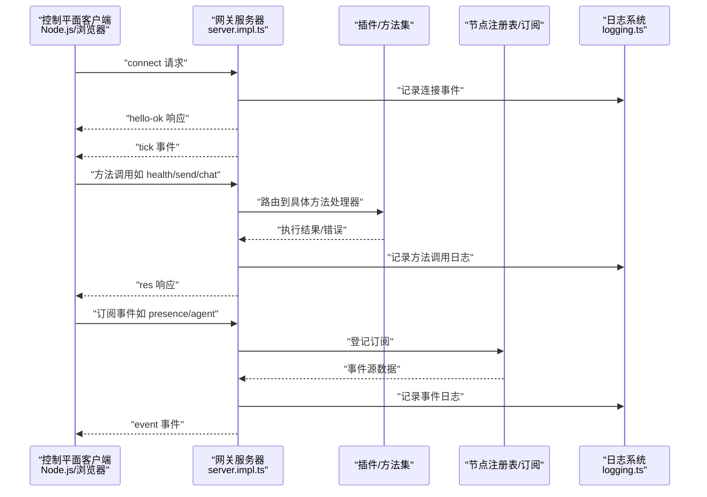
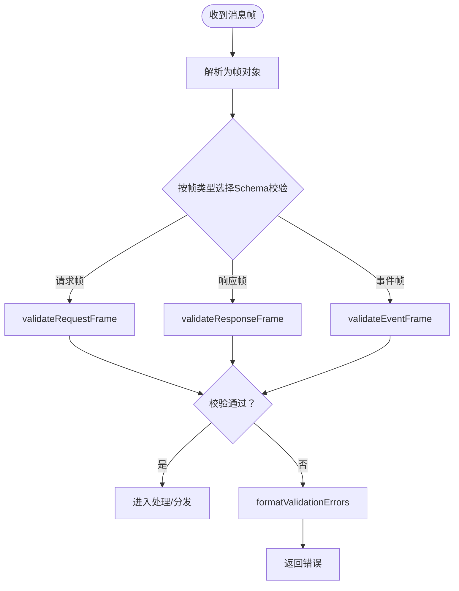
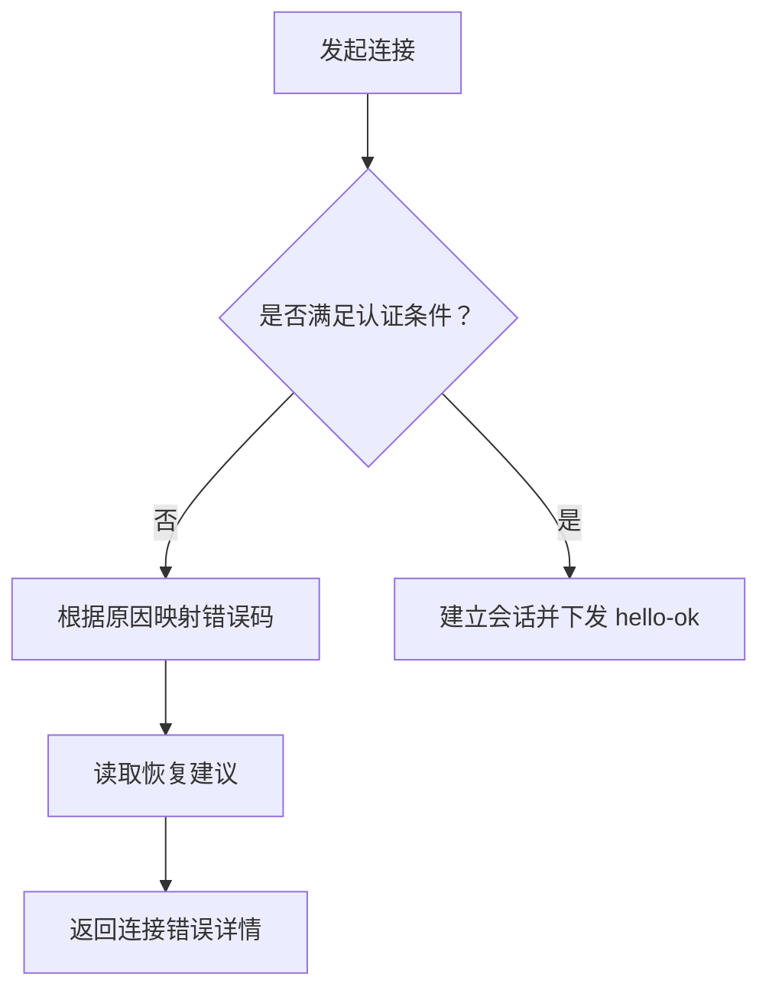
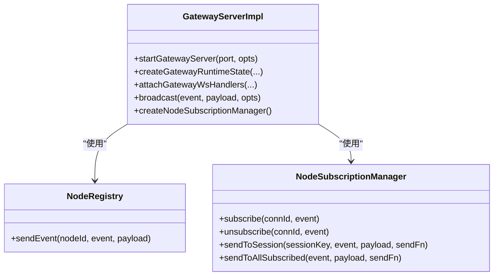
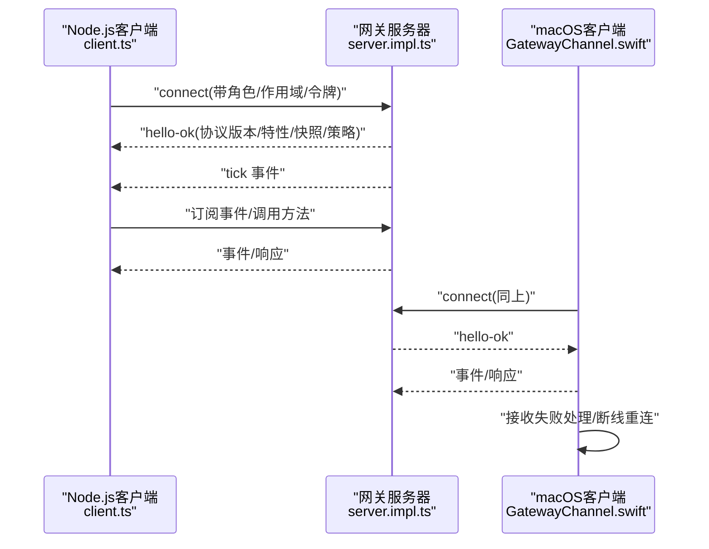
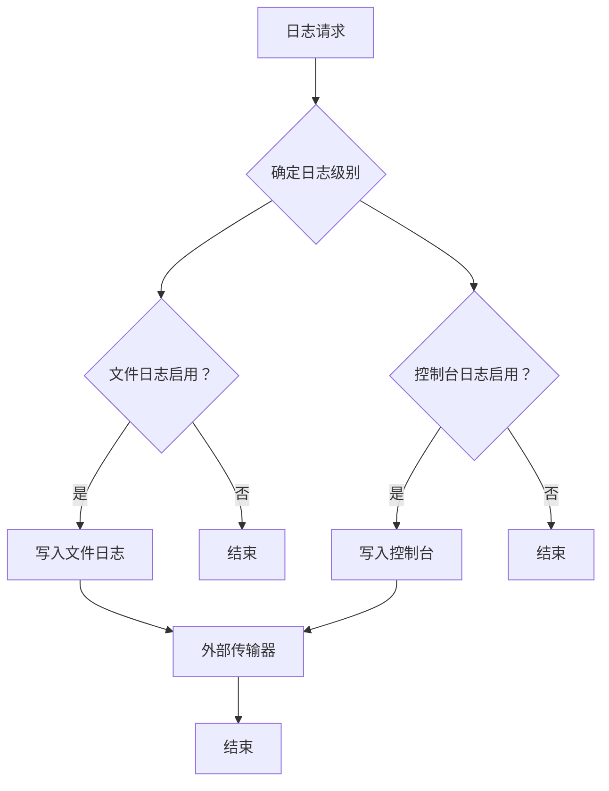
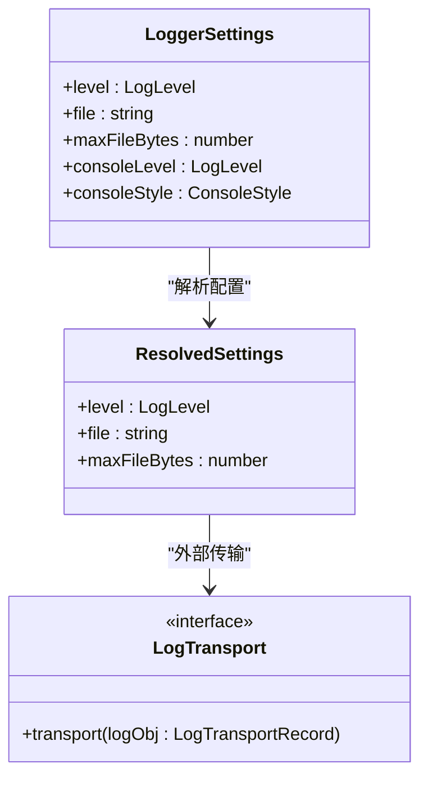
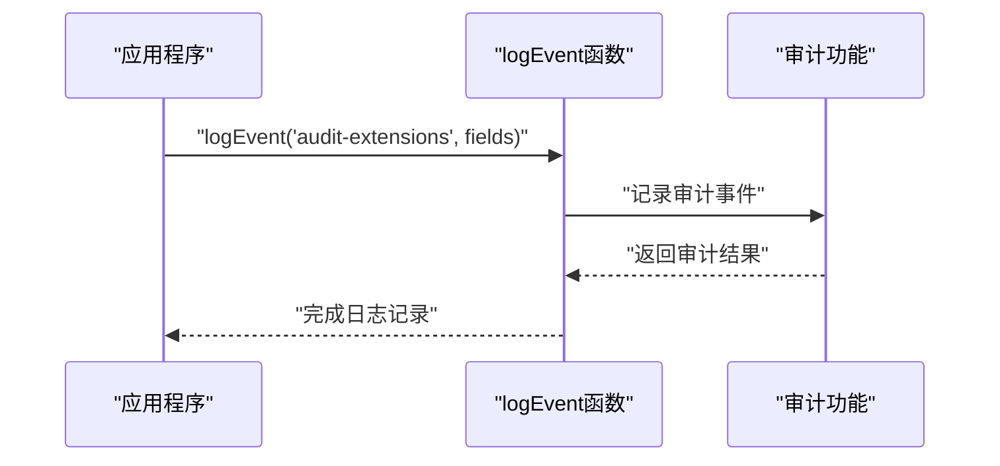
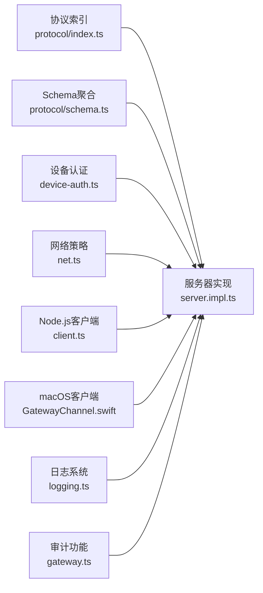

# 网关架构

<cite>
**本文档引用的文件**
- [src/gateway/server.ts](file://src/gateway/server.ts)
- [src/gateway/server.impl.ts](file://src/gateway/server.impl.ts)
- [src/gateway/client.ts](file://src/gateway/client.ts)
- [src/gateway/protocol/index.ts](file://src/gateway/protocol/index.ts)
- [src/gateway/protocol/schema.ts](file://src/gateway/protocol/schema.ts)
- [src/gateway/protocol/connect-error-details.ts](file://src/gateway/protocol/connect-error-details.ts)
- [src/gateway/device-auth.ts](file://src/gateway/device-auth.ts)
- [src/gateway/net.ts](file://src/gateway/net.ts)
- [apps/shared/OpenClawKit/Sources/OpenClawKit/GatewayChannel.swift](file://apps/shared/OpenClawKit/Sources/OpenClawKit/GatewayChannel.swift)
- [apps/shared/OpenClawKit/Tests/OpenClawKitTests/GatewayNodeSessionTests.swift](file://apps/shared/OpenClawKit/Tests/OpenClawKitTests/GatewayNodeSessionTests.swift)
- [docs/concepts/typebox.md](file://docs/concepts/typebox.md)
- [apps/electron/src/main/gateway.ts](file://apps/electron/src/main/gateway.ts)
- [src/logging.ts](file://src/logging.ts)
- [src/logging/logger.ts](file://src/logging/logger.ts)
- [src/logging/console.ts](file://src/logging/console.ts)
- [src/logging/levels.ts](file://src/logging/levels.ts)
- [src/logging/subsystem.ts](file://src/logging/subsystem.ts)
- [src/logging/config.ts](file://src/logging/config.ts)
- [src/logging/state.ts](file://src/logging/state.ts)
- [src/logging/timestamps.ts](file://src/logging/timestamps.ts)
- [src/gateway/control-plane-audit.ts](file://src/gateway/control-plane-audit.ts)
- [src/daemon/service-audit.ts](file://src/daemon/service-audit.ts)
- [src/config/logging-max-file-bytes.test.ts](file://src/config/logging-max-file-bytes.test.ts)
- [src/logging/log-file-size-cap.test.ts](file://src/logging/log-file-size-cap.test.ts)
</cite>

## 更新摘要
**变更内容**
- 新增结构化日志系统章节，详细介绍基于TsLogger的多级日志架构
- 添加扩展审计功能章节，涵盖logEvent函数、auditBundledExtensions()和auditConfigPlugins()函数
- 更新日志配置与验证机制，包括maxFileBytes配置项
- 增强错误报告和资源验证功能
- 扩展审计功能，包括服务配置审计和控制平面审计

## 目录
1. [引言](#引言)
2. [项目结构](#项目结构)
3. [核心组件](#核心组件)
4. [架构总览](#架构总览)
5. [详细组件分析](#详细组件分析)
6. [结构化日志系统](#结构化日志系统)
7. [扩展审计功能](#扩展审计功能)
8. [依赖关系分析](#依赖关系分析)
9. [性能考量](#性能考量)
10. [故障排查指南](#故障排查指南)
11. [结论](#结论)
12. [附录](#附录)

## 引言
本文件面向OpenClaw网关架构，系统化阐述WebSocket网关的设计原理、组件构成与数据流。重点覆盖以下主题：
- 网关作为单一长连接承载所有消息表面的作用
- 控制平面客户端（macOS应用、CLI、Web UI、自动化）通过WebSocket连接网关的机制
- 节点（macOS/iOS/Android/headless）以"角色声明"方式连接网关
- 画布主机服务的实现与运行时状态
- 网关协议类型系统、JSON Schema验证、事件分发机制与身份验证流程
- **新增** 结构化日志系统与扩展审计功能
- 提供连接生命周期、请求响应模式与事件订阅机制的代码级参考路径

## 项目结构
OpenClaw的网关位于后端核心模块中，采用"协议定义—运行时—客户端"的分层组织：
- 协议层：统一的TypeBox类型系统与JSON Schema导出，驱动运行时校验与跨语言代码生成
- 运行时层：网关服务器启动、插件加载、方法注册、事件广播、节点订阅管理、维护定时器等
- 客户端层：Node.js网关客户端与macOS Swift客户端，分别用于自动化与原生应用接入
- **新增** 日志层：基于TsLogger的结构化日志系统，支持多级日志级别和格式化输出
- **新增** 审计层：扩展的审计功能，包括插件审计、服务配置审计和控制平面审计

```mermaid
graph TB
subgraph "协议层"
P1["协议索引<br/>src/gateway/protocol/index.ts"]
P2["协议Schema聚合<br/>src/gateway/protocol/schema.ts"]
P3["连接错误细节<br/>src/gateway/protocol/connect-error-details.ts"]
end
subgraph "运行时层"
S1["网关服务器入口<br/>src/gateway/server.ts"]
S2["网关服务器实现<br/>src/gateway/server.impl.ts"]
S3["设备认证工具<br/>src/gateway/device-auth.ts"]
S4["网络与安全策略<br/>src/gateway/net.ts"]
end
subgraph "客户端层"
C1["Node.js网关客户端<br/>src/gateway/client.ts"]
C2["macOS网关通道<br/>apps/shared/OpenClawKit/Sources/OpenClawKit/GatewayChannel.swift"]
end
subgraph "日志层"
L1["日志系统入口<br/>src/logging.ts"]
L2["文件日志记录器<br/>src/logging/logger.ts"]
L3["控制台日志<br/>src/logging/console.ts"]
L4["日志级别<br/>src/logging/levels.ts"]
L5["子系统日志<br/>src/logging/subsystem.ts"]
end
subgraph "审计层"
A1["扩展审计<br/>apps/electron/src/main/gateway.ts"]
A2["服务配置审计<br/>src/daemon/service-audit.ts"]
A3["控制平面审计<br/>src/gateway/control-plane-audit.ts"]
end
P1 --> S2
P2 --> S2
P3 --> S2
S1 --> S2
S3 --> S2
S4 --> S2
C1 --> S2
C2 --> S2
L1 --> L2
L2 --> L3
L3 --> L4
L4 --> L5
A1 --> A2
A2 --> A3
```

**图表来源**
- [src/gateway/server.ts:1-4](file://src/gateway/server.ts#L1-L4)
- [src/gateway/server.impl.ts:1-120](file://src/gateway/server.impl.ts#L1-L120)
- [src/gateway/protocol/index.ts:1-60](file://src/gateway/protocol/index.ts#L1-L60)
- [src/gateway/protocol/schema.ts:1-19](file://src/gateway/protocol/schema.ts#L1-L19)
- [src/gateway/protocol/connect-error-details.ts:1-40](file://src/gateway/protocol/connect-error-details.ts#L1-L40)
- [src/gateway/device-auth.ts:1-55](file://src/gateway/device-auth.ts#L1-L55)
- [src/gateway/net.ts:411-457](file://src/gateway/net.ts#L411-L457)
- [src/gateway/client.ts:1-96](file://src/gateway/client.ts#L1-L96)
- [apps/shared/OpenClawKit/Sources/OpenClawKit/GatewayChannel.swift:573-603](file://apps/shared/OpenClawKit/Sources/OpenClawKit/GatewayChannel.swift#L573-L603)
- [src/logging.ts:1-70](file://src/logging.ts#L1-L70)
- [src/logging/logger.ts:1-348](file://src/logging/logger.ts#L1-L348)
- [src/logging/console.ts:1-327](file://src/logging/console.ts#L1-L327)
- [src/logging/levels.ts:1-38](file://src/logging/levels.ts#L1-L38)
- [src/logging/subsystem.ts:1-426](file://src/logging/subsystem.ts#L1-L426)
- [apps/electron/src/main/gateway.ts:1-661](file://apps/electron/src/main/gateway.ts#L1-L661)
- [src/daemon/service-audit.ts:1-424](file://src/daemon/service-audit.ts#L1-L424)
- [src/gateway/control-plane-audit.ts:1-41](file://src/gateway/control-plane-audit.ts#L1-L41)

**章节来源**
- [src/gateway/server.ts:1-4](file://src/gateway/server.ts#L1-L4)
- [src/gateway/server.impl.ts:1-120](file://src/gateway/server.impl.ts#L1-L120)
- [src/gateway/protocol/index.ts:1-60](file://src/gateway/protocol/index.ts#L1-L60)
- [src/gateway/protocol/schema.ts:1-19](file://src/gateway/protocol/schema.ts#L1-L19)
- [src/gateway/protocol/connect-error-details.ts:1-40](file://src/gateway/protocol/connect-error-details.ts#L1-L40)
- [src/gateway/device-auth.ts:1-55](file://src/gateway/device-auth.ts#L1-L55)
- [src/gateway/net.ts:411-457](file://src/gateway/net.ts#L411-L457)
- [src/gateway/client.ts:1-96](file://src/gateway/client.ts#L1-L96)
- [apps/shared/OpenClawKit/Sources/OpenClawKit/GatewayChannel.swift:573-603](file://apps/shared/OpenClawKit/Sources/OpenClawKit/GatewayChannel.swift#L573-L603)

## 核心组件
- 协议与Schema
  - 使用TypeBox定义请求/响应/事件帧与各方法参数/结果Schema，统一导出JSON Schema并驱动运行时Ajv校验
  - 关键文件：[协议索引:1-673](file://src/gateway/protocol/index.ts#L1-L673)、[Schema聚合:1-19](file://src/gateway/protocol/schema.ts#L1-L19)
- 网关服务器
  - 启动配置解析、插件加载、方法注册、事件广播、节点订阅管理、维护定时器、TLS与发现服务
  - 入口与实现：[服务器入口:1-4](file://src/gateway/server.ts#L1-L4)、[服务器实现:266-350](file://src/gateway/server.impl.ts#L266-L350)
- 设备认证
  - 构建设备认证载荷（含角色、范围、时间戳、随机数等），支持平台与设备族元数据归一化
  - 文件：[设备认证工具:1-55](file://src/gateway/device-auth.ts#L1-L55)
- 网络与安全
  - 解析绑定地址、可信代理、本地回环/私有地址判定、WebSocket URL安全策略
  - 文件：[网络与安全策略:411-457](file://src/gateway/net.ts#L411-L457)
- 客户端
  - Node.js客户端：连接参数、重连、事件回调、错误封装
  - macOS客户端：WebSocket接收处理、解码、事件分发、断线重连
  - 文件：[Node.js客户端:1-96](file://src/gateway/client.ts#L1-L96)、[macOS网关通道:573-603](file://apps/shared/OpenClawKit/Sources/OpenClawKit/GatewayChannel.swift#L573-L603)
- **新增** 日志系统
  - 基于TsLogger的多级日志架构，支持文件日志和控制台日志分离
  - 包含日志级别管理、格式化输出、滚动日志和外部传输
- **新增** 审计功能
  - 扩展的插件审计、服务配置审计和控制平面审计
  - 结构化事件日志和错误报告机制

**章节来源**
- [src/gateway/protocol/index.ts:1-673](file://src/gateway/protocol/index.ts#L1-L673)
- [src/gateway/protocol/schema.ts:1-19](file://src/gateway/protocol/schema.ts#L1-L19)
- [src/gateway/server.ts:1-4](file://src/gateway/server.ts#L1-L4)
- [src/gateway/server.impl.ts:266-350](file://src/gateway/server.impl.ts#L266-L350)
- [src/gateway/device-auth.ts:1-55](file://src/gateway/device-auth.ts#L1-L55)
- [src/gateway/net.ts:411-457](file://src/gateway/net.ts#L411-L457)
- [src/gateway/client.ts:1-96](file://src/gateway/client.ts#L1-L96)
- [apps/shared/OpenClawKit/Sources/OpenClawKit/GatewayChannel.swift:573-603](file://apps/shared/OpenClawKit/Sources/OpenClawKit/GatewayChannel.swift#L573-L603)
- [src/logging.ts:1-70](file://src/logging.ts#L1-L70)
- [src/logging/logger.ts:1-348](file://src/logging/logger.ts#L1-L348)
- [src/logging/console.ts:1-327](file://src/logging/console.ts#L1-L327)
- [src/logging/levels.ts:1-38](file://src/logging/levels.ts#L1-L38)
- [src/logging/subsystem.ts:1-426](file://src/logging/subsystem.ts#L1-L426)
- [apps/electron/src/main/gateway.ts:1-661](file://apps/electron/src/main/gateway.ts#L1-L661)
- [src/daemon/service-audit.ts:1-424](file://src/daemon/service-audit.ts#L1-L424)
- [src/gateway/control-plane-audit.ts:1-41](file://src/gateway/control-plane-audit.ts#L1-L41)

## 架构总览
OpenClaw网关以单一WebSocket长连接为核心，承载控制平面与节点之间的所有消息面。控制平面客户端（macOS应用、CLI、Web UI、自动化）通过WS连接到网关；节点以"角色声明"方式连接，网关据此授予能力边界与订阅权限。运行时负责：
- 插件与方法注册（含频道方法）
- 事件广播与去重
- 维护定时器（心跳、健康、媒体清理等）
- 认证与速率限制
- 画布主机服务（可选）
- **新增** 结构化日志记录与审计

**图表来源**
- [src/gateway/server.impl.ts:580-630](file://src/gateway/server.impl.ts#L580-L630)
- [src/gateway/server.impl.ts:727-740](file://src/gateway/server.impl.ts#L727-L740)
- [src/gateway/protocol/index.ts:253-262](file://src/gateway/protocol/index.ts#L253-L262)
- [src/logging.ts:1-70](file://src/logging.ts#L1-L70)

**章节来源**
- [src/gateway/server.impl.ts:580-630](file://src/gateway/server.impl.ts#L580-L630)
- [src/gateway/server.impl.ts:727-740](file://src/gateway/server.impl.ts#L727-L740)
- [src/gateway/protocol/index.ts:253-262](file://src/gateway/protocol/index.ts#L253-L262)

## 详细组件分析

### 协议类型系统与JSON Schema验证
- 类型系统
  - 使用TypeBox定义帧类型（请求/响应/事件）、方法参数与结果类型
  - 通过Ajv编译Schema为验证函数，统一在运行时进行参数与结果校验
- JSON Schema导出
  - 从TypeBox导出JSON Schema，作为跨语言代码生成与外部集成的契约
- 错误格式化
  - 将Ajv错误对象格式化为人类可读字符串，便于诊断

**图表来源**
- [src/gateway/protocol/index.ts:253-458](file://src/gateway/protocol/index.ts#L253-L458)

**章节来源**
- [src/gateway/protocol/index.ts:253-458](file://src/gateway/protocol/index.ts#L253-L458)
- [docs/concepts/typebox.md:1-41](file://docs/concepts/typebox.md#L1-L41)

### 身份验证与连接错误细节
- 设备认证载荷
  - 支持v2/v3版本载荷构建，包含设备ID、客户端ID、模式、角色、作用域、签名时间、令牌、随机数及可选平台/设备族信息
- 连接错误码
  - 定义认证/设备认证/配对等错误码，提供恢复建议（如重试携带设备令牌、更新认证配置等）
- URL安全策略
  - 默认仅允许wss或loopback的ws；可选允许私有网络ws

**图表来源**
- [src/gateway/device-auth.ts:20-54](file://src/gateway/device-auth.ts#L20-L54)
- [src/gateway/protocol/connect-error-details.ts:1-137](file://src/gateway/protocol/connect-error-details.ts#L1-L137)
- [src/gateway/net.ts:411-457](file://src/gateway/net.ts#L411-L457)

**章节来源**
- [src/gateway/device-auth.ts:20-54](file://src/gateway/device-auth.ts#L20-L54)
- [src/gateway/protocol/connect-error-details.ts:1-137](file://src/gateway/protocol/connect-error-details.ts#L1-L137)
- [src/gateway/net.ts:411-457](file://src/gateway/net.ts#L411-L457)

### 网关服务器运行时
- 启动流程
  - 配置读取与迁移、插件加载、方法注册、TLS与发现服务、维护定时器、代理转发与速率限制
- 事件与方法
  - 广播心跳、健康快照、代理事件；注册核心与频道方法；节点订阅管理
- 画布主机服务
  - 可选启用，配合运行时状态与日志子系统

**图表来源**
- [src/gateway/server.impl.ts:266-350](file://src/gateway/server.impl.ts#L266-L350)
- [src/gateway/server.impl.ts:628-642](file://src/gateway/server.impl.ts#L628-L642)

**章节来源**
- [src/gateway/server.impl.ts:266-350](file://src/gateway/server.impl.ts#L266-L350)
- [src/gateway/server.impl.ts:628-642](file://src/gateway/server.impl.ts#L628-L642)

### 客户端连接生命周期与事件订阅
- Node.js客户端
  - 支持URL、延迟重连、心跳间隔、设备令牌、角色与作用域声明、TLS指纹校验、事件回调与连接错误回调
- macOS客户端
  - 接收消息、解码帧、处理接收失败、断线重连、失败挂起请求清理与调度重连

**图表来源**
- [src/gateway/client.ts:67-96](file://src/gateway/client.ts#L67-L96)
- [apps/shared/OpenClawKit/Sources/OpenClawKit/GatewayChannel.swift:573-603](file://apps/shared/OpenClawKit/Sources/OpenClawKit/GatewayChannel.swift#L573-L603)
- [apps/shared/OpenClawKit/Tests/OpenClawKitTests/GatewayNodeSessionTests.swift:104-138](file://apps/shared/OpenClawKit/Tests/OpenClawKitTests/GatewayNodeSessionTests.swift#L104-L138)

**章节来源**
- [src/gateway/client.ts:67-96](file://src/gateway/client.ts#L67-L96)
- [apps/shared/OpenClawKit/Sources/OpenClawKit/GatewayChannel.swift:573-603](file://apps/shared/OpenClawKit/Sources/OpenClawKit/GatewayChannel.swift#L573-L603)
- [apps/shared/OpenClawKit/Tests/OpenClawKitTests/GatewayNodeSessionTests.swift:104-138](file://apps/shared/OpenClawKit/Tests/OpenClawKitTests/GatewayNodeSessionTests.swift#L104-L138)

### 节点角色声明与能力边界
- 角色声明
  - 客户端在连接时声明role、scopes、caps、commands等，网关据此授予能力与订阅权限
- 能力与订阅
  - 服务器侧维护节点注册表与订阅管理，按会话/事件维度分发

**章节来源**
- [src/gateway/client.ts:67-96](file://src/gateway/client.ts#L67-L96)
- [src/gateway/server.impl.ts:628-642](file://src/gateway/server.impl.ts#L628-L642)

### 画布主机服务
- 启动与运行时
  - 在运行时状态初始化阶段创建并管理画布主机服务，结合日志与运行时上下文
- 用途
  - 支持可视化/交互式场景下的主机服务能力（可选启用）

**章节来源**
- [src/gateway/server.impl.ts:566-567](file://src/gateway/server.impl.ts#L566-L567)

## 结构化日志系统

OpenClaw引入了基于TsLogger的结构化日志系统，提供多级日志管理和格式化输出功能：

### 日志架构概览
- **TsLogger基础**：使用tslog库作为核心日志引擎，支持多种日志级别
- **文件日志**：自动滚动的JSON格式日志文件，默认保存24小时
- **控制台日志**：可配置的控制台输出格式（pretty、compact、json）
- **子系统日志**：按功能模块划分的日志命名空间
- **外部传输**：支持注册自定义日志传输器

**图表来源**
- [src/logging/logger.ts:126-184](file://src/logging/logger.ts#L126-L184)
- [src/logging/console.ts:203-327](file://src/logging/console.ts#L203-L327)
- [src/logging/subsystem.ts:308-402](file://src/logging/subsystem.ts#L308-L402)

### 日志配置与验证
- **配置文件**：支持JSON5格式的配置文件，位置通过配置路径解析
- **最大文件大小**：可配置单个日志文件的最大字节数，默认500MB
- **配置验证**：对maxFileBytes配置进行正数验证

**图表来源**
- [src/logging/logger.ts:25-42](file://src/logging/logger.ts#L25-L42)
- [src/logging/logger.ts:73-106](file://src/logging/logger.ts#L73-L106)
- [src/config/logging-max-file-bytes.test.ts:4-25](file://src/config/logging-max-file-bytes.test.ts#L4-L25)

### 日志级别管理
支持完整的日志级别体系，从silent到trace：
- **silent**：完全禁用日志
- **fatal**：致命错误
- **error**：一般错误
- **warn**：警告信息
- **info**：普通信息
- **debug**：调试信息
- **trace**：详细跟踪信息

**章节来源**
- [src/logging.ts:1-70](file://src/logging.ts#L1-L70)
- [src/logging/logger.ts:1-348](file://src/logging/logger.ts#L1-L348)
- [src/logging/console.ts:1-327](file://src/logging/console.ts#L1-L327)
- [src/logging/levels.ts:1-38](file://src/logging/levels.ts#L1-L38)
- [src/logging/subsystem.ts:1-426](file://src/logging/subsystem.ts#L1-L426)
- [src/logging/config.ts:1-25](file://src/logging/config.ts#L1-L25)
- [src/logging/state.ts:1-20](file://src/logging/state.ts#L1-L20)
- [src/logging/timestamps.ts:1-37](file://src/logging/timestamps.ts#L1-L37)
- [src/config/logging-max-file-bytes.test.ts:1-26](file://src/config/logging-max-file-bytes.test.ts#L1-L26)

## 扩展审计功能

OpenClaw新增了全面的审计功能，包括插件审计、服务配置审计和控制平面审计：

### 结构化事件日志
新增的logEvent函数提供结构化的事件日志记录：

**图表来源**
- [apps/electron/src/main/gateway.ts:30-39](file://apps/electron/src/main/gateway.ts#L30-L39)
- [apps/electron/src/main/gateway.ts:60-110](file://apps/electron/src/main/gateway.ts#L60-L110)
- [apps/electron/src/main/gateway.ts:115-153](file://apps/electron/src/main/gateway.ts#L115-L153)

### 插件审计功能
- **bundled extensions审计**：扫描已打包的扩展目录，检查openclaw.plugin.json和package.json的存在
- **配置插件审计**：验证配置文件中引用的插件是否存在于扩展目录
- **状态报告**：提供详细的审计状态和错误信息

### 服务配置审计
- **systemd配置审计**：检查After=network-online.target和Wants=network-online.target设置
- **launchd配置审计**：验证RunAtLoad和KeepAlive设置
- **运行时审计**：检测Bun运行时和版本管理器的兼容性问题
- **PATH审计**：验证服务PATH配置的最小化要求

### 控制平面审计
- **演员识别**：从连接信息中提取actor、deviceId、clientIp、connId
- **格式化输出**：提供标准化的控制平面活动描述
- **变更追踪**：汇总配置变更的路径信息

**章节来源**
- [apps/electron/src/main/gateway.ts:1-661](file://apps/electron/src/main/gateway.ts#L1-L661)
- [src/gateway/control-plane-audit.ts:1-41](file://src/gateway/control-plane-audit.ts#L1-L41)
- [src/daemon/service-audit.ts:1-424](file://src/daemon/service-audit.ts#L1-L424)

## 依赖关系分析
- 协议层依赖
  - 协议索引导出Ajv编译后的验证器与Schema，被运行时与客户端共享
- 运行时耦合
  - 服务器实现依赖插件注册、方法列表、事件广播、节点订阅、维护定时器、TLS与发现
- 客户端依赖
  - Node.js客户端依赖协议验证、设备认证、网络安全策略
  - macOS客户端依赖解码器与事件处理逻辑
- **新增** 日志系统依赖
  - 日志系统依赖配置解析、级别管理、时间戳格式化
  - 支持外部传输器注册和控制台捕获
- **新增** 审计功能依赖
  - 审计功能依赖日志系统进行事件记录
  - 服务审计依赖操作系统特定的配置文件解析

**图表来源**
- [src/gateway/protocol/index.ts:1-60](file://src/gateway/protocol/index.ts#L1-L60)
- [src/gateway/protocol/schema.ts:1-19](file://src/gateway/protocol/schema.ts#L1-L19)
- [src/gateway/device-auth.ts:1-55](file://src/gateway/device-auth.ts#L1-L55)
- [src/gateway/net.ts:411-457](file://src/gateway/net.ts#L411-L457)
- [src/gateway/server.impl.ts:266-350](file://src/gateway/server.impl.ts#L266-L350)
- [src/gateway/client.ts:1-96](file://src/gateway/client.ts#L1-L96)
- [apps/shared/OpenClawKit/Sources/OpenClawKit/GatewayChannel.swift:573-603](file://apps/shared/OpenClawKit/Sources/OpenClawKit/GatewayChannel.swift#L573-L603)
- [src/logging.ts:1-70](file://src/logging.ts#L1-L70)
- [apps/electron/src/main/gateway.ts:1-661](file://apps/electron/src/main/gateway.ts#L1-L661)

**章节来源**
- [src/gateway/protocol/index.ts:1-60](file://src/gateway/protocol/index.ts#L1-L60)
- [src/gateway/protocol/schema.ts:1-19](file://src/gateway/protocol/schema.ts#L1-L19)
- [src/gateway/device-auth.ts:1-55](file://src/gateway/device-auth.ts#L1-L55)
- [src/gateway/net.ts:411-457](file://src/gateway/net.ts#L411-L457)
- [src/gateway/server.impl.ts:266-350](file://src/gateway/server.impl.ts#L266-L350)
- [src/gateway/client.ts:1-96](file://src/gateway/client.ts#L1-L96)
- [apps/shared/OpenClawKit/Sources/OpenClawKit/GatewayChannel.swift:573-603](file://apps/shared/OpenClawKit/Sources/OpenClawKit/GatewayChannel.swift#L573-L603)
- [src/logging.ts:1-70](file://src/logging.ts#L1-L70)
- [apps/electron/src/main/gateway.ts:1-661](file://apps/electron/src/main/gateway.ts#L1-L661)

## 性能考量
- 连接与事件
  - 使用单一长连接降低握手开销；事件广播支持丢弃过慢目标以保护整体吞吐
- 维护定时器
  - 心跳、健康快照、去重清理、媒体清理等周期性任务需合理配置间隔，避免过度CPU占用
- 认证与速率限制
  - 对认证尝试设置速率限制，防止滥用；浏览器来源采用更严格的限流策略
- 插件与方法
  - 方法注册与插件加载应尽量幂等与延迟初始化，减少启动时延
- **新增** 日志性能
  - 文件日志写入采用追加模式，支持大小限制和滚动清理
  - 控制台日志支持静默模式以减少性能影响
  - 外部传输器异常不影响主日志流程
- **新增** 审计开销
  - 审计功能在启动时执行，日常运行中开销较小
  - 结构化事件日志格式便于快速过滤和分析

## 故障排查指南
- 连接失败与错误码
  - 使用连接错误细节模块读取错误码与恢复建议，定位认证/设备认证/配对问题
- WebSocket URL安全
  - 确认使用wss或loopback ws；必要时开启私有网络ws但需谨慎评估风险
- 客户端断线与重连
  - 检查接收失败处理、解码失败日志、断线重连调度与挂起请求清理
- 协议验证错误
  - 使用formatValidationErrors输出详细校验错误，逐项修正字段与Schema不匹配问题
- **新增** 日志配置问题
  - 检查logging.maxFileBytes配置值必须为正数
  - 验证日志文件路径可写性和磁盘空间
  - 确认日志级别设置符合预期
- **新增** 审计问题
  - 查看扩展审计日志确认插件完整性
  - 检查服务配置审计结果，关注推荐级别的问题
  - 验证控制平面活动日志的演员信息准确性

**章节来源**
- [src/gateway/protocol/connect-error-details.ts:1-137](file://src/gateway/protocol/connect-error-details.ts#L1-L137)
- [src/gateway/net.ts:411-457](file://src/gateway/net.ts#L411-L457)
- [apps/shared/OpenClawKit/Sources/OpenClawKit/GatewayChannel.swift:581-590](file://apps/shared/OpenClawKit/Sources/OpenClawKit/GatewayChannel.swift#L581-L590)
- [src/gateway/protocol/index.ts:424-458](file://src/gateway/protocol/index.ts#L424-L458)
- [src/config/logging-max-file-bytes.test.ts:14-25](file://src/config/logging-max-file-bytes.test.ts#L14-L25)

## 结论
OpenClaw网关通过统一的协议类型系统与Schema验证、严格的认证与安全策略、完善的事件分发与节点订阅管理，实现了控制平面与节点间高效、一致且可扩展的消息通路。单一长连接设计确保了消息表面的集中与低延迟，同时通过维护定时器与画布主机服务支撑复杂场景。

**新增的结构化日志系统**提供了强大的日志管理能力，支持多级日志级别、格式化输出和外部传输，为系统监控和故障排查提供了坚实基础。

**扩展的审计功能**增强了系统的可观测性和安全性，包括插件完整性检查、服务配置验证和控制平面活动追踪，有助于及时发现和解决潜在问题。

## 附录
- 代码级参考路径（不含具体代码内容）
  - 连接生命周期与请求响应模式
    - [Node.js客户端选项与回调:67-96](file://src/gateway/client.ts#L67-L96)
    - [macOS客户端接收与断线处理:573-603](file://apps/shared/OpenClawKit/Sources/OpenClawKit/GatewayChannel.swift#L573-L603)
  - 事件订阅机制
    - [节点订阅管理器接口:628-642](file://src/gateway/server.impl.ts#L628-L642)
    - [测试中的连接成功帧构造:104-138](file://apps/shared/OpenClawKit/Tests/OpenClawKitTests/GatewayNodeSessionTests.swift#L104-L138)
  - 协议类型系统与Schema验证
    - [协议索引与Ajv编译:253-458](file://src/gateway/protocol/index.ts#L253-L458)
    - [TypeBox与JSON Schema导出说明:1-41](file://docs/concepts/typebox.md#L1-L41)
  - 身份验证流程
    - [设备认证载荷构建:20-54](file://src/gateway/device-auth.ts#L20-L54)
    - [连接错误码与恢复建议:1-137](file://src/gateway/protocol/connect-error-details.ts#L1-L137)
    - [WebSocket URL安全策略:411-457](file://src/gateway/net.ts#L411-L457)
  - 服务器运行时
    - [服务器启动与运行时状态:266-350](file://src/gateway/server.impl.ts#L266-L350)
    - [事件广播与节点订阅:580-630](file://src/gateway/server.impl.ts#L580-L630)
  - **新增** 结构化日志系统
    - [日志系统入口与导出:34-70](file://src/logging.ts#L34-L70)
    - [文件日志记录器实现:126-184](file://src/logging/logger.ts#L126-L184)
    - [控制台日志配置:60-91](file://src/logging/console.ts#L60-L91)
    - [日志级别定义:1-38](file://src/logging/levels.ts#L1-L38)
    - [子系统日志实现:308-402](file://src/logging/subsystem.ts#L308-L402)
  - **新增** 扩展审计功能
    - [结构化事件日志:30-39](file://apps/electron/src/main/gateway.ts#L30-L39)
    - [插件审计实现:60-153](file://apps/electron/src/main/gateway.ts#L60-L153)
    - [服务配置审计:402-424](file://src/daemon/service-audit.ts#L402-L424)
    - [控制平面审计:18-41](file://src/gateway/control-plane-audit.ts#L18-L41)